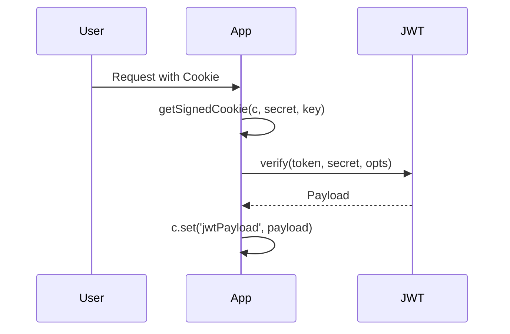

# Cookie Handling

<details>
<summary>Relevant source files</summary>

The following files were used as context for generating this wiki page:

- [src/utils/jwt/jwt.ts](https://github.com/honojs/hono/blob/main/src/utils/jwt/jwt.ts)
- [src/middleware/secure-headers/secure-headers.ts](https://github.com/honojs/hono/blob/main/src/middleware/secure-headers/secure-headers.ts)
- [src/context.ts](https://github.com/honojs/hono/blob/main/src/context.ts)
- [package.json](https://github.com/honojs/hono/blob/main/package.json)
- [src/adapter/aws-lambda/handler.ts](https://github.com/honojs/hono/blob/main/src/adapter/aws-lambda/handler.ts)
- [src/utils/cookie.ts](https://github.com/honojs/hono/blob/main/src/utils/cookie.ts)
- [src/middleware/cache/index.ts](https://github.com/honojs/hono/blob/main/src/middleware/cache/index.ts)
- [src/middleware/jwt/jwt.ts](https://github.com/honojs/hono/blob/main/src/middleware/jwt/jwt.ts)
- [src/middleware/jwk/jwk.ts](https://github.com/honojs/hono/blob/main/src/middleware/jwk/jwk.ts)
- [src/middleware/language/language.ts](https://github.com/honojs/hono/blob/main/src/middleware/language/language.ts)
- [src/helper/cookie/index.ts](https://github.com/honojs/hono/blob/main/src/helper/cookie/index.ts)
- [src/middleware/csrf/index.ts](https://github.com/honojs/hono/blob/main/src/middleware/csrf/index.ts)
- [src/middleware/cors/index.ts](https://github.com/honojs/hono/blob/main/src/middleware/cors/index.ts)
- [docs/MIGRATION.md](https://github.com/honojs/hono/blob/main/docs/MIGRATION.md)
- [src/helper/streaming/sse.ts](https://github.com/honojs/hono/blob/main/src/helper/streaming/sse.ts)
- [src/utils/jwt/jws.ts](https://github.com/honojs/hono/blob/main/src/utils/jwt/jws.ts)
- [src/types.ts](https://github.com/honojs/hono/blob/main/src/types.ts)
</details>

Cookie handling in Hono is designed around the principles of standard Web APIs and safe, cryptographically verifiable state management. By abstracting raw header parsing and providing a robust interface for cookie serialization, the system ensures consistent behavior across various runtime environments like Cloudflare Workers, Node.js, and Bun.

The architecture separates the low-level serialization/parsing logic from high-level developer helpers. This design allows Hono to provide both simple cookie manipulation and advanced features like signed cookies, which utilize HMAC-SHA256 signatures to prevent tampering. This is critical for maintaining session integrity in modern serverless environments.

Beyond basic storage, the subsystem integrates deeply with other middleware such as `jwt` and `language` detection. These components treat cookies as a reliable mechanism for persistence, whether for authentication tokens or locale preference caching. The framework enforces strict validation rules, such as verifying cookie prefix constraints (`__Host-` and `__Secure-`), to encourage best security practices out-of-the-box.

## Cookie Core Utilities

The core functionality resides in `src/utils/cookie.ts`, providing the primitives for parsing and serializing HTTP `Set-Cookie` headers. Serialization is guarded by regex-based validation of names (`/^[\w!#$%&'*.^`|~+-]+$/`) and values (`/^[ !#-:<-[\]-~]*$/`), which prevents injection of characters like newlines or semicolons that could lead to header splitting vulnerabilities.

### Signed Cookies Mechanism
Signed cookies provide an integrity layer. When using `serializeSigned`, the implementation computes a HMAC signature of the value using `crypto.subtle.sign`.

1.  `serializeSigned(name, value, secret)` calls `makeSignature`.
2.  `makeSignature` generates a signature using the provided secret and SHA-256.
3.  The final value becomes `value.signature`, which is then URL-encoded and serialized.

Sources: [src/utils/cookie.ts:264-274](https://github.com/honojs/hono/blob/main/src/utils/cookie.ts#L264-L274), [src/utils/cookie.ts:44-49](https://github.com/honojs/hono/blob/main/src/utils/cookie.ts#L44-L49), [src/utils/cookie.ts:26-37](https://github.com/honojs/hono/blob/main/src/utils/cookie.ts#L26-L37)

### Call Chain: Signed Cookie Creation
The process of signing a cookie is deterministic and enforces cryptographic standards:
`serializeSigned()` → `makeSignature()` → `getCryptoKey()`

-   `getCryptoKey()` imports the raw secret into an `HMAC` `CryptoKey` object using `SHA-256`.
-   `makeSignature()` processes the value via `crypto.subtle.sign`, returning a base64-encoded string.

Sources: [src/utils/cookie.ts:264-273](https://github.com/honojs/hono/blob/main/src/utils/cookie.ts#L264-L273), [src/utils/cookie.ts:43-48](https://github.com/honojs/hono/blob/main/src/utils/cookie.ts#L43-L48), [src/utils/cookie.ts:38-41](https://github.com/honojs/hono/blob/main/src/utils/cookie.ts#L38-L41)

## Cookie Helpers for Context

The `src/helper/cookie/index.ts` module bridges the utilities with the `Context` object. It provides the methods `getCookie`, `setCookie`, and `deleteCookie`, which perform header-level operations on the request and response.

| Method | Role | Primary Logic |
| :--- | :--- | :--- |
| `getCookie` | Reading | Parses the `Cookie` header from `c.req.raw`. |
| `setCookie` | Writing | Uses `serialize` and adds `Set-Cookie` header to `c`. |
| `deleteCookie`| Removal | Calls `setCookie` with `maxAge: 0`. |

Sources: [src/helper/cookie/index.ts:27-145](https://github.com/honojs/hono/blob/main/src/helper/cookie/index.ts#L27-L145)

> [!NOTE]
> `setCookie` uses `c.header(name, value, { append: true })`. This is crucial because multiple `Set-Cookie` headers are often necessary in a single HTTP response.

## Security Constraints and Guardrails

The implementation enforces standard security constraints for specific cookie prefixes to prevent common vulnerabilities like cross-site script injection or unauthorized overwrites.

> [!WARNING]
> Cookies prefixed with `__Host-` are strictly rejected if they contain a `Domain` attribute, have a path other than `/`, or lack the `Secure` flag.

-   `__Secure-` prefix: Requires the `Secure` attribute.
-   `__Host-` prefix: Requires `Secure` flag, `path: '/'`, and no `domain`.

Sources: [src/utils/cookie.ts:174-192](https://github.com/honojs/hono/blob/main/src/utils/cookie.ts#L174-L192)

## Integration: JWT Middleware

The JWT middleware (`src/middleware/jwt/jwt.ts`) can optionally extract tokens from cookies, demonstrating how Hono components compose cookie handling.



Sources: [src/middleware/jwt/jwt.ts:96-117](https://github.com/honojs/hono/blob/main/src/middleware/jwt/jwt.ts#L96-L117)

## Adapter Integration (AWS Lambda)

AWS Lambda environments require special handling of cookies because headers might be represented as `multiValueHeaders` or split into `cookies` arrays (v2 API). The `EventProcessor` abstraction ensures a unified interface.

The `EventProcessor` handles the translation between these platform-specific formats and the standard `Set-Cookie` header expected by Hono's `Response` objects.

Sources: [src/adapter/aws-lambda/handler.ts:388-401](https://github.com/honojs/hono/blob/main/src/adapter/aws-lambda/handler.ts#L388-L401)

## Design Trade-offs

| Design Choice | Benefit | Cost |
| :--- | :--- | :--- |
| **Object-based Parsing** | Easy access via key; deduplication. | Allocates new map/object per parse. |
| **URL Decoding** | Handles special characters in values safely. | Small performance hit on every read. |
| **HMAC Signatures** | Prevents tampering/forgery. | Requires a persistent secret key. |
| **Regex Validation** | Stops header injection attacks. | Slight overhead on every serialize call. |

Sources: [src/utils/cookie.ts:70-77](https://github.com/honojs/hono/blob/main/src/utils/cookie.ts#L70-L77), [src/utils/cookie.ts:129-130](https://github.com/honojs/hono/blob/main/src/utils/cookie.ts#L129-L130)

## Worked Example

This example demonstrates how to set a secure, signed cookie and verify it in a subsequent request.

```typescript
import { Hono } from 'hono'
import { setSignedCookie, getSignedCookie } from 'hono/cookie'

const app = new Hono()
const SECRET = 'my-super-secret'

app.get('/set', async (c) => {
  await setSignedCookie(c, 'session', 'user_123', SECRET, {
    path: '/',
    secure: true,
    httpOnly: true,
    prefix: 'secure'
  })
  return c.text('Cookie set')
})

app.get('/get', async (c) => {
  const value = await getSignedCookie(c, SECRET, 'session', 'secure')
  return c.text(`Session value: ${value}`)
})
```

Sources: [src/helper/cookie/index.ts:130-145](https://github.com/honojs/hono/blob/main/src/helper/cookie/index.ts#L130-L145)

## Related

- [[Request Context]]

