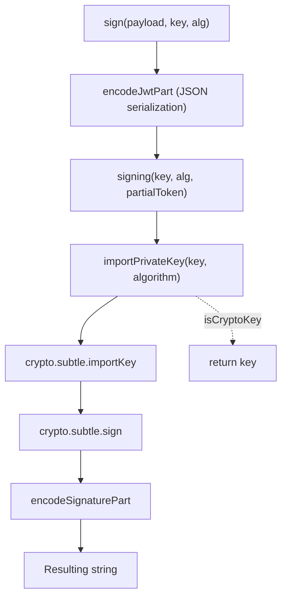

# Cryptography and Tokens

<details>
<summary>Relevant source files</summary>

The following files were used as context for generating this wiki page:

- [src/utils/jwt/jwt.ts](https://github.com/honojs/hono/blob/main/src/utils/jwt/jwt.ts)
- [src/middleware/secure-headers/secure-headers.ts](https://github.com/honojs/hono/blob/main/src/middleware/secure-headers/secure-headers.ts)
- [src/middleware/jwt/jwt.ts](https://github.com/honojs/hono/blob/main/src/middleware/jwt/jwt.ts)
- [src/middleware/jwk/jwk.ts](https://github.com/honojs/hono/blob/main/src/middleware/jwk/jwk.ts)
- [src/middleware/bearer-auth/index.ts](https://github.com/honojs/hono/blob/main/src/middleware/bearer-auth/index.ts)
- [src/utils/jwt/jws.ts](https://github.com/honojs/hono/blob/main/src/utils/jwt/jws.ts)
- [src/utils/cookie.ts](https://github.com/honojs/hono/blob/main/src/utils/cookie.ts)
- [package.json](https://github.com/honojs/hono/blob/main/package.json)
- [src/middleware/jwk/keys.test.json](https://github.com/honojs/hono/blob/main/src/middleware/jwk/keys.test.json)
- [src/utils/crypto.ts](https://github.com/honojs/hono/blob/main/src/utils/crypto.ts)
- [src/middleware/csrf/index.ts](https://github.com/honojs/hono/blob/main/src/middleware/csrf/index.ts)
- [src/middleware/etag/digest.ts](https://github.com/honojs/hono/blob/main/src/middleware/etag/digest.ts)
- [src/middleware/etag/index.ts](https://github.com/honojs/hono/blob/main/src/middleware/etag/index.ts)
- [src/utils/buffer.ts](https://github.com/honojs/hono/blob/main/src/utils/buffer.ts)
- [src/jsx/utils.ts](https://github.com/honojs/hono/blob/main/src/jsx/utils.ts)
- [src/utils/jwt/types.ts](https://github.com/honojs/hono/blob/main/src/utils/jwt/types.ts)
- [src/utils/jwt/jwa.ts](https://github.com/honojs/hono/blob/main/src/utils/jwt/jwa.ts)
- [src/utils/jwt/index.ts](https://github.com/honojs/hono/blob/main/src/utils/jwt/index.ts)
- [src/middleware/jwk/index.ts](https://github.com/honojs/hono/blob/main/src/middleware/jwk/index.ts)
- [src/middleware/jwt/index.ts](https://github.com/honojs/hono/blob/main/src/middleware/jwt/index.ts)
- [src/utils/jwt/utf8.ts](https://github.com/honojs/hono/blob/main/src/utils/jwt/utf8.ts)
- [src/utils/ipaddr.ts](https://github.com/honojs/hono/blob/main/src/utils/ipaddr.ts)
- [src/middleware/basic-auth/index.ts](https://github.com/honojs/hono/blob/main/src/middleware/basic-auth/index.ts)
- [src/utils/encode.ts](https://github.com/honojs/hono/blob/main/src/utils/encode.ts)
- [src/utils/accept.ts](https://github.com/honojs/hono/blob/main/src/utils/accept.ts)
- [src/utils/basic-auth.ts](https://github.com/honojs/hono/blob/main/src/utils/basic-auth.ts)
- [src/utils/types.ts](https://github.com/honojs/hono/blob/main/src/utils/types.ts)
- [src/helper/cookie/index.ts](https://github.com/honojs/hono/blob/main/src/helper/cookie/index.ts)
- [src/middleware/secure-headers/permissions-policy.ts](https://github.com/honojs/hono/blob/main/src/middleware/secure-headers/permissions-policy.ts)
- [src/utils/headers.ts](https://github.com/honojs/hono/blob/main/src/utils/headers.ts)
</details>

The "Cryptography and Tokens" subsystem in Hono provides a robust foundation for securing web applications through standards-compliant authentication, authorization, and message integrity. It serves as the primary mechanism for handling JSON Web Tokens (JWT), JSON Web Signatures (JWS), and cryptographically signed cookies, ensuring that sensitive data transmitted between client and server remains authentic and tamper-resistant. By leveraging native browser or runtime Web Crypto APIs, the system achieves performant, secure operations without external dependencies, maintaining a small footprint suitable for various JavaScript environments.

The architecture is designed to support modular security requirements, ranging from simple bearer token authentication to complex JWK (JSON Web Key) set rotations. By decoupling cryptographic operations—such as key importing, signing, and verification—from the middleware layer, Hono allows developers to implement security policies flexibly. These components provide crucial protection against common vulnerabilities, including algorithm confusion attacks in JWTs, CSRF attacks via origin validation, and timing attacks through constant-time comparison utilities.

This subsystem integrates seamlessly with Hono’s request lifecycle. Middleware handlers process incoming headers or cookies, validate credentials against configured secrets or keys, and optionally enrich the context with verified payloads. This approach ensures that downstream handlers only execute when security invariants are strictly satisfied, simplifying the security contract between the infrastructure and application logic.

## JSON Web Token (JWT) Infrastructure

The core JWT infrastructure utilizes a structured approach to sign and verify tokens using both symmetric and asymmetric algorithms. The signing process begins by serializing the header and payload into Base64URL-encoded strings, creating a "partial token." This partial token is then passed to the `signing` function, which converts the provided key (either a raw string or a `CryptoKey`) into a usable cryptographic key using `crypto.subtle.importKey`. 

The mechanism for verification follows a strict validation pipeline:
1. **Splitting and Decoding**: The token is split into three parts; the header is decoded and verified to ensure it conforms to `TokenHeader` requirements.
2. **Algorithm Validation**: The system checks the `alg` field against the provided configuration to prevent algorithm confusion.
3. **Payload Claim Verification**: Optional checks for `nbf` (Not Before), `exp` (Expiration), `iat` (Issued At), `iss` (Issuer), and `aud` (Audience) are performed.
4. **Signature Verification**: Finally, the signature is verified against the public key using `verifying`.

> [!IMPORTANT]
> The `verifyWithJwks` function specifically rejects symmetric algorithms (HS256, HS384, HS512) to prevent algorithm confusion attacks where an attacker forces the use of a public key as an HMAC secret.

Sources: [src/utils/jwt/jwt.ts:56-188](https://github.com/honojs/hono/blob/main/src/utils/jwt/jwt.ts#L56-L188), [src/utils/jwt/jwt.ts:197-262](https://github.com/honojs/hono/blob/main/src/utils/jwt/jwt.ts#L197-L262), [src/utils/jwt/jws.ts:29-47](https://github.com/honojs/hono/blob/main/src/utils/jwt/jws.ts#L29-L47)

## Call Chain: Token Signing

When `sign` is invoked, it coordinates several steps to produce the final token string:



Sources: [src/utils/jwt/jwt.ts:56-76](https://github.com/honojs/hono/blob/main/src/utils/jwt/jwt.ts#L56-L76), [src/utils/jwt/jws.ts:29-37](https://github.com/honojs/hono/blob/main/src/utils/jwt/jws.ts#L29-L37), [src/utils/jwt/jws.ts:54-76](https://github.com/honojs/hono/blob/main/src/utils/jwt/jws.ts#L54-L76)

## Cookie Signing Mechanism

Cookie operations support signing to ensure content integrity. The `serializeSigned` function generates a signature using HMAC-SHA256. The resulting signature is base64-encoded (always 44 characters long). Verification in `parseSigned` extracts the signature and uses `crypto.subtle.verify` to validate the original value.

> [!NOTE]
> Cookie signatures are appended to the value with a dot separator (`value.signature`). The `parseSigned` logic specifically rejects any signature that does not match the 44-character length requirement or lacks the expected padding.

Sources: [src/utils/cookie.ts:37-66](https://github.com/honojs/hono/blob/main/src/utils/cookie.ts#L37-L66), [src/utils/cookie.ts:140-165](https://github.com/honojs/hono/blob/main/src/utils/cookie.ts#L140-L165), [src/utils/cookie.ts:264-275](https://github.com/honojs/hono/blob/main/src/utils/cookie.ts#L264-L275)

## Secure Headers and Nonces

The `secureHeaders` middleware provides a `NONCE` generator for CSP (Content Security Policy) directives. When initialized, the `NONCE` handler checks the context for an existing nonce; if none exists, it generates a cryptographically strong 16-byte random value using `crypto.getRandomValues`.

Sources: [src/middleware/secure-headers/secure-headers.ts:131-145](https://github.com/honojs/hono/blob/main/src/middleware/secure-headers/secure-headers.ts#L131-L145)

## Timing-Safe Comparison

To prevent timing attacks—where an attacker measures the time taken for string comparisons to guess secrets—the subsystem includes `timingSafeEqual`. This utility treats secret values as hashes before comparison, ensuring that the time taken is independent of the actual character match, provided the lengths match or are normalized through hashing.

Sources: [src/utils/buffer.ts:44-96](https://github.com/honojs/hono/blob/main/src/utils/buffer.ts#L44-L96)

## CSRF Protection Mechanism

The `csrf` middleware protects against cross-site attacks by validating the `Origin` or `Sec-Fetch-Site` headers. The mechanism evaluates the request using handlers that prioritize internal configuration:

| Condition | Handler Logic |
| :--- | :--- |
| **Origin** | If no origin provided, compare against `new URL(c.req.url).origin`. |
| **Sec-Fetch-Site** | Only allows `same-origin` by default. |

> [!WARNING]
> The `csrf` middleware only applies to unsafe methods (e.g., POST) when the content type matches standard form submission types (application/x-www-form-urlencoded, multipart/form-data, text/plain).

Sources: [src/middleware/csrf/index.ts:95-144](https://github.com/honojs/hono/blob/main/src/middleware/csrf/index.ts#L95-L144)

## Worked Example: JWT Authentication

The following example demonstrates how to protect a route using the `jwt` middleware with a secret key and HS256 algorithm.

```typescript
import { Hono } from 'hono'
import { jwt } from 'hono/jwt'

const app = new Hono()

// Apply JWT middleware to all /auth/* routes
app.use(
  '/auth/*',
  jwt({
    secret: 'my-super-secret-key',
    alg: 'HS256',
  })
)

app.get('/auth/protected', (c) => {
  // Access the verified payload
  const payload = c.get('jwtPayload')
  return c.json({ message: 'Authorized', user: payload.sub })
})
```
Sources: [src/middleware/jwt/jwt.ts:35-52](https://github.com/honojs/hono/blob/main/src/middleware/jwt/jwt.ts#L35-L52)

## Related

- [[Authentication]]

