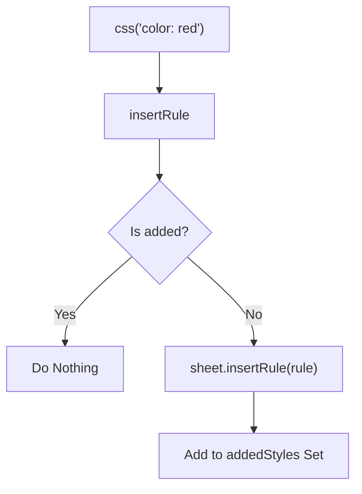

# CSS Styling

<details>
<summary>Relevant source files</summary>

The following files were used as context for generating this wiki page:

- [src/jsx/dom/render.ts](https://github.com/honojs/hono/blob/main/src/jsx/dom/render.ts)
- [src/helper/css/common.ts](https://github.com/honojs/hono/blob/main/src/helper/css/common.ts)
- [src/jsx/context.ts](https://github.com/honojs/hono/blob/main/src/jsx/context.ts)
- [src/jsx/components.ts](https://github.com/honojs/hono/blob/main/src/jsx/components.ts)
- [src/helper/css/index.ts](https://github.com/honojs/hono/blob/main/src/helper/css/index.ts)
- [src/jsx/hooks/index.ts](https://github.com/honojs/hono/blob/main/src/jsx/hooks/index.ts)
- [src/jsx/base.ts](https://github.com/honojs/hono/blob/main/src/jsx/base.ts)
- [package.json](https://github.com/honojs/hono/blob/main/package.json)
- [src/jsx/dom/intrinsic-element/components.ts](https://github.com/honojs/hono/blob/main/src/jsx/dom/intrinsic-element/components.ts)
- [src/jsx/dom/css.ts](https://github.com/honojs/hono/blob/main/src/jsx/dom/css.ts)
- [src/jsx/streaming.ts](https://github.com/honojs/hono/blob/main/src/jsx/streaming.ts)
- [src/jsx/utils.ts](https://github.com/honojs/hono/blob/main/src/jsx/utils.ts)
- [src/helper/ssg/ssg.ts](https://github.com/honojs/hono/blob/main/src/helper/ssg/ssg.ts)
- [src/jsx/intrinsic-element/components.ts](https://github.com/honojs/hono/blob/main/src/jsx/intrinsic-element/components.ts)
- [src/jsx/jsx-runtime.ts](https://github.com/honojs/hono/blob/main/src/jsx/jsx-runtime.ts)
- [src/middleware/jsx-renderer/index.ts](https://github.com/honojs/hono/blob/main/src/middleware/jsx-renderer/index.ts)
- [src/utils/html.ts](https://github.com/honojs/hono/blob/main/src/utils/html.ts)
- [src/jsx/dom/client.ts](https://github.com/honojs/hono/blob/main/src/jsx/dom/client.ts)
- [src/jsx/intrinsic-element/common.ts](https://github.com/honojs/hono/blob/main/src/jsx/intrinsic-element/common.ts)
- [src/jsx/intrinsic-elements.ts](https://github.com/honojs/hono/blob/main/src/jsx/intrinsic-elements.ts)
</details>

CSS Styling in Hono provides a mechanism for writing CSS-in-JS that works consistently across both server-side (SSR) and client-side (DOM) environments. It aims to solve the challenge of generating scoped, performant CSS class names without relying on heavy external dependencies, while maintaining compatibility with Hono's lightweight JSX renderer.

At its core, the CSS subsystem manages the generation of unique class names via hashing, minification of style rules, and efficient injection into the DOM or output stream. By abstracting the differences between environments, it allows developers to use a unified `css` helper to define styles directly within their components, ensuring that styles are correctly scoped and injected as needed.

The subsystem interacts heavily with the JSX renderer, as it relies on component lifecycle hooks and stream-aware callbacks to handle the asynchronous nature of CSS injection. Whether rendering to a string on the server or updating the DOM on the client, the CSS logic tracks which styles have been used, ensuring minimal redundancy and optimal insertion points.

## The Public API Surface

The CSS styling subsystem exposes four primary functions for managing styles, all originating from a context-aware factory. These functions are exposed globally by default but can be extended if multiple contexts are required.

| Function | Signature | Purpose |
| :--- | :--- | :--- |
| `css` | `(strings, ...values) => string` | Defines a scoped CSS class. |
| `cx` | `(...args) => string` | Combines multiple class names or conditional styles. |
| `keyframes` | `(strings, ...values) => CssClassName` | Defines global CSS keyframes. |
| `viewTransition` | `(strings, ...values) => string` | Defines a view transition. |
| `Style` | `({ nonce }) => HtmlEscapedString` | Defines a component to inject the generated CSS `<style>` block. |

Sources: [src/helper/css/index.ts:169-213](https://github.com/honojs/hono/blob/main/src/helper/css/index.ts#L169-L213), [src/jsx/dom/css.ts:196-224](https://github.com/honojs/hono/blob/main/src/jsx/dom/css.ts#L196-L224)

## CSS Hashing and Normalization Mechanism

The system determines the uniqueness of a style rule by hashing the input CSS string. This ensures that identical styles defined in different parts of an application share the same class name, reducing the payload size of the generated stylesheet.

1.  **Label Extraction:** The `buildStyleString` function first parses the template string to extract an optional `/* label */` comment, which aids in debugging.
2.  **Minification:** Styles are passed through a `minify` regex that removes extraneous whitespace, multi-line comments, and single-line comments.
3.  **Hashing:** The final minified string (concatenated with the label) is passed to `toHash`, which performs a basic multiplicative hash: `out = (101 * out + charCode)`.
4.  **Slugification:** If a `ClassNameSlug` function is provided, it can override the default hash (`css-<number>`) with a human-readable name, provided the slug is a valid CSS identifier.

Sources: [src/helper/css/common.ts:43-50](https://github.com/honojs/hono/blob/main/src/helper/css/common.ts#L43-L50), [src/helper/css/common.ts:139-199](https://github.com/honojs/hono/blob/main/src/helper/css/common.ts#L139-L199), [src/helper/css/common.ts:207-224](https://github.com/honojs/hono/blob/main/src/helper/css/common.ts#L207-L224)

## DOM-Specific Injection

When running in the browser, the `hono/jsx/dom/css` module takes over to inject rules dynamically using the `CSSStyleSheet` API.

1.  **Find or Create Sheet:** Upon the first style request, `findStyleSheet` attempts to locate the `<style id="hono-css">` element. If it exists, it retrieves the `sheet` property.
2.  **Rule Insertion:** The `insertRule` function checks an `addedStyles` `Set` (stored directly on the sheet object for persistence) to determine if the rule has already been injected.
3.  **Dynamic Update:** If not present, `sheet.insertRule` is called. For complex rules, `splitRule` is used to handle nested structures, ensuring each component rule is processed individually.


Sources: [src/jsx/dom/css.ts:78-90](https://github.com/honojs/hono/blob/main/src/jsx/dom/css.ts#L78-L90), [src/jsx/dom/css.ts:92-113](https://github.com/honojs/hono/blob/main/src/jsx/dom/css.ts#L92-L113)

## Server-Side Injection via Callbacks

On the server, styles cannot be injected via `insertRule` because the HTML document is already being streamed. Instead, the CSS helper leverages Hono's `HtmlEscapedCallback` system to defer the output of style tags until the last possible moment.

1.  **Callback Registration:** When `newCssClassNameObject` is called, it attaches a callback to the `HtmlEscapedString`. This callback is responsible for appending the style definition to the `<style>` tag when the document reaches the `BeforeStream` phase.
2.  **Buffering:** The `addClassNameToContext` callback tracks which styles have been collected in the current request context using a `WeakMap`.
3.  **Deferred Execution:** Once the stream is ready, the callback iterates through the collected unique class names, generates a combined style string, and performs a regex replacement on the `buffer` (which contains the `<style>` tag) to inject the styles.

> [!NOTE]
> The use of a `WeakMap<object, usedClassNameData>` ensures that CSS state is isolated per request, preventing style leaking between concurrent server-side renders.

Sources: [src/helper/css/index.ts:88-122](https://github.com/honojs/hono/blob/main/src/helper/css/index.ts#L88-L122), [src/helper/css/index.ts:124-147](https://github.com/honojs/hono/blob/main/src/helper/css/index.ts#L124-L147)

## Worked Example

This example demonstrates how to define styles and integrate them into a component that uses the `Style` component for automatic injection.

```typescript
import { css, Style } from 'hono/css'

const primaryColor = 'blue'

// Define the style
const myStyle = css`
  /* label: my-button */
  background-color: ${primaryColor};
  color: white;
  padding: 10px;
`

// Use the style in a component
export const Button = () => (
  <>
    <Style />
    <button class={myStyle}>Click Me</button>
  </>
)
```

Sources: [src/helper/css/index.ts:169-171](https://github.com/honojs/hono/blob/main/src/helper/css/index.ts#L169-L171), [src/helper/css/index.ts:192-203](https://github.com/honojs/hono/blob/main/src/helper/css/index.ts#L192-L203)

## Design Trade-offs

| Design Choice | Benefit | Cost |
| :--- | :--- | :--- |
| **String Hashing** | Identical styles result in one CSS class. | CPU overhead per style definition on first render. |
| **Callback-based injection** | Enables streaming without blocking the response. | Complex management of HTML buffer state and regex replacements. |
| **WeakMap Context Isolation** | Prevents state leakage between concurrent requests. | Slightly higher memory usage per request. |

Sources: [src/helper/css/common.ts:43-50](https://github.com/honojs/hono/blob/main/src/helper/css/common.ts#L43-L50), [src/helper/css/index.ts:83-84](https://github.com/honojs/hono/blob/main/src/helper/css/index.ts#L83-L84), [src/helper/css/index.ts:89-122](https://github.com/honojs/hono/blob/main/src/helper/css/index.ts#L89-L122)

## Related

- [[JSX Components]]

