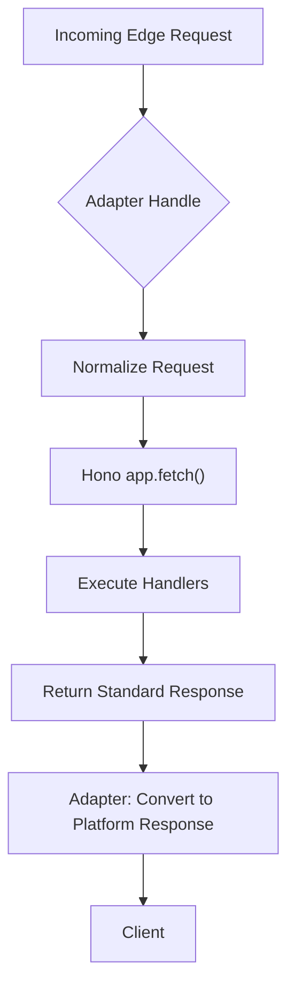
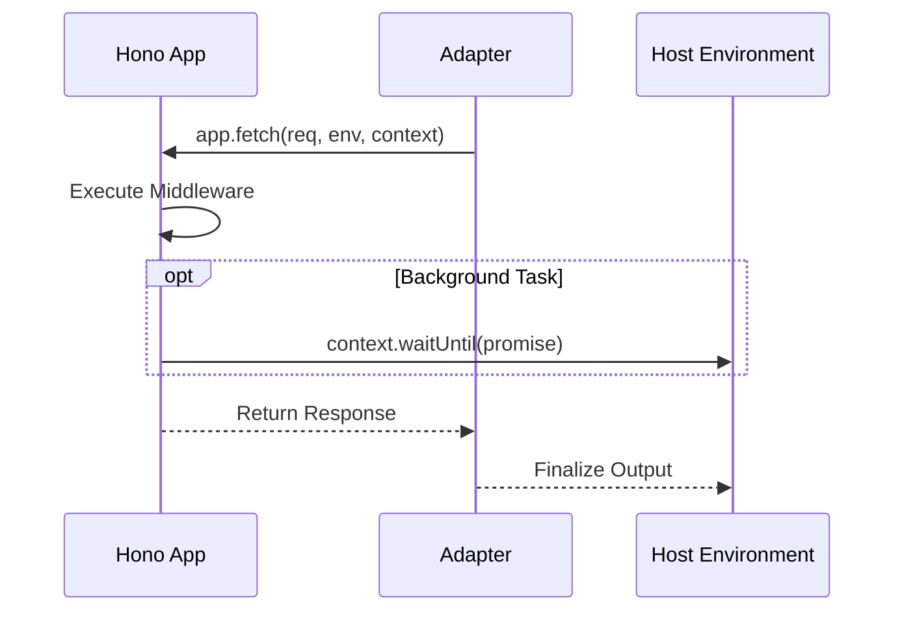

# Edge Workers

<details>
<summary>Relevant source files</summary>

The following files were used as context for generating this wiki page:

- [package.json](https://github.com/honojs/hono/blob/main/package.json)
- [src/adapter/cloudflare-pages/handler.ts](https://github.com/honojs/hono/blob/main/src/adapter/cloudflare-pages/handler.ts)
- [src/adapter/aws-lambda/handler.ts](https://github.com/honojs/hono/blob/main/src/adapter/aws-lambda/handler.ts)
- [jsr.json](https://github.com/honojs/hono/blob/main/jsr.json)
- [src/middleware/cache/index.ts](https://github.com/honojs/hono/blob/main/src/middleware/cache/index.ts)
- [src/helper/ssg/ssg.ts](https://github.com/honojs/hono/blob/main/src/helper/ssg/ssg.ts)
- [src/adapter/lambda-edge/handler.ts](https://github.com/honojs/hono/blob/main/src/adapter/lambda-edge/handler.ts)
- [src/utils/url.ts](https://github.com/honojs/hono/blob/main/src/utils/url.ts)
- [src/adapter/cloudflare-workers/index.ts](https://github.com/honojs/hono/blob/main/src/adapter/cloudflare-workers/index.ts)
- [src/adapter/cloudflare-pages/index.ts](https://github.com/honojs/hono/blob/main/src/adapter/cloudflare-pages/index.ts)
- [src/adapter/cloudflare-workers/serve-static-module.ts](https://github.com/honojs/hono/blob/main/src/adapter/cloudflare-workers/serve-static-module.ts)
- [runtime-tests/workerd/index.ts](https://github.com/honojs/hono/blob/main/runtime-tests/workerd/index.ts)
- [src/adapter/cloudflare-workers/utils.ts](https://github.com/honojs/hono/blob/main/src/adapter/cloudflare-workers/utils.ts)
- [src/adapter/netlify/mod.ts](https://github.com/honojs/hono/blob/main/src/adapter/netlify/mod.ts)
- [src/adapter/vercel/index.ts](https://github.com/honojs/hono/blob/main/src/adapter/vercel/index.ts)
- [src/adapter/vercel/handler.ts](https://github.com/honojs/hono/blob/main/src/adapter/vercel/handler.ts)
- [src/adapter/lambda-edge/conninfo.ts](https://github.com/honojs/hono/blob/main/src/adapter/lambda-edge/conninfo.ts)
- [src/adapter/cloudflare-workers/websocket.ts](https://github.com/honojs/hono/blob/main/src/adapter/cloudflare-workers/websocket.ts)
- [src/adapter/netlify/handler.ts](https://github.com/honojs/hono/blob/main/src/adapter/netlify/handler.ts)
- [src/adapter/cloudflare-workers/serve-static.ts](https://github.com/honojs/hono/blob/main/src/adapter/cloudflare-workers/serve-static.ts)
- [src/helper/adapter/index.ts](https://github.com/honojs/hono/blob/main/src/helper/adapter/index.ts)
- [src/adapter/cloudflare-pages/conninfo.ts](https://github.com/honojs/hono/blob/main/src/adapter/cloudflare-pages/conninfo.ts)
- [src/adapter/lambda-edge/index.ts](https://github.com/honojs/hono/blob/main/src/adapter/lambda-edge/index.ts)
- [src/adapter/cloudflare-workers/conninfo.ts](https://github.com/honojs/hono/blob/main/src/adapter/cloudflare-workers/conninfo.ts)
- [src/adapter/vercel/conninfo.ts](https://github.com/honojs/hono/blob/main/src/adapter/vercel/conninfo.ts)
- [src/adapter/service-worker/index.ts](https://github.com/honojs/hono/blob/main/src/adapter/service-worker/index.ts)
- [src/adapter/service-worker/types.ts](https://github.com/honojs/hono/blob/main/src/adapter/service-worker/types.ts)
- [src/adapter/bun/index.ts](https://github.com/honojs/hono/blob/main/src/adapter/bun/index.ts)
- [README.md](https://github.com/honojs/hono/blob/main/README.md)
</details>

Edge Workers represent a paradigm shift in server-side computing, moving execution from centralized data centers to geographically distributed nodes closer to the user. In the Hono ecosystem, these workers facilitate high-performance, low-latency applications by leveraging platform-specific APIs and standard `Request`/`Response` objects, ensuring portability across multiple environments.

The architectural challenge of "Edge Workers" is unifying disparate runtime interfaces (e.g., Cloudflare Workers, Lambda@Edge, Vercel) under a consistent API that feels native to every platform. Hono achieves this through a robust adapter layer that transforms platform-specific events into standard Hono `Request` objects, executes the application logic, and maps the resulting responses back to the expected output format of the host environment.

This subsystem provides the foundation for "Build Once, Run Anywhere." By abstracting away the platform-specific glue code, Hono allows developers to write consistent application code while maintaining the performance benefits of local-edge execution. This consistency is maintained even when dealing with varied event triggers, such as CloudFront events in Lambda@Edge or `EventContext` in Cloudflare Pages.

## Core Architecture and Adapter Pattern

The core mechanism for supporting edge environments relies on the Adapter pattern. Every edge adapter implements a `handle` function that acts as a bridge between the host environment and the Hono `app.fetch` entry point. The primary responsibility of this bridge is to normalize the incoming environment-specific event (like `CloudFrontEdgeEvent` or `EventContext`) into a Web Standard `Request` object and provide a suitable environment context to the Hono instance.


Sources: [src/adapter/cloudflare-pages/handler.ts:32-46](https://github.com/honojs/hono/blob/main/src/adapter/cloudflare-pages/handler.ts#L32-L46), [src/adapter/aws-lambda/handler.ts:239-276](https://github.com/honojs/hono/blob/main/src/adapter/aws-lambda/handler.ts#L239-L276)

## Request Normalization

Adapters are responsible for reconstructing a valid standard `Request` object. Because each platform delivers events in different structures (e.g., `APIGatewayProxyEvent` vs `CloudFrontRequest`), the adapter uses environment-specific logic to extract path, headers, and body data consistently.

For instance, in AWS Lambda, the `getProcessor` helper identifies the specific event type (`ALBProxyEvent`, `APIGatewayProxyEventV2`, etc.) and returns the corresponding processor to handle the translation to a Hono-compatible `Request`. This ensures that the application receives a unified `Request` instance regardless of how the request reached the Lambda function.

> [!TIP]
> The normalization logic relies on helper functions such as `isProxyEventALB` and `isProxyEventV2` to identify the incoming event format. Always verify the specific processor's implementation in `src/adapter/aws-lambda/handler.ts` when debugging environment-specific request header or path issues.

Sources: [src/adapter/aws-lambda/handler.ts:625-637](https://github.com/honojs/hono/blob/main/src/adapter/aws-lambda/handler.ts#L625-L637), [src/adapter/aws-lambda/handler.ts:639-658](https://github.com/honojs/hono/blob/main/src/adapter/aws-lambda/handler.ts#L639-L658)

## Response Mapping and Binary Handling

Translating Hono's `Response` back to the host environment is the most critical operation for ensuring binary compatibility and correct encoding. Host environments have specific requirements regarding how binary data is transmitted (often requiring base64 encoding).

The mapping process involves:
1. Identifying if the response content is binary.
2. Checking for binary encodings (e.g., `content-encoding` other than `identity`).
3. Converting the body buffer if needed using `encodeBase64`.

| Host Environment | Data Encoding | Key Feature |
| :--- | :--- | :--- |
| Lambda@Edge | base64 (if binary) | `bodyEncoding` header support |
| AWS Lambda | base64 (if binary) | Multi-value header support |
| Cloudflare | ReadableStream | Native `FetcherLike` support |

Sources: [src/adapter/aws-lambda/handler.ts:344-386](https://github.com/honojs/hono/blob/main/src/adapter/aws-lambda/handler.ts#L344-L386), [src/adapter/lambda-edge/handler.ts:149-162](https://github.com/honojs/hono/blob/main/src/adapter/lambda-edge/handler.ts#L149-L162)

## Connection Information Retrieval

Edge environments provide connection-specific metadata, such as the remote IP address, via specific headers. Hono provides a standardized `getConnInfo` helper that shields the application developer from needing to know which header (e.g., `cf-connecting-ip`, `x-real-ip`) is used by which provider.

This function extracts the `address` from the normalized context:
- Cloudflare Pages: Uses `cf-connecting-ip`.
- Vercel: Uses `x-real-ip`.
- Lambda@Edge: Uses `clientIp` from the CloudFront event.

Sources: [src/adapter/cloudflare-pages/conninfo.ts:22-26](https://github.com/honojs/hono/blob/main/src/adapter/cloudflare-pages/conninfo.ts#L22-L26), [src/adapter/vercel/conninfo.ts:3-8](https://github.com/honojs/hono/blob/main/src/adapter/vercel/conninfo.ts#L3-L8)

## Lifecycle Management and `waitUntil`

Edge environments, particularly Cloudflare Workers, utilize `waitUntil` to handle asynchronous tasks that must complete after the response is sent to the client (e.g., logging or background caching). Hono’s adapters bridge the host’s `waitUntil` function into the application context, allowing standard Hono middleware to participate in the lifecycle.


Sources: [src/adapter/cloudflare-pages/handler.ts:39-44](https://github.com/honojs/hono/blob/main/src/adapter/cloudflare-pages/handler.ts#L39-L44), [src/adapter/cloudflare-workers/serve-static.ts:24-42](https://github.com/honojs/hono/blob/main/src/adapter/cloudflare-workers/serve-static.ts#L24-L42)

## Example: Configuring an Edge Handler

To implement an edge handler, use the `handle` function exported by the relevant adapter. This enables the Hono app to listen for events from the host.

```typescript
import { Hono } from 'hono'
import { handle } from 'hono/aws-lambda'

const app = new Hono()

app.get('/', (c) => c.text('Hello from Lambda!'))

// The adapter normalizes the incoming Lambda event for the Hono app
export const handler = handle(app)
```
Sources: [src/adapter/aws-lambda/handler.ts:211-222](https://github.com/honojs/hono/blob/main/src/adapter/aws-lambda/handler.ts#L211-L222)

## Related

- [[Serverless Adapters]]
- [[Local Runtimes]]

