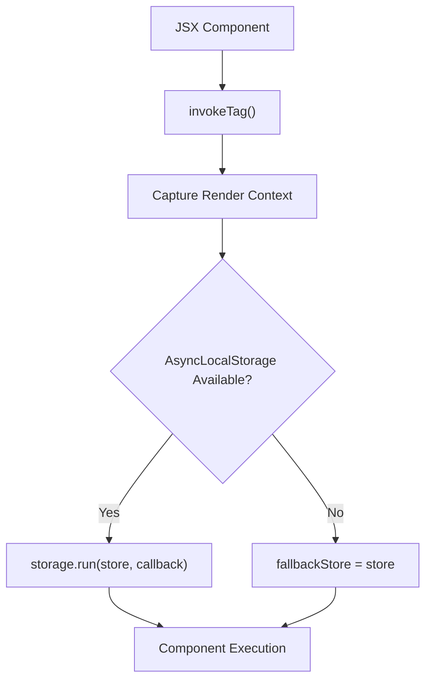
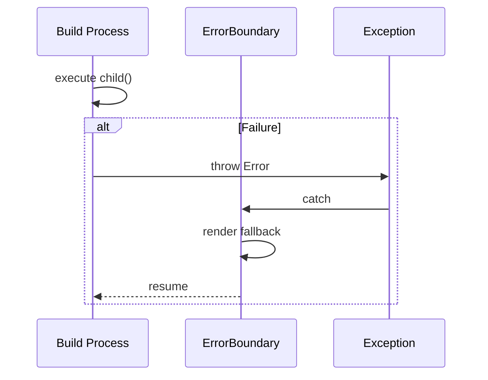

# JSX Components

Relevant source files

The following files were used as context for generating this wiki page:

- [src/jsx/dom/render.ts](https://github.com/honojs/hono/blob/main/src/jsx/dom/render.ts)
- [src/jsx/context.ts](https://github.com/honojs/hono/blob/main/src/jsx/context.ts)
- [src/jsx/components.ts](https://github.com/honojs/hono/blob/main/src/jsx/components.ts)
- [src/jsx/base.ts](https://github.com/honojs/hono/blob/main/src/jsx/base.ts)
- [src/jsx/dom/intrinsic-element/components.ts](https://github.com/honojs/hono/blob/main/src/jsx/dom/intrinsic-element/components.ts)
- [src/jsx/hooks/index.ts](https://github.com/honojs/hono/blob/main/src/jsx/hooks/index.ts)
- [src/jsx/streaming.ts](https://github.com/honojs/hono/blob/main/src/jsx/streaming.ts)
- [src/jsx/intrinsic-element/components.ts](https://github.com/honojs/hono/blob/main/src/jsx/intrinsic-element/components.ts)
- [src/jsx/jsx-runtime.ts](https://github.com/honojs/hono/blob/main/src/jsx/jsx-runtime.ts)
- [src/jsx/intrinsic-elements.ts](https://github.com/honojs/hono/blob/main/src/jsx/intrinsic-elements.ts)
- [src/middleware/jsx-renderer/index.ts](https://github.com/honojs/hono/blob/main/src/middleware/jsx-renderer/index.ts)
- [src/jsx/dom/css.ts](https://github.com/honojs/hono/blob/main/src/jsx/dom/css.ts)
- [src/jsx/dom/client.ts](https://github.com/honojs/hono/blob/main/src/jsx/dom/client.ts)
- [src/jsx/index.ts](https://github.com/honojs/hono/blob/main/src/jsx/index.ts)
- [src/helper/css/index.ts](https://github.com/honojs/hono/blob/main/src/helper/css/index.ts)
- [src/jsx/dom/server.ts](https://github.com/honojs/hono/blob/main/src/jsx/dom/server.ts)
- [src/jsx/dom/jsx-dev-runtime.ts](https://github.com/honojs/hono/blob/main/src/jsx/dom/jsx-dev-runtime.ts)
- [src/utils/html.ts](https://github.com/honojs/hono/blob/main/src/utils/html.ts)
- [src/jsx/dom/components.ts](https://github.com/honojs/hono/blob/main/src/jsx/dom/components.ts)
- [src/jsx/jsx-dev-runtime.ts](https://github.com/honojs/hono/blob/main/src/jsx/jsx-dev-runtime.ts)
- [src/jsx/dom/index.ts](https://github.com/honojs/hono/blob/main/src/jsx/dom/index.ts)
- [src/jsx/dom/context.ts](https://github.com/honojs/hono/blob/main/src/jsx/dom/context.ts)
- [src/jsx/constants.ts](https://github.com/honojs/hono/blob/main/src/jsx/constants.ts)
- [src/jsx/dom/jsx-runtime.ts](https://github.com/honojs/hono/blob/main/src/jsx/dom/jsx-runtime.ts)
- [src/jsx/dom/hooks/index.ts](https://github.com/honojs/hono/blob/main/src/jsx/dom/hooks/index.ts)
- [src/jsx/types.ts](https://github.com/honojs/hono/blob/main/src/jsx/types.ts)
- [src/jsx/intrinsic-element/common.ts](https://github.com/honojs/hono/blob/main/src/jsx/intrinsic-element/common.ts)
- [runtime-tests/deno-jsx/deno.react-jsx.json](https://github.com/honojs/hono/blob/main/runtime-tests/deno-jsx/deno.react-jsx.json)
- [runtime-tests/deno-jsx/deno.precompile.json](https://github.com/honojs/hono/blob/main/runtime-tests/deno-jsx/deno.precompile.json)
- [package.json](https://github.com/honojs/hono/blob/main/package.json)

Hono’s JSX implementation provides a highly optimized, dual-mode system for creating UI components that can render both on the server (SSR/Streaming) and the client (DOM). By providing a unified interface for defining functional components and intrinsic elements, it enables developers to write UI code once while the underlying runtime adapts to the target environment, whether generating static HTML strings or manipulating live DOM nodes.

At its core, Hono's system utilizes a tree-like structure represented by `JSXNode` objects. This architecture decouples the component definition from the rendering mechanism. Server-side rendering leverages recursive string buffers and asynchronous resolution, while the client-side DOM renderer maintains a representation (via `Node` types in `src/jsx/dom/render.ts`) to perform efficient DOM patches and updates. This split ensures that standard JSX patterns—like Fragments, Context, and Hooks—behave consistently regardless of the output medium.

The system is designed with a "pay-as-you-go" philosophy. Lightweight server-side rendering is strictly optimized to avoid heavy overhead, while the DOM-specific runtime introduces necessary abstractions (like `DOM_STASH` for hook state) only when needed. By bridging these two worlds through a consistent API, Hono enables high-performance web applications that benefit from the flexibility of modern JSX while remaining strictly adherent to Web Standards.

## Core Data Structures

The JSX subsystem relies on a bifurcated model to track the UI tree. On the server, components produce `JSXNode` instances that are recursively stringified. On the client, the `Node` type (an alias for either a text-based structure or an object-based structure) is used to track state, props, and lifecycle data necessary for efficient DOM updates.

- `JSXNode`: The foundational class representing an element. It holds the `tag` (string for HTML or function for FCs), `props`, and `children`.
- `Node` (in `src/jsx/dom/render.ts`): The union type representing either text content or an object containing `pP` (previous props), `vC` (virtual children), and `e` (rendered element).

Sources: [src/jsx/base.ts:140-154](https://github.com/honojs/hono/blob/main/src/jsx/base.ts#L140-L154), [src/jsx/dom/render.ts:80](https://github.com/honojs/hono/blob/main/src/jsx/dom/render.ts#L80)

## The DOM Rendering Mechanism

Rendering in the browser is a process of reconciling a virtual tree with the physical DOM. When a component re-renders (triggered by a hook like `useState`), the `update` function is invoked to calculate differences and modify the DOM.

The `apply` function is the primary entry point for turning a node into live elements. It follows a specific flow:
1. `getNextChildren`: Calculates the next state of the children and identifies nodes for removal.
2. `applyNodeObject`: Iterates through the children. For text, it updates `textContent`. For elements, it creates or retrieves the element, patches properties with `applyProps`, and recursively descends.
3. DOM Mutation: Uses `appendChild` or `insertBefore` to align the physical DOM with the virtual tree.

> [!IMPORTANT]
> The DOM renderer uses a performance guard `isIgnorableAttributeError` during prop application. If an attribute name causes a `DOMException` (e.g., `InvalidCharacterError`), the code catches and ignores it, avoiding the overhead of validating every single attribute name with a regex upfront.

Sources: [src/jsx/dom/render.ts:364-367](https://github.com/honojs/hono/blob/main/src/jsx/dom/render.ts#L364-L367), [src/jsx/dom/render.ts:387-481](https://github.com/honojs/hono/blob/main/src/jsx/dom/render.ts#L387-L481)

### Execution Walkthrough: Updating a Component
When a state update occurs within a component, the update chain proceeds as follows:

1. `update()`: Initiates the update cycle, registers a promise in `updateMap` to ensure that consecutive updates to the same node are collapsed (the last update wins).
2. `updateSync()`: Synchronously executes `build` to regenerate the sub-tree and then invokes `apply` to perform DOM changes.
3. `build()`: Re-calculates virtual nodes. It uses a `context` stack to maintain component-local state.
4. `applyNodeObject()`: Compares current and previous nodes to determine which DOM nodes to insert, move, or remove.

Sources: [src/jsx/dom/render.ts:740-781](https://github.com/honojs/hono/blob/main/src/jsx/dom/render.ts#L740-L781), [src/jsx/dom/render.ts:713-732](https://github.com/honojs/hono/blob/main/src/jsx/dom/render.ts#L713-L732), [src/jsx/dom/render.ts:497-665](https://github.com/honojs/hono/blob/main/src/jsx/dom/render.ts#L497-L665), [src/jsx/dom/render.ts:387-481](https://github.com/honojs/hono/blob/main/src/jsx/dom/render.ts#L387-L481)

## Context Architecture

Contexts provide a mechanism for sharing state deeply without prop drilling. Because Hono handles both sync and async renders, the `Context` store is managed by a `globalContexts` array, and isolated per render using `runWithRenderContext` or `AsyncLocalStorage` if available in the runtime (e.g., Node.js 20+).

> [!NOTE]
> If a runtime lacks `AsyncLocalStorage`, calling `useContext` after an `await` will fallback to the context's default value. The system issues a one-time console warning in this scenario to guide developers toward supported runtimes.

Sources: [src/jsx/context.ts:13-33](https://github.com/honojs/hono/blob/main/src/jsx/context.ts#L13-L33), [src/jsx/context.ts:167-189](https://github.com/honojs/hono/blob/main/src/jsx/context.ts#L167-L189)

## Hook State Management

Hooks store their state inside the `DOM_STASH` property of a node. The stash is an array of data arrays (for states, effects, callbacks, etc.) and a pointer to the current hook index.

| Hook Type | Stash Index | Description |
| :--- | :--- | :--- |
| `useState` | 0 | Stores the current state array. |
| `useEffect` | 1 | Stores deps, cleanup functions, and the effect runner. |
| `useCallback` | 2 | Stores the memoized function and its dependencies. |
| `useMemo` | 3 | Stores the calculated result and its dependencies. |
| `useRef` | 4 | Stores the `current` property. |

Sources: [src/jsx/hooks/index.ts:8-12](https://github.com/honojs/hono/blob/main/src/jsx/hooks/index.ts#L8-L12), [src/jsx/dom/render.ts:55-65](https://github.com/honojs/hono/blob/main/src/jsx/dom/render.ts#L55-L65)

## Error Handling and Suspense

Components like `ErrorBoundary` and `Suspense` act as control flow managers for rendering. They handle errors or async waiting by intercepting the render process via the `DOM_ERROR_HANDLER` constant.

When an error is caught:
1. It looks up the closest `ErrorBoundary` node in the context stack.
2. It pushes a `fallbackUpdateFn` onto the node's stack to allow for retries.
3. It renders the `fallback` component if available; otherwise, it marks the node as dirty and throws a `cancelBuild` symbol to halt the current render path.

Sources: [src/jsx/components.ts:54-261](https://github.com/honojs/hono/blob/main/src/jsx/components.ts#L54-L261), [src/jsx/dom/render.ts:610-665](https://github.com/honojs/hono/blob/main/src/jsx/dom/render.ts#L610-L665)

## Design Trade-offs

| Design Choice | Benefit | Cost |
| :--- | :--- | :--- |
| **Recursive String Buffer** | Efficient SSR without heavy memory allocation | Higher stack usage on deeply nested trees |
| **`WeakMap` Stash** | Memory safety, no circular references for hooks | Slight performance cost on lookups vs direct pointers |
| **Implicit DOM Context** | Simplifies passing of renderers/namespaces | Requires carefully managed `buildDataStack` |
| **Manual DOM Mutation** | Optimized, low-overhead patching | Complexity in managing `insertBefore` and `offset` |

Sources: [src/jsx/base.ts:179-251](https://github.com/honojs/hono/blob/main/src/jsx/base.ts#L179-L251), [src/jsx/dom/render.ts:387-481](https://github.com/honojs/hono/blob/main/src/jsx/dom/render.ts#L387-L481)

## Related

- [[Client DOM]]
- [[Response Streaming]]

