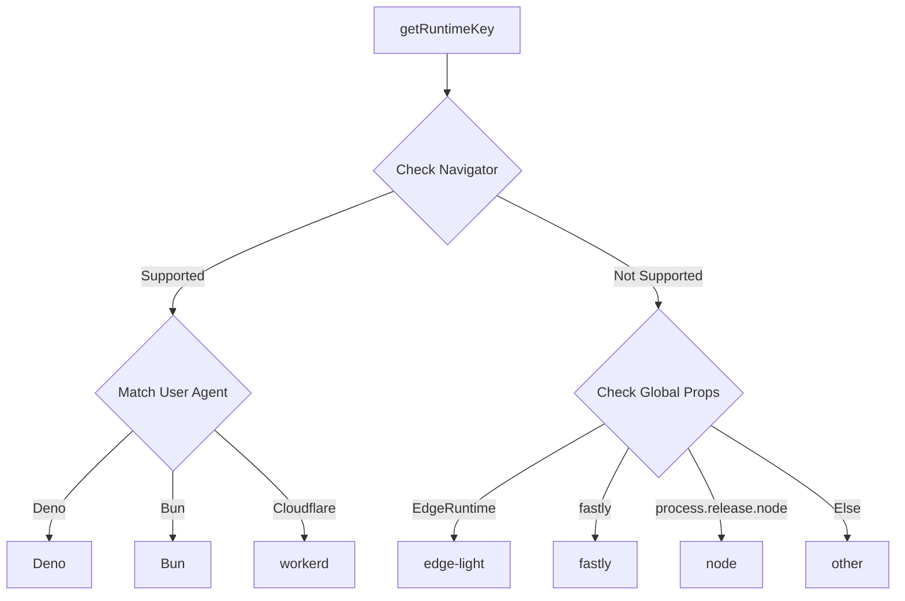
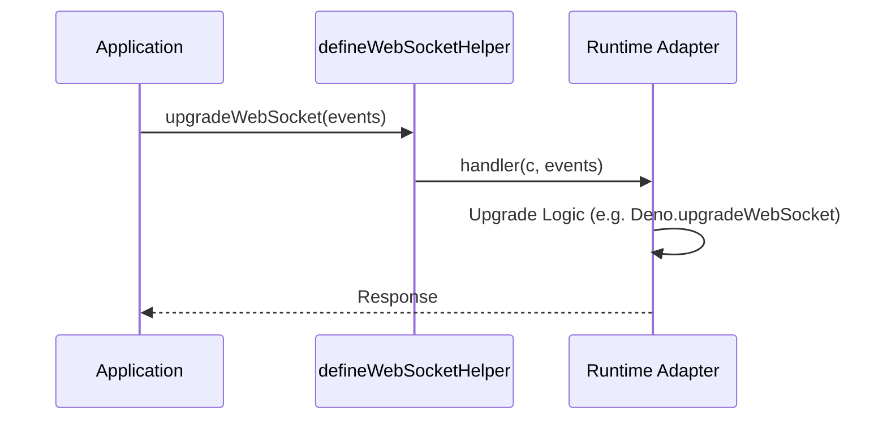

# Local Runtimes

<details>
<summary>Relevant source files</summary>

The following files were used as context for generating this wiki page:

- [package.json](https://github.com/honojs/hono/blob/main/package.json)
- [jsr.json](https://github.com/honojs/hono/blob/main/jsr.json)
- [src/adapter/bun/websocket.ts](https://github.com/honojs/hono/blob/main/src/adapter/bun/websocket.ts)
- [runtime-tests/deno/deno.json](https://github.com/honojs/hono/blob/main/runtime-tests/deno/deno.json)
- [src/adapter/deno/websocket.ts](https://github.com/honojs/hono/blob/main/src/adapter/deno/websocket.ts)
- [src/adapter/deno/deno.d.ts](https://github.com/honojs/hono/blob/main/src/adapter/deno/deno.d.ts)
- [runtime-tests/workerd/index.ts](https://github.com/honojs/hono/blob/main/runtime-tests/workerd/index.ts)
- [src/adapter/bun/index.ts](https://github.com/honojs/hono/blob/main/src/adapter/bun/index.ts)
- [src/helper/adapter/index.ts](https://github.com/honojs/hono/blob/main/src/helper/adapter/index.ts)
- [src/adapter/cloudflare-workers/websocket.ts](https://github.com/honojs/hono/blob/main/src/adapter/cloudflare-workers/websocket.ts)
- [src/adapter/deno/conninfo.ts](https://github.com/honojs/hono/blob/main/src/adapter/deno/conninfo.ts)
- [src/adapter/deno/index.ts](https://github.com/honojs/hono/blob/main/src/adapter/deno/index.ts)
- [runtime-tests/bun/static/helloworld/index.html](https://github.com/honojs/hono/blob/main/runtime-tests/bun/static/helloworld/index.html)
- [runtime-tests/bun/tsconfig.json](https://github.com/honojs/hono/blob/main/runtime-tests/bun/tsconfig.json)
- [runtime-tests/bun/static/hello.world/index.html](https://github.com/honojs/hono/blob/main/runtime-tests/bun/static/hello.world/index.html)
- [runtime-tests/deno-jsx/deno.precompile.json](https://github.com/honojs/hono/blob/main/runtime-tests/deno-jsx/deno.precompile.json)
- [src/adapter/bun/conninfo.ts](https://github.com/honojs/hono/blob/main/src/adapter/bun/conninfo.ts)
- [src/adapter/netlify/mod.ts](https://github.com/honojs/hono/blob/main/src/adapter/netlify/mod.ts)
- [runtime-tests/deno-jsx/deno.react-jsx.json](https://github.com/honojs/hono/blob/main/runtime-tests/deno-jsx/deno.react-jsx.json)
- [runtime-tests/bun/static/plain.txt](https://github.com/honojs/hono/blob/main/runtime-tests/bun/static/plain.txt)
- [README.md](https://github.com/honojs/hono/blob/main/README.md)
- [runtime-tests/bun/static-absolute-root/plain.txt](https://github.com/honojs/hono/blob/main/runtime-tests/bun/static-absolute-root/plain.txt)
- [runtime-tests/deno/static/helloworld/index.html](https://github.com/honojs/hono/blob/main/runtime-tests/deno/static/helloworld/index.html)
- [src/jsx/dom/jsx-runtime.ts](https://github.com/honojs/hono/blob/main/src/jsx/dom/jsx-runtime.ts)
- [runtime-tests/fastly/vitest.config.ts](https://github.com/honojs/hono/blob/main/runtime-tests/fastly/vitest.config.ts)
- [src/helper/websocket/index.ts](https://github.com/honojs/hono/blob/main/src/helper/websocket/index.ts)
</details>

"Local Runtimes" refers to the core architectural capability of Hono to operate consistently across diverse JavaScript execution environments, including Node.js, Bun, Deno, Cloudflare Workers, and others. This abstraction layer enables developers to write a single application that remains portable while taking advantage of runtime-specific optimizations and APIs.

The system relies on an adapter-based architecture. Rather than relying on specific global objects that may exist in one environment but not others, Hono uses detection utilities and runtime-specific adapters. This allows the framework to expose unified APIs (like `env`, `conninfo`, and `upgradeWebSocket`) that resolve to the correct native implementation at runtime.

By centralizing the logic for environment identification and feature normalization, Hono solves the challenge of "write once, run anywhere" in the modern JS ecosystem. It avoids the pitfall of bloating the core library with runtime checks; instead, specific features are offloaded to adapters that are invoked based on the detected `Runtime` key.

## Runtime Detection

The framework detects the host environment using the `getRuntimeKey` function, which examines `globalThis` properties and `navigator.userAgent`. This function serves as the primary mechanism for the `env` helper to dispatch requests to the correct implementation.



Sources: [src/helper/adapter/index.ts:50-84](https://github.com/honojs/hono/blob/main/src/helper/adapter/index.ts#L50-L84)

## Unified Environment Access

The `env` helper provides a type-safe way to access runtime-specific environment variables or context bindings. It masks the differences between `process.env` (Node/Bun), `Deno.env` (Deno), and `c.env` (Workers).

| Runtime | Source of Truth |
| :--- | :--- |
| bun | globalThis.process.env |
| node | globalThis.process.env |
| deno | Deno.env.toObject() |
| workerd | c.env |

Sources: [src/helper/adapter/index.ts:10-41](https://github.com/honojs/hono/blob/main/src/helper/adapter/index.ts#L10-L41)

## WebSocket Abstraction

Hono provides a normalized `WSContext` and a `defineWebSocketHelper` factory to unify WebSocket upgrades across platforms. Each adapter (Bun, Deno, Cloudflare) implements the `UpgradeWebSocket` interface, hiding the specific handshake logic required by the underlying runtime.



Sources: [src/helper/websocket/index.ts:111-140](https://github.com/honojs/hono/blob/main/src/helper/websocket/index.ts#L111-L140)

> [!IMPORTANT]
> The `WSContext` constructor normalizes inputs. Because `socket.url` and `protocol` can differ in availability or format across runtimes, the `WSContext` forces them into standard URL and string formats upon initialization.

Sources: [src/helper/websocket/index.ts:70-77](https://github.com/honojs/hono/blob/main/src/helper/websocket/index.ts#L70-L77)

## Connection Information

Accessing request connection info (like remote IP or transport protocol) varies wildly between servers. The `getConnInfo` helper pattern allows Hono to extract this data by wrapping specific server objects.

- **Bun**: Uses `server.requestIP(req)`, which returns null for Unix sockets or closed requests.
- **Deno**: Retrieves info directly from the context's environment mapping.

```typescript
// Example: Accessing connection information
import { getConnInfo } from 'hono/bun'

app.get('/info', (c) => {
  const info = getConnInfo(c)
  return c.json({ ip: info.remote.address })
})
```

Sources: [src/adapter/bun/conninfo.ts:10-43](https://github.com/honojs/hono/blob/main/src/adapter/bun/conninfo.ts#L10-L43), [src/adapter/deno/conninfo.ts:8-17](https://github.com/honojs/hono/blob/main/src/adapter/deno/conninfo.ts#L8-L17)

## Adapter Implementation Pattern

Each local runtime adapter follows a strict internal registration pattern. For example, `src/adapter/bun/websocket.ts` performs a check for the server instance via `getBunServer` before proceeding with the `upgrade` call. If the runtime is not configured correctly, it throws a `TypeError`.

> [!WARNING]
> The failure to provide a secondary argument to `fetch` when using the Bun server adapter will trigger a runtime `TypeError`. This is a hard guard to ensure the `UpgradeWebSocket` function has access to the underlying `server.upgrade` method.

Sources: [src/adapter/bun/websocket.ts:58-60](https://github.com/honojs/hono/blob/main/src/adapter/bun/websocket.ts#L58-L60)

## Design Trade-offs

| Design Choice | Benefit | Cost |
| :--- | :--- | :--- |
| Runtime Adapters | Platform-specific optimizations | Maintenance overhead per runtime |
| User-Agent Detection | Zero-config runtime identification | Potentially fragile if UAs change |
| Unified WSContext | Portable WebSocket code | Requires normalization wrapper |

Sources: [src/helper/adapter/index.ts:50-90](https://github.com/honojs/hono/blob/main/src/helper/adapter/index.ts#L50-L90), [src/helper/websocket/index.ts:70-91](https://github.com/honojs/hono/blob/main/src/helper/websocket/index.ts#L70-L91)

## Related

- [[Edge Workers]]

