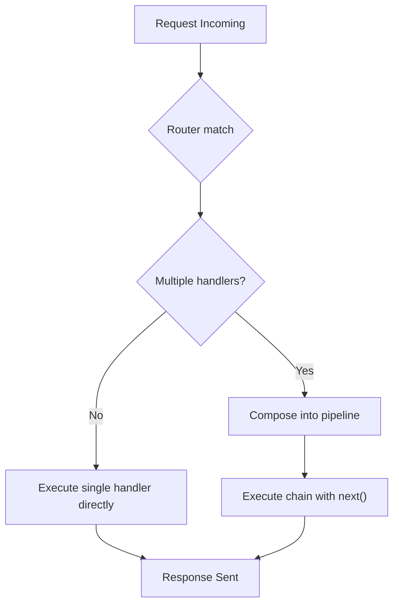

# Middleware Composition

Relevant source files

The following files were used as context for generating this wiki page:

- [src/types.ts](https://github.com/honojs/hono/blob/main/src/types.ts)
- [src/hono-base.ts](https://github.com/honojs/hono/blob/main/src/hono-base.ts)
- [src/adapter/aws-lambda/handler.ts](https://github.com/honojs/hono/blob/main/src/adapter/aws-lambda/handler.ts)
- [src/middleware/cache/index.ts](https://github.com/honojs/hono/blob/main/src/middleware/cache/index.ts)
- [src/adapter/cloudflare-pages/handler.ts](https://github.com/honojs/hono/blob/main/src/adapter/cloudflare-pages/handler.ts)
- [src/context.ts](https://github.com/honojs/hono/blob/main/src/context.ts)

Middleware composition is the structural mechanism by which Hono orchestrates request processing. At its heart, it allows developers to build a layered pipeline where each piece of logic can perform actions before or after passing control to the next handler, or decide to terminate the chain entirely by returning a `Response`. This approach provides a modular way to handle cross-cutting concerns such as caching or request logging.

The subsystem is built on a "compose" pattern, where multiple handlers—ranging from global middleware to specific route handlers—are aggregated into a single execution chain. This chain is resolved dynamically during the request lifecycle. By abstracting the `next` function, Hono ensures that handlers are executed in a controlled, sequential order, enabling the "onion model" common in modern web frameworks where requests flow inward through components and responses flow outward.

Design decisions for composition prioritize flexibility and performance. Handlers are processed as arrays, and for simple cases with a single handler, the framework bypasses the complex composition overhead entirely. This ensures that middleware-heavy architectures remain performant while maintaining an expressive API that supports both path-specific and global registrations.

## The Handler Chain
The composition mechanism aggregates handlers into an array during route registration. When a request hits a route, the router returns a collection of matching handlers. If multiple handlers are associated with a single route, they are executed in the order they were registered.

The `MiddlewareHandler` type (defined in `src/types.ts`) serves as a primary processing signature, allowing the composition system to treat standard handlers and complex middleware as unified units of execution.

Sources: [src/types.ts:83-89](https://github.com/honojs/hono/blob/main/src/types.ts#L83-L89)

## Execution Control Flow
The execution flow is managed within the core application dispatcher logic. When a request occurs, Hono determines if the chain contains more than one handler. If only one exists, it executes the handler directly for performance, bypassing the complexity of wrapping the `next` function.

For chains with multiple handlers, the system uses the `compose` function. The `next` function acts as the fundamental control primitive; calling it yields control to the next handler in the chain.

Sources: [src/hono-base.ts:406-466](https://github.com/honojs/hono/blob/main/src/hono-base.ts#L406-L466)

## Pipeline Integrity
A critical aspect of composition is ensuring request-response state consistency. If a handler in the chain completes without returning a `Response` and without invoking `next`, the request context remains incomplete. The `Context` class manages the state of the response object internally.

> [!WARNING]
> Handlers should be mindful of the control flow. If a handler initiates a process but does not eventually return a response or `await next()`, the request may fail to complete, as the pipeline relies on the propagation of the `Response` object back through the stack to the final caller.

Sources: [src/context.ts:317-434](https://github.com/honojs/hono/blob/main/src/context.ts#L317-L434)

## Registration
Middleware is registered either globally (using `app.use`) or locally (bound to a specific path/method). The application constructor builds the registration interface by iterating over supported HTTP methods and attaching handlers to the router.

When `app.use` is called, if no path is provided, it defaults to `*`, making the logic global. If a path is provided, the middleware is bound to that path, and the router handles the resolution during request dispatch.

| Registration Method | Scope | Behavior |
| :--- | :--- | :--- |
| `app.use(handler)` | Global | Executed for all requests |
| `app.use(path, handler)` | Local | Executed only when matching path |
| `app.get(path, handler)` | Route | Executed for specific GET route |

Sources: [src/hono-base.ts:157-168](https://github.com/honojs/hono/blob/main/src/hono-base.ts#L157-L168)

## Error Handling within Composition
Error handling is an integrated part of the composition. When the `compose` function is invoked, it receives the `errorHandler` as a parameter. Any exception thrown within a handler is caught by the composition wrapper, allowing the application to execute the registered `errorHandler` and recover, for example by returning a generic 500 error or a formatted response.

Sources: [src/hono-base.ts:450-464](https://github.com/honojs/hono/blob/main/src/hono-base.ts#L450-L464)

## Design Trade-offs
The current composition design reflects choices between ease-of-use and throughput:

| Design Choice | Benefit | Cost |
| :--- | :--- | :--- |
| **Array-based composition** | Enables flexible ordering | Iteration overhead |
| **Fast-path for single handler** | Minimal latency for simple routes | Logic split between dispatch and compose |
| **Integrated `errorHandler`** | Consistent error lifecycle | Requires coupling to global error state |

Sources: [src/hono-base.ts:430-448](https://github.com/honojs/hono/blob/main/src/hono-base.ts#L430-L448)

## Related

- [[Application Routing]]
- [[Security Protection]]

