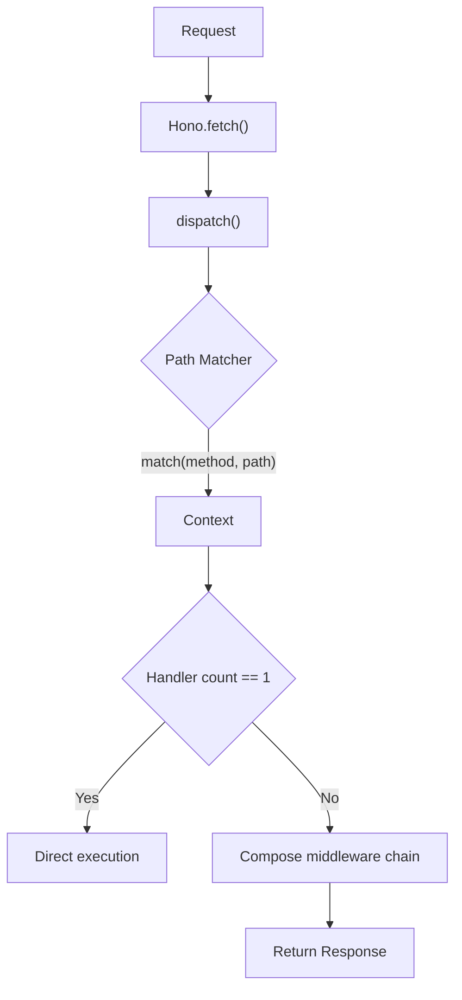
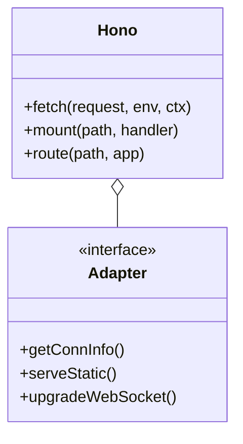

# Overview

<details>
<summary>Relevant source files</summary>

The following files were used as context for generating this wiki page:

- [package.json](https://github.com/honojs/hono/blob/main/package.json)
- [src/hono-base.ts](https://github.com/honojs/hono/blob/main/src/hono-base.ts)
- [src/types.ts](https://github.com/honojs/hono/blob/main/src/types.ts)
- [src/hono.ts](https://github.com/honojs/hono/blob/main/src/hono.ts)
- [README.md](https://github.com/honojs/hono/blob/main/README.md)
- [src/preset/quick.ts](https://github.com/honojs/hono/blob/main/src/preset/quick.ts)
- [src/index.ts](https://github.com/honojs/hono/blob/main/src/index.ts)
- [src/router/smart-router/index.ts](https://github.com/honojs/hono/blob/main/src/router/smart-router/index.ts)
- [src/preset/tiny.ts](https://github.com/honojs/hono/blob/main/src/preset/tiny.ts)
- [src/router/linear-router/index.ts](https://github.com/honojs/hono/blob/main/src/router/linear-router/index.ts)
- [docs/CONTRIBUTING.md](https://github.com/honojs/hono/blob/main/docs/CONTRIBUTING.md)
- [src/adapter/cloudflare-pages/index.ts](https://github.com/honojs/hono/blob/main/src/adapter/cloudflare-pages/index.ts)
- [src/adapter/deno/index.ts](https://github.com/honojs/hono/blob/main/src/adapter/deno/index.ts)
- [src/adapter/vercel/index.ts](https://github.com/honojs/hono/blob/main/src/adapter/vercel/index.ts)
- [src/adapter/cloudflare-workers/index.ts](https://github.com/honojs/hono/blob/main/src/adapter/cloudflare-workers/index.ts)
- [src/router/trie-router/index.ts](https://github.com/honojs/hono/blob/main/src/router/trie-router/index.ts)
- [src/adapter/aws-lambda/index.ts](https://github.com/honojs/hono/blob/main/src/adapter/aws-lambda/index.ts)
- [src/router/pattern-router/index.ts](https://github.com/honojs/hono/blob/main/src/router/pattern-router/index.ts)
- [src/adapter/netlify/index.ts](https://github.com/honojs/hono/blob/main/src/adapter/netlify/index.ts)
- [src/helper/conninfo/index.ts](https://github.com/honojs/hono/blob/main/src/helper/conninfo/index.ts)
- [src/adapter/lambda-edge/index.ts](https://github.com/honojs/hono/blob/main/src/adapter/lambda-edge/index.ts)
- [src/adapter/bun/index.ts](https://github.com/honojs/hono/blob/main/src/adapter/bun/index.ts)
- [src/helper/streaming/index.ts](https://github.com/honojs/hono/blob/main/src/helper/streaming/index.ts)
- [src/helper/accepts/index.ts](https://github.com/honojs/hono/blob/main/src/helper/accepts/index.ts)
- [src/client/index.ts](https://github.com/honojs/hono/blob/main/src/client/index.ts)
- [src/helper/ssg/index.ts](https://github.com/honojs/hono/blob/main/src/helper/ssg/index.ts)
- [src/router/reg-exp-router/index.ts](https://github.com/honojs/hono/blob/main/src/router/reg-exp-router/index.ts)
- [src/adapter/service-worker/index.ts](https://github.com/honojs/hono/blob/main/src/adapter/service-worker/index.ts)
- [jsr.json](https://github.com/honojs/hono/blob/main/jsr.json)
- [runtime-tests/workerd/index.ts](https://github.com/honojs/hono/blob/main/runtime-tests/workerd/index.ts)
</details>

Hono is a high-performance web framework engineered around Web Standards, designed for seamless portability across diverse JavaScript runtimes, including Cloudflare Workers, Deno, Bun, Vercel, and AWS Lambda. Its core design philosophy prioritizes minimal footprint, speed, and strict adherence to standard APIs, ensuring that the same application code executes consistently across all supported platforms.

At its foundation, Hono utilizes the `Hono` class which orchestrates route registration, middleware composition, and request dispatching. By separating the framework's core logic from specific runtime implementations, Hono achieves a lightweight profile, as evidenced by its `tiny` preset which remains under 12kB.

The framework’s architecture revolves around a flexible router-agnostic engine. While the default `Hono` instance optimizes for general-purpose performance using a `SmartRouter` (which can combine multiple router strategies like `RegExpRouter` and `TrieRouter`), developers can swap these via configuration presets to better suit their specific performance or bundle-size constraints, effectively decoupling request path resolution from application business logic.

## Application Lifecycle and Request Dispatching

The entry point for all incoming requests is the `.fetch()` method. This process is the heart of the execution pipeline, responsible for matching routes to request paths, preparing the `Context` object, and executing middleware and handler chains.



The dispatch logic differentiates between single-handler routes and routes with middleware chains to optimize throughput. When multiple handlers are present, Hono uses `compose` to chain these functions together. If any handler fails, the error is caught and processed through an internal handler registration system.

Sources: [src/hono-base.ts:406-466](https://github.com/honojs/hono/blob/main/src/hono-base.ts#L406-L466)

## Router Architecture and Selection

Hono's routing is highly modular, with the router implementation determined at instantiation. The `SmartRouter` is the default choice for the `Hono` class, enabling adaptive routing by evaluating multiple internal strategies.

| Router | Description | Typical Use Case |
| :--- | :--- | :--- |
| `SmartRouter` | Aggregates multiple routers | General purpose, balanced performance |
| `RegExpRouter` | Uses pre-compiled regex for matching | High-traffic applications |
| `TrieRouter` | Standard radix tree implementation | Predictable path lookups |
| `PatternRouter` | Lightweight path matching | Small footprint / tiny preset |
| `LinearRouter` | Simple iteration matching | Basic apps, minimal complexity |

The selection logic within `SmartRouter` allows Hono to provide optimal matching performance based on the registered route density and complexity.

Sources: [src/hono.ts:28-32](https://github.com/honojs/hono/blob/main/src/hono.ts#L28-L32), [src/preset/quick.ts:20-22](https://github.com/honojs/hono/blob/main/src/preset/quick.ts#L20-L22)

## Context Invariants and Safety

The `Context` object maintains the state of the current request-response lifecycle. A critical invariant in Hono’s pipeline is the requirement for the context to be "finalized" before completion, which ensures that developers have explicitly handled the request (e.g., returned a response or awaited the middleware sequence).

> [!WARNING]
> If a request reaches the end of the middleware chain without the context being marked as finalized, Hono will throw an error to prevent silent failures or empty responses.

Sources: [src/hono-base.ts:455-459](https://github.com/honojs/hono/blob/main/src/hono-base.ts#L455-L459)

## Modular Adapter System

To support the framework's "run anywhere" guarantee, Hono encapsulates environment-specific logic (such as accessing connection info, handling static files, or upgrading WebSockets) within specialized adapters. These adapters are exposed through the `src/adapter/` directory, allowing core application code to remain clean and standard-compliant.



When deploying to platforms like Cloudflare Workers or Bun, these adapters provide the necessary hooks to inject environment-specific capabilities (e.g., `ExecutionContext` in Cloudflare) into the lifecycle without polluting the generic framework API.

Sources: [src/adapter/bun/index.ts:1-12](https://github.com/honojs/hono/blob/main/src/adapter/bun/index.ts#L1-L12), [src/adapter/cloudflare-workers/index.ts:1-9](https://github.com/honojs/hono/blob/main/src/adapter/cloudflare-workers/index.ts#L1-L9)

## Error Handling Mechanism

Error handling in Hono is centralized, providing a clear path for recovery or custom logging via dedicated registration methods. The mechanism checks if the error thrown is an instance of `HTTPResponseError`. If it is, the framework calls `.getResponse()` to extract and return the associated status and body, effectively turning controlled error states into proper HTTP responses.

```ts
// Extracting a custom error response
const errorHandler: ErrorHandler = (err, c) => {
  if ('getResponse' in err) {
    const res = err.getResponse()
    return c.newResponse(res.body, res)
  }
  console.error(err)
  return c.text('Internal Server Error', 500)
}
```

This approach allows developers to leverage exceptions for control flow in complex middleware hierarchies without sacrificing the ability to return specific HTTP error codes to the client.

Sources: [src/hono-base.ts:35-42](https://github.com/honojs/hono/blob/main/src/hono-base.ts#L35-L42)

## Design Trade-offs

Hono makes several deliberate design choices to balance features against its core goal of performance and minimal size.

| Design Choice | Benefit | Cost |
| :--- | :--- | :--- |
| **No Dependencies** | Minimal bundle, zero supply-chain risk | Higher implementation complexity for built-in helpers |
| **Web Standard APIs** | Maximum compatibility, future-proof | Requires polyfills if used in environments lacking standards |
| **Middleware Composition** | Highly flexible, sequential control flow | Slight performance overhead due to async chain iteration |
| **Static Router Switching** | Allows choosing perf characteristics per app | Increases maintenance of multiple router implementations |

Sources: [README.md:41-48](https://github.com/honojs/hono/blob/main/README.md#features)

## Practical Example: A Minimal Runtime Application

The following example demonstrates how Hono can be used in a `workerd` runtime test environment, utilizing the environment helper and WebSocket adapter, illustrating the framework's integration with specific runtime features.

```ts
import { upgradeWebSocket } from 'hono/cloudflare-workers'
import { env } from 'hono/adapter'
import { Hono } from 'hono'

const app = new Hono()

// Accessing environmental bindings
app.get('/env', (c) => {
  const { API_KEY } = env<{ API_KEY: string }>(c)
  return c.text(API_KEY)
})

// WebSocket upgrade logic
app.get('/ws', upgradeWebSocket(() => ({
  onMessage(event, ws) {
    ws.send(event.data as string)
  }
})))
```

This snippet highlights how adapters (`upgradeWebSocket`) integrate into the standard Hono route structure, providing a unified developer experience regardless of the underlying runtime.

Sources: [runtime-tests/workerd/index.ts:1-24](https://github.com/honojs/hono/blob/main/runtime-tests/workerd/index.ts#L1-L24)

## Related

- [[Quick Start]]
- [[Project Structure]]
- [[Application Routing]]

