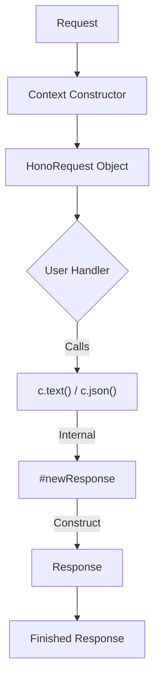
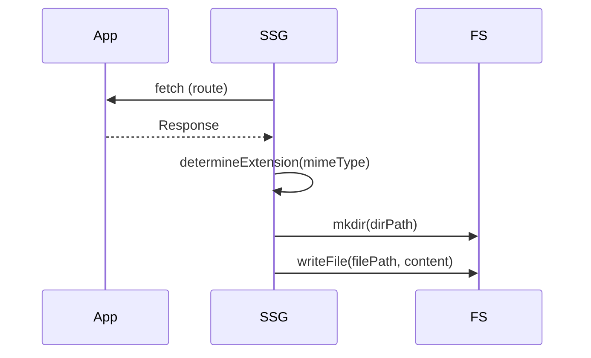

# Project Structure

<details>
<summary>Relevant source files</summary>

The following files were used as context for generating this wiki page:

- [package.json](https://github.com/honojs/hono/blob/main/package.json)
- [jsr.json](https://github.com/honojs/hono/blob/main/jsr.json)
- [src/context.ts](https://github.com/honojs/hono/blob/main/src/context.ts)
- [src/types.ts](https://github.com/honojs/hono/blob/main/src/types.ts)
- [src/helper/ssg/ssg.ts](https://github.com/honojs/hono/blob/main/src/helper/ssg/ssg.ts)
- [vitest.config.ts](https://github.com/honojs/hono/blob/main/vitest.config.ts)
</details>

Hono is architected as a lightweight, modular web framework built on standard Web APIs. The project structure is organized to support a "write once, run anywhere" philosophy, abstracting away platform-specific differences (like those between Node.js, Bun, Deno, and Cloudflare Workers) while maintaining a strict, type-safe API surface.

At the center of this architecture is a core engine (`src/`) that exposes a consistent `Context` and a flexible router system. Middleware and helper utilities are decoupled from the core, allowing users to import only what they need, while the project's export definitions (managed in `package.json` and `jsr.json`) ensure that these components are consumable in both CommonJS and ES module environments.

The codebase enforces a clear distinction between the request/response lifecycle handling, type definition infrastructure, and functional helpers like the Static Site Generation (SSG) subsystem. This separation of concerns ensures that the core framework remains minimal—ideal for edge runtimes—while providing an extensible interface for complex applications.

## Core Context Lifecycle
The `Context` class represents the request-response cycle and serves as the primary bridge between the incoming `Request` and the user-defined handlers. It encapsulates environmental variables, route parameters, and helper methods.

The mechanism for creating a response is designed for flexibility. The `Context` holds an internal `#res` (Response) object that is lazy-initialized. When a handler calls methods like `c.json()` or `c.text()`, the framework performs a transition from the incoming `Request` to a standard `Response` object.


Sources: [src/context.ts:352-361](https://github.com/honojs/hono/blob/main/src/context.ts#L352-L361), [src/context.ts:403-407](https://github.com/honojs/hono/blob/main/src/context.ts#L403-L407)

## Type Safety Infrastructure
The project relies on heavy TypeScript usage to maintain a schema-aware routing system. Types are concentrated in `src/types.ts`, which provides the `Env`, `Handler`, and `Input` interfaces used throughout the codebase to ensure that route handlers, path parameters, and environment bindings are correctly inferred during development.

The `HandlerInterface` defines the signatures for route definition, allowing the framework to chain handlers and automatically merge environmental variables and input definitions through the call chain.

> [!NOTE]
> Type definitions in Hono are "compile-time only" and intentionally excluded from test coverage because they cannot be executed or evaluated at runtime.
Sources: [src/types.ts:76-120](https://github.com/honojs/hono/blob/main/src/types.ts#L76-L120), [vitest.config.ts:19-22](https://github.com/honojs/hono/blob/main/vitest.config.ts#L19-L22)

## SSG Subsystem Mechanism
The Static Site Generation (SSG) subsystem, located in `src/helper/ssg/ssg.ts`, is an experimental module that transforms dynamic routes into static files. Its execution flow uses a generator pattern to manage the retrieval and persistence of route contents.

1.  **Generation**: The system utilizes a generator to process routes and collect content. The core logic involves invoking `app.fetch` on route paths and handling the resulting `Response` objects.
2.  **MIME & Path Mapping**: The `generateFilePath` function determines the output path based on the MIME type. It uses the `determineExtension` logic to choose an appropriate suffix (e.g., `html` for `text/html`).
3.  **Persistence**: The `saveContentToFile` function consumes the generator outputs, creates the necessary directories using `mkdir` with `{ recursive: true }`, and writes the `content` to the disk.


Sources: [src/helper/ssg/ssg.ts:50-71](https://github.com/honojs/hono/blob/main/src/helper/ssg/ssg.ts#L50-L71), [src/helper/ssg/ssg.ts:310-334](https://github.com/honojs/hono/blob/main/src/helper/ssg/ssg.ts#L310-L334)

## Export Management and Modularity
The project's entry points and public API surface are strictly defined in `package.json` (`exports`) and `jsr.json`. This dual-configuration approach serves both the npm and JSR registries, mapping internal paths to specific distribution folders.

| Path | Description | Type Entry |
| :--- | :--- | :--- |
| `.` | Main entry point | `dist/types/index.d.ts` |
| `./request` | HonoRequest module | `dist/types/request.d.ts` |
| `./jsx` | JSX support utilities | `dist/types/jsx/index.d.ts` |
| `./utils/*` | Various internal helpers | `dist/types/utils/*.d.ts` |

Sources: [package.json:38-414](https://github.com/honojs/hono/blob/main/package.json#L38-L414)

## Design Trade-offs
The codebase makes several deliberate design choices to balance performance and developer experience.

| Design Choice | Benefit | Cost |
| :--- | :--- | :--- |
| Lazy initialization (`??=`) | Reduces memory overhead | Requires careful state management |
| Omitting `Content-Type` by default | Improves performance (per Bun benchmarks) | Requires explicit overrides if needed |
| High-degree generic types | Ensures compile-time safety | Increases compilation/type-checking time |
| Modular middleware exports | Keeps core framework size minimal | Increases complexity of package mapping |

Sources: [src/context.ts:367](https://github.com/honojs/hono/blob/main/src/context.ts#L367), [src/helper/ssg/ssg.ts:19-24](https://github.com/honojs/hono/blob/main/src/helper/ssg/ssg.ts#L19-L24)

## Worked Example: Context Usage
This snippet demonstrates how a developer interacts with the `Context` object in a route handler, illustrating the `json()` helper's type-safe flow.

```typescript
// Define a handler
app.get('/api/user', (c) => {
  // c.env provides access to bindings
  const apiKey = c.env.API_KEY;
  
  // c.json() handles serialization and sets Content-Type to application/json
  return c.json({
    id: 1,
    name: 'Hono User'
  }, 200);
});
```
Sources: [src/context.ts:308-313](https://github.com/honojs/hono/blob/main/src/context.ts#L308-L313), [src/context.ts:703-706](https://github.com/honojs/hono/blob/main/src/context.ts#L703-L706)

## Related

- [[Overview]]
- [[Application Routing]]

