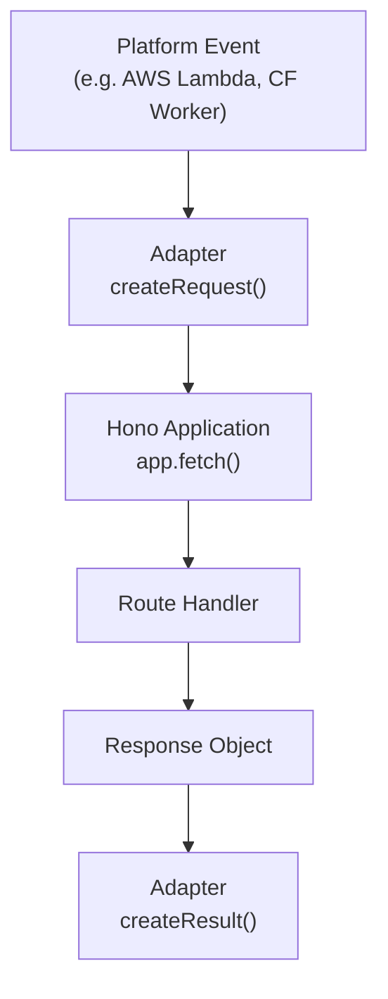

# Quick Start

<details>
<summary>Relevant source files</summary>

The following files were used as context for generating this wiki page:

- [src/middleware/secure-headers/secure-headers.ts](https://github.com/honojs/hono/blob/main/src/middleware/secure-headers/secure-headers.ts)
- [src/adapter/aws-lambda/handler.ts](https://github.com/honojs/hono/blob/main/src/adapter/aws-lambda/handler.ts)
- [src/preset/quick.ts](https://github.com/honojs/hono/blob/main/src/preset/quick.ts)
- [src/middleware/language/language.ts](https://github.com/honojs/hono/blob/main/src/middleware/language/language.ts)
- [README.md](https://github.com/honojs/hono/blob/main/README.md)
- [src/adapter/lambda-edge/handler.ts](https://github.com/honojs/hono/blob/main/src/adapter/lambda-edge/handler.ts)
- [src/preset/tiny.ts](https://github.com/honojs/hono/blob/main/src/preset/tiny.ts)
- [src/utils/stream.ts](https://github.com/honojs/hono/blob/main/src/utils/stream.ts)
- [src/router/linear-router/router.ts](https://github.com/honojs/hono/blob/main/src/router/linear-router/router.ts)
- [runtime-tests/workerd/index.ts](https://github.com/honojs/hono/blob/main/runtime-tests/workerd/index.ts)
- [src/adapter/vercel/handler.ts](https://github.com/honojs/hono/blob/main/src/adapter/vercel/handler.ts)
- [src/adapter/netlify/mod.ts](https://github.com/honojs/hono/blob/main/src/adapter/netlify/mod.ts)
- [src/index.ts](https://github.com/honojs/hono/blob/main/src/index.ts)
- [src/adapter/vercel/index.ts](https://github.com/honojs/hono/blob/main/src/adapter/vercel/index.ts)
- [src/adapter/lambda-edge/index.ts](https://github.com/honojs/hono/blob/main/src/adapter/lambda-edge/index.ts)
- [src/adapter/netlify/handler.ts](https://github.com/honojs/hono/blob/main/src/adapter/netlify/handler.ts)
- [src/adapter/service-worker/index.ts](https://github.com/honojs/hono/blob/main/src/adapter/service-worker/index.ts)
- [runtime-tests/deno/static/hello.world/index.html](https://github.com/honojs/hono/blob/main/runtime-tests/deno/static/hello.world/index.html)
- [src/helper/accepts/index.ts](https://github.com/honojs/hono/blob/main/src/helper/accepts/index.ts)
- [src/adapter/cloudflare-workers/index.ts](https://github.com/honojs/hono/blob/main/src/adapter/cloudflare-workers/index.ts)
- [perf-measures/type-check/client.ts](https://github.com/honojs/hono/blob/main/perf-measures/type-check/client.ts)
- [runtime-tests/deno/static/helloworld/index.html](https://github.com/honojs/hono/blob/main/runtime-tests/deno/static/helloworld/index.html)
- [src/adapter/aws-lambda/index.ts](https://github.com/honojs/hono/blob/main/src/adapter/aws-lambda/index.ts)
- [src/adapter/cloudflare-pages/index.ts](https://github.com/honojs/hono/blob/main/src/adapter/cloudflare-pages/index.ts)
- [runtime-tests/bun/static/helloworld/index.html](https://github.com/honojs/bun/static/helloworld/index.html)
- [runtime-tests/bun/static/hello.world/index.html](https://github.com/honojs/bun/static/hello.world/index.html)
- [src/helper/streaming/text.ts](https://github.com/honojs/hono/blob/main/src/helper/streaming/text.ts)
- [src/router/linear-router/index.ts](https://github.com/honojs/hono/blob/main/src/router/linear-router/index.ts)
- [src/helper/streaming/index.ts](https://github.com/honojs/hono/blob/main/src/helper/streaming/index.ts)
- [src/adapter/netlify/index.ts](https://github.com/honojs/hono/blob/main/src/adapter/netlify/index.ts)
</details>

"Quick Start" refers to both the onboarding experience and the specific `hono/quick` preset architecture in Hono. Designed for speed, flexibility, and broad runtime compatibility, it solves the challenge of maintaining performant routing logic across diverse JavaScript environments while minimizing developer friction.

The framework is architected around Web Standard APIs, ensuring the core `Hono` class remains lightweight. The "Quick" preset specifically leverages a `SmartRouter`, which orchestrates multiple routing strategies—typically combining `LinearRouter` and `TrieRouter`—to optimize route matching based on complexity and performance requirements.

This modular design allows developers to choose their performance trade-offs: use the `tiny` preset for minimal bundle size or the `quick` preset for a balance of complex routing capabilities and raw speed. By abstracting away platform-specific entry points (like `aws-lambda` or `cloudflare-workers`), the system allows a single Hono instance to be deployed across vastly different environments without changing application logic.

## The Preset Mechanism

Hono presets define how the router is instantiated. The `Quick` preset acts as a composite router, wrapping specialized implementations.

```typescript
// src/preset/quick.ts
export class Hono<...> extends HonoBase<E, S, BasePath> {
  constructor(options: HonoOptions<E> = {}) {
    super(options)
    this.router = new SmartRouter({
      routers: [new LinearRouter(), new TrieRouter()],
    })
  }
}
```

This ensures that routing is not tied to a single algorithm, allowing the engine to delegate to the most efficient matcher available for a given route set. Sources: [src/preset/quick.ts:13-24](https://github.com/honojs/hono/blob/main/src/preset/quick.ts#L13-L24)

## Routing Selection Logic

The `SmartRouter` does not simply guess; it coordinates between routers. The `LinearRouter` is optimized for predictable sequences, while the `TrieRouter` handles complex tree-based structures. By combining them in the constructor, Hono enables developers to mix route styles without manually configuring individual router instances. Sources: [src/preset/quick.ts:20-22](https://github.com/honojs/hono/blob/main/src/preset/quick.ts#L20-L22)

## Architectural Trade-offs

| Choice | Benefit | Cost |
| :--- | :--- | :--- |
| `LinearRouter` | Efficient for short/flat route lists | Degrades with high route volume |
| `TrieRouter` | O(k) matching where k is path segments | Increased memory overhead per route |
| `SmartRouter` | Optimal path matching for all route sets | Higher initial object creation complexity |

Sources: [src/preset/quick.ts:20-22](https://github.com/honojs/hono/blob/main/src/preset/quick.ts#L20-L22), [src/router/linear-router/router.ts:11](https://github.com/honojs/hono/blob/main/src/router/linear-router/router.ts#L11)

## Adapters and Lifecycle

Hono uses adapters to map platform-specific events to the universal `fetch` signature. Whether running on AWS Lambda or Cloudflare Workers, the core Hono application receives a standard `Request` object and returns a `Response` object.


Sources: [src/adapter/aws-lambda/handler.ts:318-341](https://github.com/honojs/hono/blob/main/src/adapter/aws-lambda/handler.ts#L318-L341), [src/adapter/aws-lambda/handler.ts:344-386](https://github.com/honojs/hono/blob/main/src/adapter/aws-lambda/handler.ts#L344-L386)

## Handling Binary Content

The `createResult` function in adapters must detect whether a body is binary to appropriately encode it for the platform. It inspects the `content-type` and `content-encoding` headers.

> [!WARNING]
> If `isContentTypeBinary` is not explicitly provided, the default detection logic for binary content is used. Users can override this to ensure specific types (e.g., custom image formats) are handled correctly.

Sources: [src/adapter/aws-lambda/handler.ts:349-357](https://github.com/honojs/hono/blob/main/src/adapter/aws-lambda/handler.ts#L349-L357)

## Lifecycle of a Request (AWS Lambda)

1. `handle()` is invoked with an `event`.
2. `getProcessor(event)` determines the appropriate `EventProcessor` (V1, V2, ALB, or Lattice).
3. `processor.createRequest(event)` transforms the platform-specific event into a `Request` object.
4. `app.fetch()` executes the Hono middleware pipeline.
5. `processor.createResult(event, res)` performs binary detection and constructs the `APIGatewayProxyResult`.

Sources: [src/adapter/aws-lambda/handler.ts:253-274](https://github.com/honojs/hono/blob/main/src/adapter/aws-lambda/handler.ts#L253-L274)

## Minimal Usage Example

The following code demonstrates initializing a standard Hono application, which is the foundational starting point for any "Quick Start" deployment.

```typescript
import { Hono } from 'hono'

const app = new Hono()

app.get('/', (c) => c.text('Hello Hono!'))

export default app
```
Sources: [README.md:26-33](https://github.com/honojs/hono/blob/main/README.md#L26-L33)

## Related

- [[Overview]]
- [[Local Runtimes]]

