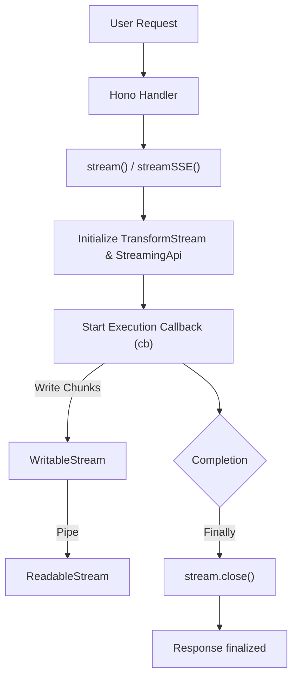
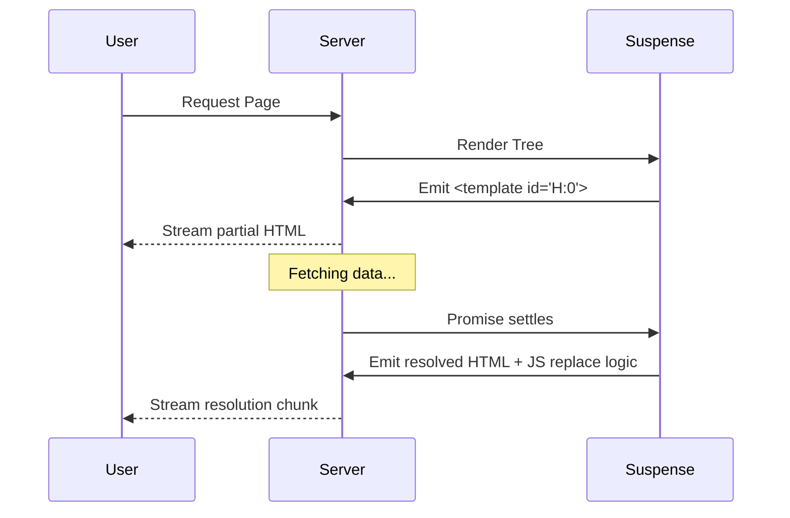

# Response Streaming

<details>
<summary>Relevant source files</summary>

The following files were used as context for generating this wiki page:

- [src/jsx/dom/render.ts](https://github.com/honojs/hono/blob/main/src/jsx/dom/render.ts)
- [src/context.ts](https://github.com/honojs/hono/blob/main/src/context.ts)
- [src/jsx/streaming.ts](https://github.com/honojs/hono/blob/main/src/jsx/streaming.ts)
- [src/helper/streaming/sse.ts](https://github.com/honojs/hono/blob/main/src/helper/streaming/sse.ts)
- [src/helper/streaming/stream.ts](https://github.com/honojs/hono/blob/main/src/helper/streaming/stream.ts)
- [src/adapter/aws-lambda/handler.ts](https://github.com/honojs/hono/blob/main/src/adapter/aws-lambda/handler.ts)
- [src/jsx/context.ts](https://github.com/honojs/hono/blob/main/src/jsx/context.ts)
- [src/jsx/components.ts](https://github.com/honojs/hono/blob/main/src/jsx/components.ts)
- [src/middleware/compress/index.ts](https://github.com/honojs/hono/blob/main/src/middleware/compress/index.ts)
- [src/helper/ssg/ssg.ts](https://github.com/honojs/hono/blob/main/src/helper/ssg/ssg.ts)
- [src/utils/stream.ts](https://github.com/honojs/hono/blob/main/src/utils/stream.ts)
- [src/middleware/etag/digest.ts](https://github.com/honojs/hono/blob/main/src/middleware/etag/digest.ts)
- [src/helper/streaming/text.ts](https://github.com/honojs/hono/blob/main/src/helper/streaming/text.ts)
- [src/request.ts](https://github.com/honojs/hono/blob/main/src/request.ts)
- [src/helper/proxy/index.ts](https://github.com/honojs/hono/blob/main/src/helper/proxy/index.ts)
- [src/utils/html.ts](https://github.com/honojs/hono/blob/main/src/utils/html.ts)
- [src/client/fetch-result-please.ts](https://github.com/honojs/hono/blob/main/src/client/fetch-result-please.ts)
- [src/helper/html/index.ts](https://github.com/honojs/hono/blob/main/src/helper/html/index.ts)
- [src/middleware/jsx-renderer/index.ts](https://github.com/honojs/hono/blob/main/src/middleware/jsx-renderer/index.ts)
- [src/jsx/dom/server.ts](https://github.com/honojs/hono/blob/main/src/jsx/dom/server.ts)
- [src/helper/streaming/index.ts](https://github.com/honojs/hono/blob/main/src/helper/streaming/index.ts)
- [src/helper/ssg/plugins.ts](https://github.com/honojs/hono/blob/main/src/helper/ssg/plugins.ts)
- [runtime-tests/lambda/mock.ts](https://github.com/honojs/hono/blob/main/runtime-tests/lambda/mock.ts)
- [runtime-tests/lambda/stream-mock.ts](https://github.com/honojs/hono/blob/main/runtime-tests/lambda/stream-mock.ts)
- [src/adapter/deno/websocket.ts](https://github.com/honojs/hono/blob/main/src/adapter/deno/websocket.ts)
- [src/utils/compress.ts](https://github.com/honojs/hono/blob/main/src/utils/compress.ts)
- [src/helper/streaming/utils.ts](https://github.com/honojs/hono/blob/main/src/helper/streaming/utils.ts)
- [runtime-tests/workerd/index.ts](https://github.com/honojs/hono/blob/main/runtime-tests/workerd/index.ts)
- [src/adapter/service-worker/types.ts](https://github.com/honojs/hono/blob/main/src/adapter/service-worker/types.ts)
- [runtime-tests/bun/static/helloworld/index.html](https://github.com/honojs/hono/blob/main/runtime-tests/bun/static/helloworld/index.html)
</details>

Response Streaming in Hono provides a mechanism to deliver large or dynamic payloads to the client incrementally, rather than waiting for the entire response to be generated. This is critical for applications that require immediate feedback (like AI streaming or large table generation) or when the server performs heavy I/O operations where content can be flushed in chunks to keep the connection alive and improve perceived performance.

The system is built on top of the Web Streams API (`ReadableStream` and `WritableStream`). By abstracting these primitives, Hono allows developers to write to the response body via simple helper functions, ensuring compatibility across different JavaScript runtimes (Node.js, Bun, Cloudflare Workers, etc.). This architecture handles the underlying plumbing of pipe management, chunk encoding, and connection termination.

Key design decisions revolve around the lifecycle of the response. Streaming responses are inherently asynchronous and require careful handling to avoid leaks — for instance, managing the lifecycle of the Hono `Context` object, which may be destroyed in environments like Bun once the initial header generation completes. The streaming subsystem handles this by maintaining a `contextStash` to keep the context alive until the stream terminates.

## The StreamingApi Core
The `StreamingApi` class (defined in `src/utils/stream.ts`) serves as the foundational controller for any Hono streaming operation. It encapsulates a `WritableStreamDefaultWriter` and provides methods to write data, handle newlines, and manage the underlying stream state.

When initialized, it creates a `responseReadable` `ReadableStream`. The `pull` method of this stream reads from the internal reader. The `StreamingApi` also includes an `abortSubscribers` list; this is a safety mechanism that ensures that if the client disconnects, the reader is cancelled, preventing deadlocks and resource leaks.

```typescript
// Core writing mechanism
async write(input: Uint8Array | string): Promise<StreamingApi> {
  try {
    if (typeof input === 'string') {
      input = this.encoder.encode(input)
    }
    await this.writer.write(input)
  } catch {
    // Fail-soft: streaming errors are often due to client disconnects
  }
  return this
}
```
Sources: [src/utils/stream.ts:6-98](https://github.com/honojs/hono/blob/main/src/utils/stream.ts#L6-L98)

> [!NOTE]
> The `abort` method does not just stop writing; it iterates through all `abortSubscribers`. This is crucial for environments that might not natively signal stream termination to the underlying handler.

## SSEStreamingApi
The `SSEStreamingApi` extends `StreamingApi` to specifically handle Server-Sent Events (SSE). It adds the `writeSSE` method, which formats messages according to the SSE specification.

- **Data Transformation**: It uses `resolveCallback` from `src/utils/html.ts` to ensure data can be either a string or a promise.
- **Protocol Compliance**: It enforces that `event`, `id`, and `retry` fields do not contain line terminators, as these are reserved in the SSE protocol.
- **Line Handling**: Every SSE message is forced into a `data: ` prefix per line, followed by the requisite `\n\n` trailing terminator.

Sources: [src/helper/streaming/sse.ts:13-44](https://github.com/honojs/hono/blob/main/src/helper/streaming/sse.ts#L13-L44)

## Lifecycle Management and Context Stashing
In specific runtimes like Bun, the `Context` object can be destroyed once the initial response is returned. To allow a streaming helper to interact with the context (e.g., to set headers or use environment variables) throughout the entire stream duration, Hono uses a `contextStash`.

The stash is a `WeakMap` that maps the `responseReadable` (the `ReadableStream` object) back to the Hono `Context`. This ensures that even if the original request handler scope has returned, the stream retains access to its associated context until the stream itself is closed.

Sources: [src/helper/streaming/sse.ts:70-90](https://github.com/honojs/hono/blob/main/src/helper/streaming/sse.ts#L70-L90)

## Call Chain: Streaming Execution
The streaming process typically follows a flow from the user-defined handler to the stream closure:

1. `stream()` (or `streamSSE`) is called from the controller.
2. It initializes `TransformStream` and `StreamingApi`.
3. It performs runtime-specific checks (e.g., `isOldBunVersion`) to attach signal listeners.
4. It executes the user-provided callback (`cb`) inside a `try/finally` block.
5. Upon successful execution or completion, `stream.close()` is called, which terminates the writer and shuts down the stream.


Sources: [src/helper/streaming/stream.ts:7-45](https://github.com/honojs/hono/blob/main/src/helper/streaming/stream.ts#L7-L45)

## JSX Streaming Integration
JSX streaming, specifically via the `Suspense` component, enables a sophisticated form of streaming where only part of the DOM tree is streamed once data becomes available. This is achieved through the use of templates.

When a component suspends, `Suspense` renders a `<template id="H:...">` placeholder. Once the promise settles, the system replaces this placeholder in the stream with the resolved content.


Sources: [src/jsx/streaming.ts:42-137](https://github.com/honojs/hono/blob/main/src/jsx/streaming.ts#L42-L137)

## Error Handling
Streaming errors are handled at the stream controller level to ensure the response remains syntactically valid or at least closed gracefully. In `SSEStreamingApi`, the `run` helper catches errors from the user's callback, attempts to call a user-provided `onError` handler, and then sends an SSE `error` event before closing the stream.

If an error occurs during JSX streaming, the `ErrorBoundary` is responsible for catching exceptions. If a child renders a `Promise` that rejects, the error boundary catches it, triggers its fallback rendering path, and replaces the corresponding placeholder in the stream.

Sources: [src/helper/streaming/sse.ts:47-68](https://github.com/honojs/hono/blob/main/src/helper/streaming/sse.ts#L47-L68), [src/jsx/components.ts:55-127](https://github.com/honojs/hono/blob/main/src/jsx/components.ts#L55-L127)

> [!CAUTION]
> If a streaming callback throws an unhandled error, the stream might hang if `stream.close()` is not called. Always ensure your streaming callback logic is wrapped in `try/finally` or uses the `onError` parameter provided by the streaming helpers.

## Worked Example
Below is an example of streaming text to a client.

```typescript
import { Hono } from 'hono'
import { streamText } from 'hono/streaming'

const app = new Hono()

app.get('/stream', (c) => {
  return streamText(c, async (stream) => {
    // Write an initial chunk
    await stream.writeln('Starting process...')
    
    // Simulate I/O
    await stream.sleep(1000)
    
    // Write another chunk
    await stream.writeln('Finished processing.')
  })
})
```
Sources: [src/helper/streaming/text.ts:6-15](https://github.com/honojs/hono/blob/main/src/helper/streaming/text.ts#L6-L15)

## Related

- [[JSX Components]]

