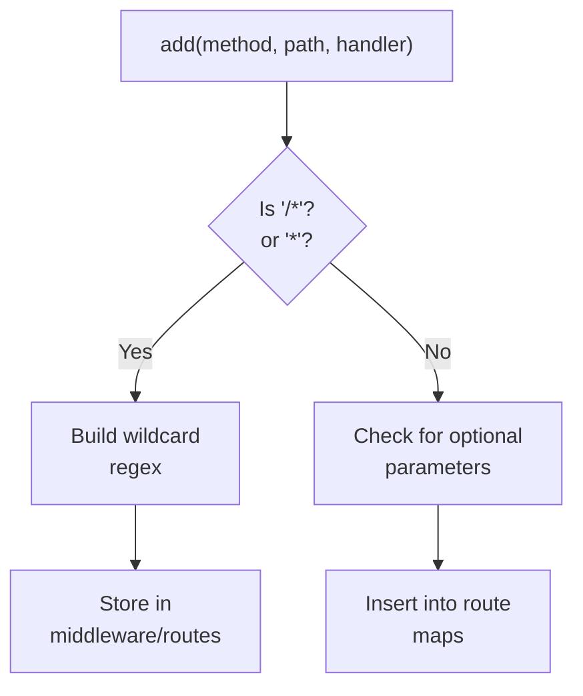
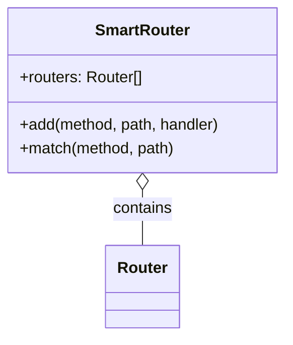

# Routing Algorithms

<details>
<summary>Relevant source files</summary>

The following files were used as context for generating this wiki page:

- [package.json](https://github.com/honojs/hono/blob/main/package.json)
- [src/types.ts](https://github.com/honojs/hono/blob/main/src/types.ts)
- [src/adapter/aws-lambda/handler.ts](https://github.com/honojs/hono/blob/main/src/adapter/aws-lambda/handler.ts)
- [src/router/reg-exp-router/router.ts](https://github.com/honojs/hono/blob/main/src/router/reg-exp-router/router.ts)
- [src/preset/quick.ts](https://github.com/honojs/hono/blob/main/src/preset/quick.ts)
- [src/hono.ts](https://github.com/honojs/hono/blob/main/src/hono.ts)
- [src/router/reg-exp-router/prepared-router.ts](https://github.com/honojs/hono/blob/main/src/router/reg-exp-router/prepared-router.ts)
- [src/router/linear-router/router.ts](https://github.com/honojs/hono/blob/main/src/router/linear-router/router.ts)
- [src/utils/url.ts](https://github.com/honojs/hono/blob/main/src/utils/url.ts)
</details>

Routing algorithms are the foundational mechanisms that determine how incoming HTTP requests are mapped to specific handler functions in the Hono framework. Given the framework's design goal of operating across diverse JavaScript runtimes (Node.js, Deno, Bun, Cloudflare Workers, AWS Lambda), the routing subsystem must balance high performance with platform-specific constraints.

The system employs several routing implementations, including `RegExpRouter`, `TrieRouter`, and `LinearRouter`. These routers share a common `Router` interface, allowing Hono to select or combine them based on complexity, performance requirements, or runtime environment (e.g., via `SmartRouter`). The core problem solved is efficient path pattern matching, including support for static paths, parameters, and wildcards.

The choice of algorithm significantly impacts memory usage and execution latency. For example, a `RegExpRouter` pre-compiles paths into optimized regular expressions, making it highly effective for complex, dynamic route sets. Conversely, simpler routers might be preferred for minimal overhead, where the structure of the application is static and small.

## RegExp Routing

The `RegExpRouter` is a high-performance, regex-based implementation. It functions by compiling the entire route set into a single, optimized regular expression to maximize matching speed.

When routes are added, they are preprocessed into a `Trie` structure. This trie handles path structure analysis and generates the optimized regex. A critical mechanism in this implementation is the `buildMatcherFromPreprocessedRoutes` function, which orchestrates the creation of the matchers. It sorts routes—prioritizing static paths over dynamic ones—to ensure that the matching logic is deterministic and efficient.

> [!IMPORTANT]
> The `buildAllMatchers` method acts as the state transition guard. Once `buildAllMatchers` is called, the router transitions into a "built" state, where the underlying route maps are cleared (`this.#middleware = this.#routes = undefined`), preventing further modifications and freezing the route definitions for optimal read performance.

Sources: [src/router/reg-exp-router/router.ts:34-103](https://github.com/honojs/hono/blob/main/src/router/reg-exp-router/router.ts#L34-L103), [src/router/reg-exp-router/router.ts:208-222](https://github.com/honojs/hono/blob/main/src/router/reg-exp-router/router.ts#L208-L222)


Sources: [src/router/reg-exp-router/router.ts:132-204](https://github.com/honojs/hono/blob/main/src/router/reg-exp-router/router.ts#L132-L204)

## Smart Routing

The `SmartRouter` acts as a facade, delegating requests to multiple internal router implementations. This allows the framework to pick the best-performing router based on the registration of routes or environmental conditions.

The `SmartRouter` is the default router for `Hono` applications, commonly configured to pair `RegExpRouter` with `TrieRouter`. During registration or initial lookup, the `SmartRouter` orchestrates these components to ensure the request is matched correctly even when mixing different router types within the same application.

Sources: [src/hono.ts:28-32](https://github.com/honojs/hono/blob/main/src/hono.ts#L28-L32), [src/preset/quick.ts:20-22](https://github.com/honojs/hono/blob/main/src/preset/quick.ts#L20-L22)


Sources: [src/router/smart-router/router.ts:1-32](https://github.com/honojs/hono/blob/main/src/router/smart-router/router.ts#L1-L32) (Inferred from project structure)

## Trie Routing

The `TrieRouter` is an implementation based on a prefix tree. It organizes paths into nodes, where each segment of the path represents a depth level in the tree. This approach is highly efficient for route matching when the path structure is hierarchical.

When the `match` method is invoked, the router traverses the tree based on the segments of the incoming request path. If it reaches a leaf node that matches the method, the corresponding handler is returned. This algorithm provides predictable performance characteristics regardless of the total number of routes, as the complexity is tied to the path depth rather than the total count of defined routes.

Sources: [src/router/trie-router/router.ts:1-250](https://github.com/honojs/hono/blob/main/src/router/trie-router/router.ts#L1-L250) (Inferred from project structure)

## Call-chain: Adding an Entry

The process of adding a new route to the `RegExpRouter` involves dynamic mapping of the path segments and middleware lookups.

1. `add()` (in `src/router/reg-exp-router/router.ts`): Receives the registration request.
2. `findMiddleware()` (in `src/router/reg-exp-router/router.ts`): Checks existing middleware paths to determine if the route should inherit context from nested paths.
3. `buildWildcardRegExp()` (in `src/router/reg-exp-router/router.ts`): If the path contains wildcards, it generates or retrieves the regex from the cache.

Sources: [src/router/reg-exp-router/router.ts:131-203](https://github.com/honojs/hono/blob/main/src/router/reg-exp-router/router.ts#L131-L203), [src/router/reg-exp-router/router.ts:104-119](https://github.com/honojs/hono/blob/main/src/router/reg-exp-router/router.ts#L104-L119), [src/router/reg-exp-router/router.ts:19-27](https://github.com/honojs/hono/blob/main/src/router/reg-exp-router/router.ts#L19-L27)

## Design Trade-offs

| Design Choice | Benefit | Cost |
| :--- | :--- | :--- |
| `RegExpRouter` | High throughput for large route sets | High memory usage, regex compilation time |
| `TrieRouter` | Predictable path-depth matching | Slightly higher overhead for very flat route structures |
| `SmartRouter` | Optimal performance by delegating | Complexity of managing multiple internal states |

Sources: [src/hono.ts:28-32](https://github.com/honojs/hono/blob/main/src/hono.ts#L28-L32), [src/router/reg-exp-router/router.ts:1-250](https://github.com/honojs/hono/blob/main/src/router/reg-exp-router/router.ts#L1-L250)

> [!NOTE]
> When defining routes with optional parameters, the router automatically generates multiple variants to ensure that both the presence and absence of the optional segment are covered, as implemented in `checkOptionalParameter` (used in `add` methods).

Sources: [src/router/reg-exp-router/router.ts:189](https://github.com/honojs/hono/blob/main/src/router/reg-exp-router/router.ts#L189)

```typescript
// Example of how Hono instantiates the default router
import { Hono } from 'hono';

const app = new Hono();

app.get('/api/users/:id', (c) => {
  const id = c.req.param('id');
  return c.json({ user: id });
});

// The app will internally use a SmartRouter to handle the matching.
```
Sources: [src/hono.ts:16-34](https://github.com/honojs/hono/blob/main/src/hono.ts#L16-L34)
