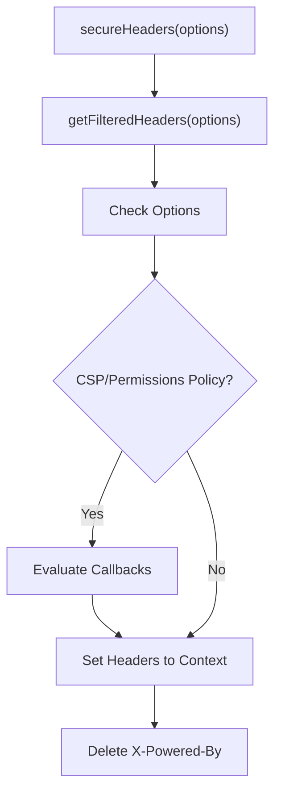

# Security Protection

<details>
<summary>Relevant source files</summary>

The following files were used as context for generating this wiki page:

- [src/middleware/secure-headers/secure-headers.ts](https://github.com/honojs/hono/blob/main/src/middleware/secure-headers/secure-headers.ts)
- [package.json](https://github.com/honojs/hono/blob/main/package.json)
- [src/types.ts](https://github.com/honojs/hono/blob/main/src/types.ts)
- [src/middleware/ip-restriction/index.ts](https://github.com/honojs/hono/blob/main/src/middleware/ip-restriction/index.ts)
- [src/middleware/csrf/index.ts](https://github.com/honojs/hono/blob/main/src/middleware/csrf/index.ts)
- [src/middleware/method-override/index.ts](https://github.com/honojs/hono/blob/main/src/middleware/method-override/index.ts)
- [src/adapter/aws-lambda/handler.ts](https://github.com/honojs/hono/blob/main/src/adapter/aws-lambda/handler.ts)
</details>

"Security Protection" in Hono encompasses a suite of middleware components designed to harden web applications against common vulnerabilities like Cross-Site Request Forgery (CSRF), unauthorized IP access, and protocol-level misconfigurations. These utilities are architected as modular middleware handlers that integrate seamlessly into the standard request-response lifecycle of a Hono application.

By providing declarative protection mechanisms, these components allow developers to enforce security policies—such as header-based security, IP filtering, and request origin validation—with minimal boilerplate. They operate by either modifying outgoing response headers or gating the request execution path, ensuring that only trusted or compliant traffic proceeds to the application handlers.

This subsystem is built to be extensible and runtime-agnostic, supporting diverse environments from AWS Lambda to standard web environments. It emphasizes "fail-safe" defaults (e.g., denying unknown IPs, restrictive CSRF checks) and enables precise customization through provided functional callbacks, allowing developers to tailor security logic to their specific environment needs.

## Secure Headers
The `secureHeaders` middleware helps defend against common browser-based attacks by setting security-focused HTTP response headers. It defaults to a hardened configuration and can be overridden via `SecureHeadersOptions`.

The core mechanism involves `getFilteredHeaders(options)`, which takes the provided configuration and maps it against a static `HEADERS_MAP` (lines 94-107). This map defines default security headers like `X-Content-Type-Options: nosniff` and `Strict-Transport-Security`. If a custom string value is provided, it overrides the default value for that header.


Sources: [src/middleware/secure-headers/secure-headers.ts:179-229](https://github.com/honojs/hono/blob/main/src/middleware/secure-headers/secure-headers.ts#L179-L229)

> [!TIP]
> Use the `NONCE` utility provided by this middleware to generate a unique nonce per request for CSP strict-dynamic policies, ensuring script security without hardcoding values.

## CSRF Protection
The CSRF middleware protects against cross-site request forgeries by validating the `Origin` or `Sec-Fetch-Site` request headers. If a request is not considered a "safe" method (GET/HEAD), the middleware requires either a valid origin or a valid fetch site value to proceed.

The validation logic collects potential "success" paths via `isAllowedOrigin` and `isAllowedSecFetchSite`. The logic is resolved by verifying if the header is present and then checking it against either a static allowlist or a dynamic `IsAllowed...Handler` function (lines 95-135).

**Call Chain: Csrf -> IsSecFetchSite**
1. `csrf` (main request handler loop, lines 93-150)
2. `isAllowedSecFetchSite` (validation check, lines 126-135)
3. `isSecFetchSite` (type guard for header values, lines 14-15)

Sources: [src/middleware/csrf/index.ts:14-15, 93-150](https://github.com/honojs/hono/blob/main/src/middleware/csrf/index.ts#L14-L15)

## IP Restriction
The `ipRestriction` middleware filters incoming requests based on a denyList and an allowList. It utilizes CIDR notation parsing and bitwise manipulation to identify if a remote address falls within a restricted range.

The mechanism converts IP strings into binary representations (BigInt) to perform fast mathematical comparisons.
- **Rule parsing:** `buildMatcher` (lines 51-166) creates a closure containing the filtered logic. 
- **Tie-break logic:** If both lists are present, the matcher evaluates the rules in order of registration. A hit in the `denyList` triggers the `blockError` (line 231-236), while a hit in the `allowList` allows the request to pass to `next()` (line 256-258).

**Call Chain: IpRestriction -> ParseCidrPrefix**
1. `ipRestriction` (line 218)
2. `buildMatcher` (line 228)
3. `parseCidrPrefix` (line 40)

Sources: [src/middleware/ip-restriction/index.ts:217-278](https://github.com/honojs/hono/blob/main/src/middleware/ip-restriction/index.ts#L217-L278)

> [!WARNING]
> Invalid IP addresses specified in rules will cause a `TypeError` which is caught in `ipRestriction`. The middleware will default to blocking such requests to prevent bypasses via malformed configuration.

## Method Override
The `methodOverride` middleware facilitates RESTful patterns by overriding the HTTP request method based on form data, headers, or query parameters. This is essential for environments (like legacy HTML forms) that only support GET and POST.

Mechanism: It clones the original request (lines 71-72) to inspect the body or headers. If a valid override method (e.g., DELETE) is found, it constructs a new `Request` object with the overridden method and updated headers, then calls the application's `fetch` method (lines 88, 102, 117). This effectively re-routes the request through the Hono app with the modified intent.

Sources: [src/middleware/method-override/index.ts:60-136](https://github.com/honojs/hono/blob/main/src/middleware/method-override/index.ts#L60-L136)

## Security Data Design
The security modules rely on explicit configuration interfaces to enforce behavior.

| Configuration Component | Scope | Primary Purpose |
| :--- | :--- | :--- |
| `denyList` | `ipRestriction` | Explicitly block ranges/IPs |
| `allowList` | `ipRestriction` | Explicitly permit ranges/IPs |
| `origin` | `csrf` | Validate origin header |
| `secFetchSite` | `csrf` | Validate site fetch policy |

Sources: [src/middleware/ip-restriction/index.ts:172-175](https://github.com/honojs/hono/blob/main/src/middleware/ip-restriction/index.ts#L172-L175), [src/middleware/csrf/index.ts:23-26](https://github.com/honojs/hono/blob/main/src/middleware/csrf/index.ts#L23-L26)

## Example: Integrated Security Setup
This example shows how to combine these security middlewares to protect a Hono application.

```typescript
import { Hono } from 'hono'
import { secureHeaders } from 'hono/secure-headers'
import { csrf } from 'hono/csrf'
import { ipRestriction } from 'hono/ip-restriction'

const app = new Hono()

// Apply multiple security layers
app.use('*', secureHeaders())
app.use('*', csrf())
app.use('/admin/*', ipRestriction(c => c.req.header('x-forwarded-for') || '', {
  allowList: ['10.0.0.0/8']
}))

app.get('/', (c) => c.text('Protected and Secure'))
```
Sources: [src/middleware/secure-headers/secure-headers.ts:173-177](https://github.com/honojs/hono/blob/main/src/middleware/secure-headers/secure-headers.ts#L173-L177), [src/middleware/csrf/index.ts:55-60](https://github.com/honojs/hono/blob/main/src/middleware/csrf/index.ts#L55-L60), [src/middleware/ip-restriction/index.ts:187-203](https://github.com/honojs/hono/blob/main/src/middleware/ip-restriction/index.ts#L187-L203)

## Related

- [[Authentication]]
- [[Traffic Control]]

