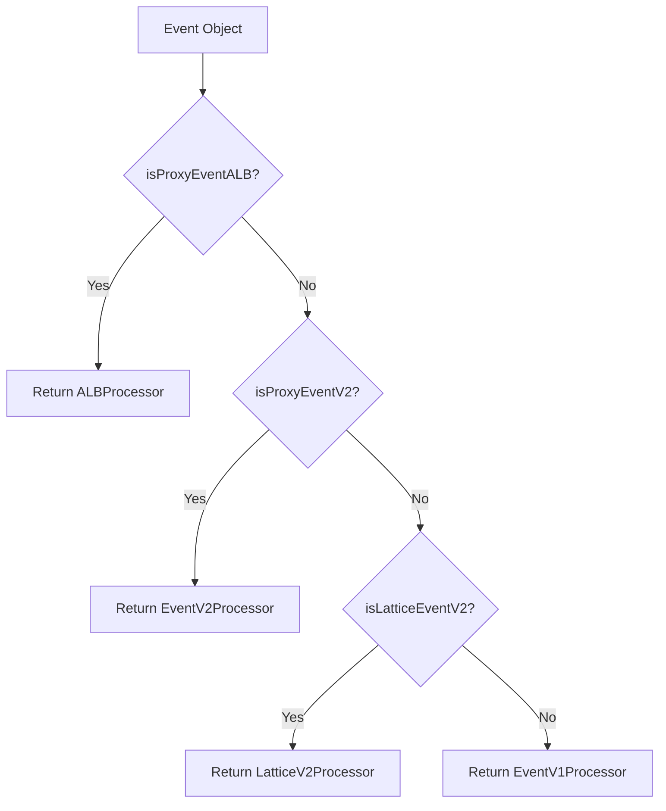
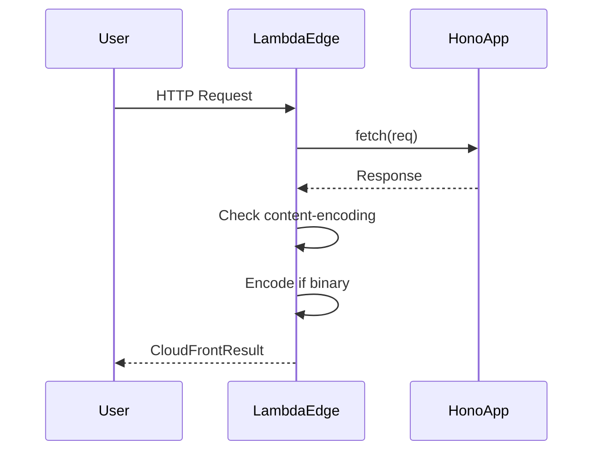

# Serverless Adapters

<details>
<summary>Relevant source files</summary>

The following files were used as context for generating this wiki page:

- [src/adapter/aws-lambda/handler.ts](https://github.com/honojs/hono/blob/main/src/adapter/aws-lambda/handler.ts)
- [src/context.ts](https://github.com/honojs/hono/blob/main/src/context.ts)
- [package.json](https://github.com/honojs/hono/blob/main/package.json)
- [src/adapter/lambda-edge/handler.ts](https://github.com/honojs/hono/blob/main/src/adapter/lambda-edge/handler.ts)
- [src/adapter/cloudflare-pages/handler.ts](https://github.com/honojs/hono/blob/main/src/adapter/cloudflare-pages/handler.ts)
- [src/request.ts](https://github.com/honojs/hono/blob/main/src/request.ts)
- [src/adapter/netlify/handler.ts](https://github.com/honojs/hono/blob/main/src/adapter/netlify/handler.ts)
- [README.md](https://github.com/honojs/hono/blob/main/README.md)
- [src/adapter/aws-lambda/types.ts](https://github.com/honojs/hono/blob/main/src/adapter/aws-lambda/types.ts)
- [src/adapter/netlify/mod.ts](https://github.com/honojs/hono/blob/main/src/adapter/netlify/mod.ts)
- [src/helper/adapter/index.ts](https://github.com/honojs/hono/blob/main/src/helper/adapter/index.ts)
- [src/adapter/aws-lambda/index.ts](https://github.com/honojs/hono/blob/main/src/adapter/aws-lambda/index.ts)
- [src/adapter/lambda-edge/conninfo.ts](https://github.com/honojs/hono/blob/main/src/adapter/lambda-edge/conninfo.ts)
- [src/adapter/lambda-edge/index.ts](https://github.com/honojs/hono/blob/main/src/adapter/lambda-edge/index.ts)
- [src/adapter/vercel/handler.ts](https://github.com/honojs/hono/blob/main/src/adapter/vercel/handler.ts)
- [src/adapter/netlify/index.ts](https://github.com/honojs/hono/blob/main/src/adapter/netlify/index.ts)
- [runtime-tests/lambda/mock.ts](https://github.com/honojs/hono/blob/main/runtime-tests/lambda/mock.ts)
- [src/adapter/netlify/conninfo.ts](https://github.com/honojs/hono/blob/main/src/adapter/netlify/conninfo.ts)
- [src/adapter/aws-lambda/conninfo.ts](https://github.com/honojs/hono/blob/main/src/adapter/aws-lambda/conninfo.ts)
- [runtime-tests/lambda/stream-mock.ts](https://github.com/honojs/hono/blob/main/runtime-tests/lambda/stream-mock.ts)
- [src/adapter/service-worker/types.ts](https://github.com/honojs/hono/blob/main/src/adapter/service-worker/types.ts)
- [src/adapter/cloudflare-pages/index.ts](https://github.com/honojs/hono/blob/main/src/adapter/cloudflare-pages/index.ts)
- [src/adapter/vercel/conninfo.ts](https://github.com/honojs/hono/blob/main/src/adapter/vercel/conninfo.ts)
- [src/adapter/vercel/index.ts](https://github.com/honojs/hono/blob/main/src/adapter/vercel/index.ts)
- [jsr.json](https://github.com/honojs/hono/blob/main/jsr.json)
- [src/adapter/service-worker/handler.ts](https://github.com/honojs/hono/blob/main/src/adapter/service-worker/handler.ts)
- [src/adapter/cloudflare-workers/conninfo.ts](https://github.com/honojs/hono/blob/main/src/adapter/cloudflare-workers/conninfo.ts)
- [src/utils/headers.ts](https://github.com/honojs/hono/blob/main/src/utils/headers.ts)
</details>

Serverless Adapters act as the bridge between Hono's unified request handling model and the fragmented, platform-specific event objects provided by serverless environments. Because cloud platforms like AWS Lambda, Vercel, and Cloudflare Pages each employ proprietary event structures, these adapters normalize external inputs into standard [Request](https://developer.mozilla.org/en-US/docs/Web/API/Request) objects and translate Hono's resulting responses back into the environment's required return signature.

By isolating platform-specific serialization and logic, Serverless Adapters ensure that developers can write a single, clean Hono application that remains portable across disparate infrastructures. They handle complex tasks such as decoding base64-encoded request bodies, mapping various header formats (e.g., multi-value headers in AWS ALB), and extracting platform-specific context like identity info or execution parameters, all while maintaining strict adherence to Web Standards internally.

The architecture relies on a "Processor" pattern for platforms with complex branching, such as AWS Lambda. This design enables the system to handle multiple event types (REST API vs. HTTP API vs. ALB) via a shared logic layer that dispatches requests to the appropriate normalized handler. This avoids a monolith of conditional code, instead providing dedicated processing paths that can be tested independently.

## AWS Lambda Event Processing Mechanism

The AWS Lambda adapter uses an `EventProcessor` abstract base class to normalize diverse Lambda event triggers. The core mechanism is a multi-step transformation: the system identifies the event type (e.g., ALB vs. API Gateway v2) through the `getProcessor` helper, which returns an instance of the corresponding subclass.

When `handle()` is invoked, the chosen processor executes a `createRequest` flow to convert the platform-specific `event` into a standard `Request` object. This process constructs the URL from domain and path properties, converts headers into a standard `Headers` object, and handles body encoding (base64 or plain text) based on the event's `isBase64Encoded` flag. After the Hono application processes the request, the processor invokes `createResult` to perform the inverse: serializing the `Response` object back into an `APIGatewayProxyResult`.

Sources: [src/adapter/aws-lambda/handler.ts:278-386](https://github.com/honojs/hono/blob/main/src/adapter/aws-lambda/handler.ts#L278-L386), [src/adapter/aws-lambda/handler.ts:625-637](https://github.com/honojs/hono/blob/main/src/adapter/aws-lambda/handler.ts#L625-L637)

## Call-chain: Processing a Standard Lambda Request

The following chain illustrates how the adapter consumes a standard request until it derives a header value:

1. `handle` (src/adapter/aws-lambda/handler.ts:239-276): Initiates the request-response lifecycle.
2. `createRequest` (src/adapter/aws-lambda/handler.ts:318-342): Orchestrates construction of the standard Request.
3. `getDomainName` (src/adapter/aws-lambda/handler.ts:301-316): Attempts to derive the domain, falling back to header inspection.
4. `getHeaderValue` (src/adapter/aws-lambda/handler.ts:291-299): Extracts the specific value, intelligently handling single-value and multi-value header containers.

Sources: [src/adapter/aws-lambda/handler.ts:239-276](https://github.com/honojs/hono/blob/main/src/adapter/aws-lambda/handler.ts#L239-L276), [src/adapter/aws-lambda/handler.ts:318-342](https://github.com/honojs/hono/blob/main/src/adapter/aws-lambda/handler.ts#L318-L342), [src/adapter/aws-lambda/handler.ts:301-316](https://github.com/honojs/hono/blob/main/src/adapter/aws-lambda/handler.ts#L301-L316), [src/adapter/aws-lambda/handler.ts:291-299](https://github.com/honojs/hono/blob/main/src/adapter/aws-lambda/handler.ts#L291-L299)

## Lambda Event Selection Logic

The system identifies the event type dynamically inside `getProcessor` using explicit guards. The selection order is critical because different event interfaces may share overlapping fields.



> [!NOTE]
> `isProxyEventV2` checks for both `rawPath` and the existence of an `http` object in the request context. This distinction is necessary because V1 (REST API) events behind custom domain mappings may also contain a `rawPath`.

Sources: [src/adapter/aws-lambda/handler.ts:625-658](https://github.com/honojs/hono/blob/main/src/adapter/aws-lambda/handler.ts#L625-L658)

## Lambda@Edge Request Flow

Lambda@Edge requires specific transformation steps to conform to CloudFront's event structure. The `createResult` function checks if content encoding is binary by testing the `content-encoding` header against the `identity` encoding type. If it is binary, it encodes the response body to base64.



Sources: [src/adapter/lambda-edge/handler.ts:148-162](https://github.com/honojs/hono/blob/main/src/adapter/lambda-edge/handler.ts#L148-L162)

## Binary Content Detection

The system employs a default content-type detection strategy to differentiate between text-based and binary data, which is essential for proper Base64 encoding in AWS-based adapters.

| Function | Default Logic | Purpose |
| :--- | :--- | :--- |
| `defaultIsContentTypeBinary` | `!/^text\/(?:plain\|html\|css\|javascript\|csv)\|(?:\/\|\+)(?:json\|xml)\s*(?:;\|$)/` | Determines if response should be base64-encoded. |
| `isContentEncodingBinary` | `!!contentEncoding && !/^identity$/i` | Checks if encoding implies binary data handling. |

Sources: [src/adapter/aws-lambda/handler.ts:666-674](https://github.com/honojs/hono/blob/main/src/adapter/aws-lambda/handler.ts#L666-L674)

> [!TIP]
> Users can override the default binary detection logic by providing an `isContentTypeBinary` function to the `handle()` options. This is essential for custom file types like PDFs or custom image formats.

## Lambda Streaming Architecture

The `streamHandle` function leverages the AWS `awslambda.streamifyResponse` API. This allows Hono to stream responses directly back to the client without buffering the entire body into memory, significantly reducing memory usage for large payloads. It wraps the standard `NodeJS.WritableStream` using `awslambda.HttpResponseStream` to inject metadata before pumping the stream data.

```typescript
// The core streaming pump: consumes the reader and writes to the AWS stream
const streamToNodeStream = async (
  reader: ReadableStreamDefaultReader<Uint8Array>,
  writer: NodeJS.WritableStream
): Promise<void> => {
  let readResult = await reader.read()
  while (!readResult.done) {
    writer.write(readResult.value)
    readResult = await reader.read()
  }
  writer.end()
}
```

Sources: [src/adapter/aws-lambda/handler.ts:126-136](https://github.com/honojs/hono/blob/main/src/adapter/aws-lambda/handler.ts#L126-L136)

## Full Example: AWS Lambda Handler with Custom Logic

The following example demonstrates how to initialize an application for AWS Lambda, including custom binary content-type handling and the `handler` export.

```typescript
import { Hono } from 'hono'
import { handle, defaultIsContentTypeBinary } from 'hono/aws-lambda'

const app = new Hono()

app.get('/binary', (c) => {
  const binaryData = new Uint8Array([0x89, 0x50, 0x4e, 0x47])
  return c.body(binaryData, 200, { 'Content-Type': 'image/png' })
})

// Configure the handler with custom detection
export const handler = handle(app, {
  isContentTypeBinary: (contentType) => {
    // Keep standard text/json logic, but add custom image handling
    return defaultIsContentTypeBinary(contentType) || contentType.startsWith('image/')
  }
})
```

Sources: [src/adapter/aws-lambda/handler.ts:225-236](https://github.com/honojs/hono/blob/main/src/adapter/aws-lambda/handler.ts#L225-L236)

## Related

- [[Edge Workers]]
- [[Local Runtimes]]

