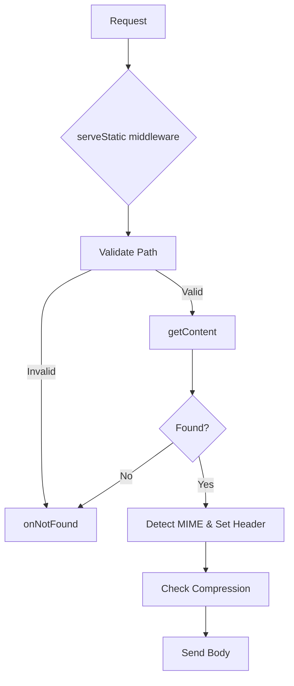

# Static Assets

<details>
<summary>Relevant source files</summary>

The following files were used as context for generating this wiki page:

- [package.json](https://github.com/honojs/hono/blob/main/package.json)
- [src/context.ts](https://github.com/honojs/hono/blob/main/src/context.ts)
- [src/adapter/cloudflare-pages/handler.ts](https://github.com/honojs/hono/blob/main/src/adapter/cloudflare-pages/handler.ts)
- [jsr.json](https://github.com/honojs/hono/blob/main/jsr.json)
- [src/adapter/aws-lambda/handler.ts](https://github.com/honojs/hono/blob/main/src/adapter/aws-lambda/handler.ts)
- [src/helper/ssg/ssg.ts](https://github.com/honojs/hono/blob/main/src/helper/ssg/ssg.ts)
- [src/adapter/lambda-edge/handler.ts](https://github.com/honojs/hono/blob/main/src/adapter/lambda-edge/handler.ts)
- [src/adapter/deno/serve-static.ts](https://github.com/honojs/hono/blob/main/src/adapter/deno/serve-static.ts)
- [src/middleware/serve-static/index.ts](https://github.com/honojs/hono/blob/main/src/middleware/serve-static/index.ts)
- [src/helper/ssg/utils.ts](https://github.com/honojs/hono/blob/main/src/helper/ssg/utils.ts)
- [src/client/utils.ts](https://github.com/honojs/hono/blob/main/src/client/utils.ts)
- [src/adapter/cloudflare-workers/serve-static.ts](https://github.com/honojs/hono/blob/main/src/adapter/cloudflare-workers/serve-static.ts)
- [src/adapter/cloudflare-workers/utils.ts](https://github.com/honojs/hono/blob/main/src/adapter/cloudflare-workers/utils.ts)
- [src/adapter/bun/serve-static.ts](https://github.com/honojs/hono/blob/main/src/adapter/bun/serve-static.ts)
- [src/adapter/cloudflare-workers/serve-static-module.ts](https://github.com/honojs/hono/blob/main/src/adapter/cloudflare-workers/serve-static-module.ts)
- [src/utils/mime.ts](https://github.com/honojs/hono/blob/main/src/utils/mime.ts)
- [runtime-tests/bun/static-absolute-root/plain.txt](https://github.com/honojs/hono/blob/main/runtime-tests/bun/static-absolute-root/plain.txt)
- [src/adapter/cloudflare-pages/index.ts](https://github.com/honojs/hono/blob/main/src/adapter/cloudflare-pages/index.ts)
- [src/adapter/cloudflare-workers/index.ts](https://github.com/honojs/hono/blob/main/src/adapter/cloudflare-workers/index.ts)
- [runtime-tests/bun/static/plain.txt](https://github.com/honojs/hono/blob/main/runtime-tests/bun/static/plain.txt)
- [src/helper/ssg/middleware.ts](https://github.com/honojs/hono/blob/main/src/helper/ssg/middleware.ts)
- [src/utils/compress.ts](https://github.com/honojs/hono/blob/main/src/utils/compress.ts)
- [src/helper/adapter/index.ts](https://github.com/honojs/hono/blob/main/src/helper/adapter/index.ts)
- [src/middleware/serve-static/path.ts](https://github.com/honojs/hono/blob/main/src/middleware/serve-static/path.ts)
</details>

Static Assets are a fundamental part of web application delivery, encompassing images, CSS, JavaScript, and other files that do not change based on user context. In Hono, managing these assets is decoupled from the core application logic to allow seamless integration across diverse environments like Bun, Deno, and Cloudflare Workers, where file-system access or KV storage interfaces differ significantly.

The subsystem exists to normalize the process of mapping a URL request path to a physical file or remote resource. By providing a unified `serveStatic` middleware, Hono abstracts the retrieval mechanism, allowing developers to focus on path resolution and MIME type detection while letting the specific adapter handle the platform-specific I/O.

Beyond real-time serving, Hono also supports Static Site Generation (SSG). This allows applications to pre-render dynamic routes into static files during the build process, enabling high-performance deployment on edge networks or object storage. The integration of hooks and content parsing utilities ensures that the transition from dynamic runtime to static deployment is predictable and robust.

## Core Middleware Architecture
The `serveStatic` middleware is a polymorphic layer that accepts an environment-specific `getContent` function. This function serves as the bridge between Hono’s request flow and the underlying runtime's I/O operations.

When a request enters the middleware, it:
1. Validates the incoming path against potential directory traversal attacks using a regex guard: `/(?:^|[\/\\])\.{1,2}(?:$|[\/\\])|[\/\\]{2,}|\\/`.
2. Resolves the final file path using a configurable `join` function.
3. Calls the provided `getContent` to retrieve binary or text data.
4. If a match is found, it automatically detects the MIME type and sets appropriate `Content-Type` headers before returning the body.

Sources: [src/middleware/serve-static/index.ts:60-120](https://github.com/honojs/hono/blob/main/src/middleware/serve-static/index.ts#L60-L120)


Sources: [src/middleware/serve-static/index.ts:65-119](https://github.com/honojs/hono/blob/main/src/middleware/serve-static/index.ts#L65-L119)

## Platform Adapters
Because runtimes (Deno, Bun, Cloudflare) expose different APIs for accessing files, the `serveStatic` middleware is implemented as a wrapper. Each adapter provides a specialized `getContent` implementation:

| Runtime | Implementation | Key Mechanism |
| :--- | :--- | :--- |
| Bun | `Bun.file()` | Uses `Bun.file(path).exists()` to check availability. |
| Deno | `Deno.open()` | Uses `Deno.open` to stream files directly. |
| Cloudflare Workers | KV / Assets | Integrates with `__STATIC_CONTENT` or static assets. |

Sources: [src/adapter/bun/serve-static.ts:12-16](https://github.com/honojs/hono/blob/main/src/adapter/bun/serve-static.ts#L12-L16), [src/adapter/deno/serve-static.ts:12-26](https://github.com/honojs/hono/blob/main/src/adapter/deno/serve-static.ts#L12-L26), [src/adapter/cloudflare-workers/utils.ts:11-50](https://github.com/honojs/hono/blob/main/src/adapter/cloudflare-workers/utils.ts#L11-L50)

## Static Site Generation (SSG) Lifecycle
The SSG process transforms a dynamic Hono app into a static site. The process involves traversing all routes, executing the `app.fetch` cycle to obtain content, and persisting the resulting bytes to a destination directory.

1. **Route Filtering:** `filterStaticGenerateRoutes` identifies all `GET` and `ALL` method routes.
2. **Execution Pool:** A concurrency pool (`createPool`) manages concurrent `app.fetch` calls, preventing resource exhaustion during bulk generation.
3. **Content Parsing:** `parseResponseContent` determines whether to interpret data as `text` (for JSON/HTML) or `ArrayBuffer` (for binary assets).
4. **Persisting:** `saveContentToFile` maps route paths to disk paths, ensuring files are written to the correct subdirectories using `fsModule.mkdir`.

Sources: [src/helper/ssg/ssg.ts:225-334](https://github.com/honojs/hono/blob/main/src/helper/ssg/ssg.ts#L225-L334)

> [!CAUTION]
> The `ensureWithinOutDir` utility explicitly checks that resolved file paths do not escape the designated output directory, preventing malicious path traversal during SSG output generation. It compares normalized paths and throws an Error if the file path sits outside the `outDir`.
Sources: [src/helper/ssg/utils.ts:77-87](https://github.com/honojs/hono/blob/main/src/helper/ssg/utils.ts#L77-L87)

## Pre-compressed Asset Serving
When `precompressed` mode is enabled, the middleware attempts to serve pre-compressed versions of assets (e.g., `file.js.br` or `file.js.gz`) based on the `Accept-Encoding` header of the incoming client request.

The order of preference is determined by `ENCODINGS_ORDERED_KEYS` (`['br', 'zstd', 'gzip']`). If a compressed file exists, it replaces the original content and the `Content-Encoding` header is updated.

Sources: [src/middleware/serve-static/index.ts:96-117](https://github.com/honojs/hono/blob/main/src/middleware/serve-static/index.ts#L96-L117)

## MIME Type Resolution
MIME types are resolved via `getMimeType`, which uses a regex to isolate the file extension from the filename and look it up in a central `baseMimes` registry.

| Extension | Content-Type |
| :--- | :--- |
| html | `text/html; charset=utf-8` |
| js | `text/javascript; charset=utf-8` |
| css | `text/css; charset=utf-8` |
| json | `application/json` |

Sources: [src/utils/mime.ts:6-16](https://github.com/honojs/hono/blob/main/src/utils/mime.ts#L6-L16)

## Implementation Example
To implement static serving in a standard Node-compatible environment, you would typically use an adapter that provides a `getContent` implementation:

```typescript
import { Hono } from 'hono'
import { serveStatic } from 'hono/serve-static'

const app = new Hono()

// Serve files from the 'public' directory
app.use('/*', serveStatic({ 
  root: './public',
  onNotFound: (path, c) => {
    console.log(`${path} is not found`)
  }
}))

export default app
```
Sources: [src/middleware/serve-static/index.ts:13-21](https://github.com/honojs/hono/blob/main/src/middleware/serve-static/index.ts#L13-L21)

> [!NOTE]
> The `defaultJoin` utility serves as a fallback for path concatenation. It uses `/` separators exclusively and handles navigation segments (`..`) by popping the `resolved` stack, ensuring valid file system lookups regardless of the specific OS path separator in the runtime.
Sources: [src/middleware/serve-static/path.ts:5-25](https://github.com/honojs/hono/blob/main/src/middleware/serve-static/path.ts#L5-L25)

## Related

- [[Static Generation]]

