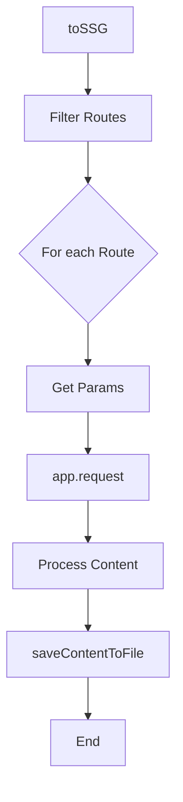

# Static Generation

<details>
<summary>Relevant source files</summary>

The following files were used as context for generating this wiki page:

- [src/jsx/dom/render.ts](https://github.com/honojs/hono/blob/main/src/jsx/dom/render.ts)
- [package.json](https://github.com/honojs/hono/blob/main/package.json)
- [src/helper/ssg/ssg.ts](https://github.com/honojs/hono/blob/main/src/helper/ssg/ssg.ts)
- [src/context.ts](https://github.com/honojs/hono/blob/main/src/context.ts)
- [src/adapter/cloudflare-pages/handler.ts](https://github.com/honojs/hono/blob/main/src/adapter/cloudflare-pages/handler.ts)
- [src/jsx/streaming.ts](https://github.com/honojs/hono/blob/main/src/jsx/streaming.ts)
- [src/jsx/dom/intrinsic-element/components.ts](https://github.com/honojs/hono/blob/main/src/jsx/dom/intrinsic-element/components.ts)
- [src/router/reg-exp-router/prepared-router.ts](https://github.com/honojs/hono/blob/main/src/router/reg-exp-router/prepared-router.ts)
- [src/helper/ssg/utils.ts](https://github.com/honojs/hono/blob/main/src/helper/ssg/utils.ts)
- [src/helper/ssg/plugins.ts](https://github.com/honojs/hono/blob/main/src/helper/ssg/plugins.ts)
- [src/jsx/intrinsic-element/components.ts](https://github.com/honojs/hono/blob/main/src/jsx/intrinsic-element/components.ts)
- [src/utils/url.ts](https://github.com/honojs/hono/blob/main/src/utils/url.ts)
- [src/router/reg-exp-router/router.ts](https://github.com/honojs/hono/blob/main/src/router/reg-exp-router/router.ts)
- [src/helper/route/index.ts](https://github.com/honojs/hono/blob/main/src/helper/route/index.ts)
- [src/helper/ssg/middleware.ts](https://github.com/honojs/hono/blob/main/src/helper/ssg/middleware.ts)
- [src/adapter/bun/ssg.ts](https://github.com/honojs/hono/blob/main/src/adapter/bun/ssg.ts)
- [src/adapter/deno/ssg.ts](https://github.com/honojs/hono/blob/main/src/adapter/deno/ssg.ts)
- [src/router/linear-router/router.ts](https://github.com/honojs/hono/blob/main/src/router/linear-router/router.ts)
- [src/utils/html.ts](https://github.com/honojs/hono/blob/main/src/utils/html.ts)
- [src/router/trie-router/node.ts](https://github.com/honojs/hono/blob/main/src/router/trie-router/node.ts)
- [src/helper/ssg/index.ts](https://github.com/honojs/hono/blob/main/src/helper/ssg/index.ts)
- [src/middleware/jsx-renderer/index.ts](https://github.com/honojs/hono/blob/main/src/middleware/jsx-renderer/index.ts)
- [src/helper/html/index.ts](https://github.com/honojs/hono/blob/main/src/helper/html/index.ts)
- [src/router/reg-exp-router/node.ts](https://github.com/honojs/hono/blob/main/src/router/reg-exp-router/node.ts)
- [src/client/utils.ts](https://github.com/honojs/hono/blob/main/src/client/utils.ts)
- [src/middleware/serve-static/index.ts](https://github.com/honojs/hono/blob/main/src/middleware/serve-static/index.ts)
</details>

Static Generation (SSG) in Hono is a mechanism to pre-render application routes into static files at build time. By traversing the Hono application's defined routes, it invokes the request-handling pipeline for each route and persists the generated response body to a file system. This allows developers to serve highly performant, pre-computed assets while maintaining the ease of using Hono's routing and JSX syntax.

The architecture centers on decoupling the generation process from any specific runtime. By providing a `FileSystemModule` interface, Hono allows users to adapt the SSG mechanism to different environments (such as Deno, Bun, or custom Node.js scripts). The system orchestrates the discovery of routes, execution of request handlers through internal Hono `app.request` calls, and the final I/O operations required to store the resulting files on disk.

This component serves as an essential bridge between a dynamic web application and static hosting. It handles complex routing, such as dynamic segments, through an extensible plugin system and hooks, allowing developers to manipulate both the incoming request and the outgoing response before files are written. The system is designed to maintain performance by managing concurrency pools during the generation phase, ensuring efficient utilization of system resources while generating static builds.

## The Generation Loop

The core mechanism for static generation is orchestrated by the `toSSG` exported function. This function identifies eligible routes via `filterStaticGenerateRoutes` and iterates over them to manage requests. It leverages the `createPool` utility to maintain concurrency limits during the generation process.

For every route, the system handles dynamic parameters if `ssgParams` is present in the middleware. It executes `app.request` for every combination, replacing URL segments with the actual parameter values using `replaceUrlParam`. The response is then captured, processed into string or buffer content, and serialized.


Sources: [src/helper/ssg/ssg.ts:368-470](https://github.com/honojs/hono/blob/main/src/helper/ssg/ssg.ts#L368-L470), [src/helper/ssg/utils.ts:61-71](https://github.com/honojs/hono/blob/main/src/helper/ssg/utils.ts#L61-L71)

## File System Abstraction

Hono isolates file system interactions through the `FileSystemModule` interface. This allows the core SSG engine to run in any environment that implements the required file system operations.

| Field | Signature | Responsibility |
| :--- | :--- | :--- |
| `writeFile` | `(path: string, data: string \| Uint8Array) => Promise<void>` | Persists content to disk. |
| `mkdir` | `(path: string, options: { recursive: boolean }) => Promise<void \| string>` | Ensures directory existence. |

Sources: [src/helper/ssg/ssg.ts:34-37](https://github.com/honojs/hono/blob/main/src/helper/ssg/ssg.ts#L34-L37)

## Call Chain: Saving Content

The following chain illustrates how the content captured from a request is transformed into a physical file path:

1. `saveContentToFile` ([src/helper/ssg/ssg.ts:310-333](https://github.com/honojs/hono/blob/main/src/helper/ssg/ssg.ts#L310-L333)) initiates the process by receiving content and route info.
2. `generateFilePath` ([src/helper/ssg/ssg.ts:50-71](https://github.com/honojs/hono/blob/main/src/helper/ssg/ssg.ts#L50-L71)) determines the target path.
3. `determineExtension` ([src/helper/ssg/ssg.ts:98-107](https://github.com/honojs/hono/blob/main/src/helper/ssg/ssg.ts#L98-L107)) maps the MIME type to a file extension (defaulting to `.html`).

> [!NOTE]
> The path generation logic specifically handles `/` routes by forcing them into `index.[extension]` files to ensure standard web server behavior.

Sources: [src/helper/ssg/ssg.ts:50-71](https://github.com/honojs/hono/blob/main/src/helper/ssg/ssg.ts#L50-L71), [src/helper/ssg/ssg.ts:98-107](https://github.com/honojs/hono/blob/main/src/helper/ssg/ssg.ts#L98-L107), [src/helper/ssg/ssg.ts:310-333](https://github.com/honojs/hono/blob/main/src/helper/ssg/ssg.ts#L310-L333)

## Plugin System and Hooks

The SSG subsystem supports customization through `SSGPlugin`, which defines hooks that execute at different lifecycle stages. These plugins are essential for transforming requests (e.g., authentication headers) or modifying responses (e.g., generating HTML for redirect status codes).

- `beforeRequestHook`: Allows modification or interception of the `Request` object before the Hono app processes it.
- `afterResponseHook`: Provides an opportunity to filter or transform the `Response` before the content is serialized and saved.
- `afterGenerateHook`: Executes after all files have been processed, useful for reporting or side effects.

Sources: [src/helper/ssg/ssg.ts:175-179](https://github.com/honojs/hono/blob/main/src/helper/ssg/ssg.ts#L175-L179)

## Safety Guards: Path Traversal

To prevent security issues where the SSG engine might write files outside of the intended output directory (e.g., due to malicious route definitions), `ensureWithinOutDir` validates that every target file path starts with the configured `outDir`.

```typescript
export const ensureWithinOutDir = (outDir: string, filePath: string): void => {
  const normalizedOutDir = joinPaths('/', outDir)
  const normalizedFilePath = joinPaths('/', filePath)

  if (
    normalizedFilePath !== normalizedOutDir &&
    !normalizedFilePath.startsWith(`${normalizedOutDir}/`)
  ) {
    throw new Error(`Path traversal detected: "${filePath}" is outside the output directory`)
  }
}
```
This invariant check ensures that the file output system is strictly sandboxed. If a file path resolves outside the root, an `Error` is thrown, halting the generation process to protect the file system.

Sources: [src/helper/ssg/utils.ts:77-87](https://github.com/honojs/hono/blob/main/src/helper/ssg/utils.ts#L77-L87)

## Design Trade-offs

| Design Choice | Benefit | Cost |
| :--- | :--- | :--- |
| `FileSystemModule` interface | Platform-agnostic (supports Bun/Deno/Node) | Requires manual implementation for custom environments |
| Concurrency pooling | Faster build times for large applications | Risk of resource exhaustion if concurrency is set too high |

Sources: [src/helper/ssg/ssg.ts:34-37](https://github.com/honojs/hono/blob/main/src/helper/ssg/ssg.ts#L34-L37), [src/helper/ssg/ssg.ts:223-223](https://github.com/honojs/hono/blob/main/src/helper/ssg/ssg.ts#L223-L223)

## Worked Example

To generate static files using a Bun-based setup, implement the `toSSG` function:

```typescript
import { Hono } from 'hono'
import { toSSG } from 'hono/bun'

const app = new Hono()
app.get('/', (c) => c.text('Hello World!'))

// Executing the SSG process
async function run() {
  const result = await toSSG(app, {
    dir: './dist/static',
    concurrency: 5
  })

  if (result.success) {
    console.log('Successfully generated files:', result.files)
  } else {
    console.error('SSG failed:', result.error)
  }
}

run()
```
This example initializes the Hono app, configures the output directory, sets a concurrency limit, and executes the `toSSG` call, which returns a structured result object containing either the list of generated files or an error.

Sources: [src/adapter/bun/ssg.ts:25-27](https://github.com/honojs/hono/blob/main/src/adapter/bun/ssg.ts#L25-L27), [src/helper/ssg/ssg.ts:368-470](https://github.com/honojs/hono/blob/main/src/helper/ssg/ssg.ts#L368-L470)

## Related

- [[Static Assets]]
- [[JSX Components]]

