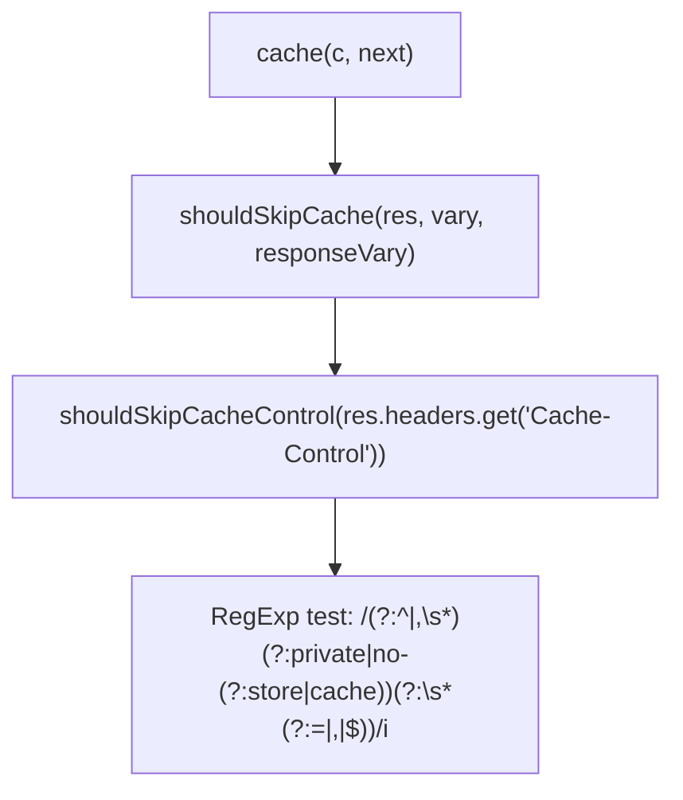

# Traffic Control

<details>
<summary>Relevant source files</summary>

The following files were used as context for generating this wiki page:

- [src/context.ts](https://github.com/honojs/hono/blob/main/src/context.ts)
- [src/types.ts](https://github.com/honojs/hono/blob/main/src/types.ts)
- [src/adapter/aws-lambda/handler.ts](https://github.com/honojs/hono/blob/main/src/adapter/aws-lambda/handler.ts)
- [src/middleware/cache/index.ts](https://github.com/honojs/hono/blob/main/src/middleware/cache/index.ts)
- [src/request.ts](https://github.com/honojs/hono/blob/main/src/request.ts)
- [src/middleware/compress/index.ts](https://github.com/honojs/hono/blob/main/src/middleware/compress/index.ts)
</details>

Traffic Control in Hono refers to the orchestration of mechanisms that manage how requests are processed, cached, transformed, and adapted to specific runtime environments. It serves as the layer between the raw HTTP request/response cycle and the Hono application logic, ensuring that high-level policies—such as compression or caching—are applied consistently regardless of the underlying platform.

By separating the concerns of runtime-specific event processing (e.g., AWS Lambda event adapters) from middleware-based optimizations (e.g., cache headers or response compression), Hono achieves modularity. Traffic control mechanisms identify the intent of an incoming request (via the `HonoRequest` object) and modulate the outgoing response flow to improve performance and adhere to HTTP standards.

This subsystem encompasses request path normalization, conditional compression logic, cache store interaction, and environment-specific adaptation. These components work in concert to ensure that responses are not only accurate but also optimized for the delivery context, providing a uniform interface to developers while hiding the complexity of diverse infrastructure platforms.

## Adaptive Request Processing (Adapters)

Hono's traffic control logic for serverless environments (like AWS Lambda) centralizes the conversion of disparate cloud-provider event formats into the standardized Hono `Request` object. The `EventProcessor` hierarchy abstracts the implementation details of various AWS event types (API Gateway v1/v2, ALB, Lattice) into a common interface.

The system uses `getProcessor(event)` to determine the correct event strategy at runtime. The chosen processor then extracts headers, method, and query strings, specifically handling the encoding logic (e.g., `sanitizeHeaderValue`) and binary body decoding (e.g., `decodeBase64`) required to maintain HTTP integrity across these platforms.

> [!IMPORTANT]
> The `EventProcessor` must correctly distinguish between `queryStringParameters` and `multiValueQueryStringParameters`. For instance, in `ALBProcessor`, the logic prioritizes `multiValueQueryStringParameters` to avoid the common pitfall where only the last value of a repeated key is preserved.

Sources: [src/adapter/aws-lambda/handler.ts:13-21](https://github.com/honojs/hono/blob/main/src/adapter/aws-lambda/handler.ts#L13-L21), [src/adapter/aws-lambda/handler.ts:278-342](https://github.com/honojs/hono/blob/main/src/adapter/aws-lambda/handler.ts#L278-L342), [src/adapter/aws-lambda/handler.ts:625-637](https://github.com/honojs/hono/blob/main/src/adapter/aws-lambda/handler.ts#L625-L637)

## Response Transformation Pipeline

The traffic control pipeline handles outgoing transformations, most notably response compression. Middleware like `compress` intercepts the response before it returns to the client. It evaluates whether the response is eligible for transformation by checking the `Content-Type` against a filter, verifying the absence of headers like `Content-Encoding` or `Transfer-Encoding`, and ensuring the content size exceeds a configured threshold.

The mechanism relies on `selectEncoding` to negotiate the best encoding algorithm (`gzip` or `deflate`) based on the client's `Accept-Encoding` header. This ensures that resources are only compressed when both the server policy and the client's capabilities allow it.

Sources: [src/middleware/compress/index.ts:24-44](https://github.com/honojs/hono/blob/main/src/middleware/compress/index.ts#L24-L44), [src/middleware/compress/index.ts:70-84](https://github.com/honojs/hono/blob/main/src/middleware/compress/index.ts#L70-L84), [src/middleware/compress/index.ts:86-102](https://github.com/honojs/hono/blob/main/src/middleware/compress/index.ts#L86-L102)

## Cache Control Logic

The Cache Middleware provides sophisticated traffic control by using the Cache API. When a request is intercepted, the middleware generates a cache key (optionally using a `keyGenerator`). It checks for an existing match; if found, it returns the cached response immediately.

If no match is found, the middleware continues the request flow using `next()`, then evaluates the response before storing it. A crucial part of this control is the `shouldSkipCache` function, which guards against caching responses that are explicitly marked private or contain `Set-Cookie` headers, which could lead to data leakage if cached.

> [!CAUTION]
> The cache middleware will throw an `Error` if the `vary` configuration includes `*`. This is a hard invariant designed to enforce RFC 7231 compliance, as `*` essentially disables effective caching across most standard CDN and browser implementations.

Sources: [src/middleware/cache/index.ts:15-16](https://github.com/honojs/hono/blob/main/src/middleware/cache/index.ts#L15-L16), [src/middleware/cache/index.ts:27-35](https://github.com/honojs/hono/blob/main/src/middleware/cache/index.ts#L27-L35), [src/middleware/cache/index.ts:95-99](https://github.com/honojs/hono/blob/main/src/middleware/cache/index.ts#L95-L99)

## Verified Call Chain: Cache Strategy

The following chain illustrates the logic used to determine if a response can be cached, centered on `shouldSkipCacheControl`.

1. `cache` middleware: Evaluates the outgoing response headers.
2. `shouldSkipCache`: Performs final validation check before caching.
3. `shouldSkipCacheControl`: Inspects `Cache-Control` header for directives like `private`, `no-store`, or `no-cache`.


Sources: [src/middleware/cache/index.ts:15-16](https://github.com/honojs/hono/blob/main/src/middleware/cache/index.ts#L15-L16), [src/middleware/cache/index.ts:27-35](https://github.com/honojs/hono/blob/main/src/middleware/cache/index.ts#L27-L35), [src/middleware/cache/index.ts:138-180](https://github.com/honojs/hono/blob/main/src/middleware/cache/index.ts#L138-L180)

## Design Trade-offs

| Design Choice | Benefit | Cost |
| :--- | :--- | :--- |
| `EventProcessor` abstraction | Platform-agnostic application logic | Increased cognitive overhead to maintain multiple event processors |
| Lazy body parsing in `HonoRequest` | Low memory footprint for middleware that ignores the body | Potential for race conditions if body consumption logic is not strictly ordered |
| Cache middleware `wait` flag | Ensures consistency in environments like Deno | Can introduce latency in the critical path of the response |

Sources: [src/adapter/aws-lambda/handler.ts:278-402](https://github.com/honojs/hono/blob/main/src/adapter/aws-lambda/handler.ts#L278-L402), [src/request.ts:220-239](https://github.com/honojs/hono/blob/main/src/request.ts#L220-L239), [src/middleware/cache/index.ts:64-86](https://github.com/honojs/hono/blob/main/src/middleware/cache/index.ts#L64-L86)

## Example Usage

The following example shows how to configure traffic control (caching and compression) in a Hono application.

```typescript
import { Hono } from 'hono'
import { cache } from 'hono/cache'
import { compress } from 'hono/compress'

const app = new Hono()

// Apply compression globally
app.use('*', compress())

// Apply caching to a specific route
app.get(
  '/api/data',
  cache({
    cacheName: 'my-api-cache',
    cacheControl: 'max-age=60',
  }),
  (c) => c.json({ message: 'Cached response' })
)
```
Sources: [src/middleware/cache/index.ts:64-82](https://github.com/honojs/hono/blob/main/src/middleware/cache/index.ts#L64-L82), [src/middleware/compress/index.ts:70-84](https://github.com/honojs/hono/blob/main/src/middleware/compress/index.ts#L70-L84)

## Related

- [[Security Protection]]

