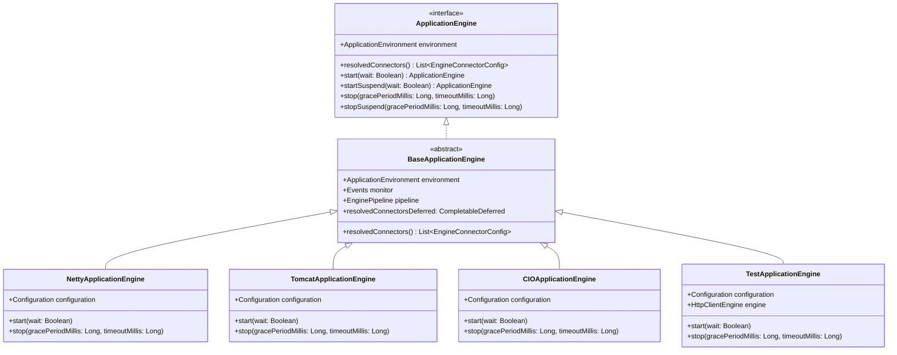
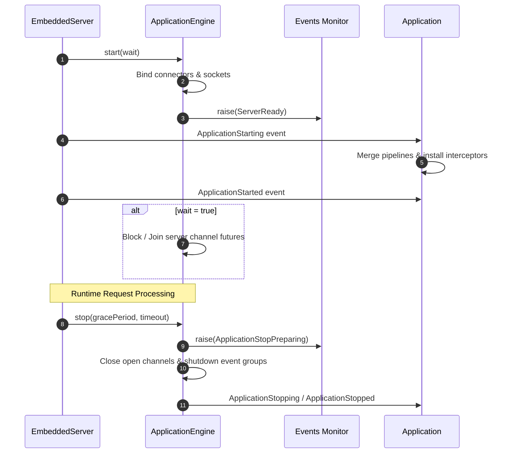

# Application Engine

<details>
<summary>Relevant source files</summary>

The following files were used as context for generating this wiki page:

- [ktor-server/ktor-server-netty/jvm/src/io/ktor/server/netty/NettyApplicationEngine.kt](https://github.com/ktorio/ktor/blob/main/ktor-server/ktor-server-netty/jvm/src/io/ktor/server/netty/NettyApplicationEngine.kt)
- [ktor-server/ktor-server-core/jvm/src/io/ktor/server/engine/EmbeddedServerJvm.kt](https://github.com/ktorio/ktor/blob/main/ktor-server/ktor-server-core/jvm/src/io/ktor/server/engine/EmbeddedServerJvm.kt)
- [ktor-server/ktor-server-core/common/src/io/ktor/server/engine/EmbeddedServer.kt](https://github.com/ktorio/ktor/blob/main/ktor-server/ktor-server-core/common/src/io/ktor/server/engine/EmbeddedServer.kt)
- [ktor-server/ktor-server-servlet-jakarta/jvm/src/io/ktor/server/servlet/jakarta/ServletApplicationEngine.kt](https://github.com/ktorio/ktor/blob/main/ktor-server/ktor-server-servlet-jakarta/jvm/src/io/ktor/server/servlet/jakarta/ServletApplicationEngine.kt)
- [ktor-server/ktor-server-tomcat-jakarta/jvm/src/io/ktor/server/tomcat/jakarta/TomcatApplicationEngine.kt](https://github.com/ktorio/ktor/blob/main/ktor-server/ktor-server-tomcat-jakarta/jvm/src/io/ktor/server/tomcat/jakarta/TomcatApplicationEngine.kt)
- [ktor-server/ktor-server-core/posix/src/io/ktor/server/engine/EmbeddedServer.posix.kt](https://github.com/ktorio/ktor/blob/main/ktor-server/ktor-server-core/posix/src/io/ktor/server/engine/EmbeddedServer.posix.kt)
- [ktor-server/ktor-server-jetty-jakarta/jvm/src/io/ktor/server/jetty/jakarta/JettyApplicationEngineBase.kt](https://github.com/ktorio/ktor/blob/main/ktor-server/ktor-server-jetty-jakarta/jvm/src/io/ktor/server/jetty/jakarta/JettyApplicationEngineBase.kt)
- [ktor-server/ktor-server-jetty/jvm/src/io/ktor/server/jetty/JettyApplicationEngineBase.kt](https://github.com/ktorio/ktor/blob/main/ktor-server/ktor-server-jetty/jvm/src/io/ktor/server/jetty/JettyApplicationEngineBase.kt)
- [ktor-server/ktor-server-core/web/src/io/ktor/server/engine/EmbeddedServer.web.kt](https://github.com/ktorio/ktor/blob/main/ktor-server/ktor-server-core/web/src/io/ktor/server/engine/EmbeddedServer.web.kt)
- [ktor-server/ktor-server-cio/common/src/io/ktor/server/cio/CIOApplicationEngine.kt](https://github.com/ktorio/ktor/blob/main/ktor-server/ktor-server-cio/common/src/io/ktor/server/cio/CIOApplicationEngine.kt)
- [ktor-network/web/src/io/ktor/network/sockets/SocketEngine.tcp.web.kt](https://github.com/ktorio/ktor/blob/main/ktor-network/web/src/io/ktor/network/sockets/SocketEngine.tcp.web.kt)
- [ktor-server/ktor-server-tomcat/jvm/src/io/ktor/server/tomcat/TomcatApplicationEngine.kt](https://github.com/ktorio/ktor/blob/main/ktor-server/ktor-server-tomcat/jvm/src/io/ktor/server/tomcat/TomcatApplicationEngine.kt)
- [ktor-server/ktor-server-test-host/common/src/io/ktor/server/testing/TestApplicationEngine.kt](https://github.com/ktorio/ktor/blob/main/ktor-server/ktor-server-test-host/common/src/io/ktor/server/testing/TestApplicationEngine.kt)
- [ktor-server/ktor-server-core/common/src/io/ktor/server/engine/ApplicationEngine.kt](https://github.com/ktorio/ktor/blob/main/ktor-server/ktor-server-core/common/src/io/ktor/server/engine/ApplicationEngine.kt)
- [ktor-server/ktor-server-servlet/jvm/src/io/ktor/server/servlet/ServletApplicationEngine.kt](https://github.com/ktorio/ktor/blob/main/ktor-server/ktor-server-servlet/jvm/src/io/ktor/server/servlet/ServletApplicationEngine.kt)
- [ktor-server/ktor-server-core/common/src/io/ktor/server/engine/BaseApplicationEngine.kt](https://github.com/ktorio/ktor/blob/main/ktor-server/ktor-server-core/common/src/io/ktor/server/engine/BaseApplicationEngine.kt)
- [ktor-server/ktor-server-netty/jvm/src/io/ktor/server/netty/Embedded.kt](https://github.com/ktorio/ktor/blob/main/ktor-server/ktor-server-netty/jvm/src/io/ktor/server/netty/Embedded.kt)
- [ktor-server/ktor-server-tomcat-jakarta/jvm/src/io/ktor/server/tomcat/jakarta/Embedded.kt](https://github.com/ktorio/ktor/blob/main/ktor-server/ktor-server-tomcat-jakarta/jvm/src/io/ktor/server/tomcat/jakarta/Embedded.kt)
- [ktor-server/ktor-server-test-suites/jvm/src/io/ktor/server/testing/suites/ServerPluginsTestSuite.kt](https://github.com/ktorio/ktor/blob/main/ktor-server/ktor-server-test-suites/jvm/src/io/ktor/server/testing/suites/ServerPluginsTestSuite.kt)
</details>

## Overview

### Overview Context
The `ApplicationEngine` component acts as the foundational abstraction layer bridging Ktor's application logic and network runtimes. It encapsulates low-level network I/O, server lifecycle management (startup, graceful shutdown, and cancellation), and engine-specific configurations behind a uniform interface. By decoupling server implementations from application code, Ktor allows developers to seamlessly swap underlying web servers—such as Netty, Jetty, Tomcat, or CIO—without altering routing or feature logic.

Sources: [ktor-server/ktor-server-core/common/src/io/ktor/server/engine/ApplicationEngine.kt:17-160](https://github.com/ktorio/ktor/blob/main/ktor-server/ktor-server-core/common/src/io/ktor/server/engine/ApplicationEngine.kt#L17-L160)

### Mechanics and Interactions
At its core, `ApplicationEngine` works in tandem with `EmbeddedServer` and `ApplicationEngineFactory` to parse deployment configurations, bind network connectors, and establish server pipelines. Engines extend `BaseApplicationEngine` to inherit standard behaviors such as default response fallback handling, host header validation, send pipeline configuration, and application lifecycle event subscriptions (`ApplicationStarting`, `ApplicationStarted`, `ApplicationStopping`, `ApplicationStopped`).

Sources: [ktor-server/ktor-server-core/common/src/io/ktor/server/engine/BaseApplicationEngine.kt:31-82](https://github.com/ktorio/ktor/blob/main/ktor-server/ktor-server-core/common/src/io/ktor/server/engine/BaseApplicationEngine.kt#L31-L82)

### Runtime Management
Managing platform differences, threading pools, and asynchronous event loops is a primary responsibility of the engine implementation. Whether running on a multi-threaded JVM event loop (Netty), inside a servlet container (Tomcat/Jetty via Jakarta or legacy javax Servlets), natively via coroutine-driven non-blocking socket engines (CIO), or within test environments (`TestApplicationEngine`), the application engine ensures that incoming requests are correctly mapped into Ktor's `ApplicationCall` pipelines and executed within structured concurrency constraints.

Sources: [ktor-server/ktor-server-core/common/src/io/ktor/server/engine/ApplicationEngine.kt:17-160](https://github.com/ktorio/ktor/blob/main/ktor-server/ktor-server-core/common/src/io/ktor/server/engine/ApplicationEngine.kt#L17-L160)

---

## Architecture and Interface Contract

### Core Interface
The `ApplicationEngine` interface defines the core contract for running a Ktor server instance. Implementations manage connectors, coordinate startup/shutdown routines, and expose runtime environments.

Sources: [ktor-server/ktor-server-core/common/src/io/ktor/server/engine/ApplicationEngine.kt:17-160](https://github.com/ktorio/ktor/blob/main/ktor-server/ktor-server-core/common/src/io/ktor/server/engine/ApplicationEngine.kt#L17-L160)

### Engine Class Diagram


Sources: [ktor-server/ktor-server-core/common/src/io/ktor/server/engine/BaseApplicationEngine.kt:31-82](https://github.com/ktorio/ktor/blob/main/ktor-server/ktor-server-core/common/src/io/ktor/server/engine/BaseApplicationEngine.kt#L31-L82)

### Required Members
The interface requires implementations to provide `environment`, `resolvedConnectors()`, `start(wait:)`, `startSuspend(wait:)`, `stop(gracePeriodMillis: timeoutMillis:)`, and `stopSuspend(gracePeriodMillis: timeoutMillis:)`.

Sources: [ktor-server/ktor-server-core/common/src/io/ktor/server/engine/ApplicationEngine.kt:17-160](https://github.com/ktorio/ktor/blob/main/ktor-server/ktor-server-core/common/src/io/ktor/server/engine/ApplicationEngine.kt#L17-L160)

---

## Configuration and Threading Model

### Configuration Structure
Every application engine provides a nested `Configuration` class extending `ApplicationEngine.Configuration`. This configuration controls thread pool allocations, parallelism parameters, timeouts, and network connectors.

Sources: [ktor-server/ktor-server-core/common/src/io/ktor/server/engine/ApplicationEngine.kt:27-90](https://github.com/ktorio/ktor/blob/main/ktor-server/ktor-server-core/common/src/io/ktor/server/engine/ApplicationEngine.kt#L27-L90)

### Configuration Options Table
| Configuration Property | Default Value | Purpose |
| :--- | :--- | :--- |
| `parallelism` | `availableProcessorsBridge()` | System hardware parallelism level. |
| `connectionGroupSize` | `parallelism / 2 + 1` | Threads used to accept new connections and initiate call processing. |
| `workerGroupSize` | `parallelism / 2 + 1` | Event group size for processing connections, parsing messages, and background tasks. |
| `callGroupSize` | `parallelism` | Minimum thread pool size dedicated to executing application calls. |
| `shutdownGracePeriod` | `1000` (ms) | Maximum time for activity to cool down before forced termination. |
| `shutdownTimeout` | `5000` (ms) | Maximum time to wait until the server stops gracefully. |
| `connectors` | `mutableListOf()` | List of network connectors (`EngineConnectorConfig`) defining binding hosts and ports. |

Sources: [ktor-server/ktor-server-core/common/src/io/ktor/server/engine/ApplicationEngine.kt:27-90](https://github.com/ktorio/ktor/blob/main/ktor-server/ktor-server-core/common/src/io/ktor/server/engine/ApplicationEngine.kt#L27-L90)

### Netty Specific Options
Engines can add specific properties. For instance, `NettyApplicationEngine.Configuration` adds options such as `runningLimit` (default `32`), `shareWorkGroup` (default `false`), `responseWriteTimeoutSeconds` (default `10`), `requestReadTimeoutSeconds` (default `0`), `enableHttp2` (default `true`), and `enableH2c` (default `false`).

Sources: [ktor-server/ktor-server-netty/jvm/src/io/ktor/server/netty/NettyApplicationEngine.kt:63-183](https://github.com/ktorio/ktor/blob/main/ktor-server/ktor-server-netty/jvm/src/io/ktor/server/netty/NettyApplicationEngine.kt#L63-L183)

### Work Group Sharing
> [!NOTE]
> When `shareWorkGroup` is enabled in Netty, the engine avoids creating a separate call event group and reuses the worker group for processing incoming requests, reducing context switching overhead on heavily loaded single-purpose nodes.

Sources: [ktor-server/ktor-server-netty/jvm/src/io/ktor/server/netty/NettyApplicationEngine.kt:73-77](https://github.com/ktorio/ktor/blob/main/ktor-server/ktor-server-netty/jvm/src/io/ktor/server/netty/NettyApplicationEngine.kt#L73-L77)

---

## Lifecycle Execution and Event Pipeline

### Lifecycle Coordination Overview
The lifecycle of an application engine is coordinated through `EmbeddedServer` and monitored via `Events`. When an engine starts, it initializes pipelines, binds server ports, and triggers lifecycle hooks.

Sources: [ktor-server/ktor-server-core/jvm/src/io/ktor/server/engine/EmbeddedServerJvm.kt:364-392](https://github.com/ktorio/ktor/blob/main/ktor-server/ktor-server-core/jvm/src/io/ktor/server/engine/EmbeddedServerJvm.kt#L364-L392)

### Lifecycle Sequence Diagram


Sources: [ktor-server/ktor-server-netty/jvm/src/io/ktor/server/netty/NettyApplicationEngine.kt:339-380](https://github.com/ktorio/ktor/blob/main/ktor-server/ktor-server-netty/jvm/src/io/ktor/server/netty/NettyApplicationEngine.kt#L339-L380)

### Call-Chain Execution Walkthrough
1. **Server Initialization (`EmbeddedServer.start`)**: The server creates or reloads the `Application` instance via `createApplication()`, sets up thread context class loaders, and invokes `engine.start(wait)`.
2. **Connector Binding (`ApplicationEngine.start`)**: The engine binds configured host/port pairs to underlying sockets. For example, in `NettyApplicationEngine`, `bootstraps.zip(configuration.connectors)` binds TCP channels and completes `resolvedConnectorsDeferred`.
3. **Readiness and Event Emission**: Once bindings succeed, the engine fires the `ServerReady` event. `BaseApplicationEngine` intercepts `ApplicationStarting` to merge engine receive/send pipelines and install default validation/transformation interceptors (`verifyHostHeader`, `installDefaultTransformationChecker`).
4. **Shutdown Coordination**: Upon stopping, `stop()` completes cancellation jobs, raises `ApplicationStopPreparing`, closes open server channels, and gracefully shuts down event groups using configured grace periods and timeouts.

Sources: [ktor-server/ktor-server-core/jvm/src/io/ktor/server/engine/EmbeddedServerJvm.kt:364-392](https://github.com/ktorio/ktor/blob/main/ktor-server/ktor-server-core/jvm/src/io/ktor/server/engine/EmbeddedServerJvm.kt#L364-L392), [ktor-server/ktor-server-netty/jvm/src/io/ktor/server/netty/NettyApplicationEngine.kt:339-380](https://github.com/ktorio/ktor/blob/main/ktor-server/ktor-server-netty/jvm/src/io/ktor/server/netty/NettyApplicationEngine.kt#L339-L380), [ktor-server/ktor-server-core/common/src/io/ktor/server/engine/BaseApplicationEngine.kt:47-76](https://github.com/ktorio/ktor/blob/main/ktor-server/ktor-server-core/common/src/io/ktor/server/engine/BaseApplicationEngine.kt#L47-L76)

---

## Concrete Engine Implementations

### Engine Diversity Overview
Ktor provides several production-ready engine factories and implementations catering to different runtimes and deployment targets.

Sources: [ktor-server/ktor-server-netty/jvm/src/io/ktor/server/netty/NettyApplicationEngine.kt:50-56](https://github.com/ktorio/ktor/blob/main/ktor-server/ktor-server-netty/jvm/src/io/ktor/server/netty/NettyApplicationEngine.kt#L50-L56)

### Netty Implementation
The standalone Netty engine (`NettyApplicationEngine`) leverages Netty's asynchronous event-loop architecture. It automatically selects the optimal native transport channel (`KQueueServerSocketChannel` on macOS, `EpollServerSocketChannel` on Linux, or `NioServerSocketChannel` as a fallback). It also supports HTTP/2, HTTP/3 (over QUIC/UDP via `enableHttp3`), and TLS.

Sources: [ktor-server/ktor-server-netty/jvm/src/io/ktor/server/netty/NettyApplicationEngine.kt:50-56](https://github.com/ktorio/ktor/blob/main/ktor-server/ktor-server-netty/jvm/src/io/ktor/server/netty/NettyApplicationEngine.kt#L50-L56), [ktor-server/ktor-server-netty/jvm/src/io/ktor/server/netty/NettyApplicationEngine.kt:443-447](https://github.com/ktorio/ktor/blob/main/ktor-server/ktor-server-netty/jvm/src/io/ktor/server/netty/NettyApplicationEngine.kt#L443-L447)

### Servlet and Testing Engines
Container-based engines (`TomcatApplicationEngine` and `JettyApplicationEngineBase`) embed Apache Tomcat or Eclipse Jetty. They configure servlet containers and bridge requests through Ktor's `KtorServlet` implementation. `CIOApplicationEngine` is a pure Kotlin coroutine-based server backend. `TestApplicationEngine` provides an in-memory testing environment.

Sources: [ktor-server/ktor-server-tomcat-jakarta/jvm/src/io/ktor/server/tomcat/jakarta/TomcatApplicationEngine.kt:34-40](https://github.com/ktorio/ktor/blob/main/ktor-server/ktor-server-tomcat-jakarta/jvm/src/io/ktor/server/tomcat/jakarta/TomcatApplicationEngine.kt#L34-L40), [ktor-server/ktor-server-cio/common/src/io/ktor/server/cio/CIOApplicationEngine.kt:27-33](https://github.com/ktorio/ktor/blob/main/ktor-server/ktor-server-cio/common/src/io/ktor/server/cio/CIOApplicationEngine.kt#L27-L33), [ktor-server/ktor-server-test-host/common/src/io/ktor/server/testing/TestApplicationEngine.kt:37-43](https://github.com/ktorio/ktor/blob/main/ktor-server/ktor-server-test-host/common/src/io/ktor/server/testing/TestApplicationEngine.kt#L37-L43)

---

## Design Trade-Offs

### Design Trade-Offs Table
| Design Choice | Benefit | Cost |
| :--- | :--- | :--- |
| **Pluggable Engine Abstraction** | Complete decoupling of application code from network servers; allows swapping Netty, CIO, Jetty, or Tomcat easily. | Additional abstraction layers and interface delegation overhead. |
| **Deferred Connector Resolution (`resolvedConnectorsDeferred`)** | Enables dynamic port assignment (e.g., binding port `0` for testing or container orchestration) while making resolved ports available asynchronously. | Requires consumers to suspend or await connector resolution before querying local addresses. |
| **Netty Native Transport Detection (`Epoll`/`KQueue`)** | Maximizes throughput and reduces latency on Linux and macOS by bypassing standard Java NIO selectors. | Platform-specific native library dependencies that must be present in runtime environments. |
| **Embedded Servlet Bridging (`KtorServlet`)** | Enables running Ktor inside traditional Java EE application servers and servlet containers (Tomcat, Jetty WAR deployments). | Servlet container thread model overhead compared to pure asynchronous coroutine engines like CIO or Netty. |

Sources: [ktor-server/ktor-server-core/common/src/io/ktor/server/engine/ApplicationEngine.kt:97-100](https://github.com/ktorio/ktor/blob/main/ktor-server/ktor-server-core/common/src/io/ktor/server/engine/ApplicationEngine.kt#L97-L100), [ktor-server/ktor-server-netty/jvm/src/io/ktor/server/netty/NettyApplicationEngine.kt:443-447](https://github.com/ktorio/ktor/blob/main/ktor-server/ktor-server-netty/jvm/src/io/ktor/server/netty/NettyApplicationEngine.kt#L443-L447), [ktor-server/ktor-server-core/common/src/io/ktor/server/engine/BaseApplicationEngine.kt:45-45](https://github.com/ktorio/ktor/blob/main/ktor-server/ktor-server-core/common/src/io/ktor/server/engine/BaseApplicationEngine.kt#L45-L45)

---

## Runnable Example

### Example Usage
The following complete example demonstrates how to configure and launch an embedded server using the Netty application engine factory, configure connectors and worker sizes, and define an application module.

```kotlin
import io.ktor.server.application.*
import io.ktor.server.engine.*
import io.ktor.server.netty.*
import io.ktor.server.response.*
import io.ktor.server.routing.*

fun main() {
    val server = embeddedServer(Netty, port = 8080, host = "0.0.0.0") {
        engineConfig {
            workerGroupSize = 4
            callGroupSize = 8
        }
        routing {
            get("/") {
                call.respondText("Hello from Ktor ApplicationEngine!")
            }
        }
    }
    server.start(wait = true)
}
```

Sources: [ktor-server/ktor-server-core/common/src/io/ktor/server/engine/EmbeddedServer.kt:106-114](https://github.com/ktorio/ktor/blob/main/ktor-server/ktor-server-core/common/src/io/ktor/server/engine/EmbeddedServer.kt#L106-L114), [ktor-server/ktor-server-netty/jvm/src/io/ktor/server/netty/Embedded.kt:16-33](https://github.com/ktorio/ktor/blob/main/ktor-server/ktor-server-netty/jvm/src/io/ktor/server/netty/Embedded.kt#L16-33)

### Blocking Warning
> [!CAUTION]
> When running `server.start(wait = false)` from the main thread without any other blocking mechanism, the application thread will terminate immediately without handling any incoming requests. Always pass `wait = true` or use `startSuspend()` in asynchronous contexts.

Sources: [ktor-server/ktor-server-core/common/src/io/ktor/server/engine/ApplicationEngine.kt:120-120](https://github.com/ktorio/ktor/blob/main/ktor-server/ktor-server-core/common/src/io/ktor/server/engine/ApplicationEngine.kt#L120-L120)

## Related

- [[Application Pipeline]]
- [[CIO Server]]
- [[Netty Integration]]

