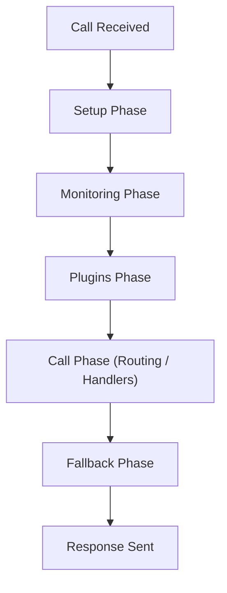
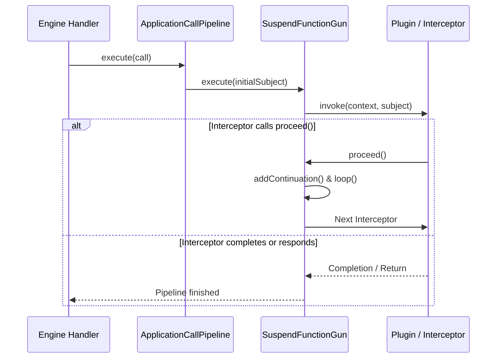
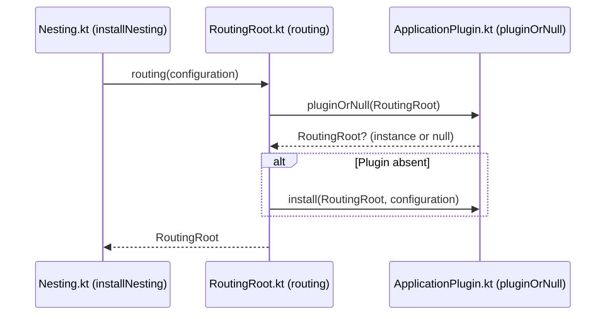

# Application Pipeline

<details>
<summary>Relevant source files</summary>

The following files were used as context for generating this wiki page:

- [ktor-utils/common/src/io/ktor/util/pipeline/Pipeline.kt](https://github.com/ktorio/ktor/blob/main/ktor-utils/common/src/io/ktor/util/pipeline/Pipeline.kt)
- [ktor-server/ktor-server-cio/common/src/io/ktor/server/cio/backend/ServerPipeline.kt](https://github.com/ktorio/ktor/blob/main/ktor-server/ktor-server-cio/common/src/io/ktor/server/cio/backend/ServerPipeline.kt)
- [ktor-server/ktor-server-core/common/src/io/ktor/server/application/PluginBuilder.kt](https://github.com/ktorio/ktor/blob/main/ktor-server/ktor-server-core/common/src/io/ktor/server/application/PluginBuilder.kt)
- [ktor-server/ktor-server-jetty-jakarta/jvm/src/io/ktor/server/jetty/jakarta/JettyKtorHandler.kt](https://github.com/ktorio/ktor/blob/main/ktor-server/ktor-server-jetty-jakarta/jvm/src/io/ktor/server/jetty/jakarta/JettyKtorHandler.kt)
- [ktor-server/ktor-server-core/common/src/io/ktor/server/engine/DefaultEnginePipeline.kt](https://github.com/ktorio/ktor/blob/main/ktor-server/ktor-server-core/common/src/io/ktor/server/engine/DefaultEnginePipeline.kt)
- [ktor-server/ktor-server-jetty/jvm/src/io/ktor/server/jetty/JettyKtorHandler.kt](https://github.com/ktorio/ktor/blob/main/ktor-server/ktor-server-jetty/jvm/src/io/ktor/server/jetty/JettyKtorHandler.kt)
- [ktor-server/ktor-server-netty/jvm/src/io/ktor/server/netty/cio/NettyHttpResponsePipeline.kt](https://github.com/ktorio/ktor/blob/main/ktor-server/ktor-server-netty/jvm/src/io/ktor/server/netty/cio/NettyHttpResponsePipeline.kt)
- [ktor-client/ktor-client-core/common/src/io/ktor/client/plugins/api/CommonHooks.kt](https://github.com/ktorio/ktor/blob/main/ktor-client/ktor-client-core/common/src/io/ktor/client/plugins/api/CommonHooks.kt)
- [ktor-client/ktor-client-core/common/src/io/ktor/client/request/HttpRequestPipeline.kt](https://github.com/ktorio/ktor/blob/main/ktor-client/ktor-client-core/common/src/io/ktor/client/request/HttpRequestPipeline.kt)
- [ktor-server/ktor-server-core/common/src/io/ktor/server/application/ApplicationCallPipeline.kt](https://github.com/ktorio/ktor/blob/main/ktor-server/ktor-server-core/common/src/io/ktor/server/application/ApplicationCallPipeline.kt)
- [ktor-server/ktor-server-core/common/src/io/ktor/server/application/hooks/CommonHooks.kt](https://github.com/ktorio/ktor/blob/main/ktor-server/ktor-server-core/common/src/io/ktor/server/application/hooks/CommonHooks.kt)
- [ktor-server/ktor-server-netty/jvm/src/io/ktor/server/netty/http1/NettyHttp1Handler.kt](https://github.com/ktorio/ktor/blob/main/ktor-server/ktor-server-netty/jvm/src/io/ktor/server/netty/http1/NettyHttp1Handler.kt)
- [ktor-server/ktor-server-core/common/src/io/ktor/server/request/ApplicationReceiveFunctions.kt](https://github.com/ktorio/ktor/blob/main/ktor-server/ktor-server-core/common/src/io/ktor/server/request/ApplicationReceiveFunctions.kt)
- [ktor-server/ktor-server-cio/common/src/io/ktor/server/cio/CIOApplicationEngine.kt](https://github.com/ktorio/ktor/blob/main/ktor-server/ktor-server-cio/common/src/io/ktor/server/cio/CIOApplicationEngine.kt)
- [ktor-server/ktor-server-core/common/src/io/ktor/server/routing/RoutingRoot.kt](https://github.com/ktorio/ktor/blob/main/ktor-server/ktor-server-core/common/src/io/ktor/server/routing/RoutingRoot.kt)
- [ktor-server/ktor-server-core/common/src/io/ktor/server/application/PipelineCall.kt](https://github.com/ktorio/ktor/blob/main/ktor-server/ktor-server-core/common/src/io/ktor/server/application/PipelineCall.kt)
- [ktor-utils/common/src/io/ktor/util/pipeline/SuspendFunctionGun.kt](https://github.com/ktorio/ktor/blob/main/ktor-utils/common/src/io/ktor/util/pipeline/SuspendFunctionGun.kt)
- [ktor-server/ktor-server-core/common/src/io/ktor/server/application/Interceptions.kt](https://github.com/ktorio/ktor/blob/main/ktor-server/ktor-server-core/common/src/io/ktor/server/application/Interceptions.kt)
- [ktor-client/ktor-client-core/common/src/io/ktor/client/statement/HttpResponsePipeline.kt](https://github.com/ktorio/ktor/blob/main/ktor-client/ktor-client-core/common/src/io/ktor/client/statement/HttpResponsePipeline.kt)
- [ktor-server/ktor-server-core/common/src/io/ktor/server/engine/EnginePipeline.kt](https://github.com/ktorio/ktor/blob/main/ktor-server/ktor-server-core/common/src/io/ktor/server/engine/EnginePipeline.kt)
- [ktor-server/ktor-server-cio/common/src/io/ktor/server/cio/Pipeline.kt](https://github.com/ktorio/ktor/blob/main/ktor-server/ktor-server-cio/common/src/io/ktor/server/cio/Pipeline.kt)
- [ktor-utils/common/src/io/ktor/util/pipeline/PipelineContext.kt](https://github.com/ktorio/ktor/blob/main/ktor-utils/common/src/io/ktor/util/pipeline/PipelineContext.kt)
- [ktor-server/ktor-server-core/common/src/io/ktor/server/http/HttpRequestLifecycle.kt](https://github.com/ktorio/ktor/blob/main/ktor-server/ktor-server-core/common/src/io/ktor/server/http/HttpRequestLifecycle.kt)
- [ktor-server/ktor-server-core/common/src/io/ktor/server/application/KtorCallContexts.kt](https://github.com/ktorio/ktor/blob/main/ktor-server/ktor-server-core/common/src/io/ktor/server/application/KtorCallContexts.kt)
- [ktor-client/ktor-client-core/common/src/io/ktor/client/plugins/api/KtorCallContexts.kt](https://github.com/ktorio/ktor/blob/main/ktor-client/ktor-client-core/common/src/io/ktor/client/plugins/api/KtorCallContexts.kt)
- [ktor-server/ktor-server-core/common/src/io/ktor/server/response/ApplicationSendPipeline.kt](https://github.com/ktorio/ktor/blob/main/ktor-server/ktor-server-core/common/src/io/ktor/server/response/ApplicationSendPipeline.kt)
- [ktor-client/ktor-client-core/common/src/io/ktor/client/plugins/HttpRequestLifecycle.kt](https://github.com/ktorio/ktor/blob/main/ktor-client/ktor-client-core/common/src/io/ktor/client/plugins/HttpRequestLifecycle.kt)
- [ktor-utils/web/src/io/ktor/util/pipeline/Pipeline.web.kt](https://github.com/ktorio/ktor/blob/main/ktor-utils/web/src/io/ktor/util/pipeline/Pipeline.web.kt)
- [ktor-server/ktor-server-core/common/src/io/ktor/server/application/ApplicationPlugin.kt](https://github.com/ktorio/ktor/blob/main/ktor-server/ktor-server-core/common/src/io/ktor/server/application/ApplicationPlugin.kt)
- [ktor-compiler-plugin/testData/openapi/Nesting.kt](https://github.com/ktorio/ktor/blob/main/ktor-compiler-plugin/testData/openapi/Nesting.kt)
</details>

## Overview

### Introduction

The Ktor Application Pipeline is the core execution engine responsible for processing incoming HTTP requests and generating outgoing responses through an extensible, asynchronous series of ordered phases. Rather than hardcoding routing and middleware handling into a monolithic controller, Ktor models server communication as a typed execution pipeline parameterized by a subject type (`TSubject`) and a context type (`TContext`), such as `PipelineCall` inside server engines.

Sources: [ktor-utils/common/src/io/ktor/util/pipeline/Pipeline.kt:27-35](https://github.com/ktorio/ktor/blob/main/ktor-utils/common/src/io/ktor/util/pipeline/Pipeline.kt#L27-L35)

The architecture solves the problem of modular middleware composition by allowing plugins, routing rules, and engine handlers to intercept specific pipeline phases (`Setup`, `Monitoring`, `Plugins`, `Call`, `Fallback`) without tightly coupling components. Each pipeline phase maintains a strict execution order, enabling cross-cutting concerns like logging, authentication, content transformation, and routing to be installed independently.

Sources: [ktor-server/ktor-server-core/common/src/io/ktor/server/application/ApplicationCallPipeline.kt:17-26](https://github.com/ktorio/ktor/blob/main/ktor-server/ktor-server-core/common/src/io/ktor/server/application/ApplicationCallPipeline.kt#L17-L26)

Underlying this structure is a high-performance execution mechanism (`SuspendFunctionGun`) designed to execute suspendable interceptors with minimal overhead on the hot path by avoiding unnecessary dispatcher hops and continuation reallocations. It interacts closely with engine adapters (Netty, Jetty, CIO) that capture raw network events, construct an `ApplicationCall`, and trigger the engine pipeline to initiate the request-response lifecycle.

Sources: [ktor-utils/common/src/io/ktor/util/pipeline/SuspendFunctionGun.kt:17-46](https://github.com/ktorio/ktor/blob/main/ktor-utils/common/src/io/ktor/util/pipeline/SuspendFunctionGun.kt#L17-L46)

The design philosophy emphasizes dynamic extensibility and high throughput. Plugins register hooks or interceptors directly against specific phases in the application, routing, receive, or send pipelines. At execution time, the pipeline merges and flattens these interceptor functions into a single cached list, allowing $O(1)$ iteration over execution blocks during call processing.

Sources: [ktor-server/ktor-server-core/common/src/io/ktor/server/application/ApplicationPlugin.kt:89-103](https://github.com/ktorio/ktor/blob/main/ktor-server/ktor-server-core/common/src/io/ktor/server/application/ApplicationPlugin.kt#L89-L103)

## Core Pipeline Architecture and Types

### Structure and Components

The `Pipeline<TSubject, TContext>` class manages a collection of installation phases (`phasesRaw`) and installed interceptors. Interceptors are executed via `PipelineContext`, which holds references to the current execution context and the mutable subject being transformed or processed.

Sources: [ktor-utils/common/src/io/ktor/util/pipeline/Pipeline.kt:33-85](https://github.com/ktorio/ktor/blob/main/ktor-utils/common/src/io/ktor/util/pipeline/Pipeline.kt#L33-L85)

The pipeline architecture relies on a set of fundamental classes and type aliases to provide type-safe interception and execution:

| Class / Type Alias | Generic Parameters | Description |
| :--- | :--- | :--- |
| `Pipeline` | `<TSubject : Any, TContext : Any>` | Manages phases and interceptors, providing methods to add phases, merge pipelines, and execute computations. |
| `PipelineContext` | `<TSubject : Any, TContext : Any>` | Represents a running execution instance, exposing `subject`, `context`, and control methods like `proceed()` and `finish()`. |
| `PipelineInterceptor` | `<TSubject : Any, TContext : Any>` | Type alias for a suspend extension function: `suspend PipelineContext<TSubject, TContext>.(TSubject) -> Unit`. |
| `ApplicationCallPipeline` | N/A | Extends `Pipeline<Unit, PipelineCall>` with standard server phases (`Setup`, `Monitoring`, `Plugins`, `Call`, `Fallback`). |
| `EnginePipeline` | N/A | Server engine pipeline containing `Before` and `Call` phases. |
| `ApplicationReceivePipeline` | N/A | Pipeline for receiving request bodies (`Before`, `Transform`, `After`). |
| `ApplicationSendPipeline` | N/A | Pipeline for sending response content across `Before`, `Transform`, `Render`, `ContentEncoding`, `TransferEncoding`, `After`, and `Engine` phases. |

Sources: [ktor-utils/common/src/io/ktor/util/pipeline/Pipeline.kt:33-35](https://github.com/ktorio/ktor/blob/main/ktor-utils/common/src/io/ktor/util/pipeline/Pipeline.kt#L33-L35), [ktor-utils/common/src/io/ktor/util/pipeline/PipelineContext.kt:22-24](https://github.com/ktorio/ktor/blob/main/ktor-utils/common/src/io/ktor/util/pipeline/PipelineContext.kt#L22-L24), [ktor-server/ktor-server-core/common/src/io/ktor/server/application/ApplicationCallPipeline.kt:17-26](https://github.com/ktorio/ktor/blob/main/ktor-server/ktor-server-core/common/src/io/ktor/server/application/ApplicationCallPipeline.kt#L17-L26), [ktor-server/ktor-server-core/common/src/io/ktor/server/engine/EnginePipeline.kt:18-20](https://github.com/ktorio/ktor/blob/main/ktor-server/ktor-server-core/common/src/io/ktor/server/engine/EnginePipeline.kt#L18-L20), [ktor-server/ktor-server-core/common/src/io/ktor/server/request/ApplicationReceiveFunctions.kt:31-33](https://github.com/ktorio/ktor/blob/main/ktor-server/ktor-server-core/common/src/io/ktor/server/request/ApplicationReceiveFunctions.kt#31-33), [ktor-server/ktor-server-core/common/src/io/ktor/server/response/ApplicationSendPipeline.kt:15-17](https://github.com/ktorio/ktor/blob/main/ktor-server/ktor-server-core/common/src/io/ktor/server/response/ApplicationSendPipeline.kt#15-17)

When executing a pipeline, Ktor instantiates a `PipelineContext` passing the target execution context and subject. Call contexts allow interceptors to update the subject, pass control to subsequent interceptors via `proceed()`, or terminate processing immediately using `finish()`.

Sources: [ktor-utils/common/src/io/ktor/util/pipeline/PipelineContext.kt:60-70](https://github.com/ktorio/ktor/blob/main/ktor-utils/common/src/io/ktor/util/pipeline/PipelineContext.kt#L60-L70)

## Phase Management and Interception Ordering

### Phase Flow and Resolution

Phases dictate the relative order in which interceptors execute. A `Pipeline` is initialized with an ordered list of `PipelinePhase` objects. New phases can be inserted relative to existing ones using `insertPhaseBefore` or `insertPhaseAfter`.

Sources: [ktor-utils/common/src/io/ktor/util/pipeline/Pipeline.kt:99-139](https://github.com/ktorio/ktor/blob/main/ktor-utils/common/src/io/ktor/util/pipeline/Pipeline.kt#L99-L139)

The standard phase order for an `ApplicationCallPipeline` proceeds through five standard phases:



Sources: [ktor-server/ktor-server-core/common/src/io/ktor/server/application/ApplicationCallPipeline.kt:47-80](https://github.com/ktorio/ktor/blob/main/ktor-server/ktor-server-core/common/src/io/ktor/server/application/ApplicationCallPipeline.kt#L47-L80)

When `intercept(phase, block)` is called, Ktor locates the target `PhaseContent` block. If fast-path optimization conditions are met—such as appending to the last phase or when the interceptors list is unshared—the block is appended directly. Otherwise, the interceptors list is reset, forcing a cache rebuild on the next execution.

Sources: [ktor-utils/common/src/io/ktor/util/pipeline/Pipeline.kt:169-184](https://github.com/ktorio/ktor/blob/main/ktor-utils/common/src/io/ktor/util/pipeline/Pipeline.kt#L169-L184)

> [!IMPORTANT]
> When inserting phases via `insertPhaseAfter`, Ktor scans forward through `phasesRaw` to find the last phase possessing a `PipelinePhaseRelation.After` relation relative to the target reference. This ensures that multiple phases inserted after the same reference maintain correct chronological ordering:
> `var lastRelatedPhaseIndex = index`
> `for (i in index + 1..phasesRaw.lastIndex) { ... }`

Sources: [ktor-utils/common/src/io/ktor/util/pipeline/Pipeline.kt:120-139](https://github.com/ktorio/ktor/blob/main/ktor-utils/common/src/io/ktor/util/pipeline/Pipeline.kt#L120-L139)

## Execution Control Flow and `SuspendFunctionGun`

### Execution Mechanics

When `pipeline.execute(context, subject)` is invoked, Ktor creates a `PipelineContext` using either `DebugPipelineContext` or `SuspendFunctionGun` (SFG). `SuspendFunctionGun` is engineered to execute interceptors with minimal coroutine overhead.

Sources: [ktor-utils/common/src/io/ktor/util/pipeline/SuspendFunctionGun.kt:47-113](https://github.com/ktorio/ktor/blob/main/ktor-utils/common/src/io/ktor/util/pipeline/SuspendFunctionGun.kt#L47-L113)

### Execution Walkthrough
1. **Initialization:** `SuspendFunctionGun` receives the initial subject, context, and the cached list of interceptors, setting `index = 0`.
2. **Loop Execution:** `loop(direct = true)` retrieves the interceptor at `currentIndex`, increments `index = currentIndex + 1` *before* invoking the interceptor function via `pipelineStartCoroutineUninterceptedOrReturn(next, this, subject, continuation)`.
3. **Coroutine Start:** `pipelineStartCoroutineUninterceptedOrReturn` starts the interceptor coroutine without unnecessary interception overhead.
4. **Suspension Handling:** If an interceptor calls `proceed()`, `suspendCoroutineUninterceptedOrReturn` captures the caller continuation, pushes it onto `suspensions`, and continues the loop if running directly. If an interceptor completes synchronously, execution advances to the next without rescheduling.
5. **Resuming:** When downstream work finishes, `resumeRootWith` pops the top saved continuation and resumes it, handling conditional redispatch based on whether the dispatcher requires it via `if (interceptor.isDispatchNeeded(next.context)) next.intercepted() else next`.

Sources: [ktor-utils/common/src/io/ktor/util/pipeline/SuspendFunctionGun.kt:115-175](https://github.com/ktorio/ktor/blob/main/ktor-utils/common/src/io/ktor/util/pipeline/SuspendFunctionGun.kt#L115-L175)



Sources: [ktor-utils/common/src/io/ktor/util/pipeline/SuspendFunctionGun.kt:115-175](https://github.com/ktorio/ktor/blob/main/ktor-utils/common/src/io/ktor/util/pipeline/SuspendFunctionGun.kt#L115-L175)

> [!WARNING]
> Calling `proceed()` or `proceedWith()` multiple times within a single interceptor triggers state machine corruption or illegal continuation resumption. The execution guard `if (index == interceptors.size)` prevents out-of-bounds execution, but re-entrant calls to `proceed()` violate the single-resume invariant of Kotlin continuations.

Sources: [ktor-utils/common/src/io/ktor/util/pipeline/SuspendFunctionGun.kt:177-198](https://github.com/ktorio/ktor/blob/main/ktor-utils/common/src/io/ktor/util/pipeline/SuspendFunctionGun.kt#L177-L198)

## Plugin Registration and Call Chain Execution

### Plugin Installation and Lookup Walkthrough

Plugins are installed into an `Application` or `RoutingNode` pipeline by invoking `install(plugin, configure)`. Upon installation, the plugin instance is placed into the pipeline's `pluginRegistry` attribute map.

Sources: [ktor-server/ktor-server-core/common/src/io/ktor/server/application/ApplicationPlugin.kt:89-144](https://github.com/ktorio/ktor/blob/main/ktor-server/ktor-server-core/common/src/io/ktor/server/application/ApplicationPlugin.kt#L89-L144)

### Verified Call-Chain: `installNesting` → `routing` → `pluginOrNull`

When an application registers a nested routing structure using `installNesting()`, Ktor resolves or creates the root `RoutingRoot` instance using the following explicit call chain:

1. **Step 1:** The application calls `installNesting()` (`Nesting.kt:17-88`), which executes configuration blocks on the `Application` receiver and calls `routing { ... }`.
2. **Step 2:** The extension function `Application.routing(configuration)` (`RoutingRoot.kt:190-191`) is invoked. It attempts to lookup an existing `RoutingRoot` instance by executing `pluginOrNull(RoutingRoot)`.
3. **Step 3:** The function `A.pluginOrNull(plugin)` (`ApplicationPlugin.kt:101-103`) queries `pluginRegistry.getOrNull(plugin.key)`. If `null`, `Application.routing` calls `install(RoutingRoot, configuration)` to initialize and attach `RoutingRoot` to the application pipeline.

Sources: [ktor-compiler-plugin/testData/openapi/Nesting.kt:17-88](https://github.com/ktorio/ktor/blob/main/ktor-compiler-plugin/testData/openapi/Nesting.kt#L17-L88), [ktor-server/ktor-server-core/common/src/io/ktor/server/routing/RoutingRoot.kt:190-191](https://github.com/ktorio/ktor/blob/main/ktor-server/ktor-server-core/common/src/io/ktor/server/routing/RoutingRoot.kt#L190-L191), [ktor-server/ktor-server-core/common/src/io/ktor/server/application/ApplicationPlugin.kt:101-103](https://github.com/ktorio/ktor/blob/main/ktor-server/ktor-server-core/common/src/io/ktor/server/application/ApplicationPlugin.kt#L101-L103)



Sources: [ktor-compiler-plugin/testData/openapi/Nesting.kt:17-88](https://github.com/ktorio/ktor/blob/main/ktor-compiler-plugin/testData/openapi/Nesting.kt#L17-L88), [ktor-server/ktor-server-core/common/src/io/ktor/server/routing/RoutingRoot.kt:190-191](https://github.com/ktorio/ktor/blob/main/ktor-server/ktor-server-core/common/src/io/ktor/server/routing/RoutingRoot.kt#L190-L191), [ktor-server/ktor-server-core/common/src/io/ktor/server/application/ApplicationPlugin.kt:101-103](https://github.com/ktorio/ktor/blob/main/ktor-server/ktor-server-core/common/src/io/ktor/server/application/ApplicationPlugin.kt#L101-L103)

## Design Choices and Trade-Offs

### Performance vs Allocation

Ktor's pipeline architecture makes deliberate engineering choices balancing performance, immutability, and debugging ergonomics.

Sources: [ktor-utils/common/src/io/ktor/util/pipeline/Pipeline.kt:342-374](https://github.com/ktorio/ktor/blob/main/ktor-utils/common/src/io/ktor/util/pipeline/Pipeline.kt#L342-L374)

| Design Choice | Benefit | Cost |
| :--- | :--- | :--- |
| **Flat Interceptor Cache List (`cacheInterceptors`)** | Eliminates tree-traversal overhead during request execution; provides $O(1)$ iteration over pre-flattened interceptors. | Modifying phases or adding interceptors invalidates the cache, requiring array allocation and rebuilds. |
| **`SuspendFunctionGun` over Standard Continuations** | Avoids heap allocations and dispatcher re-dispatching for synchronous or non-suspending interceptor chains on the hot path. | Highly complex state management involving manual continuation index tracking and stack frame recovery bridges. |
| **Routing Sub-Pipeline Merging (`RoutingRoot.executeResult`)** | Allows granular route-specific plugins and receive/send transformations to merge dynamically with application-level pipelines. | Overhead of merging pipeline phases and checking route match predicates per request execution. |

Sources: [ktor-utils/common/src/io/ktor/util/pipeline/Pipeline.kt:342-374](https://github.com/ktorio/ktor/blob/main/ktor-utils/common/src/io/ktor/util/pipeline/Pipeline.kt#L342-L374), [ktor-utils/common/src/io/ktor/util/pipeline/SuspendFunctionGun.kt:17-46](https://github.com/ktorio/ktor/blob/main/ktor-utils/common/src/io/ktor/util/pipeline/SuspendFunctionGun.kt#L17-L46), [ktor-server/ktor-server-core/common/src/io/ktor/server/routing/RoutingRoot.kt:80-120](https://github.com/ktorio/ktor/blob/main/ktor-server/ktor-server-core/common/src/io/ktor/server/routing/RoutingRoot.kt#L80-L120)

## Engine Integration and Request Lifecycle

### Bridging Network Connectors

Server engines (Netty, Jetty, CIO) bridge raw socket I/O with Ktor's `EnginePipeline`. When a request arrives, the engine handler instantiates an engine-specific `ApplicationCall`, associates a coroutine context, and executes the engine pipeline via `pipeline.execute(call)`.

Sources: [ktor-server/ktor-server-jetty/jvm/src/io/ktor/server/jetty/JettyKtorHandler.kt:66-115](https://github.com/ktorio/ktor/blob/main/ktor-server/ktor-server-jetty/jvm/src/io/ktor/server/jetty/JettyKtorHandler.kt#L66-L115)

For instance, in Jetty (`JettyKtorHandler`), requests are handled asynchronously through `AsyncContext` or thread pool executors, launching a coroutine that executes the engine pipeline:

```kotlin
launch(dispatcher + JettyCallHandlerCoroutineName) {
    val call = JettyApplicationCall(
        applicationProvider(),
        baseRequest,
        request,
        response,
        engineContext = engineDispatcher,
        userContext = dispatcher,
        coroutineContext = this@launch.coroutineContext,
        idleTimeout = idleTimeout,
    )

    try {
        pipeline.execute(call)
    } catch (_: CancellationException) {
        response.sendErrorIfNotCommitted(status = HttpServletResponse.SC_GONE, message = null)
    } catch (_: ChannelIOException) {
    } catch (error: Throwable) {
        logError(call, error)
        response.sendErrorIfNotCommitted(HttpServletResponse.SC_INTERNAL_SERVER_ERROR, error.message)
    } finally {
        try {
            request.asyncContext?.complete()
        } catch (_: IllegalStateException) {
        }
    }
}
```

Sources: [ktor-server/ktor-server-jetty/jvm/src/io/ktor/server/jetty/JettyKtorHandler.kt:84-104](https://github.com/ktorio/ktor/blob/main/ktor-server/ktor-server-jetty/jvm/src/io/ktor/server/jetty/JettyKtorHandler.kt#L84-L104)

Similarly, `defaultEnginePipeline` sets up error handling, MDC context propagation, shutdown URL interception, and request body draining for HTTP/1.1 persistent connection reuse:

Sources: [ktor-server/ktor-server-core/common/src/io/ktor/server/engine/DefaultEnginePipeline.kt:29-62](https://github.com/ktorio/ktor/blob/main/ktor-server/ktor-server-core/common/src/io/ktor/server/engine/DefaultEnginePipeline.kt#L29-L62)

```kotlin
public fun defaultEnginePipeline(config: ApplicationConfig, developmentMode: Boolean): EnginePipeline {
    val pipeline = EnginePipeline(developmentMode)

    configureShutdownUrl(config, pipeline)

    pipeline.intercept(EnginePipeline.Call) {
        try {
            call.application.execute(call)
        } catch (error: ChannelIOException) {
            call.application.mdcProvider.withMDCBlock(call) {
                call.application.environment.logFailure(call, error)
            }
        } catch (error: Throwable) {
            val routeCall = call.attributes.getOrNull(routingCallKey)
            if (routeCall != null) {
                handleFailure(routeCall, error)
            } else {
                handleFailure(call, error)
            }
        } finally {
            try {
                val version = HttpProtocolVersion.parse(call.request.httpVersion)
                if (version.major == 1) {
                    call.request.receiveChannel().discard()
                }
            } catch (_: Throwable) {
            }
        }
    }

    return pipeline
}
```

Sources: [ktor-server/ktor-server-core/common/src/io/ktor/server/engine/DefaultEnginePipeline.kt:29-62](https://github.com/ktorio/ktor/blob/main/ktor-server/ktor-server-core/common/src/io/ktor/server/engine/DefaultEnginePipeline.kt#L29-L62)

## Complete Worked Example: Custom Interceptors and Plugins

### End-to-End Pipeline Usage

The following example demonstrates how plugins interact with the application call pipeline, receiving pipeline, and routing system by intercepting specific phases and transforming call subjects.

Sources: [ktor-compiler-plugin/testData/openapi/Nesting.kt:17-88](https://github.com/ktorio/ktor/blob/main/ktor-compiler-plugin/testData/openapi/Nesting.kt#L17-L88)

During routing resolution, Ktor checks for installed plugins using `pluginOrNull` (or installs them via `install` / `routing`), executing the `installNesting` or routing workflow accordingly:

```kotlin
package openapi

import io.ktor.http.ContentType
import io.ktor.http.HttpMethod
import io.ktor.http.HttpStatusCode
import io.ktor.serialization.kotlinx.json.json
import io.ktor.server.application.*
import io.ktor.server.plugins.contentnegotiation.ContentNegotiation
import io.ktor.server.request.receive
import io.ktor.server.routing.*
import io.ktor.server.response.*
import io.ktor.util.toMap
import kotlinx.serialization.Serializable

fun Application.installNesting() {
    val repository = Repository0<User0>()

    install(ContentNegotiation) {
        json()
    }

    routing {
        route("/api") {
            route("/users") {
                get {
                    val query = call.request.queryParameters.toMap()
                    val list = repository.list(query)
                    call.respond(list)
                }
            }
        }
    }
}
```

Sources: [ktor-compiler-plugin/testData/openapi/Nesting.kt:17-88](https://github.com/ktorio/ktor/blob/main/ktor-compiler-plugin/testData/openapi/Nesting.kt#L17-L88)

To trace the code path for plugin resolution: when `installNesting` invokes `routing` (`RoutingRoot.kt:190-191`), Ktor queries `pluginOrNull(RoutingRoot)` (`ApplicationPlugin.kt:101-103`) to verify whether the routing plugin is already registered before installing or configuring it.

Sources: [ktor-server/ktor-server-core/common/src/io/ktor/server/routing/RoutingRoot.kt:190-191](https://github.com/ktorio/ktor/blob/main/ktor-server/ktor-server-core/common/src/io/ktor/server/routing/RoutingRoot.kt#L190-L191), [ktor-server/ktor-server-core/common/src/io/ktor/server/application/ApplicationPlugin.kt:101-103](https://github.com/ktorio/ktor/blob/main/ktor-server/ktor-server-core/common/src/io/ktor/server/application/ApplicationPlugin.kt#L101-L103)

Additionally, custom application-level plugins created with `PluginBuilder` hook directly into the call lifecycle handlers (`onCall`, `onCallRespond`):

```kotlin
val CustomHeaderPlugin = createApplicationPlugin(name = "CustomHeaderPlugin") {
    onCall { call ->
        call.response.headers.append("X-Custom-Header", "Hello, world!")
    }
    onCallRespond { call, body ->
        call.application.environment.log.info("Responding to ${call.request.uri}")
    }
}
```

Sources: [ktor-server/ktor-server-core/common/src/io/ktor/server/application/PluginBuilder.kt:96-148](https://github.com/ktorio/ktor/blob/main/ktor-server/ktor-server-core/common/src/io/ktor/server/application/PluginBuilder.kt#L96-L148)

> [!TIP]
> When writing custom features or interceptors, prefer hooking into `ApplicationCallPipeline.Plugins` rather than `Call`. Placing logic in `Plugins` allows standard Ktor plugins (like Authentication, ContentNegotiation, and CachingHeaders) to execute in their designated sequence before route handlers evaluate the call.

Sources: [ktor-server/ktor-server-core/common/src/io/ktor/server/application/ApplicationCallPipeline.kt:47-80](https://github.com/ktorio/ktor/blob/main/ktor-server/ktor-server-core/common/src/io/ktor/server/application/ApplicationCallPipeline.kt#L47-L80)

## Related

- [[Application Engine]]
- [[Calls and Content]]
- [[Routing]]

