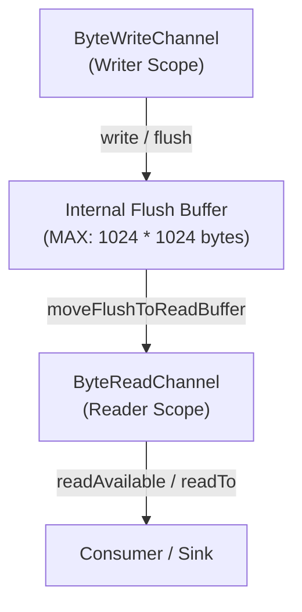
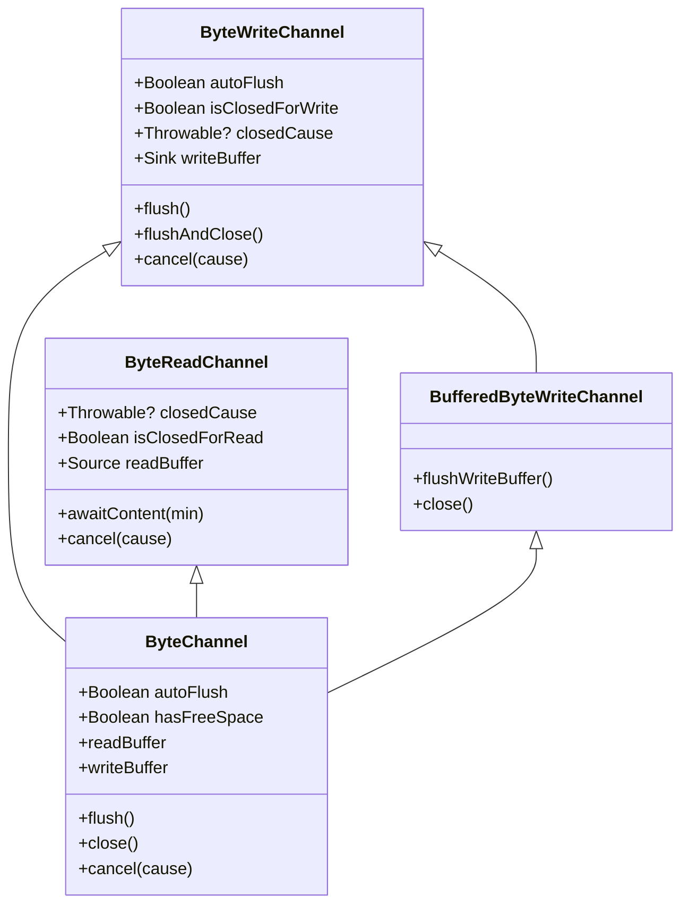
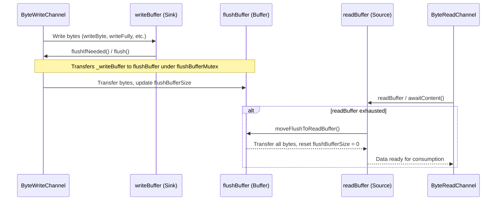
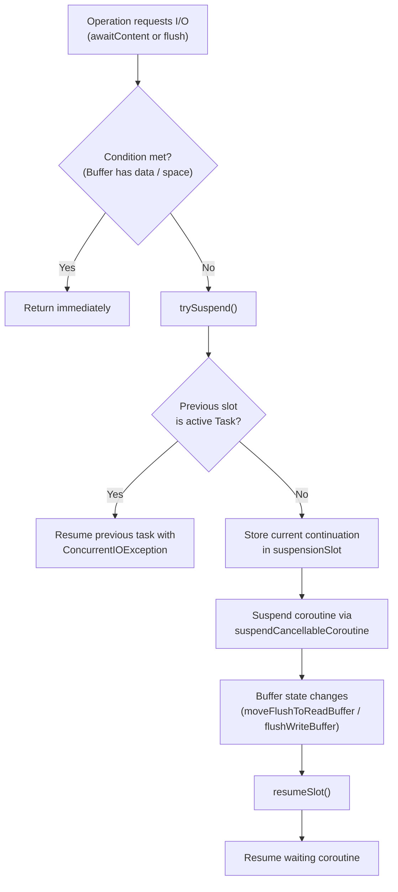
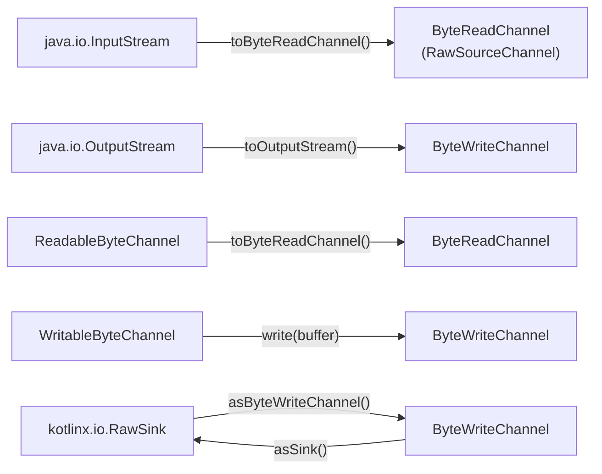

# Byte Channels

<details>
<summary>Relevant source files</summary>

The following files were used as context for generating this wiki page:

- [ktor-io/common/src/io/ktor/utils/io/ByteChannel.kt](https://github.com/ktorio/ktor/blob/main/ktor-io/common/src/io/ktor/utils/io/ByteChannel.kt)
- [ktor-io/common/src/io/ktor/utils/io/ByteWriteChannelOperations.kt](https://github.com/ktorio/ktor/blob/main/ktor-io/common/src/io/ktor/utils/io/ByteWriteChannelOperations.kt)
- [ktor-io/common/src/io/ktor/utils/io/ByteReadChannelOperations.kt](https://github.com/ktorio/ktor/blob/main/ktor-io/common/src/io/ktor/utils/io/ByteReadChannelOperations.kt)
- [ktor-http/jvm/src/io/ktor/http/content/BlockingBridge.kt](https://github.com/ktorio/ktor/blob/main/ktor-http/jvm/src/io/ktor/http/content/BlockingBridge.kt)
- [ktor-io/jvm/src/io/ktor/utils/io/jvm/javaio/Reading.kt](https://github.com/ktorio/ktor/blob/main/ktor-io/jvm/src/io/ktor/utils/io/jvm/javaio/Reading.kt)
- [ktor-io/jvm/src/io/ktor/utils/io/ByteWriteChannelOperations.jvm.kt](https://github.com/ktorio/ktor/blob/main/ktor-io/jvm/src/io/ktor/utils/io/ByteWriteChannelOperations.jvm.kt)
- [ktor-io/jvm/src/io/ktor/utils/io/jvm/nio/Reading.kt](https://github.com/ktorio/ktor/blob/main/ktor-io/jvm/src/io/ktor/utils/io/jvm/nio/Reading.kt)
- [ktor-io/common/src/io/ktor/utils/io/ByteWriteChannel.kt](https://github.com/ktorio/ktor/blob/main/ktor-io/common/src/io/ktor/utils/io/ByteWriteChannel.kt)
- [ktor-io/jvm/src/io/ktor/utils/io/jvm/javaio/Blocking.kt](https://github.com/ktorio/ktor/blob/main/ktor-io/jvm/src/io/ktor/utils/io/jvm/javaio/Blocking.kt)
- [ktor-network/common/src/io/ktor/network/sockets/Sockets.kt](https://github.com/ktorio/ktor/blob/main/ktor-network/common/src/io/ktor/network/sockets/Sockets.kt)
- [ktor-server/ktor-server-jetty/jvm/src/io/ktor/server/jetty/internal/EndPointChannels.kt](https://github.com/ktorio/ktor/blob/main/ktor-server/ktor-server-jetty/jvm/src/io/ktor/server/jetty/internal/EndPointChannels.kt)
- [ktor-server/ktor-server-jetty-jakarta/jvm/src/io/ktor/server/jetty/jakarta/internal/EndPointChannels.kt](https://github.com/ktorio/ktor/blob/main/ktor-server/ktor-server-jetty-jakarta/jvm/src/io/ktor/server/jetty/jakarta/internal/EndPointChannels.kt)
- [ktor-http/common/src/io/ktor/http/content/OutgoingContent.kt](https://github.com/ktorio/ktor/blob/main/ktor-http/common/src/io/ktor/http/content/OutgoingContent.kt)
- [ktor-io/jvm/src/io/ktor/utils/io/jvm/nio/WriteSuspendSession.kt](https://github.com/ktorio/ktor/blob/main/ktor-io/jvm/src/io/ktor/utils/io/jvm/nio/WriteSuspendSession.kt)
- [ktor-network/jvm/src/io/ktor/network/sockets/CIOWriter.kt](https://github.com/ktorio/ktor/blob/main/ktor-network/jvm/src/io/ktor/network/sockets/CIOWriter.kt)
- [ktor-client/ktor-client-core/common/src/io/ktor/client/utils/ByteChannelUtils.kt](https://github.com/ktorio/ktor/blob/main/ktor-client/ktor-client-core/common/src/io/ktor/client/utils/ByteChannelUtils.kt)
- [ktor-io/common/src/io/ktor/utils/io/SinkByteWriteChannel.kt](https://github.com/ktorio/ktor/blob/main/ktor-io/common/src/io/ktor/utils/io/SinkByteWriteChannel.kt)
- [ktor-utils/jvm/src/io/ktor/util/BufferViewJvm.kt](https://github.com/ktorio/ktor/blob/main/ktor-utils/jvm/src/io/ktor/util/BufferViewJvm.kt)
- [ktor-client/ktor-client-core/wasmJs/src/io/ktor/client/engine/js/browser/BrowserFetch.kt](https://github.com/ktorio/ktor/blob/main/ktor-client/ktor-client-core/wasmJs/src/io/ktor/client/engine/js/browser/BrowserFetch.kt)
- [ktor-io/common/src/io/ktor/utils/io/ByteReadChannel.kt](https://github.com/ktorio/ktor/blob/main/ktor-io/common/src/io/ktor/utils/io/ByteReadChannel.kt)
- [ktor-io/jvmAndPosix/src/io/ktor/utils/io/ByteWriteChannelSink.kt](https://github.com/ktorio/ktor/blob/main/ktor-io/jvmAndPosix/src/io/ktor/utils/io/ByteWriteChannelSink.kt)
- [ktor-utils/jvm/src/io/ktor/util/cio/InputStreamAdapters.kt](https://github.com/ktorio/jvm/src/io/ktor/util/cio/InputStreamAdapters.kt)
- [ktor-io/common/src/io/ktor/utils/io/SourceByteReadChannel.kt](https://github.com/ktorio/ktor/blob/main/ktor-io/common/src/io/ktor/utils/io/SourceByteReadChannel.kt)
- [ktor-io/common/src/io/ktor/utils/io/BufferedByteWriteChannel.kt](https://github.com/ktorio/ktor/blob/main/ktor-io/common/src/io/ktor/utils/io/BufferedByteWriteChannel.kt)
- [ktor-server/ktor-server-netty/jvm/src/io/ktor/server/netty/http/NettyByteBufWriter.kt](https://github.com/ktorio/ktor/blob/main/ktor-server/ktor-server-netty/jvm/src/io/ktor/server/netty/http/NettyByteBufWriter.kt)
- [ktor-utils/jvm/src/io/ktor/util/cio/ReadersJvm.kt](https://github.com/ktorio/ktor/blob/main/ktor-utils/jvm/src/io/ktor/util/cio/ReadersJvm.kt)
- [ktor-io/common/src/io/ktor/utils/io/ByteChannelUtils.kt](https://github.com/ktorio/ktor/blob/main/ktor-io/common/src/io/ktor/utils/io/ByteChannelUtils.kt)
</details>

## Overview

Byte Channels serve as the foundational asynchronous input/output communication primitive within Ktor, providing high-performance, non-blocking sequence-of-bytes streaming across network sockets, HTTP bodies, client engines, and server runtimes. Designed around sequential single-reader and single-writer contracts, they decouple network producers from consumers through internal buffering and coroutine suspension slots without tying up dedicated threads for waiting operations.

Sources: [ktor-io/common/src/io/ktor/utils/io/ByteChannel.kt:24-30](https://github.com/ktorio/ktor/blob/main/ktor-io/common/src/io/ktor/utils/io/ByteChannel.kt#L24-L30)

At their core, byte channels bridge asynchronous coroutine codebases with both modern buffer architectures (such as `kotlinx.io`) and legacy synchronous Java I/O APIs. By managing internal state via atomic operations, suspension tasks, and thread-safe boundaries, they prevent memory exhaustion when fast writers outpace slow readers, automatically handling backpressure, EOF propagation, cancellation routing, and resource cleanup.

Sources: [ktor-io/common/src/io/ktor/utils/io/ByteChannel.kt:61-171](https://github.com/ktorio/ktor/blob/main/ktor-io/common/src/io/ktor/utils/io/ByteChannel.kt#L61-L171)



Sources: [ktor-io/common/src/io/ktor/utils/io/ByteChannel.kt:21-30](https://github.com/ktorio/ktor/blob/main/ktor-io/common/src/io/ktor/utils/io/ByteChannel.kt#L21-L30), [ktor-io/common/src/io/ktor/utils/io/ByteReadChannel.kt:10-17](https://github.com/ktorio/ktor/blob/main/ktor-io/common/src/io/ktor/utils/io/ByteReadChannel.kt#L10-L17), [ktor-io/common/src/io/ktor/utils/io/ByteWriteChannel.kt:12-20](https://github.com/ktorio/ktor/blob/main/ktor-io/common/src/io/ktor/utils/io/ByteWriteChannel.kt#L12-L20)

---

## Core Interfaces and Architecture

The byte channel subsystem splits responsibilities across specialized interfaces that enforce single-writer and single-reader semantics. `ByteWriteChannel` handles asynchronous byte output, exposing a `writeBuffer` sink and methods for flushing and cancellation.

Sources: [ktor-io/common/src/io/ktor/utils/io/ByteWriteChannel.kt:20-37](https://github.com/ktorio/ktor/blob/main/ktor-io/common/src/io/ktor/utils/io/ByteWriteChannel.kt#L20-L37)

`ByteReadChannel` governs asynchronous input, exposing a `readBuffer` source, content availability suspension via `awaitContent`, and EOF management.

Sources: [ktor-io/common/src/io/ktor/utils/io/ByteReadChannel.kt:17-37](https://github.com/ktorio/ktor/blob/main/ktor-io/common/src/io/ktor/utils/io/ByteReadChannel.kt#L17-L37)



Sources: [ktor-io/common/src/io/ktor/utils/io/ByteChannel.kt:29-90](https://github.com/ktorio/ktor/blob/main/ktor-io/common/src/io/ktor/utils/io/ByteChannel.kt#L29-L90)

The concrete `ByteChannel` class implements both `ByteReadChannel` and `BufferedByteWriteChannel`. It maintains separate internal buffers (`_writeBuffer` and `_readBuffer`) connected by a shared `flushBuffer`.

Sources: [ktor-io/common/src/io/ktor/utils/io/ByteChannel.kt:29-60](https://github.com/ktorio/ktor/blob/main/ktor-io/common/src/io/ktor/utils/io/ByteChannel.kt#L29-L60)

> [!IMPORTANT]
> Operations on a single byte channel cannot be invoked concurrently. A `ByteChannel` assumes a strict single-writer and single-reader concurrency model; executing concurrent writes or concurrent reads on the same channel instance will trigger synchronization violations or `ConcurrentIOException`.

Sources: [ktor-io/common/src/io/ktor/utils/io/ByteChannel.kt:25](https://github.com/ktorio/ktor/blob/main/ktor-io/common/src/io/ktor/utils/io/ByteChannel.kt#L25), [ktor-io/common/src/io/ktor/utils/io/ByteReadChannel.kt:11-13](https://github.com/ktorio/ktor/blob/main/ktor-io/common/src/io/ktor/utils/io/ByteReadChannel.kt#L11-L13), [ktor-io/common/src/io/ktor/utils/io/ByteWriteChannel.kt:13-16](https://github.com/ktorio/ktor/blob/main/ktor-io/common/src/io/ktor/utils/io/ByteWriteChannel.kt#L13-L16)

---

## Data Flow and Buffer Mechanics

Data transfer inside a `ByteChannel` follows a structured pipeline governed by buffer size limits and explicit or automatic flushing rules. The constant `CHANNEL_MAX_SIZE` (set to `1024 * 1024` bytes, or 1 MB) acts as the upper bound for the flush buffer capacity, providing flow control backpressure.

Sources: [ktor-io/common/src/io/ktor/utils/io/ByteChannel.kt:21-22](https://github.com/ktorio/ktor/blob/main/ktor-io/common/src/io/ktor/utils/io/ByteChannel.kt#L21-L22)



Sources: [ktor-io/common/src/io/ktor/utils/io/ByteChannel.kt:64-142](https://github.com/ktorio/ktor/blob/main/ktor-io/common/src/io/ktor/utils/io/ByteChannel.kt#L64-L142)

When a writer invokes operations like `writeByte`, `writeInt`, or `writeFully`, bytes accumulate in `_writeBuffer`. Each write operation calls `flushIfNeeded()`, which inspects whether `autoFlush` is enabled or if `writeBuffer.size >= CHANNEL_MAX_SIZE`. If true, `flush()` transfers data to the synchronized `flushBuffer` and increments `flushBufferSize`.

Sources: [ktor-io/common/src/io/ktor/utils/io/ByteChannel.kt:120-142](https://github.com/ktorio/ktor/blob/main/ktor-io/common/src/io/ktor/utils/io/ByteChannel.kt#L120-L142), [ktor-io/common/src/io/ktor/utils/io/ByteWriteChannel.kt:61-66](https://github.com/ktorio/ktor/blob/main/ktor-io/common/src/io/ktor/utils/io/ByteWriteChannel.kt#L61-L66)

On the reading side, when `readBuffer` or `awaitContent()` is invoked on an exhausted read buffer, `moveFlushToReadBuffer()` acquires `flushBufferMutex`, moves all pending bytes from `flushBuffer` into `_readBuffer`, resets `flushBufferSize` to `0`, and calls `resumeSlot<Slot.Write>()` to unblock any suspended writers waiting for free space.

Sources: [ktor-io/common/src/io/ktor/utils/io/ByteChannel.kt:64-117](https://github.com/ktorio/ktor/blob/main/ktor-io/common/src/io/ktor/utils/io/ByteChannel.kt#L64-L117)

---

## Suspension, Slots, and Concurrency Control

When readers need data that is not yet available, or writers encounter a full buffer (`!hasFreeSpace`), `ByteChannel` suspends the executing coroutine using a lightweight state machine called `suspensionSlot`.

Sources: [ktor-io/common/src/io/ktor/utils/io/ByteChannel.kt:56-58](https://github.com/ktorio/ktor/blob/main/ktor-io/common/src/io/ktor/utils/io/ByteChannel.kt#L56-L58), [ktor-io/common/src/io/ktor/utils/io/ByteChannel.kt:92-128](https://github.com/ktorio/ktor/blob/main/ktor-io/common/src/io/ktor/utils/io/ByteChannel.kt#L92-L128)

The `suspensionSlot` atomic reference holds a `Slot` state: `Slot.Empty`, a terminal `Slot.Closed` containing an error cause, or an active `Slot.Task` (`Slot.Read` or `Slot.Write`) encapsulating a coroutine `Continuation`.

Sources: [ktor-io/common/src/io/ktor/utils/io/ByteChannel.kt:57](https://github.com/ktorio/ktor/blob/main/ktor-io/ktor-io/common/src/io/ktor/utils/io/ByteChannel.kt#L57), [ktor-io/common/src/io/ktor/utils/io/ByteChannel.kt:261-315](https://github.com/ktorio/ktor/blob/main/ktor-io/common/src/io/ktor/utils/io/ByteChannel.kt#L261-L315)



Sources: [ktor-io/common/src/io/ktor/utils/io/ByteChannel.kt:92-259](https://github.com/ktorio/ktor/blob/main/ktor-io/common/src/io/ktor/utils/io/ByteChannel.kt#L92-L259)

> [!CAUTION]
> If a second coroutine attempts a conflicting read or write while another coroutine is already suspended awaiting I/O on that channel, `trySuspend` catches the conflict and immediately resumes the previous task by throwing a `ConcurrentIOException`. This guards against silent race conditions in single-reader/single-writer contracts.

Sources: [ktor-io/common/src/io/ktor/utils/io/ByteChannel.kt:240-243](https://github.com/ktorio/ktor/blob/main/ktor-io/common/src/io/ktor/utils/io/ByteChannel.kt#L240-L243), [ktor-io/common/src/io/ktor/utils/io/ByteChannel.kt:323-326](https://github.com/ktorio/ktor/blob/main/ktor-io/common/src/io/ktor/utils/io/ByteChannel.kt#L323-L326)

---

## Error Handling, Closure, and Cancellation

Byte channels maintain closure status through an atomic `_closedCause` reference storing a `CloseToken`. A channel can be closed gracefully or cancelled exceptionally.

Sources: [ktor-io/common/src/io/ktor/utils/io/ByteChannel.kt:61](https://github.com/ktorio/ktor/blob/main/ktor-io/common/src/io/ktor/utils/io/ByteChannel.kt#L61), [ktor-io/common/src/io/ktor/utils/io/ByteChannel.kt:145-171](https://github.com/ktorio/ktor/blob/main/ktor-io/ktor-io/common/src/io/ktor/utils/io/ByteChannel.kt#L145-L171)

```markdown
| Method / Property | Behavior | Effect on Readers / Writers |
| :--- | :--- | :--- |
| `close()` | Flushes pending write buffer, sets `CLOSED` token if unclosed. | Writers throw `ClosedWriteChannelException`. Readers consume remaining buffered data until exhausted, then report EOF. |
| `flushAndClose()` | Attempts to flush fully, then closes. | Ensures all written bytes move to the read buffer before closing. |
| `cancel(cause)` | Sets `CloseToken(cause)` immediately without flushing. | Aborts transmission, propagates `closedCause` to both readers and writers, and resumes any suspended slots with the failure cause. |
```

Sources: [ktor-io/common/src/io/ktor/utils/io/ByteChannel.kt:145-171](https://github.com/ktorio/ktor/blob/main/ktor-io/common/src/io/ktor/utils/io/ByteChannel.kt#L145-L171)

When a channel is closed with an exception, calling operations like `readByte()`, `awaitContent()`, or `writeBuffer` rethrows the wrapped failure cause (such as `IOException` or `ClosedReadChannelException`). Additionally, `invokeOnClose` allows registering a single callback to listen for channel termination.

Sources: [ktor-io/common/src/io/ktor/utils/io/ByteChannel.kt:67-78](https://github.com/ktorio/ktor/blob/main/ktor-io/common/src/io/ktor/utils/io/ByteChannel.kt#L67-L78), [ktor-io/common/src/io/ktor/utils/io/ByteChannel.kt:173-189](https://github.com/ktorio/ktor/blob/main/ktor-io/common/src/io/ktor/utils/io/ByteChannel.kt#L173-L189)

---

## JVM and Platform Interoperability Adapters

Byte channels provide extensive interoperability helpers to bridge Ktor's suspending pipelines with Java I/O streams, NIO channels, and raw `kotlinx.io` sources/sinks.

Sources: [ktor-io/jvm/src/io/ktor/utils/io/jvm/javaio/Reading.kt:27-45](https://github.com/ktorio/ktor/blob/main/ktor-io/jvm/src/io/ktor/utils/io/jvm/javaio/Reading.kt#L27-L45), [ktor-io/jvm/src/io/ktor/utils/io/jvm/nio/Reading.kt:26-42](https://github.com/ktorio/ktor/blob/main/ktor-io/jvm/src/io/ktor/utils/io/jvm/nio/Reading.kt#L26-L42)



Sources: [ktor-io/jvm/src/io/ktor/utils/io/jvm/javaio/Reading.kt:27-45](https://github.com/ktorio/ktor/blob/main/ktor-io/jvm/src/io/ktor/utils/io/jvm/javaio/Reading.kt#L27-L45), [ktor-io/jvm/src/io/ktor/utils/io/jvm/javaio/Blocking.kt:57-73](https://github.com/ktorio/ktor/blob/main/ktor-io/jvm/src/io/ktor/utils/io/jvm/javaio/Blocking.kt#L57-L73), [ktor-io/jvm/src/io/ktor/utils/io/jvm/nio/Reading.kt:26-42](https://github.com/ktorio/ktor/blob/main/ktor-io/jvm/src/io/ktor/utils/io/jvm/nio/Reading.kt#L26-L42), [ktor-utils/jvm/src/io/ktor/util/BufferViewJvm.kt:40-47](https://github.com/ktorio/ktor/blob/main/ktor-utils/jvm/src/io/ktor/util/BufferViewJvm.kt#L40-L47), [ktor-io/common/src/io/ktor/utils/io/SinkByteWriteChannel.kt:35](https://github.com/ktorio/ktor/blob/main/ktor-io/common/src/io/ktor/utils/io/SinkByteWriteChannel.kt#L35), [ktor-io/jvmAndPosix/src/io/ktor/utils/io/ByteWriteChannelSink.kt:19](https://github.com/ktorio/ktor/blob/main/ktor-io/jvmAndPosix/src/io/ktor/utils/io/ByteWriteChannelSink.kt#L19)

- **Java IO Streams**: `ByteReadChannel.toInputStream()` wraps a read channel into a blocking `InputStream`, while `ByteWriteChannel.toOutputStream()` provides a blocking `OutputStream` backed by `runBlocking`.

Sources: [ktor-io/jvm/src/io/ktor/utils/io/jvm/javaio/Blocking.kt:20-73](https://github.com/ktorio/ktor/blob/main/ktor-io/jvm/src/io/ktor/utils/io/jvm/javaio/Blocking.kt#L20-L73)

- **NIO Channels**: `ReadableByteChannel.toByteReadChannel()` converts NIO readable channels into `ByteReadChannel` instances using `RawSourceChannel`. `WritableByteChannel.write(Buffer)` and `ReadableByteChannel.read(Buffer)` provide direct zero-copy buffer transfers.

Sources: [ktor-io/jvm/src/io/ktor/utils/io/jvm/nio/Reading.kt:26-42](https://github.com/ktorio/ktor/blob/main/ktor-io/jvm/src/io/ktor/utils/io/jvm/nio/Reading.kt#L26-L42), [ktor-utils/jvm/src/io/ktor/util/BufferViewJvm.kt:20-47](https://github.com/ktorio/ktor/blob/main/ktor-utils/jvm/src/io/ktor/util/BufferViewJvm.kt#L20-L47)

- **kotlinx.io Sinks and Sources**: `RawSink.asByteWriteChannel()` and `ByteWriteChannel.asSink()` allow bidirectional wrapping between Ktor write channels and `kotlinx.io` sinks.

Sources: [ktor-io/common/src/io/ktor/utils/io/SinkByteWriteChannel.kt:35](https://github.com/ktorio/ktor/blob/main/ktor-io/common/src/io/ktor/utils/io/SinkByteWriteChannel.kt#L35), [ktor-io/jvmAndPosix/src/io/ktor/utils/io/ByteWriteChannelSink.kt:19](https://github.com/ktorio/ktor/blob/main/ktor-io/jvmAndPosix/src/io/ktor/utils/io/ByteWriteChannelSink.kt#L19)

---

## Working with Coroutine Scopes (`reader` and `writer`)

Ktor supplies coroutine builders `reader` and `writer` within the coroutine scope to spawn background workers producing or consuming byte channels safely.

Sources: [ktor-io/common/src/io/ktor/utils/io/ByteWriteChannelOperations.kt:170-207](https://github.com/ktorio/ktor/blob/main/ktor-io/common/src/io/ktor/utils/io/ByteWriteChannelOperations.kt#L170-207), [ktor-io/common/src/io/ktor/utils/io/ByteReadChannelOperations.kt:336-372](https://github.com/ktorio/ktor/blob/main/ktor-io/common/src/io/ktor/utils/io/ByteReadChannelOperations.kt#L336-L372)

```kotlin
import io.ktor.utils.io.*
import kotlinx.coroutines.*

suspend fun processStream() = coroutineScope {
    // Launch a writer coroutine producing data into a channel
    val writerJob = writer {
        channel.writeStringUtf8("Hello, Byte Channels!")
        channel.flushAndClose()
    }

    // Read the output channel from the writer job
    val readChannel = writerJob.channel
    val text = readChannel.readBuffer().readString()
    println(text) // Output: Hello, Byte Channels!
}
```

Sources: [ktor-io/common/src/io/ktor/utils/io/ByteWriteChannelOperations.kt:78](https://github.com/ktorio/ktor/blob/main/ktor-io/common/src/io/ktor/utils/io/ByteWriteChannelOperations.kt#L78), [ktor-io/common/src/io/ktor/utils/io/ByteWriteChannelOperations.kt:170-207](https://github.com/ktorio/ktor/blob/main/ktor-io/common/src/io/ktor/utils/io/ByteWriteChannelOperations.kt#L170-207), [ktor-io/common/src/io/ktor/utils/io/ByteReadChannelOperations.kt:104-113](https://github.com/ktorio/ktor/blob/main/ktor-io/common/src/io/ktor/utils/io/ByteReadChannelOperations.kt#L104-L113)

The `writer` builder launches a coroutine with a `WriterScope`, automatically managing job hierarchies, catching exceptions, cancelling the underlying channel if a failure occurs, and invoking `flushAndClose()` in a `finally` block upon completion. Similarly, `reader` launches a `ReaderScope` to consume from a channel.

Sources: [ktor-io/common/src/io/ktor/utils/io/ByteWriteChannelOperations.kt:134-197](https://github.com/ktorio/ktor/blob/main/ktor-io/common/src/io/ktor/utils/io/ByteWriteChannelOperations.kt#L134-L197), [ktor-io/common/src/io/ktor/utils/io/ByteReadChannelOperations.kt:309-362](https://github.com/ktorio/ktor/blob/main/ktor-io/common/src/io/ktor/utils/io/ByteReadChannelOperations.kt#L309-362)

---

## Design Trade-offs

| Design Choice | Benefit | Cost |
| :--- | :--- | :--- |
| **Single-reader / Single-writer contract** | Eliminates complex multi-thread locking overhead inside data paths; ensures high throughput and predictable memory ordering. | Requires explicit multiplexing or piping when multiple producers/consumers need access to a single stream. |
| **Intermediate `flushBuffer` with mutex** | Decouples writing speed from reading speed while enforcing bounded buffer allocation (`CHANNEL_MAX_SIZE`). | Acquiring `flushBufferMutex` on buffer transfers introduces minor contention under high concurrency between reader and writer coroutines. |
| **Coroutines suspension via `Slot` state machine** | Avoids thread blocking; idle coroutines yield execution threads back to the dispatcher while waiting for I/O. | Debugging asynchronous suspension traces can be more complex than direct sequential stack traces. |
| **Blocking bridge isolation (`BlockingBridgeDispatcher`)** | Restricts blocking Java I/O bridges (e.g., `toOutputStream()`) to a dedicated limited-parallelism dispatcher (default 64 threads), preventing starvation of shared `Dispatchers.IO`. | Consumes additional thread resources when heavy legacy blocking libraries are integrated into async pipelines. |

Sources: [ktor-io/common/src/io/ktor/utils/io/ByteChannel.kt:29-142](https://github.com/ktorio/ktor/blob/main/ktor-io/common/src/io/ktor/utils/io/ByteChannel.kt#L29-L142), [ktor-http/jvm/src/io/ktor/http/content/BlockingBridge.kt:27-30](https://github.com/ktorio/ktor/blob/main/ktor-http/jvm/src/io/ktor/http/content/BlockingBridge.kt#L27-30)

## Related

- [[Packets and Buffers]]
- [[CIO Server]]
- [[CIO Client]]

