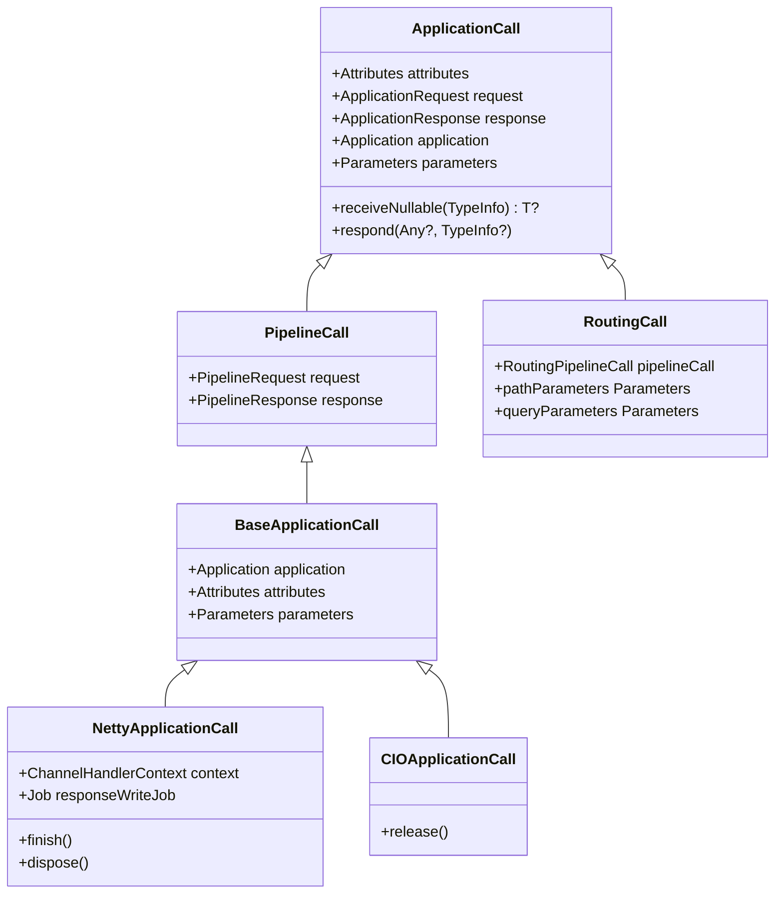
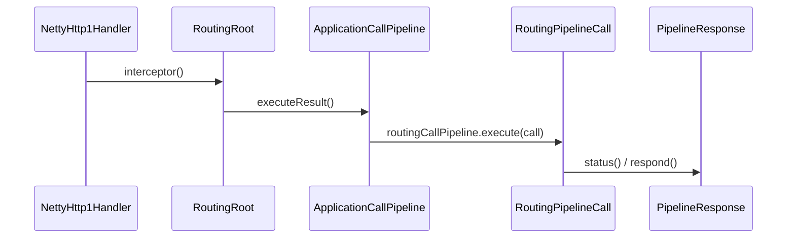

# Calls and Content

<details>
<summary>Relevant source files</summary>

The following files were used as context for generating this wiki page:

- [ktor-server/ktor-server-core/common/src/io/ktor/server/response/ApplicationResponseFunctions.kt](https://github.com/ktorio/ktor/blob/main/ktor-server/ktor-server-core/common/src/io/ktor/server/response/ApplicationResponseFunctions.kt)
- [ktor-server/ktor-server-core/common/src/io/ktor/server/application/PipelineCall.kt](https://github.com/ktorio/ktor/blob/main/ktor-server/ktor-server-core/common/src/io/ktor/server/application/PipelineCall.kt)
- [ktor-server/ktor-server-jetty-jakarta/jvm/src/io/ktor/server/jetty/jakarta/JettyApplicationCall.kt](https://github.com/ktorio/ktor/blob/main/ktor-server/ktor-server-jetty-jakarta/jvm/src/io/ktor/server/jetty/jakarta/JettyApplicationCall.kt)
- [ktor-server/ktor-server-core/common/src/io/ktor/server/engine/DefaultTransform.kt](https://github.com/ktorio/ktor/blob/main/ktor-server/ktor-server-core/common/src/io/ktor/server/engine/DefaultTransform.kt)
- [ktor-server/ktor-server-core/common/src/io/ktor/server/request/ApplicationReceiveFunctions.kt](https://github.com/ktorio/ktor/blob/main/ktor-server/ktor-server-core/common/src/io/ktor/server/request/ApplicationReceiveFunctions.kt)
- [ktor-server/ktor-server-netty/jvm/src/io/ktor/server/netty/http1/NettyHttp1Handler.kt](https://github.com/ktorio/ktor/blob/main/ktor-server/ktor-server-netty/jvm/src/io/ktor/server/netty/http1/NettyHttp1Handler.kt)
- [ktor-server/ktor-server-netty/jvm/src/io/ktor/server/netty/NettyApplicationResponse.kt](https://github.com/ktorio/ktor/blob/main/ktor-server/ktor-server-netty/jvm/src/io/ktor/server/netty/NettyApplicationResponse.kt)
- [ktor-server/ktor-server-netty/jvm/src/io/ktor/server/netty/NettyApplicationCall.kt](https://github.com/ktorio/ktor/blob/main/ktor-server/ktor-server-netty/jvm/src/io/ktor/server/netty/NettyApplicationCall.kt)
- [ktor-server/ktor-server-netty/jvm/src/io/ktor/server/netty/http2/NettyHttp2ApplicationResponse.kt](https://github.com/ktorio/ktor/blob/main/ktor-server/ktor-server-netty/jvm/src/io/ktor/server/netty/http2/NettyHttp2ApplicationResponse.kt)
- [ktor-server/ktor-server-core/common/src/io/ktor/server/application/KtorCallContexts.kt](https://github.com/ktorio/ktor/blob/main/ktor-server/ktor-server-core/common/src/io/ktor/server/application/KtorCallContexts.kt)
- [ktor-server/ktor-server-core/common/src/io/ktor/server/routing/RoutingNode.kt](https://github.com/ktorio/ktor/blob/main/ktor-server/ktor-server-core/common/src/io/ktor/server/routing/RoutingNode.kt)
- [ktor-client/ktor-client-core/common/src/io/ktor/client/call/HttpClientCall.kt](https://github.com/ktorio/ktor/blob/main/ktor-client/ktor-client-core/common/src/io/ktor/client/call/HttpClientCall.kt)
- [ktor-server/ktor-server-core/common/src/io/ktor/server/application/PluginBuilder.kt](https://github.com/ktorio/ktor/blob/main/ktor-server/ktor-server-core/common/src/io/ktor/server/application/PluginBuilder.kt)
- [ktor-server/ktor-server-cio/common/src/io/ktor/server/cio/CIOApplicationResponse.kt](https://github.com/ktorio/ktor/blob/main/ktor-server/ktor-server-cio/common/src/io/ktor/server/cio/CIOApplicationResponse.kt)
- [ktor-server/ktor-server-core/common/src/io/ktor/server/engine/BaseApplicationResponse.kt](https://github.com/ktorio/ktor/blob/main/ktor-server/ktor-server-core/common/src/io/ktor/server/engine/BaseApplicationResponse.kt)
- [ktor-server/ktor-server-netty/jvm/src/io/ktor/server/netty/http1/NettyHttp1ApplicationCall.kt](https://github.com/ktorio/ktor/blob/main/ktor-server/ktor-server-netty/jvm/src/io/ktor/server/netty/http1/NettyHttp1ApplicationCall.kt)
- [ktor-server/ktor-server-netty/jvm/src/io/ktor/server/netty/http2/NettyHttp2ApplicationCall.kt](https://github.com/ktorio/ktor/blob/main/ktor-server/ktor-server-netty/jvm/src/io/ktor/server/netty/http2/NettyHttp2ApplicationCall.kt)
- [ktor-server/ktor-server-netty/jvm/src/io/ktor/server/netty/http3/NettyHttp3ApplicationCall.kt](https://github.com/ktorio/ktor/blob/main/ktor-server/ktor-server-netty/jvm/src/io/ktor/server/netty/http3/NettyHttp3ApplicationCall.kt)
- [ktor-server/ktor-server-core/common/src/io/ktor/server/http/content/DefaultTransform.kt](https://github.com/ktorio/ktor/blob/main/ktor-server/ktor-server-core/common/src/io/ktor/server/http/content/DefaultTransform.kt)
- [ktor-server/ktor-server-netty/jvm/src/io/ktor/server/netty/http3/NettyHttp3ApplicationResponse.kt](https://github.com/ktorio/ktor/blob/main/ktor-server/ktor-server-netty/jvm/src/io/ktor/server/netty/http3/NettyHttp3ApplicationResponse.kt)
- [ktor-server/ktor-server-core/common/src/io/ktor/server/engine/BaseApplicationCall.kt](https://github.com/ktorio/ktor/blob/main/ktor-server/ktor-server-core/common/src/io/ktor/server/engine/BaseApplicationCall.kt)
- [ktor-server/ktor-server-cio/common/src/io/ktor/server/cio/CIOApplicationCall.kt](https://github.com/ktorio/ktor/blob/main/ktor-server/ktor-server-cio/common/src/io/ktor/server/cio/CIOApplicationCall.kt)
- [ktor-server/ktor-server-core/common/src/io/ktor/server/routing/RoutingPipelineCall.kt](https://github.com/ktorio/ktor/blob/main/ktor-server/ktor-server-core/common/src/io/ktor/server/routing/RoutingPipelineCall.kt)
- [ktor-server/ktor-server-core/common/src/io/ktor/server/response/PipelineResponse.kt](https://github.com/ktorio/ktor/blob/main/ktor-server/ktor-server-core/common/src/io/ktor/server/response/PipelineResponse.kt)
- [ktor-server/ktor-server-core/common/src/io/ktor/server/application/Application.kt](https://github.com/ktorio/ktor/blob/main/ktor-server/ktor-server-core/common/src/io/ktor/server/application/Application.kt)
- [ktor-server/ktor-server-core/common/src/io/ktor/server/request/PipelineRequest.kt](https://github.com/ktorio/ktor/blob/main/ktor-server/ktor-server-core/common/src/io/ktor/server/request/PipelineRequest.kt)
- [ktor-compiler-plugin/testData/openapi/Nesting.kt](https://github.com/ktorio/ktor/blob/main/ktor-compiler-plugin/testData/openapi/Nesting.kt)
- [ktor-compiler-plugin/testData/openapi/OddReferences.kt](https://github.com/ktorio/ktor/blob/main/ktor-compiler-plugin/testData/openapi/OddReferences.kt)
- [ktor-compiler-plugin/testData/openapi/Parameters.kt](https://github.com/ktorio/ktor/blob/main/ktor-compiler-plugin/testData/openapi/Parameters.kt)
- [ktor-server/ktor-server-core/common/src/io/ktor/server/routing/RoutingRoot.kt](https://github.com/ktorio/ktor/blob/main/ktor-server/ktor-server-core/common/src/io/ktor/server/routing/RoutingRoot.kt)
</details>

## Overview

The "Calls and Content" subsystem in Ktor defines the abstractions governing client-server communication, request lifecycle management, content reception, transformation, and response rendering. At its core, the `ApplicationCall` interface encapsulates a single act of communication, binding together an `ApplicationRequest`, an `ApplicationResponse`, an associated `Application`, and typed attributes. This architecture decouples low-level server engines (such as Netty, Jetty, and CIO) from application-level business logic and routing.

By unifying data interchange through pipelined transformations (`ApplicationReceivePipeline` and `ApplicationSendPipeline`), Ktor allows developers to seamlessly receive typed bodies—ranging from raw `ByteReadChannel` instances and byte arrays to form parameters, multipart data, and custom serialized types—and respond with strings, binaries, streams, or status codes. The subsystem handles cross-cutting concerns like double-receive prevention tokens, content negotiation integration, header commit semantics, and protocol-specific mechanics transparently.

Sources: [ktor-server/ktor-server-core/common/src/io/ktor/server/application/PipelineCall.kt:29-50](https://github.com/ktorio/ktor/blob/main/ktor-server/ktor-server-core/common/src/io/ktor/server/application/PipelineCall.kt#L29-L50)

Sources: [ktor-server/ktor-server-core/common/src/io/ktor/server/request/ApplicationReceiveFunctions.kt:31-62](https://github.com/ktorio/ktor/blob/main/ktor-server/ktor-server-core/common/src/io/ktor/server/request/ApplicationReceiveFunctions.kt#L31-L62)

Sources: [ktor-server/ktor-server-core/common/src/io/ktor/server/response/ApplicationResponseFunctions.kt:24-50](https://github.com/ktorio/ktor/blob/main/ktor-server/ktor-server-core/common/src/io/ktor/server/response/ApplicationResponseFunctions.kt#L24-L50)

## Application Call Architecture and Engine Abstractions

The `ApplicationCall` interface represents the runtime context of an active request and response. Engine-specific implementations—such as `JettyApplicationCall`, `NettyApplicationCall`, `CIOApplicationCall`, and `RoutingCall`—extend base classes like `BaseApplicationCall` to bridge low-level network server APIs with Ktor's coroutine-based execution model.

Each call maintains an `attributes` container and provides access to request properties via `request` (`ApplicationRequest` / `PipelineRequest`) and response management via `response` (`ApplicationResponse` / `PipelineResponse`). When requests enter the server pipeline, engine handlers instantiate call objects and bind coroutine contexts that combine the application's base context, user dispatchers, and request-scoped jobs.



Sources: [ktor-server/ktor-server-core/common/src/io/ktor/server/application/PipelineCall.kt:29-84](https://github.com/ktorio/ktor/blob/main/ktor-server/ktor-server-core/common/src/io/ktor/server/application/PipelineCall.kt#L29-L84)

Sources: [ktor-server/ktor-server-core/common/src/io/ktor/server/engine/BaseApplicationCall.kt:16-29](https://github.com/ktorio/ktor/blob/main/ktor-server/ktor-server-core/common/src/io/ktor/server/engine/BaseApplicationCall.kt#L16-L29)

Sources: [ktor-server/ktor-server-netty/jvm/src/io/ktor/server/netty/NettyApplicationCall.kt:16-60](https://github.com/ktorio/ktor/blob/main/ktor-server/ktor-server-netty/jvm/src/io/ktor/server/netty/NettyApplicationCall.kt#L16-L60)

## Request Receiving and Content Transformation

Receiving content from an incoming client request is managed through `ApplicationCall.receiveNullable(TypeInfo)` and processed via the `ApplicationReceivePipeline`. The pipeline starts with a `ByteReadChannel` representing the request body stream and executes transformations across three primary phases: `Before`, `Transform`, and `After`.

When `receiveNullable` is invoked, Ktor checks for a double-receive prevention token in the call attributes. If absent, it injects `DoubleReceivePreventionToken` and sets the `receiveType`. The request pipeline then executes with the incoming byte channel.

```
Incoming Request Body (ByteReadChannel) 
    --> ApplicationReceivePipeline.Before 
    --> ApplicationReceivePipeline.Transform (DefaultTransform: ByteArray, Parameters, MultiPartData)
    --> ApplicationReceivePipeline.After (String conversion with Charset) 
    --> Handled Target Object
```

> [!WARNING]
> Invoking `call.receive()` twice on the same call without installing the `DoubleReceive` plugin will trigger a `RequestAlreadyConsumedException`. The underlying stream channel can only be consumed once by default.

Sources: [ktor-server/ktor-server-core/common/src/io/ktor/server/application/PipelineCall.kt:110-127](https://github.com/ktorio/ktor/blob/main/ktor-server/ktor-server-core/common/src/io/ktor/server/application/PipelineCall.kt#L110-L127)

Sources: [ktor-server/ktor-server-core/common/src/io/ktor/server/request/ApplicationReceiveFunctions.kt:31-96](https://github.com/ktorio/ktor/blob/main/ktor-server/ktor-server-core/common/src/io/ktor/server/request/ApplicationReceiveFunctions.kt#L31-L96)

Sources: [ktor-server/ktor-server-core/common/src/io/ktor/server/engine/DefaultTransform.kt:40-96](https://github.com/ktorio/ktor/blob/main/ktor-server/ktor-server-core/common/src/io/ktor/server/engine/DefaultTransform.kt#L40-L96)

## Response Sending and Outgoing Content Pipeline

Sending responses is accomplished via `ApplicationCall.respond(message, typeInfo)` or convenience extensions such as `respondText`, `respondBytes`, `respondSource`, and `respondBytesWriter`. The message flows through the `ApplicationSendPipeline`, which processes bodies via `ApplicationSendPipeline.Render` and `ApplicationSendPipeline.Transform` phases before reaching `ApplicationSendPipeline.Engine`.

The `BaseApplicationResponse.setupSendPipeline` interceptor catches any unhandled `OutgoingContent` object, commits headers, and routes the content based on its specific subtype:

| `OutgoingContent` Subtype | Processing Mechanism |
| :--- | :--- |
| `OutgoingContent.ByteArrayContent` | Evaluates `content.bytes()`, commits headers, and writes raw bytes via `respondFromBytes`. |
| `OutgoingContent.WriteChannelContent` | Commits headers and executes `content.writeTo(writerChannel)` within an IO bridge context. |
| `OutgoingContent.ReadChannelContent` | Acquires read channel from `content.readFrom()`, commits headers, and pipes data through `respondFromChannel`. |
| `OutgoingContent.NoContent` | Commits headers and invokes `respondNoContent` (e.g., writing zero content-length or closing). |
| `OutgoingContent.ProtocolUpgrade` | Commits upgrade headers and executes connection-level protocol switching (`respondUpgrade`). |

Sources: [ktor-server/ktor-server-core/common/src/io/ktor/server/response/ApplicationResponseFunctions.kt:24-66](https://github.com/ktorio/ktor/blob/main/ktor-server/ktor-server-core/common/src/io/ktor/server/response/ApplicationResponseFunctions.kt#L24-L66)

Sources: [ktor-server/ktor-server-core/common/src/io/ktor/server/engine/BaseApplicationResponse.kt:123-168](https://github.com/ktorio/ktor/blob/main/ktor-server/ktor-server-core/common/src/io/ktor/server/engine/BaseApplicationResponse.kt#L123-L168)

Sources: [ktor-server/ktor-server-core/common/src/io/ktor/server/engine/DefaultTransform.kt:28-33](https://github.com/ktorio/ktor/blob/main/ktor-server/ktor-server-core/common/src/io/ktor/server/engine/DefaultTransform.kt#L28-L33)

## Call-Chain Execution Walkthrough

The lifecycle of an application call follows a strictly ordered execution path from network ingestion to response completion. Tracing through the verified call chains:

1. **`NettyHttp1Handler.handleRequest`**: Inbound Netty requests are intercepted and dispatched.
2. **`RoutingRoot.Plugin.install`**: Registers the routing interceptor on the application pipeline.
3. **`RoutingRoot.interceptor`**: `installNesting` or other route builders trigger `routing` -> `install` -> `interceptor` -> `executeResult` -> `status`. During route resolution, `RoutingResolveContext` resolves the matching route and invokes `executeResult`.
4. **`RoutingRoot.executeResult`**: Merges request and response pipelines, constructs a `RoutingPipelineCall`, executes the pipeline, and falls back to `status()` if the call remains unhandled.
5. **`PipelineResponse.status`**: Commits or retrieves the response status code during final response transmission.



Sources: [ktor-server/ktor-server-netty/jvm/src/io/ktor/server/netty/http1/NettyHttp1Handler.kt:166-221](https://github.com/ktorio/ktor/blob/main/ktor-server/ktor-server-netty/jvm/src/io/ktor/server/netty/http1/NettyHttp1Handler.kt#L166-L221)

Sources: [ktor-server/ktor-server-core/common/src/io/ktor/server/routing/RoutingRoot.kt:68-167](https://github.com/ktorio/ktor/blob/main/ktor-server/ktor-server-core/common/src/io/ktor/server/routing/RoutingRoot.kt#L68-L167)

Sources: [ktor-server/ktor-server-core/common/src/io/ktor/server/response/PipelineResponse.kt:60-68](https://github.com/ktorio/ktor/blob/main/ktor-server/ktor-server-core/common/src/io/ktor/server/response/PipelineResponse.kt#L60-L68)

## Routing and Pipeline Integration

Routing in Ktor is integrated via `RoutingRoot`, which intercepts the application pipeline at the `Call` phase. When an incoming call matches a defined `Route` node in the routing tree, `RoutingRoot.executeResult` constructs a `RoutingPipelineCall` and merges the parent application receive and send pipelines with route-specific pipelines.

Route handlers execute within a `RoutingContext` receiver. If a handler finishes executing without marking the call as handled (`isHandled`), Ktor automatically evaluates any assigned response status or falls back to standard error pages.

```kotlin
routing {
    route("/api") {
        get("/users/{id}") {
            val id = call.parameters["id"]?.toIntOrNull()
                ?: return@get call.respond(HttpStatusCode.BadRequest)
            call.respond(User0(id, "Ktor User"))
        }
    }
}
```

> [!NOTE]
> `RoutingCall` delegates request and response operations to the underlying `RoutingPipelineCall`, ensuring path parameters, query parameters, and route-scoped attributes are cleanly exposed to route handlers.

Sources: [ktor-server/ktor-server-core/common/src/io/ktor/server/routing/RoutingRoot.kt:68-119](https://github.com/ktorio/ktor/blob/main/ktor-server/ktor-server-core/common/src/io/ktor/server/routing/RoutingRoot.kt#L68-L119)

Sources: [ktor-server/ktor-server-core/common/src/io/ktor/server/routing/RoutingNode.kt:161-254](https://github.com/ktorio/ktor/blob/main/ktor-server/ktor-server-core/common/src/io/ktor/server/routing/RoutingNode.kt#L161-L254)

Sources: [ktor-compiler-plugin/testData/openapi/Nesting.kt:24-60](https://github.com/ktorio/ktor/blob/main/ktor-compiler-plugin/testData/openapi/Nesting.kt#L24-L60)

Sources: [ktor-server/ktor-server-core/common/src/io/ktor/server/routing/RoutingNode.kt:104-132](https://github.com/ktorio/ktor/blob/main/ktor-server/ktor-server-core/common/src/io/ktor/server/routing/RoutingNode.kt#L104-L132)

## Plugin Interception Contexts

Plugins interact with calls and content through specialized context receivers defined in `KtorCallContexts.kt` and `PluginBuilder.kt`. These contexts provide scoped builder DSLs for inspecting and intercepting calls during different phases of their lifecycle:

- **`OnCallContext`**: Receiver for `onCall` interceptors, invoked for every incoming `PipelineCall` regardless of routing matching state.
- **`OnCallReceiveContext`**: Receiver for `onCallReceive` interceptors. Exposes the `transformBody` method, allowing plugins to intercept and transform the raw `ByteReadChannel` body before content negotiation or deserialization takes place.
- **`OnCallRespondContext`**: Receiver for `onCallRespond` interceptors. Exposes `transformBody` to modify response subjects before they are rendered into `OutgoingContent`.

```kotlin
val CustomHeaderPlugin = createApplicationPlugin(name = "CustomHeaderPlugin") {
    onCall { call ->
        call.response.headers.append("X-Custom-Header", "Ktor")
    }
    onCallReceive { call, body ->
        application.log.debug("Receiving body for ${call.request.uri}")
    }
}
```

Sources: [ktor-server/ktor-server-core/common/src/io/ktor/server/application/KtorCallContexts.kt:20-104](https://github.com/ktorio/ktor/blob/main/ktor-server/ktor-server-core/common/src/io/ktor/server/application/KtorCallContexts.kt#L20-L104)

Sources: [ktor-server/ktor-server-core/common/src/io/ktor/server/application/PluginBuilder.kt:73-149](https://github.com/ktorio/ktor/blob/main/ktor-server/ktor-server-core/common/src/io/ktor/server/application/PluginBuilder.kt#L73-L149)

Sources: [ktor-server/ktor-server-core/common/src/io/ktor/server/application/PluginBuilder.kt:96-105](https://github.com/ktorio/ktor/blob/main/ktor-server/ktor-server-core/common/src/io/ktor/server/application/PluginBuilder.kt#L96-L105)

## Design Trade-offs and Engine-Specific Details

Different server engines manage socket writing, framing, and upgrading through specific architectural patterns tailored to their underlying runtime libraries:

| Design Choice | Benefit | Cost / Trade-off |
| :--- | :--- | :--- |
| **Engine Abstraction via `BaseApplicationCall`** | Decouples high-level routing and plugins from Netty, Jetty, and CIO transport mechanics. | Requires engine-specific subclasses (`NettyApplicationCall`, `JettyApplicationCall`, `CIOApplicationCall`) to implement low-level transport details. |
| **Child Job Response Synchronization (`responseWriteJob`)** | Avoids explicit suspending joins on application threads at the end of each call by tying response I/O completion to coroutine hierarchy. | Requires careful coordination of coroutine lifecycles and cancellation propagation on Netty I/O threads. |
| **Pipeline Merging in Routing (`RoutingRoot`)** | Allows per-route receive and send pipeline modifications without polluting global application state. | Dynamic pipeline merging incurs minor object allocation overhead per routed request. |
| **Chunked vs Multiplexed Framing (HTTP/1.1 vs HTTP/2/3)** | Optimizes wire transmission for protocol capabilities (chunked transfer for HTTP/1.1 vs `Http2DataFrame` and `Http3DataFrame` for HTTP/2 and HTTP/3). | Engine response implementations must branch based on protocol version and framing constraints. |

> [!CAUTION]
> When implementing custom engine adapters or low-level protocol interceptors, ensure that `commitHeaders` is called exactly once before writing body bytes. Calling `respond` multiple times or attempting to commit headers after a response is already committed will throw a `ResponseAlreadySentException`.

Sources: [ktor-server/ktor-server-netty/jvm/src/io/ktor/server/netty/NettyApplicationCall.kt:33-60](https://github.com/ktorio/ktor/blob/main/ktor-server/ktor-server-netty/jvm/src/io/ktor/server/netty/NettyApplicationCall.kt#L33-L60)

Sources: [ktor-server/ktor-server-core/common/src/io/ktor/server/engine/BaseApplicationResponse.kt:27-61](https://github.com/ktorio/ktor/blob/main/ktor-server/ktor-server-core/common/src/io/ktor/server/engine/BaseApplicationResponse.kt#L27-L61)

Sources: [ktor-server/ktor-server-core/common/src/io/ktor/server/routing/RoutingRoot.kt:80-95](https://github.com/ktorio/ktor/blob/main/ktor-server/ktor-server-core/common/src/io/ktor/server/routing/RoutingRoot.kt#L80-L95)

## Related

- [[Application Pipeline]]
- [[Content Representation]]

