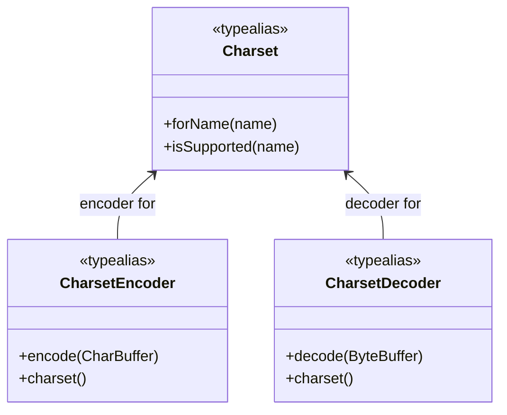
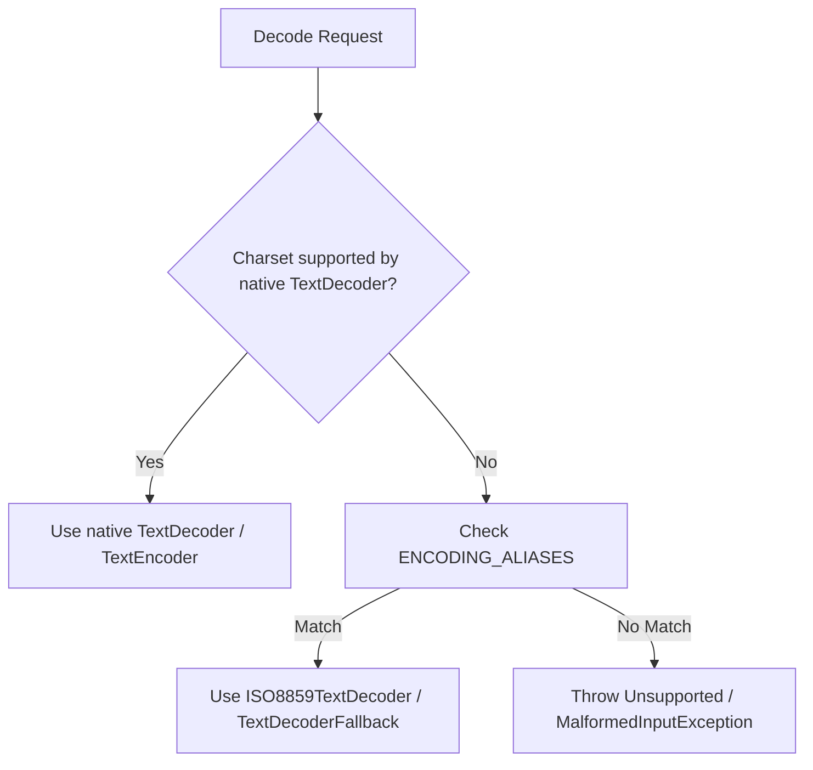

# Character Encodings

<details>
<summary>Relevant source files</summary>

The following files were used as context for generating this wiki page:

- [ktor-io/mingwX64/src/CharsetMingw.kt](https://github.com/ktorio/ktor/blob/main/ktor-io/mingwX64/src/CharsetMingw.kt)
- [ktor-io/js/src/io/ktor/utils/io/charsets/Charset.js.kt](https://github.com/ktorio/ktor/blob/main/ktor-io/js/src/io/ktor/utils/io/charsets/Charset.js.kt)
- [ktor-io/linux/src/CharsetLinux.kt](https://github.com/ktorio/ktor/blob/main/ktor-io/linux/src/CharsetLinux.kt)
- [ktor-http/common/src/io/ktor/http/Codecs.kt](https://github.com/ktorio/ktor/blob/main/ktor-http/common/src/io/ktor/http/Codecs.kt)
- [ktor-io/wasmJs/src/io/ktor/utils/io/charsets/Encoding.wasmJs.kt](https://github.com/ktorio/ktor/blob/main/ktor-io/wasmJs/src/io/ktor/utils/io/charsets/Encoding.wasmJs.kt)
- [ktor-io/common/src/io/ktor/utils/io/core/Strings.kt](https://github.com/ktorio/ktor/blob/main/ktor-io/common/src/io/ktor/utils/io/core/Strings.kt)
- [ktor-io/jvm/src/io/ktor/utils/io/charsets/CharsetJVM.kt](https://github.com/ktorio/ktor/blob/main/ktor-io/jvm/src/io/ktor/utils/io/charsets/CharsetJVM.kt)
- [ktor-io/posix/src/io/ktor/utils/io/charsets/CharsetNative.kt](https://github.com/ktorio/ktor/blob/main/ktor-io/posix/src/io/ktor/utils/io/charsets/CharsetNative.kt)
- [ktor-io/common/src/io/ktor/utils/io/charsets/Encoding.kt](https://github.com/ktorio/ktor/blob/main/ktor-io/common/src/io/ktor/utils/io/charsets/Encoding.kt)
- [ktor-io/darwin/src/CharsetDarwin.kt](https://github.com/ktorio/ktor/blob/main/ktor-io/darwin/src/CharsetDarwin.kt)
- [ktor-io/androidNative/src/Charset.androidNative.kt](https://github.com/ktorio/ktor/blob/main/ktor-io/androidNative/src/Charset.androidNative.kt)
- [ktor-io/wasmJs/src/io/ktor/utils/io/charsets/JsTextDecoder.kt](https://github.com/ktorio/ktor/blob/main/ktor-io/wasmJs/src/io/ktor/utils/io/charsets/JsTextDecoder.kt)
- [ktor-io/js/src/io/ktor/utils/io/charsets/Decoder.js.kt](https://github.com/ktorio/ktor/blob/main/ktor-io/js/src/io/ktor/utils/io/charsets/Decoder.js.kt)
- [ktor-io/wasmJs/src/io/ktor/utils/io/charsets/Decoder.kt](https://github.com/ktorio/ktor/blob/main/ktor-io/wasmJs/src/io/ktor/utils/io/charsets/Decoder.kt)
- [ktor-io/js/src/io/ktor/utils/io/charsets/TextDecoderFallback.js.kt](https://github.com/ktorio/ktor/blob/main/ktor-io/js/src/io/ktor/utils/io/charsets/TextDecoderFallback.js.kt)
- [ktor-io/wasmJs/src/io/ktor/utils/io/charsets/TextEncoder.kt](https://github.com/ktorio/ktor/blob/main/ktor-io/wasmJs/src/io/ktor/utils/io/charsets/TextEncoder.kt)
- [ktor-io/js/src/io/ktor/utils/io/charsets/TextEncoder.js.kt](https://github.com/ktorio/ktor/blob/main/ktor-io/js/src/io/ktor/utils/io/charsets/TextEncoder.js.kt)
- [ktor-io/wasmJs/src/io/ktor/utils/io/charsets/ISO8859TextDecoder.kt](https://github.com/ktorio/ktor/blob/main/ktor-io/wasmJs/src/io/ktor/utils/io/charsets/ISO8859TextDecoder.kt)
- [ktor-io/js/src/io/ktor/utils/io/charsets/TextDecoder.js.kt](https://github.com/ktorio/ktor/blob/main/ktor-io/js/src/io/ktor/utils/io/charsets/TextDecoder.js.kt)
- [ktor-shared/ktor-encoding-zstd/jvm/src/io/ktor/encoding/zstd/Zstd.jvm.kt](https://github.com/ktorio/ktor/blob/main/ktor-shared/ktor-encoding-zstd/jvm/src/io/ktor/encoding/zstd/Zstd.jvm.kt)
- [ktor-utils/common/src/io/ktor/util/Charset.kt](https://github.com/ktorio/ktor/blob/main/ktor-utils/common/src/io/ktor/util/Charset.kt)
- [ktor-utils/web/src/io/ktor/util/ContentEncoders.web.kt](https://github.com/ktorio/ktor/blob/main/ktor-utils/web/src/io/ktor/util/ContentEncoders.web.kt)
- [ktor-server/ktor-server-core/nonJvm/src/io/ktor/server/engine/DefaultTransform.nonJvm.kt](https://github.com/ktorio/ktor/blob/main/ktor-server/ktor-server-core/nonJvm/src/io/ktor/server/engine/DefaultTransform.nonJvm.kt)
</details>

## Overview

The character encoding and decoding subsystem in Ktor provides a unified, multiplatform API abstraction over platform-specific text conversion engines. It allows Ktor network operations, payload serialization, and HTTP header codecs to read and write character sequences (`CharSequence`, `CharArray`, and `String`) as raw byte streams (`Source`, `Sink`, and `ByteArray`) across the JVM, JavaScript, WebAssembly, and native targets (Linux, MingwX64, Darwin, Android Native).
Sources: [ktor-io/common/src/io/ktor/utils/io/charsets/Encoding.kt:11-21](https://github.com/ktorio/ktor/blob/main/ktor-io/common/src/io/ktor/utils/io/charsets/Encoding.kt#L11-L21)

Different runtime platforms handle text transformation through distinct native mechanisms: the JVM delegates directly to `java.nio.charset.Charset`, JavaScript and WebAssembly use web APIs like `TextDecoder` and `TextEncoder` (with fallback tables for ISO-8859-1/Windows-1252), POSIX targets utilize `iconv`, and Darwin integrates with `NSStringEncoding` via Apple's Foundation framework. By defining expect/actual contracts for `Charset`, `CharsetEncoder`, and `CharsetDecoder`, Ktor decouples higher-level networking logic from platform constraints while ensuring efficient stream transformation.
Sources: [ktor-io/jvm/src/io/ktor/utils/io/charsets/CharsetJVM.kt:13-33](https://github.com/ktorio/ktor/blob/main/ktor-io/jvm/src/io/ktor/utils/io/charsets/CharsetJVM.kt#L13-L33)

Beyond direct text-to-byte conversion, the subsystem incorporates HTTP-specific codecs for URL encoding and decoding, handling percent-escaping rules under RFC 3986 and RFC 5987. It maintains safety controls such as `MalformedInputException` and `TooLongLineException` to handle invalid byte streams, malformed percent sequences, or unmappable characters during stream consumption.
Sources: [ktor-io/js/src/io/ktor/utils/io/charsets/Charset.js.kt:24-68](https://github.com/ktorio/ktor/blob/main/ktor-io/js/src/io/ktor/utils/io/charsets/Charset.js.kt#L24-L68)

---

## Public API & Platform Contracts

The shared module declares `expect` declarations for `Charset`, `CharsetEncoder`, and `CharsetDecoder` alongside registry utilities in `Charsets`. Each target provides `actual` typealiases or classes mapping these constructs to native primitives.
Sources: [ktor-io/common/src/io/ktor/utils/io/charsets/Encoding.kt:11-38](https://github.com/ktorio/ktor/blob/main/ktor-io/common/src/io/ktor/utils/io/charsets/Encoding.kt#L11-L38)

| Common Expect Declaration | JVM Actual Mapping | JS/Wasm Actual Mapping | Native / POSIX Actual Mapping |
| :--- | :--- | :--- | :--- |
| `expect abstract class Charset` | `java.nio.charset.Charset` | `abstract class Charset(internal val _name: String)` | `abstract class Charset(internal val _name: String)` |
| `expect typealias CharsetEncoder` | `java.nio.charset.CharsetEncoder` | `abstract class CharsetEncoder` | `abstract class CharsetEncoder` |
| `expect typealias CharsetDecoder` | `java.nio.charset.CharsetDecoder` | `abstract class CharsetDecoder` | `abstract class CharsetDecoder` |
| `expect object Charsets` | `kotlin.text.Charsets` | `object Charsets { UTF_8, ISO_8859_1 }` | `object Charsets { UTF_8, ISO_8859_1, UTF_16 }` |
Sources: [ktor-io/jvm/src/io/ktor/utils/io/charsets/CharsetJVM.kt:13-33](https://github.com/ktorio/ktor/blob/main/ktor-io/jvm/src/io/ktor/utils/io/charsets/CharsetJVM.kt#L13-L33)

Querying and registration functions allow checking support and retrieving charset instances dynamically across targets.
Sources: [ktor-io/js/src/io/ktor/utils/io/charsets/Charset.js.kt:15-70](https://github.com/ktorio/ktor/blob/main/ktor-io/js/src/io/ktor/utils/io/charsets/Charset.js.kt#L15-L70)

- `Charsets.forName(name: String): Charset` resolves a charset by its string identifier, throwing an exception if unsupported.
- `Charsets.isSupported(name: String): Boolean` validates whether the platform supports a given character set identifier.
- `Charset.name: String` exposes the canonical string name of the charset instance.
Sources: [ktor-io/posix/src/io/ktor/utils/io/charsets/CharsetNative.kt:14-55](https://github.com/ktorio/ktor/blob/main/ktor-io/posix/src/io/ktor/utils/io/charsets/CharsetNative.kt#L14-L55)

---

## JVM Platform Implementation

On the JVM, Ktor maps its character encoding abstractions directly to Java NIO classes (`java.nio.charset.Charset`, `CharsetEncoder`, and `CharsetDecoder`). This provides direct integration with the Java runtime's extensive character set provider architecture.
Sources: [ktor-io/jvm/src/io/ktor/utils/io/charsets/CharsetJVM.kt:13-33](https://github.com/ktorio/ktor/blob/main/ktor-io/jvm/src/io/ktor/utils/io/charsets/CharsetJVM.kt#L13-L33)


Sources: [ktor-io/jvm/src/io/ktor/utils/io/charsets/CharsetJVM.kt:13-80](https://github.com/ktorio/ktor/blob/main/ktor-io/jvm/src/io/ktor/utils/io/charsets/CharsetJVM.kt#L13-L80)

When encoding strings or character buffers, Ktor optimizes execution paths for standard `String` inputs by bypassing slow buffer wraps when indices cover the entire string:
```kotlin
public actual fun CharsetEncoder.encodeToByteArray(input: CharSequence, fromIndex: Int, toIndex: Int): ByteArray {
    @Suppress("PLATFORM_CLASS_MAPPED_TO_KOTLIN")
    if (input is String) {
        if (fromIndex == 0 && toIndex == input.length) {
            return (input as java.lang.String).getBytes(charset())
        }
        return (input.substring(fromIndex, toIndex) as java.lang.String).getBytes(charset())
    }
    return encodeToByteArraySlow(input, fromIndex, toIndex)
}
```
Sources: [ktor-io/jvm/src/io/ktor/utils/io/charsets/CharsetJVM.kt:35-46](https://github.com/ktorio/ktor/blob/main/ktor-io/jvm/src/io/ktor/utils/io/charsets/CharsetJVM.kt#L35-L46)

If the input is a general `CharSequence`, `encodeToByteArraySlow` wraps the sequence in a `CharBuffer`, invokes the NIO encoder, and extracts the resulting byte array via `ByteBuffer.get()`.
Sources: [ktor-io/jvm/src/io/ktor/utils/io/charsets/CharsetJVM.kt:47-56](https://github.com/ktorio/ktor/blob/main/ktor-io/jvm/src/io/ktor/utils/io/charsets/CharsetJVM.kt#L47-L56)

---

## JavaScript and WebAssembly Encodings

In JS and WasmJs environments, character conversion leverages browser and Node.js standard APIs (`TextEncoder` and `TextDecoder`), supplemented by custom fallbacks for ISO-8859-1 and Windows-1252 compatibility.
Sources: [ktor-io/js/src/io/ktor/utils/io/charsets/Charset.js.kt:95-98](https://github.com/ktorio/ktor/blob/main/ktor-io/js/src/io/ktor/utils/io/charsets/Charset.js.kt#L95-L98)

Because the WHATWG encoding specification mandates that HTTP `ISO-8859-1` be treated as `Windows-1252`, Ktor includes `TextDecoderFallback` (JS) and `ISO8859TextDecoder` (WasmJs) to decode non-UTF-8 byte streams when the native `TextDecoder` encounters an unsupported alias or throws an error.
Sources: [ktor-io/js/src/io/ktor/utils/io/charsets/TextDecoderFallback.js.kt:33-37](https://github.com/ktorio/ktor/blob/main/ktor-io/js/src/io/ktor/utils/io/charsets/TextDecoderFallback.js.kt#L33-L37)


Sources: [ktor-io/js/src/io/ktor/utils/io/charsets/Decoder.js.kt:9-13](https://github.com/ktorio/ktor/blob/main/ktor-io/js/src/io/ktor/utils/io/charsets/Decoder.js.kt#L9-L13)

> [!NOTE]
> The `ENCODING_ALIASES` set explicitly recognizes 17 variants of ASCII, Latin-1, and Windows-1252 (including `"cp1252"`, `"latin1"`, `"iso-8859-1"`, and `"us-ascii"`) to ensure consistent behavior across JavaScript runtime environments.
Sources: [ktor-io/js/src/io/ktor/utils/io/charsets/TextDecoderFallback.js.kt:11-29](https://github.com/ktorio/ktor/blob/main/ktor-io/js/src/io/ktor/utils/io/charsets/TextDecoderFallback.js.kt#L11-L29)

---

## POSIX and Native `iconv` Integration

On POSIX-compliant native targets (such as Linux and MingwX64), Ktor interacts directly with the system `iconv` library through Kotlin interop. 
Sources: [ktor-io/mingwX64/src/CharsetMingw.kt:8-12](https://github.com/ktorio/ktor/blob/main/ktor-io/mingwX64/src/CharsetMingw.kt#L8-L12)

`CharsetIconv` initializes encoding descriptors using `iconv_open`:
```kotlin
private class CharsetIconv(name: String) : Charset(name) {
    init {
        val v = iconv_open(name, "UTF-8")
        checkErrors(v, name)
        iconv_close(v)
    }
    override fun newEncoder(): CharsetEncoder = CharsetEncoderImpl(this)
    override fun newDecoder(): CharsetDecoder = CharsetDecoderImpl(this)
}
```
Sources: [ktor-io/mingwX64/src/CharsetMingw.kt:23-33](https://github.com/ktorio/ktor/blob/main/ktor-io/mingwX64/src/CharsetMingw.kt#L23-L33)

During stream decoding (`CharsetDecoder.decode`), Ktor reads chunks from the source buffer, feeds them into `iconv`, and appends decoded characters to the destination `Appendable`. If an incomplete multi-byte character is encountered at a segment boundary (`bytesConsumed == 0` while input size exceeds the head segment size), Ktor consolidates the remaining bytes into a contiguous byte array and continues processing:
```kotlin
if (bytesConsumed == 0) {
    if (input.buffer.size > headSegmentSize.toLong()) {
        val remaining = input.readByteArray()
        input.buffer.write(remaining)
        continue
    }
    throw MalformedInputException("Incomplete or truncated byte sequence at input")
}
```
Sources: [ktor-io/mingwX64/src/CharsetMingw.kt:151-160](https://github.com/ktorio/ktor/blob/main/ktor-io/mingwX64/src/CharsetMingw.kt#L151-L160)

---

## Darwin and Apple Platform Encodings

On Apple platforms (Darwin), `CharsetDarwin` maps character set names to `NSStringEncoding` constants from Foundation:
Sources: [ktor-io/darwin/src/CharsetDarwin.kt:12-12](https://github.com/ktorio/ktor/blob/main/ktor-io/darwin/src/CharsetDarwin.kt#L12-L12)

```kotlin
val encoding: NSStringEncoding = when (name.uppercase()) {
    "UTF-8" -> NSUTF8StringEncoding
    "ISO-8859-1" -> NSISOLatin1StringEncoding
    "UTF-16" -> NSUTF16StringEncoding
    "UTF-16BE" -> NSUTF16BigEndianStringEncoding
    "UTF-16LE" -> NSUTF16LittleEndianStringEncoding
    "UTF-32" -> NSUTF32StringEncoding
    "UTF-32BE" -> NSUTF32BigEndianStringEncoding
    "UTF-32LE" -> NSUTF32LittleEndianStringEncoding
    "ASCII" -> NSASCIIStringEncoding
    else -> throw IllegalArgumentException("Charset $name is not supported by Darwin.")
}
```
Sources: [ktor-io/darwin/src/CharsetDarwin.kt:31-45](https://github.com/ktorio/ktor/blob/main/ktor-io/darwin/src/CharsetDarwin.kt#L31-L45)

Encoders cast `CharSequence` inputs to `NSString`, invoke `dataUsingEncoding(charset.encoding)`, and write the resulting `NSData bytes` into the destination `Sink`. Decoders perform the reverse operation by converting `Source` bytes into an `NSData` container via `pinned` memory pointers and creating an `NSString` instance.
Sources: [ktor-io/darwin/src/CharsetDarwin.kt:55-85](https://github.com/ktorio/ktor/blob/main/ktor-io/darwin/src/CharsetDarwin.kt#L55-L85)

---

## HTTP Codecs and URL Percent-Encoding

The `Codecs.kt` module implements URL encoding and decoding utilities adhering to RFC 3986 and RFC 5987. It defines specific byte alphabets and path validation rules:
Sources: [ktor-http/common/src/io/ktor/http/Codecs.kt:11-31](https://github.com/ktorio/ktor/blob/main/ktor-http/common/src/io/ktor/http/Codecs.kt#L11-L31)
- `URL_ALPHABET`: Alphanumeric characters (`a-z`, `A-Z`, `0-9`).
- `URL_PROTOCOL_PART`: General URI components (`:`, `/`, `?`, `#`, `[`, `]`, `@`), sub-components (`!`, `$`, `&`, `'`, `(`, `)`, `*`, `,`, `;`, `=`), and unreserved symbols (`-`, `.`, `_`, `~`, `+`).
- `VALID_PATH_PART`: Valid path characters conforming to `pchar`.
Sources: [ktor-http/common/src/io/ktor/http/Codecs.kt:11-31](https://github.com/ktorio/ktor/blob/main/ktor-http/common/src/io/ktor/http/Codecs.kt#L11-L31)

When encoding URL query components via `encodeURLQueryComponent`, characters outside the allowed set undergo percent-encoding:
```kotlin
public fun String.encodeURLQueryComponent(
    encodeFull: Boolean = false,
    spaceToPlus: Boolean = false,
    charset: Charset = Charsets.UTF_8
): String = buildString {
    val content = charset.newEncoder().encode(this@encodeURLQueryComponent)
    content.forEach {
        when {
            it == ' '.code.toByte() -> if (spaceToPlus) append('+') else append("%20")
            it in URL_ALPHABET || (!encodeFull && it in URL_PROTOCOL_PART) -> append(it.toInt().toChar())
            else -> append(it.percentEncode())
        }
    }
}
```
Sources: [ktor-http/common/src/io/ktor/http/Codecs.kt:52-65](https://github.com/ktorio/ktor/blob/main/ktor-http/common/src/io/ktor/http/Codecs.kt#L52-L65)

URL decoding scans strings for `%` or `+` markers using `decodeScan`. If escape sequences are found, `decodeImpl` parses hex digits into a reusable `ByteArray` buffer before decoding strings:
```kotlin
val digit1 = charToHexDigit(this[index + 1])
val digit2 = charToHexDigit(this[index + 2])
if (digit1 == -1 || digit2 == -1) {
    throw URLDecodeException("Wrong HEX escape: %${this[index + 1]}${this[index + 2]}, in $this, at $index")
}
bytes[count++] = (digit1 * 16 + digit2).toByte()
index += 3
```
Sources: [ktor-http/common/src/io/ktor/http/Codecs.kt:253-271](https://github.com/ktorio/ktor/blob/main/ktor-http/common/src/io/ktor/http/Codecs.kt#L253-L271)

---

## Error Handling and Invariants

The character encoding subsystem defines explicit exception hierarchies to report malformed data or stream truncation:
Sources: [ktor-io/common/src/io/ktor/utils/io/charsets/Encoding.kt:88-91](https://github.com/ktorio/ktor/blob/main/ktor-io/common/src/io/ktor/utils/io/charsets/Encoding.kt#L88-L91)

| Exception Class | Parent Class | Trigger Condition |
| :--- | :--- | :--- |
| `MalformedInputException` | `IOException` (or platform equivalent) | Encountering invalid byte sequences, unmappable characters (`EILSEQ`), or decoder failures. |
| `TooLongLineException` | `MalformedInputException` | Subclass indicating line length constraints have been violated during parsing. |
| `URLDecodeException` | `Exception` | Encountering malformed or incomplete percent-encoding (`%hh`) in URL codecs. |
Sources: [ktor-io/js/src/io/ktor/utils/io/charsets/Charset.js.kt:154](https://github.com/ktorio/ktor/blob/main/ktor-io/js/src/io/ktor/utils/io/charsets/Charset.js.kt#L154), [ktor-http/common/src/io/ktor/http/Codecs.kt:293](https://github.com/ktorio/ktor/blob/main/ktor-http/common/src/io/ktor/http/Codecs.kt#L293)

When interacting with native `iconv` libraries, error codes (`errno`) are intercepted by `checkIconvResult`:
```kotlin
internal fun checkIconvResult(errno: Int) {
    if (errno == EILSEQ) throw MalformedInputException("Malformed or unmappable bytes at input")
    if (errno == EINVAL) return // too few input bytes
    if (errno == E2BIG) return // too few output buffer bytes

    throw IllegalStateException("Failed to call 'iconv' with error code $errno")
}
```
Sources: [ktor-io/mingwX64/src/CharsetMingw.kt:179-185](https://github.com/ktorio/ktor/blob/main/ktor-io/mingwX64/src/CharsetMingw.kt#L179-L185)

`EINVAL` and `E2BIG` are handled as control flow signals for buffer management rather than fatal errors, allowing encoding loops to supply more input or flush output buffers safely.
Sources: [ktor-io/mingwX64/src/CharsetMingw.kt:181-182](https://github.com/ktorio/ktor/blob/main/ktor-io/mingwX64/src/CharsetMingw.kt#L181-L182)

---

## Worked Example: Encoding and Decoding Text Streams

The following example demonstrates how to use Ktor's character encoding and URL codec APIs to encode a string into a byte packet using a custom charset, write it to a sink, read it back with a decoder, and perform URL query component encoding.
Sources: [ktor-io/common/src/io/ktor/utils/io/charsets/Encoding.kt:31-78](https://github.com/ktorio/ktor/blob/main/ktor-io/common/src/io/ktor/utils/io/charsets/Encoding.kt#L31-L78)

```kotlin
import io.ktor.utils.io.charsets.*
import io.ktor.utils.io.core.*
import io.ktor.http.*
import kotlinx.io.*

fun main() {
    // 1. Resolve a charset and create an encoder
    val charset = Charsets.forName("UTF-8")
    val encoder = charset.newEncoder()

    // 2. Encode a string into a byte array packet
    val sampleText = "Hello, Ktor Character Encodings!"
    val byteArray = encoder.encodeToByteArray(sampleText, 0, sampleText.length)
    println("Encoded bytes count: ${byteArray.size}")

    // 3. Decode bytes back using a source and decoder
    val source = Source(byteArray)
    val decoder = charset.newDecoder()
    val decodedString = decoder.decode(source, Int.MAX_VALUE)
    println("Decoded text: $decodedString")

    // 4. Perform URL query component encoding and decoding
    val queryParam = "search query=ktor & coroutines"
    val encodedQuery = queryParam.encodeURLQueryComponent(spaceToPlus = true)
    println("Encoded URL component: $encodedQuery")

    val decodedQuery = encodedQuery.decodeURLQueryComponent(plusIsSpace = true)
    println("Decoded URL component: $decodedQuery")
}
```
Sources: [ktor-http/common/src/io/ktor/http/Codecs.kt:52-65](https://github.com/ktorio/ktor/blob/main/ktor-http/common/src/io/ktor/http/Codecs.kt#L52-L65)

## Related

- [[Byte Channels]]

