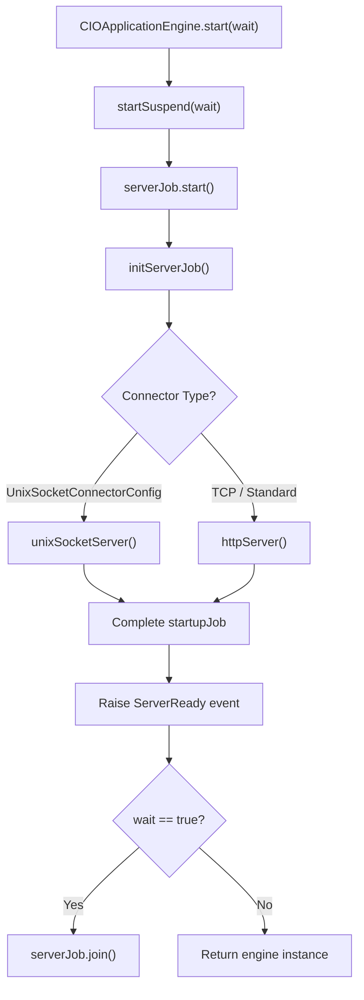
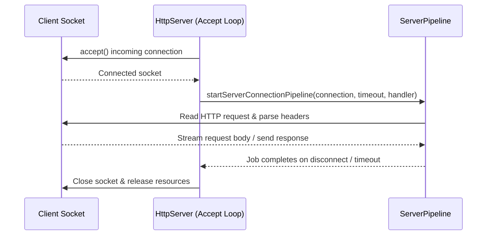
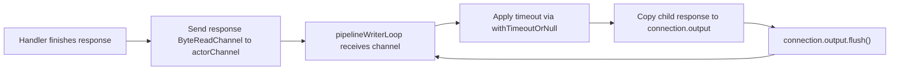
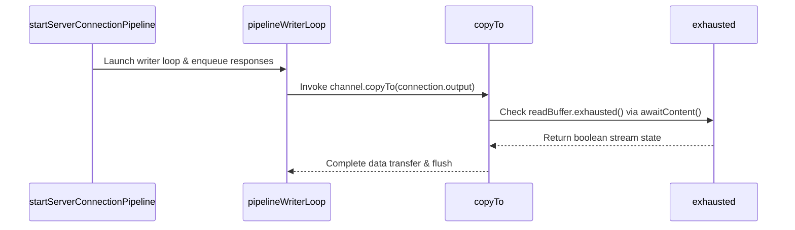

# CIO Server

<details>
<summary>Relevant source files</summary>

The following files were used as context for generating this wiki page:

- [ktor-server/ktor-server-cio/common/src/io/ktor/server/cio/backend/ServerPipeline.kt](https://github.com/ktorio/ktor/blob/main/ktor-server/ktor-server-cio/common/src/io/ktor/server/cio/backend/ServerPipeline.kt)
- [ktor-server/ktor-server-cio/common/src/io/ktor/server/cio/CIOApplicationEngine.kt](https://github.com/ktorio/ktor/blob/main/ktor-server/ktor-server-cio/common/src/io/ktor/server/cio/CIOApplicationEngine.kt)
- [ktor-server/ktor-server-cio/common/src/io/ktor/server/cio/backend/HttpServer.kt](https://github.com/ktorio/ktor/blob/main/ktor-server/ktor-server-cio/backend/HttpServer.kt)
- [ktor-client/ktor-client-cio/jvm/src/io/ktor/client/engine/cio/ConnectionPipeline.kt](https://github.com/ktorio/ktor/blob/main/ktor-client/ktor-client-cio/jvm/src/io/ktor/client/engine/cio/ConnectionPipeline.kt)
- [ktor-client/ktor-client-cio/common/src/io/ktor/client/engine/cio/Endpoint.kt](https://github.com/ktorio/ktor/blob/main/ktor-client/ktor-client-cio/common/src/io/ktor/client/engine/cio/Endpoint.kt)
- [ktor-server/ktor-server-netty/jvm/src/io/ktor/server/netty/cio/NettyHttpResponsePipeline.kt](https://github.com/ktorio/ktor/blob/main/ktor-server/ktor-server-netty/jvm/src/io/ktor/server/netty/cio/NettyHttpResponsePipeline.kt)
- [ktor-server/ktor-server-cio/common/src/io/ktor/server/cio/CIOApplicationResponse.kt](https://github.com/ktorio/ktor/blob/main/ktor-server/ktor-server-cio/common/src/io/ktor/server/cio/CIOApplicationResponse.kt)
- [ktor-client/ktor-client-cio/common/src/io/ktor/client/engine/cio/CIOEngine.kt](https://github.com/ktorio/ktor/blob/main/ktor-client/ktor-client-cio/common/src/io/ktor/client/engine/cio/CIOEngine.kt)
- [ktor-server/ktor-server-netty/jvm/src/io/ktor/server/netty/http1/NettyHttp1Handler.kt](https://github.com/ktorio/ktor/blob/main/ktor-server/ktor-server-netty/jvm/src/io/ktor/server/netty/http1/NettyHttp1Handler.kt)
- [ktor-server/ktor-server-test-suites/jvm/src/io/ktor/server/testing/suites/HttpServerJvmTestSuite.kt](https://github.com/ktorio/ktor/blob/main/ktor-server/ktor-server-test-suites/jvm/src/io/ktor/server/testing/suites/HttpServerJvmTestSuite.kt)
- [ktor-network/jvm/src/io/ktor/network/sockets/CIOReader.kt](https://github.com/ktorio/ktor/blob/main/ktor-network/jvm/src/io/ktor/network/sockets/CIOReader.kt)
- [ktor-server/ktor-server-netty/jvm/src/io/ktor/server/netty/cio/RequestBodyHandler.kt](https://github.com/ktorio/ktor/blob/main/ktor-server/ktor-server-netty/jvm/src/io/ktor/server/netty/cio/RequestBodyHandler.kt)
- [ktor-server/ktor-server-netty/jvm/src/io/ktor/server/netty/CIO.kt](https://github.com/ktorio/ktor/blob/main/ktor-server/ktor-server-netty/jvm/src/io/ktor/server/netty/CIO.kt)
- [ktor-server/ktor-server-netty/jvm/src/io/ktor/server/netty/NettyChannelInitializer.kt](https://github.com/ktorio/ktor/blob/main/ktor-server/ktor-server-netty/jvm/src/io/ktor/server/netty/NettyChannelInitializer.kt)
- [ktor-server/ktor-server-cio/common/src/io/ktor/server/cio/CIOApplicationRequest.kt](https://github.com/ktorio/ktor/blob/main/ktor-server/ktor-server-cio/common/src/io/ktor/server/cio/CIOApplicationRequest.kt)
- [ktor-network/posix/src/io/ktor/network/sockets/CIOReader.kt](https://github.com/ktorio/ktor/blob/main/ktor-network/posix/src/io/ktor/network/sockets/CIOReader.kt)
- [ktor-server/ktor-server-cio/common/src/io/ktor/server/cio/Pipeline.kt](https://github.com/ktorio/ktor/blob/main/ktor-server/ktor-server-cio/common/src/io/ktor/server/cio/Pipeline.kt)
- [ktor-server/ktor-server-cio/common/src/io/ktor/server/cio/CIOApplicationCall.kt](https://github.com/ktorio/ktor/blob/main/ktor-server/ktor-server-cio/common/src/io/ktor/server/cio/CIOApplicationCall.kt)
- [ktor-server/ktor-server-cio/common/src/io/ktor/server/cio/CIO.kt](https://github.com/ktorio/ktor/blob/main/ktor-server/ktor-server-cio/common/src/io/ktor/server/cio/CIO.kt)
- [ktor-client/ktor-client-cio/common/src/io/ktor/client/engine/cio/ConnectionPipelineCommon.kt](https://github.com/ktorio/ktor/blob/main/ktor-client/ktor-client-cio/common/src/io/ktor/client/engine/cio/ConnectionPipelineCommon.kt)
- [ktor-server/ktor-server-cio/common/src/io/ktor/server/cio/HttpServer.kt](https://github.com/ktorio/ktor/blob/main/ktor-server/ktor-server-cio/common/src/io/ktor/server/cio/HttpServer.kt)
- [ktor-server/ktor-server-cio/common/src/io/ktor/server/cio/EngineMain.kt](https://github.com/ktorio/ktor/blob/main/ktor-server/ktor-server-cio/EngineMain.kt)
- [ktor-http/ktor-http-cio/common/src/io/ktor/http/cio/HttpParser.kt](https://github.com/ktorio/ktor/blob/main/ktor-http/ktor-http-cio/common/src/io/ktor/http/cio/HttpParser.kt)
- [ktor-io/common/src/io/ktor/utils/io/ByteReadChannelOperations.kt](https://github.com/ktorio/ktor/blob/main/ktor-io/common/src/io/ktor/utils/io/ByteReadChannelOperations.kt)
- [ktor-io/common/src/io/ktor/utils/io/ByteWriteChannelOperations.kt](https://github.com/ktorio/ktor/blob/main/ktor-io/common/src/io/ktor/utils/io/ByteWriteChannelOperations.kt)
</details>

## Overview

### Overview Introduction
The CIO (Coroutine-based I/O) Server engine in Ktor is a lightweight, high-performance HTTP server implementation built directly on top of Ktor's asynchronous networking primitives (`ktor-network`) and kotlinx.coroutines. Unlike heavy servlet containers or feature-rich multi-threaded engines like Netty, the CIO server engine is designed from the ground up to leverage structured concurrency, non-blocking byte channels, and coroutine-native request processing pipelines. It solves the problem of serving HTTP traffic with minimal runtime overhead, making it ideal for microservices, resource-constrained environments, and multiplatform deployments where native coroutine scheduling outperforms traditional callback or thread-per-connection architectures.
Sources: [ktor-server/ktor-server-cio/common/src/io/ktor/server/cio/backend/ServerPipeline.kt#L28-L61](https://github.com/ktorio/ktor/blob/main/ktor-server/ktor-server-cio/common/src/io/ktor/server/cio/backend/ServerPipeline.kt#L28-L61)

At its architectural core, the CIO server abstracts incoming socket connections into structured server pipelines (`startServerConnectionPipeline`). It couples a dedicated background writer loop (`pipelineWriterLoop`) for serializing response order over keep-alive or pipelined connections with an unconfined/dispatcher-backed request parsing and handler execution loop. Key design decisions include enforcing strict HTTP/1.x parsing rules using `HttpParser`, supporting `Expect: 100-continue` header negotiation via explicit interception phases, and utilizing non-blocking `ByteReadChannel` and `ByteWriteChannel` streams for streaming request bodies and responses without thread blocking.
Sources: [ktor-server/ktor-server-cio/common/src/io/ktor/server/cio/backend/ServerPipeline.kt#L40-L61](https://github.com/ktorio/ktor/blob/main/ktor-server/ktor-server-cio/common/src/io/ktor/server/cio/backend/ServerPipeline.kt#L40-L61), [ktor-server/ktor-server-cio/common/src/io/ktor/server/cio/backend/ServerPipeline.kt#L220-L239](https://github.com/ktorio/ktor/blob/main/ktor-server/ktor-server-cio/common/src/io/ktor/server/cio/backend/ServerPipeline.kt#L220-L239)

The server interacts closely with Ktor's core application engine layers, implementing `BaseApplicationEngine` via `CIOApplicationEngine` and exposing configuration through `HttpServerSettings` and `UnixSocketServerSettings`. By bridging low-level socket selectors with high-level Ktor `ApplicationCall` pipelines, CIO Server provides a fully transparent, coroutine-native runtime environment capable of managing HTTP pipelining, chunked transfer encodings, protocol upgrades (such as WebSockets), and graceful connection shutdowns.
Sources: [ktor-server/ktor-server-cio/common/src/io/ktor/server/cio/CIOApplicationEngine.kt#L27-L55](https://github.com/ktorio/ktor/blob/main/ktor-server/ktor-server-cio/common/src/io/ktor/server/cio/CIOApplicationEngine.kt#L27-L55), [ktor-server/ktor-server-cio/common/src/io/ktor/server/cio/HttpServer.kt#L20-L54](https://github.com/ktorio/ktor/blob/main/ktor-server/ktor-server-cio/common/src/io/ktor/server/cio/HttpServer.kt#L20-L54)

## Engine Initialization and Lifecycle

### Lifecycle Overview
The `CIOApplicationEngine` class serves as the concrete implementation of Ktor's `BaseApplicationEngine` for the CIO backend. It manages the server's lifecycle, including asynchronous startup, graceful shutdown sequences, and connector binding (supporting both standard TCP network sockets and Unix domain sockets via `UnixSocketConnectorConfig`).
Sources: [ktor-server/ktor-server-cio/common/src/io/ktor/server/cio/CIOApplicationEngine.kt#L27-L33](https://github.com/ktorio/ktor/blob/main/ktor-server/ktor-server-cio/common/src/io/ktor/server/cio/CIOApplicationEngine.kt#L27-L33)

When `startSuspend(wait: Boolean)` is invoked, the internal server job (`serverJob`) is started, and execution suspends on `startupJob` until all configured connectors successfully bind their ports and accept sockets. If any connector throws an exception during startup (such as failing to bind a port or attempting to use unsupported HTTPS connectors), the engine cancels root server jobs, completes the stop request exceptionally, and propagates the failure.
Sources: [ktor-server/ktor-server-cio/common/src/io/ktor/server/cio/CIOApplicationEngine.kt#L76-L87](https://github.com/ktorio/ktor/blob/main/ktor-server/ktor-server-cio/common/src/io/ktor/server/cio/CIOApplicationEngine.kt#L76-L87), [ktor-server/ktor-server-cio/common/src/io/ktor/server/cio/CIOApplicationEngine.kt#L209-L262](https://github.com/ktorio/ktor/blob/main/ktor-server/ktor-server-cio/common/src/io/ktor/server/cio/CIOApplicationEngine.kt#L209-L262)


Sources: [ktor-server/ktor-server-cio/common/src/io/ktor/server/cio/CIOApplicationEngine.kt#L76-L89](https://github.com/ktorio/ktor/blob/main/ktor-server/ktor-server-cio/common/src/io/ktor/server/cio/CIOApplicationEngine.kt#L76-L89), [ktor-server/ktor-server-cio/common/src/io/ktor/server/cio/CIOApplicationEngine.kt#L113-L139](https://github.com/ktorio/ktor/blob/main/ktor-server/ktor-server-cio/common/src/io/ktor/server/cio/CIOApplicationEngine.kt#L113-L139)

The server shutdown sequence handles graceful draining of active connections. When `stopSuspend(gracePeriodMillis, timeoutMillis)` is called, a `stopRequest` job is completed, triggering cancellation of the accept loop (`acceptJob`) and dispatching an `ApplicationStopPreparing` event. The engine waits up to `gracePeriodMillis` for active server jobs to finish; if a timeout occurs, it forcefully cancels the `serverJob` and waits through the remaining timeout window.
Sources: [ktor-server/ktor-server-cio/common/src/io/ktor/server/cio/CIOApplicationEngine.kt#L91-L107](https://github.com/ktorio/ktor/blob/main/ktor-server/ktor-server-cio/common/src/io/ktor/server/cio/CIOApplicationEngine.kt#L91-L107), [ktor-server/ktor-server-cio/common/src/io/ktor/server/cio/CIOApplicationEngine.kt#L250-L261](https://github.com/ktorio/ktor/blob/main/ktor-server/ktor-server-cio/common/src/io/ktor/server/cio/CIOApplicationEngine.kt#L250-L261)

## Socket Acceptance and HTTP Server Backend

### Socket Acceptance Mechanics
The low-level socket server loop is implemented in `httpServer` within `HttpServer.kt`. It utilizes Ktor's `SelectorManager` and `aSocket(selector).tcp().bind(...)` builder to open a TCP server socket with configurable host, port, socket reuse address options (`reuseAddress`), and connection idle timeouts (`connectionIdleTimeoutSeconds`).
Sources: [ktor-server/ktor-server-cio/common/src/io/ktor/server/cio/backend/HttpServer.kt#L26-L49](https://github.com/ktorio/ktor/blob/main/ktor-server/ktor-server-cio/common/src/io/ktor/server/cio/backend/HttpServer.kt#L26-L49)


Sources: [ktor-server/ktor-server-cio/common/src/io/ktor/server/cio/backend/HttpServer.kt#L45-L99](https://github.com/ktorio/ktor/blob/main/ktor-server/ktor-server-cio/common/src/io/ktor/server/cio/backend/HttpServer.kt#L45-L99)

Inside the accept loop (`acceptJob`), the server continuously calls `server.accept()` within a `while (true)` loop. Every accepted client `Socket` is wrapped into a `ServerIncomingConnection` containing its input channel (`client.openReadChannel()`), output channel (`client.openWriteChannel()`), remote address, and local address.
Sources: [ktor-server/ktor-server-cio/common/src/io/ktor/server/cio/backend/HttpServer.kt#L63-L78](https://github.com/ktorio/ktor/blob/main/ktor-server/ktor-server-cio/common/src/io/ktor/server/cio/backend/HttpServer.kt#L63-L78)

> [!NOTE]
> If an individual client connection throws an `IOException` during accept, the server catches it, logs a trace message, and continues accepting subsequent connections rather than crashing the entire server socket.
Sources: [ktor-server/ktor-server-cio/common/src/io/ktor/server/cio/backend/HttpServer.kt#L64-L70](https://github.com/ktorio/ktor/blob/main/ktor-server/ktor-server-cio/common/src/io/ktor/server/cio/backend/HttpServer.kt#L64-L70)

For each accepted connection, `startServerConnectionPipeline` is launched on a connection scope. When the client connection job completes (whether normally or exceptionally), `client.close()` is automatically invoked to reclaim file descriptors and network buffers.
Sources: [ktor-server/ktor-server-cio/common/src/io/ktor/server/cio/backend/HttpServer.kt#L79-L87](https://github.com/ktorio/ktor/blob/main/ktor-server/ktor-server-cio/common/src/io/ktor/server/cio/backend/HttpServer.kt#L79-L87)

## Request Pipeline and Parsing Mechanism

### Pipeline and Parsing Details
The connection pipeline (`startServerConnectionPipeline`) is responsible for parsing HTTP requests from the client's input channel, validating headers, managing request bodies, and invoking the user-provided `HttpRequestRequestHandler` callback.
Sources: [ktor-server/ktor-server-cio/common/src/io/ktor/server/cio/backend/ServerPipeline.kt#L28-L47](https://github.com/ktorio/ktor/blob/main/ktor-server/ktor-server-cio/common/src/io/ktor/server/cio/backend/ServerPipeline.kt#L28-L47)

The execution and parsing loop proceeds as follows:
1. **Request Parsing:** `parseRequest(connection.input)` reads from the network input channel. If a `TooLongLineException` or general parse failure occurs, the server intercepts it and writes a `400 Bad Request` packet back via `respondBadRequest`.
2. **Channel Allocation:** A per-request `ByteChannel` (`response`) is created and sent to an `actorChannel` (capacity = 3), which coordinates response writing order.
3. **Header Inspection & Validation:** Connection options, content length, transfer encodings, and HTTP protocol version (`HttpProtocolVersion.parse(request.version)`) are evaluated. If duplicate `Content-Length` headers are detected, a `ParserException` is thrown, aborting the connection with a bad request response.
4. **Body / Upgrade Setup:** If the request expects a body or an HTTP upgrade (such as WebSockets), a new `ByteChannel` is created for `requestBody`. Otherwise, `ByteReadChannel.Empty` is used.
5. **Handler Invocation:** A coroutine is launched using `RequestHandlerCoroutine + Dispatchers.Unconfined` to execute the user handler with a `ServerRequestScope`.
6. **Pipelining & Keep-Alive Check:** After processing, `isLastHttpRequest(version, connectionOptions)` determines whether the connection should be terminated or kept alive for subsequent pipelined requests.
Sources: [ktor-server/ktor-server-cio/common/src/io/ktor/server/cio/backend/ServerPipeline.kt#L67-L187](https://github.com/ktorio/ktor/blob/main/ktor-server/ktor-server-cio/common/src/io/ktor/server/cio/backend/ServerPipeline.kt#L67-L187)

```kotlin
// Example usage: Starting a custom CIO server programmatically
val server = httpServer(HttpServerSettings(host = "127.0.0.1", port = 8080)) { request ->
    // Handle incoming HTTP request
    output.writeStringUtf8("HTTP/1.1 200 OK\r\nConnection: close\r\nContent-Length: 2\r\n\r\nOK")
    output.flush()
}
```
Sources: [ktor-server/ktor-server-cio/common/src/io/ktor/server/cio/backend/HttpServer.kt#L26-L29](https://github.com/ktorio/ktor/blob/main/ktor-server/ktor-server-cio/backend/HttpServer.kt#L26-L29), [ktor-server/ktor-server-cio/common/src/io/ktor/server/cio/backend/HttpServer.kt#L134-L137](https://github.com/ktorio/ktor/blob/main/ktor-server/ktor-server-cio/backend/HttpServer.kt#L134-L137)

## Response Pipeline and Writing Loop

### Writing Loop Mechanics
Response serialization and ordering across keep-alive and pipelined connections are managed by `pipelineWriterLoop`. Because HTTP/1.x requires responses to be returned in the exact order requests were received, the pipeline uses a buffered `Channel<ByteReadChannel>` (`actorChannel`) to queue response channels.
Sources: [ktor-server/ktor-server-cio/common/src/io/ktor/server/cio/backend/ServerPipeline.kt#L48-L61](https://github.com/ktorio/ktor/blob/main/ktor-server/ktor-server-cio/common/src/io/ktor/server/cio/backend/ServerPipeline.kt#L48-L61), [ktor-server/ktor-server-cio/common/src/io/ktor/server/cio/backend/ServerPipeline.kt#L220-L239](https://github.com/ktorio/ktor/blob/main/ktor-server/ktor-server-cio/common/src/io/ktor/server/cio/backend/ServerPipeline.kt#L220-L239)


Sources: [ktor-server/ktor-server-cio/common/src/io/ktor/server/cio/backend/ServerPipeline.kt#L96-L101](https://github.com/ktorio/ktor/blob/main/ktor-server/ktor-server-cio/common/src/io/ktor/server/cio/backend/ServerPipeline.kt#L96-L101), [ktor-server/ktor-server-cio/common/src/io/ktor/server/cio/backend/ServerPipeline.kt#L226-L238](https://github.com/ktorio/ktor/blob/main/ktor-server/ktor-server-cio/common/src/io/ktor/server/cio/backend/ServerPipeline.kt#L226-L238)

The writer loop executes the following steps:
1. Receives the next response `ByteReadChannel` from `actorChannel`, respecting the configured idle `timeout`.
2. Copies bytes from the child response channel to `connection.output` using `child.copyTo(connection.output)`.
3. Flushes the underlying socket output: `connection.output.flush()`.
4. If an error occurs during writing, the child channel is closed with the exception.
Sources: [ktor-server/ktor-server-cio/common/src/io/ktor/server/cio/backend/ServerPipeline.kt#L226-L239](https://github.com/ktorio/ktor/blob/main/ktor-server/ktor-server-cio/common/src/io/ktor/server/cio/backend/ServerPipeline.kt#L226-L239)

> [!WARNING]
> If a connection remains idle for longer than `timeout` while waiting for the next request or response chunk, `withTimeoutOrNull` times out, breaking the writer loop and closing the connection.
Sources: [ktor-server/ktor-server-cio/common/src/io/ktor/server/cio/backend/ServerPipeline.kt#L227-L229](https://github.com/ktorio/ktor/blob/main/ktor-server/ktor-server-cio/backend/ServerPipeline.kt#L227-L229)

### Call-Chain Execution Walkthrough: StartServerConnectionPipeline to Exhausted
To trace the stream handling behavior and how data is drained through the server pipeline, the execution follows a defined traversal:
1. `startServerConnectionPipeline` initiates the request processing and sets up the writer and handler coroutines.
Sources: [ktor-server/ktor-server-cio/common/src/io/ktor/server/cio/backend/ServerPipeline.kt#L43-L61](https://github.com/ktorio/ktor/blob/main/ktor-server/ktor-server-cio/backend/ServerPipeline.kt#L43-L61)
2. `pipelineWriterLoop` takes completed response channels from the `actorChannel` queue.
Sources: [ktor-server/ktor-server-cio/common/src/io/ktor/server/cio/backend/ServerPipeline.kt#L220-L229](https://github.com/ktorio/ktor/blob/main/ktor-server/ktor-server-cio/common/src/io/ktor/server/cio/backend/ServerPipeline.kt#L220-L229)
3. `copyTo` moves bytes from the read buffer into the socket write channel buffer.
Sources: [ktor-io/common/src/io/ktor/utils/io/ByteReadChannelOperations.kt#L173-L190](https://github.com/ktorio/ktor/blob/main/ktor-io/common/src/io/ktor/utils/io/ByteReadChannelOperations.kt#L173-L190)
4. `exhausted` checks whether the underlying read buffer has fully finished consuming available bytes.
Sources: [ktor-io/common/src/io/ktor/utils/io/ByteReadChannelOperations.kt#L33-L36](https://github.com/ktorio/ktor/blob/main/ktor-io/common/src/io/ktor/utils/io/ByteReadChannelOperations.kt#L33-L36)


Sources: [ktor-server/ktor-server-cio/common/src/io/ktor/server/cio/backend/ServerPipeline.kt#L43-L61](https://github.com/ktorio/ktor/blob/main/ktor-server/ktor-server-cio/common/src/io/ktor/server/cio/backend/ServerPipeline.kt#L43-L61), [ktor-server/ktor-server-cio/common/src/io/ktor/server/cio/backend/ServerPipeline.kt#L220-L239](https://github.com/ktorio/ktor/blob/main/ktor-server/ktor-server-cio/common/src/io/ktor/server/cio/backend/ServerPipeline.kt#L220-L239), [ktor-io/common/src/io/ktor/utils/io/ByteReadChannelOperations.kt#L33-L36](https://github.com/ktorio/ktor/blob/main/ktor-io/common/src/io/ktor/utils/io/ByteReadChannelOperations.kt#L33-L36), [ktor-io/common/src/io/ktor/utils/io/ByteReadChannelOperations.kt#L173-L190](https://github.com/ktorio/ktor/blob/main/ktor-io/common/src/io/ktor/utils/io/ByteReadChannelOperations.kt#L173-L190)

## Request and Response Data Structures

### Data Structures Overview
CIO Server implements Ktor's engine contract using `CIOApplicationCall`, `CIOApplicationRequest`, and `CIOApplicationResponse`.
Sources: [ktor-server/ktor-server-cio/common/src/io/ktor/server/cio/CIOApplicationCall.kt#L15-L26](https://github.com/ktorio/ktor/blob/main/ktor-server/ktor-server-cio/CIOApplicationCall.kt#L15-L26), [ktor-server/ktor-server-cio/common/src/io/ktor/server/cio/CIOApplicationRequest.kt#L15-L21](https://github.com/ktorio/ktor/blob/main/ktor-server/ktor-server-cio/CIOApplicationRequest.kt#L15-L21), [ktor-server/ktor-server-cio/common/src/io/ktor/server/cio/CIOApplicationResponse.kt#L16-L23](https://github.com/ktorio/ktor/blob/main/ktor-server/ktor-server-cio/CIOApplicationResponse.kt#L16-L23)

- **`CIOApplicationCall`**: Combines an `Application`, `CIOApplicationRequest`, `CIOApplicationResponse`, and execution contexts. It registers response attributes during initialization.
- **`CIOApplicationRequest`**: Implements `BaseApplicationRequest`, exposing `engineReceiveChannel`, `engineHeaders`, lazily parsed `queryParameters` (decoded and adjusted for valueless keys), and `local` connection points (`CIOConnectionPoint`).
- **`CIOApplicationResponse`**: Implements `BaseApplicationResponse`, handling status codes, headers builder, chunked transfer encoding (`preparedBodyChannel`), protocol upgrades (`respondUpgrade`), and direct byte response writing (`respondFromBytes`).
Sources: [ktor-server/ktor-server-cio/common/src/io/ktor/server/cio/CIOApplicationCall.kt#L15-L44](https://github.com/ktorio/ktor/blob/main/ktor-server/ktor-server-cio/CIOApplicationCall.kt#L15-L44), [ktor-server/ktor-server-cio/common/src/io/ktor/server/cio/CIOApplicationRequest.kt#L15-L46](https://github.com/ktorio/ktor/blob/main/ktor-server/ktor-server-cio/CIOApplicationRequest.kt#L15-L46), [ktor-server/ktor-server-cio/common/src/io/ktor/server/cio/CIOApplicationResponse.kt#L16-L69](https://github.com/ktorio/ktor/blob/main/ktor-server/ktor-server-cio/CIOApplicationResponse.kt#L16-L69)

| Class / Component | Extends / Implements | Primary Responsibility |
| :--- | :--- | :--- |
| `CIOApplicationEngine` | `BaseApplicationEngine` | Engine lifecycle, connector binding, and startup/stop orchestration. |
| `CIOApplicationCall` | `BaseApplicationCall` | Encapsulates a single request-response exchange cycle. |
| `CIOApplicationRequest` | `BaseApplicationRequest` | Exposes request headers, input channel, query parameters, and connection info. |
| `CIOApplicationResponse` | `BaseApplicationResponse` | Manages response status, headers, chunked transfer encoding, and body transmission. |
| `CIOConnectionPoint` | `RequestConnectionPoint` | Computes local/remote socket addresses, host headers, ports, and URIs. |
Sources: [ktor-server/ktor-server-cio/common/src/io/ktor/server/cio/CIOApplicationEngine.kt#L27-L33](https://github.com/ktorio/ktor/blob/main/ktor-server/ktor-server-cio/CIOApplicationEngine.kt#L27-L33), [ktor-server/ktor-server-cio/common/src/io/ktor/server/cio/CIOApplicationCall.kt#L15-L26](https://github.com/ktorio/ktor/blob/main/ktor-server/ktor-server-cio/CIOApplicationCall.kt#L15-L26), [ktor-server/ktor-server-cio/common/src/io/ktor/server/cio/CIOApplicationRequest.kt#L15-L46](https://github.com/ktorio/ktor/blob/main/ktor-server/ktor-server-cio/CIOApplicationRequest.kt#L15-L46), [ktor-server/ktor-server-cio/common/src/io/ktor/server/cio/CIOApplicationResponse.kt#L16-L23](https://github.com/ktorio/ktor/blob/main/ktor-server/ktor-server-cio/CIOApplicationResponse.kt#L16-L23)

## Configuration and Options

### Configuration Options
CIO Server settings can be configured programmatically through `CIOApplicationEngine.Configuration` or loaded automatically via configuration files (such as `application.conf`) using `EngineMain`.
Sources: [ktor-server/ktor-server-cio/common/src/io/ktor/server/cio/CIOApplicationEngine.kt#L40-L55](https://github.com/ktorio/ktor/blob/main/ktor-server/ktor-server-cio/CIOApplicationEngine.kt#L40-L55), [ktor-server/ktor-server-cio/common/src/io/ktor/server/cio/EngineMain.kt#L46-L53](https://github.com/ktorio/ktor/blob/main/ktor-server/ktor-server-cio/EngineMain.kt#L46-L53)

| Configuration Property | Type | Default Value | Description |
| :--- | :--- | :--- | :--- |
| `connectionIdleTimeoutSeconds` | `Int` | `45` | Number of seconds the server keeps idle HTTP connections open before timing out. |
| `reuseAddress` | `Boolean` | `false` | Allows the server socket to bind to an address/port that is already in use. |
| `host` | `String` | `"0.0.0.0"` | The network interface host address for the server to listen on. |
| `port` | `Int` | `8080` | The TCP port number for the server connector. |
Sources: [ktor-server/ktor-server-cio/common/src/io/ktor/server/cio/CIOApplicationEngine.kt#L47-L54](https://github.com/ktorio/ktor/blob/main/ktor-server/ktor-server-cio/CIOApplicationEngine.kt#L47-L54), [ktor-server/ktor-server-cio/common/src/io/ktor/server/cio/HttpServer.kt#L36-L41](https://github.com/ktorio/ktor/blob/main/ktor-server/ktor-server-cio/HttpServer.kt#L36-L41), [ktor-server/ktor-server-cio/common/src/io/ktor/server/cio/EngineMain.kt#L49-L51](https://github.com/ktorio/ktor/blob/main/ktor-server/ktor-server-cio/EngineMain.kt#L49-L51)

## Error Handling and Expect-Continue Flow

### Error Handling & Expect-Continue Details
CIO Server implements robust error handling for malformed HTTP syntax, parsing limits, and `Expect: 100-continue` header negotiation.
Sources: [ktor-server/ktor-server-cio/common/src/io/ktor/server/cio/backend/ServerPipeline.kt#L68-L82](https://github.com/ktorio/ktor/blob/main/ktor-server/ktor-server-cio/backend/ServerPipeline.kt#L68-L82), [ktor-server/ktor-server-cio/common/src/io/ktor/server/cio/CIOApplicationEngine.kt#L141-L166](https://github.com/ktorio/ktor/blob/main/ktor-server/ktor-server-cio/CIOApplicationEngine.kt#L141-L166)

When parsing requests, if a client sends an `Expect: 100-continue` header along with a request body, `addHandlerForExpectedHeader` intercepts the receive pipeline:
1. It validates whether the HTTP version is greater than HTTP/1.0 and whether the request actually contains a body (`hasBody`).
2. If the expect header value equals `100-continue`, it immediately writes and flushes `HTTP/1.1 100 Continue\r\n\r\n` to the client output channel.
3. If the expect header is invalid or unrecognized, it responds with `HttpStatusCode.ExpectationFailed`.
Sources: [ktor-server/ktor-server-cio/common/src/io/ktor/server/cio/CIOApplicationEngine.kt#L141-L166](https://github.com/ktorio/ktor/blob/main/ktor-server/ktor-server-cio/CIOApplicationEngine.kt#L141-L166)

For parsing errors (e.g., `TooLongLineException`), the server catches the exception, generates a standard `400 Bad Request` HTTP packet containing the error message or default bad request bytes (`BadRequestPacketBytes`), sends it through the actor response channel, and terminates the pipeline.
Sources: [ktor-server/ktor-server-cio/common/src/io/ktor/server/cio/backend/ServerPipeline.kt#L68-L82](https://github.com/ktorio/ktor/blob/main/ktor-server/ktor-server-cio/backend/ServerPipeline.kt#L68-L82), [ktor-server/ktor-server-cio/common/src/io/ktor/server/cio/backend/ServerPipeline.kt#L248-L255](https://github.com/ktorio/ktor/blob/main/ktor-server/ktor-server-cio/backend/ServerPipeline.kt#L248-L255)

```kotlin
// Example: Configured CIO embedded server startup via EngineMain
object Application {
    @JvmStatic
    fun main(args: Array<String>) {
        EngineMain.main(args)
    }
}
```
Sources: [ktor-server/ktor-server-cio/common/src/io/ktor/server/cio/EngineMain.kt#L22-L26](https://github.com/ktorio/ktor/blob/main/ktor-server/ktor-server-cio/EngineMain.kt#L22-L26)

## Related

- [[Application Engine]]
- [[Byte Channels]]
- [[Sockets and Selectors]]

