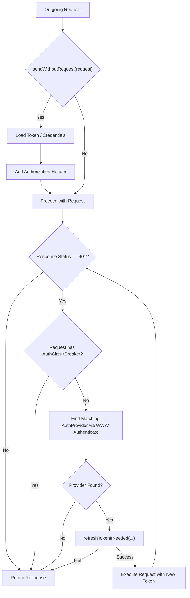
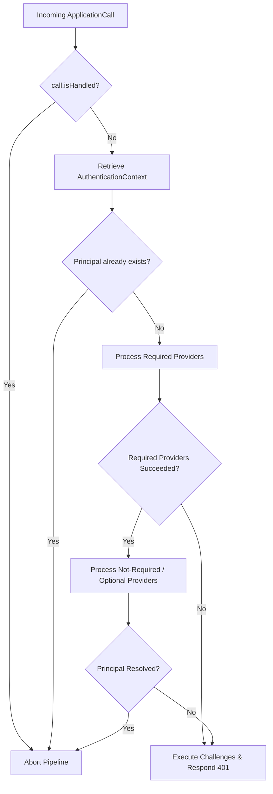

# Client Authentication

<details>
<summary>Relevant source files</summary>

The following files were used as context for generating this wiki page:

- [ktor-server/ktor-server-plugins/ktor-server-auth/jvm/src/io/ktor/server/auth/DigestAuth.kt](https://github.com/ktorio/ktor/blob/main/ktor-server/ktor-server-plugins/ktor-server-auth/jvm/src/io/ktor/server/auth/DigestAuth.kt)
- [ktor-client/ktor-client-plugins/ktor-client-auth/common/src/io/ktor/client/plugins/auth/providers/BearerAuthProvider.kt](https://github.com/ktorio/ktor/blob/main/ktor-client/ktor-client-plugins/ktor-client-auth/common/src/io/ktor/client/plugins/auth/providers/BearerAuthProvider.kt)
- [ktor-client/ktor-client-plugins/ktor-client-auth/common/src/io/ktor/client/plugins/auth/Auth.kt](https://github.com/ktorio/ktor/blob/main/ktor-client/ktor-client-plugins/ktor-client-auth/common/src/io/ktor/client/plugins/auth/Auth.kt)
- [ktor-client/ktor-client-plugins/ktor-client-auth/common/src/io/ktor/client/plugins/auth/providers/DigestAuthProvider.kt](https://github.com/ktorio/ktor/blob/main/ktor-client/ktor-client-plugins/ktor-client-auth/common/src/io/ktor/client/plugins/auth/providers/DigestAuthProvider.kt)
- [ktor-client/ktor-client-plugins/ktor-client-auth/common/src/io/ktor/client/plugins/auth/providers/BasicAuthProvider.kt](https://github.com/ktorio/ktor/blob/main/ktor-client/ktor-client-plugins/ktor-client-auth/common/src/io/ktor/client/plugins/auth/providers/BasicAuthProvider.kt)
- [ktor-server/ktor-server-plugins/ktor-server-auth/common/src/io/ktor/server/auth/OAuthProcedure.kt](https://github.com/ktorio/ktor/blob/main/ktor-server/ktor-server-plugins/ktor-server-auth/common/src/io/ktor/server/auth/OAuthProcedure.kt)
- [ktor-server/ktor-server-plugins/ktor-server-auth/common/src/io/ktor/server/auth/BasicAuth.kt](https://github.com/ktorio/ktor/blob/main/ktor-server/ktor-server-plugins/ktor-server-auth/common/src/io/ktor/server/auth/BasicAuth.kt)
- [ktor-server/ktor-server-plugins/ktor-server-auth/common/src/io/ktor/server/auth/BearerAuth.kt](https://github.com/ktorio/ktor/blob/main/ktor-server/ktor-server-plugins/ktor-server-auth/common/src/io/ktor/server/auth/BearerAuth.kt)
- [ktor-server/ktor-server-plugins/ktor-server-auth/common/src/io/ktor/server/auth/AuthenticationInterceptors.kt](https://github.com/ktorio/ktor/blob/main/ktor-server/ktor-server-plugins/ktor-server-auth/common/src/io/ktor/server/auth/AuthenticationInterceptors.kt)
- [ktor-server/ktor-server-plugins/ktor-server-auth-jwt/jvm/src/io/ktor/server/auth/jwt/JWTAuth.kt](https://github.com/ktorio/ktor/blob/main/ktor-server/ktor-server-plugins/ktor-server-auth-jwt/jvm/src/io/ktor/server/auth/jwt/JWTAuth.kt)
- [ktor-server/ktor-server-plugins/ktor-server-auth/common/src/io/ktor/server/auth/SessionAuth.kt](https://github.com/ktorio/ktor/blob/main/ktor-server/ktor-server-plugins/ktor-server-auth/common/src/io/ktor/server/auth/SessionAuth.kt)
- [ktor-server/ktor-server-plugins/ktor-server-auth/common/src/io/ktor/server/auth/OAuth2.kt](https://github.com/ktorio/ktor/blob/main/ktor-server/ktor-server-plugins/ktor-server-auth/common/src/io/ktor/server/auth/OAuth2.kt)
- [ktor-server/ktor-server-plugins/ktor-server-auth/jvm/src/io/ktor/server/auth/OAuth1a.kt](https://github.com/ktorio/ktor/blob/main/ktor-server/ktor-server-plugins/ktor-server-auth/jvm/src/io/ktor/server/auth/OAuth1a.kt)
- [ktor-server/ktor-server-plugins/ktor-server-auth-api-key/common/src/io/ktor/server/auth/apikey/ApiKeyAuth.kt](https://github.com/ktorio/ktor/blob/main/ktor-server/ktor-server-plugins/ktor-server-auth-api-key/common/src/io/ktor/server/auth/apikey/ApiKeyAuth.kt)
- [ktor-client/ktor-client-plugins/ktor-client-auth/common/src/io/ktor/client/plugins/auth/AuthProvider.kt](https://github.com/ktorio/ktor/blob/main/ktor-client/ktor-client-plugins/ktor-client-auth/common/src/io/ktor/client/plugins/auth/AuthProvider.kt)
- [ktor-server/ktor-server-plugins/ktor-server-auth/common/src/io/ktor/server/auth/SimpleAuth.kt](https://github.com/ktorio/ktor/blob/main/ktor-server/ktor-server-plugins/ktor-server-auth/common/src/io/ktor/server/auth/SimpleAuth.kt)
</details>

## Overview

### Overview Details
Client authentication within the Ktor ecosystem bridges remote HTTP clients and protected server applications, governing how credentials are generated, attached, challenged, and validated across the network pipe. The subsystem is partitioned into two symmetrical architectural extensions: the Ktor Client `Auth` plugin (`io.ktor.client.plugins.auth.Auth`) which intercepts outgoing HTTP request pipelines to inject credentials and automatically recover from unauthorized responses, and the corresponding Ktor Server authentication infrastructure (`io.ktor.server.auth`) which parses incoming headers, enforces access strategies via route interceptors, and dispatches validation challenges.

Sources: [ktor-client/ktor-client-plugins/ktor-client-auth/common/src/io/ktor/client/plugins/auth/Auth.kt:74-85](https://github.com/ktorio/ktor/blob/main/ktor-client/ktor-client-plugins/ktor-client-auth/common/src/io/ktor/client/plugins/auth/Auth.kt#L74-L85)

By abstracting protocol specifics behind clean extension interfaces such as `AuthProvider`, Ktor decouples core transport pipelines from credential lifecycle management. This design allows client applications to manage stateful tokens (such as Bearer tokens, HTTP Basic credentials, or cryptographic nonces in Digest auth) while enabling servers to enforce granular strategies like `AuthenticationStrategy.Required`, `FirstSuccessful`, or `Optional` across modular routing trees.

Sources: [ktor-client/ktor-client-plugins/ktor-client-auth/common/src/io/ktor/client/plugins/auth/AuthProvider.kt:18-59](https://github.com/ktorio/ktor/blob/main/ktor-client/ktor-client-plugins/ktor-client-auth/common/src/io/ktor/client/plugins/auth/AuthProvider.kt#L18-L59)

The subsystem resolves complexities such as multi-provider challenge matching, race conditions during asynchronous token refreshing, and strict standards compliance (such as RFC 7616 Digest security and JWT verification) through deterministic state machines and thread-safe holders. Understanding its architecture requires analyzing the interplay between pipeline hooks, authentication providers, and error-handling routines.

Sources: [ktor-server/ktor-server-plugins/ktor-server-auth/common/src/io/ktor/server/auth/AuthenticationInterceptors.kt:54-62](https://github.com/ktorio/ktor/blob/main/ktor-server/ktor-server-plugins/ktor-server-auth/common/src/io/ktor/server/auth/AuthenticationInterceptors.kt#L54-L62)

---

## Client Auth Plugin Architecture and Control Flow

### Architecture Execution Flow
The `Auth` client plugin coordinates authentication behavior across requests by hooking into the HTTP request-response pipeline. When configured via `HttpClientConfig.Auth`, the plugin evaluates whether credentials should be dispatched preemptively or negotiated reactively upon encountering an unauthorized response (`HttpStatusCode.Unauthorized`).

Sources: [ktor-client/ktor-client-plugins/ktor-client-auth/common/src/io/ktor/client/plugins/auth/Auth.kt:85-95](https://github.com/ktorio/ktor/blob/main/ktor-client/ktor-client-plugins/ktor-client-auth/common/src/io/ktor/client/plugins/auth/Auth.kt#L85-L95)



Sources: [ktor-client/ktor-client-plugins/ktor-client-auth/common/src/io/ktor/client/plugins/auth/Auth.kt:159-195](https://github.com/ktorio/ktor/blob/main/ktor-client/ktor-client-plugins/ktor-client-auth/common/src/io/ktor/client/plugins/auth/Auth.kt#L159-L195)

The control flow follows a deterministic loop when a challenge occurs. If an outgoing request results in a `401 Unauthorized` response, the plugin extracts `WWW-Authenticate` headers from the response and iterates through candidate providers using `findProvider(call, candidateProviders)`. To prevent infinite retry loops when credential renewal fails, requests involved in refreshing tokens or subsequent retries are stamped with an `AuthCircuitBreaker` attribute (`AttributeKey<Unit>("auth-request")`).

Sources: [ktor-client/ktor-client-plugins/ktor-client-auth/common/src/io/ktor/client/plugins/auth/Auth.kt:67-72](https://github.com/ktorio/ktor/blob/main/ktor-client/ktor-client-plugins/ktor-client-auth/common/src/io/ktor/client/plugins/auth/Auth.kt#L67-L72), [ktor-client/ktor-client-plugins/ktor-client-auth/common/src/io/ktor/client/plugins/auth/Auth.kt:170-194](https://github.com/ktorio/ktor/blob/main/ktor-client/ktor-client-plugins/ktor-client-auth/common/src/io/ktor/client/plugins/auth/Auth.kt#L170-L194)

---

## Client Authentication Providers

### Provider Implementations
Ktor client authentication supports multiple concrete implementations of the `AuthProvider` interface. Each provider manages its own lifecycle, credential loading strategy, and header formatting rules.

Sources: [ktor-client/ktor-client-plugins/ktor-client-auth/common/src/io/ktor/client/plugins/auth/AuthProvider.kt:18-59](https://github.com/ktorio/ktor/blob/main/ktor-client/ktor-client-plugins/ktor-client-auth/common/src/io/ktor/client/plugins/auth/AuthProvider.kt#L18-L59)

The `BearerAuthProvider` manages bearer tokens (such as OAuth access tokens). It integrates with `AuthTokenHolder` to cache or reload tokens dynamically. When `cacheTokens` is enabled, loaded tokens are stored in memory. The `refreshTokens` callback is synchronized: if multiple concurrent requests encounter a 401 error using the same expired token, only a single refresh callback executes, and subsequent requests reuse the newly acquired token.

Sources: [ktor-client/ktor-client-plugins/ktor-client-auth/common/src/io/ktor/client/plugins/auth/providers/BearerAuthProvider.kt:170-202](https://github.com/ktorio/ktor/blob/main/ktor-client/ktor-client-plugins/ktor-client-auth/common/src/io/ktor/client/plugins/auth/providers/BearerAuthProvider.kt#L170-L202)

```kotlin
client.config {
    Auth {
        bearer {
            loadTokens {
                BearerTokens(accessToken = "my-access-token", refreshToken = "my-refresh-token")
            }
            refreshTokens {
                val response = client.post("https://auth.example.com/refresh") {
                    setBody(refreshToken)
                }
                BearerTokens(accessToken = "new-access-token", refreshToken = "new-refresh-token")
            }
            sendWithoutRequest { request ->
                request.url.host == "api.example.com"
            }
        }
    }
}
```

Sources: [ktor-client/ktor-client-plugins/ktor-client-auth/common/src/io/ktor/client/plugins/auth/providers/BearerAuthProvider.kt:20-33](https://github.com/ktorio/ktor/blob/main/ktor-client/ktor-client-plugins/ktor-client-auth/common/src/io/ktor/client/plugins/auth/providers/BearerAuthProvider.kt#L20-L33)

The `BasicAuthProvider` encodes username and password credentials into Base64 format adhering to RFC 7617, prefixed with the `Basic` scheme. The `DigestAuthProvider` implements RFC 7616 challenge-response authentication, calculating cryptographic response hashes using `MessageDigest` across nonces, client nonces (`cnonce`), request counts (`nc`), and URIs.

Sources: [ktor-client/ktor-client-plugins/ktor-client-auth/common/src/io/ktor/client/plugins/auth/providers/BasicAuthProvider.kt:127-182](https://github.com/ktorio/ktor/blob/main/ktor-client/ktor-client-plugins/ktor-client-auth/common/src/io/ktor/client/plugins/auth/providers/BasicAuthProvider.kt#L127-L182), [ktor-client/ktor-client-plugins/ktor-client-auth/common/src/io/ktor/client/plugins/auth/providers/DigestAuthProvider.kt:96-130](https://github.com/ktorio/ktor/blob/main/ktor-client/ktor-client-plugins/ktor-client-auth/common/src/io/ktor/client/plugins/auth/providers/DigestAuthProvider.kt#L96-L130)

> [!NOTE]
> `DigestAuthProvider` on the client does not send credentials preemptively (`sendWithoutRequest` always returns `false`), because it requires server-generated nonces provided via a `WWW-Authenticate` challenge header.

Sources: [ktor-client/ktor-client-plugins/ktor-client-auth/common/src/io/ktor/client/plugins/auth/providers/DigestAuthProvider.kt:129-130](https://github.com/ktorio/ktor/blob/main/ktor-client/ktor-client-plugins/ktor-client-auth/common/src/io/ktor/client/plugins/auth/providers/DigestAuthProvider.kt#L129-L130)

---

## Server Authentication Pipeline Integration

### Pipeline Execution Mechanics
On the server side, authentication is executed via the `AuthenticationInterceptors` route-scoped plugin, which listens on the `AuthenticatePhase` pipeline phase. Routing nodes configured via the `authenticate` DSL builder register an `AuthenticationRouteSelector` and bind their parent authentication configurations.

Sources: [ktor-server/ktor-server-plugins/ktor-server-auth/common/src/io/ktor/server/auth/AuthenticationInterceptors.kt:21-31](https://github.com/ktorio/ktor/blob/main/ktor-server/ktor-server-plugins/ktor-server-auth/common/src/io/ktor/server/auth/AuthenticationInterceptors.kt#L21-L31), [ktor-server/ktor-server-plugins/ktor-server-auth/common/src/io/ktor/server/auth/AuthenticationInterceptors.kt:304-319](https://github.com/ktorio/ktor/blob/main/ktor-server/ktor-server-plugins/ktor-server-auth/common/src/io/ktor/server/auth/AuthenticationInterceptors.kt#L304-L319)



Sources: [ktor-server/ktor-server-plugins/ktor-server-auth/common/src/io/ktor/server/auth/AuthenticationInterceptors.kt:101-157](https://github.com/ktorio/ktor/blob/main/ktor-server/ktor-server-plugins/ktor-server-auth/common/src/io/ktor/server/auth/AuthenticationInterceptors.kt#L101-L157)

The execution order evaluates providers grouped into specific collections based on their strategy: required providers are evaluated first, short-circuiting on failure; not-required providers are evaluated sequentially until the first success; and optional evaluation permits calls with `null` principals when conditions allow.

Sources: [ktor-server/ktor-server-plugins/ktor-server-auth/common/src/io/ktor/server/auth/AuthenticationInterceptors.kt:66-75](https://github.com/ktorio/ktor/blob/main/ktor-server/ktor-server-plugins/ktor-server-auth/common/src/io/ktor/server/auth/AuthenticationInterceptors.kt#L66-L75), [ktor-server/ktor-server-plugins/ktor-server-auth/common/src/io/ktor/server/auth/AuthenticationInterceptors.kt:108-154](https://github.com/ktorio/ktor/blob/main/ktor-server/ktor-server-plugins/ktor-server-auth/common/src/io/ktor/server/auth/AuthenticationInterceptors.kt#L108-L154)

---

## Server Authentication Providers and Strategies

### Provider Definitions
Server-side authentication providers validate incoming requests and yield principal objects. Ktor provides several built-in server providers configured through specific extension functions.

Sources: [ktor-server/ktor-server-plugins/ktor-server-auth/common/src/io/ktor/server/auth/BasicAuth.kt:112-118](https://github.com/ktorio/ktor/blob/main/ktor-server/ktor-server-plugins/ktor-server-auth/common/src/io/ktor/server/auth/BasicAuth.kt#L112-L118), [ktor-server/ktor-server-plugins/ktor-server-auth/common/src/io/ktor/server/auth/BearerAuth.kt:120-126](https://github.com/ktorio/ktor/blob/main/ktor-server/ktor-server-plugins/ktor-server-auth/common/src/io/ktor/server/auth/BearerAuth.kt#L120-L126)

| Provider Name | Credential Source | Validation Mechanism | Default Challenge |
| :--- | :--- | :--- | :--- |
| **Basic** (`basic`) | `Authorization: Basic` header | `UserPasswordCredential` validator block | `UnauthorizedResponse` with `Basic` challenge |
| **Bearer** (`bearer`) | `Authorization: Bearer` header (or custom scheme) | `BearerTokenCredential` validator block | `UnauthorizedResponse` with `Bearer` challenge |
| **Digest** (`digest`) | `Authorization: Digest` header | `DigestCredential` cryptographic verification | `UnauthorizedResponse` with algorithm nonces |
| **JWT** (`jwt`) | `Authorization: Bearer` header | Signature verification via `JWTVerifier` & payload checks | Configurable `JWTAuthChallengeFunction` |

Sources: [ktor-server/ktor-server-plugins/ktor-server-auth/common/src/io/ktor/server/auth/BasicAuth.kt:32-49](https://github.com/ktorio/ktor/blob/main/ktor-server/ktor-server-plugins/ktor-server-auth/common/src/io/ktor/server/auth/BasicAuth.kt#L32-L49), [ktor-server/ktor-server-plugins/ktor-server-auth-jwt/jvm/src/io/ktor/server/auth/jwt/JWTAuth.kt:190-225](https://github.com/ktorio/ktor/blob/main/ktor-server/ktor-server-plugins/ktor-server-auth-jwt/jvm/src/io/ktor/server/auth/jwt/JWTAuth.kt#L190-L225)

> [!WARNING]
> When configuring `DigestAuth` with `DigestQop.AUTH_INT`, Ktor must read the request body during authentication to compute the entity body hash. If your route handler needs to access the request body subsequently, you must install the `DoubleReceive` plugin.

Sources: [ktor-server/ktor-server-plugins/ktor-server-auth/jvm/src/io/ktor/server/auth/DigestAuth.kt:77-80](https://github.com/ktorio/ktor/blob/main/ktor-server/ktor-server-plugins/ktor-server-auth/jvm/src/io/ktor/server/auth/DigestAuth.kt#L77-L80), [ktor-server/ktor-server-plugins/ktor-server-auth/jvm/src/io/ktor/server/auth/DigestAuth.kt:229-232](https://github.com/ktorio/ktor/blob/main/ktor-server/ktor-server-plugins/ktor-server-auth/jvm/src/io/ktor/server/auth/DigestAuth.kt#L229-L232)

---

## OAuth Server Flows and Token Exchanges

### OAuth Procedures
The `OAuthAuthenticationProvider` handles both OAuth 1.0a and OAuth 2.0 authorization code grant procedures. 

Sources: [ktor-server/ktor-server-plugins/ktor-server-auth/common/src/io/ktor/server/auth/OAuthProcedure.kt:31-43](https://github.com/ktorio/ktor/blob/main/ktor-server/ktor-server-plugins/ktor-server-auth/common/src/io/ktor/server/auth/OAuthProcedure.kt#L31-L43)

When an unauthenticated call hits an OAuth-protected route, Ktor handles the callback parameters (`code` and `state`) returned by the identity provider. It verifies the cryptographic nonce via the configured `NonceManager` to prevent CSRF attacks, and then executes an asynchronous token exchange request against the provider's `accessTokenUrl`.

Sources: [ktor-server/ktor-server-plugins/ktor-server-auth/common/src/io/ktor/server/auth/OAuth2.kt:27-46](https://github.com/ktorio/ktor/blob/main/ktor-server/ktor-server-plugins/ktor-server-auth/common/src/io/ktor/server/auth/OAuth2.kt#L27-L46), [ktor-server/ktor-server-plugins/ktor-server-auth/common/src/io/ktor/server/auth/OAuth2.kt:142-144](https://github.com/ktorio/ktor/blob/main/ktor-server/ktor-server-plugins/ktor-server-auth/common/src/io/ktor/server/auth/OAuth2.kt#L142-L144)

```kotlin
application.install(Authentication) {
    oauth("auth-oauth-google") {
        client = HttpClient(CIO)
        providerLookup = {
            OAuthServerSettings.OAuth2ServerSettings(
                name = "google",
                authorizeUrl = "https://accounts.google.com/o/oauth2/v2/auth",
                accessTokenUrl = "https://oauth2.googleapis.com/token",
                requestMethod = HttpMethod.Post,
                clientId = environment.config.property("oauth.google.clientId").getString(),
                clientSecret = environment.config.property("oauth.google.clientSecret").getString(),
                defaultScopes = listOf("https://www.googleapis.com/auth/userinfo.profile")
            )
        }
        urlProvider = { redirectUrl(it.name) }
    }
}
```

Sources: [ktor-server/ktor-server-plugins/ktor-server-auth/common/src/io/ktor/server/auth/OAuthProcedure.kt:50-104](https://github.com/ktorio/ktor/blob/main/ktor-server/ktor-server-plugins/ktor-server-auth/common/src/io/ktor/server/auth/OAuthProcedure.kt#L50-L104)

If the token endpoint returns an `invalid_grant` error, Ktor invokes the configured `fallback` lambda. If the fallback handles the response, the error is registered in the `AuthenticationContext`; otherwise, Ktor falls back to triggering a fresh authentication redirect challenge.

Sources: [ktor-server/ktor-server-plugins/ktor-server-auth/common/src/io/ktor/server/auth/OAuthProcedure.kt:83-92](https://github.com/ktorio/ktor/blob/main/ktor-server/ktor-server-plugins/ktor-server-auth/common/src/io/ktor/server/auth/OAuthProcedure.kt#L83-L92), [ktor-server/ktor-server-plugins/ktor-server-auth/common/src/io/ktor/server/auth/OAuthProcedure.kt:183-193](https://github.com/ktorio/ktor/blob/main/ktor-server/ktor-server-plugins/ktor-server-auth/common/src/io/ktor/server/auth/OAuthProcedure.kt#L183-L193)

---

## Error Handling and Challenge Execution

### Challenge Processing
When authentication fails on the server, the `AuthenticationContext` accumulates failure causes (`AuthenticationFailedCause.NoCredentials` or `AuthenticationFailedCause.InvalidCredentials`) and executes registered challenge functions.

Sources: [ktor-server/ktor-server-plugins/ktor-server-auth/common/src/io/ktor/server/auth/AuthenticationInterceptors.kt:149-156](https://github.com/ktorio/ktor/blob/main/ktor-server/ktor-server-plugins/ktor-server-auth/common/src/io/ktor/server/auth/AuthenticationInterceptors.kt#L149-L156)

The challenge execution sequence iterates through primary `challenge.challenges` registered by the active provider, evaluates `challenge.errorChallenges`, and defaults to an `UnauthorizedResponse()` when unhandled errors exist.

Sources: [ktor-server/ktor-server-plugins/ktor-server-auth/common/src/io/ktor/server/auth/AuthenticationInterceptors.kt:176-193](https://github.com/ktorio/ktor/blob/main/ktor-server/ktor-server-plugins/ktor-server-auth/common/src/io/ktor/server/auth/AuthenticationInterceptors.kt#L176-L193)

```kotlin
private suspend fun AuthenticationContext.executeChallenges(call: ApplicationCall) {
    val challenges = challenge.challenges
    if (this.executeChallenges(challenges, call)) return
    if (this.executeChallenges(challenge.errorChallenges, call)) return

    for (error in allErrors) {
        if (!challenge.completed) {
            LOGGER.trace("Authentication failed for ${call.request.uri} with error ${error.message}")
            if (!call.isHandled) {
                call.respond(UnauthorizedResponse())
            }
            challenge.complete()
            return
        }
    }
}
```

Sources: [ktor-server/ktor-server-plugins/ktor-server-auth/common/src/io/ktor/server/auth/AuthenticationInterceptors.kt:176-193](https://github.com/ktorio/ktor/blob/main/ktor-server/ktor-server-plugins/ktor-server-auth/common/src/io/ktor/server/auth/AuthenticationInterceptors.kt#L176-L193)

## Related

- [[Server Authentication]]
- [[Client Core]]

