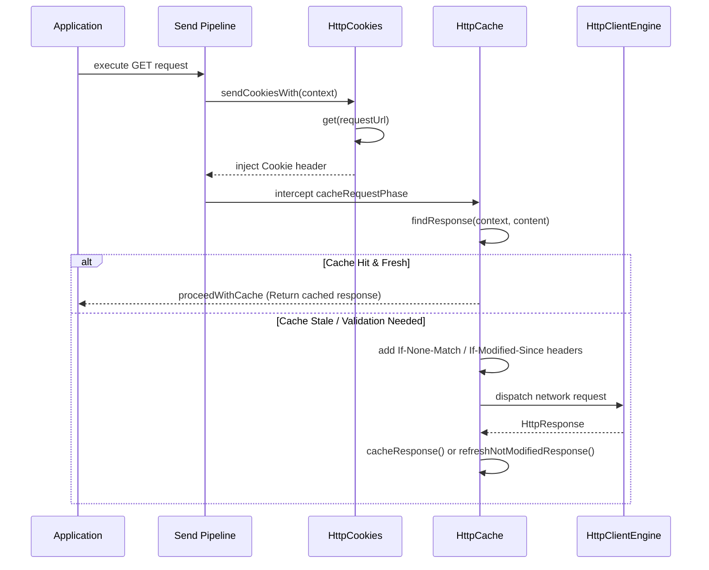

# Client Caching and Cookies

<details>
<summary>Relevant source files</summary>

The following files were used as context for generating this wiki page:

- [ktor-client/ktor-client-core/common/src/io/ktor/client/plugins/cache/HttpCache.kt](https://github.com/ktorio/ktor/blob/main/ktor-client/ktor-client-core/common/src/io/ktor/client/plugins/cache/HttpCache.kt)
- [ktor-client/ktor-client-core/common/src/io/ktor/client/plugins/cache/storage/HttpCacheStorage.kt](https://github.com/ktorio/ktor/blob/main/ktor-client/ktor-client-core/common/src/io/ktor/client/plugins/cache/storage/HttpCacheStorage.kt)
- [ktor-client/ktor-client-core/common/src/io/ktor/client/plugins/cookies/HttpCookies.kt](https://github.com/ktorio/ktor/blob/main/ktor-client/ktor-client-core/common/src/io/ktor/client/plugins/cookies/HttpCookies.kt)
- [ktor-client/ktor-client-core/common/src/io/ktor/client/plugins/cache/HttpCacheLegacy.kt](https://github.com/ktorio/ktor/blob/main/ktor-client/ktor-client-core/common/src/io/ktor/client/plugins/cache/HttpCacheLegacy.kt)
- [ktor-client/ktor-client-core/common/src/io/ktor/client/plugins/cache/HttpCacheEntry.kt](https://github.com/ktorio/ktor/blob/main/ktor-client/ktor-client-core/common/src/io/ktor/client/plugins/cache/HttpCacheEntry.kt)
- [ktor-client/ktor-client-core/common/src/io/ktor/client/plugins/cookies/CookiesStorage.kt](https://github.com/ktorio/ktor/blob/main/ktor-client/ktor-client-core/common/src/io/ktor/client/plugins/cookies/CookiesStorage.kt)
- [ktor-client/ktor-client-core/common/src/io/ktor/client/plugins/cookies/AcceptAllCookiesStorage.kt](https://github.com/ktorio/ktor/blob/main/ktor-client/ktor-client-core/common/src/io/ktor/client/plugins/cookies/AcceptAllCookiesStorage.kt)
- [ktor-client/ktor-client-core/common/src/io/ktor/client/plugins/cache/storage/UnlimitedCacheStorage.kt](https://github.com/ktorio/ktor/blob/main/ktor-client/ktor-client-core/common/src/io/ktor/client/plugins/cache/storage/UnlimitedCacheStorage.kt)
- [ktor-http/common/src/io/ktor/http/HttpMessageProperties.kt](https://github.com/ktorio/ktor/blob/main/ktor-http/common/src/io/ktor/http/HttpMessageProperties.kt)
- [ktor-client/ktor-client-core/common/src/io/ktor/client/plugins/cache/HttpCacheValidation.kt](https://github.com/ktorio/ktor/blob/main/ktor-client/ktor-client-core/common/src/io/ktor/client/plugins/cache/HttpCacheValidation.kt)
- [ktor-server/ktor-server-core/common/src/io/ktor/server/response/ResponseCookies.kt](https://github.com/ktorio/ktor/blob/main/ktor-server/ktor-server-core/common/src/io/ktor/server/response/ResponseCookies.kt)
- [ktor-client/ktor-client-core/common/src/io/ktor/client/plugins/cache/storage/DisabledCacheStorage.kt](https://github.com/ktorio/ktor/blob/main/ktor-client/ktor-client-core/common/src/io/ktor/client/plugins/cache/storage/DisabledCacheStorage.kt)
- [ktor-http/common/src/io/ktor/http/content/CachingOptions.kt](https://github.com/ktorio/ktor/blob/main/ktor-http/common/src/io/ktor/http/content/CachingOptions.kt)
- [ktor-client/ktor-client-core/common/src/io/ktor/client/call/SavedCall.kt](https://github.com/ktorio/ktor/blob/main/ktor-client/ktor-client-core/common/src/io/ktor/client/call/SavedCall.kt)
- [ktor-server/ktor-server-plugins/ktor-server-sessions/common/src/io/ktor/server/sessions/Cache.kt](https://github.com/ktorio/ktor/blob/main/ktor-server/ktor-server-plugins/ktor-server-sessions/common/src/io/ktor/server/sessions/Cache.kt)
- [ktor-client/ktor-client-core/wasmJs/src/io/ktor/client/fetch/LibDom.kt](https://github.com/ktorio/ktor/blob/main/ktor-client/ktor-client-core/wasmJs/src/io/ktor/client/fetch/LibDom.kt)
</details>

## Overview

### Overview Introduction
The client caching and cookies architecture in Ktor provides robust, extensible client-side protocol features designed to minimize network overhead and maintain stateful sessions across HTTP calls. Operating as modular plugins within the Ktor HTTP client pipeline (`HttpCache` and `HttpCookies`), these systems intercept outgoing requests and incoming responses to enforce caching directives defined by RFC 9110 and RFC 9111 while managing cookie storage, domain/path matching rules, and automatic expiration cleanup.

Sources: [ktor-client/ktor-client-core/common/src/io/ktor/client/plugins/cache/HttpCache.kt:37-53](https://github.com/ktorio/ktor/blob/main/ktor-client/ktor-client-core/common/src/io/ktor/client/plugins/cache/HttpCache.kt#L37-L53)

### Overview Design Decisions
The design relies on separation of concerns between pipeline interception phases and pluggable storage backends (`CacheStorage` and `CookiesStorage`). By decoupling policy execution—such as evaluating `Cache-Control`, `ETag`, `Last-Modified`, and `Vary` headers—from physical persistence, Ktor enables developers to swap unlimited in-memory maps for custom file-based or database-backed engines without modifying request invocation logic.

Sources: [ktor-client/ktor-client-core/common/src/io/ktor/client/plugins/cache/HttpCache.kt:37-53](https://github.com/ktorio/ktor/blob/main/ktor-client/ktor-client-core/common/src/io/ktor/client/plugins/cache/HttpCache.kt#L37-L53)

### Overview Compliance Notes
> [!NOTE]
> The caching subsystem implements strict validation and freshening logic according to HTTP specifications, handling conditional requests (`If-None-Match`, `If-Modified-Since`) and transparently re-storing updated responses upon receiving `304 Not Modified` statuses.

Sources: [ktor-client/ktor-client-core/common/src/io/ktor/client/plugins/cache/HttpCache.kt:37-53](https://github.com/ktorio/ktor/blob/main/ktor-client/ktor-client-core/common/src/io/ktor/client/plugins/cache/HttpCache.kt#L37-L53), [ktor-client/ktor-client-core/common/src/io/ktor/client/plugins/cookies/HttpCookies.kt:20-31](https://github.com/ktorio/ktor/blob/main/ktor-client/ktor-client-core/common/src/io/ktor/client/plugins/cookies/HttpCookies.kt#L20-L31)

## Architecture and Control Flow

### Architecture Execution Flow
The `HttpCache` and `HttpCookies` plugins integrate into the Ktor `HttpClient` via pipeline interception phases. When an HTTP call is executed, requests pass through request and send pipelines where cookies are attached and cache validity is evaluated before touching network drivers.

Sources: [ktor-client/ktor-client-core/common/src/io/ktor/client/plugins/cache/HttpCache.kt:187-275](https://github.com/ktorio/ktor/blob/main/ktor-client/ktor-client-core/common/src/io/ktor/client/plugins/cache/HttpCache.kt#L187-L275), [ktor-client/ktor-client-core/common/src/io/ktor/client/plugins/cookies/HttpCookies.kt:127-138](https://github.com/ktorio/ktor/blob/main/ktor-client/ktor-client-core/common/src/io/ktor/client/plugins/cookies/HttpCookies.kt#L127-L138)

### Architecture Sequence Diagram


Sources: [ktor-client/ktor-client-core/common/src/io/ktor/client/plugins/cache/HttpCache.kt:187-275](https://github.com/ktorio/ktor/blob/main/ktor-client/ktor-client-core/common/src/io/ktor/client/plugins/cache/HttpCache.kt#L187-L275), [ktor-client/ktor-client-core/common/src/io/ktor/client/plugins/cookies/HttpCookies.kt:127-138](https://github.com/ktorio/ktor/blob/main/ktor-client/ktor-client-core/common/src/io/ktor/client/plugins/cookies/HttpCookies.kt#L127-L138)

## Execution Walkthrough: Caching Interception and Validation

### Walkthrough Request Interception
When the `HttpCache` plugin is installed, it inserts a `Cache` phase into the `sendPipeline` immediately after `HttpSendPipeline.State` and into the `receivePipeline` immediately after `HttpReceivePipeline.State`. The interceptor verifies that the request method is `GET` and that the protocol is either `http` or `https` (`canStore()`). Outgoing content containing streaming bodies or non-GET methods bypasses the cache. If `isSharedClient` is true and an `Authorization` header is present, caching is skipped. `plugin.findResponse(context, content)` searches both `privateStorageNew` and `publicStorageNew` for stored responses matching the request URL and `Vary` header keys via `mergedHeadersLookup`. `shouldValidate(cache.expires, cache.headers, context)` evaluates whether the cached entry is fresh, stale, or requires revalidation based on `Cache-Control` directives (`no-cache`, `max-age`, `must-revalidate`, `max-stale`).

Sources: [ktor-client/ktor-client-core/common/src/io/ktor/client/plugins/cache/HttpCache.kt:187-236](https://github.com/ktorio/ktor/blob/main/ktor-client/ktor-client-core/common/src/io/ktor/client/plugins/cache/HttpCache.kt#L187-L236), [ktor-client/ktor-client-core/common/src/io/ktor/client/plugins/cache/HttpCacheEntry.kt:105-151](https://github.com/ktorio/ktor/blob/main/ktor-client/ktor-client-core/common/src/io/ktor/client/plugins/cache/HttpCacheEntry.kt#L105-L151)

### Walkthrough Validation Outcomes
- **`ValidateStatus.ShouldNotValidate`:** The response is fresh. Ktor constructs a fake response call via `cache.createResponse(...)`, invokes `finish()`, fires the `HttpResponseFromCache` monitoring event, and proceeds with the cached call without touching the network.
- **`ValidateStatus.ShouldWarn`:** The response is stale beyond allowed `max-stale` thresholds. Ktor returns a synthetic response with a `Warning: 110` header.
- **Revalidation Needed:** Ktor appends conditional request headers (`If-None-Match` using `ETag` and `If-Modified-Since` using `Last-Modified`) and allows the request to proceed to the network engine.

Sources: [ktor-client/ktor-client-core/common/src/io/ktor/client/plugins/cache/HttpCache.kt:214-236](https://github.com/ktorio/ktor/blob/main/ktor-client/ktor-client-core/common/src/io/ktor/client/plugins/cache/HttpCache.kt#L214-L236)

### Walkthrough Response Interception
For successful responses (`isSuccess()`), `plugin.cacheResponse(response)` reads the raw byte channel, extracts cache expiration parameters (`cacheExpires`), calculates `varyKeys()`, filters out hop-by-hop and proxy authentication headers, and stores the resulting `CachedResponseData` into the appropriate storage backend. If the response status is `HttpStatusCode.NotModified` (`304`), Ktor executes `refreshNotModifiedResponse`, invokes `plugin::findAndRefresh` to update metadata and headers, fires `HttpResponseFromCache`, and returns the freshened response.

Sources: [ktor-client/ktor-client-core/common/src/io/ktor/client/plugins/cache/HttpCache.kt:241-274](https://github.com/ktorio/ktor/blob/main/ktor-client/ktor-client-core/common/src/io/ktor/client/plugins/cache/HttpCache.kt#L241-L274)

### Walkthrough Vary Warning
> [!WARNING]
> If a `304 Not Modified` response arrives with a `Vary` header that differs from the original cached entry, Ktor emits a warning log highlighting compliance with RFC 9110 §15.4.5 and RFC 9111 §4.1, but proceeds with the cached response anyway.

Sources: [ktor-client/ktor-client-core/common/src/io/ktor/client/plugins/cache/HttpCacheValidation.kt:11-32](https://github.com/ktorio/ktor/blob/main/ktor-client/ktor-client-core/common/src/io/ktor/client/plugins/cache/HttpCacheValidation.kt#L11-L32)

## Cookie Management and Storage

### Cookie Management Overview
The `HttpCookies` plugin intercepts requests to inject stored cookies and captures incoming cookies from `Set-Cookie` response headers. 

Sources: [ktor-client/ktor-client-core/common/src/io/ktor/client/plugins/cookies/HttpCookies.kt:20-86](https://github.com/ktorio/ktor/blob/main/ktor-client/ktor-client-core/common/src/io/ktor/client/plugins/cookies/HttpCookies.kt#L20-L86)

### Cookie Initialization Trace
The installation of `HttpCookies` executes a verified call chain `install` → `captureHeaderCookies` → `build`. During installation, the plugin sets up request, send, and receive pipeline interceptors while initializing any default cookies specified in configuration blocks.

Sources: [ktor-client/ktor-client-core/common/src/io/ktor/client/plugins/cookies/HttpCookies.kt:118-137](https://github.com/ktorio/ktor/blob/main/ktor-client/ktor-client-core/common/src/io/ktor/client/plugins/cookies/HttpCookies.kt#L118-L137)

### AcceptAllCookiesStorage Mechanics
The default storage backend, `AcceptAllCookiesStorage`, maintains cookies in an in-memory `MutableList` protected by a `Mutex`. `Cookie.matches(requestUrl)` validates domain suffix matching (accounting for IP addresses), path prefix constraints, and secure protocol requirements. Before returning cookies in `get()`, it checks `oldestCookie.value` against the current clock timestamp. If expired cookies exist, `cleanup()` sweeps the container and recalculates the next expiration threshold.

Sources: [ktor-client/ktor-client-core/common/src/io/ktor/client/plugins/cookies/AcceptAllCookiesStorage.kt:18-72](https://github.com/ktorio/ktor/blob/main/ktor-client/ktor-client-core/common/src/io/ktor/client/plugins/cookies/AcceptAllCookiesStorage.kt#L18-L72), [ktor-client/ktor-client-core/common/src/io/ktor/client/plugins/cookies/CookiesStorage.kt:46-73](https://github.com/ktorio/ktor/blob/main/ktor-client/ktor-client-core/common/src/io/ktor/client/plugins/cookies/CookiesStorage.kt#L46-L73)

## Cache Storage Interfaces and Backends

### Cache Storage Implementations
Ktor defines both a legacy `HttpCacheStorage` class and a modern suspend-based `CacheStorage` interface.

| Storage Backend | Interface | Description |
| :--- | :--- | :--- |
| `CacheStorage.Unlimited` (`UnlimitedStorage`) | `CacheStorage` | Default in-memory cache storage using concurrent maps and sets without capacity restrictions. |
| `CacheStorage.Disabled` (`DisabledStorage`) | `CacheStorage` | Null-object storage implementation that stores nothing and returns empty results. |
| `HttpCacheStorage.Unlimited` (`UnlimitedCacheStorage`) | `HttpCacheStorage` | Deprecated legacy unlimited storage implementation. |
| `HttpCacheStorage.Disabled` (`DisabledCacheStorage`) | `HttpCacheStorage` | Deprecated legacy disabled storage implementation. |

Sources: [ktor-client/ktor-client-core/common/src/io/ktor/client/plugins/cache/storage/HttpCacheStorage.kt:27-138](https://github.com/ktorio/ktor/blob/main/ktor-client/ktor-client-core/common/src/io/ktor/client/plugins/cache/storage/HttpCacheStorage.kt#L27-L138), [ktor-client/ktor-client-core/common/src/io/ktor/client/plugins/cache/storage/UnlimitedCacheStorage.kt:12-72](https://github.com/ktorio/ktor/blob/main/ktor-client/ktor-client-core/common/src/io/ktor/client/plugins/cache/storage/UnlimitedCacheStorage.kt#L12-72), [ktor-client/ktor-client-core/common/src/io/ktor/client/plugins/cache/storage/DisabledCacheStorage.kt:11-25](https://github.com/ktorio/ktor/blob/main/ktor-client/ktor-client-core/common/src/io/ktor/client/plugins/cache/storage/DisabledCacheStorage.kt#L11-25)

## Design Trade-Offs

### Design Trade-Offs Matrix
| Design Choice | Benefit | Cost |
| :--- | :--- | :--- |
| In-memory `ConcurrentMap` storage | Zero external dependencies, extremely fast lookups for mobile and multiplatform targets. | Volatile storage; entries do not persist across application restarts and consume heap memory proportional to response sizes. |
| Automatic header exclusion (`filterForCacheStorage`) | Complies with RFC 9110/9111 by stripping hop-by-hop and proxy authentication headers from cached payloads. | Cannot serve raw un-filtered network responses directly from cache without rebuilding the response wrapper. |
| Unbounded unlimited storage by default | Prevents cache misses and unexpected eviction bugs during initial integration. | Risk of OutOfMemoryError in long-running applications caching high volumes of large resources without custom storage limits. |

Sources: [ktor-client/ktor-client-core/common/src/io/ktor/client/plugins/cache/storage/HttpCacheStorage.kt:160-180](https://github.com/ktorio/ktor/blob/main/ktor-client/ktor-client-core/common/src/io/ktor/client/plugins/cache/storage/HttpCacheStorage.kt#L160-L180), [ktor-client/ktor-client-core/common/src/io/ktor/client/plugins/cache/storage/UnlimitedCacheStorage.kt:38-72](https://github.com/ktorio/ktor/blob/main/ktor-client/ktor-client-core/common/src/io/ktor/client/plugins/cache/storage/UnlimitedCacheStorage.kt#L38-72)

## Configuration and Usage Example

### Configuration Example
The following example demonstrates how to configure an `HttpClient` with both `HttpCache` and `HttpCookies` plugins, specifying custom storage options and default pre-populated cookies.

Sources: [ktor-client/ktor-client-core/common/src/io/ktor/client/plugins/cache/HttpCache.kt:55-134](https://github.com/ktorio/ktor/blob/main/ktor-client/ktor-client-core/common/src/io/ktor/client/plugins/cache/HttpCache.kt#L55-L134), [ktor-client/ktor-client-core/common/src/io/ktor/client/plugins/cookies/HttpCookies.kt:93-120](https://github.com/ktorio/ktor/blob/main/ktor-client/ktor-client-core/common/src/io/ktor/client/plugins/cookies/HttpCookies.kt#L93-L120)

### Runnable Code Snippet
```kotlin
import io.ktor.client.*
import io.ktor.client.engine.cio.*
import io.ktor.client.plugins.cache.*
import io.ktor.client.plugins.cache.storage.*
import io.ktor.client.plugins.cookies.*
import io.ktor.client.request.*
import io.ktor.http.*

val client = HttpClient(CIO) {
    install(HttpCache) {
        publicStorage(CacheStorage.Unlimited())
        privateStorage(CacheStorage.Disabled)
        isShared = false
    }
    
    install(HttpCookies) {
        storage = AcceptAllCookiesStorage()
        default {
            addCookie("https://ktor.io", Cookie("session_id", "abc123xyz", path = "/", secure = true))
        }
    }
}
```

Sources: [ktor-client/ktor-client-core/common/src/io/ktor/client/plugins/cache/HttpCache.kt:55-134](https://github.com/ktorio/ktor/blob/main/ktor-client/ktor-client-core/common/src/io/ktor/client/plugins/cache/HttpCache.kt#L55-L134), [ktor-client/ktor-client-core/common/src/io/ktor/client/plugins/cookies/HttpCookies.kt:93-120](https://github.com/ktorio/ktor/blob/main/ktor-client/ktor-client-core/common/src/io/ktor/client/plugins/cookies/HttpCookies.kt#L93-L120)

## Related

- [[Client Core]]

