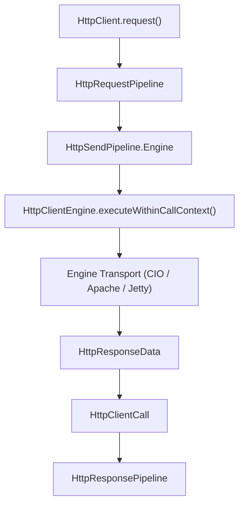
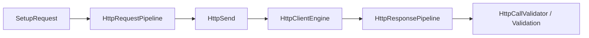

# Client Core

<details>
<summary>Relevant source files</summary>

The following files were used as context for generating this wiki page:

- [ktor-client/ktor-client-core/common/src/io/ktor/client/plugins/DefaultTransform.kt](https://github.com/ktorio/ktor/blob/main/ktor-client/ktor-client-core/common/src/io/ktor/client/plugins/DefaultTransform.kt)
- [ktor-client/ktor-client-core/common/src/io/ktor/client/call/HttpClientCall.kt](https://github.com/ktorio/ktor/blob/main/ktor-client/ktor-client-core/common/src/io/ktor/client/call/HttpClientCall.kt)
- [ktor-client/ktor-client-cio/jvm/src/io/ktor/client/engine/cio/ConnectionPipeline.kt](https://github.com/ktorio/ktor/blob/main/ktor-client/ktor-client-cio/jvm/src/io/ktor/client/engine/cio/ConnectionPipeline.kt)
- [ktor-server/ktor-server-core/common/src/io/ktor/server/engine/DefaultTransform.kt](https://github.com/ktorio/ktor/blob/main/ktor-server/ktor-server-core/common/src/io/ktor/server/engine/DefaultTransform.kt)
- [ktor-client/ktor-client-core/common/src/io/ktor/client/plugins/HttpCallValidator.kt](https://github.com/ktorio/ktor/blob/main/ktor-client/ktor-client-core/common/src/io/ktor/client/plugins/HttpCallValidator.kt)
- [ktor-client/ktor-client-cio/common/src/io/ktor/client/engine/cio/utils.kt](https://github.com/ktorio/ktor/blob/main/ktor-client/ktor-client-cio/common/src/io/ktor/client/engine/cio/utils.kt)
- [ktor-client/ktor-client-apache/jvm/src/io/ktor/client/engine/apache/ApacheResponseConsumer.kt](https://github.com/ktorio/ktor/blob/main/ktor-client/ktor-client-apache/jvm/src/io/ktor/client/engine/apache/ApacheResponseConsumer.kt)
- [ktor-server/ktor-server-core/common/src/io/ktor/server/request/ApplicationReceiveFunctions.kt](https://github.com/ktorio/ktor/blob/main/ktor-server/ktor-server-core/common/src/io/ktor/server/request/ApplicationReceiveFunctions.kt)
- [ktor-client/ktor-client-core/common/src/io/ktor/client/statement/HttpResponsePipeline.kt](https://github.com/ktorio/ktor/blob/main/ktor-client/ktor-client-core/common/src/io/ktor/client/statement/HttpResponsePipeline.kt)
- [ktor-client/ktor-client-plugins/ktor-client-logging/common/src/io/ktor/client/plugins/logging/Logging.kt](https://github.com/ktorio/ktor/blob/main/ktor-client/ktor-client-plugins/ktor-client-logging/common/src/io/ktor/client/plugins/logging/Logging.kt)
- [ktor-client/ktor-client-cio/common/src/io/ktor/client/engine/cio/Endpoint.kt](https://github.com/ktorio/ktor/blob/main/ktor-client/ktor-client-cio/common/src/io/ktor/client/engine/cio/Endpoint.kt)
- [ktor-client/ktor-client-core/common/src/io/ktor/client/request/HttpRequestPipeline.kt](https://github.com/ktorio/ktor/blob/main/ktor-client/ktor-client-core/common/src/io/ktor/client/request/HttpRequestPipeline.kt)
- [ktor-client/ktor-client-core/common/src/io/ktor/client/plugins/api/CommonHooks.kt](https://github.com/ktorio/ktor/blob/main/ktor-client/ktor-client-core/common/src/io/ktor/client/plugins/api/CommonHooks.kt)
- [ktor-client/ktor-client-apache5/jvm/src/io/ktor/client/engine/apache5/ApacheResponseConsumer.kt](https://github.com/ktorio/ktor/blob/main/ktor-client/ktor-client-apache5/jvm/src/io/ktor/client/engine/apache5/ApacheResponseConsumer.kt)
- [ktor-client/ktor-client-core/common/src/io/ktor/client/statement/HttpStatement.kt](https://github.com/ktorio/ktor/blob/main/ktor-client/ktor-client-core/common/src/io/ktor/client/statement/HttpStatement.kt)
- [ktor-client/ktor-client-jetty/jvm/src/io/ktor/client/engine/jetty/JettyResponseListener.kt](https://github.com/ktorio/ktor/blob/main/ktor-client/ktor-client-jetty/jvm/src/io/ktor/client/engine/jetty/JettyResponseListener.kt)
- [ktor-client/ktor-client-core/jvm/src/io/ktor/client/plugins/DefaultTransformersJvm.kt](https://github.com/ktorio/ktor/blob/main/ktor-client/ktor-client-core/jvm/src/io/ktor/client/plugins/DefaultTransformersJvm.kt)
- [ktor-client/ktor-client-plugins/ktor-client-encoding/common/src/ContentEncoding.kt](https://github.com/ktorio/ktor/blob/main/ktor-client/ktor-client-plugins/ktor-client-encoding/common/src/ContentEncoding.kt)
- [ktor-client/ktor-client-plugins/ktor-client-content-negotiation/common/src/io/ktor/client/plugins/contentnegotiation/ContentNegotiation.kt](https://github.com/ktorio/ktor/blob/main/ktor-client/ktor-client-plugins/ktor-client-content-negotiation/common/src/io/ktor/client/plugins/contentnegotiation/ContentNegotiation.kt)
- [ktor-client/ktor-client-core/common/src/io/ktor/client/plugins/DefaultResponseValidation.kt](https://github.com/ktorio/ktor/blob/main/ktor-client/ktor-client-core/common/src/io/ktor/client/plugins/DefaultResponseValidation.kt)
- [ktor-server/ktor-server-core/common/src/io/ktor/server/application/PipelineCall.kt](https://github.com/ktorio/ktor/blob/main/ktor-server/ktor-server-core/common/src/io/ktor/server/application/PipelineCall.kt)
- [ktor-client/ktor-client-core/common/src/io/ktor/client/plugins/api/KtorCallContexts.kt](https://github.com/ktorio/ktor/blob/main/ktor-client/ktor-client-core/common/src/io/ktor/client/plugins/api/KtorCallContexts.kt)
- [ktor-client/ktor-client-core/common/src/io/ktor/client/statement/HttpResponse.kt](https://github.com/ktorio/ktor/blob/main/ktor-client/ktor-client-core/common/src/io/ktor/client/statement/HttpResponse.kt)
- [ktor-client/ktor-client-core/common/src/io/ktor/client/call/SavedCall.kt](https://github.com/ktorio/ktor/blob/main/ktor-client/ktor-client-core/common/src/io/ktor/client/call/SavedCall.kt)
- [ktor-client/ktor-client-core/common/src/io/ktor/client/engine/HttpClientEngine.kt](https://github.com/ktorio/ktor/blob/main/ktor-client/ktor-client-core/common/src/io/ktor/client/engine/HttpClientEngine.kt)
- [ktor-client/ktor-client-core/common/src/io/ktor/client/HttpClient.kt](https://github.com/ktorio/ktor/blob/main/ktor-client/ktor-client-core/common/src/io/ktor/client/HttpClient.kt)
</details>

## Overview

### Overview Details

The **Client Core** subsystem forms the foundational runtime layer of Ktor's multiplatform HTTP client architecture. It provides the core abstractions, execution pipelines, call representations, and extension mechanisms that coordinate requests from user code down to platform-specific transport engines. By decoupling the public-facing API surface from underlying network implementations, Client Core enables consistent asynchronous communication across JVM, JavaScript, WebAssembly, and native targets.

Sources: [HttpClient.kt:645-652](https://github.com/ktorio/ktor/blob/main/ktor-client/ktor-client-core/common/src/io/ktor/client/HttpClient.kt#L645-L652)

At its heart, Client Core models HTTP interactions through structured pipelines (`HttpRequestPipeline`, `HttpSendPipeline`, and `HttpResponsePipeline`) and typed communication pairs (`HttpClientCall`, combining `HttpRequest` and `HttpResponse`). This design ensures that cross-cutting concerns—such as content transformation, automatic redirection, authentication, validation, compression, and logging—can intercept and modify traffic uniformly without tightly coupling plugins to specific socket engines like CIO, Apache, or Jetty.

Sources: [HttpClientEngine.kt:138-168](https://github.com/ktorio/ktor/blob/main/ktor-client/ktor-client-core/common/src/io/ktor/client/engine/HttpClientEngine.kt#L138-L168), [HttpResponsePipeline.kt:17-25](https://github.com/ktorio/ktor/blob/main/ktor-client/ktor-client-core/common/src/io/ktor/client/statement/HttpResponsePipeline.kt#L17-L25)

This page covers the four primary structural facets of Client Core: **Client Architecture**, **Client Plugin API**, **Client Requests**, and **Client Responses**. Each section examines the underlying mechanisms, data flow paths, structural components, and design trade-offs that govern Ktor's client runtime.

Sources: [HttpRequestPipeline.kt:16-61](https://github.com/ktorio/ktor/blob/main/ktor-client/ktor-client-core/common/src/io/ktor/client/request/HttpRequestPipeline.kt#L16-L61)

---

## Client Architecture

### Engine Integration and Call Contexts

The client architecture is anchored by the `HttpClient` class and its underlying network engines (`HttpClientEngine`). When a user invokes `HttpClient(engineFactory)`, the client initializes its execution pipelines, installs built-in default transformers and response validators, and binds to the specified transport engine. The `HttpClientEngine` interface defines the contract for executing raw HTTP transactions. When an HTTP request reaches the engine phase (`HttpSendPipeline.Engine`), the engine wraps the request data, validates headers against unsafe values, and dispatches the execution within a dedicated call context (`HttpClientEngine.executeWithinCallContext`).



Sources: [HttpClientEngine.kt:138-168](https://github.com/ktorio/ktor/blob/main/ktor-client/ktor-client-core/common/src/io/ktor/client/engine/HttpClientEngine.kt#L138-L168), [HttpRequestPipeline.kt:68-108](https://github.com/ktorio/ktor/blob/main/ktor-client/ktor-client-core/common/src/io/ktor/client/request/HttpRequestPipeline.kt#L68-L108)

The engine creates a child job (`callJob`) inheriting from the parent coroutine scope, overriding the coroutine name to `call-context`. If the client instance is closed (`closed` evaluates to true via an inactive root job), a `ClientEngineClosedException` is thrown immediately.

```kotlin
internal suspend fun HttpClientEngine.createCallContext(parentJob: Job): CoroutineContext {
    val callJob = Job(parentJob)
    val callContext = coroutineContext + callJob + CALL_COROUTINE

    attachToUserJob(callJob)

    return callContext
}
```
Sources: [HttpClientEngine.kt:217-225](https://github.com/ktorio/ktor/blob/main/ktor-client/ktor-client-core/common/src/io/ktor/client/engine/HttpClientEngine.kt#L217-L225)

### Connection Pooling and Multiplexing (CIO Engine Example)

In multi-connection engines such as CIO (`Endpoint.kt` and `ConnectionPipeline.kt`), requests are dispatched to an `Endpoint` managing route connections. If pipelining is enabled and supported, tasks are routed through a `ConnectionPipeline` semaphore-throttled queue (`pipelineMaxSize`).

> [!WARNING]
> If a response connection prematurely closes or an unexpected EOF occurs while parsing headers via `parseResponse(networkInput)`, a `ClosedReadChannelException` wrapping an `EOFException` is thrown, terminating the connection pipeline task.

Sources: [ConnectionPipeline.kt:36-79](https://github.com/ktorio/ktor/blob/main/ktor-client/ktor-client-cio/jvm/src/io/ktor/client/engine/cio/ConnectionPipeline.kt#L36-L79), [Endpoint.kt:60-79](https://github.com/ktorio/ktor/blob/main/ktor-client/ktor-client-cio/common/src/io/ktor/client/engine/cio/Endpoint.kt#L60-L79)

---

## Client Plugin API

### Pipeline Interception and Hooks

Ktor client plugins provide modular interception layers over request and response pipelines. Plugins interact with client execution using hooks defined in `CommonHooks.kt` and `KtorCallContexts.kt`. Plugins register handlers via hooks such as `SetupRequest`, `Send`, `SendingRequest`, `RequestError`, and `ReceiveError`. For instance, `HttpCallValidator` intercepts request and receive errors to map low-level transport exceptions and validate response status codes.



Sources: [HttpCallValidator.kt:138-159](https://github.com/ktorio/ktor/blob/main/ktor-client/ktor-client-core/common/src/io/ktor/client/plugins/HttpCallValidator.kt#L138-L159), [CommonHooks.kt:21-91](https://github.com/ktorio/ktor/blob/main/ktor-client/ktor-client-core/common/src/io/ktor/client/plugins/api/CommonHooks.kt#L21-L91)

### Built-in Plugins and Content Negotiation

- **ContentNegotiation**: Intercepts request bodies via `transformRequestBody` and response channels via `transformResponseBody`, negotiating media types using `Accept` and `Content-Type` headers against registered `ContentConverter` instances.
- **ContentEncoding**: Automatically appends `Accept-Encoding` headers (such as `gzip`, `deflate`, `identity`) and decodes incoming compressed response streams.
- **Logging**: Captures headers, request/response bodies, and exceptions at configurable levels (`NONE`, `INFO`, `HEADERS`, `BODY`, `ALL`), supporting both default formatting and OkHttp-compatible log formatting.

Sources: [ContentEncoding.kt:107-208](https://github.com/ktorio/ktor/blob/main/ktor-client/ktor-client-plugins/ktor-client-encoding/common/src/ContentEncoding.kt#L107-L208), [ContentNegotiation.kt:231-360](https://github.com/ktorio/ktor/blob/main/ktor-client/ktor-client-plugins/ktor-client-content-negotiation/common/src/io/ktor/client/plugins/contentnegotiation/ContentNegotiation.kt#L231-L360), [Logging.kt:126-655](https://github.com/ktorio/ktor/blob/main/ktor-client/ktor-client-plugins/ktor-client-logging/common/src/io/ktor/client/plugins/logging/Logging.kt#L126-L655)

---

## Client Requests

### Pipeline Phases and Default Transformers

Client requests start as an `HttpRequestBuilder` and progress through the `HttpRequestPipeline` and `HttpSendPipeline` before being serialized into `HttpRequestData` and transmitted by the engine. The `HttpRequestPipeline` executes across five distinct phases:

| Phase Name | Purpose |
| :--- | :--- |
| `Before` | Earliest phase; initializes attributes and configuration flags (e.g., `SetupRequest`). |
| `State` | Modifies requests with shared state and registers logging/monitoring contexts. |
| `Transform` | Transforms request bodies into intermediate renderable formats. |
| `Render` | Renders request bodies into concrete `OutgoingContent` instances. |
| `Send` | Handles execution dispatch via the `HttpSend` plugin. |

Sources: [HttpRequestPipeline.kt:16-61](https://github.com/ktorio/ktor/blob/main/ktor-client/ktor-client-core/common/src/io/ktor/client/request/HttpRequestPipeline.kt#L16-L61)

During the `Render` phase, `defaultTransformers()` inspects the request body type:
- `String` bodies are wrapped in `TextContent` with `ContentType.Text.Plain` (or user-defined content type).
- `ByteArray` bodies are wrapped in `OutgoingContent.ByteArrayContent`.
- `ByteReadChannel` bodies are wrapped in `OutgoingContent.ReadChannelContent`.
- `InputStream` bodies (JVM) are converted via `toByteReadChannel()`.

```kotlin
    requestPipeline.intercept(HttpRequestPipeline.Render) { body ->
        if (context.headers[HttpHeaders.Accept] == null) {
            context.headers.append(HttpHeaders.Accept, "*/*")
        }

        val contentType = context.contentType()
        val content = when (body) {
            is String -> TextContent(body, contentType ?: ContentType.Text.Plain)
            is ByteArray -> object : OutgoingContent.ByteArrayContent() {
                override val contentType: ContentType = contentType ?: ContentType.Application.OctetStream
                override val contentLength: Long = body.size.toLong()
                override fun bytes(): ByteArray = body
            }
            is ByteReadChannel -> object : OutgoingContent.ReadChannelContent() {
                override val contentLength = context.headers[HttpHeaders.ContentLength]?.toLong()
                override val contentType: ContentType = contentType ?: ContentType.Application.OctetStream
                override fun readFrom(): ByteReadChannel = body
            }
            is OutgoingContent -> body
            else -> platformRequestDefaultTransform(contentType, context, body)
        }
        if (content?.contentType != null) {
            context.headers.remove(HttpHeaders.ContentType)
            proceedWith(content)
        }
    }
```
Sources: [DefaultTransform.kt:33-66](https://github.com/ktorio/ktor/blob/main/ktor-client/ktor-client-core/common/src/io/ktor/client/plugins/DefaultTransform.kt#L33-L66), [DefaultTransformersJvm.kt:39-51](https://github.com/ktorio/ktor/blob/main/ktor-client/ktor-client-core/jvm/src/io/ktor/client/plugins/DefaultTransformersJvm.kt#L39-L51)

---

## Client Responses

### Response Pipeline Phases

An `HttpClientCall` pairs an `HttpRequest` with an `HttpResponse`. Responses flow through the `HttpResponsePipeline`, where byte streams are parsed, validated, and deserialized into user-requested types. The `HttpResponsePipeline` operates across five phases:

| Phase Name | Purpose |
| :--- | :--- |
| `Receive` | Receives raw `HttpResponseData` from the transport engine. |
| `Parse` | Parses the raw `ByteReadChannel` into target containers (`ByteArray`, `String`, `Input`, `InputStream`). |
| `Transform` | Applies content negotiation and custom type converters. |
| `State` | Manages response-level state and observing hooks. |
| `After` | Finalizes response handling. |

Sources: [HttpResponsePipeline.kt:17-62](https://github.com/ktorio/ktor/blob/main/ktor-client/ktor-client-core/common/src/io/ktor/client/statement/HttpResponsePipeline.kt#L17-L62)

### Body Reception, Double-Receive Protection, and Saving

The `HttpClientCall.bodyNullable(info: TypeInfo)` method handles content extraction. To prevent consuming streaming channels multiple times (unless `allowDoubleReceive` is true or the call is saved), Ktor checks an atomic boolean flag (`received`):

```kotlin
if (!allowDoubleReceive && !response.isSaved && !received.compareAndSet(false, true)) {
    throw DoubleReceiveException(this)
}
```
Sources: [HttpClientCall.kt:91-94](https://github.com/ktorio/ktor/blob/main/ktor-client/ktor-client-core/common/src/io/ktor/client/call/HttpClientCall.kt#L91-L94)

Calls can be cached in memory via `HttpClientCall.save()`, which reads remaining response bytes into a `ByteArray` and wraps them in a `SavedHttpCall`, allowing replayable access and releasing underlying network sockets.

```kotlin
public suspend fun HttpClientCall.save(): HttpClientCall {
    if (this is SavedHttpCall) return this

    val responseBody = response.rawContent.readRemaining().readByteArray()
    return SavedHttpCall(client, request, response, responseBody)
}
```
Sources: [SavedCall.kt:34-40](https://github.com/ktorio/ktor/blob/main/ktor-client/ktor-client-core/common/src/io/ktor/client/call/SavedCall.kt#L34-L40)

### Response Validation and Error Handling

The `DefaultResponseValidation` plugin checks whether status codes fall outside successful ranges (`>= 300`). When `expectSuccess` is enabled, failed statuses trigger specific exception subtypes:

```kotlin
val exception = when (statusCode) {
    in 300..399 -> RedirectResponseException(exceptionResponse, exceptionResponseText)
    in 400..499 -> ClientRequestException(exceptionResponse, exceptionResponseText)
    in 500..599 -> ServerResponseException(exceptionResponse, exceptionResponseText)
    else -> ResponseException(exceptionResponse, exceptionResponseText)
}
throw exception
```
Sources: [DefaultResponseValidation.kt:52-60](https://github.com/ktorio/ktor/blob/main/ktor-client/ktor-client-core/common/src/io/ktor/client/plugins/DefaultResponseValidation.kt#L52-L60)

---

## Design Trade-Offs

| Design Choice | Benefit | Cost |
| :--- | :--- | :--- |
| **Pipeline-Based Architecture** | Enables highly extensible, modular plugin injection points for headers, auth, logging, and serialization. | Slightly higher allocation overhead per request due to pipeline context propagation. |
| **Single-Receive Stream Enforcement** | Prevents silent resource leaks and deadlocks on unbuffered network streams. | Requires explicit call saving (`call.save()`) if multiple readers need the body. |
| **Asynchronous Engine Abstraction** | Decouples high-level API calls from low-level transport mechanisms (CIO, Apache, Jetty). | Platform-specific differences in socket/channel recycling and timeout handling. |

Sources: [HttpClientCall.kt:89-97](https://github.com/ktorio/ktor/blob/main/ktor-client/ktor-client-core/common/src/io/ktor/client/call/HttpClientCall.kt#L89-L97), [HttpClientEngine.kt:36-123](https://github.com/ktorio/ktor/blob/main/ktor-client/ktor-client-core/common/src/io/ktor/client/engine/HttpClientEngine.kt#L36-L123)
