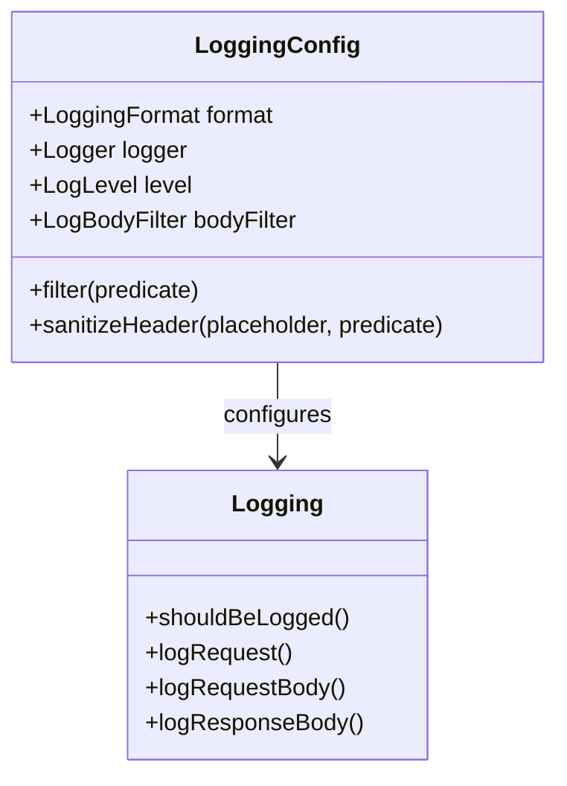
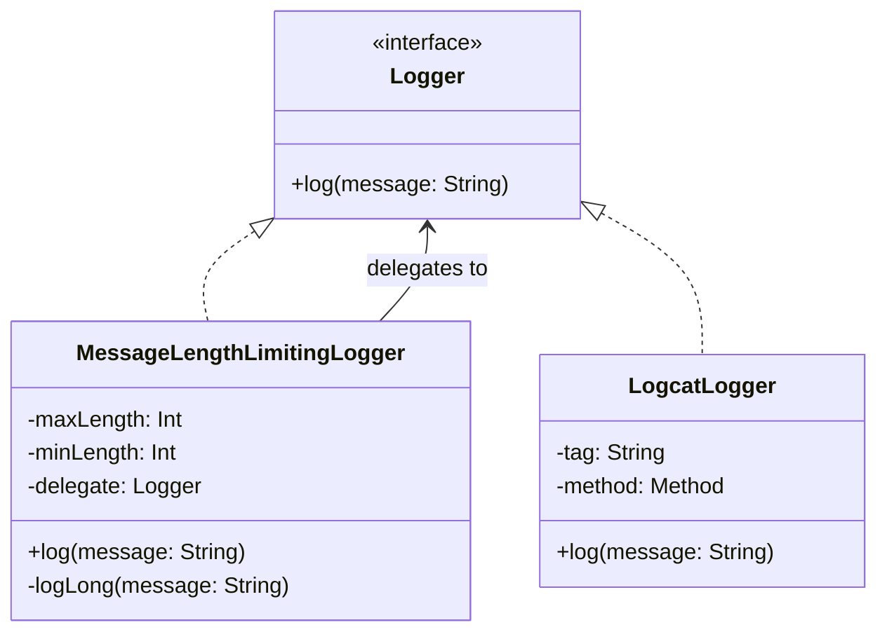
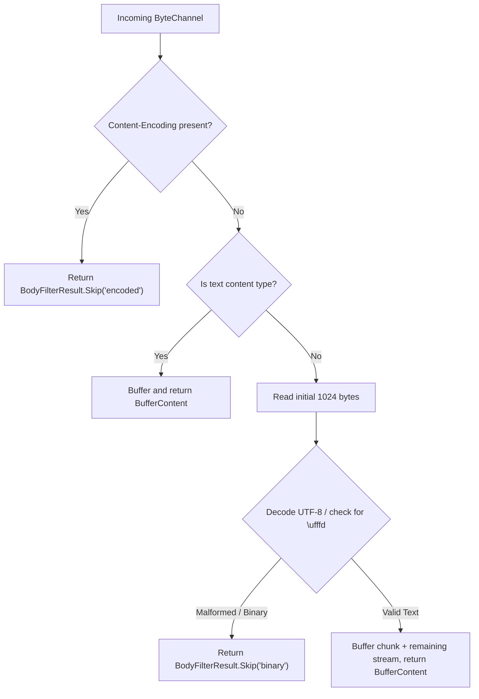
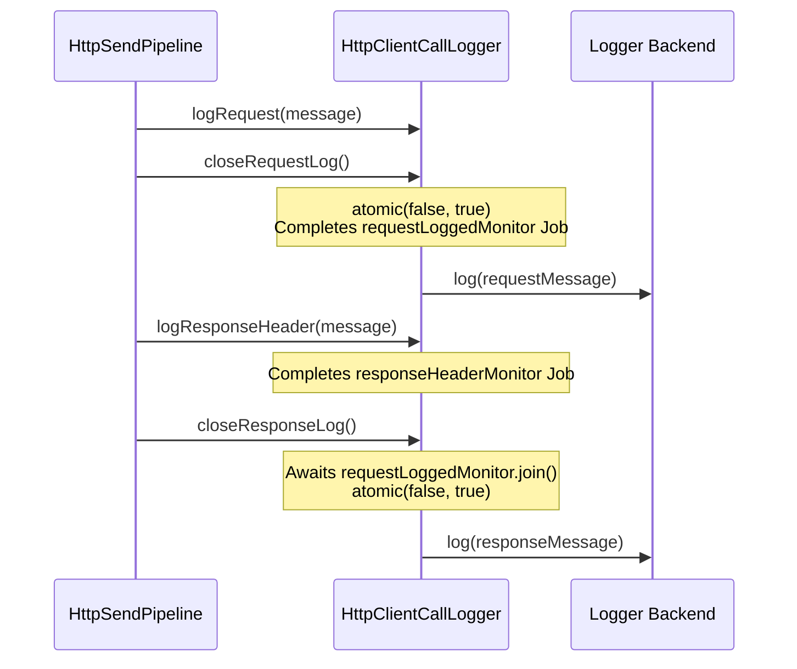
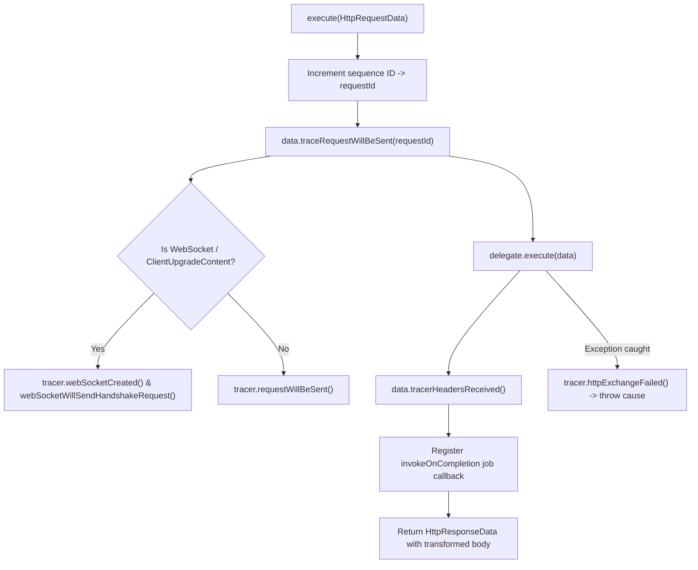
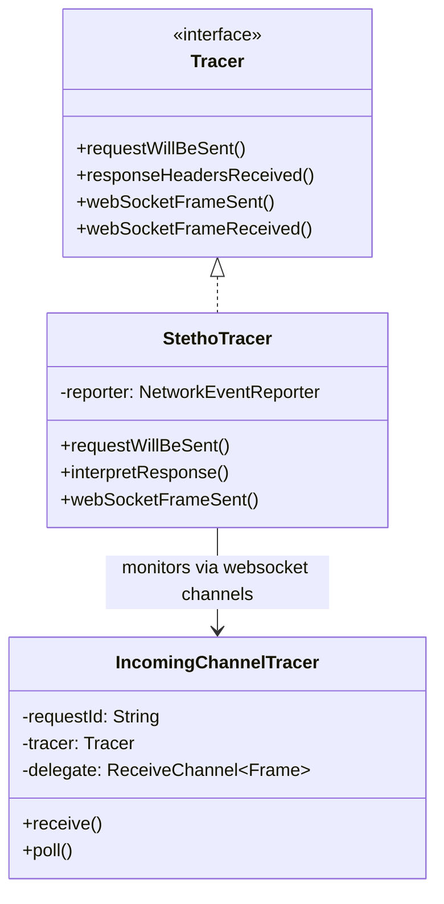
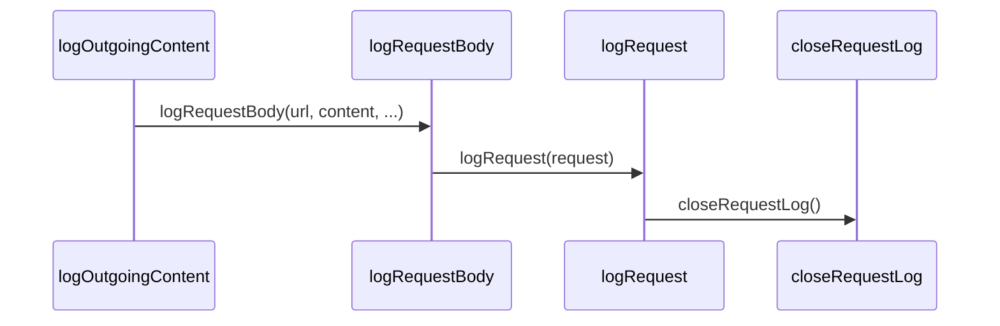

# Client Logging and Tracing

<details>
<summary>Relevant source files</summary>

The following files were used as context for generating this wiki page:

- [ktor-client/ktor-client-plugins/ktor-client-logging/common/src/io/ktor/client/plugins/logging/Logging.kt](https://github.com/ktorio/ktor/blob/main/ktor-client/ktor-client-plugins/ktor-client-logging/common/src/io/ktor/client/plugins/logging/Logging.kt)
- [ktor-client/ktor-client-core/common/src/io/ktor/client/plugins/DefaultTransform.kt](https://github.com/ktorio/ktor/blob/main/ktor-client/ktor-client-core/common/src/io/ktor/client/plugins/DefaultTransform.kt)
- [ktor-client/ktor-client-plugins/ktor-client-tracing/common/src/EngineWIthTracer.kt](https://github.com/ktorio/ktor/blob/main/ktor-client/ktor-client-plugins/ktor-client-tracing/common/src/EngineWIthTracer.kt)
- [ktor-client/ktor-client-plugins/ktor-client-tracing/ktor-client-tracing-stetho/android/src/io/ktor/client/features/tracing/StethoTracer.kt](https://github.com/ktorio/ktor/blob/main/ktor-client/ktor-client-plugins/ktor-client-tracing/ktor-client-tracing-stetho/android/src/io/ktor/client/features/tracing/StethoTracer.kt)
- [ktor-client/ktor-client-plugins/ktor-client-logging/common/src/io/ktor/client/plugins/logging/LogBodyFilter.kt](https://github.com/ktorio/ktor/blob/main/ktor-client/ktor-client-plugins/ktor-client-logging/common/src/io/ktor/client/plugins/logging/LogBodyFilter.kt)
- [ktor-client/ktor-client-plugins/ktor-client-tracing/common/src/Tracer.kt](https://github.com/ktorio/ktor/blob/main/ktor-client/ktor-client-plugins/ktor-client-tracing/common/src/Tracer.kt)
- [ktor-client/ktor-client-plugins/ktor-client-logging/common/src/io/ktor/client/plugins/logging/ObservingUtils.kt](https://github.com/ktorio/ktor/blob/main/ktor-client/ktor-client-plugins/ktor-client-logging/common/src/io/ktor/client/plugins/logging/ObservingUtils.kt)
- [ktor-client/ktor-client-plugins/ktor-client-logging/common/src/io/ktor/client/plugins/logging/LoggingUtils.kt](https://github.com/ktorio/ktor/blob/main/ktor-client/ktor-client-plugins/ktor-client-logging/common/src/io/ktor/client/plugins/logging/LoggingUtils.kt)
- [ktor-client/ktor-client-plugins/ktor-client-tracing/ktor-client-tracing-stetho/android/src/io/ktor/client/features/tracing/KtorInterceptorRequest.kt](https://github.com/ktorio/ktor/blob/main/ktor-client/ktor-client-plugins/ktor-client-tracing/ktor-client-tracing-stetho/android/src/io/ktor/client/features/tracing/KtorInterceptorRequest.kt)
- [ktor-client/ktor-client-plugins/ktor-client-logging/jvm/src/io/ktor/client/plugins/logging/LoggerJvm.kt](https://github.com/ktorio/ktor/blob/main/ktor-client/ktor-client-plugins/ktor-client-logging/jvm/src/io/ktor/client/plugins/logging/LoggerJvm.kt)
- [ktor-server/ktor-server-plugins/ktor-server-call-logging/jvm/src/io/ktor/server/plugins/calllogging/MDCHook.kt](https://github.com/ktorio/ktor/blob/main/ktor-server/ktor-server-plugins/ktor-server-call-logging/jvm/src/io/ktor/server/plugins/calllogging/MDCHook.kt)
- [ktor-server/ktor-server-core/common/src/io/ktor/server/logging/Logging.kt](https://github.com/ktorio/ktor/blob/main/ktor-server/ktor-server-core/common/src/io/ktor/server/logging/Logging.kt)
- [ktor-client/ktor-client-plugins/ktor-client-tracing/common/src/IncomingChannelTracer.kt](https://github.com/ktorio/ktor/blob/main/ktor-client/ktor-client-plugins/ktor-client-tracing/common/src/IncomingChannelTracer.kt)
- [ktor-client/ktor-client-plugins/ktor-client-tracing/ktor-client-tracing-stetho/android/src/io/ktor/client/features/tracing/KtorInterceptorResponse.kt](https://github.com/ktorio/ktor/blob/main/ktor-client/ktor-client-plugins/ktor-client-tracing/ktor-client-tracing-stetho/android/src/io/ktor/client/features/tracing/KtorInterceptorResponse.kt)
- [ktor-client/ktor-client-core/jvm/src/io/ktor/client/plugins/observer/ResponseObserverContextJvm.kt](https://github.com/ktorio/ktor/blob/main/ktor-client/ktor-client-core/jvm/src/io/ktor/client/plugins/observer/ResponseObserverContextJvm.kt)
- [ktor-client/ktor-client-plugins/ktor-client-tracing/ktor-client-tracing-stetho/android/src/io/ktor/client/features/tracing/KtorInspectorWebSocketRequest.kt](https://github.com/ktorio/ktor/blob/main/ktor-client/ktor-client-plugins/ktor-client-tracing/ktor-client-tracing-stetho/android/src/io/ktor/client/features/tracing/KtorInspectorWebSocketRequest.kt)
- [ktor-client/ktor-client-core/common/src/io/ktor/client/plugins/api/KtorCallContexts.kt](https://github.com/ktorio/ktor/blob/main/ktor-client/ktor-client-core/common/src/io/ktor/client/plugins/api/KtorCallContexts.kt)
- [ktor-client/ktor-client-plugins/ktor-client-tracing/ktor-client-tracing-stetho/android/src/io/ktor/client/features/tracing/KtorInspectorWebSocketResponse.kt](https://github.com/ktorio/ktor/blob/main/ktor-client/ktor-client-plugins/ktor-client-tracing/ktor-client-tracing-stetho/android/src/io/ktor/client/features/tracing/KtorInspectorWebSocketResponse.kt)
- [ktor-client/ktor-client-plugins/ktor-client-tracing/ktor-client-tracing-stetho/android/src/io/ktor/client/features/tracing/KtorInspectorWebSocketFrame.kt](https://github.com/ktorio/ktor/blob/main/ktor-client/ktor-client-plugins/ktor-client-tracing/ktor-client-tracing-stetho/android/src/io/ktor/client/features/tracing/KtorInspectorWebSocketFrame.kt)
- [ktor-client/ktor-client-plugins/ktor-client-logging/common/src/io/ktor/client/plugins/logging/HttpClientCallLogger.kt](https://github.com/ktorio/ktor/blob/main/ktor-client/ktor-client-plugins/ktor-client-logging/common/src/io/ktor/client/plugins/logging/HttpClientCallLogger.kt)
</details>

## Overview

### Overview Details

The Client Logging and Tracing subsystem in Ktor provides robust, extensible instrumentation for monitoring HTTP requests, responses, and WebSocket lifecycle events in Ktor HTTP clients. It addresses the fundamental requirement of observability during network interactions by intercepting client request pipelines, response processing, and engine-level execution streams without disrupting core business logic.
Sources: [Logging.kt:126-140](https://github.com/ktorio/ktor/blob/main/ktor-client/ktor-client-plugins/ktor-client-logging/common/src/io/ktor/client/plugins/logging/Logging.kt#L126-L140)

At its architecture core, the subsystem separates standard text-based and structured logging (`Logging` plugin, `Logger`, `LogBodyFilter`) from deep wire-level inspection and tracing (`EngineWithTracer`, `Tracer`, Stetho integration). The `Logging` plugin operates via client hooks (`SendHook`, `ResponseHook`, `ReceiveHook`) to capture headers, method metadata, and stream bodies, synchronizing concurrent coroutine writes using `HttpClientCallLogger`. Meanwhile, tracing modules wrap engine executions (`EngineWithTracer`) to feed raw network events, handshake sequences, and binary WebSocket frames directly into diagnostic environments like Chrome DevTools via Stetho.
Sources: [Logging.kt:531-636](https://github.com/ktorio/ktor/blob/main/ktor-client/ktor-client-plugins/ktor-client-logging/common/src/io/ktor/client/plugins/logging/Logging.kt#L531-L636), [EngineWIthTracer.kt:24-27](https://github.com/ktorio/ktor/blob/main/ktor-client/ktor-client-plugins/ktor-client-tracing/common/src/EngineWIthTracer.kt#L24-L27)

Design decisions emphasize non-blocking stream splitting, memory safety, and customizable redaction. Because Ktor streams bodies via `ByteReadChannel` instances that can only be read once, logging utilities employ channel-splitting strategies (`copyToBoth`) or response observers to observe streaming payloads safely. Headers containing sensitive data can be programmatically sanitized, preventing accidental credential leaks in production logs.
Sources: [Logging.kt:113-115](https://github.com/ktorio/ktor/blob/main/ktor-client/ktor-client-plugins/ktor-client-logging/common/src/io/ktor/client/plugins/logging/Logging.kt#L113-L115), [ObservingUtils.kt:12-40](https://github.com/ktorio/ktor/blob/main/ktor-client/ktor-client-plugins/ktor-client-logging/common/src/io/ktor/client/plugins/logging/ObservingUtils.kt#L12-L40)

---

## Logging Plugin Configuration and Options

### Configuration Overview

The `Logging` plugin is configured via `LoggingConfig`, exposing granular control over verbosity, formatting styles, header sanitization, and body filtering.
Sources: [Logging.kt:47-116](https://github.com/ktorio/ktor/blob/main/ktor-client/ktor-client-plugins/ktor-client-logging/common/src/io/ktor/client/plugins/logging/Logging.kt#L47-L116)


Sources: [Logging.kt:30-116](https://github.com/ktorio/ktor/blob/main/ktor-client/ktor-client-plugins/ktor-client-logging/common/src/io/ktor/client/plugins/logging/Logging.kt#L30-L116), [Logging.kt:126-140](https://github.com/ktorio/ktor/blob/main/ktor-client/ktor-client-plugins/ktor-client-logging/common/src/io/ktor/client/plugins/logging/Logging.kt#L126-L140)

### Configuration Options Table

| Option | Type | Default | Purpose |
| :--- | :--- | :--- | :--- |
| `format` | `LoggingFormat` | `LoggingFormat.Default` | Chooses between Ktor's default layout or `LoggingFormat.OkHttp`. |
| `logger` | `Logger` | `Logger.DEFAULT` | Destination backend for log output strings. |
| `level` | `LogLevel` | `LogLevel.HEADERS` | Verbosity threshold (`NONE`, `INFO`, `HEADERS`, `BODY`, `ALL`). |
| `bodyFilter` | `LogBodyFilter` | `BinaryLogBodyFilter` | Inspects bodies to selectively buffer, omit, or transform content. |
Sources: [Logging.kt:48-94](https://github.com/ktorio/ktor/blob/main/ktor-client/ktor-client-plugins/ktor-client-logging/common/src/io/ktor/client/plugins/logging/Logging.kt#L48-L94)

> [!NOTE]
> When `LoggingFormat.OkHttp` is enabled, logging hooks switch to formatting request lines, headers, and completion indicators to mirror Square's OkHttp logging interceptor layout.
Sources: [Logging.kt:30-40](https://github.com/ktorio/ktor/blob/main/ktor-client/ktor-client-plugins/ktor-client-logging/common/src/io/ktor/client/plugins/logging/Logging.kt#L30-L40), [Logging.kt:131-131](https://github.com/ktorio/ktor/blob/main/ktor-client/ktor-client-plugins/ktor-client-logging/common/src/io/ktor/client/plugins/logging/Logging.kt#L131-L131)

---

## Loggers and Platform Backends

### Backend Architecture

Ktor provides abstract `Logger` interfaces with built-in JVM and Android implementations capable of handling multi-line messages and logcat limitations.
Sources: [LoggerJvm.kt:11-17](https://github.com/ktorio/ktor/blob/main/ktor-client/ktor-client-plugins/ktor-client-logging/jvm/src/io/ktor/client/plugins/logging/LoggerJvm.kt#L11-L17), [LoggerJvm.kt:76-80](https://github.com/ktorio/ktor/blob/main/ktor-client/ktor-client-plugins/ktor-client-logging/jvm/src/io/ktor/client/plugins/logging/LoggerJvm.kt#L76-L80)

On the JVM, `Logger.Companion.DEFAULT` utilizes SLF4J (`LoggerFactory.getLogger(HttpClient::class.java)`), logging messages at `info` level. For Android environments lacking SLF4J providers, `Logger.Companion.ANDROID` evaluates runtime availability of `android.util.Log` and wraps sinks in a `MessageLengthLimitingLogger`.
Sources: [LoggerJvm.kt:11-43](https://github.com/ktorio/ktor/blob/main/ktor-client/ktor-client-plugins/ktor-client-logging/jvm/src/io/ktor/client/plugins/logging/LoggerJvm.kt#L11-L43)


Sources: [LoggerJvm.kt:11-65](https://github.com/ktorio/ktor/blob/main/ktor-client/ktor-client-plugins/ktor-client-logging/jvm/src/io/ktor/client/plugins/logging/LoggerJvm.kt#L11-L65), [LoggerJvm.kt:76-109](https://github.com/ktorio/ktor/blob/main/ktor-client/ktor-client-plugins/ktor-client-logging/jvm/src/io/ktor/client/plugins/logging/LoggerJvm.kt#L76-L109)

> [!IMPORTANT]
> `MessageLengthLimitingLogger` protects against Android Logcat truncation by enforcing a default `maxLength` of `4000` characters, recursively splitting long strings at newline boundaries located between `minLength` (`3000`) and `maxLength`.
Sources: [LoggerJvm.kt:76-109](https://github.com/ktorio/ktor/blob/main/ktor-client/ktor-client-plugins/ktor-client-logging/jvm/src/io/ktor/client/plugins/logging/LoggerJvm.kt#L76-L109)

---

## Body Filtering and Inspection Strategy

### Inspection Algorithm

Because HTTP streams can contain arbitrary binary payloads or compressed content, `LogBodyFilter` implementations analyze content-type and header flags before processing bytes.
Sources: [LogBodyFilter.kt:20-62](https://github.com/ktorio/ktor/blob/main/ktor-client/ktor-client-plugins/ktor-client-logging/common/src/io/ktor/client/plugins/logging/LogBodyFilter.kt#L20-L62), [LogBodyFilter.kt:110-117](https://github.com/ktorio/ktor/blob/main/ktor-client/ktor-client-plugins/ktor-client-logging/common/src/io/ktor/client/plugins/logging/LogBodyFilter.kt#L110-L117)

The default implementation, `BinaryLogBodyFilter`, executes an inspection algorithm on incoming or outgoing byte channels:
1. If the `ContentEncoding` header is present, it immediately short-circuits to `BodyFilterResult.Skip("encoded", contentLength)`.
2. If the `ContentType` is recognized as a text type (`contentType.isTextType()`), it buffers and returns text content.
3. For unspecified or ambiguous content types, it reads an initial chunk of up to `1024` bytes. It attempts UTF-8 decoding; if a `MalformedInputException` occurs or replacement characters (`\ufffd`) appear outside the final index, `isBinary` is flagged true, resulting in a skipped body log (`BodyFilterResult.Skip("binary", contentLength)`). Otherwise, the channel is buffered and returned as text.
Sources: [LogBodyFilter.kt:110-176](https://github.com/ktorio/ktor/blob/main/ktor-client/ktor-client-plugins/ktor-client-logging/common/src/io/ktor/client/plugins/logging/LogBodyFilter.kt#L110-L176)


Sources: [LogBodyFilter.kt:110-176](https://github.com/ktorio/ktor/blob/main/ktor-client/ktor-client-plugins/ktor-client-logging/common/src/io/ktor/client/plugins/logging/LogBodyFilter.kt#L110-L176)

---

## Concurrent Call Logging and Synchronization

### Synchronization Mechanics

The `HttpClientCallLogger` class coordinates asynchronous logging across request and response lifecycles. Since requests and responses execute across asynchronous coroutine boundaries, messages are accumulated in memory buffers and guarded by atomic flags and job completion primitives.
Sources: [HttpClientCallLogger.kt:10-18](https://github.com/ktorio/ktor/blob/main/ktor-client/ktor-client-plugins/ktor-client-logging/common/src/io/ktor/client/plugins/logging/HttpClientCallLogger.kt#L10-L18)


Sources: [HttpClientCallLogger.kt:19-57](https://github.com/ktorio/ktor/blob/main/ktor-client/ktor-client-plugins/ktor-client-logging/common/src/io/ktor/client/plugins/logging/HttpClientCallLogger.kt#L19-L57)

> [!CAUTION]
> `closeResponseLog()` explicitly executes `requestLoggedMonitor.join()` before flushing response logs. This ensures request logs always print ahead of response logs even if response completion finishes out of order.
Sources: [HttpClientCallLogger.kt:51-57](https://github.com/ktorio/ktor/blob/main/ktor-client/ktor-client-plugins/ktor-client-logging/common/src/io/ktor/client/plugins/logging/HttpClientCallLogger.kt#L51-L57)

---

## Tracing Architecture and Engine Wrappers

### Engine Wrappers

While logging records text representations of HTTP transactions, tracing focuses on engine-level execution events, round-trip timings, and protocol upgrades (such as WebSockets).
Sources: [EngineWIthTracer.kt:17-27](https://github.com/ktorio/ktor/blob/main/ktor-client/ktor-client-plugins/ktor-client-tracing/common/src/EngineWIthTracer.kt#L17-L27)

The `EngineWithTracer` class wraps any `HttpClientEngine`, assigning a monotonically increasing request ID via `atomic(0)` and invoking corresponding `Tracer` methods during execution milestones.
Sources: [EngineWIthTracer.kt:24-34](https://github.com/ktorio/ktor/blob/main/ktor-client/ktor-client-plugins/ktor-client-tracing/common/src/EngineWIthTracer.kt#L24-L34)


Sources: [EngineWIthTracer.kt:31-58](https://github.com/ktorio/ktor/blob/main/ktor-client/ktor-client-plugins/ktor-client-tracing/common/src/EngineWIthTracer.kt#L31-L58), [EngineWIthTracer.kt:81-104](https://github.com/ktorio/ktor/blob/main/ktor-client/ktor-client-plugins/ktor-client-tracing/common/src/EngineWIthTracer.kt#L81-L104)

---

## Stetho Integration and WebSocket Tracing

### Stetho and Channel Tracing

The `StethoTracer` implementation bridges Ktor's tracing hooks with Facebook's Stetho network inspector, allowing real-time inspection of HTTP requests, responses, and WebSocket frames in Chrome DevTools.
Sources: [StethoTracer.kt:25-29](https://github.com/ktorio/ktor/blob/main/ktor-client/ktor-client-plugins/ktor-client-tracing/ktor-client-tracing-stetho/android/src/io/ktor/client/features/tracing/StethoTracer.kt#L25-L29)

For WebSockets, `IncomingChannelTracer` intercepts incoming `ReceiveChannel<Frame>` operations (`poll`, `receive`, `receiveOrClosed`, `receiveOrNull`, and `ChannelIterator.next`), ensuring every received control or data frame is reported to Stetho via `tracer.webSocketFrameReceived`.
Sources: [IncomingChannelTracer.kt:11-52](https://github.com/ktorio/ktor/blob/main/ktor-client/ktor-client-plugins/ktor-client-tracing/common/src/IncomingChannelTracer.kt#L11-L52), [IncomingChannelTracer.kt:54-65](https://github.com/ktorio/ktor/blob/main/ktor-client/ktor-client-plugins/ktor-client-tracing/common/src/IncomingChannelTracer.kt#L54-L65)


Sources: [StethoTracer.kt:29-118](https://github.com/ktorio/ktor/blob/main/ktor-client/ktor-client-plugins/ktor-client-tracing/ktor-client-tracing-stetho/android/src/io/ktor/client/features/tracing/StethoTracer.kt#L29-L118), [IncomingChannelTracer.kt:11-52](https://github.com/ktorio/ktor/blob/main/ktor-client/ktor-client-plugins/ktor-client-tracing/common/src/IncomingChannelTracer.kt#L11-L52)

---

## Call-Chain Execution Walkthroughs

### 1. Request Body Logging and Closing Walkthrough

The following call chain details the step-by-step execution path when an outgoing request body is logged, processed, and closed.

1. **`logOutgoingContent` invocation:** Processes `OutgoingContent` hierarchies, dispatching byte arrays, multipart content, or read/write channels.
Sources: [Logging.kt:184-264](https://github.com/ktorio/ktor/blob/main/ktor-client/ktor-client-plugins/ktor-client-logging/common/src/io/ktor/client/plugins/logging/Logging.kt#L184-L264)
2. **`logRequestBody` invocation:** Passes the filtered body and content length to format body lines and termination markers.
Sources: [Logging.kt:141-182](https://github.com/ktorio/ktor/blob/main/ktor-client/ktor-client-plugins/ktor-client-logging/common/src/io/ktor/client/plugins/logging/Logging.kt#L141-L182)
3. **`logRequest` assembly:** Builds the complete header and request message structure, associating it with `HttpClientCallLogger`.
Sources: [Logging.kt:482-524](https://github.com/ktorio/ktor/blob/main/ktor-client/ktor-client-plugins/ktor-client-logging/common/src/io/ktor/client/plugins/logging/Logging.kt#L482-L524)
4. **`closeRequestLog` finalization:** Atomically flags request logging as completed and flushes buffered logs to the logger backend.
Sources: [HttpClientCallLogger.kt:37-49](https://github.com/ktorio/ktor/blob/main/ktor-client/ktor-client-plugins/ktor-client-logging/common/src/io/ktor/client/plugins/logging/HttpClientCallLogger.kt#L37-49)


Sources: [Logging.kt:141-264](https://github.com/ktorio/ktor/blob/main/ktor-client/ktor-client-plugins/ktor-client-logging/common/src/io/ktor/client/plugins/logging/Logging.kt#L141-L264), [Logging.kt:482-524](https://github.com/ktorio/ktor/blob/main/ktor-client/ktor-client-plugins/ktor-client-logging/common/src/io/ktor/client/plugins/logging/Logging.kt#L482-L524), [HttpClientCallLogger.kt:37-49](https://github.com/ktorio/ktor/blob/main/ktor-client/ktor-client-plugins/ktor-client-logging/common/src/io/ktor/client/plugins/logging/HttpClientCallLogger.kt#L37-49)

---

## Runnable Example

### Client Setup Example

The following example demonstrates how to configure an `HttpClient` with both the `Logging` plugin (featuring custom header sanitization and log levels) and Stetho tracing wrappers.
Sources: [Logging.kt:48-116](https://github.com/ktorio/ktor/blob/main/ktor-client/ktor-client-plugins/ktor-client-logging/common/src/io/ktor/client/plugins/logging/Logging.kt#L48-L116), [Logging.kt:675-677](https://github.com/ktorio/ktor/blob/main/ktor-client/ktor-client-plugins/ktor-client-logging/common/src/io/ktor/client/plugins/logging/Logging.kt#L675-L677)

```kotlin
import io.ktor.client.*
import io.ktor.client.engine.cio.*
import io.ktor.client.plugins.logging.*
import io.ktor.http.*

val client = HttpClient(CIO) {
    install(Logging) {
        logger = Logger.DEFAULT
        level = LogLevel.ALL
        format = LoggingFormat.Default
        
        // Sanitize authorization headers in logs
        sanitizeHeader { header -> header == HttpHeaders.Authorization }
        
        // Filter out calls to specific endpoints
        filter { request -> !request.url.encodedPath.contains("/healthz") }
    }
}
```
Sources: [Logging.kt:48-116](https://github.com/ktorio/ktor/blob/main/ktor-client/ktor-client-plugins/ktor-client-logging/common/src/io/ktor/client/plugins/logging/Logging.kt#L48-L116), [Logging.kt:675-677](https://github.com/ktorio/ktor/blob/main/ktor-client/ktor-client-plugins/ktor-client-logging/common/src/io/ktor/client/plugins/logging/Logging.kt#L675-L677)

## Related

- [[Client Core]]

