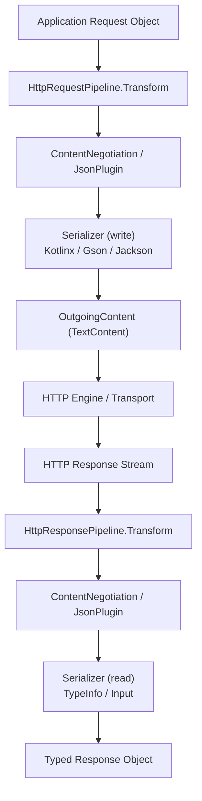
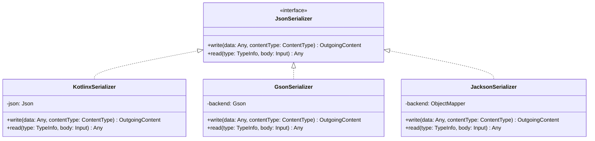
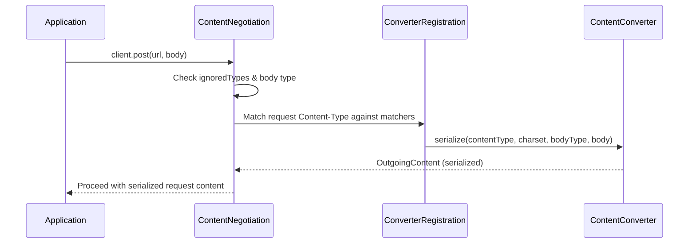

# Client Serialization

<details>
<summary>Relevant source files</summary>

The following files were used as context for generating this wiki page:

- [ktor-client/ktor-client-core/common/src/io/ktor/client/HttpClient.kt](https://github.com/ktorio/ktor/blob/main/ktor-client/ktor-client-core/common/src/io/ktor/client/HttpClient.kt)
- [ktor-client/ktor-client-plugins/ktor-client-json/common/src/io/ktor/client/plugins/json/JsonPlugin.kt](https://github.com/ktorio/ktor/blob/main/ktor-client/ktor-client-plugins/ktor-client-json/common/src/io/ktor/client/plugins/json/JsonPlugin.kt)
- [ktor-client/ktor-client-core/common/src/io/ktor/client/plugins/DefaultTransform.kt](https://github.com/ktorio/ktor/blob/main/ktor-client/ktor-client-core/common/src/io/ktor/client/plugins/DefaultTransform.kt)
- [ktor-client/ktor-client-plugins/ktor-client-content-negotiation/common/src/io/ktor/client/plugins/contentnegotiation/ContentNegotiation.kt](https://github.com/ktorio/ktor/blob/main/ktor-client/ktor-client-plugins/ktor-client-content-negotiation/common/src/io/ktor/client/plugins/contentnegotiation/ContentNegotiation.kt)
- [ktor-client/ktor-client-android/jvm/src/io/ktor/client/engine/android/AndroidClientEngine.kt](https://github.com/ktorio/ktor/blob/main/ktor-client/ktor-client-android/jvm/src/io/ktor/client/engine/android/AndroidClientEngine.kt)
- [ktor-client/ktor-client-plugins/ktor-client-json/ktor-client-serialization/common/src/io/ktor/client/plugins/kotlinx/serializer/KotlinxSerializer.kt](https://github.com/ktorio/ktor/blob/main/ktor-client/ktor-client-plugins/ktor-client-json/ktor-client-serialization/common/src/io/ktor/client/plugins/kotlinx/serializer/KotlinxSerializer.kt)
- [ktor-client/ktor-client-core/common/src/io/ktor/client/plugins/HttpPlainText.kt](https://github.com/ktorio/ktor/blob/main/ktor-client/ktor-client-core/common/src/io/ktor/client/plugins/HttpPlainText.kt)
- [ktor-client/ktor-client-cio/common/src/io/ktor/client/engine/cio/utils.kt](https://github.com/ktorio/ktor/blob/main/ktor-client/ktor-client-cio/common/src/io/ktor/client/engine/cio/utils.kt)
- [ktor-client/ktor-client-core/common/src/io/ktor/client/request/HttpRequestPipeline.kt](https://github.com/ktorio/ktor/blob/main/ktor-client/ktor-client-core/common/src/io/ktor/client/request/HttpRequestPipeline.kt)
- [ktor-client/ktor-client-core/common/src/io/ktor/client/plugins/api/CommonHooks.kt](https://github.com/ktorio/ktor/blob/main/ktor-client/ktor-client-core/common/src/io/ktor/client/plugins/api/CommonHooks.kt)
- [ktor-client/ktor-client-core/jvm/src/io/ktor/client/plugins/DefaultTransformersJvm.kt](https://github.com/ktorio/ktor/blob/main/ktor-client/ktor-client-core/jvm/src/io/ktor/client/plugins/DefaultTransformersJvm.kt)
- [ktor-client/ktor-client-plugins/ktor-client-json/common/src/io/ktor/client/plugins/json/JsonSerializer.kt](https://github.com/ktorio/ktor/blob/main/ktor-client/ktor-client-plugins/ktor-client-json/common/src/io/ktor/client/plugins/json/JsonSerializer.kt)
- [ktor-client/ktor-client-plugins/ktor-client-json/ktor-client-gson/jvm/src/io/ktor/client/plugins/gson/GsonSerializer.kt](https://github.com/ktorio/ktor/blob/main/ktor-client/ktor-client-plugins/ktor-client-json/ktor-client-gson/jvm/src/io/ktor/client/plugins/gson/GsonSerializer.kt)
- [ktor-client/ktor-client-core/common/src/io/ktor/client/plugins/api/KtorCallContexts.kt](https://github.com/ktorio/ktor/blob/main/ktor-client/ktor-client-core/common/src/io/ktor/client/plugins/api/KtorCallContexts.kt)
- [ktor-client/ktor-client-plugins/ktor-client-json/ktor-client-jackson/jvm/src/io/ktor/client/plugins/jackson/JacksonSerializer.kt](https://github.com/ktorio/ktor/blob/main/ktor-client/ktor-client-plugins/ktor-client-json/ktor-client-jackson/jvm/src/io/ktor/client/plugins/jackson/JacksonSerializer.kt)
- [ktor-client/ktor-client-plugins/ktor-client-json/ktor-client-serialization/posix/src/SerializerInitializer.kt](https://github.com/ktorio/ktor/blob/main/ktor-client/ktor-client-plugins/ktor-client-json/ktor-client-serialization/posix/src/SerializerInitializer.kt)
- [ktor-client/ktor-client-plugins/ktor-client-json/ktor-client-serialization/js/src/SerializerInitializer.kt](https://github.com/ktorio/ktor/blob/main/ktor-client/ktor-client-plugins/ktor-client-json/ktor-client-serialization/js/src/SerializerInitializer.kt)
- [ktor-client/ktor-client-plugins/ktor-client-json/web/src/io/ktor/client/plugins/json/Default.web.kt](https://github.com/ktorio/ktor/blob/main/ktor-client/ktor-client-plugins/ktor-client-json/web/src/io/ktor/client/plugins/json/Default.web.kt)
- [ktor-client/ktor-client-plugins/ktor-client-json/ktor-client-serialization/wasmJs/src/SerializerInitializer.kt](https://github.com/ktorio/ktor/blob/main/ktor-client/ktor-client-plugins/ktor-client-json/ktor-client-serialization/wasmJs/src/SerializerInitializer.kt)
- [ktor-client/ktor-client-core/common/src/io/ktor/client/plugins/DataConversion.kt](https://github.com/ktorio/ktor/blob/main/ktor-client/ktor-client-core/common/src/io/ktor/client/plugins/DataConversion.kt)
</details>

## Overview

Client serialization in Ktor provides the architectural machinery for translating structured object graphs into wire formats during HTTP requests and decoding incoming raw byte streams back into typed objects upon receiving responses. Rather than forcing applications to manually serialize payloads into JSON or plain text, Ktor integrates serialization into its request and response pipelines through content negotiation plugins, format-specific serializers, and default transformers.

Sources: [ktor-client/ktor-client-plugins/ktor-client-json/common/src/io/ktor/client/plugins/json/JsonPlugin.kt:227-256](https://github.com/ktorio/ktor/blob/main/ktor-client/ktor-client-plugins/ktor-client-json/common/src/io/ktor/client/plugins/json/JsonPlugin.kt#L227-L256)

The subsystem bridges high-level domain models with transport-layer byte channels. It resolves content types, manages `Accept` and `Content-Type` headers via configurable merge strategies, and dispatches serialization tasks to registered converters like `KotlinxSerializer`, `GsonSerializer`, or `JacksonSerializer`.

Sources: [ktor-client/ktor-client-plugins/ktor-client-content-negotiation/common/src/io/ktor/client/plugins/contentnegotiation/ContentNegotiation.kt:350-359](https://github.com/ktorio/ktor/blob/main/ktor-client/ktor-client-plugins/ktor-client-content-negotiation/common/src/io/ktor/client/plugins/contentnegotiation/ContentNegotiation.kt#L350-L359)

By intercepting `HttpRequestPipeline.Transform` and `HttpResponsePipeline.Transform`, the framework automatically transparently transforms outgoing data objects into `OutgoingContent` instances and parses incoming `ByteReadChannel` streams into reified types.

Sources: [ktor-client/ktor-client-plugins/ktor-client-content-negotiation/common/src/io/ktor/client/plugins/contentnegotiation/ContentNegotiation.kt:232-235](https://github.com/ktorio/ktor/blob/main/ktor-client/ktor-client-plugins/ktor-client-content-negotiation/common/src/io/ktor/client/plugins/contentnegotiation/ContentNegotiation.kt#L232-L235)



Sources: [ktor-client/ktor-client-plugins/ktor-client-json/common/src/io/ktor/client/plugins/json/JsonPlugin.kt:227-256](https://github.com/ktorio/ktor/blob/main/ktor-client/ktor-client-plugins/ktor-client-json/common/src/io/ktor/client/plugins/json/JsonPlugin.kt#L227-L256)

---

## Architecture and Core Components

The client serialization architecture is structured around extensible pipeline stages and pluggable serialization backends. The core components include `ContentNegotiation`, the legacy `JsonPlugin`, backend-agnostic interfaces like `JsonSerializer`, and low-level default transformers.

Sources: [ktor-client/ktor-client-plugins/ktor-client-content-negotiation/common/src/io/ktor/client/plugins/contentnegotiation/ContentNegotiation.kt:232-235](https://github.com/ktorio/ktor/blob/main/ktor-client/ktor-client-plugins/ktor-client-content-negotiation/common/src/io/ktor/client/plugins/contentnegotiation/ContentNegotiation.kt#L232-L235)



Sources: [ktor-client/ktor-client-plugins/ktor-client-json/common/src/io/ktor/client/plugins/json/JsonSerializer.kt:22-44](https://github.com/ktorio/ktor/blob/main/ktor-client/ktor-client-plugins/ktor-client-json/common/src/io/ktor/client/plugins/json/JsonSerializer.kt#L22-L44)

The framework relies on `ContentNegotiation` as the primary integration point for modern applications while maintaining backwards-compatible support for `JsonPlugin` and primitive text handling via `HttpPlainText`.

Sources: [ktor-client/ktor-client-plugins/ktor-client-json/common/src/io/ktor/client/plugins/json/JsonPlugin.kt:63-68](https://github.com/ktorio/ktor/blob/main/ktor-client/ktor-client-plugins/ktor-client-json/common/src/io/ktor/client/plugins/json/JsonPlugin.kt#L63-L68)

---

## Content Negotiation and Conversion

`ContentNegotiation` coordinates media type negotiation and body serialization. During request preparation, it evaluates registered converters, filters out excluded content types, and applies `ContentTypeMergeStrategy` rules to populate the `Accept` header.

Sources: [ktor-client/ktor-client-plugins/ktor-client-content-negotiation/common/src/io/ktor/client/plugins/contentnegotiation/ContentNegotiation.kt:239-257](https://github.com/ktorio/ktor/blob/main/ktor-client/ktor-client-plugins/ktor-client-content-negotiation/common/src/io/ktor/client/plugins/contentnegotiation/ContentNegotiation.kt#L239-L257)



Sources: [ktor-client/ktor-client-plugins/ktor-client-content-negotiation/common/src/io/ktor/client/plugins/contentnegotiation/ContentNegotiation.kt:239-308](https://github.com/ktorio/ktor/blob/main/ktor-client/ktor-client-plugins/ktor-client-content-negotiation/common/src/io/ktor/client/plugins/contentnegotiation/ContentNegotiation.kt#L239-308)

When processing incoming responses, `ContentNegotiation` extracts the response content type and charset, locates suitable matching converters, and invokes `deserialize` on the underlying `ByteReadChannel`.

> [!NOTE]
> If a request body or response type matches any class listed in `ignoredTypes` (such as `ByteArray`, `String`, `HttpStatusCode`, `ByteReadChannel`, or `OutgoingContent`), content negotiation is bypassed entirely, handing execution directly to default transformers.

Sources: [ktor-client/ktor-client-plugins/ktor-client-content-negotiation/common/src/io/ktor/client/plugins/contentnegotiation/ContentNegotiation.kt:24-32](https://github.com/ktorio/ktor/blob/main/ktor-client/ktor-client-plugins/ktor-client-content-negotiation/common/src/io/ktor/client/plugins/contentnegotiation/ContentNegotiation.kt#L24-32), [ktor-client/ktor-client-plugins/ktor-client-content-negotiation/common/src/io/ktor/client/plugins/contentnegotiation/ContentNegotiation.kt:319-348](https://github.com/ktorio/ktor/blob/main/ktor-client/ktor-client-plugins/ktor-client-content-negotiation/common/src/io/ktor/client/plugins/contentnegotiation/ContentNegotiation.kt#L319-L348)

---

## Serializer Backends and Implementations

Ktor supports multiple serialization engines through the `JsonSerializer` interface or standard `ContentConverter` integrations. The table below outlines the available serializer implementations across platforms:

| Serializer Class | Backend Library | Supported Target Platforms | Key Configuration Hook / Builder |
| :--- | :--- | :--- | :--- |
| `KotlinxSerializer` | `kotlinx.serialization` | Multiplatform (JVM, JS, Native, Wasm) | `Json { ... }` configuration block |
| `GsonSerializer` | Google Gson | JVM | `GsonBuilder.() -> Unit` |
| `JacksonSerializer` | Jackson ObjectMapper | JVM | `ObjectMapper.() -> Unit` |

Sources: [ktor-client/ktor-client-plugins/ktor-client-json/ktor-client-serialization/common/src/io/ktor/client/plugins/kotlinx/serializer/KotlinxSerializer.kt:29-61](https://github.com/ktorio/ktor/blob/main/ktor-client/ktor-client-plugins/ktor-client-json/ktor-client-serialization/common/src/io/ktor/client/plugins/kotlinx/serializer/KotlinxSerializer.kt#L29-L61)

When using `KotlinxSerializer`, the helper function `buildSerializer` dynamically inspects runtime values—handling `JsonElement`, `List`, `Array`, `Set`, and `Map` instances—to resolve the appropriate `KSerializer<Any>` via context modules or class serializers.

Sources: [ktor-client/ktor-client-plugins/ktor-client-json/ktor-client-serialization/common/src/io/ktor/client/plugins/kotlinx/serializer/KotlinxSerializer.kt:64-84](https://github.com/ktorio/ktor/blob/main/ktor-client/ktor-client-plugins/ktor-client-json/ktor-client-serialization/common/src/io/ktor/client/plugins/kotlinx/serializer/KotlinxSerializer.kt#L64-84)

```kotlin
val client = HttpClient {
    install(ContentNegotiation) {
        json(Json {
            ignoreUnknownKeys = true
            isLenient = true
        })
    }
}
```

Sources: [ktor-client/ktor-client-plugins/ktor-client-json/ktor-client-serialization/common/src/io/ktor/client/plugins/kotlinx/serializer/KotlinxSerializer.kt:55-60](https://github.com/ktorio/ktor/blob/main/ktor-client/ktor-client-plugins/ktor-client-json/ktor-client-serialization/common/src/io/ktor/client/plugins/kotlinx/serializer/KotlinxSerializer.kt#L55-L60)

---

## Default Transformers and Plain Text Handling

When structured serialization plugins are not triggered or for standard primitives, `DefaultTransform` and `HttpPlainText` manage low-level payload rendering and parsing. 

Sources: [ktor-client/ktor-client-core/common/src/io/ktor/client/plugins/DefaultTransform.kt:33-66](https://github.com/ktorio/ktor/blob/main/ktor-client/ktor-client-core/common/src/io/ktor/client/plugins/DefaultTransform.kt#L33-L66)

`DefaultTransform` intercepts the request pipeline's `Render` phase to convert `String`, `ByteArray`, `ByteReadChannel`, and platform-specific types (such as JVM `InputStream`) into `OutgoingContent` subclasses. On the response pipeline's `Parse` phase, it transforms incoming raw channels into requested target types like `Unit`, `Int`, `ByteArray`, `ByteReadChannel`, or `HttpStatusCode`.

Sources: [ktor-client/ktor-client-core/common/src/io/ktor/client/plugins/DefaultTransform.kt:68-146](https://github.com/ktorio/ktor/blob/main/ktor-client/ktor-client-core/common/src/io/ktor/client/plugins/DefaultTransform.kt#L68-L146)

```kotlin
val response: HttpResponse = client.get("https://httpbin.org/bytes/10")
val bytes: ByteArray = response.body()
```

Sources: [ktor-client/ktor-client-core/common/src/io/ktor/client/plugins/DefaultTransform.kt:87-96](https://github.com/ktorio/ktor/blob/main/ktor-client/ktor-client-core/common/src/io/ktor/client/plugins/DefaultTransform.kt#L87-L96)

`HttpPlainText` complements this by managing text encodings and charsets. It constructs `Accept-Charset` headers based on registered quality values (`q`) and wraps string request bodies into `TextContent` using the resolved charset.

Sources: [ktor-client/ktor-client-core/common/src/io/ktor/client/plugins/HttpPlainText.kt:74-120](https://github.com/ktorio/ktor/blob/main/ktor-client/ktor-client-core/common/src/io/ktor/client/plugins/HttpPlainText.kt#L74-L120)

> [!WARNING]
> RFC-9110 assumes `UTF-8` as the default text encoding. `HttpPlainText` avoids injecting an `Accept-Charset` header unless non-UTF-8 charsets or explicit quality weights are registered in `HttpPlainTextConfig`.

Sources: [ktor-client/ktor-client-core/common/src/io/ktor/client/plugins/HttpPlainText.kt:83-86](https://github.com/ktorio/ktor/blob/main/ktor-client/ktor-client-core/common/src/io/ktor/client/plugins/HttpPlainText.kt#L83-L86)

---

## Configuration Options and Merge Strategies

`ContentNegotiationConfig` and `JsonPlugin.Config` expose granular configuration parameters to control how content types and serialization rules behave.

Sources: [ktor-client/ktor-client-plugins/ktor-client-content-negotiation/common/src/io/ktor/client/plugins/contentnegotiation/ContentNegotiation.kt:101-129](https://github.com/ktorio/ktor/blob/main/ktor-client/ktor-client-plugins/ktor-client-content-negotiation/common/src/io/ktor/client/plugins/contentnegotiation/ContentNegotiation.kt#L101-L129)

| Configuration Property | Type | Default Value | Description |
| :--- | :--- | :--- | :--- |
| `acceptHeaderMergeStrategy` | `ContentTypeMergeStrategy` | `ContentTypeMergeStrategy.Default` | Determines how converter content types are merged into the request `Accept` header. |
| `defaultAcceptHeaderQValue` | `Double?` | `null` | Optional quality factor (`q`) appended to `Accept` header content types. |
| `ignoredTypes` | `MutableSet<KClass<*>>` | Standard primitive & stream types | Types excluded from content negotiation and serialization. |

Sources: [ktor-client/ktor-client-plugins/ktor-client-content-negotiation/common/src/io/ktor/client/plugins/contentnegotiation/ContentNegotiation.kt:109-128](https://github.com/ktorio/ktor/blob/main/ktor-client/ktor-client-plugins/ktor-client-content-negotiation/common/src/io/ktor/client/plugins/contentnegotiation/ContentNegotiation.kt#L109-L128)

Two built-in strategies govern `Accept` header composition:
- `ContentTypeMergeStrategy.Default`: Appends each registered content type that is not already matched in existing request accept headers.
- `ContentTypeMergeStrategy.SkipIfPresent`: Suppresses automatic `Accept` header injection entirely if any `Accept` header is already present on the request.

Sources: [ktor-client/ktor-client-plugins/ktor-client-content-negotiation/common/src/io/ktor/client/plugins/contentnegotiation/ContentNegotiation.kt:66-91](https://github.com/ktorio/ktor/blob/main/ktor-client/ktor-client-plugins/ktor-client-content-negotiation/common/src/io/ktor/client/plugins/contentnegotiation/ContentNegotiation.kt#L66-L91)

---

## Execution Walkthrough: Request Serialization Flow

The execution pathway for serializing a request body through content negotiation follows a precise sequence of pipeline interceptors and checks:

Sources: [ktor-client/ktor-client-core/common/src/io/ktor/client/request/HttpRequestPipeline.kt:43-46](https://github.com/ktorio/ktor/blob/main/ktor-client/ktor-client-core/common/src/io/ktor/client/request/HttpRequestPipeline.kt#L43-L46)

1. **Initiation**: An application calls `client.post("https://api.example.com/data") { setBody(payload) }`.
2. **Pipeline Trigger**: The request passes through `HttpRequestPipeline.Transform`.
3. **Exclusion Check**: `ContentNegotiation` verifies whether the request specifies `ExcludedContentTypes` or if `payload::class` is present in `ignoredTypes`. If ignored, transformation is skipped.
4. **Header Validation**: The request `Content-Type` header is inspected. If absent, serialization is aborted.
5. **Converter Matching**: Registered converters are filtered against `contentTypeMatcher.contains(contentType)`.
6. **Serialization**: The matching converter's `serialize()` method is invoked with the target body type and charset, producing an `OutgoingContent` instance (`TextContent`, `ByteArrayContent`, etc.).
7. **Proceeding**: The pipeline proceeds with the serialized `OutgoingContent`, removing any duplicate `Content-Type` headers before handing off to the transport engine.

Sources: [ktor-client/ktor-client-plugins/ktor-client-content-negotiation/common/src/io/ktor/client/plugins/contentnegotiation/ContentNegotiation.kt:239-308](https://github.com/ktorio/ktor/blob/main/ktor-client/ktor-client-plugins/ktor-client-content-negotiation/common/src/io/ktor/client/plugins/contentnegotiation/ContentNegotiation.kt#L239-308)

```kotlin
@Serializable
data class UserPayload(val id: Int, val name: String)

@Serializable
data class UserResponse(val status: String)

val client = HttpClient {
    install(ContentNegotiation) {
        json()
    }
}

suspend fun createUser(client: HttpClient, user: UserPayload): UserResponse {
    return client.post("https://api.example.com/users") {
        contentType(ContentType.Application.Json)
        setBody(user)
    }.body()
}
```

Sources: [ktor-client/ktor-client-core/common/src/io/ktor/client/HttpClient.kt:87-104](https://github.com/ktorio/ktor/blob/main/ktor-client/ktor-client-core/common/src/io/ktor/client/HttpClient.kt#L87-L104)

## Related

- [[Content Negotiation]]

