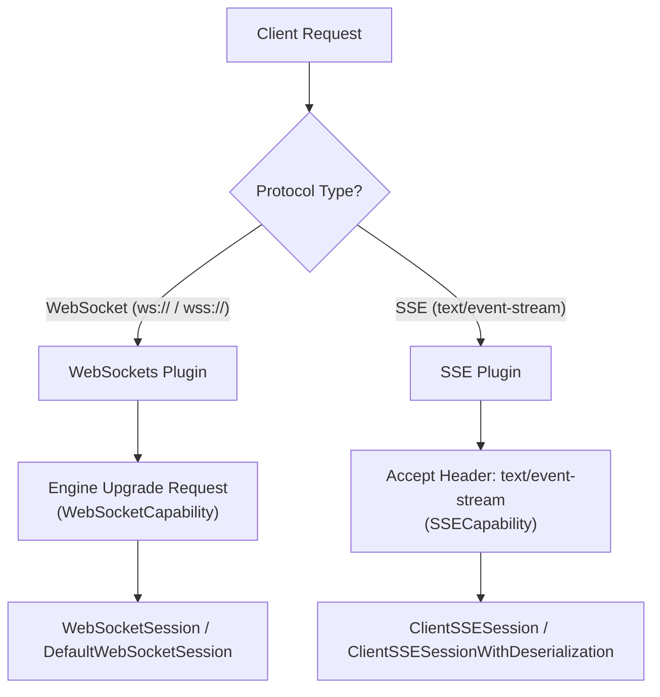
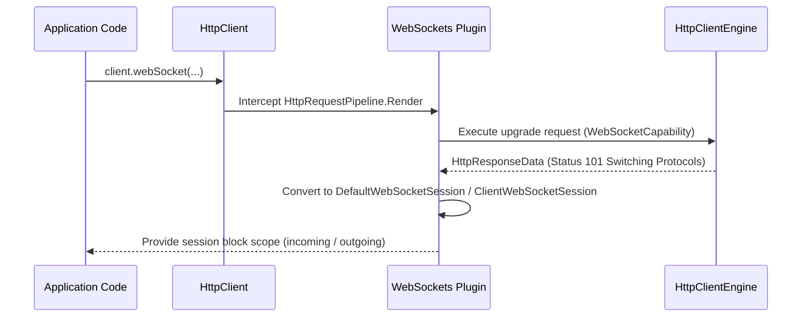
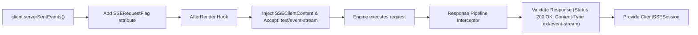
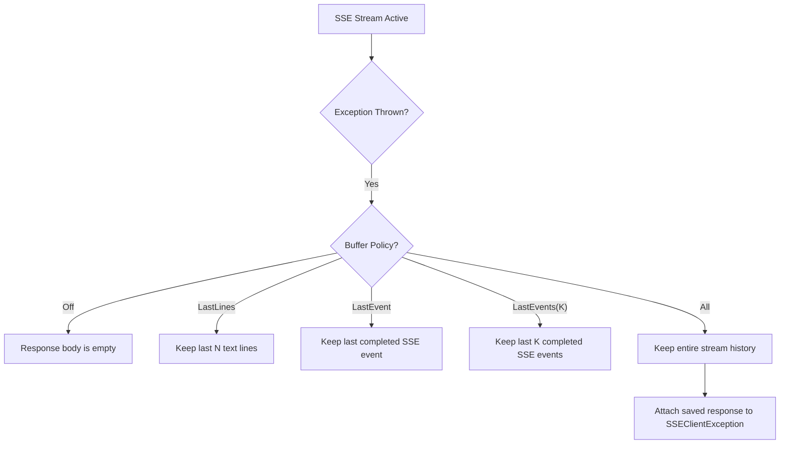

# Client WebSockets and SSE

<details>
<summary>Relevant source files</summary>

The following files were used as context for generating this wiki page:

- [ktor-client/ktor-client-core/common/src/io/ktor/client/plugins/sse/builders.kt](https://github.com/ktorio/ktor/blob/main/ktor-client/ktor-client-core/common/src/io/ktor/client/plugins/sse/builders.kt)
- [ktor-client/ktor-client-core/common/src/io/ktor/client/plugins/sse/SSE.kt](https://github.com/ktorio/ktor/blob/main/ktor-client/ktor-client-core/common/src/io/ktor/client/plugins/sse/SSE.kt)
- [ktor-client/ktor-client-core/wasmJs/src/io/ktor/client/engine/js/WasmJsClientEngine.kt](https://github.com/ktorio/ktor/blob/main/ktor-client/ktor-client-core/wasmJs/src/io/ktor/client/engine/js/WasmJsClientEngine.kt)
- [ktor-client/ktor-client-core/common/src/io/ktor/client/plugins/websocket/WebSockets.kt](https://github.com/ktorio/ktor/blob/main/ktor-client/ktor-client-core/common/src/io/ktor/client/plugins/websocket/WebSockets.kt)
- [ktor-client/ktor-client-darwin/darwin/src/io/ktor/client/engine/darwin/internal/DarwinWebsocketSession.kt](https://github.com/ktorio/ktor/blob/main/ktor-client/ktor-client-darwin/darwin/src/io/ktor/client/engine/darwin/internal/DarwinWebsocketSession.kt)
- [ktor-client/ktor-client-winhttp/windows/src/io/ktor/client/engine/winhttp/WinHttpClientEngine.kt](https://github.com/ktorio/ktor/blob/main/ktor-client/ktor-client-winhttp/windows/src/io/ktor/client/engine/winhttp/WinHttpClientEngine.kt)
- [ktor-client/ktor-client-core/js/src/io/ktor/client/engine/js/JsClientEngine.kt](https://github.com/ktorio/ktor/blob/main/ktor-client/ktor-client-core/js/src/io/ktor/client/engine/js/JsClientEngine.kt)
- [ktor-client/ktor-client-core/common/src/io/ktor/client/plugins/sse/ClientSSESession.kt](https://github.com/ktorio/ktor/blob/main/ktor-client/ktor-client-core/common/src/io/ktor/client/plugins/sse/ClientSSESession.kt)
- [ktor-client/ktor-client-curl/desktop/src/io/ktor/client/engine/curl/CurlClientEngine.kt](https://github.com/ktorio/ktor/blob/main/ktor-client/ktor-client-curl/desktop/src/io/ktor/client/engine/curl/CurlClientEngine.kt)
- [ktor-client/ktor-client-okhttp/jvm/src/io/ktor/client/engine/okhttp/OkHttpEngine.kt](https://github.com/ktorio/ktor/blob/main/ktor-client/ktor-client-okhttp/jvm/src/io/ktor/client/engine/okhttp/OkHttpEngine.kt)
- [ktor-client/ktor-client-core/common/src/io/ktor/client/HttpClient.kt](https://github.com/ktorio/ktor/blob/main/ktor-client/ktor-client-core/common/src/io/ktor/client/HttpClient.kt)
- [ktor-client/ktor-client-winhttp/windows/src/io/ktor/client/engine/winhttp/internal/WinHttpWebSocket.kt](https://github.com/ktorio/ktor/blob/main/ktor-client/ktor-client-winhttp/windows/src/io/ktor/client/engine/winhttp/internal/WinHttpWebSocket.kt)
- [ktor-client/ktor-client-cio/common/src/io/ktor/client/engine/cio/CIOEngine.kt](https://github.com/ktorio/ktor/blob/main/ktor-client/ktor-client-cio/common/src/io/ktor/client/engine/cio/CIOEngine.kt)
- [ktor-client/ktor-client-core/wasmJs/src/io/ktor/client/plugins/websocket/JsWebSocketSession.kt](https://github.com/ktorio/ktor/blob/main/ktor-client/ktor-client-core/wasmJs/src/io/ktor/client/plugins/websocket/JsWebSocketSession.kt)
- [ktor-client/ktor-client-core/js/src/io/ktor/client/plugins/websocket/JsWebSocketSession.kt](https://github.com/ktorio/ktor/blob/main/ktor-client/ktor-client-core/js/src/io/ktor/client/plugins/websocket/JsWebSocketSession.kt)
- [ktor-client/ktor-client-darwin/darwin/src/io/ktor/client/engine/darwin/DarwinClientEngine.kt](https://github.com/ktorio/ktor/blob/main/ktor-client/ktor-client-darwin/darwin/src/io/ktor/client/engine/darwin/DarwinClientEngine.kt)
- [ktor-client/ktor-client-darwin-legacy/darwin/src/io/ktor/client/engine/darwin/DarwinLegacyClientEngine.kt](https://github.com/ktorio/ktor/blob/main/ktor-client/ktor-client-darwin-legacy/darwin/src/io/ktor/client/engine/darwin/DarwinLegacyClientEngine.kt)
- [ktor-server/ktor-server-test-host/jvm/src/io/ktor/server/testing/client/TestHttpClientEngineBridgeJvm.kt](https://github.com/ktorio/ktor/blob/main/ktor-server/ktor-server-test-host/jvm/src/io/ktor/server/testing/client/TestHttpClientEngineBridgeJvm.kt)
- [ktor-server/ktor-server-plugins/ktor-server-sse/common/src/io/ktor/server/sse/SSE.kt](https://github.com/ktorio/ktor/blob/main/ktor-server/ktor-server-plugins/ktor-server-sse/common/src/io/ktor/server/sse/SSE.kt)
- [ktor-client/ktor-client-core/common/src/io/ktor/client/plugins/sse/SSEClientContent.kt](https://github.com/ktorio/ktor/blob/main/ktor-client/ktor-client-core/common/src/io/ktor/client/plugins/sse/SSEClientContent.kt)
- [ktor-client/ktor-client-core/common/src/io/ktor/client/plugins/websocket/ClientSessions.kt](https://github.com/ktorio/ktor/blob/main/ktor-client/ktor-client-core/common/src/io/ktor/client/plugins/websocket/ClientSessions.kt)
- [ktor-shared/ktor-websocket-serialization/common/src/io/ktor/websocket/serialization/WebsocketChannelSerialization.kt](https://github.com/ktorio/ktor/blob/main/ktor-shared/ktor-websocket-serialization/common/src/io/ktor/websocket/serialization/WebsocketChannelSerialization.kt)
</details>

## Overview

### Architecture and Core Purpose

Ktor Client provides two prominent real-time, streaming communication abstractions over HTTP: **WebSockets** (via the `WebSockets` plugin) and **Server-Sent Events (SSE)** (via the `SSE` plugin). These protocols allow persistent, asynchronous data exchange between client applications and servers across multiplatform runtimes (JVM, Native/Darwin, WinHttp, Curl, and JavaScript/WasmJS).

While standard HTTP request-response cycles terminate after transferring a finite payload, real-time protocols require persistent channel management, connection upgrades, frame serialization, and error recovery policies. Ktor models both WebSockets and SSE by integrating directly into the client's request/response pipelines (`HttpRequestPipeline` and `HttpResponsePipeline`) and relying on engine-level protocol capabilities (`WebSocketCapability`, `WebSocketExtensionsCapability`, and `SSECapability`).



Sources: [ktor-client/ktor-client-core/common/src/io/ktor/client/plugins/websocket/WebSockets.kt#L187-L273](https://github.com/ktorio/ktor/blob/main/ktor-client/ktor-client-core/common/src/io/ktor/client/plugins/websocket/WebSockets.kt#L187-L273), [ktor-client/ktor-client-core/common/src/io/ktor/client/plugins/sse/SSE.kt#L82-L157](https://github.com/ktorio/ktor/blob/main/ktor-client/ktor-client-core/common/src/io/ktor/client/plugins/sse/SSE.kt#L82-L157), [ktor-client/ktor-client-core/common/src/io/ktor/client/plugins/sse/builders.kt#L1170-L1201](https://github.com/ktorio/ktor/blob/main/ktor-client/ktor-client-core/common/src/io/ktor/client/plugins/sse/builders.kt#L1170-L1201), [ktor-client/ktor-client-core/common/src/io/ktor/client/HttpClient.kt#L1318-L1328](https://github.com/ktorio/ktor/blob/main/ktor-client/ktor-client-core/common/src/io/ktor/client/HttpClient.kt#L1318-L1328)

---

## WebSocket Plugin Architecture and Lifecycle

### Interception and Upgrade Flow

The `WebSockets` client plugin intercepts HTTP requests whose URLs specify WebSocket protocols (`ws://` or `wss://`), sets the `WebSocketCapability`, and transforms outgoing content into a `WebSocketContent()` descriptor. During the response pipeline interception, it validates that the server returned a `101 Switching Protocols` status code and transforms the engine-specific session into a managed `ClientWebSocketSession` or `DefaultClientWebSocketSession`.



Sources: [ktor-client/ktor-client-core/common/src/io/ktor/client/plugins/websocket/WebSockets.kt#L202-L272](https://github.com/ktorio/ktor/blob/main/ktor-client/ktor-client-core/common/src/io/ktor/client/plugins/websocket/WebSockets.kt#L202-L272)

Engine implementations such as OkHttp, CIO, Darwin, WinHttp, and JS/WasmJS provide concrete WebSocket bindings. For instance, `OkHttpEngine` checks for upgrade requests via `data.isUpgradeRequest()` and delegates execution to `OkHttpWebsocketSession`, while `DarwinWebsocketSession` maps native `NSURLSessionWebSocketTask` events to Kotlin coroutine channels.

Sources: [ktor-client/ktor-client-okhttp/jvm/src/io/ktor/client/engine/okhttp/OkHttpEngine.kt#L69-L73](https://github.com/ktorio/ktor/blob/main/ktor-client/ktor-client-okhttp/jvm/src/io/ktor/client/engine/okhttp/OkHttpEngine.kt#L69-L73), [ktor-client/ktor-client-darwin/darwin/src/io/ktor/client/engine/darwin/internal/DarwinWebsocketSession.kt#L32-L81](https://github.com/ktorio/ktor/blob/main/ktor-client/ktor-client-darwin/darwin/src/io/ktor/client/engine/darwin/internal/DarwinWebsocketSession.kt#L32-L81)

---

## Server-Sent Events (SSE) Plugin and Session Flow

### Request Building and Response Validation

The `SSE` client plugin operates by appending the `text/event-stream` accept header and a `no-store` cache control directive to requests marked with the internal `SSERequestFlag` attribute. 



Sources: [ktor-client/ktor-client-core/common/src/io/ktor/client/plugins/sse/builders.kt#L1170-L1201](https://github.com/ktorio/ktor/blob/main/ktor-client/ktor-client-core/common/src/io/ktor/client/plugins/sse/builders.kt#L1170-L1201), [ktor-client/ktor-client-core/common/src/io/ktor/client/plugins/sse/SSE.kt#L92-L156](https://github.com/ktorio/ktor/blob/main/ktor-client/ktor-client-core/common/src/io/ktor/client/plugins/sse/SSE.kt#L92-L156), [ktor-client/ktor-client-core/common/src/io/ktor/client/plugins/sse/SSEClientContent.kt#L15-L31](https://github.com/ktorio/ktor/blob/main/ktor-client/ktor-client-core/common/src/io/ktor/client/plugins/sse/SSEClientContent.kt#L15-L31)

When the response arrives, `checkResponse` enforces strict validation rules before establishing the session:

```kotlin
internal suspend fun checkResponse(response: HttpResponse) {
    val status = response.status
    val contentType = response.contentType()

    if (status == HttpStatusCode.NoContent) {
        return
    }

    if (status != HttpStatusCode.OK) {
        throw SSEClientException(
            response.saved(),
            message = "Expected status code ${HttpStatusCode.OK.value} but was ${status.value}"
        )
    }
    if (contentType?.withoutParameters() != ContentType.Text.EventStream) {
        throw SSEClientException(
            response.saved(),
            message = "Expected Content-Type ${ContentType.Text.EventStream} but was $contentType"
        )
    }
}
```

> [!WARNING]
> An SSE endpoint must return `200 OK` with a `text/event-stream` content type (or `204 No Content`). Any other status code or missing content type triggers an `SSEClientException`.

Sources: [ktor-client/ktor-client-core/common/src/io/ktor/client/plugins/sse/SSE.kt#L191-L212](https://github.com/ktorio/ktor/blob/main/ktor-client/ktor-client-core/common/src/io/ktor/client/plugins/sse/SSE.kt#L191-L212)

---

## Configuration Options and Capabilities

### Plugin Parameters and Capabilities

Both `WebSockets` and `SSE` plugins expose robust configuration builders. Engines declare their protocol capabilities using `HttpClientEngineCapability` markers.

| Plugin | Configuration Property / Builder | Default Value | Description |
| :--- | :--- | :--- | :--- |
| **WebSockets** | `pingIntervalMillis` | `PINGER_DISABLED` | Interval between `FrameType.PING` keep-alive messages. |
| **WebSockets** | `maxFrameSize` | `Int.MAX_VALUE.toLong()` | Maximum allowed size of a single incoming/outgoing WebSocket frame in bytes. |
| **WebSockets** | `channelsConfig` | `WebSocketChannelsConfig.UNLIMITED` | Queue capacity and backpressure policy for incoming and outgoing frame channels. |
| **SSE** | `reconnectionTime` | `null` | Duration to wait before attempting reconnection upon connection loss. |
| **SSE** | `showCommentEvents` | `false` | Emits events containing solely comment fields into the incoming flow. |
| **SSE** | `showRetryEvents` | `false` | Emits retry directives (`retry:`) as structured events. |
| **SSE** | `bufferPolicy` | `SSEBufferPolicy.Off` | Diagnostic buffer capture policy for inspecting stream history upon exceptions. |

Sources: [ktor-client/ktor-client-core/common/src/io/ktor/client/plugins/websocket/WebSockets.kt#L53-L59](https://github.com/ktorio/ktor/blob/main/ktor-client/ktor-client-core/common/src/io/ktor/client/plugins/websocket/WebSockets.kt#L53-L59), [ktor-client/ktor-client-core/common/src/io/ktor/client/plugins/sse/SSE.kt#L86-L90](https://github.com/ktorio/ktor/blob/main/ktor-client/ktor-client-core/common/src/io/ktor/client/plugins/sse/SSE.kt#L86-L90), [ktor-client/ktor-client-core/common/src/io/ktor/client/plugins/websocket/WebSockets.kt#L136-L151](https://github.com/ktorio/ktor/blob/main/ktor-client/ktor-client-core/common/src/io/ktor/client/plugins/websocket/WebSockets.kt#L136-L151)

---

## Serialization and Deserialization Support

### Typed Messaging APIs

Ktor supports typed message passing over WebSockets and SSE streams through serialization plugins and extension functions.

Using `DefaultClientWebSocketSession`, you can send and receive typed objects by integrating a `WebsocketContentConverter` (such as Kotlinx Serialization):

```kotlin
public suspend inline fun <reified T> DefaultClientWebSocketSession.sendSerialized(data: T) {
    sendSerialized(data, typeInfo<T>())
}

public suspend fun <T> DefaultClientWebSocketSession.receiveDeserialized(typeInfo: TypeInfo): T {
    val converter = converter
        ?: throw WebsocketConverterNotFoundException("No converter was found for websocket")

    @Suppress("UNCHECKED_CAST")
    return receiveDeserializedBase(
        typeInfo,
        converter,
        call.request.headers.suitableCharset()
    ) as T
}
```

Sources: [ktor-client/ktor-client-core/common/src/io/ktor/client/plugins/websocket/ClientSessions.kt#L67-L122](https://github.com/ktorio/ktor/blob/main/ktor-client/ktor-client-core/common/src/io/ktor/client/plugins/websocket/ClientSessions.kt#L67-L122), [ktor-client/ktor-client-core/common/src/io/ktor/client/plugins/websocket/ClientSessions.kt#L50-L52](https://github.com/ktorio/ktor/blob/main/ktor-client/ktor-client-core/common/src/io/ktor/client/plugins/websocket/ClientSessions.kt#L50-L52)

SSE sessions with deserialization wrap incoming `ServerSentEvent` items into `TypedServerSentEvent<String>`, enabling inline payload conversion:

```kotlin
public inline fun <reified T> SSESessionWithDeserialization.deserialize(data: String?): T? {
    return data?.let {
        deserializer(typeInfo<T>(), data) as? T
    }
}
```

Sources: [ktor-client/ktor-client-core/common/src/io/ktor/client/plugins/sse/ClientSSESession.kt#L151-L155](https://github.com/ktorio/ktor/blob/main/ktor-client/ktor-client-core/common/src/io/ktor/client/plugins/sse/ClientSSESession.kt#L151-L155), [ktor-client/ktor-client-core/common/src/io/ktor/client/plugins/sse/ClientSSESession.kt#L87-L117](https://github.com/ktorio/ktor/blob/main/ktor-client/ktor-client-core/common/src/io/ktor/client/plugins/sse/ClientSSESession.kt#L87-L117)

---

## Diagnostic Buffering and Error Handling

### Stream Diagnostics

When errors occur during an active SSE stream, `SSEBufferPolicy` controls how historical stream data is captured for diagnostic inspection via `SSEClientException`.



Sources: [ktor-client/ktor-client-core/common/src/io/ktor/client/plugins/sse/builders.kt#L1230-L1248](https://github.com/ktorio/ktor/blob/main/ktor-client/ktor-client-core/common/src/io/ktor/client/plugins/sse/builders.kt#L1230-L1248), [ktor-client/ktor-client-core/common/src/io/ktor/client/plugins/sse/builders.kt#L1209-L1227](https://github.com/ktorio/ktor/blob/main/ktor-client/ktor-client-core/common/src/io/ktor/client/plugins/sse/builders.kt#L1209-L1227)

> [!NOTE]
> The diagnostic buffer captures bytes already read by the stream parser; it does not perform network re-reads. Handshake failures (such as non-200 status codes) bypass buffer policies and are validated immediately.

Sources: [ktor-client/ktor-client-core/common/src/io/ktor/client/plugins/sse/builders.kt#L1243-L1246](https://github.com/ktorio/ktor/blob/main/ktor-client/ktor-client-core/common/src/io/ktor/client/plugins/sse/builders.kt#L1243-L1246)

---

## Runnable Usage Examples

### Code Implementations

The following example demonstrates how to configure an `HttpClient` with the `WebSockets` plugin and establish a bidirectional WebSocket session:

```kotlin
import io.ktor.client.*
import io.ktor.client.plugins.websocket.*
import io.ktor.websocket.*

suspend fun main() {
    val client = HttpClient {
        install(WebSockets) {
            pingIntervalMillis = 20_000
            maxFrameSize = 64 * 1024
        }
    }

    client.webSocket("wss://echo.websocket.org") {
        send(Frame.Text("Hello Ktor WebSockets!"))
        for (frame in incoming) {
            if (frame is Frame.Text) {
                println("Received: ${frame.readText()}")
                break
            }
        }
    }
    client.close()
}
```

Sources: [ktor-client/ktor-client-core/common/src/io/ktor/client/HttpClient.kt#L333-L335](https://github.com/ktorio/ktor/blob/main/ktor-client/ktor-client-core/common/src/io/ktor/client/HttpClient.kt#L333-L335), [ktor-client/ktor-client-core/common/src/io/ktor/client/plugins/websocket/WebSockets.kt#L53-L79](https://github.com/ktorio/ktor/blob/main/ktor-client/ktor-client-core/common/src/io/ktor/client/plugins/websocket/WebSockets.kt#L53-L79), [ktor-client/ktor-client-core/common/src/io/ktor/client/HttpClient.kt#L1476-L1491](https://github.com/ktorio/ktor/blob/main/ktor-client/ktor-client-core/common/src/io/ktor/client/HttpClient.kt#L1476-L1491)

The following example demonstrates establishing a typed SSE session with buffer policy configuration and event collection:

```kotlin
import io.ktor.client.*
import io.ktor.client.plugins.sse.*
import kotlin.time.Duration.Companion.seconds

suspend fun main() {
    val client = HttpClient {
        install(SSE) {
            reconnectionTime = 5.seconds
            bufferPolicy = SSEBufferPolicy.LastEvents(10)
        }
    }

    try {
        client.sse("http://localhost:8080/events") {
            incoming.collect { event ->
                println("Event [id=${event.id}, type=${event.event}]: ${event.data}")
            }
        }
    } catch (e: SSEClientException) {
        val diagnosticBody = e.response?.bodyAsText()
        println("SSE session failed. Last received context: $diagnosticBody")
    } finally {
        client.close()
    }
}
```

Sources: [ktor-client/ktor-client-core/common/src/io/ktor/client/plugins/sse/builders.kt#L34-L41](https://github.com/ktorio/ktor/blob/main/ktor-client/ktor-client-core/common/src/io/ktor/client/plugins/sse/builders.kt#L34-L41), [ktor-client/ktor-client-core/common/src/io/ktor/client/plugins/sse/SSE.kt#L41-L53](https://github.com/ktorio/ktor/blob/main/ktor-client/ktor-client-core/common/src/io/ktor/client/plugins/sse/SSE.kt#L41-L53), [ktor-client/ktor-client-core/common/src/io/ktor/client/plugins/sse/builders.kt#L418-L424](https://github.com/ktorio/ktor/blob/main/ktor-client/ktor-client-core/common/src/io/ktor/client/plugins/sse/builders.kt#L418-L424)

## Related

- [[Server WebSockets]]
- [[Server SSE]]

