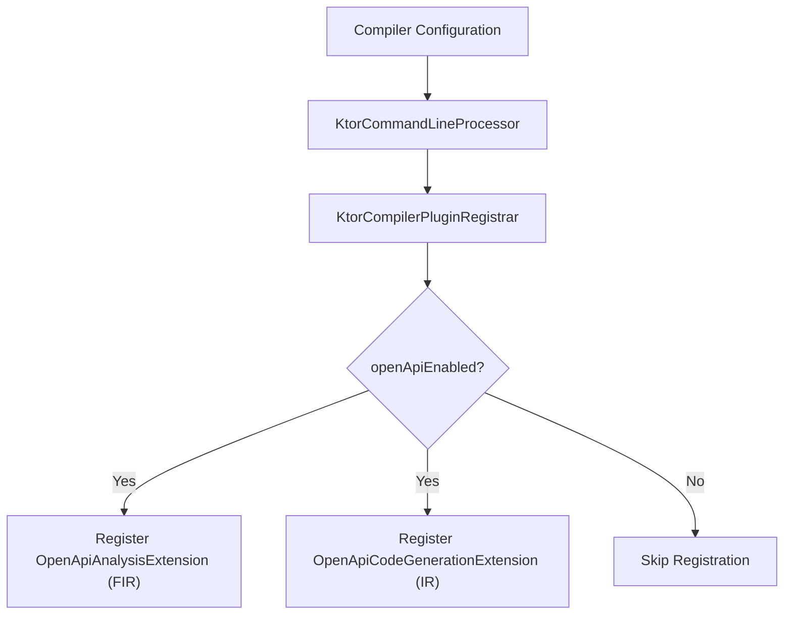
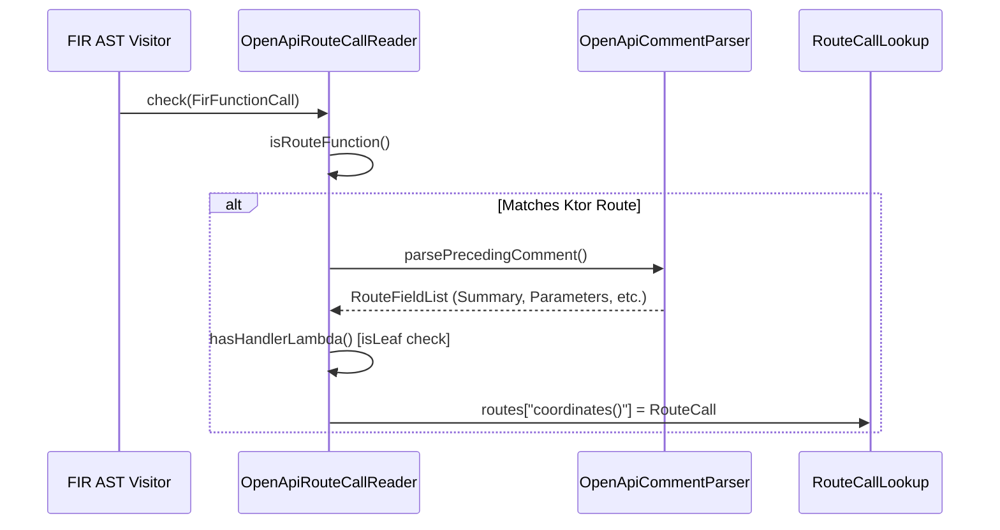
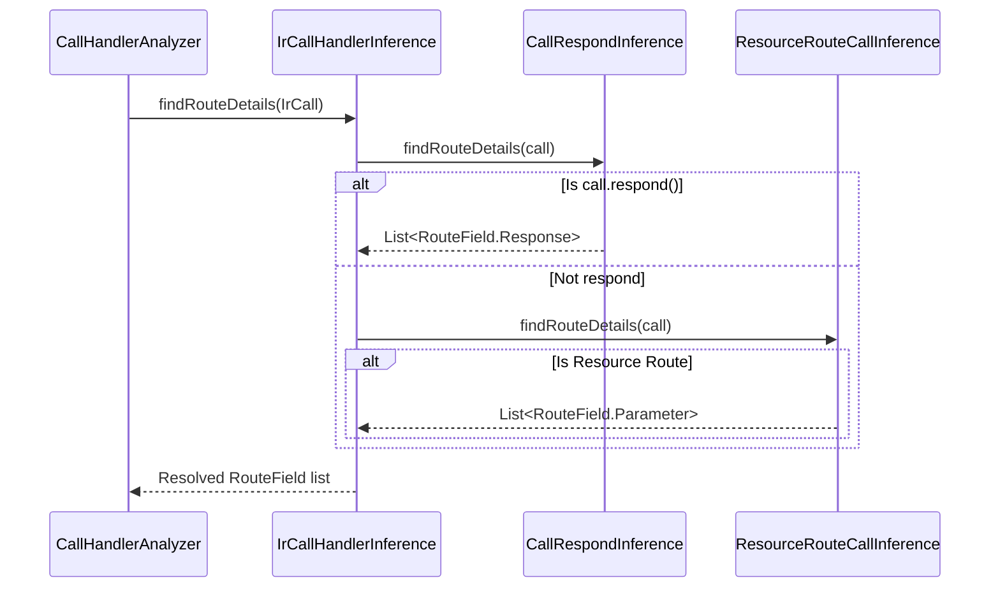
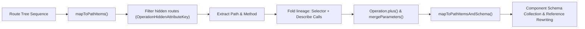

# Compiler Plugin

<details>
<summary>Relevant source files</summary>

The following files were used as context for generating this wiki page:

- [ktor-compiler-plugin/src/io/ktor/openapi/ir/CallDescribeTransformer.kt](https://github.com/ktorio/ktor/blob/main/ktor-compiler-plugin/src/io/ktor/openapi/ir/CallDescribeTransformer.kt)
- [ktor-compiler-plugin/src/io/ktor/openapi/ir/CallHandlerAnalyzer.kt](https://github.com/ktorio/ktor/blob/main/ktor-compiler-plugin/src/io/ktor/openapi/ir/CallHandlerAnalyzer.kt)
- [ktor-compiler-plugin/src/io/ktor/openapi/fir/OpenApiAnalysisExtension.kt](https://github.com/ktorio/ktor/blob/main/ktor-compiler-plugin/src/io/ktor/openapi/fir/OpenApiAnalysisExtension.kt)
- [ktor-compiler-plugin/src/io/ktor/openapi/ir/inference/ResourceRouteCallInference.kt](https://github.com/ktorio/ktor/blob/main/ktor-compiler-plugin/src/io/ktor/openapi/ir/inference/ResourceRouteCallInference.kt)
- [ktor-compiler-plugin/src/io/ktor/compiler/KtorCompilerPluginRegistrar.kt](https://github.com/ktorio/ktor/blob/main/ktor-compiler-plugin/src/io/ktor/compiler/KtorCompilerPluginRegistrar.kt)
- [ktor-compiler-plugin/src/io/ktor/compiler/KtorCommandLineProcessor.kt](https://github.com/ktorio/ktor/blob/main/ktor-compiler-plugin/src/io/ktor/compiler/KtorCommandLineProcessor.kt)
- [ktor-compiler-plugin/src/io/ktor/openapi/ir/inference/ParameterInference.kt](https://github.com/ktorio/ktor/blob/main/ktor-compiler-plugin/src/io/ktor/openapi/ir/inference/ParameterInference.kt)
- [ktor-compiler-plugin/src/io/ktor/openapi/ir/IrCallHandlerInference.kt](https://github.com/ktorio/ktor/blob/main/ktor-compiler-plugin/src/io/ktor/openapi/ir/IrCallHandlerInference.kt)
- [ktor-compiler-plugin/src/io/ktor/openapi/routing/TypeReference.kt](https://github.com/ktorio/ktor/blob/main/ktor-compiler-plugin/src/io/ktor/openapi/routing/TypeReference.kt)
- [ktor-compiler-plugin/src/io/ktor/openapi/ir/generators/GeneralDescribeExpressionGenerator.kt](https://github.com/ktorio/ktor/blob/main/ktor-compiler-plugin/src/io/ktor/openapi/ir/generators/GeneralDescribeExpressionGenerator.kt)
- [ktor-compiler-plugin/testData/openapi/Resources.kt](https://github.com/ktorio/ktor/blob/main/ktor-compiler-plugin/testData/openapi/Resources.kt)
- [ktor-compiler-plugin/src/io/ktor/openapi/ir/generators/ResponsesGenerator.kt](https://github.com/ktorio/ktor/blob/main/ktor-compiler-plugin/src/io/ktor/openapi/ir/generators/ResponsesGenerator.kt)
- [ktor-server/ktor-server-plugins/ktor-server-routing-openapi/common/src/io/ktor/server/routing/openapi/OpenApiRoutes.kt](https://github.com/ktorio/ktor/blob/main/ktor-server/ktor-server-plugins/ktor-server-routing-openapi/common/src/io/ktor/server/routing/openapi/OpenApiRoutes.kt)
- [ktor-compiler-plugin/src/io/ktor/openapi/ir/OpenApiCodeGenerationExtension.kt](https://github.com/ktorio/ktor/blob/main/ktor-compiler-plugin/src/io/ktor/openapi/ir/OpenApiCodeGenerationExtension.kt)
- [ktor-compiler-plugin/src/io/ktor/openapi/ir/inference/CallRespondInference.kt](https://github.com/ktorio/ktor/blob/main/ktor-compiler-plugin/src/io/ktor/openapi/ir/inference/CallRespondInference.kt)
- [ktor-compiler-plugin/src/io/ktor/openapi/routing/LocalReference.kt](https://github.com/ktorio/ktor/blob/main/ktor-compiler-plugin/src/io/ktor/openapi/routing/LocalReference.kt)
- [ktor-compiler-plugin/test-fixtures/io/ktor/compiler/services/OpenApiRegistrarConfigurator.kt](https://github.com/ktorio/ktor/blob/main/ktor-compiler-plugin/test-fixtures/io/ktor/compiler/services/OpenApiRegistrarConfigurator.kt)
- [ktor-compiler-plugin/src/io/ktor/openapi/fir/OpenApiCommentParser.kt](https://github.com/ktorio/ktor/blob/main/ktor-compiler-plugin/src/io/ktor/openapi/fir/OpenApiCommentParser.kt)
- [ktor-compiler-plugin/src/io/ktor/openapi/routing/RouteCall.kt](https://github.com/ktorio/ktor/blob/main/ktor-compiler-plugin/src/io/ktor/openapi/routing/RouteCall.kt)
- [ktor-compiler-plugin/src/io/ktor/openapi/ir/IrDescribeGenerator.kt](https://github.com/ktorio/ktor/blob/main/ktor-compiler-plugin/src/io/ktor/openapi/ir/IrDescribeGenerator.kt)
- [ktor-compiler-plugin/src/io/ktor/openapi/fir/OpenApiMarkdownParametersParser.kt](https://github.com/ktorio/ktor/blob/main/ktor-compiler-plugin/src/io/ktor/openapi/fir/OpenApiMarkdownParametersParser.kt)
- [ktor-compiler-plugin/src/io/ktor/openapi/ir/inference/CallReceiveInference.kt](https://github.com/ktorio/ktor/blob/main/ktor-compiler-plugin/src/io/ktor/openapi/ir/inference/CallReceiveInference.kt)
- [ktor-compiler-plugin/src/io/ktor/openapi/routing/RouteField.kt](https://github.com/ktorio/ktor/blob/main/ktor-compiler-plugin/src/io/ktor/openapi/routing/RouteField.kt)
- [ktor-compiler-plugin/src/io/ktor/openapi/ir/inference/RequestHeaderInference.kt](https://github.com/ktorio/ktor/blob/main/ktor-compiler-plugin/src/io/ktor/openapi/ir/inference/RequestHeaderInference.kt)
- [ktor-compiler-plugin/src/io/ktor/openapi/routing/RoutingFunctionConstants.kt](https://github.com/ktorio/ktor/blob/main/ktor-compiler-plugin/src/io/ktor/openapi/routing/RoutingFunctionConstants.kt)
- [ktor-compiler-plugin/src/io/ktor/openapi/ir/inference/ResponseHeaderInference.kt](https://github.com/ktorio/ktor/blob/main/ktor-compiler-plugin/src/io/ktor/openapi/ir/inference/ResponseHeaderInference.kt)
- [ktor-compiler-plugin/src/io/ktor/openapi/ir/generators/MediaTypeContentGenerator.kt](https://github.com/ktorio/ktor/blob/main/ktor-compiler-plugin/src/io/ktor/openapi/ir/generators/MediaTypeContentGenerator.kt)
- [ktor-shared/ktor-openapi-schema/common/src/io/ktor/openapi/OpenApiDoc.kt](https://github.com/ktorio/ktor/blob/main/ktor-shared/ktor-openapi-schema/common/src/io/ktor/openapi/OpenApiDoc.kt)
</details>

## Overview

The Ktor Compiler Plugin (`io.ktor.ktor-compiler-plugin`) is an official Kotlin compiler plugin designed to automate the generation of OpenAPI documentation directly from server-side routing structures and handler logic at compile time. In traditional frameworks, developers maintain documentation via manual JSON/YAML files or repetitive inline DSL annotations that risk drifting from actual implementation logic. This plugin bridges that gap by analyzing the abstract syntax tree (AST) via Ktor's Front-End Intermediate Representation (FIR) extensions and transforming the Intermediate Representation (IR) during compilation.

By inspecting routing blocks, markdown-style KDoc comments preceding route registrations, type-safe `@Resource` definitions, and handler body statements such as `call.respond()` and `call.receive()`, the compiler plugin infers operation definitions, HTTP methods, parameters, request bodies, and responses. It then injects corresponding programmatic calls to Ktor's OpenAPI description DSL (`describe()`) directly into the compilation pipeline. This design offloads documentation overhead from runtime execution to compile time, eliminating manual spec synchronization while ensuring schemas accurately reflect underlying data types and routing mechanics.

Sources: [ktor-compiler-plugin/src/io/ktor/compiler/KtorCompilerPluginRegistrar.kt](https://github.com/ktorio/ktor/blob/main/ktor-compiler-plugin/src/io/ktor/compiler/KtorCompilerPluginRegistrar.kt#L14-L37), [ktor-compiler-plugin/src/io/ktor/openapi/fir/OpenApiAnalysisExtension.kt](https://github.com/ktorio/ktor/blob/main/ktor-compiler-plugin/src/io/ktor/openapi/fir/OpenApiAnalysisExtension.kt#L27-L51), [ktor-compiler-plugin/src/io/ktor/openapi/ir/CallDescribeTransformer.kt](https://github.com/ktorio/ktor/blob/main/ktor-compiler-plugin/src/io/ktor/openapi/ir/CallDescribeTransformer.kt#L22-L40)

## Compiler Plugin Registration and CLI Options

The compiler plugin hooks into the Kotlin compilation lifecycle using `CompilerPluginRegistrar` (`KtorCompilerPluginRegistrar`) and exposes command-line arguments via `CommandLineProcessor` (`KtorCommandLineProcessor`). During plugin initialization, `KtorCompilerPluginRegistrar` reads compiler configuration keys to verify whether OpenAPI processing and code inference are enabled, instantiating a shared logger and a coordinate-based route lookup map (`RouteCallLookup`).



Sources: [ktor-compiler-plugin/src/io/ktor/compiler/KtorCompilerPluginRegistrar.kt](https://github.com/ktorio/ktor/blob/main/ktor-compiler-plugin/src/io/ktor/compiler/KtorCompilerPluginRegistrar.kt#L14-L51), [ktor-compiler-plugin/src/io/ktor/compiler/KtorCommandLineProcessor.kt](https://github.com/ktorio/ktor/blob/main/ktor-compiler-plugin/src/io/ktor/compiler/KtorCommandLineProcessor.kt#L9-L80)

The CLI options accepted by the compiler plugin control its runtime execution mode, diagnostics, and code inference behavior:

| Option Name | CLI Flag Key | Type | Default / Description |
| :--- | :--- | :--- | :--- |
| `OPENAPI_ENABLED_OPTION` | `openApiEnabled` | `<boolean>` | Enables or disables OpenAPI generation. |
| `OPENAPI_DEBUG_OPTION` | `openApiDebug` | `<boolean>` | Enables internal plugin logging. |
| `OPENAPI_CODE_INFERENCE_OPTION` | `openApiCodeInference` | `<boolean>` | Enables automated code inference (experimental). |
| `OPENAPI_ONLY_COMMENTED_OPTION` | `openApiOnlyCommented` | `<boolean>` | Restricts processing to routing calls with preceding comments. |
| `OPENAPI_LOG_DIR_OPTION` | `openApiLogDir` | `<string>` | Target directory for debug output logs. |

Sources: [ktor-compiler-plugin/src/io/ktor/compiler/KtorCommandLineProcessor.kt](https://github.com/ktorio/ktor/blob/main/ktor-compiler-plugin/src/io/ktor/compiler/KtorCommandLineProcessor.kt#L25-L58)

> [!NOTE]
> The `openApiEnabled` flag acts as a hard circuit breaker: if set to false or omitted, both FIR analysis and IR code generation extensions are bypassed entirely to avoid compilation overhead.

Sources: [ktor-compiler-plugin/src/io/ktor/compiler/KtorCompilerPluginRegistrar.kt](https://github.com/ktorio/ktor/blob/main/ktor-compiler-plugin/src/io/ktor/compiler/KtorCompilerPluginRegistrar.kt#L19-L23)

## FIR Analysis Extension and Comment Parsing

The Front-End Intermediate Representation (FIR) phase utilizes `OpenApiAnalysisExtension` and `OpenApiRouteCallReader` to inspect function calls during frontend compilation checks. When the compiler visits an expression, `OpenApiRouteCallReader.check` intercepts function calls to determine if they match Ktor routing functions (`Route` interface receivers under `io.ktor`).



Sources: [ktor-compiler-plugin/src/io/ktor/openapi/fir/OpenApiAnalysisExtension.kt](https://github.com/ktorio/ktor/blob/main/ktor-compiler-plugin/src/io/ktor/openapi/fir/OpenApiAnalysisExtension.kt#L36-L99), [ktor-compiler-plugin/src/io/ktor/openapi/routing/RouteCall.kt](https://github.com/ktorio/ktor/blob/main/ktor-compiler-plugin/src/io/ktor/openapi/routing/RouteCall.kt#L15-L32)

When a routing call is identified, `parsePrecedingComment` scans the source text immediately preceding the call's file offset. It extracts single-line (`//`) or block (`/* ... */`) comments, evaluating them against markdown parameters parser rules (`OpenApiMarkdownParametersParser`). 

To parse properties and attributes within comments, execution follows the verified call chain: `check` (in `OpenApiAnalysisExtension.kt`) → `parsePrecedingComment` (in `OpenApiCommentParser.kt`) → `parseMarkdownParameters` (in `OpenApiMarkdownParametersParser.kt`) → `parseRouteField` (in `OpenApiMarkdownParametersParser.kt`) → `parseAttribute` (in `OpenApiMarkdownParametersParser.kt`) → `asPropertyMatch` (in `OpenApiCommentParser.kt`).

Sources: [ktor-compiler-plugin/src/io/ktor/openapi/fir/OpenApiAnalysisExtension.kt](https://github.com/ktorio/ktor/blob/main/ktor-compiler-plugin/src/io/ktor/openapi/fir/OpenApiAnalysisExtension.kt#L58-L84), [ktor-compiler-plugin/src/io/ktor/openapi/fir/OpenApiCommentParser.kt](https://github.com/ktorio/ktor/blob/main/ktor-compiler-plugin/src/io/ktor/openapi/fir/OpenApiCommentParser.kt#L25-L110, L149-L151), [ktor-compiler-plugin/src/io/ktor/openapi/fir/OpenApiMarkdownParametersParser.kt](https://github.com/ktorio/ktor/blob/main/ktor-compiler-plugin/src/io/ktor/openapi/fir/OpenApiMarkdownParametersParser.kt#L8-76)

```
> [!IMPORTANT]
> `OpenApiRouteCallReader` checks whether a routing function contains a suspend extension function lambda with a `RoutingContext` receiver using `hasHandlerLambda()`. This determines whether the node is flagged as a `isLeaf` route (`RouteCall.isLeaf = true`), controlling whether statement analysis descends into direct route handlers or non-leaf handle bodies.
```

Sources: [ktor-compiler-plugin/src/io/ktor/openapi/fir/OpenApiAnalysisExtension.kt](https://github.com/ktorio/ktor/blob/main/ktor-compiler-plugin/src/io/ktor/openapi/fir/OpenApiAnalysisExtension.kt#L74-L78, L91-L98)

Supported markdown comment attributes mapped during FIR parsing include:

- `@body [Type] description` — Registers request body schemas and content types.
- `@cookie` / `@header` / `@path` / `@query` — Registers respective parameter types and locations.
- `@response code [Type] description` — Documents status codes and response models.
- `@summary` / `@description` / `@deprecated` / `@tag` / `@operationId` / `@externalDoc` — Enriches operation metadata.

Sources: [ktor-compiler-plugin/src/io/ktor/openapi/fir/OpenApiMarkdownParametersParser.kt](https://github.com/ktorio/ktor/blob/main/ktor-compiler-plugin/src/io/ktor/openapi/fir/OpenApiMarkdownParametersParser.kt#L78-L136)

## IR Code Generation and CallDescribeTransformer

During backend lowering, `OpenApiCodeGenerationExtension` registers `CallDescribeTransformer`, which traverses the IR module fragment. `CallDescribeTransformer` extends `IrElementTransformerVoid` and implements `CodeGenContext`. As the tree transformer visits `IrFile`, `IrFunction`, and `IrVariable` nodes, it maintains scoped symbol tables for local variables and generic type parameters.

When visiting an `IrCall`, the transformer executes the following core control flow:

1. **Coordinate Lookup:** It queries the shared `RouteCallLookup` map using the call's source coordinates (`expression.coordinates()`). If no recorded route is found, it falls back to standard traversal.
2. **Body & Handle Analysis:** If `handlerInferenceEnabled` is true, it inspects the route's lambda body (`includeLambdaBody`) or non-leaf handle bodies (`includeHandleBodies`) to extract inferred routing fields.
3. **Chain Injection:** If `routeFields` are non-empty and lack `RouteField.Ignore`, it wraps the target expression by chaining a call to the `describe` function (`io.ktor.server.routing.openapi.describe`), generated via `GeneralDescribeExpressionGenerator`, `ParametersGenerator`, and `ResponsesGenerator`.

Sources: [ktor-compiler-plugin/src/io/ktor/openapi/ir/CallDescribeTransformer.kt](https://github.com/ktorio/ktor/blob/main/ktor-compiler-plugin/src/io/ktor/openapi/ir/CallDescribeTransformer.kt#L26-L159, L277-L299), [ktor-compiler-plugin/src/io/ktor/openapi/ir/OpenApiCodeGenerationExtension.kt](https://github.com/ktorio/ktor/blob/main/ktor-compiler-plugin/src/io/ktor/openapi/ir/OpenApiCodeGenerationExtension.kt#L9-L27)

```kotlin
// Example execution flow within CallDescribeTransformer.visitCall
override fun visitCall(expression: IrCall): IrExpression {
    val pushed = buildTypeParameterScopeForCall(expression)
    try {
        val route: RouteCall = routes[expression.coordinates()]
            ?: return super.visitCall(expression)
        val currentFunction = functionStack.lastOrNull()
            ?: return super.visitCall(expression)

        val (call, routeFields) = route.fields.let { fields ->
            if (route.isLeaf) {
                expression to fields.includeLambdaBody(expression)
            } else {
                super.visitCall(expression) to fields.includeHandleBodies(expression)
            }
        }
        if (routeFields.isEmpty()) return call
        return call.chainDescribeCall(parentDeclaration = currentFunction, routeFields = routeFields)
    } finally {
        if (pushed) typeParametersScopeStack.removeLast()
    }
}
```

Sources: [ktor-compiler-plugin/src/io/ktor/openapi/ir/CallDescribeTransformer.kt](https://github.com/ktorio/ktor/blob/main/ktor-compiler-plugin/src/io/ktor/openapi/ir/CallDescribeTransformer.kt#L123-L159)

## Call-Chain Execution Walkthrough: Code Inference Pipeline

When automated code inference is active, `CallHandlerAnalyzer` and `IrCallHandlerInference` implementations scan route handler bodies for Ktor API invocations to extract routing fields without explicit KDoc comments.

The analysis walkthrough follows this execution path:

1. **Call Interception (`CallHandlerAnalyzer.visitCall`):** When visiting a call in a route handler, the analyzer checks whether the target function belongs to `io.ktor`. If so, it dispatches the call to the composite `IrCallHandlerInference`.
2. **Inference Evaluation (`IrCallHandlerInference.of`):** The composite inference evaluator delegates to specialized inference modules in priority order:
   - `CallRespondInference`: Inspects `call.respond(...)` to extract response body types, status codes (`HttpStatusCode` or `Int` literals), and content types (`respondText`, `respondHtml`, etc.).
   - `CallReceiveInference`: Inspects `call.receive<T>()` to infer request body schemas and content types.
   - `ParameterInference`: Analyzes query parameters, path variables, headers, or cookies accessed via `StringValues` lookups (`get`, `getAll`, `getValue`) or accessor helpers (`requireQueryParameter`, `requireHeader`, `requireCookie`, `requirePathParameter`).
   - `ResourceRouteCallInference`: Inspects type-safe `@Resource` annotated classes and their hierarchical primary constructors to extract path and query parameter definitions.
   - `RequestHeaderInference` / `AppendResponseHeaderInference`: Extracts explicit header access operations.
3. **Route Field Collection:** Matching inferences return lists of `RouteField` objects which are accumulated and merged into the active route description.

Sources: [ktor-compiler-plugin/src/io/ktor/openapi/ir/CallHandlerAnalyzer.kt](https://github.com/ktorio/ktor/blob/main/ktor-compiler-plugin/src/io/ktor/openapi/ir/CallHandlerAnalyzer.kt#L51-L102), [ktor-compiler-plugin/src/io/ktor/openapi/ir/IrCallHandlerInference.kt](https://github.com/ktorio/ktor/blob/main/ktor-compiler-plugin/src/io/ktor/openapi/ir/IrCallHandlerInference.kt#L11-L17), [ktor-compiler-plugin/src/io/ktor/openapi/ir/inference/CallRespondInference.kt](https://github.com/ktorio/ktor/blob/main/ktor-compiler-plugin/src/io/ktor/openapi/ir/inference/CallRespondInference.kt#L15-L38), [ktor-compiler-plugin/src/io/ktor/openapi/ir/inference/ParameterInference.kt](https://github.com/ktorio/ktor/blob/main/ktor-compiler-plugin/src/io/ktor/openapi/ir/inference/ParameterInference.kt#L13-L53)



Sources: [ktor-compiler-plugin/src/io/ktor/openapi/ir/CallHandlerAnalyzer.kt](https://github.com/ktorio/ktor/blob/main/ktor-compiler-plugin/src/io/ktor/openapi/ir/CallHandlerAnalyzer.kt#L51-L60), [ktor-compiler-plugin/src/io/ktor/openapi/ir/IrCallHandlerInference.kt](https://github.com/ktorio/ktor/blob/main/ktor-compiler-plugin/src/io/ktor/openapi/ir/IrCallHandlerInference.kt#L11-L17)

## Type-Safe Routing and `@Resource` Inference

The `ResourceRouteCallInference` component integrates type-safe routing with Kotlin's `@Resource` serialization feature. When an HTTP method function (e.g., `get<Articles.Id>`) takes a type argument annotated with `@Resource`, the inference engine traverses the resource class hierarchy to reconstruct full URL paths and parameter bindings.

```kotlin
@Resource("/articles")
@Serializable
class Articles {
    @Resource("/{id}")
    @Serializable
    class Id(val parent: Articles, val id: Int)
}
```

Sources: [ktor-compiler-plugin/testData/openapi/Resources.kt](https://github.com/ktorio/ktor/blob/main/ktor-compiler-plugin/testData/openapi/Resources.kt#L16-L30), [ktor-compiler-plugin/src/io/ktor/openapi/ir/inference/ResourceRouteCallInference.kt](https://github.com/ktorio/ktor/blob/main/ktor-compiler-plugin/src/io/ktor/openapi/ir/inference/ResourceRouteCallInference.kt#L17-L50)

The resource path inference mechanism executes as follows:
1. It validates that the called function resides in `io.ktor.server.resources` and targets an HTTP method with type arguments.
2. It extracts the root resource class from `call.typeArguments[0]`.
3. It calls `getFullResourcePath(resourceClass)` to walk up any `parent` constructor properties recursively, prepending parent path segments.
4. It extracts path parameter placeholders (`{param}`) via regular expression matching on the combined path string.
5. It inspects primary constructor parameters: matching names are classified as `ParamIn.PATH` parameters, while remaining properties are classified as `ParamIn.QUERY` parameters.

Sources: [ktor-compiler-plugin/src/io/ktor/openapi/ir/inference/ResourceRouteCallInference.kt](https://github.com/ktorio/ktor/blob/main/ktor-compiler-plugin/src/io/ktor/openapi/ir/inference/ResourceRouteCallInference.kt#L17-L112)

> [!WARNING]
> When traversing parent resources, constructor parameters must be explicitly named `parent` to establish hierarchical nesting links between nested `@Resource` classes.

Sources: [ktor-compiler-plugin/src/io/ktor/openapi/ir/inference/ResourceRouteCallInference.kt](https://github.com/ktorio/ktor/blob/main/ktor-compiler-plugin/src/io/ktor/openapi/ir/inference/ResourceRouteCallInference.kt#L104-L112)

## Route Field Merging and Path Item Mapping

Once route calls and inferred fields are gathered during compilation and transformed into description builders, runtime/plugin utilities in `OpenApiRoutes.kt` map sequences of `Route` nodes into final `PathItem` objects and schema dictionaries (`mapToPathItemsAndSchema`).

The merging logic handles overlapping routes and hierarchical definitions through the following operations:

- **Operation Merging (`Operation.plus`):** Combines operation metadata from root selectors down to leaf describe calls. Tags are merged and deduplicated; summaries and descriptions inherit child overrides; parameters are merged by name and location; response codes and content types are combined.
- **Response Merging (`Responses.plus`):** Groups responses by HTTP status code. When multiple responses share a status code, their content types and schemas are merged or reduced.
- **Component Schema Deduping (`uniqueName`):** When distinct object schemas share the same title across different routes, `uniqueName` resolves name collisions by appending numeric counters (`title2`, `title3`) and rewriting component references (`rewriteSchemaComponentReferences`).

Sources: [ktor-server/ktor-server-plugins/ktor-server-routing-openapi/common/src/io/ktor/server/routing/openapi/OpenApiRoutes.kt](https://github.com/ktorio/ktor/blob/main/ktor-server/ktor-server-plugins/ktor-server-routing-openapi/common/src/io/ktor/server/routing/openapi/OpenApiRoutes.kt#L20-L100, L293-L374)



Sources: [ktor-server/ktor-server-plugins/ktor-server-routing-openapi/common/src/io/ktor/server/routing/openapi/OpenApiRoutes.kt](https://github.com/ktorio/ktor/blob/main/ktor-server/ktor-server-plugins/ktor-server-routing-openapi/common/src/io/ktor/server/routing/openapi/OpenApiRoutes.kt#L20-L143)

## Design Trade-Offs

| Design Choice | Benefit | Cost |
| :--- | :--- | :--- |
| **Compile-Time FIR & IR Transformation** | Eliminates runtime overhead and reflection costs for documentation generation; guarantees spec accuracy at build time. | Increases compilation time and couples documentation generation tightly to Kotlin compiler versions (K2 architecture). |
| **Markdown & KDoc Preceding Comment Parsing** | Allows developers to write natural markdown documentation directly above routing blocks without learning complex annotation DSLs. | Relies on source text parsing and file offsets, making documentation fragile if comments become detached from route statements. |
| **Heuristic Code Inference (`CallHandlerAnalyzer`)** | Automatically populates request/response bodies and parameters without requiring manual documentation annotations. | Heuristics may fail or infer incomplete models on complex wrapped handler structures or custom utility abstractions. |
| **Hierarchical Resource Path Resolution (`@Resource`)** | Enables fully type-safe API definitions where route paths and query/path parameters are derived directly from data class structures. | Requires strict adherence to naming conventions (`parent` constructor parameters) and Kotlin serialization metadata. |

Sources: [ktor-compiler-plugin/src/io/ktor/openapi/fir/OpenApiAnalysisExtension.kt](https://github.com/ktorio/ktor/blob/main/ktor-compiler-plugin/src/io/ktor/openapi/fir/OpenApiAnalysisExtension.kt#L36-L85), [ktor-compiler-plugin/src/io/ktor/openapi/ir/CallDescribeTransformer.kt](https://github.com/ktorio/ktor/blob/main/ktor-compiler-plugin/src/io/ktor/openapi/ir/CallDescribeTransformer.kt#L26-L159), [ktor-compiler-plugin/src/io/ktor/openapi/ir/inference/ResourceRouteCallInference.kt](https://github.com/ktorio/ktor/blob/main/ktor-compiler-plugin/src/io/ktor/openapi/ir/inference/ResourceRouteCallInference.kt#L17-L112)

## Related

- [[OpenAPI and Swagger]]

