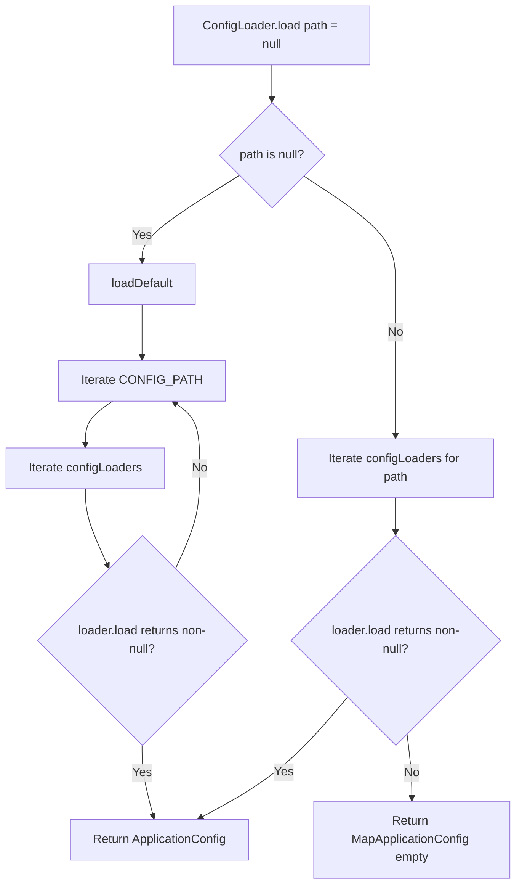
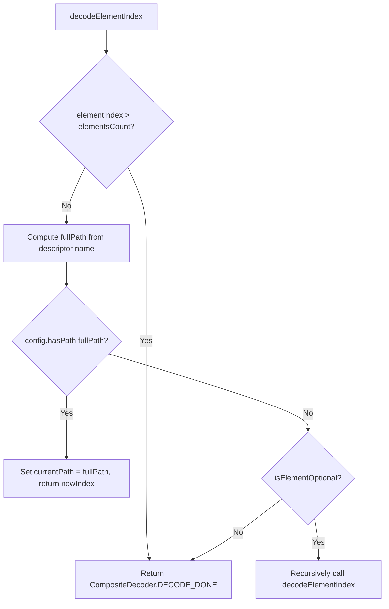
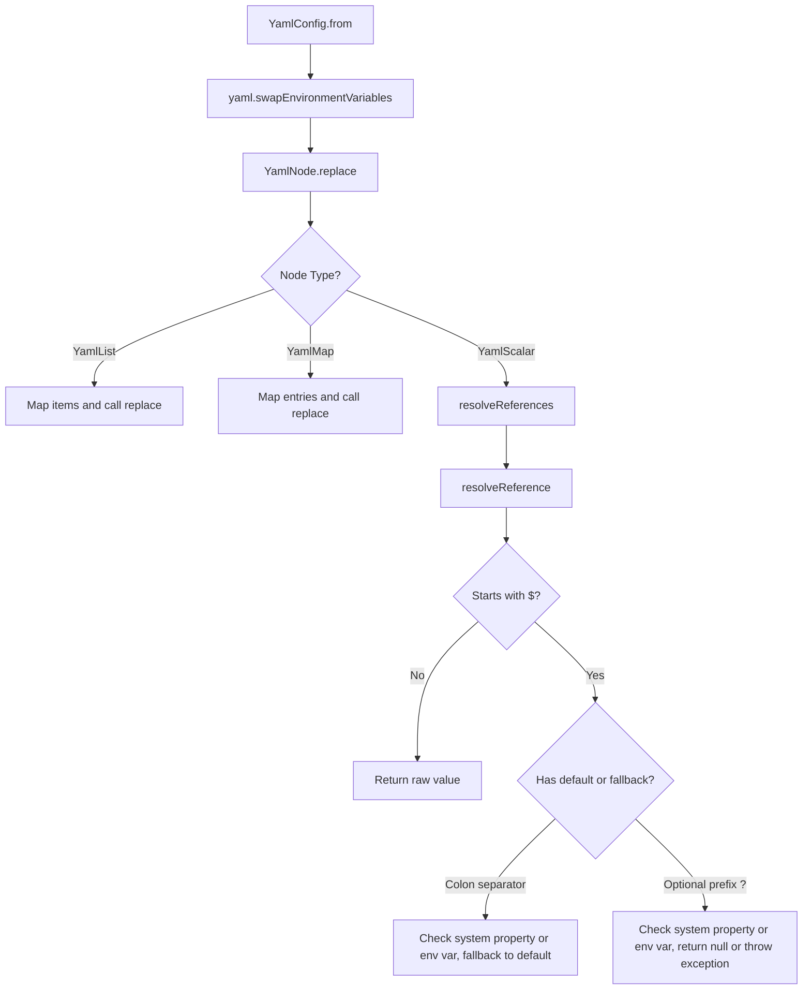
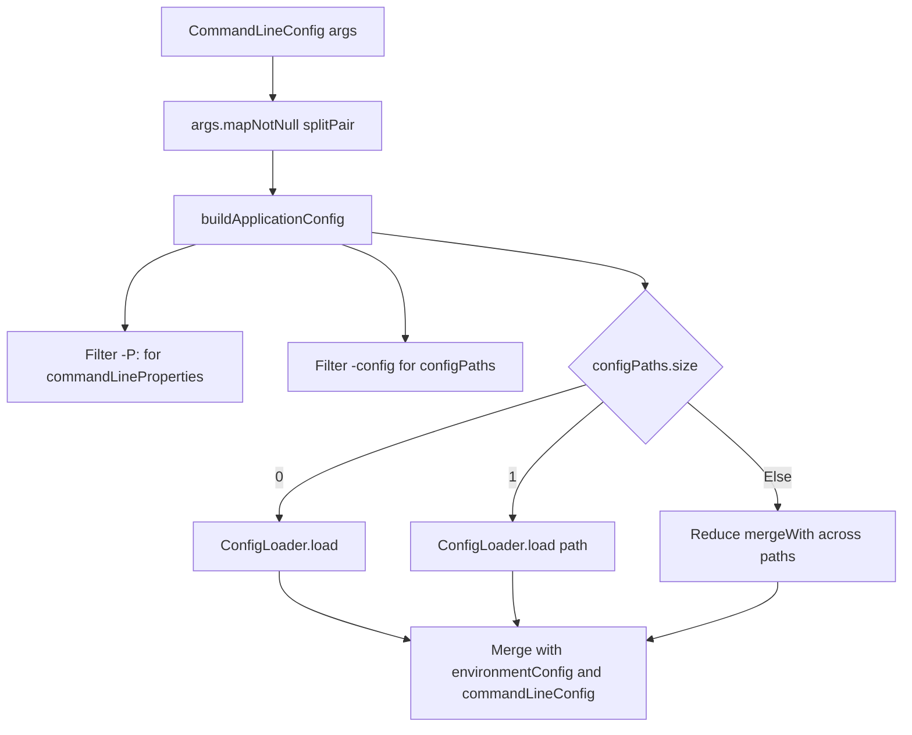
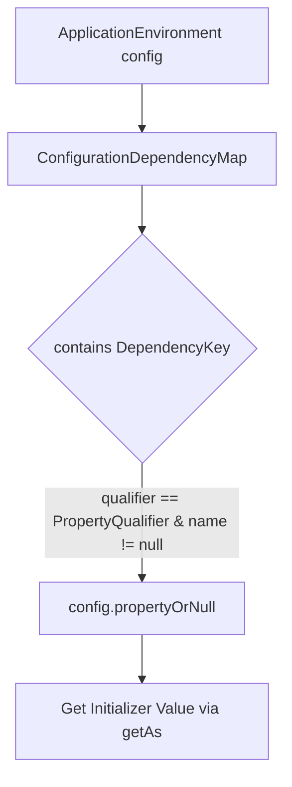

# Configuration

Relevant source files

The following files were used as context for generating this wiki page:

- [ktor-server/ktor-server-core/common/src/io/ktor/server/engine/CommandLine.kt](https://github.com/ktorio/ktor/blob/main/ktor-server/ktor-server-core/common/src/io/ktor/server/engine/CommandLine.kt)
- [ktor-server/ktor-server-config-yaml/jvmAndPosix/src/io/ktor/server/config/yaml/YamlConfig.kt](https://github.com/ktorio/ktor/blob/main/ktor-server/ktor-server-config-yaml/jvmAndPosix/src/io/ktor/server/config/yaml/YamlConfig.kt)
- [ktor-server/ktor-server-core/jvm/src/io/ktor/server/config/HoconApplicationConfig.kt](https://github.com/ktorio/ktor/blob/main/ktor-server/ktor-server-core/jvm/src/io/ktor/server/config/HoconApplicationConfig.kt)
- [ktor-server/ktor-server-core/common/src/io/ktor/server/config/ConfigLoaders.kt](https://github.com/ktorio/ktor/blob/main/ktor-server/ktor-server-core/common/src/io/ktor/server/config/ConfigLoaders.kt)
- [ktor-server/ktor-server-config-yaml/jvm/src/io/ktor/server/config/yaml/YamlConfigJvm.kt](https://github.com/ktorio/ktor/blob/main/ktor-server/ktor-server-config-yaml/jvm/src/io/ktor/server/config/yaml/YamlConfigJvm.kt)
- [ktor-server/ktor-server-config-yaml/posix/src/io/ktor/server/config/yaml/YamlConfigNix.kt](https://github.com/ktorio/ktor/blob/main/ktor-server/ktor-server-config-yaml/posix/src/io/ktor/server/config/yaml/YamlConfigNix.kt)
- [ktor-server/ktor-server-plugins/ktor-server-di/common/src/io/ktor/server/plugins/di/DependencyResolution.kt](https://github.com/ktorio/ktor/blob/main/ktor-server/ktor-server-plugins/ktor-server-di/common/src/io/ktor/server/plugins/di/DependencyResolution.kt)
- [ktor-server/ktor-server-test-host/jvm/test-resources/application-with-modules.conf](https://github.com/ktorio/ktor/blob/main/ktor-server/ktor-server-test-host/jvm/test-resources/application-with-modules.conf)
- [ktor-server/ktor-server-core/jvm/test-resources/applicationWithEnv.conf](https://github.com/ktorio/ktor/blob/main/ktor-server/ktor-server-core/jvm/test-resources/applicationWithEnv.conf)
- [ktor-server/ktor-server-jetty-jakarta/jvm/test-resources/application-lifecycle.conf](https://github.com/ktorio/ktor/blob/main/ktor-server/ktor-server-jetty-jakarta/jvm/test-resources/application-lifecycle.conf)
- [ktor-server/ktor-server-test-host/jvm/test-resources/application.conf](https://github.com/ktorio/ktor/blob/main/ktor-server/ktor-server-test-host/jvm/test-resources/application.conf)
- [ktor-server/ktor-server-jetty/jvm/test-resources/application-lifecycle.conf](https://github.com/ktorio/ktor/blob/main/ktor-server/ktor-server-jetty/jvm/test-resources/application-lifecycle.conf)
- [ktor-server/ktor-server-plugins/ktor-server-di/common/src/io/ktor/server/plugins/di/DependencyInjection.kt](https://github.com/ktorio/ktor/blob/main/ktor-server/ktor-server-plugins/ktor-server-di/common/src/io/ktor/server/plugins/di/DependencyInjection.kt)
- [ktor-server/ktor-server-core/jvm/test-resources/application-main.conf](https://github.com/ktorio/ktor/blob/main/ktor-server/ktor-server-core/jvm/test-resources/application-main.conf)
- [ktor-server/ktor-server-core/jvm/test-resources/application-additional.conf](https://github.com/ktorio/ktor/blob/main/ktor-server/ktor-server-core/jvm/test-resources/application-additional.conf)
- [ktor-server/ktor-server-test-host/jvm/test-resources/application-custom.conf](https://github.com/ktorio/ktor/blob/main/ktor-server/ktor-server-test-host/jvm/test-resources/application-custom.conf)
- [ktor-server/ktor-server-core/jvm/src/io/ktor/server/config/ConfigLoadersJvm.kt](https://github.com/ktorio/ktor/blob/main/ktor-server/ktor-server-core/jvm/src/io/ktor/server/config/ConfigLoadersJvm.kt)
- [ktor-server/ktor-server-core/jvm/test-resources/application.yaml](https://github.com/ktorio/ktor/blob/main/ktor-server/ktor-server-core/jvm/test-resources/application.yaml)
- [ktor-server/ktor-server-core/common/src/io/ktor/server/application/ApplicationModules.kt](https://github.com/ktorio/ktor/blob/main/ktor-server/ktor-server-core/common/src/io/ktor/server/application/ApplicationModules.kt)
- [ktor-server/ktor-server-servlet-jakarta/jvm/test-resources/custom-config.yaml](https://github.com/ktorio/ktor/blob/main/ktor-server/ktor-server-servlet-jakarta/jvm/test-resources/custom-config.yaml)
- [ktor-server/ktor-server-servlet/jvm/test-resources/test.conf](https://github.com/ktorio/ktor/blob/main/ktor-server/ktor-server-servlet/jvm/test-resources/test.conf)
- [ktor-server/ktor-server-test-host/jvm/test-resources/application-custom.yaml](https://github.com/ktorio/ktor/blob/main/ktor-server/ktor-server-test-host/jvm/test-resources/application-custom.yaml)
- [ktor-server/ktor-server-core/jvm/src/io/ktor/server/config/HoconDecoder.kt](https://github.com/ktorio/ktor/blob/main/ktor-server/ktor-server-core/jvm/src/io/ktor/server/config/HoconDecoder.kt)
- [ktor-server/ktor-server-servlet/jvm/test-resources/custom-config.yaml](https://github.com/ktorio/ktor/blob/main/ktor-server/ktor-server-servlet/jvm/test-resources/custom-config.yaml)
- [ktor-server/ktor-server-core/jvm/test-resources/application.conf](https://github.com/ktorio/ktor/blob/main/ktor-server/ktor-server-core/jvm/test-resources/application.conf)
- [ktor-server/ktor-server-servlet/jvm/test-resources/application.yaml](https://github.com/ktorio/ktor/blob/main/ktor-server/ktor-server-servlet/jvm/test-resources/application.yaml)
- [ktor-server/ktor-server-servlet-jakarta/jvm/test-resources/test.conf](https://github.com/ktorio/ktor/blob/main/ktor-server/ktor-server-servlet-jakarta/jvm/test-resources/test.conf)
- [ktor-server/ktor-server-core/nonJvm/src/io/ktor/server/config/ConfigLoaders.nonJvm.kt](https://github.com/ktorio/ktor/blob/main/ktor-server/ktor-server-core/nonJvm/src/io/ktor/server/config/ConfigLoaders.nonJvm.kt)
- [ktor-server/ktor-server-core/jvm/test-resources/test-config.yaml](https://github.com/ktorio/ktor/blob/main/ktor-server/ktor-server-core/jvm/test-resources/test-config.yaml)
- [ktor-server/ktor-server-config-yaml/jvm/test-resources/application-custom.yml](https://github.com/ktorio/ktor/blob/main/ktor-server/ktor-server-config-yaml/jvm/test-resources/application-custom.yml)

## Overview

Ktor configuration management provides a flexible, multiplatform foundation for initializing server engines, parsing hierarchical configuration files, and injecting properties directly into application modules. By supporting multiple backend formats and discovery mechanisms, Ktor allows developers to seamlessly load, merge, and override settings across diverse deployment targets from development workstations to production environments. Sources: [ConfigLoaders.kt:20-94](https://github.com/ktorio/ktor/blob/main/ktor-server/ktor-server-core/common/src/io/ktor/server/config/ConfigLoaders.kt#L20-L94), [YamlConfig.kt:44-49](https://github.com/ktorio/ktor/blob/main/ktor-server/ktor-server-config-yaml/jvmAndPosix/src/io/ktor/server/config/yaml/YamlConfig.kt#L44-L49), [HoconApplicationConfig.kt:50-54](https://github.com/ktorio/ktor/blob/main/ktor-server/ktor-server-core/jvm/src/io/ktor/server/config/HoconApplicationConfig.kt#L50-L54)

## Config Loader Discovery and SPI

### Overview

Ktor manages application configuration loading through the `ConfigLoader` interface and the companion object methods defined in common code. Platform-specific implementations discover and register format loaders (such as HOCON and YAML) using Service Provider Interfaces (SPI) on JVM targets or explicit registration on non-JVM targets. Sources: [ConfigLoaders.kt:20-94](https://github.com/ktorio/ktor/blob/main/ktor-server/ktor-server-core/common/src/io/ktor/server/config/ConfigLoaders.kt#L20-L94), [ConfigLoadersJvm.kt:11-20](https://github.com/ktorio/ktor/blob/main/ktor-server/ktor-server-core/jvm/src/io/ktor/server/config/ConfigLoadersJvm.kt#L11-L20), [ConfigLoaders.nonJvm.kt:9-28](https://github.com/ktorio/ktor/blob/main/ktor-server/ktor-server-core/nonJvm/src/io/ktor/server/config/ConfigLoaders.nonJvm.kt#L9-L28)

### Configuration Loading Call Chain

When `ConfigLoader.load(path: String?)` is invoked without arguments or with a specific target path, execution follows a deterministic resolution sequence across registered loaders and default paths.

Sources: [ConfigLoaders.kt:56-74](https://github.com/ktorio/ktor/blob/main/ktor-server/ktor-server-core/common/src/io/ktor/server/config/ConfigLoaders.kt#L56-L74)

1. **`ConfigLoader.loadAll(vararg configPaths: String)`**: Evaluates the size of the provided `configPaths` array. If empty, it delegates to `load()`; if a single path is given, it invokes `load(configPaths.single())`; if multiple paths are provided, it maps each path through `load` and reduces them sequentially using `ApplicationConfig::mergeWith`. Sources: [ConfigLoaders.kt:44-49](https://github.com/ktorio/ktor/blob/main/ktor-server/ktor-server-core/common/src/io/ktor/server/config/ConfigLoaders.kt#L44-L49)
2. **`ConfigLoader.load(path: String?)`**: If `path` is `null`, calls `loadDefault()`. If `loadDefault()` returns a configuration, it is returned immediately. Otherwise, iterates over `configLoaders` and attempts `loader.load(path)`. If all loaders fail, falls back to `MapApplicationConfig()`. Sources: [ConfigLoaders.kt:56-74](https://github.com/ktorio/ktor/blob/main/ktor-server/ktor-server-core/common/src/io/ktor/server/config/ConfigLoaders.kt#L56-L74)
3. **`loadDefault()`**: Iterates through `CONFIG_PATH` entries. For each default path, it iterates through `configLoaders` calling `loader.load(defaultPath)` until a non-null `ApplicationConfig` is found. Sources: [ConfigLoaders.kt:76-92](https://github.com/ktorio/ktor/blob/main/ktor-server/ktor-server-core/common/src/io/ktor/server/config/ConfigLoaders.kt#L76-L92)

### Platform-Specific Configuration Paths and Loader Discovery

The discovery mechanism adapts to the compilation target by providing expected properties for default configuration paths and loader collections.

| Platform | Default `CONFIG_PATH` Sources | Loader Discovery Mechanism |
| :--- | :--- | :--- |
| **JVM** | `config.file`, `config.resource`, `config.url` environment properties | `loadServices<ConfigLoader>()` via Java SPI |
| **Non-JVM** | `CONFIG_FILE` environment property | `_configLoaders` mutable list populated via `addConfigLoader` |

Sources: [ConfigLoadersJvm.kt:11-20](https://github.com/ktorio/ktor/blob/main/ktor-server/ktor-server-core/jvm/src/io/ktor/server/config/ConfigLoadersJvm.kt#L11-L20), [ConfigLoaders.nonJvm.kt:9-28](https://github.com/ktorio/ktor/blob/main/ktor-server/ktor-server-core/nonJvm/src/io/ktor/server/config/ConfigLoaders.nonJvm.kt#L9-L28)

> [!NOTE]
> On non-JVM targets, configuration loaders must be explicitly registered prior to loading operations by invoking `addConfigLoader(loader: ConfigLoader)` to populate the `_configLoaders` collection. Sources: [ConfigLoaders.nonJvm.kt:22-27](https://github.com/ktorio/ktor/blob/main/ktor-server/ktor-server-core/nonJvm/src/io/ktor/server/config/ConfigLoaders.nonJvm.kt#L22-L27)

## HOCON Configuration and Type Decoding

### Overview

The `HoconConfigLoader` implementation parses and resolves configuration data from HOCON (`.conf`), JSON (`.json`), or Java properties (`.properties`) formats. When `load(path: String?)` is called, it normalizes a `null` path to `"application.conf"` or validates that the supplied path extension matches supported formats. It then inspects the thread context class loader for the resource or falls back to an existing file on disk, resolves substitution variables via `.resolve()`, and wraps the resulting Typesafe `Config` object in an `HoconApplicationConfig`.

Sources: [HoconApplicationConfig.kt:18-47](https://github.com/ktorio/ktor/blob/main/ktor-server/ktor-server-core/jvm/src/io/ktor/server/config/HoconApplicationConfig.kt#L18-L47)

### HoconApplicationConfig API and Value Mapping

`HoconApplicationConfig` implements `ApplicationConfig` by delegating to an underlying Typesafe `Config` instance. Property accessors evaluate path existence, throwing an `ApplicationConfigurationException` when a required property is missing, or returning `null` via `propertyOrNull`.

| Method / Property | Return Type | Behavior |
| :--- | :--- | :--- |
| `property(path)` | `ApplicationConfigValue` | Throws `ApplicationConfigurationException` if path is absent; returns `HoconApplicationConfigValue`. |
| `propertyOrNull(path)` | `ApplicationConfigValue?` | Returns `null` if path is absent; otherwise returns `HoconApplicationConfigValue`. |
| `config(path)` | `ApplicationConfig` | Wraps `config.getConfig(path)` in an `HoconApplicationConfig`. |
| `configList(path)` | `List<ApplicationConfig>` | Maps each element of `config.getConfigList(path)` to `HoconApplicationConfig`. |
| `keys()` | `Set<String>` | Collects all entry keys from `config.entrySet()`. |
| `toMap()` | `Map<String, Any?>` | Unwraps the root config object into a standard Kotlin map via `config.root().unwrapped()`. |

Sources: [HoconApplicationConfig.kt:54-82](https://github.com/ktorio/ktor/blob/main/ktor-server/ktor-server-core/jvm/src/io/ktor/server/config/HoconApplicationConfig.kt#L54-L82)

The inner `HoconApplicationConfigValue` maps Typesafe `ConfigValueType` enums to `ApplicationConfigValue.Type` classifications as follows:

| Typesafe `ConfigValueType` | Mapped `ApplicationConfigValue.Type` |
| :--- | :--- |
| `STRING`, `NUMBER`, `BOOLEAN` | `ApplicationConfigValue.Type.SINGLE` |
| `NULL` | `ApplicationConfigValue.Type.NULL` |
| `LIST` | `ApplicationConfigValue.Type.LIST` |
| `OBJECT` | `ApplicationConfigValue.Type.OBJECT` |

Sources: [HoconApplicationConfig.kt:84-99](https://github.com/ktorio/ktor/blob/main/ktor-server/ktor-server-core/jvm/src/io/ktor/server/config/HoconApplicationConfig.kt#L84-L99)

> [!NOTE]
> `HoconApplicationConfigValue.getAs(type: TypeInfo)` utilizes `HoconDecoder` to deserialize configuration nodes directly into kotlinx.serialization-annotated classes or structures.
> Sources: [HoconApplicationConfig.kt:104-109](https://github.com/ktorio/ktor/blob/main/ktor-server/ktor-server-core/jvm/src/io/ktor/server/config/HoconApplicationConfig.kt#L104-L109)

### Type Decoding via HoconDecoder

`HoconDecoder` extends `AbstractDecoder` to traverse HOCON trees during deserialization. When `decodeElementIndex` runs, it checks whether `config.hasPath(fullPath)` exists; if absent, it checks `descriptor.isElementOptional(newIndex)` to skip optional properties or terminates iteration by returning `CompositeDecoder.DECODE_DONE`.

Sources: [HoconDecoder.kt:23-38](https://github.com/ktorio/ktor/blob/main/ktor-server/ktor-server-core/jvm/src/io/ktor/server/config/HoconDecoder.kt#L23-L38)

Structure decoding distinguishes between lists, maps, and classes by inspecting `descriptor.kind as StructureKind`:
- `StructureKind.LIST`: Instantiates `HoconListDecoder` passing `config.getList(currentPath)`.
- `StructureKind.MAP`: Instantiates `HoconMapDecoder` passing `config.getObject(currentPath).toConfig()`.
- `StructureKind.CLASS` or `StructureKind.OBJECT`: Instantiates a nested `HoconDecoder` with `config` and `currentPath`.

Sources: [HoconDecoder.kt:65-83](https://github.com/ktorio/ktor/blob/main/ktor-server/ktor-server-core/jvm/src/io/ktor/server/config/HoconDecoder.kt#L65-L83)

### Specialized Decoders: HoconListDecoder and HoconMapDecoder

`HoconListDecoder` iterates over `ConfigList` elements, decoding primitive types and enforcing type safety on numeric conversions:
- `decodeLong()` permits unwrapped `Int` (widened to `Long`) and `Long` values, throwing a `SerializationException` for other types.
- `decodeDouble()` permits unwrapped `Int`, `Long`, and `Double` values.

Sources: [HoconDecoder.kt:87-122](https://github.com/ktorio/ktor/blob/main/ktor-server/ktor-server-core/jvm/src/io/ktor/server/config/HoconDecoder.kt#L87-L122)

`HoconMapDecoder` inherits from `HoconDecoder` and processes configuration objects by alternating index positions between keys and values:
- Even indexes (`elementIndex % 2 == 0`) store the map key path in `currentPath`.
- Odd indexes decode the associated value using `config.getString(currentPath)` or structural traversal.

Sources: [HoconDecoder.kt:152-185](https://github.com/ktorio/ktor/blob/main/ktor-server/ktor-server-core/jvm/src/io/ktor/server/config/HoconDecoder.kt#L152-L185)

## YAML Configuration and Multiplatform Parsing

### Overview

Ktor provides multiplatform YAML configuration parsing via `YamlConfigLoader` and `YamlConfig`, supporting both JVM and POSIX runtimes. YAML values can incorporate environment variable substitution using formats like `$ENV_VAR`, `${ENV_VAR}`, or `"$ENV_VAR:default_value"`.

Sources: [YamlConfig.kt:19-48](https://github.com/ktorio/ktor/blob/main/ktor-server/ktor-server-config-yaml/jvmAndPosix/src/io/ktor/server/config/yaml/YamlConfig.kt#L19-L48)

### Platform-Specific File and Resource Loading

The `YamlConfig(path: String?)` expect/actual function resolves configuration sources differently depending on the active target runtime:
- On JVM targets, it checks class loader application resources for paths ending in `.yaml` or `.yml` (or `DEFAULT_YAML_FILENAME`, which is `"application.yaml"`), falling back to a local `File` if the resource is absent.
- On POSIX/Native targets, it checks for file existence using POSIX file access permissions and reads raw file descriptors via custom chunk-based binary file reading.

Sources: [YamlConfig.kt:12-42](https://github.com/ktorio/ktor/blob/main/ktor-server/ktor-server-config-yaml/jvmAndPosix/src/io/ktor/server/config/yaml/YamlConfig.kt#L12-L42), [YamlConfigJvm.kt:20-37](https://github.com/ktorio/ktor/blob/main/ktor-server/ktor-server-config-yaml/jvm/src/io/ktor/server/config/yaml/YamlConfigJvm.kt#L20-L37), [YamlConfigNix.kt:34-68](https://github.com/ktorio/ktor/blob/main/ktor-server/ktor-server-config-yaml/posix/src/io/ktor/server/config/yaml/YamlConfigNix.kt#L34-L68)

### Environment Variable Substitution Call Chain

During initialization, YAML maps swap environment variables by recursively traversing scalar, map, and list nodes. 

Sources: [YamlConfig.kt:51-53](https://github.com/ktorio/ktor/blob/main/ktor-server/ktor-server-config-yaml/jvmAndPosix/src/io/ktor/server/config/yaml/YamlConfig.kt#L51-L53), [YamlConfig.kt:167-237](https://github.com/ktorio/ktor/blob/main/ktor-server/ktor-server-config-yaml/jvmAndPosix/src/io/ktor/server/config/yaml/YamlConfig.kt#L167-L237)

> [!WARNING]
> Circular reference checking tracks visited reference keys during substitution. If a reference starts with `$` and is encountered a second time within the `visited` set, `resolveReference` throws an `ApplicationConfigurationException` to prevent infinite recursion.
> Sources: [YamlConfig.kt:202-205](https://github.com/ktorio/ktor/blob/main/ktor-server/ktor-server-config-yaml/jvmAndPosix/src/io/ktor/server/config/yaml/YamlConfig.kt#L202-L205)

### YAML Node Value Mappings

The mapping of internal `YamlNode` subtypes to `ApplicationConfigValue.Type` classifications is defined as follows:

| YamlNode Type | Mapped `ApplicationConfigValue.Type` |
| :--- | :--- |
| `YamlNull` | `ApplicationConfigValue.Type.NULL` |
| `YamlScalar` | `ApplicationConfigValue.Type.SINGLE` |
| `YamlList` | `ApplicationConfigValue.Type.LIST` |
| `YamlMap` | `ApplicationConfigValue.Type.OBJECT` |
| `YamlTaggedNode` | *Delegates to innerNode type* |

Sources: [YamlConfig.kt:54-60](https://github.com/ktorio/ktor/blob/main/ktor-server/ktor-server-config-yaml/jvmAndPosix/src/io/ktor/server/config/yaml/YamlConfig.kt#L54-L60)

## Command Line Argument Processing

### Overview

The `CommandLineConfig` function processes raw `Array<String>` inputs during server startup, mapping command-line flags and `-P:` property overrides to build the server configuration.

Sources: [CommandLine.kt:43-46](https://github.com/ktorio/ktor/blob/main/ktor-server/ktor-server-core/common/src/io/ktor/server/engine/CommandLine.kt#L43-L46)

### Command-Line Arguments Parsing Call Chain

Incoming arguments are split on `=` pairs and processed through configuration-loading functions to merge file configurations with command-line overrides.

Sources: [CommandLine.kt:43-46](https://github.com/ktorio/ktor/blob/main/ktor-server/ktor-server-core/common/src/io/ktor/server/engine/CommandLine.kt#L43-L46), [CommandLine.kt:110-127](https://github.com/ktorio/ktor/blob/main/ktor-server/ktor-server-core/common/src/io/ktor/server/engine/CommandLine.kt#L110-L127)

### Configuration Keys Reference

The `ConfigKeys` object defines standard property paths used when querying application configuration files or environment variables.

| Constant Name | Property Path String | Purpose |
| :--- | :--- | :--- |
| `applicationIdPath` | `ktor.application.id` | Application identifier for loggers |
| `hostConfigPath` | `ktor.deployment.host` | Server host binding address |
| `hostPortPath` | `ktor.deployment.port` | HTTP server port |
| `hostWatchPaths` | `ktor.deployment.watch` | Hot reload watch paths |
| `rootPathPath` | `ktor.deployment.rootPath` | Root application context path |
| `hostSslPortPath` | `ktor.deployment.sslPort` | HTTPS SSL port |
| `hostSslKeyStore` | `ktor.security.ssl.keyStore` | Key store file path |
| `hostSslKeyAlias` | `ktor.security.ssl.keyAlias` | Key alias within the store |
| `hostSslKeyStorePassword` | `ktor.security.ssl.keyStorePassword` | Key store password |
| `hostSslPrivateKeyPassword`| `ktor.security.ssl.privateKeyPassword`| Private key password |
| `hostSslTrustStore` | `ktor.security.ssl.trustStore` | Trust store file path |
| `hostSslTrustStorePassword`| `ktor.security.ssl.trustStorePassword`| Trust store password |
| `hostSslEnabledProtocols` | `ktor.security.ssl.enabledProtocols`| Enabled SSL protocols list |
| `developmentModeKey` | `ktor.development` | Development mode flag toggle |

Sources: [CommandLine.kt:19-36](https://github.com/ktorio/ktor/blob/main/ktor-server/ktor-server-core/common/src/io/ktor/server/engine/CommandLine.kt#L19-L36)

> [!WARNING]
> If neither `port` nor `sslPort` can be resolved via command-line arguments (`-port`, `-sslPort`) or configuration files, `CommandLineConfig` throws an `IllegalArgumentException` stating that connectors must be specified.
> Sources: [CommandLine.kt:79-84](https://github.com/ktorio/ktor/blob/main/ktor-server/ktor-server-core/common/src/io/ktor/server/engine/CommandLine.kt#L79-L84)

## Configuration Injection into Application Modules

### Overview

Ktor integrates application configuration properties directly into dependency resolution workflows through the `ConfigurationDependencyMap` class and the `DI` application plugin. Configuration properties prefixed with the `PropertyQualifier` are exposed as resolvable dependencies, allowing components to inject configuration values seamlessly via dependency injection maps or property delegation.

Sources: [DependencyResolution.kt:269-285](https://github.com/ktorio/ktor/blob/main/ktor-server/ktor-server-plugins/ktor-server-di/common/src/io/ktor/server/plugins/di/DependencyResolution.kt#L269-L285), [DependencyInjection.kt:63-76](https://github.com/ktorio/ktor/blob/main/ktor-server/ktor-server-plugins/ktor-server-di/common/src/io/ktor/server/plugins/di/DependencyInjection.kt#L63-L76)

### Configuration Dependency Mapping

The `ConfigurationDependencyMap` implements the `DependencyMap` interface to bridge `ApplicationConfig` settings into the dependency resolution engine. During plugin initialization, `DI` extracts configuration paths from `ktor.application.dependencies`, loads map extensions, and builds the composite `extensionMap`.

Sources: [DependencyResolution.kt:269-285](https://github.com/ktorio/ktor/blob/main/ktor-server/ktor-server-plugins/ktor-server-di/common/src/io/ktor/server/plugins/di/DependencyResolution.kt#L269-L285), [DependencyInjection.kt:63-76](https://github.com/ktorio/ktor/blob/main/ktor-server/ktor-server-plugins/ktor-server-di/common/src/io/ktor/server/plugins/di/DependencyInjection.kt#L63-L76)

### Dependency Injection Exceptions Reference

When resolving dependencies and configuration properties, the di plugin throws specific exception subclasses derived from `DependencyInjectionException`.

| Exception Class | Trigger Condition |
| :--- | :--- |
| `MissingDependencyException` | Attempting to resolve a dependency or configuration property that was not declared or found |
| `DuplicateDependencyException` | Attempting to redefine an existing dependency key |
| `AmbiguousDependencyException` | Two or more implicit dependencies match the requested key |
| `CircularDependencyException` | Resolving a dependency loops back onto itself |
| `OutOfOrderDependencyException` | Attempting to define a dependency after resolution has completed |
| `InvalidDependencyReferenceException` | A static reference cannot be resolved from the configuration file |

Sources: [DependencyInjection.kt:334-398](https://github.com/ktorio/ktor/blob/main/ktor-server/ktor-server-plugins/ktor-server-di/common/src/io/ktor/server/plugins/di/DependencyInjection.kt#L334-L398)

> [!IMPORTANT]
> The `ConfigurationDependencyMap` requires keys to explicitly target `PropertyQualifier` and have a non-null configuration property name; otherwise, fetching property values triggers a `MissingDependencyException`.
> Sources: [DependencyResolution.kt:272-284](https://github.com/ktorio/ktor/blob/main/ktor-server/ktor-server-plugins/ktor-server-di/common/src/io/ktor/server/plugins/di/DependencyResolution.kt#L272-L284)

## Related

- [[Application Engine]]

