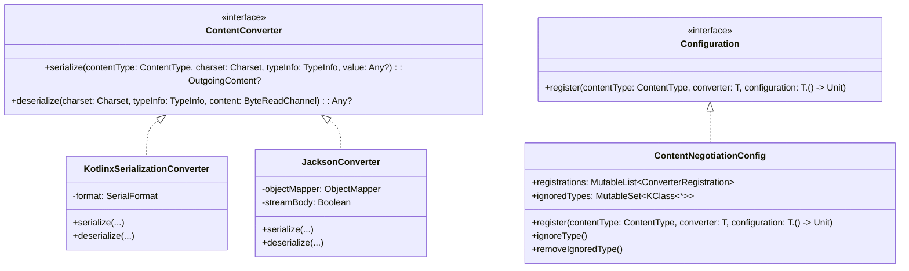
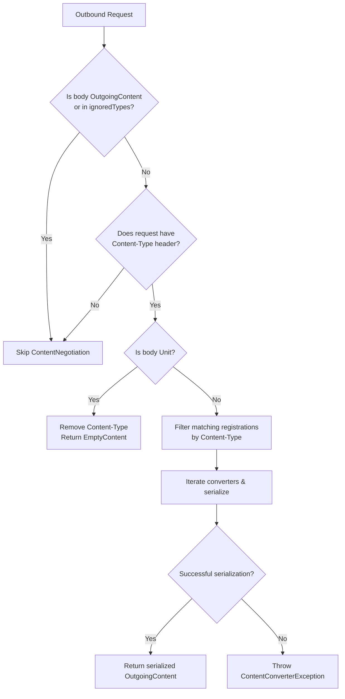
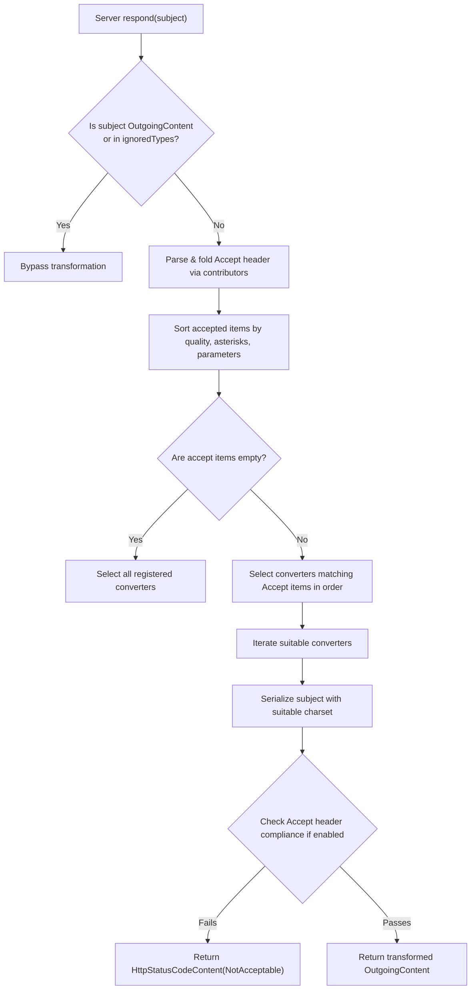
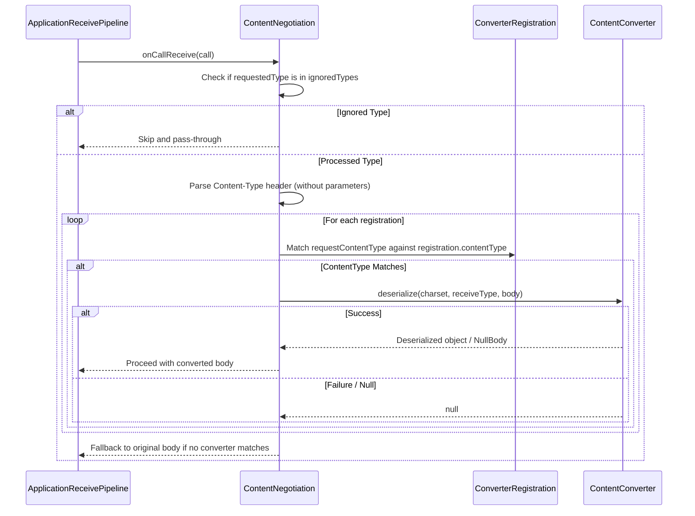
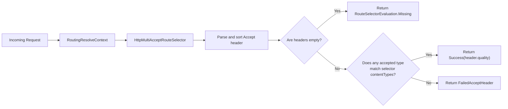

# Content Negotiation

<details>
<summary>Relevant source files</summary>

The following files were used as context for generating this wiki page:

- [ktor-client/ktor-client-plugins/ktor-client-content-negotiation/common/src/io/ktor/client/plugins/contentnegotiation/ContentNegotiation.kt](https://github.com/ktorio/ktor/blob/main/ktor-client/ktor-client-plugins/ktor-client-content-negotiation/common/src/io/ktor/client/plugins/contentnegotiation/ContentNegotiation.kt)
- [ktor-shared/ktor-serialization/ktor-serialization-tests/jvm/src/AbstractServerSerializationTest.kt](https://github.com/ktorio/ktor/blob/main/ktor-shared/ktor-serialization/ktor-serialization-tests/jvm/src/AbstractServerSerializationTest.kt)
- [ktor-server/ktor-server-core/common/src/io/ktor/server/routing/RouteSelector.kt](https://github.com/ktorio/ktor/blob/main/ktor-server/ktor-server-core/common/src/io/ktor/server/routing/RouteSelector.kt)
- [ktor-server/ktor-server-core/common/src/io/ktor/server/engine/DefaultTransform.kt](https://github.com/ktorio/ktor/blob/main/ktor-server/ktor-server-core/common/src/io/ktor/server/engine/DefaultTransform.kt)
- [ktor-server/ktor-server-plugins/ktor-server-content-negotiation/common/src/io/ktor/server/plugins/contentnegotiation/ContentNegotiation.kt](https://github.com/ktorio/ktor/blob/main/ktor-server/ktor-server-plugins/ktor-server-content-negotiation/common/src/io/ktor/server/plugins/contentnegotiation/ContentNegotiation.kt)
- [ktor-client/ktor-client-plugins/ktor-client-json/common/src/io/ktor/client/plugins/json/JsonPlugin.kt](https://github.com/ktorio/ktor/blob/main/ktor-client/ktor-client-plugins/ktor-client-json/common/src/io/ktor/client/plugins/json/JsonPlugin.kt)
- [ktor-shared/ktor-serialization/common/src/ContentConverter.kt](https://github.com/ktorio/ktor/blob/main/ktor-shared/ktor-serialization/common/src/ContentConverter.kt)
- [ktor-shared/ktor-serialization/ktor-serialization-kotlinx/common/src/io/ktor/serialization/kotlinx/KotlinxSerializationConverter.kt](https://github.com/ktorio/ktor/blob/main/ktor-shared/ktor-serialization/ktor-serialization-kotlinx/common/src/io/ktor/serialization/kotlinx/KotlinxSerializationConverter.kt)
- [ktor-server/ktor-server-plugins/ktor-server-content-negotiation/common/src/io/ktor/server/plugins/contentnegotiation/ResponseConverter.kt](https://github.com/ktorio/ktor/blob/main/ktor-server/ktor-server-plugins/ktor-server-content-negotiation/common/src/io/ktor/server/plugins/contentnegotiation/ResponseConverter.kt)
- [ktor-server/ktor-server-plugins/ktor-server-content-negotiation/common/src/io/ktor/server/plugins/contentnegotiation/RequestConverter.kt](https://github.com/ktorio/ktor/blob/main/ktor-server/ktor-server-plugins/ktor-server-content-negotiation/common/src/io/ktor/server/plugins/contentnegotiation/RequestConverter.kt)
- [ktor-server/ktor-server-plugins/ktor-server-content-negotiation/common/src/io/ktor/server/plugins/contentnegotiation/ContentNegotiationConfig.kt](https://github.com/ktorio/ktor/blob/main/ktor-server/ktor-server-plugins/ktor-server-content-negotiation/common/src/io/ktor/server/plugins/contentnegotiation/ContentNegotiationConfig.kt)
- [ktor-shared/ktor-serialization/ktor-serialization-jackson3/jvm/src/JacksonConverter.kt](https://github.com/ktorio/ktor/blob/main/ktor-shared/ktor-serialization/ktor-serialization-jackson3/jvm/src/JacksonConverter.kt)
- [ktor-http/common/src/io/ktor/http/Mimes.kt](https://github.com/ktorio/ktor/blob/main/ktor-http/common/src/io/ktor/http/Mimes.kt)
- [ktor-client/ktor-client-plugins/ktor-client-json/ktor-client-serialization/common/src/io/ktor/client/plugins/kotlinx/serializer/KotlinxSerializer.kt](https://github.com/ktorio/ktor/blob/main/ktor-client/ktor-client-plugins/ktor-client-json/ktor-client-serialization/common/src/io/ktor/client/plugins/kotlinx/serializer/KotlinxSerializer.kt)
- [ktor-server/ktor-server-plugins/ktor-server-content-negotiation/common/src/io/ktor/server/plugins/contentnegotiation/ContentNegotiationUtils.kt](https://github.com/ktorio/ktor/blob/main/ktor-server/ktor-server-plugins/ktor-server-content-negotiation/common/src/io/ktor/server/plugins/contentnegotiation/ContentNegotiationUtils.kt)
- [ktor-client/ktor-client-plugins/ktor-client-content-negotiation/common/src/io/ktor/client/plugins/contentnegotiation/JsonContentTypeMatcher.kt](https://github.com/ktorio/ktor/blob/main/ktor-client/ktor-client-plugins/ktor-client-content-negotiation/common/src/io/ktor/client/plugins/contentnegotiation/JsonContentTypeMatcher.kt)
- [ktor-shared/ktor-serialization/ktor-serialization-jackson/jvm/src/JacksonConverter.kt](https://github.com/ktorio/ktor/blob/main/ktor-shared/ktor-serialization/ktor-serialization-jackson/jvm/src/JacksonConverter.kt)
- [ktor-server/ktor-server-core/jvm/src/io/ktor/server/engine/DefaultTransformJvm.kt](https://github.com/ktorio/ktor/blob/main/ktor-server/ktor-server-core/jvm/src/io/ktor/server/engine/DefaultTransformJvm.kt)
- [ktor-server/ktor-server-core/common/src/io/ktor/server/http/content/DefaultContentTypes.kt](https://github.com/ktorio/ktor/blob/main/ktor-server/ktor-server-core/common/src/io/ktor/server/http/content/DefaultContentTypes.kt)
</details>

## Overview

### Architectural Purpose and Context
The `ContentNegotiation` subsystem in Ktor serves two core architectural purposes: negotiating media types between clients and servers using standard HTTP headers (`Accept` and `Content-Type`), and transparently serializing or deserializing application payloads between domain objects and wire formats (such as JSON, XML, CBOR, and Protocol Buffers). Without content negotiation, applications must manually inspect incoming headers, parse raw byte streams, and write explicit encoding routines for every endpoint. By plugging into Ktor's request and response pipelines, the subsystem intercepts payloads at transformation phases, matches requested media formats against available format converters, and delegates serialization tasks to backends like `kotlinx.serialization` or Jackson.

Sources: [ktor-client/ktor-client-plugins/ktor-client-content-negotiation/common/src/io/ktor/client/plugins/contentnegotiation/ContentNegotiation.kt:222-230](https://github.com/ktorio/ktor/blob/main/ktor-client/ktor-client-plugins/ktor-client-content-negotiation/common/src/io/ktor/client/plugins/contentnegotiation/ContentNegotiation.kt#L222-L230)

### Design and Pipeline Integration
Designed for symmetry across both Ktor clients and servers, the architecture decouples format-agnostic routing and application logic from specific wire protocols. When a client issues a request, the subsystem evaluates registered content types, manages `Accept` header quality values (`q`), merges headers via customizable strategies, and bypasses processing for explicitly ignored types (such as `ByteArray`, `String`, or `ByteReadChannel`). On the server side, it inspects incoming requests and outgoing responses, sorting accepted content types by quality parameters and matching them against registered `ContentConverter` instances. If no converter matches, or if headers violate compliance rules, the pipeline yields standard HTTP status responses like `406 Not Acceptable` or `415 Unsupported Media Type`.

Sources: [ktor-server/ktor-server-plugins/ktor-server-content-negotiation/common/src/io/ktor/server/plugins/contentnegotiation/ContentNegotiation.kt:51-58](https://github.com/ktorio/ktor/blob/main/ktor-server/ktor-server-plugins/ktor-server-content-negotiation/common/src/io/ktor/server/plugins/contentnegotiation/ContentNegotiation.kt#L51-L58)

## Public API and Core Interface Surface

The subsystem is anchored by the `ContentConverter` interface, which defines bidirectional conversion contracts between in-memory types and wire representations, and the `Configuration` interface, which exposes registration primitives for content types and converters.



Sources: [ktor-shared/ktor-serialization/common/src/ContentConverter.kt:26-60](https://github.com/ktorio/ktor/blob/main/ktor-shared/ktor-serialization/common/src/ContentConverter.kt#L26-L60)

| Interface / Class | Role / Purpose | Key Methods / Properties |
| :--- | :--- | :--- |
| `ContentConverter` | Base abstraction for serializing and deserializing custom content types. | `serialize(...)`, `deserialize(...)` |
| `Configuration` | Server/client configuration contract for registering content converters. | `register(...)` |
| `ContentNegotiationConfig` | Concrete configuration container managing registrations, ignored types, and strategies. | `registrations`, `ignoreType()`, `register()` |
| `KotlinxSerializationConverter` | Converter implementation wrapping `kotlinx.serialization` formats (`StringFormat` or `BinaryFormat`). | `serialize(...)`, `deserialize(...)`, `buildSchema(...)` |
| `JacksonConverter` | Converter implementation wrapping Jackson `ObjectMapper` for JSON/Smile handling. | `serialize(...)`, `deserialize(...)` |

Sources: [ktor-server/ktor-server-plugins/ktor-server-content-negotiation/common/src/io/ktor/server/plugins/contentnegotiation/ContentNegotiationConfig.kt:29-122](https://github.com/ktorio/ktor/blob/main/ktor-server/ktor-server-plugins/ktor-server-content-negotiation/common/src/io/ktor/server/plugins/contentnegotiation/ContentNegotiationConfig.kt#L29-L122)

---

## Client-Side Control Flow and Request Negotiation

When installing `ContentNegotiation` on an `HttpClient`, the plugin intercepts requests and responses to inject `Accept` headers and serialize outbound bodies.



Sources: [ktor-client/ktor-client-plugins/ktor-client-content-negotiation/common/src/io/ktor/client/plugins/contentnegotiation/ContentNegotiation.kt:239-309](https://github.com/ktorio/ktor/blob/main/ktor-client/ktor-client-plugins/ktor-client-content-negotiation/common/src/io/ktor/client/plugins/contentnegotiation/ContentNegotiation.kt#L239-309)

The client execution sequence follows a strict invariant check before attempting conversion:
1. **Accept Header Injection**: Evaluates request registrations against existing `Accept` headers using the configured `ContentTypeMergeStrategy`. Optional `q` values can be assigned via `defaultAcceptHeaderQValue`.
2. **Ignored Type Guard**: If the request payload is already an `OutgoingContent` instance or matches any class in `ignoredTypes` (which defaults to `ByteArray`, `String`, `HttpStatusCode`, `ByteReadChannel`, `OutgoingContent`, and `ClientSSESession`), the plugin logs the skip and returns `null`.
3. **Content-Type Validation**: If the request lacks a `Content-Type` header, negotiation is skipped. If the body is `Unit`, headers are scrubbed and `EmptyContent` is returned.
4. **Matching and Serialization**: Registrations whose `contentTypeMatcher` matches the request content type are evaluated sequentially. The first converter that successfully serializes the subject returns an `OutgoingContent`. If all matching converters return `null`, a `ContentConverterException` is thrown.

> [!WARNING]
> If a request body type is registered in `ignoredTypes` (such as `String` or `ByteArray`), `ContentNegotiation` will completely ignore it, leaving serialization to default platform transformers. Use `removeIgnoredType<String>()` if you need custom converters to handle primitive types.

Sources: [ktor-client/ktor-client-plugins/ktor-client-content-negotiation/common/src/io/ktor/client/plugins/contentnegotiation/ContentNegotiation.kt:24-32](https://github.com/ktorio/ktor/blob/main/ktor-client/ktor-client-plugins/ktor-client-content-negotiation/common/src/io/ktor/client/plugins/contentnegotiation/ContentNegotiation.kt#L24-L32)

---

## Server-Side Response Conversion and Quality Sorting

On the server side, `ContentNegotiation` intercepts outgoing responses via `onCallRespond` to match the client's `Accept` header against available server-registered content types.



Sources: [ktor-server/ktor-server-plugins/ktor-server-content-negotiation/common/src/io/ktor/server/plugins/contentnegotiation/ResponseConverter.kt:18-101](https://github.com/ktorio/ktor/blob/main/ktor-server/ktor-server-plugins/ktor-server-content-negotiation/common/src/io/ktor/server/plugins/contentnegotiation/ResponseConverter.kt#L18-L101)

When multiple media types are accepted by a client, the server determines the winning converter by sorting accepted items through `sortedByQuality()`:
- **Quality Factor (`q`)**: Descending order of `q` (higher quality preferred).
- **Wildcards**: Preference given to concrete types over wildcard media ranges (asterisk count: `*/*` scores highest asterisk penalty, then `type/*`, then concrete).
- **Parameter Count**: Descending order of parameter count to break ties in favor of more specific media type declarations.

> [!IMPORTANT]
> When `checkAcceptHeaderCompliance` is set to `true` in `ContentNegotiationConfig`, if the resulting serialized content type does not match any item in the client's `Accept` header, the server short-circuits and returns a `406 Not Acceptable` response (`HttpStatusCodeContent(HttpStatusCode.NotAcceptable)`).

Sources: [ktor-server/ktor-server-plugins/ktor-server-content-negotiation/common/src/io/ktor/server/plugins/contentnegotiation/ResponseConverter.kt:107-119](https://github.com/ktorio/ktor/blob/main/ktor-server/ktor-server-plugins/ktor-server-content-negotiation/common/src/io/ktor/server/plugins/contentnegotiation/ResponseConverter.kt#L107-L119)

---

## Server-Side Request Deserialization

When a server receives an inbound request body (via `call.receive<T>()`), `ContentNegotiation` intercepts the receive pipeline to deserialize the byte channel into the requested object type.



Sources: [ktor-server/ktor-server-plugins/ktor-server-content-negotiation/common/src/io/ktor/server/plugins/contentnegotiation/RequestConverter.kt:16-48](https://github.com/ktorio/ktor/blob/main/ktor-server/ktor-server-plugins/ktor-server-content-negotiation/common/src/io/ktor/server/plugins/contentnegotiation/RequestConverter.kt#L16-L48)

The request conversion algorithm inspects the inbound `Content-Type` header (stripping parameters via `withoutParameters()`), retrieves the request character set (defaulting to UTF-8), and iterates through registered converters. If the body stream is empty and the target type is nullable, it immediately yields `NullBody`. If deserialization throws an exception, it is wrapped in a `BadRequestException`.

Sources: [ktor-server/ktor-server-plugins/ktor-server-content-negotiation/common/src/io/ktor/server/plugins/contentnegotiation/RequestConverter.kt:50-77](https://github.com/ktorio/ktor/blob/main/ktor-server/ktor-server-plugins/ktor-server-content-negotiation/common/src/io/ktor/server/plugins/contentnegotiation/RequestConverter.kt#L50-77)

---

## Serialization Converters: Kotlinx and Jackson

### Kotlinx Serialization
Wraps any kotlinx `SerialFormat` (distinguishing between `StringFormat` like `Json` and `BinaryFormat` like `ProtoBuf` or `CBOR`). During serialization, it attempts to resolve serializers via `serializersModule.serializerForTypeInfo(typeInfo)` or falls back to `guessSerializer(value)`.
- **String Formats**: Encodes objects via `format.encodeToString(...)` into a `TextContent`.
- **Binary Formats**: Encodes objects via `format.encodeFromByteArray(...)` into a `ByteArrayContent`.

Sources: [ktor-shared/ktor-serialization/ktor-serialization-kotlinx/common/src/io/ktor/serialization/kotlinx/KotlinxSerializationConverter.kt:27-116](https://github.com/ktorio/ktor/blob/main/ktor-shared/ktor-serialization/ktor-serialization-kotlinx/common/src/io/ktor/serialization/kotlinx/KotlinxSerializationConverter.kt#L27-L116)

### Jackson Serialization
Wraps Jackson `ObjectMapper`. 
- **Streaming Support**: When `streamBody` is enabled (default), it streams request and response bodies directly to output streams using chunked transfer encoding (`Transfer-Encoding: chunked`), preventing full-payload in-memory buffering. For Kotlin `Flow` types, it serializes items as a JSON array by manually driving a `JsonGenerator`.
- **Unicode Handling**: Automatically detects Unicode charsets (`UTF-8`, `UTF-16`, `UTF-32`) to optimize decoding paths.

Sources: [ktor-shared/ktor-serialization/ktor-serialization-jackson3/jvm/src/JacksonConverter.kt:35-152](https://github.com/ktorio/ktor/blob/main/ktor-shared/ktor-serialization/ktor-serialization-jackson3/jvm/src/JacksonConverter.kt#L35-L152)

---

## Routing Integration and Accept Route Selectors

Ktor routing integrates content negotiation selectors such as `HttpAcceptRouteSelector` and `HttpMultiAcceptRouteSelector` to evaluate incoming `Accept` headers during route resolution.



Sources: [ktor-server/ktor-server-core/common/src/io/ktor/server/routing/RouteSelector.kt:748-775](https://github.com/ktorio/ktor/blob/main/ktor-server/ktor-server-core/common/src/io/ktor/server/routing/RouteSelector.kt#L748-L775)

The `HttpMultiAcceptRouteSelector` evaluates whether the client's `Accept` header satisfies the route's content type requirements:
- If the `Accept` header is absent, it returns `RouteSelectorEvaluation.Missing`.
- If parsing fails due to a malformed header format, it throws a `BadRequestException`.
- It tests compatibility using `isCompatibleWith`, which handles wildcard matching (`*/*`, `type/*`). If a match is found, it returns a `Success` evaluation carrying the header's quality score. Otherwise, it returns `FailedAcceptHeader` (which evaluates to a `406 Not Acceptable` status).

Sources: [ktor-server/ktor-server-core/common/src/io/ktor/server/routing/RouteSelector.kt:828-833](https://github.com/ktorio/ktor/blob/main/ktor-server/ktor-server-core/common/src/io/ktor/server/routing/RouteSelector.kt#L828-L833)

---

## Configuration Options and Design Trade-offs

### Configuration Parameters
| Configuration Property / Strategy | Default Value | Purpose / Description |
| :--- | :--- | :--- |
| `ContentTypeMergeStrategy.Default` | Active | Appends each registered content type that is not already represented in existing `Accept` headers. |
| `ContentTypeMergeStrategy.SkipIfPresent` | Inactive | Skips `Accept` header injection entirely if any `Accept` header is already present on the request. |
| `checkAcceptHeaderCompliance` | `false` (Server) | When `true`, enforces strict compliance between response content type and client `Accept` headers, returning `406 Not Acceptable` on mismatch. |
| `defaultAcceptHeaderQValue` | `null` (Client) | Assigns an explicit quality factor (`q`) to registered content types injected into the outbound `Accept` header. |
| `ignoredTypes` | `ByteArray`, `String`, `HttpStatusCode`, `ByteReadChannel`, `OutgoingContent` | Types explicitly bypassed by content negotiation to preserve raw streaming or primitive handling. |

Sources: [ktor-client/ktor-client-plugins/ktor-client-content-negotiation/common/src/io/ktor/client/plugins/contentnegotiation/ContentNegotiation.kt:66-91](https://github.com/ktorio/ktor/blob/main/ktor-client/ktor-client-plugins/ktor-client-content-negotiation/common/src/io/ktor/client/plugins/contentnegotiation/ContentNegotiation.kt#L66-L91)

### Design Trade-offs
| Design Choice | Benefit | Cost |
| :--- | :--- | :--- |
| **Sequential Converter Iteration** | Enables flexible multi-format fallback ordering and custom matchers. | O(N) traversal over registered converters per serialization/deserialization call. |
| **Default Ignored Primitives** | Prevents accidental serialization overhead on raw byte channels, strings, and status codes. | Requires explicit configuration (`removeIgnoredType`) if raw string/byte payloads need content negotiation. |
| **Streaming Output (Jackson/Kotlinx)** | Keeps memory footprint low for large payloads and infinite flows by chunking output. | Sets `Transfer-Encoding: chunked`, which prevents upfront computation of `Content-Length`. |
| **Quality-Based Sorting** | Conforms strictly to HTTP RFC negotiation semantics for client-preferred media types. | Adds sorting overhead and complex wildcard precedence resolution rules during response rendering. |

Sources: [ktor-client/ktor-client-plugins/ktor-client-content-negotiation/common/src/io/ktor/client/plugins/contentnegotiation/ContentNegotiation.kt:292-306](https://github.com/ktorio/ktor/blob/main/ktor-client/ktor-client-plugins/ktor-client-content-negotiation/common/src/io/ktor/client/plugins/contentnegotiation/ContentNegotiation.kt#L292-306)

---

## Runnable Example

The following complete, copy-pasteable example demonstrates how to configure `ContentNegotiation` with `kotlinx.serialization` on a Ktor server test application, register a serializable entity, and verify request/response serialization.

```kotlin
import io.ktor.client.request.*
import io.ktor.client.statement.*
import io.ktor.http.*
import io.ktor.serialization.kotlinx.*
import io.ktor.server.application.*
import io.ktor.server.plugins.contentnegotiation.*
import io.ktor.server.request.*
import io.ktor.server.response.*
import io.ktor.server.routing.*
import io.ktor.server.testing.*
import kotlinx.serialization.Serializable
import kotlin.test.Test
import kotlin.test.assertEquals

@Serializable
data class UserProfile(val id: Int, val username: String)

class ContentNegotiationExampleTest {

    @Test
    fun testUserSerializationRoundtrip() = testApplication {
        install(ContentNegotiation) {
            serialization(ContentType.Application.Json, kotlinx.serialization.json.Json {
                ignoreUnknownKeys = true
            })
        }

        routing {
            get("/user") {
                call.respond(UserProfile(42, "ktor_user"))
            }
            post("/user") {
                val user = call.receive<UserProfile>()
                call.respond(user)
            }
        }

        // Test GET with Accept header negotiation
        client.get("/user") {
            header(HttpHeaders.Accept, "application/json")
        }.let { response ->
            assertEquals(HttpStatusCode.OK, response.status)
            assertEquals("""{"id":42,"username":"ktor_user"}""", response.bodyAsText())
            assertEquals(ContentType.Application.Json.withCharset(Charsets.UTF_8), ContentType.parse(response.headers[HttpHeaders.ContentType]!!))
        }

        // Test POST with content conversion
        client.post("/user") {
            header(HttpHeaders.ContentType, "application/json")
            header(HttpHeaders.Accept, "application/json")
            setBody("""{"id":100,"username":"admin"}""")
        }.let { response ->
            assertEquals(HttpStatusCode.OK, response.status)
            assertEquals("""{"id":100,"username":"admin"}""", response.bodyAsText())
        }
    }
}
```

Sources: [ktor-shared/ktor-serialization/ktor-serialization-tests/jvm/src/AbstractServerSerializationTest.kt:33-75](https://github.com/ktorio/ktor/blob/main/ktor-shared/ktor-serialization/ktor-serialization-tests/jvm/src/AbstractServerSerializationTest.kt#L33-L75), [ktor-shared/ktor-serialization/ktor-serialization-kotlinx/common/src/io/ktor/serialization/kotlinx/KotlinxSerializationConverter.kt:124-136](https://github.com/ktorio/ktor/blob/main/ktor-shared/ktor-serialization/ktor-serialization-kotlinx/common/src/io/ktor/serialization/kotlinx/KotlinxSerializationConverter.kt#L124-L136)

## Related

- [[Calls and Content]]
- [[Client Serialization]]

