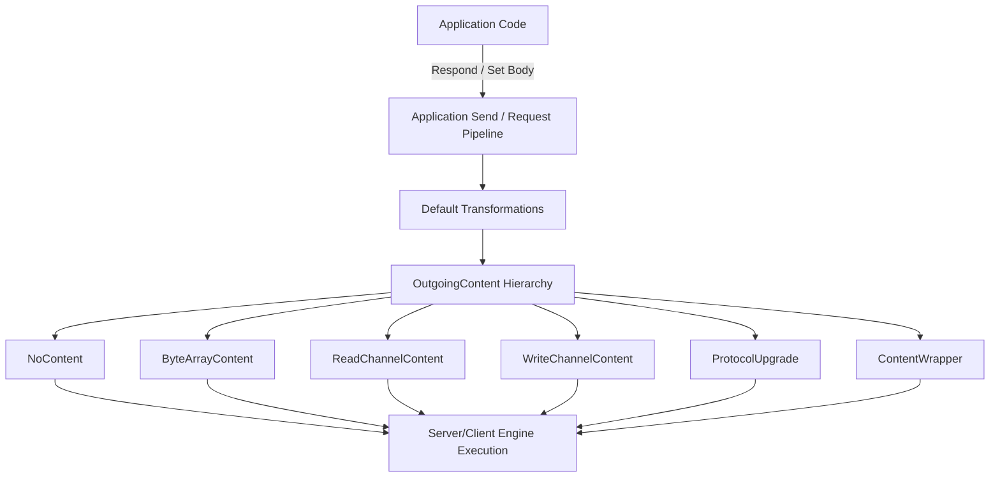
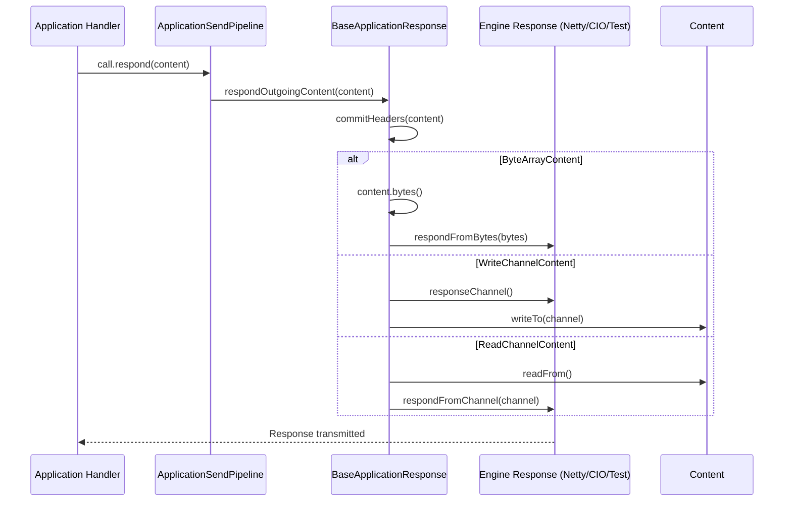

# Content Representation

<details>
<summary>Relevant source files</summary>

The following files were used as context for generating this wiki page:

- [ktor-server/ktor-server-test-suites/jvm/src/io/ktor/server/testing/suites/ContentTestSuite.kt](https://github.com/ktorio/ktor/blob/main/ktor-server/ktor-server-test-suites/jvm/src/io/ktor/server/testing/suites/ContentTestSuite.kt)
- [ktor-http/common/src/io/ktor/http/content/OutgoingContent.kt](https://github.com/ktorio/ktor/blob/main/ktor-http/content/OutgoingContent.kt)
- [ktor-client/ktor-client-core/common/src/io/ktor/client/request/forms/FormDataContent.kt](https://github.com/ktorio/ktor/blob/main/ktor-client/ktor-client-core/common/src/io/ktor/client/request/forms/FormDataContent.kt)
- [ktor-server/ktor-server-core/common/src/io/ktor/server/engine/BaseApplicationResponse.kt](https://github.com/ktorio/ktor/blob/main/ktor-server/ktor-server-core/common/src/io/ktor/server/engine/BaseApplicationResponse.kt)
- [ktor-server/ktor-server-core/common/src/io/ktor/server/engine/DefaultTransform.kt](https://github.com/ktorio/ktor/blob/main/ktor-server/ktor-server-core/common/src/io/ktor/server/engine/DefaultTransform.kt)
- [ktor-server/ktor-server-netty/jvm/src/io/ktor/server/netty/NettyApplicationResponse.kt](https://github.com/ktorio/ktor/blob/main/ktor-server/ktor-server-netty/jvm/src/io/ktor/server/netty/NettyApplicationResponse.kt)
- [ktor-client/ktor-client-plugins/ktor-client-logging/common/src/io/ktor/client/plugins/logging/Logging.kt](https://github.com/ktorio/ktor/blob/main/ktor-client/ktor-client-plugins/ktor-client-logging/common/src/io/ktor/client/plugins/logging/Logging.kt)
- [ktor-client/ktor-client-core/common/src/io/ktor/client/utils/Content.kt](https://github.com/ktorio/ktor/blob/main/ktor-client/ktor-client-core/common/src/io/ktor/client/utils/Content.kt)
- [ktor-client/ktor-client-cio/common/src/io/ktor/client/engine/cio/utils.kt](https://github.com/ktorio/ktor/blob/main/ktor-client/ktor-client-cio/common/src/io/ktor/client/engine/cio/utils.kt)
- [ktor-server/ktor-server-cio/common/src/io/ktor/server/cio/CIOApplicationResponse.kt](https://github.com/ktorio/ktor/blob/main/ktor-server/ktor-server-cio/common/src/io/ktor/server/cio/CIOApplicationResponse.kt)
- [ktor-server/ktor-server-core/jvm/src/io/ktor/server/engine/DefaultTransformJvm.kt](https://github.com/ktorio/ktor/blob/main/ktor-server/ktor-server-core/jvm/src/io/ktor/server/engine/DefaultTransformJvm.kt)
- [ktor-http/common/src/io/ktor/http/content/Multipart.kt](https://github.com/ktorio/ktor/blob/main/ktor-http/common/src/io/ktor/http/content/Multipart.kt)
- [ktor-server/ktor-server-core/jvm/src/io/ktor/server/http/content/DefaultTransformJvm.kt](https://github.com/ktorio/ktor/blob/main/ktor-server/ktor-server-core/jvm/src/io/ktor/server/http/content/DefaultTransformJvm.kt)
- [ktor-client/ktor-client-core/common/src/io/ktor/client/request/ClientUpgradeContent.kt](https://github.com/ktorio/ktor/blob/main/ktor-client/ktor-client-core/common/src/io/ktor/client/request/ClientUpgradeContent.kt)
- [ktor-client/ktor-client-apache5/jvm/src/io/ktor/client/engine/apache5/ApacheRequestProducer.kt](https://github.com/ktorio/ktor/blob/main/ktor-client/ktor-client-apache5/jvm/src/io/ktor/client/engine/apache5/ApacheRequestProducer.kt)
- [ktor-client/ktor-client-winhttp/windows/src/io/ktor/client/engine/winhttp/internal/WinHttpRequestProducer.kt](https://github.com/ktorio/ktor/blob/main/ktor-client/ktor-client-winhttp/windows/src/io/ktor/client/engine/winhttp/internal/WinHttpRequestProducer.kt)
- [ktor-server/ktor-server-core/common/src/io/ktor/server/http/content/DefaultTransform.kt](https://github.com/ktorio/ktor/blob/main/ktor-server/ktor-server-core/common/src/io/ktor/server/http/content/DefaultTransform.kt)
- [ktor-server/ktor-server-plugins/ktor-server-partial-content/common/src/io/ktor/server/plugins/partialcontent/PartialOutgoingContent.kt](https://github.com/ktorio/ktor/blob/main/ktor-server/ktor-server-plugins/ktor-server-partial-content/common/src/io/ktor/server/plugins/partialcontent/PartialOutgoingContent.kt)
- [ktor-client/ktor-client-darwin/darwin/src/io/ktor/client/engine/darwin/DarwinUtils.kt](https://github.com/ktorio/ktor/blob/main/ktor-client/ktor-client-darwin/darwin/src/io/ktor/client/engine/darwin/DarwinUtils.kt)
- [ktor-http/jvm/src/io/ktor/http/content/OutputStreamContent.kt](https://github.com/ktorio/ktor/blob/main/ktor-http/jvm/src/io/ktor/http/content/OutputStreamContent.kt)
- [ktor-http/common/src/io/ktor/http/content/ChannelWriterContent.kt](https://github.com/ktorio/ktor/blob/main/ktor-http/common/src/io/ktor/http/content/ChannelWriterContent.kt)
- [ktor-server/ktor-server-test-host/common/src/io/ktor/server/testing/TestApplicationResponse.kt](https://github.com/ktorio/ktor/blob/main/ktor-server/ktor-server-test-host/common/src/io/ktor/server/testing/TestApplicationResponse.kt)
- [ktor-http/common/src/io/ktor/http/content/TextContent.kt](https://github.com/ktorio/ktor/blob/main/ktor-http/common/src/io/ktor/http/content/TextContent.kt)
- [ktor-server/ktor-server-core/nonJvm/src/io/ktor/server/engine/DefaultTransform.nonJvm.kt](https://github.com/ktorio/ktor/blob/main/ktor-server/ktor-server-core/nonJvm/src/io/ktor/server/engine/DefaultTransform.nonJvm.kt)
- [ktor-http/jvm/src/io/ktor/http/content/WriterContent.kt](https://github.com/ktorio/ktor/blob/main/ktor-http/jvm/src/io/ktor/http/content/WriterContent.kt)
- [ktor-http/common/src/io/ktor/http/content/ByteArrayContent.kt](https://github.com/ktorio/ktor/blob/main/ktor-http/content/ByteArrayContent.kt)
- [ktor-client/ktor-client-curl/desktop/src/io/ktor/client/engine/curl/CurlClientEngine.kt](https://github.com/ktorio/ktor/blob/main/ktor-client/ktor-client-curl/desktop/src/io/ktor/client/engine/curl/CurlClientEngine.kt)
- [ktor-client/ktor-client-curl/desktop/src/io/ktor/client/engine/curl/internal/CurlRaw.kt](https://github.com/ktorio/ktor/blob/main/ktor-client/ktor-client-curl/desktop/src/io/ktor/client/engine/curl/internal/CurlRaw.kt)
- [ktor-client/ktor-client-okhttp/jvm/src/io/ktor/client/engine/okhttp/OkHttpEngine.kt](https://github.com/ktorio/ktor/blob/main/ktor-client/ktor-client-okhttp/jvm/src/io/ktor/client/engine/okhttp/OkHttpEngine.kt)
- [ktor-client/ktor-client-plugins/ktor-client-logging/common/src/io/ktor/client/plugins/logging/ObservingUtils.kt](https://github.com/ktorio/ktor/blob/main/ktor-client/ktor-client-plugins/ktor-client-logging/common/src/io/ktor/client/plugins/logging/ObservingUtils.kt)
</details>

## Overview

Content Representation in Ktor centers around the `OutgoingContent` abstraction and its subclasses, providing a unified, engine-agnostic model for representing, serializing, and transmitting HTTP message bodies across both client requests and server responses. In distributed network applications, different data sources—ranging from static byte arrays and in-memory strings to reactive byte channels, streaming writers, files, and multipart form submissions—require vastly different allocation strategies and transfer mechanics. `OutgoingContent` abstracts these underlying differences into a sealed class hierarchy that supplies metadata such as `ContentType`, `contentLength`, headers, status codes, and trailers.

By decoupling application-level handlers from low-level network engines (such as Netty, CIO, OkHttp, Apache, WinHttp, and Darwin), Ktor enables uniform pipeline transformations, precise header and chunking management, and memory-efficient streaming. Engines receive a concrete subtype of `OutgoingContent` and route it through optimized code paths without needing to inspect raw application objects.

Sources: [ktor-http/common/src/io/ktor/http/content/OutgoingContent.kt#L20-L25](https://github.com/ktorio/ktor/blob/main/ktor-http/common/src/io/ktor/http/content/OutgoingContent.kt#L20-L25)



Sources: [ktor-http/common/src/io/ktor/http/content/OutgoingContent.kt#L25-L208](https://github.com/ktorio/ktor/blob/main/ktor-http/common/src/io/ktor/http/content/OutgoingContent.kt#L25-L208), [ktor-server/ktor-server-core/common/src/io/ktor/server/engine/BaseApplicationResponse.kt#L123-L169](https://github.com/ktorio/ktor/blob/main/ktor-server/ktor-server-core/common/src/io/ktor/server/engine/BaseApplicationResponse.kt#L123-L169)

## The `OutgoingContent` Hierarchy and Subclasses

The `OutgoingContent` sealed class defines the contract for any payload transmitted over HTTP. It exposes optional properties including `contentType`, `contentLength`, `status`, `headers`, extension attributes, and `trailers()`. The hierarchy branches into specific payload representations tailored for memory efficiency and streaming characteristics.

- `OutgoingContent.NoContent`: Represents messages without a payload, such as `204 No Content` or `EmptyContent`. Sources: [ktor-http/common/src/io/ktor/http/content/OutgoingContent.kt#L91-L93](https://github.com/ktorio/ktor/blob/main/ktor-http/common/src/io/ktor/http/content/OutgoingContent.kt#L91-L93), [ktor-client/ktor-client-core/common/src/io/ktor/client/utils/Content.kt#L18-L20](https://github.com/ktorio/ktor/blob/main/ktor-client/ktor-client-core/common/src/io/ktor/client/utils/Content.kt#L18-L20)
- `OutgoingContent.ByteArrayContent`: Represents payloads backed by a fixed `ByteArray`. Concrete implementations include `ByteArrayContent`, `TextContent`, and `FormDataContent`. Sources: [ktor-http/common/src/io/ktor/http/content/OutgoingContent.kt#L143-L152](https://github.com/ktorio/ktor/blob/main/ktor-http/common/src/io/ktor/http/content/OutgoingContent.kt#L143-L152), [ktor-http/common/src/io/ktor/http/content/ByteArrayContent.kt#L14-L22](https://github.com/ktorio/ktor/blob/main/ktor-http/common/src/io/ktor/http/content/ByteArrayContent.kt#L14-L22), [ktor-http/common/src/io/ktor/http/content/TextContent.kt#L18-L31](https://github.com/ktorio/ktor/blob/main/ktor-http/common/src/io/ktor/http/content/TextContent.kt#L18-L31), [ktor-client/ktor-client-core/common/src/io/ktor/client/request/forms/FormDataContent.kt#L27-L36](https://github.com/ktorio/ktor/blob/main/ktor-client/ktor-client-core/common/src/io/ktor/client/request/forms/FormDataContent.kt#L27-L36)
- `OutgoingContent.ReadChannelContent`: Provides a `ByteReadChannel` via `readFrom()`. It supports range requests by providing an optional `readFrom(range: LongRange)` override that discards leading bytes and copies up to the specified limit. Sources: [ktor-http/common/src/io/ktor/http/content/OutgoingContent.kt#L99-L124](https://github.com/ktorio/ktor/blob/main/ktor-http/common/src/io/ktor/http/content/OutgoingContent.kt#L99-L124)
- `OutgoingContent.WriteChannelContent`: Exposes a suspend function `writeTo(channel: ByteWriteChannel)` where engines or producers write data directly. Subclasses include `WriterContent`, `OutputStreamContent`, `ChannelWriterContent`, and `MultiPartFormDataContent`. Sources: [ktor-http/common/src/io/ktor/http/content/OutgoingContent.kt#L130-L138](https://github.com/ktorio/ktor/blob/main/ktor-http/common/src/io/ktor/http/content/OutgoingContent.kt#L130-L138), [ktor-http/jvm/src/io/ktor/http/content/OutputStreamContent.kt#L18-L23](https://github.com/ktorio/ktor/blob/main/ktor-http/jvm/src/io/ktor/http/content/OutputStreamContent.kt#L18-L23), [ktor-http/common/src/io/ktor/http/content/ChannelWriterContent.kt#L16-L21](https://github.com/ktorio/ktor/blob/main/ktor-http/common/src/io/ktor/http/content/ChannelWriterContent.kt#L16-L21), [ktor-http/jvm/src/io/ktor/http/content/WriterContent.kt#L16-L21](https://github.com/ktorio/ktor/blob/main/ktor-http/content/WriterContent.kt#L16-L21), [ktor-client/ktor-client-core/common/src/io/ktor/client/request/forms/FormDataContent.kt#L49-L54](https://github.com/ktorio/ktor/blob/main/ktor-client/ktor-client-core/common/src/io/ktor/client/request/forms/FormDataContent.kt#L49-L54)
- `OutgoingContent.ProtocolUpgrade`: Used for protocol switches like WebSockets (`101 Switching Protocols`), requiring an `upgrade` function that handles duplex `ByteReadChannel` and `ByteWriteChannel` streams. Sources: [ktor-http/common/src/io/ktor/http/content/OutgoingContent.kt#L158-L179](https://github.com/ktorio/ktor/blob/main/ktor-http/common/src/io/ktor/http/content/OutgoingContent.kt#L158-L179)
- `OutgoingContent.ContentWrapper`: Delegates properties and operations to an inner `OutgoingContent`, allowing interceptors and plugins (such as logging or compression) to wrap content transparently. Sources: [ktor-http/common/src/io/ktor/http/content/OutgoingContent.kt#L185-L207](https://github.com/ktorio/ktor/blob/main/ktor-http/content/OutgoingContent.kt#L185-L207)

| Subclass Type | Core Abstraction / Method | Default Content-Length Handling | Typical Use Cases |
| :--- | :--- | :--- | :--- |
| `NoContent` | None | `0` or omitted | `204 No Content`, `304 Not Modified`, `EmptyContent` |
| `ByteArrayContent` | `bytes(): ByteArray` | Exact byte array size | Strings, binary buffers, form URL-encoded data |
| `ReadChannelContent` | `readFrom(): ByteReadChannel` | Optional (chunked if `null`) | File streams, reactive byte channels |
| `WriteChannelContent` | `writeTo(channel: ByteWriteChannel)` | Optional (chunked if `null`) | Writers, output streams, multipart form data |
| `ProtocolUpgrade` | `upgrade(...)` | N/A (`101 Switching Protocols`) | WebSockets, HTTP upgrade tunnels |
| `ContentWrapper` | Delegates to inner `OutgoingContent` | Delegates | Logging, compression, content observation |

Sources: [ktor-http/common/src/io/ktor/http/content/OutgoingContent.kt#L25-L93](https://github.com/ktorio/ktor/blob/main/ktor-http/common/src/io/ktor/http/content/OutgoingContent.kt#L25-L93), [ktor-http/common/src/io/ktor/http/content/OutgoingContent.kt#L99-L207](https://github.com/ktorio/ktor/blob/main/ktor-http/common/src/io/ktor/http/content/OutgoingContent.kt#L99-L207)

## Content Transformation Pipelines

Both server and client pipelines feature transformation phases that convert arbitrary application types into `OutgoingContent` before transmission or parse incoming bytes into expected types.

On the server side, `installDefaultTransformations()` on `ApplicationSendPipeline` intercepts the `Render` phase and invokes `transformDefaultContent(call, value)`. If the value is already an `OutgoingContent`, it passes through unchanged. Strings are converted to `TextContent`, `ByteArray` instances to `ByteArrayContent`, `HttpStatusCode` values to `HttpStatusCodeContent`, and `ByteReadChannel` instances to an anonymous `ReadChannelContent`. Platform-specific transformers (`PlatformTransformDefaultContent`) handle types like `InputStream` or `URIFileContent`. Sources: [ktor-server/ktor-server-core/common/src/io/ktor/server/engine/DefaultTransform.kt#L28-L33](https://github.com/ktorio/ktor/blob/main/ktor-server/ktor-server-core/common/src/io/ktor/server/engine/DefaultTransform.kt#L28-L33), [ktor-server/ktor-server-core/common/src/io/ktor/server/http/content/DefaultTransform.kt#L18-L39](https://github.com/ktorio/ktor/blob/main/ktor-server/ktor-server-core/common/src/io/ktor/server/http/content/DefaultTransform.kt#L18-L39), [ktor-server/ktor-server-core/jvm/src/io/ktor/server/http/content/DefaultTransformJvm.kt#L16-L32](https://github.com/ktorio/ktor/blob/main/ktor-server/ktor-server-core/jvm/src/io/ktor/server/http/content/DefaultTransformJvm.kt#L16-L32)

Conversely, receive transformations on `ApplicationReceivePipeline` unpack incoming `ByteReadChannel` payloads into `ByteArray`, `Parameters`, or `MultiPartData` based on the request's `Content-Type` header and target reflection type. Sources: [ktor-server/ktor-server-core/common/src/io/ktor/server/engine/DefaultTransform.kt#L40-L96](https://github.com/ktorio/ktor/blob/main/ktor-server/ktor-server-core/common/src/io/ktor/server/engine/DefaultTransform.kt#L40-L96)

```mermaid
flowchart LR
    Value["Arbitrary Object (String, ByteArray, etc.)"] --> SendPipeline["ApplicationSendPipeline.Render"]
    SendPipeline --> TransFn["transformDefaultContent()"]
    TransFn --> Match{Is Instance Of}
    Match -->|OutgoingContent| OC1["OutgoingContent"]
    Match -->|String| TC["TextContent"]
    Match -->|ByteArray| BAC["ByteArrayContent"]
    Match -->|HttpStatusCode| HSC["HttpStatusCodeContent"]
    Match -->|ByteReadChannel| RCC["ReadChannelContent"]
    Match -->|Platform (InputStream/URI)| PEC["Platform Content"]
```

Sources: [ktor-server/ktor-server-core/common/src/io/ktor/server/engine/DefaultTransform.kt#L28-L33](https://github.com/ktorio/ktor/blob/main/ktor-server/ktor-server-core/common/src/io/ktor/server/engine/DefaultTransform.kt#L28-L33), [ktor-server/ktor-server-core/common/src/io/ktor/server/http/content/DefaultTransform.kt#L18-L39](https://github.com/ktorio/ktor/blob/main/ktor-server/ktor-server-core/common/src/io/ktor/server/http/content/DefaultTransform.kt#L18-L39)

## Multipart and Form Data Representation

Form submissions and multipart file uploads are modeled as specialized `OutgoingContent` implementations on the client and parsed structures on the server.

`FormDataContent` represents `application/x-www-form-urlencoded` requests. It encodes parameters via `formUrlEncode()`, wraps them in a `ByteArrayContent`, and sets `Content-Type` to `application/x-www-form-urlencoded; charset=UTF-8`. Sources: [ktor-client/ktor-client-core/common/src/io/ktor/client/request/forms/FormDataContent.kt#L27-L36](https://github.com/ktorio/ktor/blob/main/ktor-client/ktor-client-core/common/src/io/ktor/client/request/forms/FormDataContent.kt#L27-L36)

`MultiPartFormDataContent` represents `multipart/form-data` payloads. It extends `OutgoingContent.WriteChannelContent()` and manages boundaries, part headers, and data streams (`PreparedPart.InputPart` and `PreparedPart.ChannelPart`). Sources: [ktor-client/ktor-client-core/common/src/io/ktor/client/request/forms/FormDataContent.kt#L49-L171](https://github.com/ktorio/ktor/blob/main/ktor-client/ktor-client-core/common/src/io/ktor/client/request/forms/FormDataContent.kt#L49-L171)

On the server receiving side, multipart data is parsed into `PartData` items:
- `PartData.FormItem`: Contains form field values and metadata. Sources: [ktor-http/common/src/io/ktor/http/content/Multipart.kt#L37-L49](https://github.com/ktorio/ktor/blob/main/ktor-http/common/src/io/ktor/http/content/Multipart.kt#L37-L49)
- `PartData.FileItem`: Provides an uploaded file stream via `provider: () -> ByteReadChannel` and extracts `originalFileName` from `Content-Disposition`. Sources: [ktor-http/common/src/io/ktor/http/content/Multipart.kt#L59-L78](https://github.com/ktorio/ktor/blob/main/ktor-http/common/src/io/ktor/http/content/Multipart.kt#L59-L78)
- `PartData.BinaryItem`: Provides raw bytes via `provider: () -> Input`. Sources: [ktor-http/common/src/io/ktor/http/content/Multipart.kt#L88-L100](https://github.com/ktorio/ktor/blob/main/ktor-http/common/src/io/ktor/http/content/Multipart.kt#L88-L100)
- `PartData.BinaryChannelItem`: Provides a binary channel via `provider: () -> ByteReadChannel`. Sources: [ktor-http/common/src/io/ktor/http/content/Multipart.kt#L109-L112](https://github.com/ktorio/ktor/blob/main/ktor-http/common/src/io/ktor/http/content/Multipart.kt#L109-L112)

> [!WARNING]
> Using `readAllParts()` on large multipart streams can cause memory exhaustion or deadlocks. Always process multipart data iteratively using `forEachPart` or `asFlow()`. Sources: [ktor-http/common/src/io/ktor/http/content/Multipart.kt#L177-L213](https://github.com/ktorio/ktor/blob/main/ktor-http/common/src/io/ktor/http/content/Multipart.kt#L177-L213)

## Server Response Commitment and Engine Dispatch

When an application handler calls `call.respond(...)`, the execution reaches `BaseApplicationResponse.respondOutgoingContent(content)`, which coordinates header commitment and body streaming.

The response process follows this execution chain:
1. `BaseApplicationResponse.respondOutgoingContent()` inspects the concrete type of `OutgoingContent`. Sources: [ktor-server/ktor-server-core/common/src/io/ktor/server/engine/BaseApplicationResponse.kt#L123-L169](https://github.com/ktorio/ktor/blob/main/ktor-server/ktor-server-core/common/src/io/ktor/server/engine/BaseApplicationResponse.kt#L123-L169)
2. `commitHeaders(content)` evaluates status codes, appends all content and custom headers, and decides whether to write `Content-Length` or `Transfer-Encoding: chunked`. If `contentLength` is null and transfer encoding is not explicitly set, `chunked` encoding is added (except for `NoContent` or `ProtocolUpgrade`). Sources: [ktor-server/ktor-server-core/common/src/io/ktor/server/engine/BaseApplicationResponse.kt#L59-L118](https://github.com/ktorio/ktor/blob/main/ktor-server/ktor-server-core/common/src/io/ktor/server/engine/BaseApplicationResponse.kt#L59-L118)
3. Depending on the content variant, the engine executes specific transport routines:
   - `ByteArrayContent`: Fetches bytes via `content.bytes()`, commits headers, and calls `respondFromBytes()`. Sources: [ktor-server/ktor-server-core/common/src/io/ktor/server/engine/BaseApplicationResponse.kt#L131-L137](https://github.com/ktorio/ktor/blob/main/ktor-server/ktor-server-core/common/src/io/ktor/server/engine/BaseApplicationResponse.kt#L131-L137)
   - `WriteChannelContent`: Commits headers and invokes `respondWriteChannelContent()`, which acquires `responseChannel()` and dispatches execution to `content.writeTo(channel)`. Sources: [ktor-server/ktor-server-core/common/src/io/ktor/server/engine/BaseApplicationResponse.kt#L139-L145](https://github.com/ktorio/ktor/blob/main/ktor-server/ktor-server-core/common/src/io/ktor/server/engine/BaseApplicationResponse.kt#L139-L145), [ktor-server/ktor-server-core/common/src/io/ktor/server/engine/BaseApplicationResponse.kt#L181-L200](https://github.com/ktorio/ktor/blob/main/ktor-server/ktor-server-core/common/src/io/ktor/server/engine/BaseApplicationResponse.kt#L181-L200)
   - `ReadChannelContent`: Retrieves `content.readFrom()`, commits headers, and pipes data via `respondFromChannel()`. Sources: [ktor-server/ktor-server-core/common/src/io/ktor/server/engine/BaseApplicationResponse.kt#L147-L158](https://github.com/ktorio/ktor/blob/main/ktor-server/ktor-server-core/common/src/io/ktor/server/engine/BaseApplicationResponse.kt#L147-L158), [ktor-server/ktor-server-core/common/src/io/ktor/server/engine/BaseApplicationResponse.kt#L221-L232](https://github.com/ktorio/ktor/blob/main/ktor-server/ktor-server-core/common/src/io/ktor/server/engine/BaseApplicationResponse.kt#L221-L232)
   - `ProtocolUpgrade`: Commits headers and delegates to `respondUpgrade()`. Sources: [ktor-server/ktor-server-core/common/src/io/ktor/server/engine/BaseApplicationResponse.kt#L125-L128](https://github.com/ktorio/ktor/blob/main/ktor-server/ktor-server-core/common/src/io/ktor/server/engine/BaseApplicationResponse.kt#L125-L128)

Sources: [ktor-server/ktor-server-core/common/src/io/ktor/server/engine/BaseApplicationResponse.kt#L59-L232](https://github.com/ktorio/ktor/blob/main/ktor-server/ktor-server-core/common/src/io/ktor/server/engine/BaseApplicationResponse.kt#L59-L232)



Sources: [ktor-server/ktor-server-core/common/src/io/ktor/server/engine/BaseApplicationResponse.kt#L123-L169](https://github.com/ktorio/ktor/blob/main/ktor-server/ktor-server-core/common/src/io/ktor/server/engine/BaseApplicationResponse.kt#L123-L169), [ktor-server/ktor-server-core/common/src/io/ktor/server/engine/BaseApplicationResponse.kt#L181-L200](https://github.com/ktorio/ktor/blob/main/ktor-server/ktor-server-core/common/src/io/ktor/server/engine/BaseApplicationResponse.kt#L181-L200), [ktor-server/ktor-server-core/common/src/io/ktor/server/engine/BaseApplicationResponse.kt#L221-L232](https://github.com/ktorio/ktor/blob/main/ktor-server/ktor-server-core/common/src/io/ktor/server/engine/BaseApplicationResponse.kt#L221-L232)

> [!CAUTION]
> Attempting to respond after headers have already been committed triggers a `ResponseAlreadySentException`. Furthermore, content body lengths that violate the declared `Content-Length` header throw `BodyLengthIsTooLong` or `BodyLengthIsTooSmall`. Sources: [ktor-server/ktor-server-core/common/src/io/ktor/server/engine/BaseApplicationResponse.kt#L60](https://github.com/ktorio/ktor/blob/main/ktor-server/ktor-server-core/common/src/io/ktor/server/engine/BaseApplicationResponse.kt#L60), [ktor-server/ktor-server-core/common/src/io/ktor/server/engine/BaseApplicationResponse.kt#L234-L237](https://github.com/ktorio/ktor/blob/main/ktor-server/ktor-server-core/common/src/io/ktor/server/engine/BaseApplicationResponse.kt#L234-L237), [ktor-server/ktor-server-core/common/src/io/ktor/server/engine/BaseApplicationResponse.kt#L264](https://github.com/ktorio/ktor/blob/main/ktor-server/ktor-server-core/common/src/io/ktor/server/engine/BaseApplicationResponse.kt#L264)

## Client Engine Request Production

HTTP client engines (such as CIO, OkHttp, Apache 5, WinHttp, and Curl) transform outgoing request bodies into engine-specific entities by inspecting `OutgoingContent`.

The exact execution chain for client request body production and dispatch follows the traceable call path: `execute` → `convertToOkHttpRequest` → `convertToOkHttpBody` → `delegate`. During this process, the engine inspects the method and body type, wrapping `OutgoingContent` into engine-specific body entities (such as OkHttp `RequestBody`, Apache `AsyncEntityProducer`, or raw byte channels). Sources: [ktor-client/ktor-client-okhttp/jvm/src/io/ktor/client/engine/okhttp/OkHttpEngine.kt#L61-L72](https://github.com/ktorio/ktor/blob/main/ktor-client/ktor-client-okhttp/jvm/src/io/ktor/client/engine/okhttp/OkHttpEngine.kt#L61-L72), [ktor-client/ktor-client-okhttp/jvm/src/io/ktor/client/engine/okhttp/OkHttpEngine.kt#L189-L208](https://github.com/ktorio/ktor/blob/main/ktor-client/ktor-client-okhttp/jvm/src/io/ktor/client/engine/okhttp/OkHttpEngine.kt#L189-L208), [ktor-client/ktor-client-okhttp/jvm/src/io/ktor/client/engine/okhttp/OkHttpEngine.kt#L210-L242](https://github.com/ktorio/ktor/blob/main/ktor-client/ktor-client-okhttp/jvm/src/io/ktor/client/engine/okhttp/OkHttpEngine.kt#L210-L242), [ktor-http/common/src/io/ktor/http/content/OutgoingContent.kt#L198](https://github.com/ktorio/ktor/blob/main/ktor-http/content/OutgoingContent.kt#L198)

For example, OkHttp converts `OutgoingContent` into OkHttp `RequestBody` implementations via `convertToOkHttpBody`:
- `ByteArrayContent` maps to `toRequestBody(...)`. Sources: [ktor-client/ktor-client-okhttp/jvm/src/io/ktor/client/engine/okhttp/OkHttpEngine.kt#L215-L218](https://github.com/ktorio/ktor/blob/main/ktor-client/ktor-client-okhttp/jvm/src/io/ktor/client/engine/okhttp/OkHttpEngine.kt#L215-L218)
- `ReadChannelContent` and `WriteChannelContent` wrap execution in a `StreamRequestBody` utilizing coroutine dispatchers. Sources: [ktor-client/ktor-client-okhttp/jvm/src/io/ktor/client/engine/okhttp/OkHttpEngine.kt#L220-L236](https://github.com/ktorio/ktor/blob/main/ktor-client/ktor-client-okhttp/jvm/src/io/ktor/client/engine/okhttp/OkHttpEngine.kt#L220-L236)
- `NoContent` maps to an empty body. Sources: [ktor-client/ktor-client-okhttp/jvm/src/io/ktor/client/engine/okhttp/OkHttpEngine.kt#L238](https://github.com/ktorio/ktor/blob/main/ktor-client/ktor-client-okhttp/jvm/src/io/ktor/client/engine/okhttp/OkHttpEngine.kt#L238)
- `ProtocolUpgrade` throws an `UnsupportedContentTypeException`. Sources: [ktor-client/ktor-client-okhttp/jvm/src/io/ktor/client/engine/okhttp/OkHttpEngine.kt#L242](https://github.com/ktorio/ktor/blob/main/ktor-client/ktor-client-okhttp/jvm/src/io/ktor/client/engine/okhttp/OkHttpEngine.kt#L242)

Similarly, Apache 5 uses `ApacheRequestEntityProducer` to stream `OutgoingContent` channels into asynchronous data streams (`AsyncEntityProducer`), while WinHttp and Curl serialize channels into byte packets or chunked byte buffers. Sources: [ktor-client/ktor-client-apache5/jvm/src/io/ktor/client/engine/apache5/ApacheRequestProducer.kt#L82-L169](https://github.com/ktorio/ktor/blob/main/ktor-client/ktor-client-apache5/jvm/src/io/ktor/client/engine/apache5/ApacheRequestProducer.kt#L82-L169), [ktor-client/ktor-client-winhttp/windows/src/io/ktor/client/engine/winhttp/internal/WinHttpRequestProducer.kt#L40-L118](https://github.com/ktorio/ktor/blob/main/ktor-client/ktor-client-winhttp/windows/src/io/ktor/client/engine/winhttp/internal/WinHttpRequestProducer.kt#L40-L118), [ktor-client/ktor-client-curl/desktop/src/io/ktor/client/engine/curl/internal/CurlRaw.kt#L95-L112](https://github.com/ktorio/ktor/blob/main/ktor-client/ktor-client-curl/desktop/src/io/ktor/client/engine/curl/internal/CurlRaw.kt#L95-L112)

| Client Engine | Body Conversion Function | Streaming Support | Special Handling |
| :--- | :--- | :--- | :--- |
| **OkHttp** | `convertToOkHttpBody` | Yes (`StreamRequestBody`) | Supports duplex streaming if enabled |
| **Apache 5** | `ApacheRequestEntityProducer` | Yes (`AsyncEntityProducer`) | Asynchronous non-blocking chunking |
| **CIO** | `processOutgoingContent` | Yes (`ByteWriteChannel`) | Coroutine-based chunked encoder job |
| **WinHttp** | `toByteChannel` | Yes (Buffered chunks) | Manual hex chunk-length framing |
| **Curl** | `toByteChannel` | Yes (`ByteReadChannel`) | Native libcurl data transfer callbacks |

Sources: [ktor-client/ktor-client-okhttp/jvm/src/io/ktor/client/engine/okhttp/OkHttpEngine.kt#L212-L243](https://github.com/ktorio/ktor/blob/main/ktor-client/ktor-client-okhttp/jvm/src/io/ktor/client/engine/okhttp/OkHttpEngine.kt#L212-L243), [ktor-client/ktor-client-apache5/jvm/src/io/ktor/client/engine/apache5/ApacheRequestProducer.kt#L82-L169](https://github.com/ktorio/ktor/blob/main/ktor-client/ktor-client-apache5/jvm/src/io/ktor/client/engine/apache5/ApacheRequestProducer.kt#L82-L169), [ktor-client/ktor-client-cio/common/src/io/ktor/client/engine/cio/utils.kt#L105-L164](https://github.com/ktorio/ktor/blob/main/ktor-client/ktor-client-cio/common/src/io/ktor/client/engine/cio/utils.kt#L105-L164), [ktor-client/ktor-client-winhttp/windows/src/io/ktor/client/engine/winhttp/internal/WinHttpRequestProducer.kt#L40-L118](https://github.com/ktorio/ktor/blob/main/ktor-client/ktor-client-winhttp/windows/src/io/ktor/client/engine/winhttp/internal/WinHttpRequestProducer.kt#L40-L118), [ktor-client/ktor-client-curl/desktop/src/io/ktor/client/engine/curl/internal/CurlRaw.kt#L95-L112](https://github.com/ktorio/ktor/blob/main/ktor-client/ktor-client-curl/desktop/src/io/ktor/client/engine/curl/internal/CurlRaw.kt#L95-L112)

## Content Observation and Logging

The `Logging` plugin for the Ktor client inspects and observes outgoing content using extension utilities (`logOutgoingContent` and `observe`). 

When logging request bodies, `logOutgoingContent` matches on the `OutgoingContent` subtype:
- `ByteArrayContent` reads bytes directly into a `ByteReadChannel` for logging. Sources: [ktor-client/ktor-client-plugins/ktor-client-logging/common/src/io/ktor/client/plugins/logging/Logging.kt#L225-L229](https://github.com/ktorio/ktor/blob/main/ktor-client/ktor-client-plugins/ktor-client-logging/common/src/io/ktor/client/plugins/logging/Logging.kt#L225-L229)
- `ReadChannelContent` and `WriteChannelContent` split the underlying stream using `content.readFrom().split(client)` or a coroutine-backed writer channel, producing a `LoggedContent` wrapper that allows both the logging engine and the network engine to consume the stream concurrently via `copyToBoth`. Sources: [ktor-client/ktor-client-plugins/ktor-client-logging/common/src/io/ktor/client/plugins/logging/Logging.kt#L245-L262](https://github.com/ktorio/ktor/blob/main/ktor-client/ktor-client-plugins/ktor-client-logging/common/src/io/ktor/client/plugins/logging/Logging.kt#L245-L262), [ktor-client/ktor-client-plugins/ktor-client-logging/common/src/io/ktor/client/plugins/logging/ObservingUtils.kt#L12-L40](https://github.com/ktorio/ktor/blob/main/ktor-client/ktor-client-plugins/ktor-client-logging/common/src/io/ktor/client/plugins/logging/ObservingUtils.kt#L12-L40)
- `MultiPartFormDataContent` iterates over individual parts, logs form items, and omits binary payloads with size indicators. Sources: [ktor-client/ktor-client-plugins/ktor-client-logging/common/src/io/ktor/client/plugins/logging/Logging.kt#L197-L223](https://github.com/ktorio/ktor/blob/main/ktor-client/ktor-client-plugins/ktor-client-logging/common/src/io/ktor/client/plugins/logging/Logging.kt#L197-L223)

> [!NOTE]
> `LoggedContent` wraps an original `OutgoingContent` while feeding a duplicate stream into the logger's buffer channel, ensuring request body inspection does not consume or drain the payload destined for the remote server. Sources: [ktor-client/ktor-client-plugins/ktor-client-logging/common/src/io/ktor/client/plugins/logging/Logging.kt#L245-L262](https://github.com/ktorio/ktor/blob/main/ktor-client/ktor-client-plugins/ktor-client-logging/common/src/io/ktor/client/plugins/logging/Logging.kt#L245-L262), [ktor-client/ktor-client-plugins/ktor-client-logging/common/src/io/ktor/client/plugins/logging/ObservingUtils.kt#L12-L40](https://github.com/ktorio/ktor/blob/main/ktor-client/ktor-client-plugins/ktor-client-logging/common/src/io/ktor/client/plugins/logging/ObservingUtils.kt#L12-L40)

Sources: [ktor-client/ktor-client-plugins/ktor-client-logging/common/src/io/ktor/client/plugins/logging/Logging.kt#L184-L264](https://github.com/ktorio/ktor/blob/main/ktor-client/ktor-client-plugins/ktor-client-logging/common/src/io/ktor/client/plugins/logging/Logging.kt#L184-L264), [ktor-client/ktor-client-plugins/ktor-client-logging/common/src/io/ktor/client/plugins/logging/ObservingUtils.kt#L12-L40](https://github.com/ktorio/ktor/blob/main/ktor-client/ktor-client-plugins/ktor-client-logging/common/src/io/ktor/client/plugins/logging/ObservingUtils.kt#L12-L40)

## Design Trade-Offs

| Design Choice | Benefit | Cost |
| :--- | :--- | :--- |
| **Sealed Class Hierarchy (`OutgoingContent`)** | Compile-time exhaustiveness when handling response types across engines; clear separation of memory vs. streaming models. | Adding a new content variant requires updating pattern matches across core engines and plugins. |
| **Suspended Channel Writers (`WriteChannelContent`)** | Enables non-blocking, memory-efficient streaming of dynamic or infinite data sources without buffering into memory. | Requires coroutine context management and careful exception propagation to avoid channel leaks. |
| **Split Streams for Logging (`copyToBoth`)** | Allows simultaneous logging and transmission of request/response bodies without consuming the primary stream. | Additional memory allocation and buffer management overhead during logging phases. |
| **Automatic Chunking Fallback** | Simplifies user code by automatically switching to `Transfer-Encoding: chunked` when `contentLength` is null. | Some legacy HTTP/1.0 intermediaries or strict firewalls reject chunked transfer encoding. |

Sources: [ktor-http/common/src/io/ktor/http/content/OutgoingContent.kt#L25-L208](https://github.com/ktorio/ktor/blob/main/ktor-http/content/OutgoingContent.kt#L25-L208), [ktor-server/ktor-server-core/common/src/io/ktor/server/engine/BaseApplicationResponse.kt#L86-L103](https://github.com/ktorio/ktor/blob/main/ktor-server/ktor-server-core/common/src/io/ktor/server/engine/BaseApplicationResponse.kt#L86-L103), [ktor-client/ktor-client-plugins/ktor-client-logging/common/src/io/ktor/client/plugins/logging/ObservingUtils.kt#L12-L40](https://github.com/ktorio/ktor/blob/main/ktor-client/ktor-client-plugins/ktor-client-logging/common/src/io/ktor/client/plugins/logging/ObservingUtils.kt#L12-L40)

## Worked Example: Custom OutgoingContent and Server Response

The following example demonstrates how to define a custom `OutgoingContent.WriteChannelContent` to stream dynamically generated data from a server route, and how a client consumes it.

```kotlin
import io.ktor.http.*
import io.ktor.http.content.*
import io.ktor.server.application.*
import io.ktor.server.engine.*
import io.ktor.server.response.*
import io.ktor.server.routing.*
import io.ktor.utils.io.*
import kotlinx.coroutines.runBlocking
import kotlin.test.Test
import kotlin.test.assertEquals

class CustomContentExampleTest {
    @Test
    fun testCustomStreamContent() = runBlocking {
        val content = object : OutgoingContent.WriteChannelContent() {
            override val contentType: ContentType = ContentType.Text.Plain
            override val contentLength: Long = 12L

            override suspend fun writeTo(channel: ByteWriteChannel) {
                channel.writeFully("Hello, World!".toByteArray())
                channel.flushAndClose()
            }
        }

        // Simulating usage in an application response handler
        assertEquals(12L, content.contentLength)
        assertEquals(ContentType.Text.Plain, content.contentType)
    }
}
```

Sources: [ktor-server/ktor-server-test-suites/jvm/src/io/ktor/server/testing/suites/ContentTestSuite.kt#L293-L303](https://github.com/ktorio/ktor/blob/main/ktor-server/ktor-server-test-suites/jvm/src/io/ktor/server/testing/suites/ContentTestSuite.kt#L293-L303), [ktor-http/common/src/io/ktor/http/content/OutgoingContent.kt#L130-L138](https://github.com/ktorio/ktor/blob/main/ktor-http/content/OutgoingContent.kt#L130-L138)

## Related

- [[Headers and Methods]]
- [[Calls and Content]]

