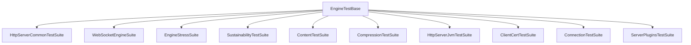
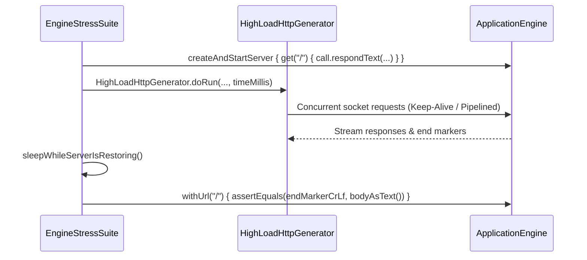
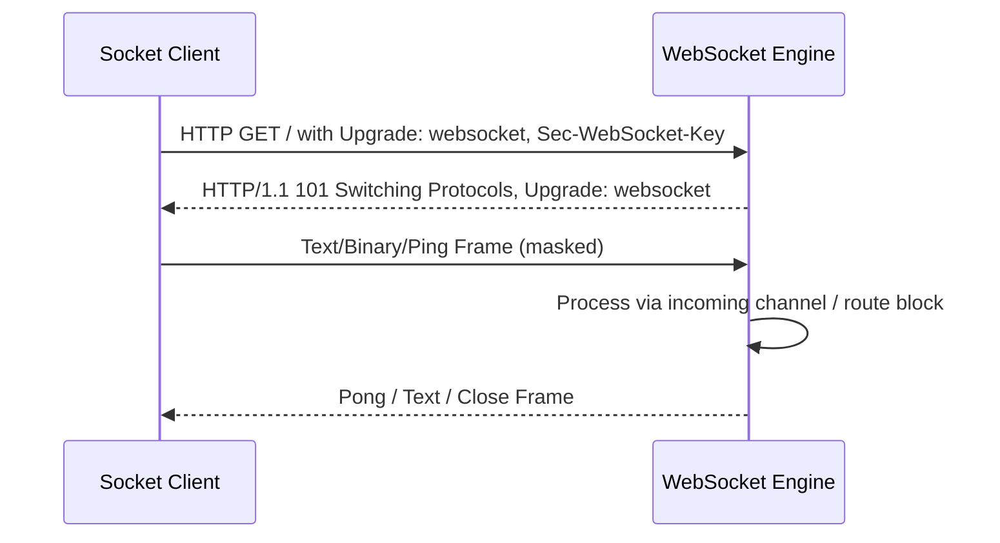
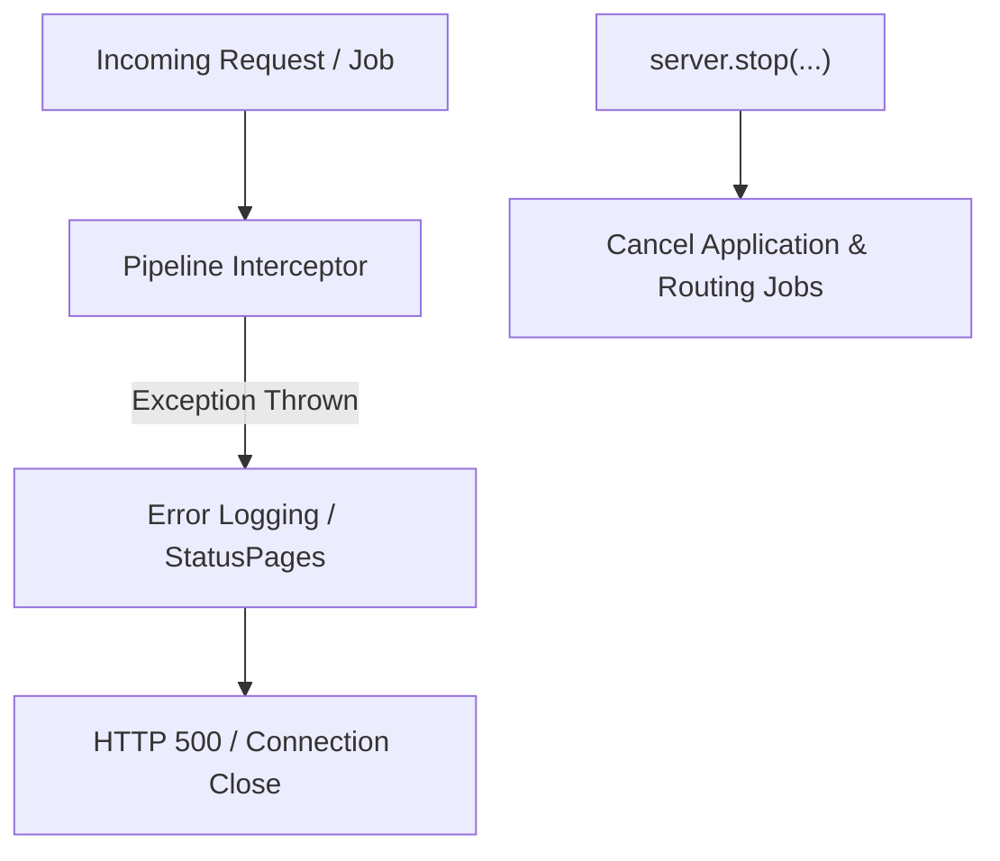

# Engine Test Suites

<details>
<summary>Relevant source files</summary>

The following files were used as context for generating this wiki page:

- [ktor-server/ktor-server-test-suites/jvm/src/io/ktor/server/testing/suites/EngineStressSuite.kt](https://github.com/ktorio/ktor/blob/main/ktor-server/ktor-server-test-suites/jvm/src/io/ktor/server/testing/suites/EngineStressSuite.kt)
- [ktor-server/ktor-server-test-suites/jvm/src/io/ktor/server/testing/suites/SustainabilityTestSuite.kt](https://github.com/ktorio/ktor/blob/main/ktor-server/ktor-server-test-suites/jvm/src/io/ktor/server/testing/suites/SustainabilityTestSuite.kt)
- [ktor-server/ktor-server-test-suites/common/src/io/ktor/server/testing/suites/WebSocketEngineSuite.kt](https://github.com/ktorio/ktor/blob/main/ktor-server/ktor-server-test-suites/common/src/io/ktor/server/testing/suites/WebSocketEngineSuite.kt)
- [AGENTS.md](https://github.com/ktorio/ktor/blob/main/AGENTS.md)
- [ktor-server/ktor-server-test-suites/common/src/io/ktor/server/testing/suites/HttpServerCommonTestSuite.kt](https://github.com/ktorio/ktor/blob/main/ktor-server/ktor-server-test-suites/common/src/io/ktor/server/testing/suites/HttpServerCommonTestSuite.kt)
- [ktor-server/ktor-server-test-suites/jvm/src/io/ktor/server/testing/suites/ContentTestSuite.kt](https://github.com/ktorio/ktor/blob/main/ktor-server/ktor-server-test-suites/jvm/src/io/ktor/server/testing/suites/ContentTestSuite.kt)
- [ktor-server/ktor-server-test-suites/jvm/src/io/ktor/server/testing/suites/CompressionTestSuite.kt](https://github.com/ktorio/ktor/blob/main/ktor-server/ktor-server-test-suites/jvm/src/io/ktor/server/testing/suites/CompressionTestSuite.kt)
- [ktor-server/ktor-server-test-suites/jvm/src/io/ktor/server/testing/suites/HttpServerJvmTestSuite.kt](https://github.com/ktorio/ktor/blob/main/ktor-server/ktor-server-test-suites/jvm/src/io/ktor/server/testing/suites/HttpServerJvmTestSuite.kt)
- [ktor-server/ktor-server-test-suites/jvm/src/io/ktor/server/testing/suites/ClientCertTestSuite.kt](https://github.com/ktorio/ktor/blob/main/ktor-server/ktor-server-test-suites/jvm/src/io/ktor/server/testing/suites/ClientCertTestSuite.kt)
- [ktor-server/ktor-server-test-suites/jvm/src/io/ktor/server/testing/suites/ServerPluginsTestSuite.kt](https://github.com/ktorio/ktor/blob/main/ktor-server/ktor-server-test-suites/jvm/src/io/ktor/server/testing/suites/ServerPluginsTestSuite.kt)
- [ktor-server/ktor-server-test-suites/jvm/src/io/ktor/server/testing/suites/ConnectionTestSuite.kt](https://github.com/ktorio/ktor/blob/main/ktor-server/ktor-server-test-suites/jvm/src/io/ktor/server/testing/suites/ConnectionTestSuite.kt)
- [gradle/libs.versions.toml](https://github.com/gradle/gradle/blob/main/gradle/libs.versions.toml)
</details>

## Overview

### Introduction

The Ktor Engine Test Suites subsystem (`ktor-server-test-suites`) provides a comprehensive, cross-platform and JVM-specific testing framework designed to validate Ktor server backends (`ApplicationEngine`) against standardized HTTP, WebSocket, stress, sustainability, content delivery, and security specifications. By utilizing abstract base test suites parameterized with specific engine factories (such as Netty, CIO, Jetty, or Tomcat), Ktor ensures behavioral consistency across different server runtimes without duplicating test logic.

Sources: [ktor-server/ktor-server-test-suites/jvm/src/io/ktor/server/testing/suites/EngineStressSuite.kt:29-32](https://github.com/ktorio/ktor/blob/main/ktor-server/ktor-server-test-suites/jvm/src/io/ktor/server/testing/suites/EngineStressSuite.kt#L29-L32)

The suites solve the problem of engine fragmentation, ensuring that low-level networking nuances—such as pipelining, chunked transfer encodings, TLS client certificate verification, socket disconnect behaviors, and coroutine context propagation—behave identically regardless of the underlying I/O framework.

Sources: [ktor-server/ktor-server-test-suites/jvm/src/io/ktor/server/testing/suites/SustainabilityTestSuite.kt:46-48](https://github.com/ktorio/ktor/blob/main/ktor-server/ktor-server-test-suites/jvm/src/io/ktor/server/testing/suites/SustainabilityTestSuite.kt#L46-L48)

They interact directly with `EngineTestBase` to bootstrap embedded servers, execute requests using Ktor clients or raw Java sockets, and assert assertions on protocol compliance, resource cleanup, and concurrent blocking loads.

Sources: [ktor-server/ktor-server-test-suites/jvm/src/io/ktor/server/testing/suites/EngineStressSuite.kt:29-32](https://github.com/ktorio/ktor/blob/main/ktor-server/ktor-server-test-suites/jvm/src/io/ktor/server/testing/suites/EngineStressSuite.kt#L29-L32)

---

## Architecture and Suite Taxonomy

### Suite Structure and Capabilities

The test suites are categorized into shared common suites and JVM-exclusive test suites depending on whether their dependencies rely on multiplatform networking or platform-specific JVM sockets, native threads, and file descriptors.



Sources: [ktor-server/ktor-server-test-suites/jvm/src/io/ktor/server/testing/suites/EngineStressSuite.kt:29-32](https://github.com/ktorio/ktor/blob/main/ktor-server/ktor-server-test-suites/jvm/src/io/ktor/server/testing/suites/EngineStressSuite.kt#L29-L32), [ktor-server/ktor-server-test-suites/common/src/io/ktor/server/testing/suites/WebSocketEngineSuite.kt:33-36](https://github.com/ktorio/ktor/blob/main/ktor-server/ktor-server-test-suites/common/src/io/ktor/server/testing/suites/WebSocketEngineSuite.kt#L33-L36), [ktor-server/ktor-server-test-suites/common/src/io/ktor/server/testing/suites/HttpServerCommonTestSuite.kt:41-43](https://github.com/ktorio/ktor/blob/main/ktor-server/ktor-server-test-suites/common/src/io/ktor/server/testing/suites/HttpServerCommonTestSuite.kt#L41-L43)

| Suite Class Name | Target Scope | Primary Focus & Capabilities |
| :--- | :--- | :--- |
| `HttpServerCommonTestSuite` | Common / Multiplatform | Redirection, headers, AutoHeadResponse, cookies, path decoding, form URL-encoded bodies, query parsing, proxy headers (`X-Forwarded-*`), and server push. |
| `WebSocketEngineSuite` | Common / Multiplatform | WebSocket handshake negotiation, frame parsing, ping-pong mechanisms, fragmentation, large frames, and disconnects during consumption/sending. |
| `EngineStressSuite` | JVM | High-load generation using `HighLoadHttpGenerator`, single/multiple connections under pressure, HTTP upgrade handling, and large response streaming. |
| `SustainabilityTestSuite` | JVM | Error logging, post-content ignoring, coroutine context propagation, job cancellation on shutdown, blocking concurrency, and file integrity under load. |
| `ContentTestSuite` | JVM | Text, stream, binary, local file content, jar resources, URI files, partial content ranges, multipart file uploads, and stream chunking behaviors. |
| `CompressionTestSuite` | JVM | GZIP compression with local files, streaming content, range requests with compression, and large payload writing. |
| `HttpServerJvmTestSuite` | JVM | HTTP pipelining, buffer re-use with keep-alive, socket connection resets (`RST`), header duplicate validation, and protocol upgrades. |
| `ClientCertTestSuite` | JVM | Mutual TLS (mTLS), custom Certificate Authorities (CAs), and server-requested client certificates using CIO clients. |
| `ConnectionTestSuite` | JVM | Network address binding, shutdown grace periods, `ServerReady` events, and IPv6 host/port parsing. |
| `ServerPluginsTestSuite` | JVM | Verification of application plugin execution order (`onCall`, `onCallReceive`, `onCallRespond`) and coroutine scope isolation per call. |

Sources: [ktor-server/ktor-server-test-suites/common/src/io/ktor/server/testing/suites/HttpServerCommonTestSuite.kt:41-43](https://github.com/ktorio/ktor/blob/main/ktor-server/ktor-server-test-suites/common/src/io/ktor/server/testing/suites/HttpServerCommonTestSuite.kt#L41-L43), [ktor-server/ktor-server-test-suites/jvm/src/io/ktor/server/testing/suites/EngineStressSuite.kt:29-32](https://github.com/ktorio/ktor/blob/main/ktor-server/ktor-server-test-suites/jvm/src/io/ktor/server/testing/suites/EngineStressSuite.kt#L29-L32), [ktor-server/ktor-server-test-suites/jvm/src/io/ktor/server/testing/suites/ClientCertTestSuite.kt:27-29](https://github.com/ktorio/ktor/blob/main/ktor-server/ktor-server-test-suites/jvm/src/io/ktor/server/testing/suites/ClientCertTestSuite.kt#L27-L29)

---

## High-Load and Stress Testing Mechanism

### Stress Test Architecture and Pipelining

The `EngineStressSuite` class exercises engines under sustained concurrency and heavy pressure using raw sockets and generators (`HighLoadHttpGenerator`). It disables HTTP/2 and SSL by default in its `init` block to concentrate entirely on HTTP/1.1 transport resilience and connection recycling limits.

Sources: [ktor-server/ktor-server-test-suites/jvm/src/io/ktor/server/testing/suites/EngineStressSuite.kt:34-37](https://github.com/ktorio/ktor/blob/main/ktor-server/ktor-server-test-suites/jvm/src/io/ktor/server/testing/suites/EngineStressSuite.kt#L34-L37)



Sources: [ktor-server/ktor-server-test-suites/jvm/src/io/ktor/server/testing/suites/EngineStressSuite.kt:166-173](https://github.com/ktorio/ktor/blob/main/ktor-server/ktor-server-test-suites/jvm/src/io/ktor/server/testing/suites/EngineStressSuite.kt#L166-L173)

### Execution Walkthrough: Single Connection Pipelining Stress
1. `singleConnectionSingleThreadWithPipelining()` starts an embedded server responding with `endMarkerCrLf`.
2. A separate sender thread (`http-sender`) acquires tokens from a `Semaphore(10)` and continuously writes raw HTTP `GET` requests down a single socket stream.
3. The main thread reads responses line by line via a buffered reader (`Charsets.ISO_8859_1`).
4. When an `endMarker` is discovered in a response line, `sem.release()` is invoked, permitting the sender thread to pump subsequent pipelined requests.
5. If either reader or writer throws an exception, the opposing thread is interrupted and the socket is closed.

Sources: [ktor-server/ktor-server-test-suites/jvm/src/io/ktor/server/testing/suites/EngineStressSuite.kt:91-155](https://github.com/ktorio/ktor/blob/main/ktor-server/ktor-server-test-suites/jvm/src/io/ktor/server/testing/suites/EngineStressSuite.kt#L91-L155)

> [!CAUTION]
> High-pressure runs allocate significant file descriptors and socket buffers. Tests in `EngineStressSuite` include a mandatory `sleepWhileServerIsRestoring()` pause (`Thread.sleep(10000)`) post-stress to allow the operating system network stack to clear lingering `TIME_WAIT` sockets before health check assertions execute.

Sources: [ktor-server/ktor-server-test-suites/jvm/src/io/ktor/server/testing/suites/EngineStressSuite.kt:334-338](https://github.com/ktorio/ktor/blob/main/ktor-server/ktor-server-test-suites/jvm/src/io/ktor/server/testing/suites/EngineStressSuite.kt#L334-L338)

---

## WebSocket Protocol and Framing Suite

### Frame Handling and Negotiation

`WebSocketEngineSuite` validates server-side WebSocket session behaviors, handshakes, extensions, and raw socket frame parsing. It implements helper utilities such as `negotiateHttpWebSocket`, `assertCloseFrame`, and `writeFrameTest` to construct precise, low-level binary frames with custom flags, opcodes, and masking keys.

Sources: [ktor-server/ktor-server-test-suites/common/src/io/ktor/server/testing/suites/WebSocketEngineSuite.kt:738-786](https://github.com/ktorio/ktor/blob/main/ktor-server/ktor-server-test-suites/common/src/io/ktor/server/testing/suites/WebSocketEngineSuite.kt#L738-L786)



Sources: [ktor-server/ktor-server-test-suites/common/src/io/ktor/server/testing/suites/WebSocketEngineSuite.kt:738-766](https://github.com/ktorio/ktor/blob/main/ktor-server/ktor-server-test-suites/common/src/io/ktor/server/testing/suites/WebSocketEngineSuite.kt#L738-L766)

### Key WebSocket Test Scenarios
- **Disconnect Handling:** `testWebSocketDisconnectDuringConsuming` and `testWebSocketDisconnectDuringSending` verify that job cancellation and `closeReason` structures complete properly when the underlying socket input/output stream is cancelled mid-operation.
- **Ping-Pong Automation:** `testWebSocketPingPong` configures a server with a `pingIntervalMillis` of 50ms and asserts that incoming ping frames are successfully intercepted and acknowledged with pong frames.
- **Corrupt Opcode Handling:** `testCorruptFrameWithBadOpcode` sends an invalid opcode (`0x83`) and asserts that the engine closes the connection with a `PROTOCOL_ERROR` (`1002`) status code.

Sources: [ktor-server/ktor-server-test-suites/common/src/io/ktor/server/testing/suites/WebSocketEngineSuite.kt:47-83](https://github.com/ktorio/ktor/blob/main/ktor-server/ktor-server-test-suites/common/src/io/ktor/server/testing/suites/WebSocketEngineSuite.kt#L47-L83), [ktor-server/ktor-server-test-suites/common/src/io/ktor/server/testing/suites/WebSocketEngineSuite.kt:297-335](https://github.com/ktorio/ktor/blob/main/ktor-server/ktor-server-test-suites/common/src/io/ktor/server/testing/suites/WebSocketEngineSuite.kt#L297-335), [ktor-server/ktor-server-test-suites/common/src/io/ktor/server/testing/suites/WebSocketEngineSuite.kt:715-736](https://github.com/ktorio/ktor/blob/main/ktor-server/ktor-server-test-suites/common/src/io/ktor/server/testing/suites/WebSocketEngineSuite.kt#L715-L736)

---

## Sustainability and Lifecycle Resilience

### Pipeline Error Handling and Shutdown

`SustainabilityTestSuite` evaluates long-term server stability, resource cleanup, coroutine cancellation propagation, and exception interception pipelines.

Sources: [ktor-server/ktor-server-test-suites/jvm/src/io/ktor/server/testing/suites/SustainabilityTestSuite.kt:605-643](https://github.com/ktorio/ktor/blob/main/ktor-server/ktor-server-test-suites/jvm/src/io/ktor/server/testing/suites/SustainabilityTestSuite.kt#L605-L643)



Sources: [ktor-server/ktor-server-test-suites/jvm/src/io/ktor/server/testing/suites/SustainabilityTestSuite.kt:976-1017](https://github.com/ktorio/ktor/blob/main/ktor-server/ktor-server-test-suites/jvm/src/io/ktor/server/testing/suites/SustainabilityTestSuite.kt#L976-1017)

### Pipeline Error Interception Tests
The suite systematically iterates through items in application and receive pipelines (`ApplicationCallPipeline`, `ApplicationReceivePipeline`, `ApplicationSendPipeline`, and `EnginePipeline`), injecting exceptions into each phase to verify that Ktor catches the failure, invokes error logging delegates, returns `InternalServerError` (500), and avoids server stalls.

Sources: [ktor-server/ktor-server-test-suites/jvm/src/io/ktor/server/testing/suites/SustainabilityTestSuite.kt:605-643](https://github.com/ktorio/ktor/blob/main/ktor-server/ktor-server-test-suites/jvm/src/io/ktor/server/testing/suites/SustainabilityTestSuite.kt#L605-L643)

> [!NOTE]
> In `testErrorInApplicationCallPipelineInterceptor`, `ApplicationCallPipeline.Fallback` is explicitly filtered out because the fallback phase naturally replies with `404 Not Found` rather than triggering a 500 server error workflow.

Sources: [ktor-server/ktor-server-test-suites/jvm/src/io/ktor/server/testing/suites/SustainabilityTestSuite.kt:613-616](https://github.com/ktorio/ktor/blob/main/ktor-server/ktor-server-test-suites/jvm/src/io/ktor/server/testing/suites/SustainabilityTestSuite.kt#L613-L616)

---

## Content Delivery and Compression Suites

### File Streaming and Compression

`ContentTestSuite` and `CompressionTestSuite` validate streaming inputs, file deliveries, and compression algorithms.

Sources: [ktor-server/ktor-server-test-suites/jvm/src/io/ktor/server/testing/suites/ContentTestSuite.kt:28-30](https://github.com/ktorio/ktor/blob/main/ktor-server/ktor-server-test-suites/jvm/src/io/ktor/server/testing/suites/ContentTestSuite.kt#L28-L30), [ktor-server/ktor-server-test-suites/jvm/src/io/ktor/server/testing/suites/CompressionTestSuite.kt:25-27](https://github.com/ktorio/ktor/blob/main/ktor-server/ktor-server-test-suites/jvm/src/io/ktor/server/testing/suites/CompressionTestSuite.kt#L25-L27)

### Content Types and Range Streaming
`ContentTestSuite` tests various content providers including `LocalFileContent`, `JarFileContent`, and `URIFileContent`. It also tests partial content range requests using `PartialContent` plugin integration.

```kotlin
// Example from ContentTestSuite: Testing local file range requests with PartialContent plugin
@Test
fun testLocalFileContentRange() = runTest {
    val file = loadTestFile()
    createAndStartServer {
        install(PartialContent)
        handle {
            call.respond(LocalFileContent(file))
        }
    }

    withUrl(
        "/",
        {
            header(
                HttpHeaders.Range,
                RangesSpecifier(RangeUnits.Bytes, listOf(ContentRange.Bounded(0, 0))).toString()
            )
        }
    ) {
        assertEquals(HttpStatusCode.PartialContent.value, status.value)
    }
}
```
Sources: [ktor-server/ktor-server-test-suites/jvm/src/io/ktor/server/testing/suites/ContentTestSuite.kt:139-163](https://github.com/ktorio/ktor/blob/main/ktor-server/ktor-server-test-suites/jvm/src/io/ktor/server/testing/suites/ContentTestSuite.kt#L139-L163)

### Compression Interoperability
`CompressionTestSuite` ensures that responses generated via `LocalFileContent`, streaming writers, or large text writers are properly encoded when the client supplies `Accept-Encoding: gzip`.

Sources: [ktor-server/ktor-server-test-suites/jvm/src/io/ktor/server/testing/suites/CompressionTestSuite.kt:30-47](https://github.com/ktorio/ktor/blob/main/ktor-server/ktor-server-test-suites/jvm/src/io/ktor/server/testing/suites/CompressionTestSuite.kt#L30-L47), [ktor-server/ktor-server-test-suites/jvm/src/io/ktor/server/testing/suites/CompressionTestSuite.kt:109-137](https://github.com/ktorio/ktor/blob/main/ktor-server/ktor-server-test-suites/jvm/src/io/ktor/server/testing/suites/CompressionTestSuite.kt#L109-L137)

---

## Security and Client Certificate Suites

### Mutual TLS and Trust Verification

`ClientCertTestSuite` verifies mutual TLS (mTLS) handshaking between a Ktor server and client.

Sources: [ktor-server/ktor-server-test-suites/jvm/src/io/ktor/server/testing/suites/ClientCertTestSuite.kt:27-29](https://github.com/ktorio/ktor/blob/main/ktor-server/ktor-server-test-suites/jvm/src/io/ktor/server/testing/suites/ClientCertTestSuite.kt#L27-L29)

| Component | Configuration Property | Role in mTLS Test |
| :--- | :--- | :--- |
| **Server KeyStore** | `keyStore = ca.generateCertificate(...)` | Provides the server identity certificate generated via the shared test CA. |
| **Server TrustStore** | `trustStore = ca.trustStore()` | Dictates which client certificates the server accepts. |
| **Client Engine** | `trustManager`, `addKeyStore(...)` | Configures the CIO client engine to trust the server CA and present client certificates during the TLS handshake. |

Sources: [ktor-server/ktor-server-test-suites/jvm/src/io/ktor/server/testing/suites/ClientCertTestSuite.kt:30-38](https://github.com/ktorio/ktor/blob/main/ktor-server/ktor-server-test-suites/jvm/src/io/ktor/server/testing/suites/ClientCertTestSuite.kt#L30-L38), [ktor-server/ktor-server-test-suites/jvm/src/io/ktor/server/testing/suites/ClientCertTestSuite.kt:50-57](https://github.com/ktorio/ktor/blob/main/ktor-server/ktor-server-test-suites/jvm/src/io/ktor/server/testing/suites/ClientCertTestSuite.kt#L50-L57)

## Related

- [[Server Testing]]

