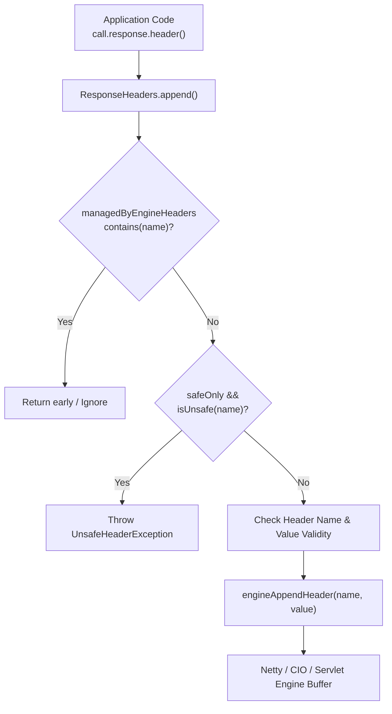

# Headers and Methods

<details>
<summary>Relevant source files</summary>

The following files were used as context for generating this wiki page:

- [ktor-shared/ktor-openapi-schema/common/src/io/ktor/openapi/Operation.kt](https://github.com/ktorio/ktor/blob/main/ktor-shared/ktor-openapi-schema/common/src/io/ktor/openapi/Operation.kt)
- [ktor-client/ktor-client-core/common/src/io/ktor/client/request/builders.kt](https://github.com/ktorio/ktor/blob/main/ktor-client/ktor-client-core/common/src/io/ktor/client/request/builders.kt)
- [ktor-client/ktor-client-core/common/src/io/ktor/client/request/HttpRequest.kt](https://github.com/ktorio/ktor/blob/main/ktor-client/ktor-client-core/common/src/io/ktor/client/request/HttpRequest.kt)
- [ktor-http/ktor-http-cio/common/src/io/ktor/http/cio/HttpHeadersMap.kt](https://github.com/ktorio/ktor/blob/main/ktor-http/ktor-http-cio/common/src/io/ktor/http/cio/HttpHeadersMap.kt)
- [ktor-http/common/src/io/ktor/http/HttpMessageProperties.kt](https://github.com/ktorio/ktor/blob/main/ktor-http/common/src/io/ktor/http/HttpMessageProperties.kt)
- [ktor-http/common/src/io/ktor/http/Headers.kt](https://github.com/ktorio/ktor/blob/main/ktor-http/common/src/io/ktor/http/Headers.kt)
- [ktor-server/ktor-server-core/common/src/io/ktor/server/response/ResponseHeaders.kt](https://github.com/ktorio/ktor/blob/main/ktor-server/ktor-server-core/common/src/io/ktor/server/response/ResponseHeaders.kt)
- [ktor-http/ktor-http-cio/nonJvm/src/io/ktor/http/cio/RequestResponseBuilder.nonJvm.kt](https://github.com/ktorio/ktor/blob/main/ktor-http/ktor-http-cio/nonJvm/src/io/ktor/http/cio/RequestResponseBuilder.nonJvm.kt)
- [ktor-http/common/src/io/ktor/http/HttpMethod.kt](https://github.com/ktorio/ktor/blob/main/ktor-http/common/src/io/ktor/http/HttpMethod.kt)
- [ktor-http/ktor-http-cio/jvm/src/io/ktor/http/cio/RequestResponseBuilder.kt](https://github.com/ktorio/ktor/blob/main/ktor-http/ktor-http-cio/jvm/src/io/ktor/http/cio/RequestResponseBuilder.kt)
- [ktor-http/ktor-http-cio/common/src/io/ktor/http/cio/RequestResponse.kt](https://github.com/ktorio/ktor/blob/main/ktor-http/ktor-http-cio/common/src/io/ktor/http/cio/RequestResponse.kt)
- [ktor-http/common/src/io/ktor/http/Parameters.kt](https://github.com/ktorio/ktor/blob/main/ktor-http/common/src/io/ktor/http/Parameters.kt)
- [ktor-http/common/src/io/ktor/http/HttpMessage.kt](https://github.com/ktorio/ktor/blob/main/ktor-http/common/src/io/ktor/http/HttpMessage.kt)
- [ktor-server/ktor-server-netty/jvm/src/io/ktor/server/netty/http/HttpMultiplexedResponseHeaders.kt](https://github.com/ktorio/ktor/blob/main/ktor-server/ktor-server-netty/jvm/src/io/ktor/server/netty/http/HttpMultiplexedResponseHeaders.kt)
- [ktor-http/ktor-http-cio/common/src/io/ktor/http/cio/RequestResponseBuilderCommon.kt](https://github.com/ktorio/ktor/blob/main/ktor-http/ktor-http-cio/common/src/io/ktor/http/cio/RequestResponseBuilderCommon.kt)
- [ktor-client/ktor-client-core/wasmJs/src/io/ktor/client/fetch/LibDom.kt](https://github.com/ktorio/ktor/blob/main/ktor-client/ktor-client-core/wasmJs/src/io/ktor/client/fetch/LibDom.kt)
- [ktor-client/ktor-client-core/common/src/io/ktor/client/request/utils.kt](https://github.com/ktorio/ktor/blob/main/ktor-client/ktor-client-core/common/src/io/ktor/client/request/utils.kt)
- [ktor-client/ktor-client-core/js/src/io/ktor/client/fetch/LibDom.kt](https://github.com/ktorio/ktor/blob/main/ktor-client/ktor-client-core/js/src/io/ktor/client/fetch/LibDom.kt)
- [ktor-server/ktor-server-plugins/ktor-server-htmx/common/src/io/ktor/server/htmx/HxHeaders.kt](https://github.com/ktorio/ktor/blob/main/ktor-server/ktor-server-plugins/ktor-server-htmx/common/src/io/ktor/server/htmx/HxHeaders.kt)
- [ktor-http/common/src/io/ktor/http/HttpHeaders.kt](https://github.com/ktorio/ktor/blob/main/ktor-http/common/src/io/ktor/http/HttpHeaders.kt)
</details>

## Overview

### Overview
The "Headers and Methods" subsystem in Ktor provides the foundational abstractions, container structures, validations, and high-performance parsers required to manage HTTP headers, request verbs (`HttpMethod`), and message properties across both client and server engines. At its core, Ktor decouples protocol messaging from specific transport implementations by wrapping metadata into case-insensitive collections (`Headers`, `Parameters`), validating structural integrity against RFC specifications, and providing optimized buffer maps for low-level engines (CIO).

By establishing unified interfaces such as `HttpMessage`, `HttpMessageBuilder`, and `HttpMethod`, the library eliminates repetitive boilerplates for standard HTTP operations (GET, POST, PUT, DELETE, PATCH, HEAD, OPTIONS, TRACE, QUERY). Furthermore, it supports specialized integration layers—such as OpenAPI documentation schemas for operations, parameters, and headers, multiplexed HTTP/2/3 response headers for Netty, and specialized HTMX request/response helper properties. This architecture ensures type safety, multiplatform support (JVM, JS, Wasm, Native), and resilient memory management through pooling strategies in high-throughput network channels.

Sources: [ktor-http/common/src/io/ktor/http/Headers.kt:10-33](https://github.com/ktorio/ktor/blob/main/ktor-http/common/src/io/ktor/http/Headers.kt#L10-L33), [ktor-http/common/src/io/ktor/http/HttpMethod.kt:10-17](https://github.com/ktorio/ktor/blob/main/ktor-http/common/src/io/ktor/http/HttpMethod.kt#L10-L17), [ktor-http/ktor-http-cio/common/src/io/ktor/http/cio/HttpHeadersMap.kt:35-41](https://github.com/ktorio/ktor/blob/main/ktor-http/ktor-http-cio/common/src/io/ktor/http/cio/HttpHeadersMap.kt#L35-L41)

## HTTP Methods (`HttpMethod`)

### HTTP Method Definitions and Body Rules
The `HttpMethod` data class encapsulates HTTP verbs and provides type-safe constants along with parsing logic. Standard HTTP methods are defined as companion object fields, while `HttpMethod.parse(method: String)` resolves standard verbs or instantiates custom values.

```kotlin
val method = HttpMethod.parse("GET")
val supportsBody = HttpMethod.Post.supportsRequestBody // returns true
```
Sources: [ktor-http/common/src/io/ktor/http/HttpMethod.kt:10-17](https://github.com/ktorio/ktor/blob/main/ktor-http/common/src/io/ktor/http/HttpMethod.kt#L10-L17), [ktor-http/common/src/io/ktor/http/HttpMethod.kt:51-69](https://github.com/ktorio/ktor/blob/main/ktor-http/common/src/io/ktor/http/HttpMethod.kt#L51-L69), [ktor-http/common/src/io/ktor/http/HttpMethod.kt:115-122](https://github.com/ktorio/ktor/blob/main/ktor-http/common/src/io/ktor/http/HttpMethod.kt#L115-L122)

### Supported HTTP Methods and Body Support

| Method Constant | String Value | Supports Request Body (`supportsRequestBody`) |
|-----------------|--------------|-------------------------------------------------|
| `HttpMethod.Get` | `GET` | `false` |
| `HttpMethod.Post` | `POST` | `true` |
| `HttpMethod.Put` | `PUT` | `true` |
| `HttpMethod.Patch` | `PATCH` | `true` |
| `HttpMethod.Delete` | `DELETE` | `true` |
| `HttpMethod.Head` | `HEAD` | `false` |
| `HttpMethod.Options` | `OPTIONS` | `false` |
| `HttpMethod.Trace` | `TRACE` | `false` |
| `HttpMethod.Query` | `QUERY` | `true` |

Sources: [ktor-http/common/src/io/ktor/http/HttpMethod.kt:23-50](https://github.com/ktorio/ktor/blob/main/ktor-http/common/src/io/ktor/http/HttpMethod.kt#L23-L50), [ktor-http/common/src/io/ktor/http/HttpMethod.kt:108-122](https://github.com/ktorio/ktor/blob/main/ktor-http/common/src/io/ktor/http/HttpMethod.kt#L108-L122)

> [!NOTE]
> The `supportsRequestBody` extension property evaluates whether a method is excluded from `REQUESTS_WITHOUT_BODY` (`GET`, `HEAD`, `OPTIONS`, `TRACE`). Client request builders use this check to conditionally omit or retain the `Content-Length` header on empty messages.

Sources: [ktor-client/ktor-client-core/common/src/io/ktor/client/request/HttpRequest.kt:261-269](https://github.com/ktorio/ktor/blob/main/ktor-client/ktor-client-core/common/src/io/ktor/client/request/HttpRequest.kt#L261-L269), [ktor-http/common/src/io/ktor/http/HttpMethod.kt:108-122](https://github.com/ktorio/ktor/blob/main/ktor-http/common/src/io/ktor/http/HttpMethod.kt#L108-L122)

## Headers Core Abstractions and Builders

### Headers Interface and Builder API
HTTP headers are represented via the `Headers` interface, extending `StringValues` with case-insensitive name resolution. Immutable instances are constructed via `HeadersBuilder`, `headersOf(...)`, or the `Headers.build { ... }` DSL block.

```kotlin
val headers = Headers.build {
    append(HttpHeaders.ContentType, ContentType.Application.Json.toString())
    append(HttpHeaders.Authorization, "Bearer token123")
}
```
Sources: [ktor-http/common/src/io/ktor/http/Headers.kt:10-33](https://github.com/ktorio/ktor/blob/main/ktor-http/common/src/io/ktor/http/Headers.kt#L10-L33), [ktor-http/common/src/io/ktor/http/Headers.kt:35-49](https://github.com/ktorio/ktor/blob/main/ktor-http/common/src/io/ktor/http/Headers.kt#L35-L49)

### Header Validation Guards
When mutating headers through `HeadersBuilder`, Ktor validates both header names and values to prevent injection attacks and protocol violations:

- **Header Name Validation (`HttpHeaders.checkHeaderName`)**: Iterates through each character in `name`. If any character satisfies `ch <= ' ' || isDelimiter(ch)`, it throws an `IllegalHeaderNameException(name, index)`.
- **Header Value Validation (`HttpHeaders.checkHeaderValue`)**: Iterates through each character in `value`. If any character satisfies `ch < ' ' && ch != '\u0009'`, it throws an `IllegalHeaderValueException(value, index)` (permitting horizontal tabs while rejecting other control characters).

Sources: [ktor-http/common/src/io/ktor/http/HttpHeaders.kt:175-194](https://github.com/ktorio/ktor/blob/main/ktor-http/common/src/io/ktor/http/HttpHeaders.kt#L175-L194)

> [!WARNING]
> Unsafe headers such as `Transfer-Encoding` and `Upgrade` (`HttpHeaders.UnsafeHeadersList`) are managed by low-level engines and will trigger an `UnsafeHeaderException` if modified outside authorized server engine scopes.

Sources: [ktor-server/ktor-server-core/common/src/io/ktor/server/response/ResponseHeaders.kt:62-68](https://github.com/ktorio/ktor/blob/main/ktor-server/ktor-server-core/common/src/io/ktor/server/response/ResponseHeaders.kt#L62-L68), [ktor-http/common/src/io/ktor/http/HttpHeaders.kt:151-168](https://github.com/ktorio/ktor/blob/main/ktor-http/common/src/io/ktor/http/HttpHeaders.kt#L151-L168)

## Low-Level CIO Headers Map (`HttpHeadersMap`)

### Memory-Optimized CIO Header Storage
For high-performance network IO without object allocation overhead, the CIO module implements `HttpHeadersMap`. It indexes headers inside memory pools using a fixed-size integer array structure (`HeadersData`) combined with a `CharArrayBuilder`.

Sources: [ktor-http/ktor-http-cio/common/src/io/ktor/http/cio/HttpHeadersMap.kt:35-45](https://github.com/ktorio/ktor/blob/main/ktor-http/ktor-http-cio/common/src/io/ktor/http/cio/HttpHeadersMap.kt#L35-L45)

### Index Array Layout (`HEADER_SIZE = 6`)

| Offset Index | Constant Name | Description |
|--------------|---------------|-------------|
| `[0]` | `OFFSET_NAME_HASH` | Lowercase hash code of the header name (`EMPTY_INDEX` if unused). |
| `[1]` | `OFFSET_HEADER_NAME_START` | Start index in the character array for the header name. |
| `[2]` | `OFFSET_HEADER_NAME_END` | Exclusive end index for the header name. |
| `[3]` | `OFFSET_HEADER_VALUE_START` | Start index in the character array for the header value. |
| `[4]` | `OFFSET_HEADER_VALUE_END` | Exclusive end index for the header value. |
| `[5]` | `OFFSET_NEXT_HEADER` | Index of the next header sharing the same name (collision / multi-value chain). |

Sources: [ktor-http/ktor-http-cio/common/src/io/ktor/http/cio/HttpHeadersMap.kt:13-34](https://github.com/ktorio/ktor/blob/main/ktor-http/ktor-http-cio/common/src/io/ktor/http/cio/HttpHeadersMap.kt#L13-L34)

### Execution Walkthrough: Putting a Header in `HttpHeadersMap`

1. **Threshold Check**: `put()` evaluates `thresholdReached()`. If `size >= headerCapacity * RESIZE_THRESHOLD` (where threshold is `0.75`), `resize()` doubles the capacity and re-indexes existing entries.
2. **Hash & Collision Probe**: Computes `hash = builder.hashCodeLowerCase(nameStartIndex, nameEndIndex).absoluteValue` and starts probing at `headerIndex = hash % headerCapacity`.
3. **Chain Resolution**: While `headersData.at(headerIndex * HEADER_SIZE + OFFSET_NAME_HASH) != EMPTY_INDEX`, it checks for name equality via `headerHasName`. If matched, `sameNameHeaderIndex` is updated.
4. **Data Storing**: Writes hash, start/end boundaries, and sets `OFFSET_NEXT_HEADER` to `EMPTY_INDEX`. If a previous header with the same name existed (`sameNameHeaderIndex != EMPTY_INDEX`), the chain pointer is updated to point to the new header index.
5. **Size Increment**: Increments `size++`.

Sources: [ktor-http/ktor-http-cio/common/src/io/ktor/http/cio/HttpHeadersMap.kt:118-153](https://github.com/ktorio/ktor/blob/main/ktor-http/ktor-http-cio/common/src/io/ktor/http/cio/HttpHeadersMap.kt#L118-L153)

> [!IMPORTANT]
> `HttpHeadersMap` relies on pooled `IntArray` buffers (`IntArrayPool`) and `HeadersData` instances (`HeadersDataPool`) to avoid garbage collection pressure during high-concurrency parsing. When a message is closed, `release()` recycles these buffers back to their respective pools.

Sources: [ktor-http/ktor-http-cio/common/src/io/ktor/http/cio/HttpHeadersMap.kt:210-294](https://github.com/ktorio/ktor/blob/main/ktor-http/ktor-http-cio/common/src/io/ktor/http/cio/HttpHeadersMap.kt#L210-L294)

## Server Response Headers and Multiplexing

### Response Headers Management
Server responses manage header mutation through `ResponseHeaders`. Subclasses like `HttpMultiplexedResponseHeaders` bridge HTTP/2 and HTTP/3 multiplexed streams (which use Netty's `DefaultHeaders`) into Ktor's standard response header flow.



Sources: [ktor-server/ktor-server-core/common/src/io/ktor/server/response/ResponseHeaders.kt:16-78](https://github.com/ktorio/ktor/blob/main/ktor-server/ktor-server-core/common/src/io/ktor/server/response/ResponseHeaders.kt#L16-L78), [ktor-server/ktor-server-netty/jvm/src/io/ktor/server/netty/http/HttpMultiplexedResponseHeaders.kt:18-32](https://github.com/ktorio/ktor/blob/main/ktor-server/ktor-server-netty/jvm/src/io/ktor/server/netty/http/HttpMultiplexedResponseHeaders.kt#L18-L32)

## Client Request Builders and Property Extensions

### Client Fluent Extensions
The Ktor client exposes fluent DSL extensions on `HttpMessageBuilder` and `HttpRequestBuilder` to inject standard headers and authentication tokens easily.

Sources: [ktor-client/ktor-client-core/common/src/io/ktor/client/request/utils.kt:35-111](https://github.com/ktorio/ktor/blob/main/ktor-client/ktor-client-core/common/src/io/ktor/client/request/utils.kt#L35-L111)

### Helper Extension Methods on `HttpMessageBuilder`

| Extension Function | Target Header | Description |
|--------------------|---------------|-------------|
| `contentType(type)` | `Content-Type` | Sets the request/response content type. |
| `maxAge(seconds)` | `Cache-Control` | Appends `max-age=<seconds>` caching directive. |
| `ifNoneMatch(value)` | `If-None-Match` | Sets ETag conditional validation match. |
| `userAgent(content)` | `User-Agent` | Sets client user agent identification. |
| `accept(contentType)`| `Accept` | Appends acceptable response media type. |
| `basicAuth(user, pass)`| `Authorization` | Encodes credentials into Base64 Basic Auth scheme. |
| `bearerAuth(token)` | `Authorization` | Appends Bearer token authorization header. |

Sources: [ktor-client/ktor-client-core/common/src/io/ktor/client/request/utils.kt:38-111](https://github.com/ktorio/ktor/blob/main/ktor-client/ktor-client-core/common/src/io/ktor/client/request/utils.kt#L38-L111), [ktor-http/common/src/io/ktor/http/HttpMessageProperties.kt:16-39](https://github.com/ktorio/ktor/blob/main/ktor-http/common/src/io/ktor/http/HttpMessageProperties.kt#L16-L39)

> [!TIP]
> Client cookies appended via `cookie(name, value, ...)` are automatically concatenated into a single `Cookie` header separated by semicolons (`"; "`), complying with HTTP state management specifications.

Sources: [ktor-client/ktor-client-core/common/src/io/ktor/client/request/utils.kt:46-75](https://github.com/ktorio/ktor/blob/main/ktor-client/ktor-client-core/common/src/io/ktor/client/request/utils.kt#L46-L75)

## OpenAPI and HTMX Integrations

### OpenAPI and HTMX Metadata Wrappers
Ktor provides type-safe OpenAPI definitions (`Operation`, `Parameter`, `Header`, `Responses`, `RequestBody`) located in `io.ktor.openapi`. The `Parameter.Builder` and `Headers.Builder` classes allow declaring header parameters with specific schemas and styles:
- **`header(name)`**: Configures parameter location `ParameterType.header`.
- **`Headers.Builder`**: Collects response headers keyed by name for API documentation generation.

The server HTMX plugin introduces `RoutingRequest.hx` (`HXRequestHeaders`) and `RoutingResponse.hx` (`HXResponseHeaders`) to parse and populate hypermedia headers smoothly:
- **`HXRequestHeaders`**: Exposes properties like `isBoosted`, `isHistoryRestore`, `currentUrl`, `prompt`, `targetId`, `triggerId`, and `triggerName`.
- **`HXResponseHeaders`**: Manages response headers such as `location`, `pushUrl`, `redirect`, `refresh`, and `replaceUrl`.

Sources: [ktor-shared/ktor-openapi-schema/common/src/io/ktor/openapi/Operation.kt:386-392](https://github.com/ktorio/ktor/blob/main/ktor-shared/ktor-openapi-schema/common/src/io/ktor/openapi/Operation.kt#L386-L392), [ktor-shared/ktor-openapi-schema/common/src/io/ktor/openapi/Operation.kt:1458-1488](https://github.com/ktorio/ktor/blob/main/ktor-shared/ktor-openapi-schema/common/src/io/ktor/openapi/Operation.kt#L1458-L1488), [ktor-server/ktor-server-plugins/ktor-server-htmx/common/src/io/ktor/server/htmx/HxHeaders.kt:11-91](https://github.com/ktorio/ktor/blob/main/ktor-server/ktor-server-plugins/ktor-server-htmx/common/src/io/ktor/server/htmx/HxHeaders.kt#L11-L91)

## Full Worked Example

### Complete Usage Example
The following complete example demonstrates configuring an HTTP client request with custom headers, authentication, and HTTP methods, alongside a server-side route checking HTMX headers and responding with custom headers:

```kotlin
import io.ktor.client.*
import io.ktor.client.request.*
import io.ktor.client.statement.*
import io.ktor.http.*
import io.ktor.server.application.*
import io.ktor.server.engine.*
import io.ktor.server.netty.*
import io.ktor.server.response.*
import io.ktor.server.routing.*
import io.ktor.server.htmx.*

suspend fun executeClientRequest() {
    val client = HttpClient()
    
    // Make a GET request using HttpClient DSL with method, headers, and auth helpers
    val response: HttpResponse = client.get("https://api.example.com/data") {
        method = HttpMethod.Get
        accept(ContentType.Application.Json)
        bearerAuth("secret-token-xyz")
        header(HttpHeaders.XRequestId, "req-12345")
        cookie("session", "active")
    }
    
    println("Response Status: ${response.status}")
}

fun configureServer(embeddedServer: ApplicationEngine) {
    // Server-side routing handling headers and HTMX extensions
    embeddedServer.environment.monitor
    // Example routing configuration
    /*
    routing {
        get("/endpoint") {
            // Check if request originates from HTMX
            if (call.isHtmx) {
                val target = call.hx.targetId
                call.response.header("X-Processed-Target", target ?: "none")
            }
            call.respondText("Hello, Headers!")
        }
    }
    */
}
```

Sources: [ktor-client/ktor-client-core/common/src/io/ktor/client/request/builders.kt:204-207](https://github.com/ktorio/ktor/blob/main/ktor-client/ktor-client-core/common/src/io/ktor/client/request/builders.kt#L204-L207), [ktor-client/ktor-client-core/common/src/io/ktor/client/request/utils.kt:38-111](https://github.com/ktorio/ktor/blob/main/ktor-client/ktor-client-core/common/src/io/ktor/client/request/utils.kt#L38-L111), [ktor-server/ktor-server-plugins/ktor-server-htmx/common/src/io/ktor/server/htmx/HxHeaders.kt:17-71](https://github.com/ktorio/ktor/blob/main/ktor-server/ktor-server-plugins/ktor-server-htmx/common/src/io/ktor/server/htmx/HxHeaders.kt#L17-L71)

## Related

- [[Content Representation]]
- [[URL Handling]]

