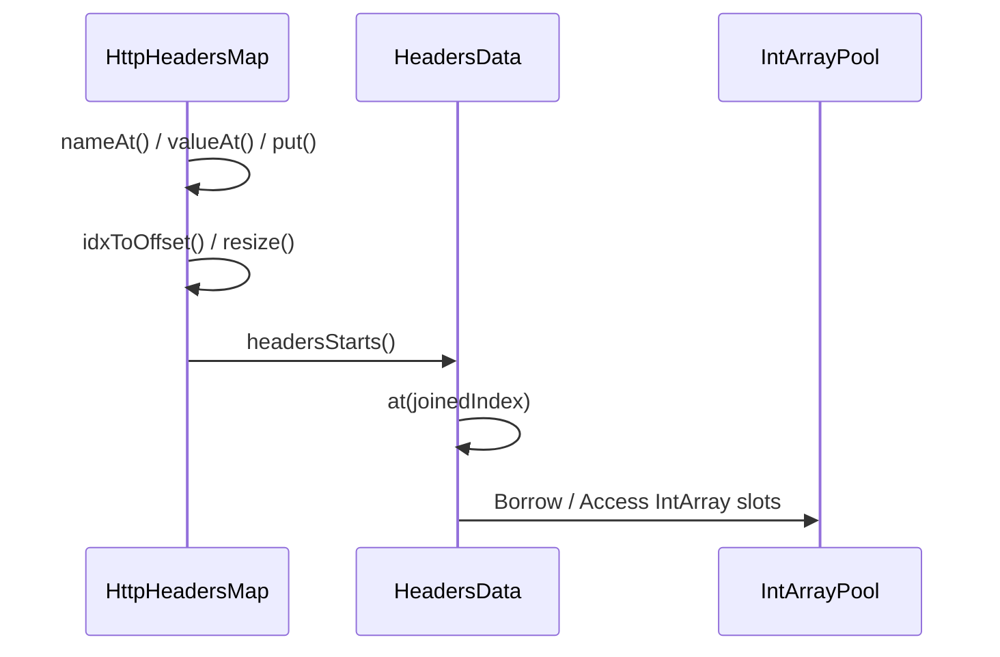
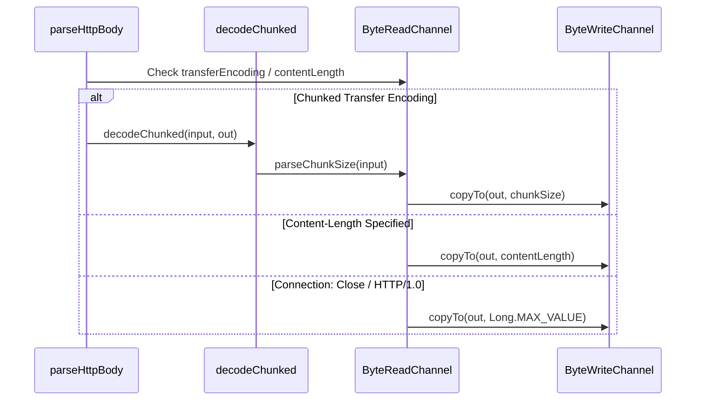

# HTTP CIO Parser

Relevant source files

The following files were used as context for generating this wiki page:

- [ktor-http/ktor-http-cio/common/src/io/ktor/http/cio/ChunkedTransferEncoding.kt](https://github.com/ktorio/ktor/blob/main/ktor-http/ktor-http-cio/common/src/io/ktor/http/cio/ChunkedTransferEncoding.kt)
- [ktor-http/ktor-http-cio/common/src/io/ktor/http/cio/HttpParser.kt](https://github.com/ktorio/ktor/blob/main/ktor-http/ktor-http-cio/common/src/io/ktor/http/cio/HttpParser.kt)
- [ktor-client/ktor-client-cio/common/src/io/ktor/client/engine/cio/utils.kt](https://github.com/ktorio/ktor/blob/main/ktor-client/ktor-client-cio/common/src/io/ktor/client/engine/cio/utils.kt)
- [ktor-http/ktor-http-cio/common/src/io/ktor/http/cio/Multipart.kt](https://github.com/ktorio/ktor/blob/main/ktor-http/ktor-http-cio/common/src/io/ktor/http/cio/Multipart.kt)
- [ktor-http/ktor-http-cio/common/src/io/ktor/http/cio/HttpBody.kt](https://github.com/ktorio/ktor/blob/main/ktor-http/ktor-http-cio/common/src/io/ktor/http/cio/HttpBody.kt)
- [ktor-server/ktor-server-cio/common/src/io/ktor/server/cio/backend/ServerPipeline.kt](https://github.com/ktorio/ktor/blob/main/ktor-server/ktor-server-cio/backend/ServerPipeline.kt)
- [ktor-shared/ktor-websockets/jvm/src/io/ktor/websocket/FrameParser.kt](https://github.com/ktorio/ktor/blob/main/ktor-shared/ktor-websockets/jvm/src/io/ktor/websocket/FrameParser.kt)
- [ktor-client/ktor-client-cio/common/src/io/ktor/client/engine/cio/CioDnsResolver.kt](https://github.com/ktorio/ktor/blob/main/ktor-client/ktor-client-cio/common/src/io/ktor/client/engine/cio/CioDnsResolver.kt)
- [ktor-shared/ktor-websockets/jvm/src/io/ktor/websocket/WebSocketReader.kt](https://github.com/ktorio/ktor/blob/main/ktor-shared/ktor-websockets/jvm/src/io/ktor/websocket/WebSocketReader.kt)
- [ktor-client/ktor-client-cio/jvm/src/io/ktor/client/engine/cio/ConnectionPipeline.kt](https://github.com/ktorio/ktor/blob/main/ktor-client/ktor-client-cio/jvm/src/io/ktor/client/engine/cio/ConnectionPipeline.kt)
- [ktor-http/ktor-http-cio/common/src/io/ktor/http/cio/internals/Chars.kt](https://github.com/ktorio/ktor/blob/main/ktor-http/ktor-http-cio/common/src/io/ktor/http/cio/internals/Chars.kt)
- [ktor-client/ktor-client-curl/desktop/src/io/ktor/client/engine/curl/internal/CurlCallbacks.kt](https://github.com/ktorio/ktor/blob/main/ktor-client/ktor-client-curl/desktop/src/io/ktor/client/engine/curl/internal/CurlCallbacks.kt)
- [ktor-client/ktor-client-curl/desktop/src/io/ktor/client/engine/curl/internal/CurlWebSocketResponseBody.kt](https://github.com/ktorio/ktor/blob/main/ktor-client/ktor-client-curl/desktop/src/io/ktor/client/engine/curl/internal/CurlWebSocketResponseBody.kt)
- [ktor-server/ktor-server-netty/jvm/src/io/ktor/server/netty/cio/RequestBodyHandler.kt](https://github.com/ktorio/ktor/blob/main/ktor-server/ktor-server-netty/jvm/src/io/ktor/server/netty/cio/RequestBodyHandler.kt)
- [ktor-http/ktor-http-cio/common/src/io/ktor/http/cio/RequestResponse.kt](https://github.com/ktorio/ktor/blob/main/ktor-http/ktor-http-cio/common/src/io/ktor/http/cio/RequestResponse.kt)
- [ktor-client/ktor-client-winhttp/windows/src/io/ktor/client/engine/winhttp/internal/WinHttpRequestProducer.kt](https://github.com/ktorio/ktor/blob/main/ktor-client/ktor-client-winhttp/windows/src/io/ktor/client/engine/winhttp/internal/WinHttpRequestProducer.kt)
- [ktor-http/ktor-http-cio/common/src/io/ktor/http/cio/internals/Tokenizer.kt](https://github.com/ktorio/ktor/blob/main/ktor-http/ktor-http-cio/common/src/io/ktor/http/cio/internals/Tokenizer.kt)
- [ktor-http/ktor-http-cio/common/src/io/ktor/http/cio/HttpHeadersMap.kt](https://github.com/ktorio/ktor/blob/main/ktor-http/ktor-http-cio/common/src/io/ktor/http/cio/HttpHeadersMap.kt)

## Overview

The HTTP CIO Parser module provides high-performance, low-allocation network protocol parsing and serialization primitives tailored for Ktor's CIO engine and HTTP infrastructure. It efficiently processes raw socket streams into structured request and response components, manages zero-allocation header maps, handles chunked transfer encodings, and tokenizes multipart boundary streams. By operating directly on byte channels with primitive array offsets and hash-based lookups, it minimizes memory overhead while seamlessly integrating into asynchronous server connection loops, client engine workflows, and low-level WebSocket frame readers.

Sources: [ktor-http/ktor-http-cio/common/src/io/ktor/http/cio/ChunkedTransferEncoding.kt:60-82](https://github.com/ktorio/ktor/blob/main/ktor-http/ktor-http-cio/common/src/io/ktor/http/cio/ChunkedTransferEncoding.kt#L60-L82), [ktor-http/ktor-http-cio/common/src/io/ktor/http/cio/HttpParser.kt:39-97](https://github.com/ktorio/ktor/blob/main/ktor-http/ktor-http-cio/common/src/io/ktor/http/cio/HttpParser.kt#L39-L97), [ktor-http/ktor-http-cio/common/src/io/ktor/http/cio/Multipart.kt:178-213](https://github.com/ktorio/ktor/blob/main/ktor-http/ktor-http-cio/common/src/io/ktor/http/cio/Multipart.kt#L178-L213), [ktor-server/ktor-server-cio/common/src/io/ktor/server/cio/backend/ServerPipeline.kt:43-196](https://github.com/ktorio/ktor/blob/main/ktor-server/ktor-server-cio/backend/ServerPipeline.kt#L43-L196), [ktor-shared/ktor-websockets/jvm/src/io/ktor/websocket/WebSocketReader.kt:28-141](https://github.com/ktorio/ktor/blob/main/ktor-shared/ktor-websockets/jvm/src/io/ktor/websocket/WebSocketReader.kt#L28-L141), [ktor-http/ktor-http-cio/common/src/io/ktor/http/cio/HttpHeadersMap.kt:40-220](https://github.com/ktorio/ktor/blob/main/ktor-http/ktor-http-cio/common/src/io/ktor/http/cio/HttpHeadersMap.kt#L40-L220)

## Request and Response Line Parsing

### Overview

Parsing raw socket streams into structured HTTP fields is managed via asynchronous functions operating on a `ByteReadChannel`. The parser reads lines strictly into a shared `CharArrayBuilder` up to a limit of `8192` characters (`HTTP_LINE_LIMIT`), leveraging mutable range tracking to traverse method, URI, version, and status code fields without intermediary object allocation.

Sources: [ktor-http/ktor-http-cio/common/src/io/ktor/http/cio/HttpParser.kt:18-97](https://github.com/ktorio/ktor/blob/main/ktor-http/ktor-http-cio/common/src/io/ktor/http/cio/HttpParser.kt#L18-L97)

### Request and Response Parsing Call Chains

The execution path for processing incoming requests and responses flows through explicit tokenizer and parsing functions. For incoming requests, the execution walkthrough follows:
`parseRequest()` → `input.readLineStrictTo()` → `parseHttpMethod()` → `parseUri()` → `parseVersion()` → `skipSpaces()` → `parseHeaders()`. 

During `parseHttpMethod()`, the parser first attempts an exact match using `DefaultHttpMethods.search()`. If no exact match is found in the static tree, it falls back to `parseHttpMethodFull()` which invokes `nextToken()`. 

For incoming responses, the call sequence is:
`parseResponse()` → `input.readLineStrictTo()` → `parseVersion()` → `parseStatusCode()` → `skipSpaces()` → `parseHeaders()`.

Sources: [ktor-http/ktor-http-cio/common/src/io/ktor/http/cio/HttpParser.kt:39-97](https://github.com/ktorio/ktor/blob/main/ktor-http/ktor-http-cio/common/src/io/ktor/http/cio/HttpParser.kt#L39-L97), [ktor-http/ktor-http-cio/common/src/io/ktor/http/cio/HttpParser.kt:167-180](https://github.com/ktorio/ktor/blob/main/ktor-http/ktor-http-cio/common/src/io/ktor/http/cio/HttpParser.kt#L167-L180), [ktor-http/ktor-http-cio/common/src/io/ktor/http/cio/internals/Tokenizer.kt:7-12](https://github.com/ktorio/ktor/blob/main/ktor-http/ktor-http-cio/common/src/io/ktor/http/cio/internals/Tokenizer.kt#L7-L12)

### Field Extraction and Validation Constants

The parser enforces strict validation rules on line lengths, status code bounds, protocol versions, and host header syntax.

| Constant / Field | Value / Range | Purpose / Validation Rule |
| :--- | :--- | :--- |
| `HTTP_LINE_LIMIT` | `8192` | Maximum character length allowed for start-lines and header lines |
| `HTTP_STATUS_CODE_MIN_RANGE` | `100` | Minimum valid integer value for an HTTP status code |
| `HTTP_STATUS_CODE_MAX_RANGE` | `999` | Maximum valid integer value for an HTTP status code |
| `versions` | `"HTTP/1.0"`, `"HTTP/1.1"` | AsciiCharTree parsed supported HTTP protocol versions |
| `hostForbiddenSymbols` | `'/'`, `'?'`, `'#'`, `'@'` | Characters strictly forbidden inside the `Host` header value |

Sources: [ktor-http/ktor-http-cio/common/src/io/ktor/http/cio/HttpParser.kt:18-21](https://github.com/ktorio/ktor/blob/main/ktor-http/ktor-http-cio/common/src/io/ktor/http/cio/HttpParser.kt#L18-L21), [ktor-http/ktor-http-cio/common/src/io/ktor/http/cio/HttpParser.kt:157-165](https://github.com/ktorio/ktor/blob/main/ktor-http/ktor-http-cio/common/src/io/ktor/http/cio/HttpParser.kt#L157-L165), [ktor-http/ktor-http-cio/common/src/io/ktor/http/cio/HttpParser.kt:199-212](https://github.com/ktorio/ktor/blob/main/ktor-http/ktor-http-cio/common/src/io/ktor/http/cio/HttpParser.kt#L199-L212)

> [!WARNING]
> Status codes are parsed character-by-character accumulating numeric digits. If a non-digit character other than a space is encountered, a `NumberFormatException` is thrown immediately. If the final accumulated integer falls outside the range of 100 to 999, `parseStatusCode` throws a `ParserException`.

Sources: [ktor-http/ktor-http-cio/common/src/io/ktor/http/cio/HttpParser.kt:214-237](https://github.com/ktorio/ktor/blob/main/ktor-http/ktor-http-cio/common/src/io/ktor/http/cio/HttpParser.kt#L214-L237)

### Parser Design Trade-Offs

| Design Choice | Benefit | Cost |
| :--- | :--- | :--- |
| **`CharArrayBuilder` reuse** | Eliminates intermediate object allocations during line reads across headers and start-lines | Requires explicit lifecycle management (`release()`, `try-finally` blocks) to prevent resource leaks on exceptions |
| **`AsciiCharTree` for versions and methods** | Zero-allocation fast-path matching for standard methods and `HTTP/1.0`/`HTTP/1.1` versions | Requires fallback mechanisms (`parseHttpMethodFull`, `unsupportedHttpVersion`) when custom strings are encountered |
| **MutableRange index tracking** | Avoids substring allocations by mutating parser pointers directly through tokenization functions | Increases code coupling between tokenizer helpers and requires disciplined coordinate management |

Sources: [ktor-http/ktor-http-cio/common/src/io/ktor/http/cio/HttpParser.kt:39-97](https://github.com/ktorio/ktor/blob/main/ktor-http/ktor-http-cio/common/src/io/ktor/http/cio/HttpParser.kt#L39-L97), [ktor-http/ktor-http-cio/common/src/io/ktor/http/cio/HttpParser.kt:167-180](https://github.com/ktorio/ktor/blob/main/ktor-http/ktor-http-cio/common/src/io/ktor/http/cio/HttpParser.kt#L167-L180), [ktor-http/ktor-http-cio/common/src/io/ktor/http/cio/HttpParser.kt:199-212](https://github.com/ktorio/ktor/blob/main/ktor-http/ktor-http-cio/common/src/io/ktor/http/cio/HttpParser.kt#L199-L212), [ktor-http/ktor-http-cio/common/src/io/ktor/http/cio/internals/Tokenizer.kt:7-56](https://github.com/ktorio/ktor/blob/main/ktor-http/ktor-http-cio/common/src/io/ktor/http/cio/internals/Tokenizer.kt#L7-L56)

> [!NOTE]
> Line endings accepted by `parseRequest` and `parseResponse` recognize both standard CRLF sequences and single LF line terminators as specified in RFC 9112 Section 2.2, with trailing or leading whitespace managed via `skipSpaces` and `skipSpacesAndHorizontalTabs`.

Sources: [ktor-http/ktor-http-cio/common/src/io/ktor/http/cio/HttpParser.kt:23-32](https://github.com/ktorio/ktor/blob/main/ktor-http/ktor-http-cio/common/src/io/ktor/http/cio/HttpParser.kt#L23-L32), [ktor-http/ktor-http-cio/common/src/io/ktor/http/cio/HttpParser.kt:52-52](https://github.com/ktorio/ktor/blob/main/ktor-http/ktor-http-cio/common/src/io/ktor/http/cio/HttpParser.kt#L52-L52), [ktor-http/ktor-http-cio/common/src/io/ktor/http/cio/internals/Tokenizer.kt:14-41](https://github.com/ktorio/ktor/blob/main/ktor-http/ktor-http-cio/common/src/io/ktor/http/cio/internals/Tokenizer.kt#L14-L41)

## High Performance Header Storage and Lookup

### Overview

The `HttpHeadersMap` class implements a zero-allocation, primitive array-backed hash map optimized for storing and retrieving HTTP headers in Ktor CIO. Instead of allocating box objects or string keys for every parsed header, `HttpHeadersMap` stores headers within pooled `IntArray` blocks managed by `HeadersData` and `HeadersDataPool`. Each header entry consumes a fixed slot size of 6 integers representing its hash, name bounds, value bounds, and a chaining pointer for collision or duplicate name resolution.

Sources: [ktor-http/ktor-http-cio/common/src/io/ktor/http/cio/HttpHeadersMap.kt:15-34](https://github.com/ktorio/ktor/blob/main/ktor-http/ktor-http-cio/common/src/io/ktor/http/cio/HttpHeadersMap.kt#L15-L34), [ktor-http/ktor-http-cio/common/src/io/ktor/http/cio/HttpHeadersMap.kt:35-46](https://github.com/ktorio/ktor/blob/main/ktor-http/ktor-http-cio/common/src/io/ktor/http/cio/HttpHeadersMap.kt#L35-L46)

### Storage Offsets and Constants

| Constant | Value | Purpose |
| :--- | :--- | :--- |
| `EXPECTED_HEADERS_QTY` | `128` | Initial expected header capacity |
| `HEADER_SIZE` | `6` | Integer slots per header entry |
| `HEADER_ARRAY_POOL_SIZE` | `1000` | Pool capacity for underlying integer arrays |
| `HEADER_ARRAY_SIZE` | `768` | Total integers per pooled array (`EXPECTED_HEADERS_QTY * HEADER_SIZE`) |
| `EMPTY_INDEX` | `-1` | Sentinel value indicating an uninitialized or empty slot |
| `RESIZE_THRESHOLD` | `0.75` | Load factor triggering automatic map resizing |
| `OFFSET_NAME_HASH` | `0` | Slot offset for the case-insensitive name hash |
| `OFFSET_HEADER_NAME_START` | `1` | Slot offset for header name start index in char builder |
| `OFFSET_HEADER_NAME_END` | `2` | Slot offset for header name exclusive end index |
| `OFFSET_HEADER_VALUE_START` | `3` | Slot offset for header value start index |
| `OFFSET_HEADER_VALUE_END` | `4` | Slot offset for header value exclusive end index |
| `OFFSET_NEXT_HEADER` | `5` | Slot offset pointing to next header with duplicate name |

Sources: [ktor-http/ktor-http-cio/common/src/io/ktor/http/cio/HttpHeadersMap.kt:11-34](https://github.com/ktorio/ktor/blob/main/ktor-http/ktor-http-cio/common/src/io/ktor/http/cio/HttpHeadersMap.kt#L11-L34)

> [!WARNING]
> When multiple headers share the same name (such as multiple `Set-Cookie` headers), `HttpHeadersMap` uses linear probing for table indexing while linking duplicate name instances via `OFFSET_NEXT_HEADER`. When retrieving values with `getAll`, the lookup traverses this explicit collision/duplicate chain rather than relying solely on hash bucket adjacency.

Sources: [ktor-http/ktor-http-cio/common/src/io/ktor/http/cio/HttpHeadersMap.kt:82-99](https://github.com/ktorio/ktor/blob/main/ktor-http/ktor-http-cio/common/src/io/ktor/http/cio/HttpHeadersMap.kt#L82-L99), [ktor-http/ktor-http-cio/common/src/io/ktor/http/cio/HttpHeadersMap.kt:148-151](https://github.com/ktorio/ktor/blob/main/ktor-http/ktor-http-cio/common/src/io/ktor/http/cio/HttpHeadersMap.kt#L148-L151)

### Execution Walkthroughs

#### Name Lookup Execution Chain (`NameAt -> At`)
1. `nameAt()` (deprecated, or via `nameAtOffset()`) initiates header lookup and calls `idxToOffset(idx)`.
Sources: [ktor-http/ktor-http-cio/common/src/io/ktor/http/cio/HttpHeadersMap.kt:160-164](https://github.com/ktorio/ktor/blob/main/ktor-http/ktor-http-cio/common/src/io/ktor/http/cio/HttpHeadersMap.kt#L160-L164)
2. `idxToOffset()` validates bounds and calls `offsets()` to retrieve the sequence of entry offsets.
Sources: [ktor-http/ktor-http-cio/common/src/io/ktor/http/cio/HttpHeadersMap.kt:154-158](https://github.com/ktorio/ktor/blob/main/ktor-http/ktor-http-cio/common/src/io/ktor/http/cio/HttpHeadersMap.kt#L154-L158)
3. `offsets()` invokes `headersData.headersStarts()` to locate valid header starts.
Sources: [ktor-http/ktor-http-cio/common/src/io/ktor/http/cio/HttpHeadersMap.kt:100](https://github.com/ktorio/ktor/blob/main/ktor-http/ktor-http-cio/common/src/io/ktor/http/cio/HttpHeadersMap.kt#L100)
4. `headersStarts()` iterates through pooled chunks in `headersData`, invoking `at()` to verify non-empty slots and yield indices.
Sources: [ktor-http/ktor-http-cio/common/src/io/ktor/http/cio/HttpHeadersMap.kt:257-269](https://github.com/ktorio/ktor/blob/main/ktor-http/ktor-http-cio/common/src/io/ktor/http/cio/HttpHeadersMap.kt#L257-L269)
5. `at()` accesses the precise integer slot in the underlying array by computing `arrays[index / HEADER_ARRAY_SIZE][index % HEADER_ARRAY_SIZE]`.
Sources: [ktor-http/ktor-http-cio/common/src/io/ktor/http/cio/HttpHeadersMap.kt:249-251](https://github.com/ktorio/ktor/blob/main/ktor-http/ktor-http-cio/common/src/io/ktor/http/cio/HttpHeadersMap.kt#L249-L251)

#### Value Lookup Execution Chain (`ValueAt -> At`)
1. `valueAt()` (or `valueAtOffset()`) invokes `idxToOffset(idx)`.
Sources: [ktor-http/ktor-http-cio/common/src/io/ktor/http/cio/HttpHeadersMap.kt:165-169](https://github.com/ktorio/ktor/blob/main/ktor-http/ktor-http-cio/common/src/io/ktor/http/cio/HttpHeadersMap.kt#L165-L169)
2. `idxToOffset()` calls `offsets()`.
Sources: [ktor-http/ktor-http-cio/common/src/io/ktor/http/cio/HttpHeadersMap.kt:154-158](https://github.com/ktorio/ktor/blob/main/ktor-http/ktor-http-cio/common/src/io/ktor/http/cio/HttpHeadersMap.kt#L154-L158)
3. `offsets()` calls `headersData.headersStarts()`.
Sources: [ktor-http/ktor-http-cio/common/src/io/ktor/http/cio/HttpHeadersMap.kt:100](https://github.com/ktorio/ktor/blob/main/ktor-http/ktor-http-cio/common/src/io/ktor/http/cio/HttpHeadersMap.kt#L100)
4. `headersStarts()` scans array chunks via `at()`.
Sources: [ktor-http/ktor-http-cio/common/src/io/ktor/http/cio/HttpHeadersMap.kt:257-269](https://github.com/ktorio/ktor/blob/main/ktor-http/ktor-http-cio/common/src/io/ktor/http/cio/HttpHeadersMap.kt#L257-L269)
5. `at()` fetches integers from the backing `IntArray` structures.
Sources: [ktor-http/ktor-http-cio/common/src/io/ktor/http/cio/HttpHeadersMap.kt:249-251](https://github.com/ktorio/ktor/blob/main/ktor-http/ktor-http-cio/common/src/io/ktor/http/cio/HttpHeadersMap.kt#L249-L251)

#### Put and Resize Execution Chain (`Put -> At`)
1. `put()` checks `thresholdReached()` and calls `resize()` when necessary.
Sources: [ktor-http/ktor-http-cio/common/src/io/ktor/http/cio/HttpHeadersMap.kt:117-126](https://github.com/ktorio/ktor/blob/main/ktor-http/ktor-http-cio/common/src/io/ktor/http/cio/HttpHeadersMap.kt#L117-L126)
2. `resize()` borrows a larger `HeadersData` instance and loops through existing entries using `prevData.headersStarts()`.
Sources: [ktor-http/ktor-http-cio/common/src/io/ktor/http/cio/HttpHeadersMap.kt:170-186](https://github.com/ktorio/ktor/blob/main/ktor-http/ktor-http-cio/common/src/io/ktor/http/cio/HttpHeadersMap.kt#L170-L186)
3. `headersStarts()` invokes `at()` on the previous data structure to read stored start/end indices.
Sources: [ktor-http/ktor-http-cio/common/src/io/ktor/http/cio/HttpHeadersMap.kt:257-269](https://github.com/ktorio/ktor/blob/main/ktor-http/ktor-http-cio/common/src/io/ktor/http/cio/HttpHeadersMap.kt#L257-L269)
4. `at()` accesses the target index within the previous backing arrays.
Sources: [ktor-http/ktor-http-cio/common/src/io/ktor/http/cio/HttpHeadersMap.kt:249-251](https://github.com/ktorio/ktor/blob/main/ktor-http/ktor-http-cio/common/src/io/ktor/http/cio/HttpHeadersMap.kt#L249-L251)

Sources: [ktor-http/ktor-http-cio/common/src/io/ktor/http/cio/HttpHeadersMap.kt:100](https://github.com/ktorio/ktor/blob/main/ktor-http/ktor-http-cio/common/src/io/ktor/http/cio/HttpHeadersMap.kt#L100), [ktor-http/ktor-http-cio/common/src/io/ktor/http/cio/HttpHeadersMap.kt:154-189](https://github.com/ktorio/ktor/blob/main/ktor-http/ktor-http-cio/common/src/io/ktor/http/cio/HttpHeadersMap.kt#L154-L189), [ktor-http/ktor-http-cio/common/src/io/ktor/http/cio/HttpHeadersMap.kt:249-269](https://github.com/ktorio/ktor/blob/main/ktor-http/ktor-http-cio/common/src/io/ktor/http/cio/HttpHeadersMap.kt#L249-L269)

### Map Design Trade-Offs

| Design Choice | Benefit | Cost |
| :--- | :--- | :--- |
| **Primitive `IntArray` storage** | Eliminates object allocation overhead per header entry | Requires manual index arithmetic and capacity management |
| **Pooled `HeadersData` buffers** | Reduces garbage collection pressure across connection lifecycles | Demands explicit release calls (`release()`) to return buffers to pools |
| **Linear probing with collision chains** | Simple implementation without node allocations | Prone to clustering under high load factors |

Sources: [ktor-http/ktor-http-cio/common/src/io/ktor/http/cio/HttpHeadersMap.kt:40-46](https://github.com/ktorio/ktor/blob/main/ktor-http/ktor-http-cio/common/src/io/ktor/http/cio/HttpHeadersMap.kt#L40-L46), [ktor-http/ktor-http-cio/common/src/io/ktor/http/cio/HttpHeadersMap.kt:131-138](https://github.com/ktorio/ktor/blob/main/ktor-http/ktor-http-cio/common/src/io/ktor/http/cio/HttpHeadersMap.kt#L131-L138), [ktor-http/ktor-http-cio/common/src/io/ktor/http/cio/HttpHeadersMap.kt:210-215](https://github.com/ktorio/ktor/blob/main/ktor-http/ktor-http-cio/common/src/io/ktor/http/cio/HttpHeadersMap.kt#L210-L215), [ktor-http/ktor-http-cio/common/src/io/ktor/http/cio/HttpHeadersMap.kt:238-276](https://github.com/ktorio/ktor/blob/main/ktor-http/ktor-http-cio/common/src/io/ktor/http/cio/HttpHeadersMap.kt#L238-L276)

## HTTP Body and Transfer Encoding

### Overview

Payload boundary detection and stream decoding in Ktor CIO manage how incoming and outgoing HTTP bodies are read from or written to raw byte channels. The `expectHttpBody` function inspects transfer encodings, content lengths, connection options, and request methods to determine whether a message contains a body. When processing streams, `parseHttpBody` dispatches to chunked decoders or copies fixed-length and connection-delimited bytes.

Sources: [ktor-http/ktor-http-cio/common/src/io/ktor/http/cio/HttpBody.kt:44-62](https://github.com/ktorio/ktor/blob/main/ktor-http/ktor-http-cio/common/src/io/ktor/http/cio/HttpBody.kt#L44-L62), [ktor-http/ktor-http-cio/common/src/io/ktor/http/cio/HttpBody.kt:90-121](https://github.com/ktorio/ktor/blob/main/ktor-http/ktor-http-cio/common/src/io/ktor/http/cio/HttpBody.kt#L90-L121)

### Body Parsing Execution Chain

1. `parseHttpBody()` checks `transferEncoding` via `isTransferEncodingChunked()` and invokes `decodeChunked(input, out)`.
Sources: [ktor-http/ktor-http-cio/common/src/io/ktor/http/cio/HttpBody.kt:98-100](https://github.com/ktorio/ktor/blob/main/ktor-http/ktor-http-cio/common/src/io/ktor/http/cio/HttpBody.kt#L98-L100), [ktor-http/ktor-http-cio/common/src/io/ktor/http/cio/HttpBody.kt:168-195](https://github.com/ktorio/ktor/blob/main/ktor-http/ktor-http-cio/common/src/io/ktor/http/cio/HttpBody.kt#L168-L195)
2. If `contentLength` is not `-1L`, `input.copyTo(out, contentLength)` transfers exact bytes.
Sources: [ktor-http/ktor-http-cio/common/src/io/ktor/http/cio/HttpBody.kt:102-105](https://github.com/ktorio/ktor/blob/main/ktor-http/ktor-http-cio/common/src/io/ktor/http/cio/HttpBody.kt#L102-L105)
3. If connection close is set or HTTP/1.0 keep-alive is absent, `input.copyTo(out, Long.MAX_VALUE)` reads until EOF.
Sources: [ktor-http/ktor-http-cio/common/src/io/ktor/http/cio/HttpBody.kt:107-110](https://github.com/ktorio/ktor/blob/main/ktor-http/ktor-http-cio/common/src/io/ktor/http/cio/HttpBody.kt#L107-L110)
4. Otherwise, `out.close(cause)` fails with an `IllegalStateException` due to missing body boundaries.
Sources: [ktor-http/ktor-http-cio/common/src/io/ktor/http/cio/HttpBody.kt:112-120](https://github.com/ktorio/ktor/blob/main/ktor-http/ktor-http-cio/common/src/io/ktor/http/cio/HttpBody.kt#L112-L120)

Sources: [ktor-http/ktor-http-cio/common/src/io/ktor/http/cio/HttpBody.kt:98-111](https://github.com/ktorio/ktor/blob/main/ktor-http/ktor-http-cio/common/src/io/ktor/http/cio/HttpBody.kt#L98-L111), [ktor-http/ktor-http-cio/common/src/io/ktor/http/cio/ChunkedTransferEncoding.kt:60-82](https://github.com/ktorio/ktor/blob/main/ktor-http/ktor-http-cio/common/src/io/ktor/http/cio/ChunkedTransferEncoding.kt#L60-L82)

### Transfer Encoding Constants and Rules

| Token / Constant | Value / Behavior | Meaning |
| :--- | :--- | :--- |
| `MAX_CHUNK_SIZE_LENGTH` | `128` | Maximum length of chunk size header line in bytes |
| `CR` / `LF` | `\r` (`13`) / `\n` (`10`) | Strict line termination bytes |
| `chunked` | Lowercase match or comma-delimited token | Enables chunked transfer decoding; double-chunking throws `IllegalArgumentException` |
| `identity` | Lowercase match or comma-delimited token | Treated as identity transfer coding (ignored) |

Sources: [ktor-http/ktor-http-cio/common/src/io/ktor/http/cio/ChunkedTransferEncoding.kt:17-17](https://github.com/ktorio/ktor/blob/main/ktor-http/ktor-http-cio/common/src/io/ktor/http/cio/ChunkedTransferEncoding.kt#L17-L17), [ktor-http/ktor-http-cio/common/src/io/ktor/http/cio/ChunkedTransferEncoding.kt:89-90](https://github.com/ktorio/ktor/blob/main/ktor-http/ktor-http-cio/common/src/io/ktor/http/cio/ChunkedTransferEncoding.kt#L89-L90), [ktor-http/ktor-http-cio/common/src/io/ktor/http/cio/HttpBody.kt:168-195](https://github.com/ktorio/ktor/blob/main/ktor-http/ktor-http-cio/common/src/io/ktor/http/cio/HttpBody.kt#L168-L195)

> [!WARNING]
> `parseChunkSize` enforces strict CRLF validation and rejects bare line feeds or empty chunk sizes. Any chunk extension containing quoted strings (`"..."`) toggles the `inQuotes` state to ignore internal semicolons or characters, preventing parser desynchronization and request smuggling vectors.
> Sources: [ktor-http/ktor-http-cio/common/src/io/ktor/http/cio/ChunkedTransferEncoding.kt:101-123](https://github.com/ktorio/ktor/blob/main/ktor-http/ktor-http-cio/common/src/io/ktor/http/cio/ChunkedTransferEncoding.kt#L101-L123)

## Multipart Form Data Stream Tokenization

### Overview

Multipart form data streaming in `ktor-http-cio` tokenizes raw byte channels into structured multipart events such as preambles, individual parts with deferred headers and body channels, and epilogues. The parser validates incoming content type headers to ensure they conform to `multipart/*`, extracts boundary parameters via state-machine scanning, and produces a coroutine-driven stream of events.

Sources: [ktor-http/ktor-http-cio/common/src/io/ktor/http/cio/Multipart.kt:29-115](https://github.com/ktorio/ktor/blob/main/ktor-http/ktor-http-cio/common/src/io/ktor/http/cio/Multipart.kt#L29-L115), [ktor-http/ktor-http-cio/common/src/io/ktor/http/cio/Multipart.kt:178-213](https://github.com/ktorio/ktor/blob/main/ktor-http/ktor-http-cio/common/src/io/ktor/http/cio/Multipart.kt#L178-L213)

### Parsing Pipeline Call Walkthrough

The multipart tokenization process flows through a specific sequence of internal functions managed inside the coroutine producer:

1. `parseMultipart()` validates the `Content-Type` header and delegates to `parseBoundaryInternal()`.
2. `parseBoundaryInternal()` calls `findBoundary()` to locate the boundary parameter within the `Content-Type` sequence, allocating a 74-byte buffer containing CRLF (`0x0d`, `0x0a`), prefix `--`, and boundary bytes.
3. `parsePreambleImpl()` reads data until the first boundary using `input.readUntil(boundary, output, limit, ignoreMissing = true)`.
4. `parsePartHeadersImpl()` reads and parses part headers via `parseHeaders(input, builder)`, returning an `HttpHeadersMap`.
5. `parsePartBodyImpl()` processes the part body by inspecting `Content-Length`: if null, it reads until the prefixed boundary; if specified within range, it copies exact bytes via `input.copyTo(output, contentLength)` and skips trailing boundary bytes.

Sources: [ktor-http/ktor-http-cio/common/src/io/ktor/http/cio/Multipart.kt:123-162](https://github.com/ktorio/ktor/blob/main/ktor-http/ktor-http-cio/common/src/io/ktor/http/cio/Multipart.kt#L123-L162), [ktor-http/ktor-http-cio/common/src/io/ktor/http/cio/Multipart.kt:218-287](https://github.com/ktorio/ktor/blob/main/ktor-http/ktor-http-cio/common/src/io/ktor/http/cio/Multipart.kt#L218-L287), [ktor-http/ktor-http-cio/common/src/io/ktor/http/cio/Multipart.kt:359-447](https://github.com/ktorio/ktor/blob/main/ktor-http/ktor-http-cio/common/src/io/ktor/http/cio/Multipart.kt#L359-L447)

### Boundary Parsing and Event Structures

| Event / Function | Type / Signature | Description |
| :--- | :--- | :--- |
| `MultipartEvent.Preamble` | `class Preamble(val body: Source)` | Represents content preceding the first boundary part. |
| `MultipartEvent.MultipartPart` | `class MultipartPart(val headers: Deferred<HttpHeadersMap>, val body: ByteReadChannel)` | Represents a single multipart part with asynchronous headers and body channel. |
| `MultipartEvent.Epilogue` | `class Epilogue(val body: Source)` | Represents content following the final multipart boundary. |
| `parseBoundaryInternal` | `internal fun parseBoundaryInternal(contentType: CharSequence): ByteArray` | Parses boundary parameter, enforcing a 70-character length limit and 7-bit character range. |

Sources: [ktor-http/ktor-http-cio/common/src/io/ktor/http/cio/Multipart.kt:46-114](https://github.com/ktorio/ktor/blob/main/ktor-http/ktor-http-cio/common/src/io/ktor/http/cio/Multipart.kt#L46-L114), [ktor-http/ktor-http-cio/common/src/io/ktor/http/cio/Multipart.kt:359-447](https://github.com/ktorio/ktor/blob/main/ktor-http/ktor-http-cio/common/src/io/ktor/http/cio/Multipart.kt#L359-L447)

> [!WARNING]
> Failing to fully consume or release the `body` channel of a `MultipartPart` will cause the multipart parser coroutine to suspend indefinitely, halting any subsequent event emission. When releasing events, use `releaseSuspend()` to safely await header completion before discarding unread body bytes.
> Sources: [ktor-http/ktor-http-cio/common/src/io/ktor/http/cio/Multipart.kt:63-96](https://github.com/ktorio/ktor/blob/main/ktor-http/ktor-http-cio/common/src/io/ktor/http/cio/Multipart.kt#L63-L96)

## Server and Client Pipeline Integration

### Overview

Server and client pipelines integrate raw TCP or socket connections with structured HTTP workflows by orchestrating asynchronous loops that parse incoming frames, manage request limits, and dispatch handlers. In Ktor's CIO and Netty engines, pipelining coordinates concurrent request execution while maintaining correct stream boundaries and connection persistence.

Sources: [ktor-server/ktor-server-cio/common/src/io/ktor/server/cio/backend/ServerPipeline.kt:43-187](https://github.com/ktorio/ktor/blob/main/ktor-server/ktor-server-cio/backend/ServerPipeline.kt#L43-L187), [ktor-client/ktor-client-cio/jvm/src/io/ktor/client/engine/cio/ConnectionPipeline.kt:26-67](https://github.com/ktorio/ktor/blob/main/ktor-client/ktor-client-cio/jvm/src/io/ktor/client/engine/cio/ConnectionPipeline.kt#L26-L67)

### Pipeline Execution Walkthroughs

The server pipeline processes incoming connections through a continuous parsing and dispatching sequence inside `startServerConnectionPipeline`:

1. `parseRequest(connection.input)` reads and parses the request line and headers from the socket input channel.
2. `actorChannel.send(response)` registers the response channel for ordered pipeline serialization.
3. `expectHttpBody(...)` and `expectHttpUpgrade(...)` evaluate method, content-length, transfer-encoding, and upgrade headers to determine if an active request body channel or protocol upgrade is required.
4. `handler(handlerScope, request)` invokes the user-defined `HttpRequestHandler` using `RequestHandlerCoroutine` and `Dispatchers.Unconfined`.
5. `parseHttpBody(...)` streams the request body bytes into `requestGroup` if `expectedHttpBody` is true.
6. `isLastHttpRequest(version, connectionOptions)` checks whether connection persistence rules dictate terminating the loop.

Sources: [ktor-server/ktor-server-cio/common/src/io/ktor/server/cio/backend/ServerPipeline.kt:67-186](https://github.com/ktorio/ktor/blob/main/ktor-server/ktor-server-cio/backend/ServerPipeline.kt#L67-L186)

Client pipelines coordinate request tasks through a semaphore-guarded queue in `ConnectionPipeline`:

1. `tasks.receive()` retrieves an outgoing `RequestTask` from the engine queue subject to the `keepAliveTime` timeout.
2. `requestLimit.acquire()` enforces the maximum allowed concurrent pipeline requests (`pipelineMaxSize`).
3. `writeRequest(...)` serializes request headers and body payload to `networkOutput`.
4. `parseResponse(networkInput)` reads and parses the incoming HTTP response headers and status codes.
5. `parseHttpBody(...)` streams the response body into an active `KtorByteChannel` when a response body is expected.

Sources: [ktor-client/ktor-client-cio/jvm/src/io/ktor/client/engine/cio/ConnectionPipeline.kt:43-134](https://github.com/ktorio/ktor/blob/main/ktor-client/ktor-client-cio/jvm/src/io/ktor/client/engine/cio/ConnectionPipeline.kt#L43-L134)

### Pipeline and Handler Configuration

| Component / Function | Context / Scope | Purpose |
| :--- | :--- | :--- |
| `startServerConnectionPipeline` | `CoroutineScope` | Orchestrates the server connection loop, managing actor channels and writer loops. |
| `ConnectionPipeline` | `CoroutineScope` | Manages client engine request execution pools, flow control semaphores, and response parsing. |
| `RequestBodyHandler` | `ChannelInboundHandlerAdapter` | Netty channel adapter that bridges inbound Netty ByteBufs into Ktor `ByteWriteChannel` streams via a coroutine queue. |
| `pipelineWriterLoop` | Background Coroutine | Serializes responses from concurrent request handlers into the single socket output channel. |

Sources: [ktor-server/ktor-server-cio/common/src/io/ktor/server/cio/backend/ServerPipeline.kt:43-61](https://github.com/ktorio/ktor/blob/main/ktor-server/ktor-server-cio/backend/ServerPipeline.kt#L43-L61), [ktor-server/ktor-server-cio/common/src/io/ktor/server/cio/backend/ServerPipeline.kt:221-239](https://github.com/ktorio/ktor/blob/main/ktor-server/ktor-server-cio/backend/ServerPipeline.kt#L221-L239), [ktor-client/ktor-client-cio/jvm/src/io/ktor/client/engine/cio/ConnectionPipeline.kt:26-148](https://github.com/ktorio/ktor/blob/main/ktor-client/ktor-client-cio/jvm/src/io/ktor/client/engine/cio/ConnectionPipeline.kt#L26-L148), [ktor-server/ktor-server-netty/jvm/src/io/ktor/server/netty/cio/RequestBodyHandler.kt:18-80](https://github.com/ktorio/ktor/blob/main/ktor-server/ktor-server-netty/jvm/src/io/ktor/server/netty/cio/RequestBodyHandler.kt#L18-80)

> [!NOTE]
> Server pipeline request handlers execute on `RequestHandlerCoroutine + Dispatchers.Unconfined`. If an upgrade is requested via `expectedHttpUpgrade`, the pipeline suspends until the deferred boolean completes to determine whether socket ownership should be transferred to the upgrade handler.
> Sources: [ktor-server/ktor-server-cio/common/src/io/ktor/server/cio/backend/ServerPipeline.kt:63-64](https://github.com/ktorio/ktor/blob/main/ktor-server/ktor-server-cio/backend/ServerPipeline.kt#L63-L64), [ktor-server/ktor-server-cio/common/src/io/ktor/server/cio/backend/ServerPipeline.kt:133-164](https://github.com/ktorio/ktor/blob/main/ktor-server/ktor-server-cio/backend/ServerPipeline.kt#L133-L164)

## WebSocket Frame and Stream Parsing

### Overview

WebSocket frame and stream parsing handles low-level protocol framing, tracking header flags, variable-length payloads, masking keys, and stream fragmentation over persistent connections. `FrameParser` operates on a state machine managing four distinct parsing phases (`HEADER0`, `LENGTH`, `MASK_KEY`, `BODY`), validating control frame constraints, opcode continuations, and buffer constraints. `WebSocketReader` coordinates continuous reading from a `ByteReadChannel`, feeding incoming data blocks through the frame parser and collecting payload chunks into standard `Frame` instances emitted onto an incoming coroutine channel.

Sources: [ktor-shared/ktor-websockets/jvm/src/io/ktor/websocket/FrameParser.kt:10-48](https://github.com/ktorio/ktor/blob/main/ktor-shared/ktor-websockets/jvm/src/io/ktor/websocket/FrameParser.kt#L10-L48), [ktor-shared/ktor-websockets/jvm/src/io/ktor/websocket/WebSocketReader.kt:18-77](https://github.com/ktorio/ktor/blob/main/ktor-shared/ktor-websockets/jvm/src/io/ktor/websocket/WebSocketReader.kt#L18-L77)

### Frame Parsing Call Chain and Execution Workflow

WebSocket byte stream processing progresses through structured parsing steps managed by `FrameParser` and `WebSocketReader`:

1. `WebSocketReader.readLoop()` reads available bytes from `byteChannel` into a pooled `ByteBuffer` and invokes `parseLoop()`.
Sources: [ktor-shared/ktor-websockets/jvm/src/io/ktor/websocket/WebSocketReader.kt:78-91](https://github.com/ktorio/ktor/blob/main/ktor-shared/ktor-websockets/jvm/src/io/ktor/websocket/WebSocketReader.kt#L78-L91)

2. `WebSocketReader.parseLoop()` delegates incoming buffers to `frameParser.frame(bb)`, ensuring the buffer order is `BIG_ENDIAN`.
Sources: [ktor-shared/ktor-websockets/jvm/src/io/ktor/websocket/FrameParser.kt:65-70](https://github.com/ktorio/ktor/blob/main/ktor-shared/ktor-websockets/jvm/src/io/ktor/websocket/FrameParser.kt#L65-L70), [ktor-shared/ktor-websockets/jvm/src/io/ktor/websocket/WebSocketReader.kt:93-97](https://github.com/ktorio/ktor/blob/main/ktor-shared/ktor-websockets/jvm/src/io/ktor/websocket/WebSocketReader.kt#L93-L97)

3. `FrameParser.handleStep()` routes execution based on the current state:
   - `State.HEADER0` → `parseHeader1(bb)` reads the initial 2-byte header, extracts `fin`, `rsv1-3`, opcode, mask flag, and determines extended length sizing (`lengthLength` of 2 or 8 bytes, or direct 7-bit length).
   - `State.LENGTH` → `parseLength(bb)` reads 2 or 8 bytes for extended payload lengths.
   - `State.MASK_KEY` → `parseMaskKey(bb)` reads the 4-byte masking key.
   - `State.BODY` → completes parsing preparation.
Sources: [ktor-shared/ktor-websockets/jvm/src/io/ktor/websocket/FrameParser.kt:72-155](https://github.com/ktorio/ktor/blob/main/ktor-shared/ktor-websockets/jvm/src/io/ktor/websocket/FrameParser.kt#L72-L155)

4. Once `frameParser.bodyReady` becomes true, `WebSocketReader` verifies length boundaries against `maxFrameSize`, invokes `collector.start()`, and processes frame chunks until `handleFrameIfProduced()` dispatches a constructed `Frame` to the `queue` channel.
Sources: [ktor-shared/ktor-websockets/jvm/src/io/ktor/websocket/WebSocketReader.kt:98-134](https://github.com/ktorio/ktor/blob/main/ktor-shared/ktor-websockets/jvm/src/io/ktor/websocket/WebSocketReader.kt#L98-L134)

> [!WARNING]
> Control frames cannot be fragmented (`!fin` throws a `ProtocolViolationException`) and cannot exceed `MAX_CONTROL_FRAME_PAYLOAD_SIZE` bytes. Furthermore, attempting to intermix data frames before finishing a previous unfragmented or continuing frame triggers immediate protocol violation exceptions.
> Sources: [ktor-shared/ktor-websockets/jvm/src/io/ktor/websocket/FrameParser.kt:93-113](https://github.com/ktorio/ktor/blob/main/ktor-shared/ktor-websockets/jvm/src/io/ktor/websocket/FrameParser.kt#L93-L113)

### FrameParser States and Protocol Constants

| State / Field | Type / Value | Purpose |
| :--- | :--- | :--- |
| `State.HEADER0` | Enum constant | Parses the initial 2-byte WebSocket header containing FIN, RSV1-3, opcode, mask flag, and initial 7-bit length. |
| `State.LENGTH` | Enum constant | Parses extended payload lengths (2 bytes for 126, 8 bytes for 127). |
| `State.MASK_KEY` | Enum constant | Parses the 4-byte masking key when the mask flag is set. |
| `State.BODY` | Enum constant | Indicates header parsing is complete and payload body bytes are ready for consumption. |
| `lengthLength` | `Int` (0, 2, or 8) | Determines how many subsequent bytes represent the extended frame length. |

Sources: [ktor-shared/ktor-websockets/jvm/src/io/ktor/websocket/FrameParser.kt:31-48](https://github.com/ktorio/ktor/blob/main/ktor-shared/ktor-websockets/jvm/src/io/ktor/websocket/FrameParser.kt#L31-L48), [ktor-shared/ktor-websockets/jvm/src/io/ktor/websocket/FrameParser.kt:115-119](https://github.com/ktorio/ktor/blob/main/ktor-shared/ktor-websockets/jvm/src/io/ktor/websocket/FrameParser.kt#L115-L119)

### Design Trade-Offs in WebSocket Parsing

| Design Choice | Benefit | Cost |
| :--- | :--- | :--- |
| **Explicit State Machine (`FrameParser`)** | Enables incremental, non-blocking parsing of partial TCP chunks without buffering the entire frame upfront. | Requires complex state tracking (`AtomicReference`) and careful buffer remaining checks (`bb.remaining()`). |
| **Separate Frame Collector (`SimpleFrameCollector`)** | Decouples header parsing mechanics from payload accumulation and unmasking routines. | Requires coordinating state transitions between `WebSocketReader`, `FrameParser`, and the collector across buffer boundaries. |
| **Channel-Based Queue (`WebSocketReader.queue`)** | Safely bridges background coroutine loop reads to consumer channels with backpressure support. | Exceptions like `FrameTooBigException` or `ProtocolViolationException` must be explicitly caught and re-thrown through queue closure. |

Sources: [ktor-shared/ktor-websockets/jvm/src/io/ktor/websocket/FrameParser.kt:10-155](https://github.com/ktorio/ktor/blob/main/ktor-shared/ktor-websockets/jvm/src/io/ktor/websocket/FrameParser.kt#L10-L155), [ktor-shared/ktor-websockets/jvm/src/io/ktor/websocket/WebSocketReader.kt:44-68](https://github.com/ktorio/ktor/blob/main/ktor-shared/ktor-websockets/jvm/src/io/ktor/websocket/WebSocketReader.kt#L44-L68)

## Related

- [[CIO Server]]
- [[CIO Client]]

