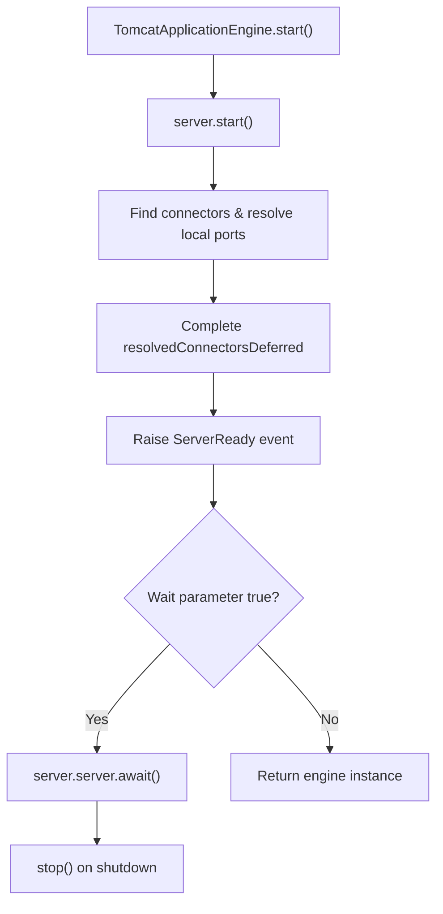
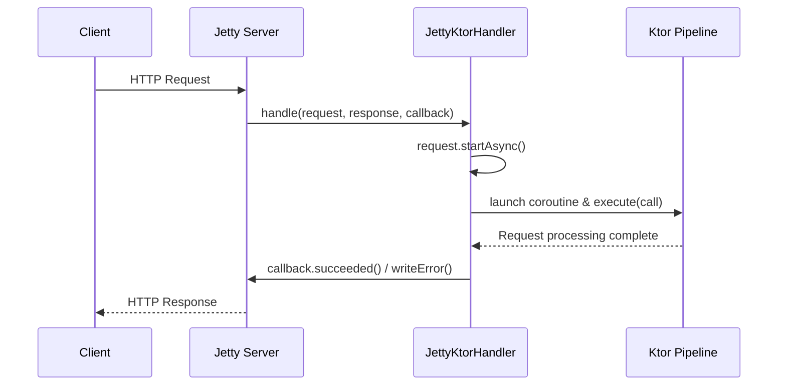

# Jetty and Tomcat

<details>
<summary>Relevant source files</summary>

The following files were used as context for generating this wiki page:

- [ktor-server/ktor-server-tomcat/jvm/src/io/ktor/server/tomcat/TomcatApplicationEngine.kt](https://github.com/ktorio/ktor/blob/main/ktor-server/ktor-server-tomcat/jvm/src/io/ktor/server/tomcat/TomcatApplicationEngine.kt)
- [ktor-server/ktor-server-tomcat-jakarta/jvm/src/io/ktor/server/tomcat/jakarta/TomcatApplicationEngine.kt](https://github.com/ktorio/ktor/blob/main/ktor-server/ktor-server-tomcat-jakarta/jvm/src/io/ktor/server/tomcat/jakarta/TomcatApplicationEngine.kt)
- [ktor-server/ktor-server-servlet-jakarta/jvm/src/io/ktor/server/servlet/jakarta/KtorServlet.kt](https://github.com/ktorio/ktor/blob/main/ktor-server/ktor-server-servlet-jakarta/jvm/src/io/ktor/server/servlet/jakarta/KtorServlet.kt)
- [ktor-server/ktor-server-servlet/jvm/src/io/ktor/server/servlet/KtorServlet.kt](https://github.com/ktorio/ktor/blob/main/ktor-server/ktor-server-servlet/jvm/src/io/ktor/server/servlet/KtorServlet.kt)
- [ktor-server/ktor-server-jetty-jakarta/jvm/src/io/ktor/server/jetty/jakarta/internal/JettyUpgradeImpl.kt](https://github.com/ktorio/ktor/blob/main/ktor-server/ktor-server-jetty-jakarta/jvm/src/io/ktor/server/jetty/jakarta/internal/JettyUpgradeImpl.kt)
- [ktor-server/ktor-server-jetty-jakarta/jvm/src/io/ktor/server/jetty/jakarta/JettyApplicationCall.kt](https://github.com/ktorio/ktor/blob/main/ktor-server/ktor-server-jetty-jakarta/jvm/src/io/ktor/server/jetty/jakarta/JettyApplicationCall.kt)
- [ktor-server/ktor-server-jetty-jakarta/jvm/src/io/ktor/server/jetty/jakarta/JettyKtorHandler.kt](https://github.com/ktorio/ktor/blob/main/ktor-server/ktor-server-jetty-jakarta/jvm/src/io/ktor/server/jetty/jakarta/JettyKtorHandler.kt)
- [ktor-server/ktor-server-servlet-jakarta/jvm/src/io/ktor/server/servlet/jakarta/ServletApplicationEngine.kt](https://github.com/ktorio/ktor/blob/main/ktor-server/ktor-server-servlet-jakarta/jvm/src/io/ktor/server/servlet/jakarta/ServletApplicationEngine.kt)
- [ktor-server/ktor-server-servlet/jvm/src/io/ktor/server/servlet/ServletUpgrade.kt](https://github.com/ktorio/ktor/blob/main/ktor-server/ktor-server-servlet/jvm/src/io/ktor/server/servlet/ServletUpgrade.kt)
- [ktor-server/ktor-server-servlet-jakarta/jvm/src/io/ktor/server/servlet/jakarta/ServletUpgrade.kt](https://github.com/ktorio/ktor/blob/main/ktor-server/ktor-server-servlet-jakarta/jvm/src/io/ktor/server/servlet/jakarta/ServletUpgrade.kt)
- [ktor-server/ktor-server-jetty/jvm/src/io/ktor/server/jetty/JettyKtorHandler.kt](https://github.com/ktorio/ktor/blob/main/ktor-server/ktor-server-jetty/jvm/src/io/ktor/server/jetty/JettyKtorHandler.kt)
- [ktor-server/ktor-server-servlet/jvm/src/io/ktor/server/servlet/ServletApplicationEngine.kt](https://github.com/ktorio/ktor/blob/main/ktor-server/ktor-server-servlet/jvm/src/io/ktor/server/servlet/ServletApplicationEngine.kt)
- [ktor-server/ktor-server-servlet/jvm/src/io/ktor/server/servlet/BlockingServlet.kt](https://github.com/ktorio/ktor/blob/main/ktor-server/ktor-server-servlet/jvm/src/io/ktor/server/servlet/BlockingServlet.kt)
- [ktor-server/ktor-server-servlet-jakarta/jvm/src/io/ktor/server/servlet/jakarta/ServletReader.kt](https://github.com/ktorio/ktor/blob/main/ktor-server/ktor-server-servlet-jakarta/jvm/src/io/ktor/server/servlet/jakarta/ServletReader.kt)
- [ktor-server/ktor-server-jetty/jvm/src/io/ktor/server/jetty/internal/JettyUpgradeImpl.kt](https://github.com/ktorio/ktor/blob/main/ktor-server/ktor-server-jetty/jvm/src/io/ktor/server/jetty/internal/JettyUpgradeImpl.kt)
- [ktor-server/ktor-server-jetty/jvm/src/io/ktor/server/jetty/internal/EndPointChannels.kt](https://github.com/ktorio/ktor/blob/main/ktor-server/ktor-server-jetty/jvm/src/io/ktor/server/jetty/internal/EndPointChannels.kt)
- [ktor-server/ktor-server-servlet/jvm/src/io/ktor/server/servlet/AsyncServlet.kt](https://github.com/ktorio/ktor/blob/main/ktor-server/ktor-server-servlet/jvm/src/io/ktor/server/servlet/AsyncServlet.kt)
- [ktor-server/ktor-server-jetty-jakarta/jvm/src/io/ktor/server/jetty/jakarta/internal/EndPointChannels.kt](https://github.com/ktorio/ktor/blob/main/ktor-server/ktor-server-jetty-jakarta/jvm/src/io/ktor/server/jetty/jakarta/internal/EndPointChannels.kt)
- [ktor-server/ktor-server-servlet-jakarta/jvm/src/io/ktor/server/servlet/jakarta/AsyncServlet.kt](https://github.com/ktorio/ktor/blob/main/ktor-server/ktor-server-servlet-jakarta/jvm/src/io/ktor/server/servlet/jakarta/AsyncServlet.kt)
- [ktor-server/ktor-server-servlet-jakarta/jvm/src/io/ktor/server/servlet/jakarta/BlockingServlet.kt](https://github.com/ktorio/ktor/blob/main/ktor-server/ktor-server-servlet-jakarta/jvm/src/io/ktor/server/servlet/jakarta/BlockingServlet.kt)
- [ktor-server/ktor-server-tomcat-jakarta/jvm/src/io/ktor/server/tomcat/jakarta/Embedded.kt](https://github.com/ktorio/ktor/blob/main/ktor-server/ktor-server-tomcat-jakarta/jvm/src/io/ktor/server/tomcat/jakarta/Embedded.kt)
- [ktor-server/ktor-server-jetty/jvm/src/io/ktor/server/jetty/JettyApplicationEngineBase.kt](https://github.com/ktorio/ktor/blob/main/ktor-server/ktor-server-jetty/jvm/src/io/ktor/server/jetty/JettyApplicationEngineBase.kt)
</details>

## Overview

### Overview Details

The Jetty and Tomcat integration modules in Ktor provide robust server engine implementations that embed Apache Tomcat and Eclipse Jetty directly into Ktor applications or deploy Ktor via standard Servlet containers. These engines bridge traditional Java EE / Jakarta EE servlet infrastructure with Ktor's asynchronous coroutine-based pipeline. By wrapping servlet requests and responses into Ktor's `ApplicationCall` abstractions and mapping non-blocking I/O primitives (`AsyncContext`, Servlet 3.1+ `ReadListener`/`WriteListener`, and native Jetty endpoints), these engines allow developers to run high-performance asynchronous Ktor services on enterprise-grade servlet runtimes.

Sources: [ktor-server/ktor-server-tomcat/jvm/src/io/ktor/server/tomcat/TomcatApplicationEngine.kt:27-38](https://github.com/ktorio/ktor/blob/main/ktor-server/ktor-server-tomcat/jvm/src/io/ktor/server/tomcat/TomcatApplicationEngine.kt#L27-L38)

Architecturally, the subsystem is split into embedded server factories (such as `Tomcat` and `JettyApplicationEngineBase`), generic servlet integration layers (`KtorServlet` and `ServletApplicationEngine` supporting both `javax.servlet` and `jakarta.servlet` namespaces), and specialized engine handlers (`JettyKtorHandler` and `JettyUpgradeImpl`). This modular split solves the challenge of impedance mismatch between callback-driven or thread-per-request servlet models and Ktor's suspending pipelines by executing pipeline logic within structured coroutine scopes, managing thread dispatching via dedicated `ThreadPoolExecutor` instances, and overriding standard upgrade mechanisms for protocol switches like WebSockets.

Sources: [ktor-server/ktor-server-jetty/jvm/src/io/ktor/server/jetty/JettyApplicationEngineBase.kt:17-31](https://github.com/ktorio/ktor/blob/main/ktor-server/ktor-server-jetty/jvm/src/io/ktor/server/jetty/JettyApplicationEngineBase.kt#L17-L31), [ktor-server/ktor-server-servlet-jakarta/jvm/src/io/ktor/server/servlet/jakarta/KtorServlet.kt:19-30](https://github.com/ktorio/ktor/blob/main/ktor-server/ktor-server-servlet-jakarta/jvm/src/io/ktor/server/servlet/jakarta/KtorServlet.kt#L19-L30)

---

## Tomcat Embedded Application Engine

### Tomcat Lifecycle and Mechanics

The `TomcatApplicationEngine` manages an embedded Apache Tomcat instance (`org.apache.catalina.startup.Tomcat`). During engine instantiation, it sets up a temporary working directory, configures HTTP/HTTPS connectors based on Ktor connector configurations, and mounts a dynamic servlet mapping (`/*`) pointing to the Ktor servlet handler.

Sources: [ktor-server/ktor-server-tomcat/jvm/src/io/ktor/server/tomcat/TomcatApplicationEngine.kt:32-147](https://github.com/ktorio/ktor/blob/main/ktor-server/ktor-server-tomcat/jvm/src/io/ktor/server/tomcat/TomcatApplicationEngine.kt#L32-L147)



Sources: [ktor-server/ktor-server-tomcat/jvm/src/io/ktor/server/tomcat/TomcatApplicationEngine.kt:151-169](https://github.com/ktorio/ktor/blob/main/ktor-server/ktor-server-tomcat/jvm/src/io/ktor/server/tomcat/TomcatApplicationEngine.kt#L151-L169)

Connectors are configured by translating Ktor connector definitions into Tomcat `Connector` objects. For SSL connections (`EngineSSLConnectorConfig`), the engine validates keystore and truststore paths, configures TLS parameters, and dynamically chooses the underlying SSL implementation (`OpenSSLImplementation` or `JSSEImplementation`).

Sources: [ktor-server/ktor-server-tomcat-jakarta/jvm/src/io/ktor/server/tomcat/jakarta/TomcatApplicationEngine.kt:82-148](https://github.com/ktorio/ktor/blob/main/ktor-server/ktor-server-tomcat-jakarta/jvm/src/io/ktor/server/tomcat/jakarta/TomcatApplicationEngine.kt#L82-L148)

> [!WARNING]
> Tomcat strictly requires `keyStorePath` to be set when using `EngineSSLConnectorConfig`. Omitting it throws an `IllegalArgumentException` during server initialization.

Sources: [ktor-server/ktor-server-tomcat/jvm/src/io/ktor/server/tomcat/TomcatApplicationEngine.kt:89-94](https://github.com/ktorio/ktor/blob/main/ktor-server/ktor-server-tomcat/jvm/src/io/ktor/server/tomcat/TomcatApplicationEngine.kt#L89-L94)

---

## Jetty Application Engine and Handler

### Jetty Request Dispatching and Execution

The Jetty engine (`JettyApplicationEngineBase` and `JettyKtorHandler`) embeds an Eclipse Jetty `Server` instance. Incoming HTTP requests are intercepted by `JettyKtorHandler` (extending Jetty's `Handler.Abstract` or `AbstractHandler`), which dispatches request processing to a dedicated `ThreadPoolExecutor` wrapped in a coroutine dispatcher.

Sources: [ktor-server/ktor-server-jetty-jakarta/jvm/src/io/ktor/server/jetty/jakarta/JettyKtorHandler.kt:28-54](https://github.com/ktorio/ktor/blob/main/ktor-server/ktor-server-jetty-jakarta/jvm/src/io/ktor/server/jetty/jakarta/JettyKtorHandler.kt#L28-L54)

When a request arrives at `JettyKtorHandler.handle`, the handler configures multipart handling if required, puts the request into asynchronous mode via `request.startAsync()`, and launches a coroutine on the engine dispatcher:

1. `applicationProvider()` fetches the active Ktor `Application`.
2. A `JettyApplicationCall` is constructed wrapping the Jetty `Request` and `Response`.
3. `pipeline.execute(call)` processes the request through Ktor's engine pipeline.
4. Completion and error callbacks (`callback.succeeded()` or `tryWriteError`) ensure the container is notified of request completion.

Sources: [ktor-server/ktor-server-jetty-jakarta/jvm/src/io/ktor/server/jetty/jakarta/JettyKtorHandler.kt:64-101](https://github.com/ktorio/ktor/blob/main/ktor-server/ktor-server-jetty-jakarta/jvm/src/io/ktor/server/jetty/jakarta/JettyKtorHandler.kt#L64-L101)



Sources: [ktor-server/ktor-server-jetty-jakarta/jvm/src/io/ktor/server/jetty/jakarta/JettyKtorHandler.kt:64-115](https://github.com/ktorio/ktor/blob/main/ktor-server/ktor-server-jetty-jakarta/jvm/src/io/ktor/server/jetty/jakarta/JettyKtorHandler.kt#L64-L115)

> [!NOTE]
> The `JettyKtorHandler` uses a `SynchronousQueue` with a custom `RejectedExecutionHandler` that executes rejected tasks directly on the caller thread during shutdown or queue saturation, ensuring proper cancellation propagation.

Sources: [ktor-server/ktor-server-jetty-jakarta/jvm/src/io/ktor/server/jetty/jakarta/JettyKtorHandler.kt:34-49](https://github.com/ktorio/ktor/blob/main/ktor-server/ktor-server-jetty-jakarta/jvm/src/io/ktor/server/jetty/jakarta/JettyKtorHandler.kt#L34-L49)

---

## Servlet Bridge Core (`KtorServlet`)

### Service Routing and Request Handling

`KtorServlet` is the abstract base class extending `HttpServlet` and `CoroutineScope` that unifies servlet container interactions across Tomcat, Jetty, and external servlet containers.

Sources: [ktor-server/ktor-server-servlet-jakarta/jvm/src/io/ktor/server/servlet/jakarta/KtorServlet.kt:24-57](https://github.com/ktorio/ktor/blob/main/ktor-server/ktor-server-servlet-jakarta/jvm/src/io/ktor/server/servlet/jakarta/KtorServlet.kt#L24-L57)

In `KtorServlet.service`, incoming requests are inspected for asynchronous support:

```kotlin
override fun service(request: HttpServletRequest, response: HttpServletResponse) {
    if (response.isCommitted) return

    try {
        if (request.isAsyncSupported) {
            asyncService(request, response)
        } else {
            blockingService(request, response)
        }
    } catch (ioError: ChannelIOException) {
        application.log.debug("I/O error", ioError)
    } catch (cancelled: CancellationException) {
        response.sendErrorIfNotCommitted("Cancelled")
    } catch (ex: Throwable) {
        application.log.error("ServletApplicationEngine cannot service the request", ex)
        response.sendErrorIfNotCommitted(ex.message ?: ex.toString())
    }
}
```

Sources: [ktor-server/ktor-server-servlet-jakarta/jvm/src/io/ktor/server/servlet/jakarta/KtorServlet.kt:82-101](https://github.com/ktorio/ktor/blob/main/ktor-server/ktor-server-servlet-jakarta/jvm/src/io/ktor/server/servlet/jakarta/KtorServlet.kt#L82-L101)

When asynchronous processing is available, `asyncService` initiates asynchronous execution:

```kotlin
private fun asyncService(request: HttpServletRequest, response: HttpServletResponse) {
    val asyncContext = request.startAsync()!!.apply {
        timeout = 0L
    }

    launch(Dispatchers.IO) {
        val call = AsyncServletApplicationCall(
            application,
            request,
            response,
            engineContext = Dispatchers.IO,
            userContext = Dispatchers.IO,
            upgrade = upgrade,
            parentCoroutineContext = coroutineContext,
            managedByEngineHeaders
        )

        try {
            enginePipeline.execute(call)
        } catch (cause: Throwable) {
            logError(call, cause)
            response.sendErrorIfNotCommitted(cause.message)
        } finally {
            try {
                asyncContext.complete()
            } catch (alreadyCompleted: IllegalStateException) {
                application.log.debug("AsyncContext is already completed", alreadyCompleted)
            }
        }
    }
}
```

Sources: [ktor-server/ktor-server-servlet-jakarta/jvm/src/io/ktor/server/servlet/jakarta/KtorServlet.kt:114-147](https://github.com/ktorio/ktor/blob/main/ktor-server/ktor-server-servlet-jakarta/jvm/src/io/ktor/server/servlet/jakarta/KtorServlet.kt#L114-L147)

If the container does not support asynchronous mode, `blockingService` runs synchronously using `runBlocking` over `coroutineContext`, instantiating a `BlockingServletApplicationCall`.

Sources: [ktor-server/ktor-server-servlet-jakarta/jvm/src/io/ktor/server/servlet/jakarta/KtorServlet.kt:149-160](https://github.com/ktorio/ktor/blob/main/ktor-server/ktor-server-servlet-jakarta/jvm/src/io/ktor/server/servlet/jakarta/KtorServlet.kt#L149-L160)

---

## Servlet Application Engine and Bootstrap

### External Container Bootstrap

`ServletApplicationEngine` handles deployment in external servlet containers (such as WAR deployments). It inspects the `ServletContext` to determine whether the application is running in external injection mode, managed mode (initialized via `KtorServletContainerInitializer`), or self-bootstrap fallback mode.

Sources: [ktor-server/ktor-server-servlet-jakarta/jvm/src/io/ktor/server/servlet/jakarta/ServletApplicationEngine.kt:26-50](https://github.com/ktorio/ktor/blob/main/ktor-server/ktor-server-servlet-jakarta/jvm/src/io/ktor/server/servlet/jakarta/ServletApplicationEngine.kt#L26-L50)

The bootstrap process parses initialization parameters and builds the server pipeline:

Sources: [ktor-server/ktor-server-servlet-jakarta/jvm/src/io/ktor/server/servlet/jakarta/ServletApplicationEngine.kt:202-238](https://github.com/ktorio/ktor/blob/main/ktor-server/ktor-server-servlet-jakarta/jvm/src/io/ktor/server/servlet/jakarta/ServletApplicationEngine.kt#L202-L238)

```kotlin
internal fun bootstrapServletApplication(
    servletContext: ServletContext,
    initParameters: List<Pair<String, String>>
): ServletApplicationBootstrap {
    val parameters = initParameters
        .filter { (name, _) -> name.startsWith("io.ktor.") }
        .map { (name, value) -> name.removePrefix("io.ktor.") to value }

    val parametersConfig = MapApplicationConfig(parameters)
    val combinedConfig = parametersConfig
        .withFallback(load(parametersConfig.tryGetString("ktor.config")))

    val applicationId = combinedConfig.tryGetString("ktor.application.id") ?: "Application"

    val environment = applicationEnvironment {
        config = combinedConfig
        log = LoggerFactory.getLogger(applicationId)
        classLoader = servletContext.classLoader
    }
    val applicationProperties = serverConfig(environment) {
        rootPath = servletContext.contextPath ?: "/"
    }
    val server = EmbeddedServer(applicationProperties, EmptyEngineFactory)

    val enginePipeline = defaultEnginePipeline(environment.config, server.application.developmentMode).also {
        BaseApplicationResponse.setupSendPipeline(it.sendPipeline)
    }

    server.monitor.subscribe(ApplicationStarting) {
        it.receivePipeline.merge(enginePipeline.receivePipeline)
        it.sendPipeline.merge(enginePipeline.sendPipeline)
        it.receivePipeline.installDefaultTransformations()
        it.sendPipeline.installDefaultTransformations()
    }

    return ServletApplicationBootstrap(server, enginePipeline)
}
```

Sources: [ktor-server/ktor-server-servlet-jakarta/jvm/src/io/ktor/server/servlet/jakarta/ServletApplicationEngine.kt:202-238](https://github.com/ktorio/ktor/blob/main/ktor-server/ktor-server-servlet-jakarta/jvm/src/io/ktor/server/servlet/jakarta/ServletApplicationEngine.kt#L202-L238)

---

## Non-Blocking I/O: Servlet Readers and Writers

### Asynchronous Stream Processing

To prevent thread blocking during request body reading and response writing in servlet environments, Ktor implements asynchronous streaming primitives (`ServletReader` and `ServletWriter`).

Sources: [ktor-server/ktor-server-servlet-jakarta/jvm/src/io/ktor/server/servlet/jakarta/ServletReader.kt:16-26](https://github.com/ktorio/ktor/blob/main/ktor-server/ktor-server-servlet-jakarta/jvm/src/io/ktor/server/servlet/jakarta/ServletReader.kt#L16-L26)

`ServletReader` implements Jakarta/javax `ReadListener` to feed incoming servlet input streams into a Ktor `ByteChannel`:

```kotlin
private class ServletReader(
    val input: ServletInputStream,
    val contentLength: Int,
    val idleTimeout: Duration?
) : ReadListener {
    val channel = ByteChannel()
    private val events = Channel<Unit>(2)
}
```

Sources: [ktor-server/ktor-server-servlet-jakarta/jvm/src/io/ktor/server/servlet/jakarta/ServletReader.kt:28-35](https://github.com/ktorio/ktor/blob/main/ktor-server/ktor-server-servlet-jakarta/jvm/src/io/ktor/server/servlet/jakarta/ServletReader.kt#L28-L35)

The listener callbacks govern non-blocking data transfer:
- **`onDataAvailable()`**: Triggered by the container when data can be read without blocking. It sends a notification to the internal `events` channel.
- **`onAllDataRead()`**: Closes the event channel signaling end-of-stream.
- **`onError(t: Throwable)`**: Wraps exceptions (such as `TimeoutException` or `EOFException`) and closes both the channel and event channel with the failure cause.

Sources: [ktor-server/ktor-server-servlet-jakarta/jvm/src/io/ktor/server/servlet/jakarta/ServletReader.kt:110-141](https://github.com/ktorio/ktor/blob/main/ktor-server/ktor-server-servlet-jakarta/jvm/src/io/ktor/server/servlet/jakarta/ServletReader.kt#L110-L141)

---

## Protocol Upgrades and WebSockets

### Jetty Upgrade Mechanism

Protocol upgrades (such as WebSocket connections) require bypassing standard servlet response handling and directly interacting with underlying connection endpoints.

Sources: [ktor-server/ktor-server-jetty-jakarta/jvm/src/io/ktor/server/jetty/jakarta/internal/JettyUpgradeImpl.kt:22-33](https://github.com/ktorio/ktor/blob/main/ktor-server/ktor-server-jetty-jakarta/jvm/src/io/ktor/server/jetty/jakarta/internal/JettyUpgradeImpl.kt#L22-L33)

Because Jetty does not natively support standard Servlet API upgrade semantics, Ktor implements `JettyUpgradeImpl`:

Sources: [ktor-server/ktor-server-jetty-jakarta/jvm/src/io/ktor/server/jetty/jakarta/internal/JettyUpgradeImpl.kt:33-68](https://github.com/ktorio/ktor/blob/main/ktor-server/ktor-server-jetty-jakarta/jvm/src/io/ktor/server/jetty/jakarta/internal/JettyUpgradeImpl.kt#L33-L68)

```kotlin
public object JettyUpgradeImpl : ServletUpgrade {
    override suspend fun performUpgrade(
        upgrade: OutgoingContent.ProtocolUpgrade,
        servletRequest: HttpServletRequest,
        servletResponse: HttpServletResponse,
        engineContext: CoroutineContext,
        userContext: CoroutineContext
    ) {
        val request = servletRequest as ServletApiRequest
        val connection = request.request.connectionMetaData.connection
        val endPoint = connection.endPoint
        endPoint.idleTimeout = TimeUnit.MINUTES.toMillis(60L)

        withContext(engineContext + CoroutineName("upgrade-scope")) {
            connection.use {
                coroutineScope {
                    val inputChannel = ByteChannel(autoFlush = true)
                    val reader = EndPointReader(endPoint, coroutineContext, inputChannel)
                    val writer = endPointWriter(endPoint)
                    val outputChannel = writer.channel

                    if (endPoint is AbstractEndPoint) {
                        endPoint.upgrade(reader)
                    }
                    val upgradeJob = upgrade.upgrade(
                        inputChannel,
                        outputChannel,
                        coroutineContext,
                        userContext + coroutineContext
                    )
                    upgradeJob.join()
                }
            }
        }
    }
}
```

Sources: [ktor-server/ktor-server-jetty-jakarta/jvm/src/io/ktor/server/jetty/jakarta/internal/JettyUpgradeImpl.kt:23-68](https://github.com/ktorio/ktor/blob/main/ktor-server/ktor-server-jetty-jakarta/jvm/src/io/ktor/server/jetty/jakarta/internal/JettyUpgradeImpl.kt#L23-L68)

---

## Configuration Reference

### Engine Options and Defaults

The configuration types provide customizable hooks for server initializations and connection properties across Tomcat, Jetty, and Servlet backends.

Sources: [ktor-server/ktor-server-tomcat/jvm/src/io/ktor/server/tomcat/TomcatApplicationEngine.kt:44-52](https://github.com/ktorio/ktor/blob/main/ktor-server/ktor-server-tomcat/jvm/src/io/ktor/server/tomcat/TomcatApplicationEngine.kt#L44-L52)

| Engine / Configuration Class | Property / Field | Type | Default | Description |
| :--- | :--- | :--- | :--- | :--- |
| `TomcatApplicationEngine.Configuration` | `configureTomcat` | `Tomcat.() -> Unit` | `{}` | Lambda executed during Tomcat server initialization. |
| `JettyApplicationEngineBase.Configuration` | `configureServer` | `Server.() -> Unit` | `{}` | Lambda executed during Jetty server initialization. |
| `JettyApplicationEngineBase.Configuration` | `httpConfiguration` | `HttpConfiguration.() -> Unit` | `{}` | Lambda configuring HTTP options passed to Jetty connectors. |
| `JettyApplicationEngineBase.Configuration` | `idleTimeout` | `Duration` | `30.seconds` | Connection idle timeout before connector closes connection. |
| `KtorServlet` | `managedByEngineHeaders` | `Set<String>` | `emptySet()` | Headers managed directly by the underlying engine. |

Sources: [ktor-server/ktor-server-tomcat/jvm/src/io/ktor/server/tomcat/TomcatApplicationEngine.kt:44-52](https://github.com/ktorio/ktor/blob/main/ktor-server/ktor-server-tomcat/jvm/src/io/ktor/server/tomcat/TomcatApplicationEngine.kt#L44-L52), [ktor-server/ktor-server-jetty/jvm/src/io/ktor/server/jetty/JettyApplicationEngineBase.kt:38-61](https://github.com/ktorio/ktor/blob/main/ktor-server/ktor-server-jetty/jvm/src/io/ktor/server/jetty/JettyApplicationEngineBase.kt#L38-L61), [ktor-server/ktor-server-servlet-jakarta/jvm/src/io/ktor/server/servlet/jakarta/KtorServlet.kt:24-29](https://github.com/ktorio/ktor/blob/main/ktor-server/ktor-server-servlet-jakarta/jvm/src/io/ktor/server/servlet/jakarta/KtorServlet.kt#L24-L29)

Below is an embedded Tomcat application instantiation using Ktor's engine factory API:

```kotlin
import io.ktor.server.engine.*
import io.ktor.server.response.*
import io.ktor.server.routing.*
import io.ktor.server.tomcat.jakarta.*

fun main() {
    embeddedServer(Tomcat, port = 8080) {
        configureEngine {
            configureTomcat = {
                // Access underlying org.apache.catalina.startup.Tomcat instance
            }
        }
        routing {
            get("/") {
                call.respondText("Hello from Tomcat!")
            }
        }
    }.start(wait = true)
}
```

Sources: [ktor-server/ktor-server-tomcat-jakarta/jvm/src/io/ktor/server/tomcat/jakarta/Embedded.kt:16-33](https://github.com/ktorio/ktor/blob/main/ktor-server/ktor-server-tomcat-jakarta/jvm/src/io/ktor/server/tomcat/jakarta/Embedded.kt#L16-L33)

---

## Design Trade-Offs

### Architectural Trade-Offs

The servlet engine design decisions balance enterprise interoperability against low-level performance tuning.

Sources: [ktor-server/ktor-server-servlet-jakarta/jvm/src/io/ktor/server/servlet/jakarta/KtorServlet.kt:114-147](https://github.com/ktorio/ktor/blob/main/ktor-server/ktor-server-servlet-jakarta/jvm/src/io/ktor/server/servlet/jakarta/KtorServlet.kt#L114-L147)

| Design Choice | Benefit | Cost |
| :--- | :--- | :--- |
| **Servlet Container Abstraction (`KtorServlet`)** | Enables running Ktor on any standard servlet container (Tomcat, Jetty, WildFly) with shared code. | Reduced ability to leverage container-specific low-level optimization features without custom bridges (`JettyUpgradeImpl`). |
| **Asynchronous Servlet (`AsyncContext`)** | Frees container threads while waiting for coroutine suspension points, increasing throughput. | Higher complexity in handling lifecycle exceptions, timeouts, and asynchronous completion states across threads. |
| **Custom ThreadPoolExecutor in Jetty Handler** | Isolates Ktor application request handling into a dedicated thread group (`ktor-jetty-...`) with controllable parallelism. | Additional thread context switching between Jetty's IO threads and Ktor's worker pool. |

Sources: [ktor-server/ktor-server-servlet-jakarta/jvm/src/io/ktor/server/servlet/jakarta/KtorServlet.kt:114-147](https://github.com/ktorio/ktor/blob/main/ktor-server/ktor-server-servlet-jakarta/jvm/src/io/ktor/server/servlet/jakarta/KtorServlet.kt#L114-L147), [ktor-server/ktor-server-jetty-jakarta/jvm/src/io/ktor/server/jetty/jakarta/JettyKtorHandler.kt:41-54](https://github.com/ktorio/ktor/blob/main/ktor-server/ktor-server-jetty-jakarta/jvm/src/io/ktor/server/jetty/jakarta/JettyKtorHandler.kt#L41-L54)

## Related

- [[Application Engine]]
- [[Servlet Containers]]

