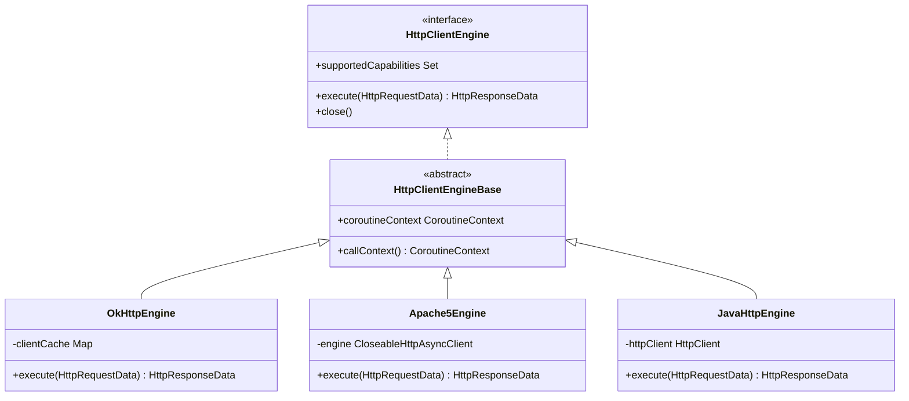
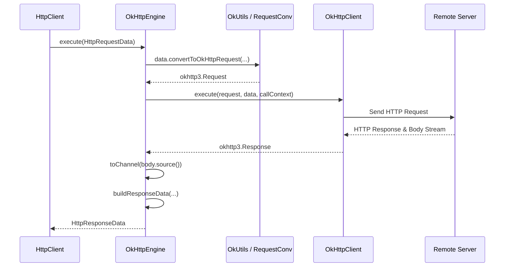
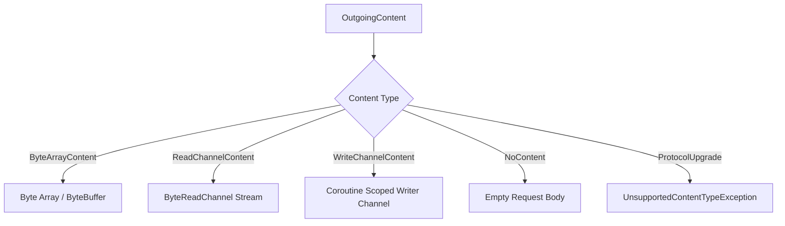

# JVM Client Engines

<details>
<summary>Relevant source files</summary>

The following files were used as context for generating this wiki page:

- [ktor-client/ktor-client-okhttp/jvm/src/io/ktor/client/engine/okhttp/OkHttpEngine.kt](https://github.com/ktorio/ktor/blob/main/ktor-client/ktor-client-okhttp/jvm/src/io/ktor/client/engine/okhttp/OkHttpEngine.kt)
- [ktor-client/ktor-client-apache5/jvm/src/io/ktor/client/engine/apache5/Apache5Engine.kt](https://github.com/ktorio/ktor/blob/main/ktor-client/ktor-client-apache5/jvm/src/io/ktor/client/engine/apache5/Apache5Engine.kt)
- [ktor-client/ktor-client-android/jvm/src/io/ktor/client/engine/android/AndroidClientEngine.kt](https://github.com/ktorio/ktor/blob/main/ktor-client/ktor-client-android/jvm/src/io/ktor/client/engine/android/AndroidClientEngine.kt)
- [ktor-client/ktor-client-java/jvm/src/io/ktor/client/engine/java/JavaHttpEngine.kt](https://github.com/ktorio/ktor/blob/main/ktor-client/ktor-client-java/jvm/src/io/ktor/client/engine/java/JavaHttpEngine.kt)
- [ktor-client/ktor-client-apache5/jvm/src/io/ktor/client/engine/apache5/ApacheRequestProducer.kt](https://github.com/ktorio/ktor/blob/main/ktor-client/ktor-client-apache5/jvm/src/io/ktor/client/engine/apache5/ApacheRequestProducer.kt)
- [ktor-client/ktor-client-winhttp/windows/src/io/ktor/client/engine/winhttp/WinHttpClientEngine.kt](https://github.com/ktorio/ktor/blob/main/ktor-client/ktor-client-winhttp/windows/src/io/ktor/client/engine/winhttp/WinHttpClientEngine.kt)
- [ktor-client/ktor-client-apache5/jvm/src/io/ktor/client/engine/apache5/ApacheHttpRequest.kt](https://github.com/ktorio/ktor/blob/main/ktor-client/ktor-client-apache5/jvm/src/io/ktor/client/engine/apache5/ApacheHttpRequest.kt)
- [ktor-client/ktor-client-apache5/jvm/src/io/ktor/client/engine/apache5/ApacheResponseConsumer.kt](https://github.com/ktorio/ktor/blob/main/ktor-client/ktor-client-apache5/jvm/src/io/ktor/client/engine/apache5/ApacheResponseConsumer.kt)
- [ktor-client/ktor-client-apache/jvm/src/io/ktor/client/engine/apache/ApacheEngine.kt](https://github.com/ktorio/ktor/blob/main/ktor-client/ktor-client-apache/jvm/src/io/ktor/client/engine/apache/ApacheEngine.kt)
- [ktor-client/ktor-client-apache/jvm/src/io/ktor/client/engine/apache/ApacheRequestProducer.kt](https://github.com/ktorio/ktor/blob/main/ktor-client/ktor-client-apache/jvm/src/io/ktor/client/engine/apache/ApacheRequestProducer.kt)
- [ktor-client/ktor-client-okhttp/jvm/src/io/ktor/client/engine/okhttp/OkUtils.kt](https://github.com/ktorio/ktor/blob/main/ktor-client/ktor-client-okhttp/jvm/src/io/ktor/client/engine/okhttp/OkUtils.kt)
- [ktor-client/ktor-client-apache/jvm/src/io/ktor/client/engine/apache/ApacheHttpRequest.kt](https://github.com/ktorio/ktor/blob/main/ktor-client/ktor-client-apache/jvm/src/io/ktor/client/engine/apache/ApacheHttpRequest.kt)
- [ktor-client/ktor-client-jetty-jakarta/jvm/src/io/ktor/client/engine/jetty/jakarta/JettyHttpRequest.kt](https://github.com/ktorio/ktor/blob/main/ktor-client/ktor-client-jetty-jakarta/jvm/src/io/ktor/client/engine/jetty/jakarta/JettyHttpRequest.kt)
- [ktor-client/ktor-client-java/jvm/src/io/ktor/client/engine/java/JavaHttpWebSocket.kt](https://github.com/ktorio/ktor/blob/main/ktor-client/ktor-client-java/jvm/src/io/ktor/client/engine/java/JavaHttpWebSocket.kt)
- [ktor-client/ktor-client-apache5/jvm/src/io/ktor/client/engine/apache5/Apache5.kt](https://github.com/ktorio/ktor/blob/main/ktor-client/ktor-client-apache5/jvm/src/io/ktor/client/engine/apache5/Apache5.kt)
- [ktor-client/ktor-client-jetty-jakarta/jvm/src/io/ktor/client/engine/jetty/jakarta/JettyHttp2Engine.kt](https://github.com/ktorio/ktor/blob/main/ktor-client/ktor-client-jetty-jakarta/jvm/src/io/ktor/client/engine/jetty/jakarta/JettyHttp2Engine.kt)
- [ktor-client/ktor-client-java/jvm/src/io/ktor/client/engine/java/JavaHttpResponse.kt](https://github.com/ktorio/ktor/blob/main/ktor-client/ktor-client-java/jvm/src/io/ktor/client/engine/java/JavaHttpResponse.kt)
- [ktor-client/ktor-client-jetty/jvm/src/io/ktor/client/engine/jetty/JettyHttp2Engine.kt](https://github.com/ktorio/ktor/blob/main/ktor-client/ktor-client-jetty/jvm/src/io/ktor/client/engine/jetty/JettyHttp2Engine.kt)
- [ktor-client/ktor-client-apache/jvm/src/io/ktor/client/engine/apache/Apache.kt](https://github.com/ktorio/ktor/blob/main/ktor-client/ktor-client-apache/jvm/src/io/ktor/client/engine/apache/Apache.kt)
- [ktor-client/ktor-client-okhttp/jvm/src/io/ktor/client/engine/okhttp/OkHttp.kt](https://github.com/ktorio/ktor/blob/main/ktor-client/ktor-client-okhttp/jvm/src/io/ktor/client/engine/okhttp/OkHttp.kt)
- [ktor-client/ktor-client-java/jvm/src/io/ktor/client/engine/java/Java.kt](https://github.com/ktorio/ktor/blob/main/ktor-client/ktor-client-java/jvm/src/io/ktor/client/engine/java/Java.kt)
- [ktor-client/ktor-client-jetty-jakarta/jvm/src/io/ktor/client/engine/jetty/jakarta/Jetty.kt](https://github.com/ktorio/ktor/blob/main/ktor-client/ktor-client-jetty-jakarta/jvm/src/io/ktor/client/engine/jetty/jakarta/Jetty.kt)
- [ktor-client/ktor-client-apache5/jvm/src/io/ktor/client/engine/apache5/Apache5EngineConfig.kt](https://github.com/ktorio/ktor/blob/main/ktor-client/ktor-client-apache5/jvm/src/io/ktor/client/engine/apache5/Apache5EngineConfig.kt)
- [ktor-client/ktor-client-android/jvm/src/io/ktor/client/engine/android/Android.kt](https://github.com/ktorio/ktor/blob/main/ktor-client/ktor-client-android/jvm/src/io/ktor/client/engine/android/Android.kt)
- [ktor-client/ktor-client-core/common/src/io/ktor/client/plugins/HttpTimeout.kt](https://github.com/ktorio/ktor/blob/main/ktor-client/ktor-client-core/common/src/io/ktor/client/plugins/HttpTimeout.kt)
- [ktor-client/ktor-client-core/common/src/io/ktor/client/request/HttpRequest.kt](https://github.com/ktorio/ktor/blob/main/ktor-client/ktor-client-core/common/src/io/ktor/client/request/HttpRequest.kt)
</details>

## Overview

### Overview Introduction
JVM Client Engines form the backend transport abstraction layer of the Ktor HTTP Client on Java Virtual Machine and Android platforms. They bridge Ktor’s high-level request pipeline (`HttpRequestData`) and platform-independent streaming abstractions (`ByteReadChannel`) with concrete underlying transport engines such as OkHttp, Apache HttpClient 5, Java 11's `HttpClient`, Jetty HTTP/2 client, and Android `HttpURLConnection`. 

By encapsulating platform-specific networking inside implementations of `HttpClientEngineBase` and `HttpClientEngineFactory`, these engines solve platform fragmentation and differing protocol paradigms. They translate Ktor data structures into engine-specific requests, manage coroutine-based execution contexts, handle proxy routing and connection caching, and map low-level blocking or asynchronous completion futures into idiomatic Kotlin coroutine suspension points.

Key architectural patterns across these engines include least-recently-used (LRU) client caching indexed by timeout parameters, streaming body producers that bridge non-blocking reactor callbacks or NIO buffers with Ktor I/O channels, and capability declarations (`HttpTimeoutCapability`, `WebSocketCapability`, `SSECapability`) that advertise supported engine features directly to client plugins.

Sources: [ktor-client/ktor-client-okhttp/jvm/src/io/ktor/client/engine/okhttp/OkHttpEngine.kt:30-33](https://github.com/ktorio/ktor/blob/main/ktor-client/ktor-client-okhttp/jvm/src/io/ktor/client/engine/okhttp/OkHttpEngine.kt#L30-L33)

Sources: [ktor-client/ktor-client-apache5/jvm/src/io/ktor/client/engine/apache5/Apache5Engine.kt:33-36](https://github.com/ktorio/ktor/blob/main/ktor-client/ktor-client-apache5/jvm/src/io/ktor/client/engine/apache5/Apache5Engine.kt#L33-L36)

Sources: [ktor-client/ktor-client-android/jvm/src/io/ktor/client/engine/android/AndroidClientEngine.kt:34-39](https://github.com/ktorio/ktor/blob/main/ktor-client/ktor-client-android/jvm/src/io/ktor/client/engine/android/AndroidClientEngine.kt#L34-L39)

Sources: [ktor-client/ktor-client-java/jvm/src/io/ktor/client/engine/java/JavaHttpEngine.kt:25-30](https://github.com/ktorio/ktor/blob/main/ktor-client/ktor-client-java/jvm/src/io/ktor/client/engine/java/JavaHttpEngine.kt:25-30)

---

## Architecture and Core Abstractions

### Engine Contracts and Factories
All JVM client engines inherit from `HttpClientEngineBase` and implement the `HttpClientEngine` interface. Engine selection is driven by factories implementing `HttpClientEngineFactory` (such as `OkHttp`, `Apache5`, `Java`, `Jetty`, and `Android`) paired with `HttpClientEngineContainer` implementations for service loading.



Engines declare their supported features using capabilities (`HttpClientEngineCapability`). For instance, `OkHttpEngine` supports `HttpTimeoutCapability`, `WebSocketCapability`, and `SSECapability`.

Sources: [ktor-client/ktor-client-okhttp/jvm/src/io/ktor/client/engine/okhttp/OkHttpEngine.kt:30-33](https://github.com/ktorio/ktor/blob/main/ktor-client/ktor-client-okhttp/jvm/src/io/ktor/client/engine/okhttp/OkHttpEngine.kt#L30-L33)

Sources: [ktor-client/ktor-client-apache5/jvm/src/io/ktor/client/engine/apache5/Apache5Engine.kt:33-36](https://github.com/ktorio/ktor/blob/main/ktor-client/ktor-client-apache5/jvm/src/io/ktor/client/engine/apache5/Apache5Engine.kt#L33-L36)

Sources: [ktor-client/ktor-client-java/jvm/src/io/ktor/client/engine/java/JavaHttpEngine.kt:25-30](https://github.com/ktorio/ktor/blob/main/ktor-client/ktor-client-java/jvm/src/io/ktor/client/engine/java/JavaHttpEngine.kt#L25-L30)

Sources: [ktor-client/ktor-client-apache/jvm/src/io/ktor/client/engine/apache/Apache.kt:49-53](https://github.com/ktorio/ktor/blob/main/ktor-client/ktor-client-apache/jvm/src/io/ktor/client/engine/apache/Apache.kt#L49-L53)

---

## Request Execution Flow and Call Chains

### Trace and Sequence
When an HTTP request executes in Ktor, it passes through the client pipeline and reaches the engine's `execute(data: HttpRequestData)` function. The exact call chain for processing an OkHttp request and handling Server-Sent Events or standard requests is traced as follows:
`OkHttpEngine.execute()` → `OkHttpEngine.executeWebSocketRequest()` (or `executeHttpRequest()`) → `OkHttpEngine.buildResponseData()` → `HttpRequest.adapt()` → `isSseReconnectionRequest()` (or `isSseRequest()`).



### Execution Steps
1. `OkHttpEngine.execute()` acquires the call context and converts `HttpRequestData` into an OkHttp `Request` object via `convertToOkHttpRequest()`.
2. The request engine is retrieved from `clientCache` using `data.getCapabilityOrNull(HttpTimeoutCapability)`.
3. Depending on whether `data.isUpgradeRequest()` is true, the request routes to `executeWebSocketRequest()` or `executeHttpRequest()`.
4. Response headers and status are parsed into Ktor types, and if response adapters are configured (such as `SSEClientResponseAdapter`), they inspect `isSseRequest()` and `isSseReconnectionRequest()` to wrap the channel into a client SSE session.

Sources: [ktor-client/ktor-client-okhttp/jvm/src/io/ktor/client/engine/okhttp/OkHttpEngine.kt:61-73](https://github.com/ktorio/ktor/blob/main/ktor-client/ktor-client-okhttp/jvm/src/io/ktor/client/engine/okhttp/OkHttpEngine.kt#L61-L73)

Sources: [ktor-client/ktor-client-okhttp/jvm/src/io/ktor/client/engine/okhttp/OkHttpEngine.kt:79-98](https://github.com/ktorio/ktor/blob/main/ktor-client/ktor-client-okhttp/jvm/src/io/ktor/client/engine/okhttp/OkHttpEngine.kt#L79-L98)

Sources: [ktor-client/ktor-client-okhttp/jvm/src/io/ktor/client/engine/okhttp/OkHttpEngine.kt:99-114](https://github.com/ktorio/ktor/blob/main/ktor-client/ktor-client-okhttp/jvm/src/io/ktor/client/engine/okhttp/OkHttpEngine.kt#L99-L114)

Sources: [ktor-client/ktor-client-core/common/src/io/ktor/client/request/HttpRequest.kt:385-397](https://github.com/ktorio/ktor/blob/main/ktor-client/ktor-client-core/common/src/io/ktor/client/request/HttpRequest.kt#L385-L397)

---

## Supported JVM Engines and Comparison

### Built-in Engine Implementations
Ktor offers several backends suited for different runtime environments, target SDKs, and performance profiles.

| Engine Factory | Underlying Library | Default Protocol | Supported Capabilities | Key Characteristics |
| :--- | :--- | :--- | :--- | :--- |
| `OkHttp` | OkHttp 3/4 | HTTP/1.1, HTTP/2, HTTP/3 | HttpTimeout, WebSocket, SSE | Highly optimized for Android and JVM; supports connection pooling and duplex streaming. |
| `Apache5` | Apache HttpComponents 5.x | HTTP/1.1, HTTP/2 | HttpTimeout, SSE | Asynchronous I/O reactor based; strict header handling and advanced connection manager tuning. |
| `Apache` | Apache HttpComponents 4.x | HTTP/1.1 | HttpTimeout, SSE | Legacy 4.x engine. **Deprecated** in favor of `Apache5`. |
| `Java` | JDK 11 `java.net.http.HttpClient` | HTTP/1.1, HTTP/2 | HttpTimeout, WebSocket, SSE | Zero external runtime dependencies on modern JVMs; uses asynchronous CompletableFutures. |
| `Jetty` | Eclipse Jetty HTTP/2 Client | HTTP/2 | HttpTimeout | Specialized HTTP/2 engine supporting direct multiplexed stream execution. |
| `Android` | `HttpURLConnection` | HTTP/1.1 | HttpTimeout, SSE | Standard Android platform engine for legacy support (Android 1.x+); blocking I/O wrapped in coroutines. |

> [!WARNING]
> The legacy `Apache` engine (HttpComponents 4.x) is deprecated. Developers should migrate to `Apache5` for security updates, improved asynchronous performance, and modern HTTP/2 support.

Sources: [ktor-client/ktor-client-okhttp/jvm/src/io/ktor/client/engine/okhttp/OkHttpEngine.kt:31-32](https://github.com/ktorio/ktor/blob/main/ktor-client/ktor-client-okhttp/jvm/src/io/ktor/client/engine/okhttp/OkHttpEngine.kt#L31-L32)

Sources: [ktor-client/ktor-client-apache5/jvm/src/io/ktor/client/engine/apache5/Apache5Engine.kt:33-35](https://github.com/ktorio/ktor/blob/main/ktor-client/ktor-client-apache5/jvm/src/io/ktor/client/engine/apache5/Apache5Engine.kt#L33-L35)

Sources: [ktor-client/ktor-client-android/jvm/src/io/ktor/client/engine/android/AndroidClientEngine.kt:34-39](https://github.com/ktorio/ktor/blob/main/ktor-client/ktor-client-android/jvm/src/io/ktor/client/engine/android/AndroidClientEngine.kt#L34-L39)

Sources: [ktor-client/ktor-client-java/jvm/src/io/ktor/client/engine/java/JavaHttpEngine.kt:25-30](https://github.com/ktorio/ktor/blob/main/ktor-client/ktor-client-java/jvm/src/io/ktor/client/engine/java/JavaHttpEngine.kt#L25-L30)

---

## Configuration and Timeout Management

### Timeout Parameters and Setup
Timeout configurations are managed via the `HttpTimeout` plugin and propagated through `HttpTimeoutCapability`. Engines extract connect, socket (read/write), and request timeouts from `HttpTimeoutConfig`.

```kotlin
val client = HttpClient(OkHttp) {
    install(HttpTimeout) {
        requestTimeoutMillis = 15_000
        connectTimeoutMillis = 10_000
        socketTimeoutMillis = 10_000
    }
    engine {
        clientCacheSize = 20
    }
}
```

> [!IMPORTANT]
> When using the `Java` engine, Ktor inspects and updates the JDK system property `jdk.httpclient.allowRestrictedHeaders` at class-load time to ensure user-supplied `Host` headers are accepted by `java.net.http.HttpClient`.

Sources: [ktor-client/ktor-client-okhttp/jvm/src/io/ktor/client/engine/okhttp/OkHttpEngine.kt:149-162](https://github.com/ktorio/ktor/blob/main/ktor-client/ktor-client-okhttp/jvm/src/io/ktor/client/engine/okhttp/OkHttpEngine.kt#L149-L162)

Sources: [ktor-client/ktor-client-apache5/jvm/src/io/ktor/client/engine/apache5/Apache5EngineConfig.kt:20-57](https://github.com/ktorio/ktor/blob/main/ktor-client/ktor-client-apache5/jvm/src/io/ktor/client/engine/apache5/Apache5EngineConfig.kt#L20-L57)

Sources: [ktor-client/ktor-client-java/jvm/src/io/ktor/client/engine/java/Java.kt:30-50](https://github.com/ktorio/ktor/blob/main/ktor-client/ktor-client-java/jvm/src/io/ktor/client/engine/java/Java.kt#L30-L50)

Sources: [ktor-client/ktor-client-okhttp/jvm/src/io/ktor/client/engine/okhttp/OkHttp.kt:31-34](https://github.com/ktorio/ktor/blob/main/ktor-client/ktor-client-okhttp/jvm/src/io/ktor/client/engine/okhttp/OkHttp.kt#L31-L34)

---

## Request Body Streaming and Response Processing

### Body Types and Flow
Engines handle outgoing request bodies (`OutgoingContent`) by translating them into transport-specific entities.



### Streaming Mechanism
- **`ReadChannelContent`**: Exposes a `ByteReadChannel` that engines read incrementally (e.g., Apache's `ApacheRequestEntityProducer` reads buffers into `ByteBuffer` chunks and writes them to the `DataStreamChannel`).
- **`WriteChannelContent`**: Launches a coroutine builder via `GlobalScope.writer` that allows producers to write into a `ByteWriteChannel` while the engine consumes from the corresponding read channel asynchronously.

Sources: [ktor-client/ktor-client-okhttp/jvm/src/io/ktor/client/engine/okhttp/OkHttpEngine.kt:211-243](https://github.com/ktorio/ktor/blob/main/ktor-client/ktor-client-okhttp/jvm/src/io/ktor/client/engine/okhttp/OkHttpEngine.kt#L211-L243)

Sources: [ktor-client/ktor-client-apache5/jvm/src/io/ktor/client/engine/apache5/ApacheRequestProducer.kt:82-111](https://github.com/ktorio/ktor/blob/main/ktor-client/ktor-client-apache5/jvm/src/io/ktor/client/engine/apache5/ApacheRequestProducer.kt#L82-L111)

---

## Error Mapping and Exception Handling

### Exception Normalization
Network and transport exceptions thrown by underlying libraries are caught by engine integration layers and mapped to Ktor's common exception hierarchy.

- **`ConnectTimeoutException`**: Triggered when connection establishment exceeds configured limits (mapped from `java.net.ConnectException` matching timeout criteria or `org.apache.hc.client5.http.ConnectTimeoutException`).
- **`SocketTimeoutException`**: Triggered during read/write inactivity between packets (mapped from `java.net.SocketTimeoutException`).

```kotlin
internal fun mapCause(exception: Exception, requestData: HttpRequestData): Exception = when (exception) {
    is ConnectTimeoutException -> ConnectTimeoutException(requestData, exception)
    is ConnectException if exception.isTimeoutException() -> ConnectTimeoutException(requestData, exception)
    is SocketTimeoutException -> SocketTimeoutException(requestData, exception)
    else -> exception
}
```

> [!CAUTION]
> In `ApacheResponseConsumer`, incoming buffer chunks (`consume(src: ByteBuffer)`) are silently ignored if the channel is closed for write. Throwing an `IOException` mid-stream forces Apache into an error-recovery path that can corrupt connection pool state or trigger `RejectedExecutionException` on shutdown schedulers.

Sources: [ktor-client/ktor-client-apache5/jvm/src/io/ktor/client/engine/apache5/ApacheHttpRequest.kt:73-78](https://github.com/ktorio/ktor/blob/main/ktor-client/ktor-client-apache5/jvm/src/io/ktor/client/engine/apache5/ApacheHttpRequest.kt#L73-L78)

Sources: [ktor-client/ktor-client-apache5/jvm/src/io/ktor/client/engine/apache5/ApacheResponseConsumer.kt:140-147](https://github.com/ktorio/ktor/blob/main/ktor-client/ktor-client-apache5/jvm/src/io/ktor/client/engine/apache5/ApacheResponseConsumer.kt#L140-L147)

Sources: [ktor-client/ktor-client-okhttp/jvm/src/io/ktor/client/engine/okhttp/OkUtils.kt:80-94](https://github.com/ktorio/ktor/blob/main/ktor-client/ktor-client-okhttp/jvm/src/io/ktor/client/engine/okhttp/OkUtils.kt#L80-L94)

---

## Design Trade-offs

| Design Choice | Benefit | Cost |
| :--- | :--- | :--- |
| **LRU Client Caching** (OkHttp, Jetty) | Reuses connection pools across requests with identical timeout configurations. | Cache misses or frequent timeout variations recreate client instances, incurring initialization overhead. |
| **Callback-to-Coroutine Suspension** (`suspendCancellableCoroutine`) | Integrates asynchronous callback APIs seamlessly into Kotlin coroutines. | Requires careful cleanup and handler binding to prevent coroutine leaks on cancellation. |
| **Asynchronous NIO Reactor** (Apache 5.x) | High throughput and non-blocking I/O multiplexing for heavy concurrent workloads. | More complex thread-safety and resource lifecycle management (`CloseMode.IMMEDIATE`). |
| **JDK 11 Native Client** (`java.net.http`) | Zero external dependencies; leverages optimized JDK internal HTTP/2 transport. | Restricted to Java 11+ runtime environments. |

Sources: [ktor-client/ktor-client-okhttp/jvm/src/io/ktor/client/engine/okhttp/OkHttpEngine.kt:39-41](https://github.com/ktorio/ktor/blob/main/ktor-client/ktor-client-okhttp/jvm/src/io/ktor/client/engine/okhttp/OkHttpEngine.kt#L39-L41)

Sources: [ktor-client/ktor-client-apache5/jvm/src/io/ktor/client/engine/apache5/Apache5Engine.kt:49-55](https://github.com/ktorio/ktor/blob/main/ktor-client/ktor-client-apache5/jvm/src/io/ktor/client/engine/apache5/Apache5Engine.kt#L49-L55)

Sources: [ktor-client/ktor-client-java/jvm/src/io/ktor/client/engine/java/JavaHttpEngine.kt:59-78](https://github.com/ktorio/ktor/blob/main/ktor-client/ktor-client-java/jvm/src/io/ktor/client/engine/java/JavaHttpEngine.kt#L59-L78)

## Related

- [[Client Core]]

