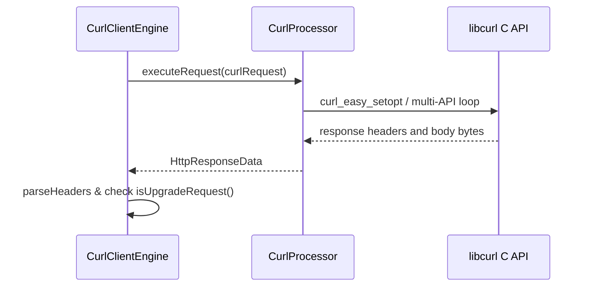
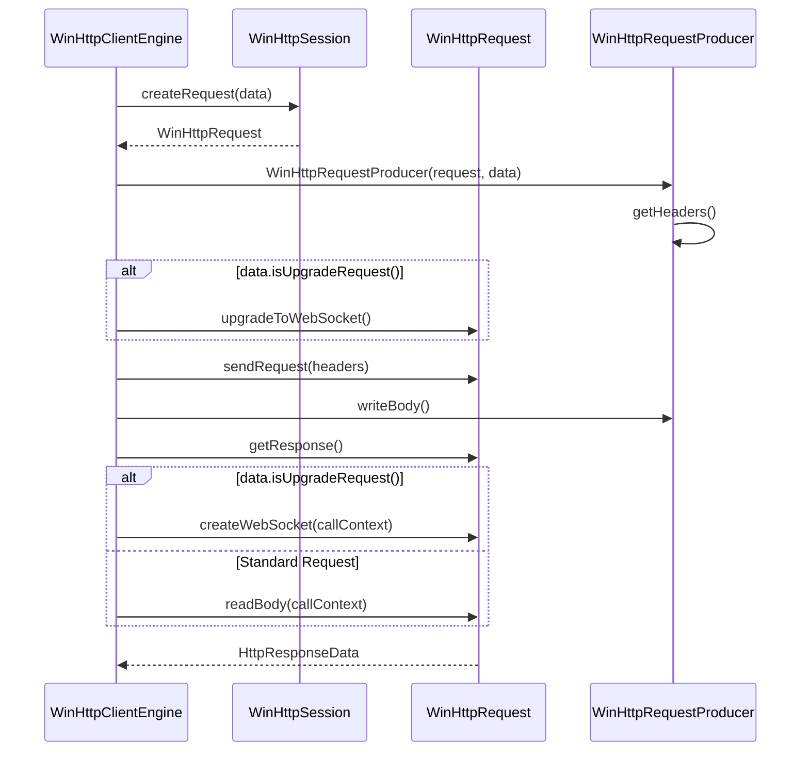
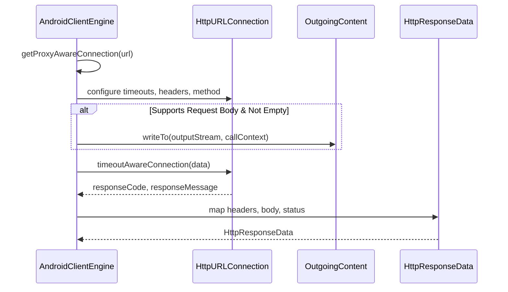

# Native Client Engines

<details>
<summary>Relevant source files</summary>

The following files were used as context for generating this wiki page:

- [ktor-client/ktor-client-curl/desktop/interop/include/curl/system.h](https://github.com/ktorio/ktor/blob/main/ktor-client/ktor-client-curl/desktop/interop/include/curl/system.h)
- [ktor-client/ktor-client-android/jvm/src/io/ktor/client/engine/android/AndroidClientEngine.kt](https://github.com/ktorio/ktor/blob/main/ktor-client/ktor-client-android/jvm/src/io/ktor/client/engine/android/AndroidClientEngine.kt)
- [ktor-client/ktor-client-winhttp/windows/src/io/ktor/client/engine/winhttp/WinHttpClientEngine.kt](https://github.com/ktorio/ktor/blob/main/ktor-client/ktor-client-winhttp/windows/src/io/ktor/client/engine/winhttp/WinHttpClientEngine.kt)
- [ktor-client/ktor-client-curl/desktop/src/io/ktor/client/engine/curl/CurlClientEngine.kt](https://github.com/ktorio/ktor/blob/main/ktor-client/ktor-client-curl/desktop/src/io/ktor/client/engine/curl/CurlClientEngine.kt)
- [ktor-client/ktor-client-darwin/darwin/src/io/ktor/client/engine/darwin/internal/DarwinSession.kt](https://github.com/ktorio/ktor/blob/main/ktor-client/ktor-client-darwin/darwin/src/io/ktor/client/engine/darwin/internal/DarwinSession.kt)
- [ktor-client/ktor-client-curl/desktop/interop/include/curl/curl.h](https://github.com/ktorio/ktor/blob/main/ktor-client/ktor-client-curl/desktop/interop/include/curl/curl.h)
- [ktor-client/ktor-client-webrtc/ios/src/io/ktor/client/webrtc/Engine.kt](https://github.com/ktorio/ktor/blob/main/ktor-client/ktor-client-webrtc/ios/src/io/ktor/client/webrtc/Engine.kt)
- [ktor-client/ktor-client-darwin-legacy/darwin/src/io/ktor/client/engine/darwin/internal/legacy/DarwinLegacySession.kt](https://github.com/ktorio/ktor/blob/main/ktor-client/ktor-client-darwin-legacy/darwin/src/io/ktor/client/engine/darwin/internal/legacy/DarwinLegacySession.kt)
- [ktor-client/ktor-client-darwin-legacy/darwin/src/io/ktor/client/engine/darwin/DarwinLegacyClientEngineConfig.kt](https://github.com/ktorio/ktor/blob/main/ktor-client/ktor-client-darwin-legacy/darwin/src/io/ktor/client/engine/darwin/DarwinLegacyClientEngineConfig.kt)
- [ktor-client/ktor-client-darwin/darwin/src/io/ktor/client/engine/darwin/Darwin.kt](https://github.com/ktorio/ktor/blob/main/ktor-client/ktor-client-darwin/darwin/src/io/ktor/client/engine/darwin/Darwin.kt)
- [ktor-client/ktor-client-darwin/darwin/src/io/ktor/client/engine/darwin/DarwinClientEngine.kt](https://github.com/ktorio/ktor/blob/main/ktor-client/ktor-client-darwin/darwin/src/io/ktor/client/engine/darwin/DarwinClientEngine.kt)
- [ktor-client/ktor-client-darwin/darwin/src/io/ktor/client/engine/darwin/internal/DarwinWebsocketSession.kt](https://github.com/ktorio/ktor/blob/main/ktor-client/ktor-client-darwin/darwin/src/io/ktor/client/engine/darwin/internal/DarwinWebsocketSession.kt)
- [ktor-client/ktor-client-darwin-legacy/darwin/src/io/ktor/client/engine/darwin/DarwinLegacyClientEngine.kt](https://github.com/ktorio/ktor/blob/main/ktor-client/ktor-client-darwin-legacy/darwin/src/io/ktor/client/engine/darwin/DarwinLegacyClientEngine.kt)
</details>

## Overview

Native client engines in Ktor provide platform-specific implementations that bridge high-level HTTP requests and WebSocket communications directly to underlying operating system APIs and native networking libraries. By bypassing generic runtimes in favor of platform-optimized network stacks—such as `NSURLSession` on Apple platforms, `WinHttp` on Windows, `libcurl` on desktop targets, and `HttpURLConnection` on Android—these engines maximize performance, integrate seamlessly with native security settings, and support advanced protocol capabilities like timeouts and server-sent events. 

Sources: [ktor-client/ktor-client-android/jvm/src/io/ktor/client/engine/android/AndroidClientEngine.kt:34-41](https://github.com/ktorio/ktor/blob/main/ktor-client/ktor-client-android/jvm/src/io/ktor/client/engine/android/AndroidClientEngine.kt#L34-L41), [ktor-client/ktor-client-winhttp/windows/src/io/ktor/client/engine/winhttp/WinHttpClientEngine.kt:17-24](https://github.com/ktorio/ktor/blob/main/ktor-client/ktor-client-winhttp/windows/src/io/ktor/client/engine/winhttp/WinHttpClientEngine.kt#L17-L24), [ktor-client/ktor-client-curl/desktop/src/io/ktor/client/engine/curl/CurlClientEngine.kt:20-26](https://github.com/ktorio/ktor/blob/main/ktor-client/ktor-client-curl/desktop/src/io/ktor/client/engine/curl/CurlClientEngine.kt#L20-L26), [ktor-client/ktor-client-darwin/darwin/src/io/ktor/client/engine/darwin/DarwinClientEngine.kt:17-26](https://github.com/ktorio/ktor/blob/main/ktor-client/ktor-client-darwin/darwin/src/io/ktor/client/engine/darwin/DarwinClientEngine.kt#L17-L26), [ktor-client/ktor-client-darwin-legacy/darwin/src/io/ktor/client/engine/darwin/DarwinLegacyClientEngine.kt:16-26](https://github.com/ktorio/ktor/blob/main/ktor-client/ktor-client-darwin-legacy/darwin/src/io/ktor/client/engine/darwin/DarwinLegacyClientEngine.kt#L16-L26)

## Darwin Session and Engine Architecture

### Overview

The modern Darwin engine implementation anchors on `DarwinClientEngine`, an HTTP client engine targeting Darwin-based operating systems (`macOS`, `iOS`, `tvOS`) by mapping requests and WebSocket sessions directly onto Foundation's `NSURLSession`. The factory object `Darwin` initializes the engine via `HttpClientEngineFactory<DarwinClientEngineConfig>`, registering itself in the global engines list. 

Sources: [ktor-client/ktor-client-darwin/darwin/src/io/ktor/client/engine/darwin/Darwin.kt:15-44](https://github.com/ktorio/ktor/blob/main/ktor-client/ktor-client-darwin/darwin/src/io/ktor/client/engine/darwin/Darwin.kt#L15-L44)

During initialization, `DarwinClientEngine` inspects `NSOperationQueue.currentQueue()` to establish a safe request queue: if executing on `NSOperationQueue.mainQueue`, a fresh `NSOperationQueue()` is instantiated to prevent deadlocks on the main thread; otherwise, the current queue is reused. The engine declares supported capabilities including `HttpTimeoutCapability`, `WebSocketCapability`, and `SSECapability`. 

Sources: [ktor-client/ktor-client-darwin/darwin/src/io/ktor/client/engine/darwin/DarwinClientEngine.kt:17-25](https://github.com/ktorio/ktor/blob/main/ktor-client/ktor-client-darwin/darwin/src/io/ktor/client/engine/darwin/DarwinClientEngine.kt#L17-L25)

### Session Management and Request Execution

`DarwinSession` manages the lifecycle of the underlying `NSURLSession` and its delegate. If a custom session is not provided through configuration, `createSession` builds an `NSURLSessionConfiguration.defaultSessionConfiguration()`, clears any default cookie storage via `setHTTPCookieStorage(null)`, applies proxy settings, and registers a `KtorNSURLSessionDelegate` bound to an optional delegate queue. 

Sources: [ktor-client/ktor-client-darwin/darwin/src/io/ktor/client/engine/darwin/internal/DarwinSession.kt:24-33](https://github.com/ktorio/ktor/blob/main/ktor-client/ktor-client-darwin/darwin/src/io/ktor/client/engine/darwin/internal/DarwinSession.kt#L24-L33), [ktor-client/ktor-client-darwin/darwin/src/io/ktor/client/engine/darwin/internal/DarwinSession.kt:86-104](https://github.com/ktorio/ktor/blob/main/ktor-client/ktor-client-darwin/darwin/src/io/ktor/client/engine/darwin/internal/DarwinSession.kt#L86-L104)

Request execution follows a strict call-chain: `DarwinClientEngine.execute(data)` calls `session.execute(data, callContext)`, which converts the Ktor request via `request.toNSUrlRequest().apply(config.requestConfig)`. Depending on whether `request.isUpgradeRequest()` evaluates to true, the execution branches to create either a WebSocket task (`webSocketTaskWithRequest`) or a standard data task (`dataTaskWithRequest`), coordinates reading via the delegate, registers cancellation handlers on completion, resumes the task, and awaits the response deferred object. 

Sources: [ktor-client/ktor-client-darwin/darwin/src/io/ktor/client/engine/darwin/DarwinClientEngine.kt:28-31](https://github.com/ktorio/ktor/blob/main/ktor-client/ktor-client-darwin/darwin/src/io/ktor/client/engine/darwin/DarwinClientEngine.kt#L28-L31), [ktor-client/ktor-client-darwin/darwin/src/io/ktor/client/engine/darwin/internal/DarwinSession.kt:35-63](https://github.com/ktorio/ktor/blob/main/ktor-client/ktor-client-darwin/darwin/src/io/ktor/client/engine/darwin/internal/DarwinSession.kt#L35-L63)

> [!NOTE]
> If a request throws an exception during `response.await()`, `DarwinSession` checks if `task.state == NSURLSessionTaskStateRunning` and cancels the task immediately before propagating the throwable. 
> Sources: [ktor-client/ktor-client-darwin/darwin/src/io/ktor/client/engine/darwin/internal/DarwinSession.kt:57-62](https://github.com/ktorio/ktor/blob/main/ktor-client/ktor-client-darwin/darwin/src/io/ktor/client/engine/darwin/internal/DarwinSession.kt#L57-L62)

### WebSocket Session Implementation

`DarwinWebsocketSession` implements `WebSocketSession`, wrapping `NSURLSessionWebSocketTask` to manage incoming and outgoing frame channels. Masking is forced to `true`, while `maxFrameSize` delegates directly to `task.maximumMessageSize`. 

Sources: [ktor-client/ktor-client-darwin/darwin/src/io/ktor/client/engine/darwin/internal/DarwinWebsocketSession.kt:31-62](https://github.com/ktorio/ktor/blob/main/ktor-client/ktor-client-darwin/darwin/src/io/ktor/client/engine/darwin/internal/DarwinWebsocketSession.kt#L31-L62)

Upon initialization, background coroutines launch to drive `receiveMessages()` and `sendMessages()`. Incoming messages parse `NSURLSessionWebSocketMessageTypeData` into `Frame.Binary` and `NSURLSessionWebSocketMessageTypeString` into `Frame.Text`. Outgoing frames handle text, binary, close, and ping/pong types, mapping errors through `convertWebsocketError(error)`. 

Sources: [ktor-client/ktor-client-darwin/darwin/src/io/ktor/client/engine/darwin/internal/DarwinWebsocketSession.kt:66-166](https://github.com/ktorio/ktor/blob/main/ktor-client/ktor-client-darwin/darwin/src/io/ktor/client/engine/darwin/internal/DarwinWebsocketSession.kt#L66-L166)

| Frame Type | Handling Mechanism in `sendMessages()` | Sources |
| :--- | :--- | :--- |
| `FrameType.TEXT` | Sends string message via `task.sendMessage` inside `suspendCancellableCoroutine` | [ktor-client/ktor-client-darwin/darwin/src/io/ktor/client/engine/darwin/internal/DarwinWebsocketSession.kt:110-128](https://github.com/ktorio/ktor/blob/main/ktor-client/ktor-client-darwin/darwin/src/io/ktor/client/engine/darwin/internal/DarwinWebsocketSession.kt#L110-L128) |
| `FrameType.BINARY` | Converts frame data to `NSData` and sends via `task.sendMessage` | [ktor-client/ktor-client-darwin/darwin/src/io/ktor/client/engine/darwin/internal/DarwinWebsocketSession.kt:130-140](https://github.com/ktorio/ktor/blob/main/ktor-client/ktor-client-darwin/darwin/src/io/ktor/client/engine/darwin/internal/DarwinWebsocketSession.kt#L130-L140) |
| `FrameType.CLOSE` | Reads close code and reason packet, then invokes `task.cancelWithCloseCode` | [ktor-client/ktor-client-darwin/darwin/src/io/ktor/client/engine/darwin/internal/DarwinWebsocketSession.kt:142-148](https://github.com/ktorio/ktor/blob/main/ktor-client/ktor-client-darwin/darwin/src/io/ktor/client/engine/darwin/internal/DarwinWebsocketSession.kt#L142-L148) |
| `FrameType.PING` | Sends ping via `task.sendPingWithPongReceiveHandler` and schedules pong response | [ktor-client/ktor-client-darwin/darwin/src/io/ktor/client/engine/darwin/internal/DarwinWebsocketSession.kt:150-159](https://github.com/ktorio/ktor/blob/main/ktor-client/ktor-client-darwin/darwin/src/io/ktor/client/engine/darwin/internal/DarwinWebsocketSession.kt#L150-L159) |

Sources: [ktor-client/ktor-client-darwin/darwin/src/io/ktor/client/engine/darwin/internal/DarwinWebsocketSession.kt:108-165](https://github.com/ktorio/ktor/blob/main/ktor-client/ktor-client-darwin/darwin/src/io/ktor/client/engine/darwin/internal/DarwinWebsocketSession.kt#L108-L165)

## Legacy Darwin Engine and Configuration

### Overview

`DarwinLegacyClientEngine` implements the deprecated legacy Darwin client engine using `DarwinLegacySession` and `DarwinLegacyClientEngineConfig`. The engine evaluates request queues via `NSOperationQueue.currentQueue()`, falling back to a new `NSOperationQueue` if running on the main queue, and advertises `HttpTimeoutCapability` and `SSECapability` as supported capabilities. 

Sources: [ktor-client/ktor-client-darwin-legacy/darwin/src/io/ktor/client/engine/darwin/DarwinLegacyClientEngine.kt:16-28](https://github.com/ktorio/ktor/blob/main/ktor-client/ktor-client-darwin-legacy/darwin/src/io/ktor/client/engine/darwin/DarwinLegacyClientEngine.kt#L16-L28)

### Execution Walkthrough and Session Lifecycle

The request execution pipeline follows a precise series of method invocations within `DarwinLegacySession`:

1. `DarwinLegacySession.execute()` translates an `HttpRequestData` into an `NSMutableURLRequest` via `request.toNSUrlRequest()`, applying `config.requestConfig`. 
   Sources: [ktor-client/ktor-client-darwin-legacy/darwin/src/io/ktor/client/engine/darwin/internal/legacy/DarwinLegacySession.kt:36-38](https://github.com/ktorio/ktor/blob/main/ktor-client/ktor-client-darwin-legacy/darwin/src/io/ktor/client/engine/darwin/internal/legacy/DarwinLegacySession.kt#L36-L38)
2. `withSession` checks closure state and locks `sessionLock` to call `dataTaskWithRequest(nativeRequest)` on the underlying `NSURLSession`. 
   Sources: [ktor-client/ktor-client-darwin-legacy/darwin/src/io/ktor/client/engine/darwin/internal/legacy/DarwinLegacySession.kt:39](https://github.com/ktorio/ktor/blob/main/ktor-client/ktor-client-darwin-legacy/darwin/src/io/ktor/client/engine/darwin/internal/legacy/DarwinLegacySession.kt#L39)
3. `delegate.read(request, callContext, task)` is invoked to set up response reading. 
   Sources: [ktor-client/ktor-client-darwin-legacy/darwin/src/io/ktor/client/engine/darwin/internal/legacy/DarwinLegacySession.kt:40](https://github.com/ktorio/ktor/blob/main/ktor-client/ktor-client-darwin-legacy/darwin/src/io/ktor/client/engine/darwin/internal/legacy/DarwinLegacySession.kt#L40)
4. `callContext.job.invokeOnCompletion` registers a completion handler that triggers `task.cancel()` if an exception occurs. 
   Sources: [ktor-client/ktor-client-darwin-legacy/darwin/src/io/ktor/client/engine/darwin/internal/legacy/DarwinLegacySession.kt:42-46](https://github.com/ktorio/ktor/blob/main/ktor-client/ktor-client-darwin-legacy/darwin/src/io/ktor/client/engine/darwin/internal/legacy/DarwinLegacySession.kt#L42-L46)
5. `task.resume()` starts the network task, after which `response.await()` awaits the completion deferred result. 
   Sources: [ktor-client/ktor-client-darwin-legacy/darwin/src/io/ktor/client/engine/darwin/internal/legacy/DarwinLegacySession.kt:48-51](https://github.com/ktorio/ktor/blob/main/ktor-client/ktor-client-darwin-legacy/darwin/src/io/ktor/client/engine/darwin/internal/legacy/DarwinLegacySession.kt#L48-L51)

> [!WARNING]
> If `response.await()` throws an exception, `DarwinLegacySession` checks if `task.state == NSURLSessionTaskStateRunning` and immediately invokes `task.cancel()` before rethrowing the cause. 
> Sources: [ktor-client/ktor-client-darwin-legacy/darwin/src/io/ktor/client/engine/darwin/internal/legacy/DarwinLegacySession.kt:52-55](https://github.com/ktorio/ktor/blob/main/ktor-client/ktor-client-darwin-legacy/darwin/src/io/ktor/client/engine/darwin/internal/legacy/DarwinLegacySession.kt#L52-L55)

Session closure is guarded by an atomic boolean flag and `sessionLock`, invoking `session.finishTasksAndInvalidate()` upon the first transition to closed state. 
Sources: [ktor-client/ktor-client-darwin-legacy/darwin/src/io/ktor/client/engine/darwin/internal/legacy/DarwinLegacySession.kt:66-72](https://github.com/ktorio/ktor/blob/main/ktor-client/ktor-client-darwin-legacy/darwin/src/io/ktor/client/engine/darwin/internal/legacy/DarwinLegacySession.kt#L66-L72)

### Configuration Properties and Deprecations

`DarwinLegacyClientEngineConfig` manages request configurations, session setups, and authentication challenges, carrying warnings and errors for deprecated properties. 
Sources: [ktor-client/ktor-client-darwin-legacy/darwin/src/io/ktor/client/engine/darwin/DarwinLegacyClientEngineConfig.kt:29-72](https://github.com/ktorio/ktor/blob/main/ktor-client/ktor-client-darwin-legacy/darwin/src/io/ktor/client/engine/darwin/DarwinLegacyClientEngineConfig.kt#L29-L72)

| Property / Method | Type / Signature | Default / Behavior | Sources |
| :--- | :--- | :--- | :--- |
| `requestConfig` | `NSMutableURLRequest.() -> Unit` | `{}` (Error when set directly; use `configureRequest`) | [ktor-client/ktor-client-darwin-legacy/darwin/src/io/ktor/client/engine/darwin/DarwinLegacyClientEngineConfig.kt:43-49](https://github.com/ktorio/ktor/blob/main/ktor-client/ktor-client-darwin-legacy/darwin/src/io/ktor/client/engine/darwin/DarwinLegacyClientEngineConfig.kt#L43-L49) |
| `sessionConfig` | `NSURLSessionConfiguration.() -> Unit` | `{}` (Error when set directly; use `configureSession`) | [ktor-client/ktor-client-darwin-legacy/darwin/src/io/ktor/client/engine/darwin/DarwinLegacyClientEngineConfig.kt:56-62](https://github.com/ktorio/ktor/blob/main/ktor-client/ktor-client-darwin-legacy/darwin/src/io/ktor/client/engine/darwin/DarwinLegacyClientEngineConfig.kt#L56-L62) |
| `challengeHandler` | `ChallengeHandler?` | `null` | [ktor-client/ktor-client-darwin-legacy/darwin/src/io/ktor/client/engine/darwin/DarwinLegacyClientEngineConfig.kt:69-71](https://github.com/ktorio/ktor/blob/main/ktor-client/ktor-client-darwin-legacy/darwin/src/io/ktor/client/engine/darwin/DarwinLegacyClientEngineConfig.kt#L69-L71) |
| `preconfiguredSession` | `NSURLSession?` | `null` | [ktor-client/ktor-client-darwin-legacy/darwin/src/io/ktor/client/engine/darwin/DarwinLegacyClientEngineConfig.kt:78-80](https://github.com/ktorio/ktor/blob/main/ktor-client/ktor-client-darwin-legacy/darwin/src/io/ktor/client/engine/darwin/DarwinLegacyClientEngineConfig.kt#L78-L80) |
| `configureRequest` | `(NSMutableURLRequest.() -> Unit) -> Unit` | Chains new block onto existing `requestConfig` | [ktor-client/ktor-client-darwin-legacy/darwin/src/io/ktor/client/engine/darwin/DarwinLegacyClientEngineConfig.kt:92-100](https://github.com/ktorio/ktor/blob/main/ktor-client/ktor-client-darwin-legacy/darwin/src/io/ktor/client/engine/darwin/DarwinLegacyClientEngineConfig.kt#L92-L100) |
| `configureSession` | `(NSURLSessionConfiguration.() -> Unit) -> Unit` | Chains new block onto existing `sessionConfig` | [ktor-client/ktor-client-darwin-legacy/darwin/src/io/ktor/client/engine/darwin/DarwinLegacyClientEngineConfig.kt:107-115](https://github.com/ktorio/ktor/blob/main/ktor-client/ktor-client-darwin-legacy/darwin/src/io/ktor/client/engine/darwin/DarwinLegacyClientEngineConfig.kt#L107-L115) |
| `usePreconfiguredSession` | `(NSURLSession, KtorLegacyNSURLSessionDelegate) -> Unit` | Assigns session and delegate pair to `sessionAndDelegate` | [ktor-client/ktor-client-darwin-legacy/darwin/src/io/ktor/client/engine/darwin/DarwinLegacyClientEngineConfig.kt:138-141](https://github.com/ktorio/ktor/blob/main/ktor-client/ktor-client-darwin-legacy/darwin/src/io/ktor/client/engine/darwin/DarwinLegacyClientEngineConfig.kt#L138-L141) |
| `handleChallenge` | `(ChallengeHandler) -> Unit` | Sets `challengeHandler` | [ktor-client/ktor-client-darwin-legacy/darwin/src/io/ktor/client/engine/darwin/DarwinLegacyClientEngineConfig.kt:148-151](https://github.com/ktorio/ktor/blob/main/ktor-client/ktor-client-darwin-legacy/darwin/src/io/ktor/client/engine/darwin/DarwinLegacyClientEngineConfig.kt#L148-L151) |

Sources: [ktor-client/ktor-client-darwin-legacy/darwin/src/io/ktor/client/engine/darwin/DarwinLegacyClientEngineConfig.kt:43-151](https://github.com/ktorio/ktor/blob/main/ktor-client/ktor-client-darwin-legacy/darwin/src/io/ktor/client/engine/darwin/DarwinLegacyClientEngineConfig.kt#L43-L151)

## Desktop Libcurl C Interop Engine

### Overview

`CurlClientEngine` implements the Ktor HTTP client engine interface for desktop targets utilizing libcurl. It advertises supported capabilities including `HttpTimeoutCapability`, `WebSocketCapability`, and `SSECapability`. Request execution flows through a dedicated `CurlProcessor` instance bound to the request coroutine context.

Sources: [ktor-client/ktor-client-curl/desktop/src/io/ktor/client/engine/curl/CurlClientEngine.kt:20-26](https://github.com/ktorio/ktor/blob/main/ktor-client/ktor-client-curl/desktop/src/io/ktor/client/engine/curl/CurlClientEngine.kt#L20-L26)

### Execution Walkthrough and Response Processing

When executing an HTTP request, `CurlClientEngine` builds a curl request descriptor, dispatches it to the processor, and inspects the resulting status and headers. Upgrade requests for WebSockets instantiate a specialized `CurlWebSocketSession`, whereas standard responses adapt channels or return raw bodies.



Sources: [ktor-client/ktor-client-curl/desktop/src/io/ktor/client/engine/curl/CurlClientEngine.kt:29-81](https://github.com/ktorio/ktor/blob/main/ktor-client/ktor-client-curl/desktop/src/io/ktor/client/engine/curl/CurlClientEngine.kt#L29-L81)

> [!WARNING]
> If a server rejects a WebSocket upgrade request (e.g., returning `401 Unauthorized`), the easy handle is cleaned up immediately, avoiding stale socket reallocations during retries.
> Sources: [ktor-client/ktor-client-curl/desktop/src/io/ktor/client/engine/curl/CurlClientEngine.kt:61-65](https://github.com/ktorio/ktor/blob/main/ktor-client/ktor-client-curl/desktop/src/io/ktor/client/engine/curl/CurlClientEngine.kt#L61-L65)

### Libcurl C Interop Bindings and Error Codes

Libcurl headers define fundamental socket types, buffer sizes, and extensive error enums. `curl_off_t` maps to a 64-bit wide signed integral data type across platforms via `system.h`.

Sources: [ktor-client/ktor-client-curl/desktop/interop/include/curl/system.h:36-41](https://github.com/ktorio/ktor/blob/main/ktor-client/ktor-client-curl/desktop/interop/include/curl/system.h#L36-L41), [ktor-client/ktor-client-curl/desktop/interop/include/curl/curl.h:138-148](https://github.com/ktorio/ktor/blob/main/ktor-client/ktor-client-curl/desktop/interop/include/curl/curl.h#L138-L148)

| Constant / Enum | Value / Type | Meaning | Sources |
| :--- | :--- | :--- | :--- |
| `CURL_SOCKET_BAD` | `(-1)` or `INVALID_SOCKET` | Invalid socket descriptor value | [ktor-client/ktor-client-curl/desktop/interop/include/curl/curl.h:141-146](https://github.com/ktorio/ktor/blob/main/ktor-client/ktor-client-curl/desktop/interop/include/curl/curl.h#L141-L146) |
| `CURL_MAX_READ_SIZE` | `10 * 1024 * 1024` | Maximum receive buffer size configurable via `CURLOPT_BUFFERSIZE` | [ktor-client/ktor-client-curl/desktop/interop/include/curl/curl.h:253-256](https://github.com/ktorio/ktor/blob/main/ktor-client/ktor-client-curl/desktop/interop/include/curl/curl.h#L253-L256) |
| `CURL_MAX_WRITE_SIZE` | `16384` | Default write buffer size optimized for uploads | [ktor-client/ktor-client-curl/desktop/interop/include/curl/curl.h:258-266](https://github.com/ktorio/ktor/blob/main/ktor-client/ktor-client-curl/desktop/interop/include/curl/curl.h#L258-L266) |
| `CURLE_OK` | `0` | Operation completed without error | [ktor-client/ktor-client-curl/desktop/interop/include/curl/curl.h:518-520](https://github.com/ktorio/ktor/blob/main/ktor-client/ktor-client-curl/desktop/interop/include/curl/curl.h#L518-L520) |
| `CURLE_FAILED_INIT` | `2` | Initialisation failed | [ktor-client/ktor-client-curl/desktop/interop/include/curl/curl.h:518-522](https://github.com/ktorio/ktor/blob/main/ktor-client/ktor-client-curl/desktop/interop/include/curl/curl.h#L518-L522) |
| `CURLE_COULDNT_CONNECT` | `7` | Failed to connect to host or proxy | [ktor-client/ktor-client-curl/desktop/interop/include/curl/curl.h:518-528](https://github.com/ktorio/ktor/blob/main/ktor-client/ktor-client-curl/desktop/interop/include/curl/curl.h#L518-L528) |

Sources: [ktor-client/ktor-client-curl/desktop/interop/include/curl/curl.h:138-528](https://github.com/ktorio/ktor/blob/main/ktor-client/ktor-client-curl/desktop/interop/include/curl/curl.h#L138-L528)

## WinHttp Native Windows Integration

### Overview

`WinHttpClientEngine` integrates the native Windows WinHttp C API to drive HTTP processing and WebSocket upgrades. Extending `HttpClientEngineBase` with the engine name `"ktor-winhttp"`, it declares support for `HttpTimeoutCapability`, `WebSocketCapability`, and `SSECapability`. 

Sources: [ktor-client/ktor-client-winhttp/windows/src/io/ktor/client/engine/winhttp/WinHttpClientEngine.kt:17-22](https://github.com/ktorio/ktor/blob/main/ktor-client/ktor-client-winhttp/windows/src/io/ktor/client/engine/winhttp/WinHttpClientEngine.kt#L17-L22)

### Execution Walkthrough and Call-Chain

When `execute` is invoked with `HttpRequestData`, the engine initializes the session request and links cleanup hooks to the coroutine context. The execution lifecycle proceeds sequentially through request preparation, optional WebSocket upgrading, request transmission, body writing, and response decoding.



Sources: [ktor-client/ktor-client-winhttp/windows/src/io/ktor/client/engine/winhttp/WinHttpClientEngine.kt:33-61](https://github.com/ktorio/ktor/blob/main/ktor-client/ktor-client-winhttp/windows/src/io/ktor/client/engine/winhttp/WinHttpClientEngine.kt#L33-L61)

> [!NOTE]
> The engine instantiates a `WinHttpSession` using the provided configuration and hooks its closure directly into the root coroutine context completion handler.
> Sources: [ktor-client/ktor-client-winhttp/windows/src/io/ktor/client/engine/winhttp/WinHttpClientEngine.kt:23-29](https://github.com/ktorio/ktor/blob/main/ktor-client/ktor-client-winhttp/windows/src/io/ktor/client/engine/winhttp/WinHttpClientEngine.kt#L23-L29)

### Supported Engine Capabilities

The WinHttp engine declares support for three distinct client capabilities during initialization.

| Capability Identifier | Type / Object | Purpose | Sources |
| :--- | :--- | :--- | :--- |
| `HttpTimeoutCapability` | `HttpTimeoutCapability` | Configures connection, socket, and request timeouts via WinHttp option handles | [ktor-client/ktor-client-winhttp/windows/src/io/ktor/client/engine/winhttp/WinHttpClientEngine.kt:21-21](https://github.com/ktorio/ktor/blob/main/ktor-client/ktor-client-winhttp/windows/src/io/ktor/client/engine/winhttp/WinHttpClientEngine.kt#L21-L21) |
| `WebSocketCapability` | `WebSocketCapability` | Enables native Windows WebSocket protocol upgrades and frame exchange | [ktor-client/ktor-client-winhttp/windows/src/io/ktor/client/engine/winhttp/WinHttpClientEngine.kt:21-21](https://github.com/ktorio/ktor/blob/main/ktor-client/ktor-client-winhttp/windows/src/io/ktor/client/engine/winhttp/WinHttpClientEngine.kt#L21-L21) |
| `SSECapability` | `SSECapability` | Supports Server-Sent Events stream processing over WinHttp handles | [ktor-client/ktor-client-winhttp/windows/src/io/ktor/client/engine/winhttp/WinHttpClientEngine.kt:21-21](https://github.com/ktorio/ktor/blob/main/ktor-client/ktor-client-winhttp/windows/src/io/ktor/client/engine/winhttp/WinHttpClientEngine.kt#L21-L21) |

Sources: [ktor-client/ktor-client-winhttp/windows/src/io/ktor/client/engine/winhttp/WinHttpClientEngine.kt:21-21](https://github.com/ktorio/ktor/blob/main/ktor-client/ktor-client-winhttp/windows/src/io/ktor/client/engine/winhttp/WinHttpClientEngine.kt#L21-L21)

## Android and WebRTC Native Extensions

### Overview

`AndroidClientEngine` provides an HTTP engine implementation built on standard JVM `HttpURLConnection` primitives, designed specifically for Android targets. Extending `HttpClientEngineBase` with the engine name `"ktor-android"`, it declares support for `HttpTimeoutCapability` and `SSECapability`. Concurrently, `IosWebRtcEngine` provides an iOS-specific WebRTC bridge wrapping the native WebRTC framework to establish peer connections.

Sources: [ktor-client/ktor-client-android/jvm/src/io/ktor/client/engine/android/AndroidClientEngine.kt:34-39](https://github.com/ktorio/ktor/blob/main/ktor-client/ktor-client-android/jvm/src/io/ktor/client/engine/android/AndroidClientEngine.kt#L34-L39), [ktor-client/ktor-client-webrtc/ios/src/io/ktor/client/webrtc/Engine.kt:28-43](https://github.com/ktorio/ktor/blob/main/ktor-client/ktor-client-webrtc/ios/src/io/ktor/client/webrtc/Engine.kt#L28-L43)

### Android HttpURLConnection Execution Walkthrough

When `execute` runs for an `HttpRequestData` object, the Android engine resolves proxy settings, opens a connection, configures timeouts and methods, serializes outgoing content, and transforms the resulting `HttpURLConnection` response into an `HttpResponseData` record.



Sources: [ktor-client/ktor-client-android/jvm/src/io/ktor/client/engine/android/AndroidClientEngine.kt:41-107](https://github.com/ktorio/ktor/blob/main/ktor-client/ktor-client-android/jvm/src/io/ktor/client/engine/android/AndroidClientEngine.kt#L41-L107)

> [!WARNING]
> If a request method does not support a request body yet the outgoing content is not empty, the Android engine throws an immediate `IllegalStateException` error.
> Sources: [ktor-client/ktor-client-android/jvm/src/io/ktor/client/engine/android/AndroidClientEngine.kt:69-75](https://github.com/ktorio/ktor/blob/main/ktor-client/ktor-client-android/jvm/src/io/ktor/client/engine/android/AndroidClientEngine.kt#L69-L75)

### OutgoingContent Serialization Strategy

The `writeTo` extension function inspects the specific subclass of `OutgoingContent` and streams bytes into the provided `OutputStream` using blocking IO.

| OutgoingContent Type | Streaming Mechanism | Sources |
| :--- | :--- | :--- |
| `OutgoingContent.ByteArrayContent` | Writes raw bytes directly via `blockingOutput.write(bytes())` | [ktor-client/ktor-client-android/jvm/src/io/ktor/client/engine/android/AndroidClientEngine.kt:121-122](https://github.com/ktorio/ktor/blob/main/ktor-client/ktor-client-android/jvm/src/io/ktor/client/engine/android/AndroidClientEngine.kt#L121-L122) |
| `OutgoingContent.ReadChannelContent` | Copies from `readFrom()` to the blocking output channel | [ktor-client/ktor-client-android/jvm/src/io/ktor/client/engine/android/AndroidClientEngine.kt:124-126](https://github.com/ktorio/ktor/blob/main/ktor-client/ktor-client-android/jvm/src/io/ktor/client/engine/android/AndroidClientEngine.kt#L124-L126) |
| `OutgoingContent.WriteChannelContent` | Launches a `GlobalScope.writer` coroutine context to pipe writes into `blockingOutput` | [ktor-client/ktor-client-android/jvm/src/io/ktor/client/engine/android/AndroidClientEngine.kt:128-134](https://github.com/ktorio/ktor/blob/main/ktor-client/ktor-client-android/jvm/src/io/ktor/client/engine/android/AndroidClientEngine.kt#L128-L134) |
| `OutgoingContent.NoContent` | No-op; executes no stream operations | [ktor-client/ktor-client-android/jvm/src/io/ktor/client/engine/android/AndroidClientEngine.kt:136-137](https://github.com/ktorio/ktor/blob/main/ktor-client/ktor-client-android/jvm/src/io/ktor/client/engine/android/AndroidClientEngine.kt#L136-L137) |
| `OutgoingContent.ContentWrapper` | Recursively delegates execution via `delegate().writeTo(stream, callContext)` | [ktor-client/ktor-client-android/jvm/src/io/ktor/client/engine/android/AndroidClientEngine.kt:139-139](https://github.com/ktorio/ktor/blob/main/ktor-client/ktor-client-android/jvm/src/io/ktor/client/engine/android/AndroidClientEngine.kt#L139-L139) |
| `OutgoingContent.ProtocolUpgrade` | Throws an `UnsupportedContentTypeException` | [ktor-client/ktor-client-android/jvm/src/io/ktor/client/engine/android/AndroidClientEngine.kt:141-141](https://github.com/ktorio/ktor/blob/main/ktor-client/ktor-client-android/jvm/src/io/ktor/client/engine/android/AndroidClientEngine.kt#L141-L141) |

Sources: [ktor-client/ktor-client-android/jvm/src/io/ktor/client/engine/android/AndroidClientEngine.kt:117-143](https://github.com/ktorio/ktor/blob/main/ktor-client/ktor-client-android/jvm/src/io/ktor/client/engine/android/AndroidClientEngine.kt#L117-L143)

### iOS WebRTC Peer Connection Bridge

`IosWebRtcEngine` constructs native iOS peer connections by mapping Ktor configuration types to WebRTC framework types. Ice servers, bundle policies, RTCPcp multiplexing policies, candidate pool sizes, and transport policies populate an `RTCConfiguration` instance configured with `RTCSdpSemanticsUnifiedPlan`.

```kotlin
val engine = IosWebRtc.create {
    rtcFactory = customFactory
}
```

Sources: [ktor-client/ktor-client-webrtc/ios/src/io/ktor/client/webrtc/Engine.kt:50-84](https://github.com/ktorio/ktor/blob/main/ktor-client/ktor-client-webrtc/ios/src/io/ktor/client/webrtc/Engine.kt#L50-L84)

## Related

- [[Client Core]]

