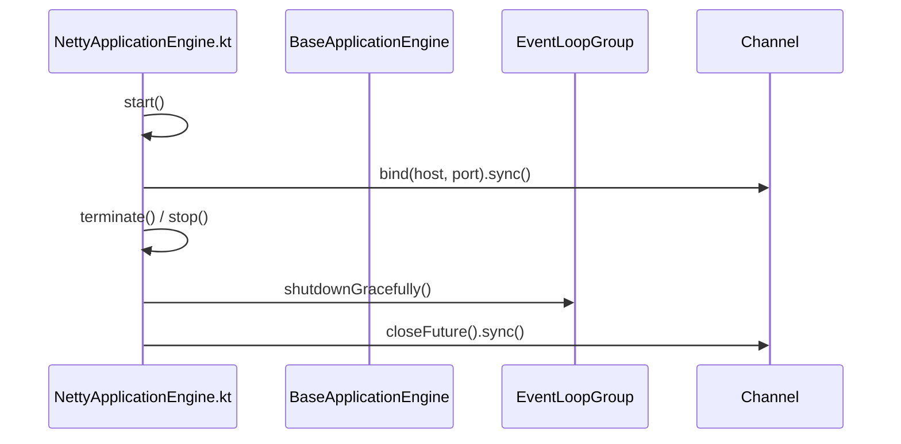

# Netty Integration

<details>
<summary>Relevant source files</summary>

The following files were used as context for generating this wiki page:

- [ktor-server/ktor-server-netty/jvm/src/io/ktor/server/netty/NettyApplicationEngine.kt](https://github.com/ktorio/ktor/blob/main/ktor-server/ktor-server-netty/jvm/src/io/ktor/server/netty/NettyApplicationEngine.kt)
- [ktor-server/ktor-server-netty/jvm/src/io/ktor/server/netty/http2/NettyHttp2Handler.kt](https://github.com/ktorio/ktor/blob/main/ktor-server/ktor-server-netty/jvm/src/io/ktor/server/netty/http2/NettyHttp2Handler.kt)
- [ktor-server/ktor-server-netty/jvm/src/io/ktor/server/netty/NettyChannelInitializer.kt](https://github.com/ktorio/ktor/blob/main/ktor-server/ktor-server-netty/jvm/src/io/ktor/server/netty/NettyChannelInitializer.kt)
- [ktor-server/ktor-server-netty/jvm/src/io/ktor/server/netty/http1/NettyHttp1Handler.kt](https://github.com/ktorio/ktor/blob/main/ktor-server/ktor-server-netty/jvm/src/io/ktor/server/netty/http1/NettyHttp1Handler.kt)
- [ktor-server/ktor-server-netty/jvm/src/io/ktor/server/netty/http3/NettyHttp3Handler.kt](https://github.com/ktorio/ktor/blob/main/ktor-server/ktor-server-netty/jvm/src/io/ktor/server/netty/http3/NettyHttp3Handler.kt)
- [ktor-server/ktor-server-netty/jvm/src/io/ktor/server/netty/cio/NettyHttpResponsePipeline.kt](https://github.com/ktorio/ktor/blob/main/ktor-server/ktor-server-netty/jvm/src/io/ktor/server/netty/cio/NettyHttpResponsePipeline.kt)
- [ktor-server/ktor-server-netty/jvm/src/io/ktor/server/netty/http3/NettyHttp3ApplicationRequest.kt](https://github.com/ktorio/ktor/blob/main/ktor-server/ktor-server-netty/jvm/src/io/ktor/server/netty/http3/NettyHttp3ApplicationRequest.kt)
- [ktor-server/ktor-server-netty/jvm/src/io/ktor/server/netty/http3/NettyHttp3ChannelInitializer.kt](https://github.com/ktorio/ktor/blob/main/ktor-server/ktor-server-netty/jvm/src/io/ktor/server/netty/http3/NettyHttp3ChannelInitializer.kt)
- [ktor-server/ktor-server-jetty-jakarta/jvm/src/io/ktor/server/jetty/jakarta/JettyKtorHandler.kt](https://github.com/ktorio/ktor/blob/main/ktor-server/ktor-server-jetty-jakarta/jvm/src/io/ktor/server/jetty/jakarta/JettyKtorHandler.kt)
- [ktor-server/ktor-server-jetty/jvm/src/io/ktor/server/jetty/JettyKtorHandler.kt](https://github.com/ktorio/ktor/blob/main/ktor-server/ktor-server-jetty/jvm/src/io/ktor/server/jetty/JettyKtorHandler.kt)
- [ktor-server/ktor-server-netty/jvm/src/io/ktor/server/netty/http3/NettyHttp3ApplicationCall.kt](https://github.com/ktorio/ktor/blob/main/ktor-server/ktor-server-netty/jvm/src/io/ktor/server/netty/http3/NettyHttp3ApplicationCall.kt)
- [ktor-server/ktor-server-netty/jvm/src/io/ktor/server/netty/NettyApplicationCallHandler.kt](https://github.com/ktorio/ktor/blob/main/ktor-server/ktor-server-netty/jvm/src/io/ktor/server/netty/NettyApplicationCallHandler.kt)
- [ktor-server/ktor-server-netty/jvm/src/io/ktor/server/netty/http3/NettyHttp3ApplicationResponse.kt](https://github.com/ktorio/ktor/blob/main/ktor-server/ktor-server-netty/jvm/src/io/ktor/server/netty/http3/NettyHttp3ApplicationResponse.kt)
- [ktor-server/ktor-server-netty/jvm/src/io/ktor/server/netty/http2/NettyHttp2ApplicationCall.kt](https://github.com/ktorio/ktor/blob/main/ktor-server/ktor-server-netty/jvm/src/io/ktor/server/netty/http2/NettyHttp2ApplicationCall.kt)
- [ktor-server/ktor-server-netty/jvm/src/io/ktor/server/netty/http1/NettyHttp1ApplicationCall.kt](https://github.com/ktorio/ktor/blob/main/ktor-server/ktor-server-netty/jvm/src/io/ktor/server/netty/http1/NettyHttp1ApplicationCall.kt)
- [ktor-server/ktor-server-netty/jvm/src/io/ktor/server/netty/http3/NettyHttp3RequestStreamInitializer.kt](https://github.com/ktorio/ktor/blob/main/ktor-server/ktor-server-netty/jvm/src/io/ktor/server/netty/http3/NettyHttp3RequestStreamInitializer.kt)
- [ktor-server/ktor-server-netty/jvm/src/io/ktor/server/netty/http2/NettyHttp2ApplicationRequest.kt](https://github.com/ktorio/ktor/blob/main/ktor-server/ktor-server-netty/jvm/src/io/ktor/server/netty/http2/NettyHttp2ApplicationRequest.kt)
- [ktor-server/ktor-server-netty/jvm/src/io/ktor/server/netty/NettyApplicationCall.kt](https://github.com/ktorio/ktor/blob/main/ktor-server/ktor-server-netty/jvm/src/io/ktor/server/netty/NettyApplicationCall.kt)
- [ktor-server/ktor-server-core/jvm/src/io/ktor/server/engine/OverridingClassLoader.kt](https://github.com/ktorio/ktor/blob/main/ktor-server/ktor-server-core/jvm/src/io/ktor/server/engine/OverridingClassLoader.kt)
- [ktor-shared/ktor-openapi-schema/common/src/io/ktor/openapi/GenericElement.kt](https://github.com/ktorio/ktor/blob/main/ktor-shared/ktor-openapi-schema/common/src/io/ktor/openapi/GenericElement.kt)
</details>

## Overview

The Netty engine integration in Ktor provides a high-performance, asynchronous server backend built on Netty, supporting multi-protocol request handling across HTTP/1.1, HTTP/2, and HTTP/3. It manages server lifecycle bootstrapping, event loop groups, channel pipelines, and multiplexed streams while integrating seamlessly with Ktor's coroutine-based application pipelines.
Sources: [ktor-server/ktor-server-netty/jvm/src/io/ktor/server/netty/NettyApplicationEngine.kt#L50-L56](https://github.com/ktorio/ktor/blob/main/ktor-server/ktor-server-netty/jvm/src/io/ktor/server/netty/NettyApplicationEngine.kt#L50-L56)

## Netty Server Engine Lifecycle

### Overview

The lifecycle of the Netty application engine manages bootstrapping, event loop allocation, port binding, and coordinated shutdown execution. The engine implementation is encapsulated in `NettyApplicationEngine`, which extends `BaseApplicationEngine` to handle server startup, configuration options, channel futures, and graceful teardown procedures.
Sources: [ktor-server/ktor-server-netty/jvm/src/io/ktor/server/netty/NettyApplicationEngine.kt#L50-L56](https://github.com/ktorio/ktor/blob/main/ktor-server/ktor-server-netty/jvm/src/io/ktor/server/netty/NettyApplicationEngine.kt#L50-L56)

### Engine Configuration Options

`NettyApplicationEngine.Configuration` exposes settings for tuning server behavior, timeouts, pipeline sizes, and protocol supports. The options and their defaults are detailed below.

| Option | Type | Default Value | Purpose |
| :--- | :--- | :--- | :--- |
| `runningLimit` | `Int` | `32` | Number of concurrently running requests from the same HTTP pipeline. |
| `shareWorkGroup` | `Boolean` | `false` | Reuses worker group for processing calls without creating a separate call event group. |
| `configureBootstrap` | `ServerBootstrap.() -> Unit` | `{}` | User-provided lambda to configure Netty's `ServerBootstrap`. |
| `responseWriteTimeoutSeconds` | `Int` | `10` | Timeout in seconds for sending responses to clients. |
| `requestReadTimeoutSeconds` | `Int` | `0` | Timeout in seconds for reading requests from clients ("0" is infinite). |
| `tcpKeepAlive` | `Boolean` | `false` | Enables TCP keep-alive for connections to discard dead client connections. |
| `maxInitialLineLength` | `Int` | `HttpObjectDecoder.DEFAULT_MAX_INITIAL_LINE_LENGTH` | URL limit including query parameters. |
| `maxHeaderSize` | `Int` | `HttpObjectDecoder.DEFAULT_MAX_HEADER_SIZE` | Maximum cumulative length of all headers before raising a `TooLongFrameException`. |
| `maxChunkSize` | `Int` | `HttpObjectDecoder.DEFAULT_MAX_CHUNK_SIZE` | Maximum length of content or each chunk. |
| `enableHttp2` | `Boolean` | `true` | Enables HTTP/2 protocol support for the Netty engine. |
| `enableH2c` | `Boolean` | `false` | Enables cleartext HTTP/2 (H2c) without TLS when `enableHttp2` is active. |

Sources: [ktor-server/ktor-server-netty/jvm/src/io/ktor/server/netty/NettyApplicationEngine.kt#L63-L193](https://github.com/ktorio/ktor/blob/main/ktor-server/ktor-server-netty/jvm/src/io/ktor/server/netty/NettyApplicationEngine.kt#L63-L193)

### Event Loop Group Management and Channel Factories

The engine initializes three distinct `EventLoopGroup` instances lazily: `connectionEventGroup` for accepting connections, `workerEventGroup` for processing incoming requests and internal work, and `callEventGroup` for executing `PipelineCall` instances (unless `shareWorkGroup` is set to `true`, which merges worker and call groups). Channel factories select native transport epoll or kqueue implementations when available, falling back to NIO server socket channels and datagram channels.

```kotlin
internal fun getChannelClass(): KClass<out ServerSocketChannel> = when {
    KQueue.isAvailable() -> KQueueServerSocketChannel::class
    Epoll.isAvailable() -> EpollServerSocketChannel::class
    else -> NioServerSocketChannel::class
}

internal fun getDatagramChannelClass(): KClass<out DatagramChannel> = when {
    KQueue.isAvailable() -> KQueueDatagramChannel::class
    Epoll.isAvailable() -> EpollDatagramChannel::class
    else -> NioDatagramChannel::class
}
```
Sources: [ktor-server/ktor-server-netty/jvm/src/io/ktor/server/netty/NettyApplicationEngine.kt#L198-L234](https://github.com/ktorio/ktor/blob/main/ktor-server/ktor-server-netty/jvm/src/io/ktor/server/netty/NettyApplicationEngine.kt#L198-L234), [ktor-server/ktor-server-netty/jvm/src/io/ktor/server/netty/NettyApplicationEngine.kt#L443-L453](https://github.com/ktorio/ktor/blob/main/ktor-server/ktor-server-netty/jvm/src/io/ktor/server/netty/NettyApplicationEngine.kt#L443-L453)

> [!WARNING]
> Netty's `EventLoopGroup` and Ktor Server handle grace periods differently. Ktor Server waits for all running requests to finish without accepting new ones, whereas Netty's `EventLoopGroup` accepts new tasks during the `gracePeriod` and always waits at least the full `gracePeriod` duration even if all tasks complete early.
> Sources: [ktor-server/ktor-server-netty/jvm/src/io/ktor/server/netty/NettyApplicationEngine.kt#L409-L413](https://github.com/ktorio/ktor/blob/main/ktor-server/ktor-server-netty/jvm/src/io/ktor/server/netty/NettyApplicationEngine.kt#L409-L413)

### Call-Chain Execution Walkthrough

The engine lifecycle relies on strict sequence flows for startup failure handling, termination exceptions, and channel closure tracking.

1. `start` — Initializes bootstrap bindings and synchronizes channel futures; on failure, executes `terminate`.
2. `terminate` — Shuts down event groups gracefully inside exception handling blocks.
3. `withStopException` — Runs exception-catching blocks to log errors thrown during engine stopping without aborting the sequence.
Sources: [ktor-server/ktor-server-netty/jvm/src/io/ktor/server/netty/NettyApplicationEngine.kt#L338-L395](https://github.com/ktorio/ktor/blob/main/ktor-server/ktor-server-netty/jvm/src/io/ktor/server/netty/NettyApplicationEngine.kt#L338-L395)

1. `start` — Binds network connectors and registers completion callbacks.
2. `stop` — Cancels monitoring jobs, closes active channels, and initiates graceful event loop shutdowns.
3. `close` — Finalizes resource release across underlying Netty channel futures.
Sources: [ktor-server/ktor-server-netty/jvm/src/io/ktor/server/netty/NettyApplicationEngine.kt#L338-L380](https://github.com/ktorio/ktor/blob/main/ktor-server/ktor-server-netty/jvm/src/io/ktor/server/netty/NettyApplicationEngine.kt#L338-L380), [ktor-server/ktor-server-netty/jvm/src/io/ktor/server/netty/NettyApplicationEngine.kt#L396-L436](https://github.com/ktorio/ktor/blob/main/ktor-server/ktor-server-netty/jvm/src/io/ktor/server/netty/NettyApplicationEngine.kt#L396-L436)

1. `start` — Completes deferred connector resolution after binding TCP and HTTP/3 channels.
2. `stop` — Dispatches graceful shutdown intervals across connection and worker groups.
3. `orEmpty` — Safely handles nullable collection lookups via `channels.orEmpty()` and `http3Channels.orEmpty()` when evaluating active channels.
Sources: [ktor-server/ktor-server-netty/jvm/src/io/ktor/server/netty/NettyApplicationEngine.kt#L338-L380](https://github.com/ktorio/ktor/blob/main/ktor-server/ktor-server-netty/jvm/src/io/ktor/server/netty/NettyApplicationEngine.kt#L338-L380), [ktor-server/ktor-server-netty/jvm/src/io/ktor/server/netty/NettyApplicationEngine.kt#L396-L436](https://github.com/ktorio/ktor/blob/main/ktor-server/ktor-server-netty/jvm/src/io/ktor/server/netty/NettyApplicationEngine.kt#L396-L436), [ktor-shared/ktor-openapi-schema/common/src/io/ktor/openapi/GenericElement.kt#L38-L40](https://github.com/ktorio/ktor/blob/main/ktor-shared/ktor-openapi-schema/common/src/io/ktor/openapi/GenericElement.kt#L38-L40)


Sources: [ktor-server/ktor-server-netty/jvm/src/io/ktor/server/netty/NettyApplicationEngine.kt#L338-L436](https://github.com/ktorio/ktor/blob/main/ktor-server/ktor-server-netty/jvm/src/io/ktor/server/netty/NettyApplicationEngine.kt#L338-L436)

### Engine Design Trade-Offs

| Design Choice | Benefit | Cost |
| :--- | :--- | :--- |
| **Separated Connection and Worker Event Groups** | Isolates connection acceptance overhead from request execution and worker logic. | Requires managing and sizing multiple Netty thread pools independently. |
| **Optional Work Group Sharing (`shareWorkGroup`)** | Reduces thread context switching and thread count overhead on low-resource hosts. | Blends connection-handling work with request processing threads, risking head-of-line blocking under heavy load. |
| **Graceful Shutdown with Timeout Coercion** | Prevents deadlocks by bounding maximum shutdown duration relative to active channel closure times. | May prematurely drop slow-responding connections if grace periods run out. |

Sources: [ktor-server/ktor-server-netty/jvm/src/io/ktor/server/netty/NettyApplicationEngine.kt#L77-L78](https://github.com/ktorio/ktor/blob/main/ktor-server/ktor-server-netty/jvm/src/io/ktor/server/netty/NettyApplicationEngine.kt#L77-L78), [ktor-server/ktor-server-netty/jvm/src/io/ktor/server/netty/NettyApplicationEngine.kt#L198-L229](https://github.com/ktorio/ktor/blob/main/ktor-server/ktor-server-netty/jvm/src/io/ktor/server/netty/NettyApplicationEngine.kt#L198-L229), [ktor-server/ktor-server-netty/jvm/src/io/ktor/server/netty/NettyApplicationEngine.kt#L413-L435](https://github.com/ktorio/ktor/blob/main/ktor-server/ktor-server-netty/jvm/src/io/ktor/server/netty/NettyApplicationEngine.kt#L413-L435)

## Channel Initialization and Pipeline Setup

### Overview

Channel pipeline initialization in Ktor's Netty integration configures network transport security, protocol negotiation via ALPN, cleartext upgrades, and protocol-specific codecs. The `NettyChannelInitializer` class extends Netty's `ChannelInitializer<SocketChannel>` to populate the channel pipeline based on connector configurations and enabled protocol features.
Sources: [ktor-server/ktor-server-netty/jvm/src/io/ktor/server/netty/NettyChannelInitializer.kt#L50-L65](https://github.com/ktorio/ktor/blob/main/ktor-server/ktor-server-netty/jvm/src/io/ktor/server/netty/NettyChannelInitializer.kt#L50-L65)

### Pipeline Initialization and Call-Chain Execution

When a new socket connection is accepted, Netty invokes `initChannel(ch: SocketChannel)` to build the channel pipeline. The execution branches according to whether SSL, HTTP/2, H2C cleartext upgrade, or standard HTTP/1.1 is configured:
Sources: [ktor-server/ktor-server-netty/jvm/src/io/ktor/server/netty/NettyChannelInitializer.kt#L144-L179](https://github.com/ktorio/ktor/blob/main/ktor-server/ktor-server-netty/jvm/src/io/ktor/server/netty/NettyChannelInitializer.kt#L144-L179)

1. `initChannel()` checks connector type and protocol flags. If both `enableHttp2` and `enableH2c` are true alongside an SSL connector, execution aborts via `error("Invalid configuration: H2C (HTTP/2 cleartext) cannot be used with SSL")`.
Sources: [ktor-server/ktor-server-netty/jvm/src/io/ktor/server/netty/NettyChannelInitializer.kt#L146-L149](https://github.com/ktorio/ktor/blob/main/ktor-server/ktor-server-netty/jvm/src/io/ktor/server/netty/NettyChannelInitializer.kt#L146-L149)

2. For HTTP/2 cleartext (`enableHttp2 && enableH2c`), `configurePipeline` is invoked with `Http2CodecUtil.HTTP_UPGRADE_PROTOCOL_NAME`, inserting `CleartextHttp2ServerUpgradeHandler`, `NettyHttp2ConnectionSink`, and an upgrade inspection handler into the pipeline.
Sources: [ktor-server/ktor-server-netty/jvm/src/io/ktor/server/netty/NettyChannelInitializer.kt#L151-L153](https://github.com/ktorio/ktor/blob/main/ktor-server/ktor-server-netty/jvm/src/io/ktor/server/netty/NettyChannelInitializer.kt#L151-L153), [ktor-server/ktor-server-netty/jvm/src/io/ktor/server/netty/NettyChannelInitializer.kt#L221-L233](https://github.com/ktorio/ktor/blob/main/ktor-server/ktor-server-netty/jvm/src/io/ktor/server/netty/NettyChannelInitializer.kt#L221-L233)

3. For TLS connections (`connector is EngineSSLConnectorConfig`), an `SslHandler` is prepended using an engine built from `sslContext`. If ALPN is enabled and an ALPN provider is available (`alpnProvider != null`), `NegotiatedPipelineInitializer` is added to handle protocol selection between `h2` and `http/1.1`. Otherwise, the pipeline defaults to `ApplicationProtocolNames.HTTP_1_1`.
Sources: [ktor-server/ktor-server-netty/jvm/src/io/ktor/server/netty/NettyChannelInitializer.kt#L155-L172](https://github.com/ktorio/ktor/blob/main/ktor-server/ktor-server-netty/jvm/src/io/ktor/server/netty/NettyChannelInitializer.kt#L155-L172)

4. For standard cleartext HTTP/1.1 connections, `configurePipeline` runs with `ApplicationProtocolNames.HTTP_1_1`, adding timeout handlers, `HttpServerCodec`, `HttpServerExpectContinueHandler`, and `NettyHttp1Handler`.
Sources: [ktor-server/ktor-server-netty/jvm/src/io/ktor/server/netty/NettyChannelInitializer.kt#L174-L176](https://github.com/ktorio/ktor/blob/main/ktor-server/ktor-server-netty/jvm/src/io/ktor/server/netty/NettyChannelInitializer.kt#L174-L176), [ktor-server/ktor-server-netty/jvm/src/io/ktor/server/netty/NettyChannelInitializer.kt#L273-L294](https://github.com/ktorio/ktor/blob/main/ktor-server/ktor-server-netty/jvm/src/io/ktor/server/netty/NettyChannelInitializer.kt#L273-L294)

> [!WARNING]
> H2C (HTTP/2 cleartext) cannot be combined with an SSL connector. Attempting to enable both alongside an `EngineSSLConnectorConfig` causes `initChannel` to immediately throw an illegal state error.
Sources: [ktor-server/ktor-server-netty/jvm/src/io/ktor/server/netty/NettyChannelInitializer.kt#L146-L149](https://github.com/ktorio/ktor/blob/main/ktor-server/ktor-server-netty/jvm/src/io/ktor/server/netty/NettyChannelInitializer.kt#L146-L149)

### HTTP/3 and QUIC Channel Initializers

For QUIC and HTTP/3 transports, `NettyHttp3ChannelInitializer` configures the datagram channel by building a QUIC server codec via `Http3.newQuicServerCodecBuilder()`. Because HTTP/3 connection handlers are non-sharable, a per-connection `ChannelInitializer<QuicChannel>` registers `Http3ServerConnectionHandler`.
Sources: [ktor-server/ktor-server-netty/jvm/src/io/ktor/server/netty/http3/NettyHttp3ChannelInitializer.kt#L18-L62](https://github.com/ktorio/ktor/blob/main/ktor-server/ktor-server-netty/jvm/src/io/ktor/server/netty/http3/NettyHttp3ChannelInitializer.kt#L18-L62)

Incoming request streams are initialized by `NettyHttp3RequestStreamInitializer`, which extends `ChannelInitializer<QuicStreamChannel>` rather than Netty's built-in `Http3RequestStreamInitializer` to prevent duplicate codec registrations since `Http3ServerConnectionHandler` already establishes the codec pipeline. Each request stream receives a fresh `NettyHttp3Handler` instance.
Sources: [ktor-server/ktor-server-netty/jvm/src/io/ktor/server/netty/http3/NettyHttp3RequestStreamInitializer.kt#L13-L39](https://github.com/ktorio/ktor/blob/main/ktor-server/ktor-server-netty/jvm/src/io/ktor/server/netty/http3/NettyHttp3RequestStreamInitializer.kt#L13-L39)

> [!NOTE]
> `NettyHttp3RequestStreamInitializer` extends Netty's base `ChannelInitializer<QuicStreamChannel>` instead of `Http3RequestStreamInitializer` to avoid duplicate codec handler insertions on bidirectional streams.
Sources: [ktor-server/ktor-server-netty/jvm/src/io/ktor/server/netty/http3/NettyHttp3RequestStreamInitializer.kt#L13-L21](https://github.com/ktorio/ktor/blob/main/ktor-server/ktor-server-netty/jvm/src/io/ktor/server/netty/http3/NettyHttp3RequestStreamInitializer.kt#L13-L21)

### Protocol Handler and Initializer Reference

| Class Name | Target Channel Type | Purpose |
| :--- | :--- | :--- |
| `NettyChannelInitializer` | `SocketChannel` | Configures TCP pipeline handlers, TLS engines, ALPN negotiation, and HTTP/1.x or HTTP/2 codecs. |
| `NegotiatedPipelineInitializer` | `SocketChannel` (TLS) | Handles ALPN callback results inside `ApplicationProtocolNegotiationHandler` to switch between HTTP/2 and HTTP/1.1 pipelines. |
| `NettyHttp3ChannelInitializer` | `DatagramChannel` | Configures QUIC server codec, idle timeouts, token handling, and connection handlers for HTTP/3. |
| `NettyHttp3RequestStreamInitializer` | `QuicStreamChannel` | Instantiates `NettyHttp3Handler` per incoming QUIC request stream. |
| `KtorReadTimeoutHandler` | `SocketChannel` | Wraps Netty's `ReadTimeoutHandler` to fire `ReadTimeoutException` precisely once per timeout event. |

Sources: [ktor-server/ktor-server-netty/jvm/src/io/ktor/server/netty/NettyChannelInitializer.kt#L50-L65](https://github.com/ktorio/ktor/blob/main/ktor-server/ktor-server-netty/jvm/src/io/ktor/server/netty/NettyChannelInitializer.kt#L50-L65), [ktor-server/ktor-server-netty/jvm/src/io/ktor/server/netty/NettyChannelInitializer.kt#L319-L332](https://github.com/ktorio/ktor/blob/main/ktor-server/ktor-server-netty/jvm/src/io/ktor/server/netty/NettyChannelInitializer.kt#L319-L332), [ktor-server/ktor-server-netty/jvm/src/io/ktor/server/netty/NettyChannelInitializer.kt#L357-L366](https://github.com/ktorio/ktor/blob/main/ktor-server/ktor-server-netty/jvm/src/io/ktor/server/netty/NettyChannelInitializer.kt#L357-L366), [ktor-server/ktor-server-netty/jvm/src/io/ktor/server/netty/http3/NettyHttp3ChannelInitializer.kt#L25-L33](https://github.com/ktorio/ktor/blob/main/ktor-server/ktor-server-netty/jvm/src/io/ktor/server/netty/http3/NettyHttp3ChannelInitializer.kt#L25-L33), [ktor-server/ktor-server-netty/jvm/src/io/ktor/server/netty/http3/NettyHttp3RequestStreamInitializer.kt#L22-L27](https://github.com/ktorio/ktor/blob/main/ktor-server/ktor-server-netty/jvm/src/io/ktor/server/netty/http3/NettyHttp3RequestStreamInitializer.kt#L22-L27)

## HTTP/1.1 Request Processing and Dispatch

### Overview

The `NettyHttp1Handler` processes inbound HTTP/1.1 messages, manages active connections, and dispatches requests into Ktor's coroutine-based execution pipeline. When a TCP channel becomes active via `channelActive()`, `NettyHttp1Handler` configures a `NettyHttpResponsePipeline`, sets channel auto-read to false, and appends `RequestBodyHandler` and `NettyHttp1ApplicationCallSink` to the pipeline. Incoming messages are intercepted in `channelRead()`, where `HttpRequest` instances trigger request handling while `LastHttpContent` flags request completion.
Sources: [ktor-server/ktor-server-netty/jvm/src/io/ktor/server/netty/http1/NettyHttp1Handler.kt#L57-L86](https://github.com/ktorio/ktor/blob/main/ktor-server/ktor-server-netty/jvm/src/io/ktor/server/netty/http1/NettyHttp1Handler.kt#L57-L86), [ktor-server/ktor-server-netty/jvm/src/io/ktor/server/netty/http1/NettyHttp1Handler.kt#L88-L115](https://github.com/ktorio/ktor/blob/main/ktor-server/ktor-server-netty/jvm/src/io/ktor/server/netty/http1/NettyHttp1Handler.kt#L88-L115)

### Request Processing and Dispatch Walkthrough

When an `HttpRequest` arrives on the channel, execution follows a strict sequence:
`channelRead()` → `handleRequest()` → `prepareCallFromRequest()` → `responseWriter.processResponse()` → `callExecutor.execute()` → `enginePipeline.execute()`. 
Sources: [ktor-server/ktor-server-netty/jvm/src/io/ktor/server/netty/http1/NettyHttp1Handler.kt#L93-L103](https://github.com/ktorio/ktor/blob/main/ktor-server/ktor-server-netty/jvm/src/io/ktor/server/netty/http1/NettyHttp1Handler.kt#L93-L103), [ktor-server/ktor-server-netty/jvm/src/io/ktor/server/netty/http1/NettyHttp1Handler.kt#L166-L221](https://github.com/ktorio/ktor/blob/main/ktor-server/ktor-server-netty/jvm/src/io/ktor/server/netty/http1/NettyHttp1Handler.kt#L166-L221)

1. **Base Context Caching**: `handleRequest()` builds or reuses connection-stable coroutine context elements (including user context and dispatcher context) combined with a per-call `Job`.
Sources: [ktor-server/ktor-server-netty/jvm/src/io/ktor/server/netty/http1/NettyHttp1Handler.kt#L169-L188](https://github.com/ktorio/ktor/blob/main/ktor-server/ktor-server-netty/jvm/src/io/ktor/server/netty/http1/NettyHttp1Handler.kt#L169-L188)
2. **Call Preparation**: `prepareCallFromRequest()` instantiates `NettyHttp1ApplicationCall`, setting up content channels based on transfer encodings or HTTP method characteristics.
Sources: [ktor-server/ktor-server-netty/jvm/src/io/ktor/server/netty/http1/NettyHttp1Handler.kt#L189-L190](https://github.com/ktorio/ktor/blob/main/ktor-server/ktor-server-netty/jvm/src/io/ktor/server/netty/http1/NettyHttp1Handler.kt#L189-L190), [ktor-server/ktor-server-netty/jvm/src/io/ktor/server/netty/http1/NettyHttp1Handler.kt#L227-L252](https://github.com/ktorio/ktor/blob/main/ktor-server/ktor-server-netty/jvm/src/io/ktor/server/netty/http1/NettyHttp1Handler.kt#L227-L252)
3. **Pipeline Forwarding & Response Slot Reservation**: The call is forwarded via `context.fireChannelRead(call)` for custom handlers, and `responseWriter.processResponse(call)` synchronously reserves a response slot on the I/O thread to preserve ordering.
Sources: [ktor-server/ktor-server-netty/jvm/src/io/ktor/server/netty/http1/NettyHttp1Handler.kt#L192-L197](https://github.com/ktorio/ktor/blob/main/ktor-server/ktor-server-netty/jvm/src/io/ktor/server/netty/http1/NettyHttp1Handler.kt#L192-L197)
4. **Deferred Execution**: Coroutine execution is deferred to the next event loop tick via `callExecutor.execute {}` so `channelReadComplete()` fires first. This lets the response pipeline detect request body reception and flush headers early.
Sources: [ktor-server/ktor-server-netty/jvm/src/io/ktor/server/netty/http1/NettyHttp1Handler.kt#L198-L204](https://github.com/ktorio/ktor/blob/main/ktor-server/ktor-server-netty/jvm/src/io/ktor/server/netty/http1/NettyHttp1Handler.kt#L198-L204)

> [!TIP]
> Coroutine execution for incoming requests is explicitly deferred to the next event loop tick using `callExecutor.execute`. This guarantees that `channelReadComplete()` runs first, allowing response pipelines to flush headers early rather than buffering them when clients wait for headers before sending bodies.
Sources: [ktor-server/ktor-server-netty/jvm/src/io/ktor/server/netty/http1/NettyHttp1Handler.kt#L198-L204](https://github.com/ktorio/ktor/blob/main/ktor-server/ktor-server-netty/jvm/src/io/ktor/server/netty/http1/NettyHttp1Handler.kt#L198-L204)

### Request Validation and Transfer Encoding

Before pipeline execution proceeds, `call.request.isValid()` inspects the Netty decoder results and transfer encodings. Validation fails immediately if the decoder result is a failure. For chunked requests, `hasValidTransferEncoding()` verifies that the `chunked` token appears exclusively as the final transfer encoding value and is properly bounded by token separators like spaces or commas.
Sources: [ktor-server/ktor-server-netty/jvm/src/io/ktor/server/netty/NettyApplicationCallHandler.kt#L26-L35](https://github.com/ktorio/ktor/blob/main/ktor-server/ktor-server-netty/jvm/src/io/ktor/server/netty/NettyApplicationCallHandler.kt#L26-L35), [ktor-server/ktor-server-netty/jvm/src/io/ktor/server/netty/NettyApplicationCallHandler.kt#L72-L97](https://github.com/ktorio/ktor/blob/main/ktor-server/ktor-server-netty/jvm/src/io/ktor/server/netty/NettyApplicationCallHandler.kt#L72-L97)

If request validation fails, `call.respondError400BadRequest()` logs the cause if tracing is enabled, constructs a `400 Bad Request` response with the failure message text payload, and finishes the call.
Sources: [ktor-server/ktor-server-netty/jvm/src/io/ktor/server/netty/NettyApplicationCallHandler.kt#L45-L60](https://github.com/ktorio/ktor/blob/main/ktor-server/ktor-server-netty/jvm/src/io/ktor/server/netty/NettyApplicationCallHandler.kt#L45-L60)

> [!WARNING]
> If a client sends an invalid transfer encoding header where `chunked` is not the final encoding entry or is improperly separated, `hasValidTransferEncoding()` returns false, causing the engine to respond with a 400 Bad Request error.
Sources: [ktor-server/ktor-server-netty/jvm/src/io/ktor/server/netty/NettyApplicationCallHandler.kt#L31-L35](https://github.com/ktorio/ktor/blob/main/ktor-server/ktor-server-netty/jvm/src/io/ktor/server/netty/NettyApplicationCallHandler.kt#L31-L35), [ktor-server/ktor-server-netty/jvm/src/io/ktor/server/netty/NettyApplicationCallHandler.kt#L86-L93](https://github.com/ktorio/ktor/blob/main/ktor-server/ktor-server-netty/jvm/src/io/ktor/server/netty/NettyApplicationCallHandler.kt#L86-L93)

### Exception Handling and Timeout Management

Exceptions caught during channel operations are handled in `exceptionCaught()`:
- `IOException`: Triggers trace logging, cancels `handlerJob`, and closes the channel.
- `ReadTimeoutException`: If active calls are empty, the exception propagates; otherwise, it sends an HTTP/1.1 `408 Request Timeout` response and cancels all active call coroutines with the timeout cause.
- Other throwables: Complete `handlerJob` exceptionally and close the context.
Sources: [ktor-server/ktor-server-netty/jvm/src/io/ktor/server/netty/http1/NettyHttp1Handler.kt#L134-L158](https://github.com/ktorio/ktor/blob/main/ktor-server/ktor-server-netty/jvm/src/io/ktor/server/netty/http1/NettyHttp1Handler.kt#L134-L158), [ktor-server/ktor-server-netty/jvm/src/io/ktor/server/netty/NettyApplicationCallHandler.kt#L37-L43](https://github.com/ktorio/ktor/blob/main/ktor-server/ktor-server-netty/jvm/src/io/ktor/server/netty/NettyApplicationCallHandler.kt#L37-L43)

## HTTP/2 Stream Multiplexing and Calls

### Overview

The Netty HTTP/2 integration relies on `NettyHttp2Handler` to process framed multiplexed streams, manage per-call coroutine contexts, and coordinate push promise execution. Incoming frames are intercepted from Netty's channel pipeline and routed based on frame type.
Sources: [ktor-server/ktor-server-netty/jvm/src/io/ktor/server/netty/http2/NettyHttp2Handler.kt#L29-L82](https://github.com/ktorio/ktor/blob/main/ktor-server/ktor-server-netty/jvm/src/io/ktor/server/netty/http2/NettyHttp2Handler.kt#L29-L82)

### Frame Decoding and Stream Routing

When `channelRead` receives inbound messages, it dispatches them according to their HTTP/2 frame type:
- `Http2HeadersFrame`: Updates request state flags, increments active request counts, and invokes `startHttp2()` to initialize a new application call.
- `Http2DataFrame`: Routes incoming body content chunks to the active call's `contentActor`. If the frame marks the end of the stream (`isEndStream`), the content actor is closed and request completion state is updated; otherwise, partial delivery flags are toggled. If no active call is associated with the channel, the data frame is released.
- `Http2ResetFrame`: Closes the request's content actor with an `Http2ClosedChannelException` carrying the error code, or `null` if the error code is `0L`.
- Other messages: Forwarded down the pipeline via `context.fireChannelRead(message)`.
Sources: [ktor-server/ktor-server-netty/jvm/src/io/ktor/server/netty/http2/NettyHttp2Handler.kt#L52-L82](https://github.com/ktorio/ktor/blob/main/ktor-server/ktor-server-netty/jvm/src/io/ktor/server/netty/http2/NettyHttp2Handler.kt#L52-L82)

```mermaid
sequenceDiagram
    participant Netty as Netty Channel
    participant Handler as NettyHttp2Handler
    participant Call as NettyHttp2ApplicationCall
    participant Actor as contentActor

    Netty->>Handler: channelRead(Http2HeadersFrame)
    Handler->>Call: startHttp2()
    Netty->>Handler: channelRead(Http2DataFrame)
    Handler->>Actor: trySend(message)
    Netty->>Handler: channelRead(Http2ResetFrame)
    Handler->>Actor: close(Http2ClosedChannelException)
```
Sources: [ktor-server/ktor-server-netty/jvm/src/io/ktor/server/netty/http2/NettyHttp2Handler.kt#L52-L82](https://github.com/ktorio/ktor/blob/main/ktor-server/ktor-server-netty/jvm/src/io/ktor/server/netty/http2/NettyHttp2Handler.kt#L52-L82)

### Push Promise Initiation

HTTP/2 server push is driven by `startHttp2PushPromise()`, which inspects the remote peer settings to verify if push is permitted. 
Sources: [ktor-server/ktor-server-netty/jvm/src/io/ktor/server/netty/http2/NettyHttp2Handler.kt#L168-L177](https://github.com/ktorio/ktor/blob/main/ktor-server/ktor-server-netty/jvm/src/io/ktor/server/netty/http2/NettyHttp2Handler.kt#L168-L177)

The push promise workflow follows a strict sequence of operations:
1. `channel.stream().id()` extracts the parent stream identifier from the active Netty stream channel.
2. `connection.local().incrementAndGetNextStreamId()` allocates the next available local stream identifier for the promised stream.
3. `DefaultHttp2Headers()` constructs pseudo-headers (`:method`, `:authority`, `:scheme`, `:path`) from the provided `ResponsePushBuilder` target URL.
4. `Http2StreamChannelBootstrap` opens a child stream channel configured with the handler instance.
5. `child.setId(promisedStreamId)` uses reflection to inject the assigned stream identifier into the Netty stream implementation.
6. `connection.local().createStream(...)` creates the local child stream instance, and `child.stream().setStreamAndProperty(...)` binds it to the multiplex codec.
7. `codec.encoder().frameWriter().writePushPromise(...)` writes the PUSH_PROMISE frame to the channel context. Upon success, `startHttp2()` initializes the child call pipeline.
Sources: [ktor-server/ktor-server-netty/jvm/src/io/ktor/server/netty/http2/NettyHttp2Handler.kt#L170-L213](https://github.com/ktorio/ktor/blob/main/ktor-server/ktor-server-netty/jvm/src/io/ktor/server/netty/http2/NettyHttp2Handler.kt#L170-L213)

> [!NOTE]
> Reflection access via `streamIdField` and `setStreamAndProperty` is required because Netty's public API does not currently expose direct stream ID assignment for bootstrapped child stream channels.
Sources: [ktor-server/ktor-server-netty/jvm/src/io/ktor/server/netty/http2/NettyHttp2Handler.kt#L215-L244](https://github.com/ktorio/ktor/blob/main/ktor-server/ktor-server-netty/jvm/src/io/ktor/server/netty/http2/NettyHttp2Handler.kt#L215-L244)

### Multiplexed Application Call Abstraction

`NettyHttp2ApplicationCall` extends `NettyApplicationCall` to provide HTTP/2-specific request and response implementations without HTTP/1.1 serialization constructs.
Sources: [ktor-server/ktor-server-netty/jvm/src/io/ktor/server/netty/http2/NettyHttp2ApplicationCall.kt#L14-L25](https://github.com/ktorio/ktor/blob/main/ktor-server/ktor-server-netty/jvm/src/io/ktor/server/netty/http2/NettyHttp2ApplicationCall.kt#L14-L25)

| Method | Return Type | Purpose |
| :--- | :--- | :--- |
| `prepareMessage(buf, isLastContent)` | `Any` | Prepares a `DefaultHttp2DataFrame` wrapper for outbound byte buffers unless byte buffer content mode is active. |
| `prepareEndOfStreamMessage(lastTransformed)` | `Any?` | Generates a terminal empty `DefaultHttp2DataFrame` with `isEndStream = true` when no transformed body content was previously sent. |
| `upgrade(dst)` | `Unit` | Throws an `IllegalStateException` because HTTP/2 protocol multiplexing does not support connection upgrades. |
| `isContextCloseRequired()` | `Boolean` | Returns `false`, preventing premature channel closure after individual stream completion. |
Sources: [ktor-server/ktor-server-netty/jvm/src/io/ktor/server/netty/http2/NettyHttp2ApplicationCall.kt#L30-L51](https://github.com/ktorio/ktor/blob/main/ktor-server/ktor-server-netty/jvm/src/io/ktor/server/netty/http2/NettyHttp2ApplicationCall.kt#L30-L51)

`NettyHttp2ApplicationRequest` parses request paths from the `:path` pseudo-header (defaulting to `/`), filters out pseudo-headers starting with `:` to expose clean engine headers, and runs an unconfined coroutine actor executing `http2frameLoop` to feed data into the body channel.
Sources: [ktor-server/ktor-server-netty/jvm/src/io/ktor/server/netty/http2/NettyHttp2ApplicationRequest.kt#L19-L62](https://github.com/ktorio/ktor/blob/main/ktor-server/ktor-server-netty/jvm/src/io/ktor/server/netty/http2/NettyHttp2ApplicationRequest.kt#L19-L62)

## HTTP/3 QUIC Transport and Framing

### Overview

`NettyHttp3Handler` extends Netty's `Http3RequestStreamInboundHandler` and implements `CoroutineScope` to process inbound HTTP/3 request streams and manage per-call execution lifecycles.
Sources: [ktor-server/ktor-server-netty/jvm/src/io/ktor/server/netty/http3/NettyHttp3Handler.kt#L22-L27](https://github.com/ktorio/ktor/blob/main/ktor-server/ktor-server-netty/jvm/src/io/ktor/server/netty/http3/NettyHttp3Handler.kt#L22-L27)

### HTTP/3 Request Stream Framing Walkthrough

The request stream framing and execution pipeline proceeds through a strict sequence of channel events:
1. `channelActive()` initializes a `NettyHttpResponsePipeline` using the active channel context, handler state, and coroutine context, then propagates `channelActive()`.
2. `channelRead(context, frame: Http3HeadersFrame)` checks if an application call already exists on the context; if `null`, it increments active requests and invokes `startHttp3()`. If a call exists, it processes trailer headers via `request.receiveTrailers(frame.headers())`.
3. `channelRead(context, frame: Http3DataFrame)` retrieves the request from the channel context and tries to send the data frame into its `contentActor`; if the request is missing or the send fails, the frame is released.
4. `channelInputClosed()` closes the request's content actor and marks the current request as fully read.
5. `channelReadComplete()` flushes responses if needed via `responseWriter.flushIfNeeded()`.
Sources: [ktor-server/ktor-server-netty/jvm/src/io/ktor/server/netty/http3/NettyHttp3Handler.kt#L46-L91](https://github.com/ktorio/ktor/blob/main/ktor-server/ktor-server-netty/jvm/src/io/ktor/server/netty/http3/NettyHttp3Handler.kt#L46-L91)

> [!NOTE]
> `startHttp3()` creates a per-call `Job`, combines the static context with `NettyDispatcher.CurrentContext(context)` and the call job, instantiates a `NettyHttp3ApplicationCall`, and executes the engine pipeline within an undispatcher coroutine scope.
Sources: [ktor-server/ktor-server-netty/jvm/src/io/ktor/server/netty/http3/NettyHttp3Handler.kt#L99-L126](https://github.com/ktorio/ktor/blob/main/ktor-server/ktor-server-netty/jvm/src/io/ktor/server/netty/http3/NettyHttp3Handler.kt#L99-L126)

### HTTP/3 Call and Response Abstractions

`NettyHttp3ApplicationCall` binds `NettyHttp3ApplicationRequest` and `NettyHttp3ApplicationResponse`, configuring pseudo-headers and disabling connection upgrades and push promises which are unsupported under HTTP/3.
Sources: [ktor-server/ktor-server-netty/jvm/src/io/ktor/server/netty/http3/NettyHttp3ApplicationCall.kt#L14-L54](https://github.com/ktorio/ktor/blob/main/ktor-server/ktor-server-netty/jvm/src/io/ktor/server/netty/http3/NettyHttp3ApplicationCall.kt#L14-L54), [ktor-server/ktor-server-netty/jvm/src/io/ktor/server/netty/http3/NettyHttp3ApplicationResponse.kt#L16-L72](https://github.com/ktorio/ktor/blob/main/ktor-server/ktor-server-netty/jvm/src/io/ktor/server/netty/http3/NettyHttp3ApplicationResponse.kt#L16-L72)

| Method / Property | Return Type | Purpose |
| :--- | :--- | :--- |
| `prepareMessage(buf, isLastContent)` | `Any` | Wraps byte buffers into a `DefaultHttp3DataFrame` unless byte buffer content mode is active. |
| `prepareEndOfStreamMessage(lastTransformed)` | `Any?` | Returns `null` because HTTP/3 signals end of stream by closing the QUIC stream rather than via a frame flag. |
| `upgrade(dst)` | `Unit` | Throws an `IllegalStateException` because HTTP/3 does not support connection upgrades. |
| `isContextCloseRequired()` | `Boolean` | Returns `true` to require context closure. |
Sources: [ktor-server/ktor-server-netty/jvm/src/io/ktor/server/netty/http3/NettyHttp3ApplicationCall.kt#L31-L53](https://github.com/ktorio/ktor/blob/main/ktor-server/ktor-server-netty/jvm/src/io/ktor/server/netty/http3/NettyHttp3ApplicationCall.kt#L31-L53)

`NettyHttp3ApplicationRequest` exposes request multiplexing details via `HttpMultiplexedConnectionPoint` using pseudo-methods, schemes, authorities, and paths extracted from `Http3Headers`.
Sources: [ktor-server/ktor-server-netty/jvm/src/io/ktor/server/netty/http3/NettyHttp3ApplicationRequest.kt#L37-L86](https://github.com/ktorio/ktor/blob/main/ktor-server/ktor-server-netty/jvm/src/io/ktor/server/netty/http3/NettyHttp3ApplicationRequest.kt#L37-L86)

## Response Pipeline and Output Execution

### Overview

The `NettyHttpResponsePipeline` translates Ktor application responses into Netty `HttpResponse` and data frame messages, orchestrating channel writes and byte buffer flushes. It maintains tracking states such as `isDataNotFlushed` and `previousCallHandled` to ensure correct request ordering and connection lifecycle management.
Sources: [ktor-server/ktor-server-netty/jvm/src/io/ktor/server/netty/cio/NettyHttpResponsePipeline.kt#L32-L50](https://github.com/ktorio/ktor/blob/main/ktor-server/ktor-server-netty/jvm/src/io/ktor/server/netty/cio/NettyHttpResponsePipeline.kt#L32-L50)

### Response Pipeline Execution Walkthrough

The handling of responses follows an explicit sequence of operations within `NettyHttpResponsePipeline`:
1. `processResponse(call)` assigns `previousCallHandled` to `call.previousCallFinished`, initializes `call.finishedEvent`, links the response write job via `call.initResponseWriteJob()`, and invokes `processElement(call)`.
2. `processElement(call)` sets up `setOnResponseReadyHandler(call)` which waits for both `call.response.responseReady` and `previousCallFinished` before executing `handleRequestMessage(call)`.
3. `handleRequestMessage(call)` evaluates upgrade responses or writes headers using `respondWithHeader(responseMessage)`. If the response message is a `FullHttpResponse` or an end-stream `Http2HeadersFrame`, it dispatches directly to `handleLastResponseMessage()`. Otherwise, it marks `isStreamingResponse = true` and launches `respondWithBodyAndTrailerMessage()` on the channel executor.
4. `respondWithBodyAndTrailerMessage()` branches on the body size: size `0` calls `respondWithEmptyBody()`, `1..65536` calls `respondWithSmallBody()`, `-1` invokes `respondBodyWithFlushOnLimitOrEmptyChannel()`, and other sizes invoke `respondBodyWithFlushOnLimit()`.
5. Big body streaming via `respondWithBigBody()` loops through the `responseChannel`, reads available chunks into Netty `ByteBuf` instances, evaluates `shouldFlush()`, and writes or flushes data using `context.write()` or `context.writeAndFlush()`.
6. Finally, `handleLastResponseMessage()` writes any remaining trailer message, decrements streaming response counts, marks `call.finishedEvent.setSuccess()`, and schedules or executes channel closure and flushes based on keep-alive and upgrade states.
Sources: [ktor-server/ktor-server-netty/jvm/src/io/ktor/server/netty/cio/NettyHttpResponsePipeline.kt#L67-L375](https://github.com/ktorio/ktor/blob/main/ktor-server/ktor-server-netty/jvm/src/io/ktor/server/netty/cio/NettyHttpResponsePipeline.kt#L67-L375)

> [!NOTE]
> `responseWriteJob` is established as a child of the call's coroutine `Job` via `initResponseWriteJob()`, keeping the call coroutine active during writes without requiring manual joins on the application thread. When completed, `onResponseWriteCompleted()` closes the request and releases pooled Netty message references.
Sources: [ktor-server/ktor-server-netty/jvm/src/io/ktor/server/netty/NettyApplicationCall.kt#L33-L60](https://github.com/ktorio/ktor/blob/main/ktor-server/ktor-server-netty/jvm/src/io/ktor/server/netty/NettyApplicationCall.kt#L33-L60), [ktor-server/ktor-server-netty/jvm/src/io/ktor/server/netty/NettyApplicationCall.kt#L118-L121](https://github.com/ktorio/ktor/blob/main/ktor-server/ktor-server-netty/jvm/src/io/ktor/server/netty/NettyApplicationCall.kt#L118-L121)

### Body Size Routing and Flushing Strategies

| Body Size Condition (`bodySize`) | Routing Method / Branch | Flush Behavior |
| :--- | :--- | :--- |
| `0` | `respondWithEmptyBody()` | Writes end-of-stream message and invokes last response handling. |
| `in 1..65536` | `respondWithSmallBody()` | Allocates exact buffer, reads fully, writes message and trailer, and invokes last response handling. |
| `-1` (Unknown) | `respondBodyWithFlushOnLimitOrEmptyChannel()` | Flushes when unflushed bytes reach `UNFLUSHED_LIMIT` (65,536 bytes) or response channel readability is exhausted. |
| Other (> 65536) | `respondBodyWithFlushOnLimit()` | Flushes only when unflushed bytes reach `UNFLUSHED_LIMIT` (65,536 bytes). |
Sources: [ktor-server/ktor-server-netty/jvm/src/io/ktor/server/netty/cio/NettyHttpResponsePipeline.kt#L27-L28](https://github.com/ktorio/ktor/blob/main/ktor-server/ktor-server-netty/jvm/src/io/ktor/server/netty/cio/NettyHttpResponsePipeline.kt#L27-L28), [ktor-server/ktor-server-netty/jvm/src/io/ktor/server/netty/cio/NettyHttpResponsePipeline.kt#L256-L328](https://github.com/ktorio/ktor/blob/main/ktor-server/ktor-server-netty/jvm/src/io/ktor/server/netty/cio/NettyHttpResponsePipeline.kt#L256-L328)

### Pipeline Design Trade-offs

| Design Choice | Benefit | Cost |
| :--- | :--- | :--- |
| Unflushed byte limit threshold (`UNFLUSHED_LIMIT = 65536`) | Avoids excessive small system calls and channel writes while bounding memory buffering. | Introduces latency for payloads smaller than the limit if the channel lacks immediate consumption triggers. |
| Child coroutine job binding (`responseWriteJob`) | Prevents premature call completion without blocking application threads via manual `Job.join()` calls. | Couples response I/O duration directly to coroutine lifecycle tracking. |
| Synchronized response sequencing (`previousCallFinished`) | Preserves strict response ordering across pipelined HTTP/1.1 requests on a shared connection. | Stalls subsequent response processing if a prior call's completion promise is delayed or fails. |
Sources: [ktor-server/ktor-server-netty/jvm/src/io/ktor/server/netty/cio/NettyHttpResponsePipeline.kt#L27-L28](https://github.com/ktorio/ktor/blob/main/ktor-server/ktor-server-netty/jvm/src/io/ktor/server/netty/cio/NettyHttpResponsePipeline.kt#L27-L28), [ktor-server/ktor-server-netty/jvm/src/io/ktor/server/netty/cio/NettyHttpResponsePipeline.kt#L91-L104](https://github.com/ktorio/ktor/blob/main/ktor-server/ktor-server-netty/jvm/src/io/ktor/server/netty/cio/NettyHttpResponsePipeline.kt#L91-L104), [ktor-server/ktor-server-netty/jvm/src/io/ktor/server/netty/NettyApplicationCall.kt#L33-L48](https://github.com/ktorio/ktor/blob/main/ktor-server/ktor-server-netty/jvm/src/io/ktor/server/netty/NettyApplicationCall.kt#L33-L48)

## Related

- [[Application Engine]]

