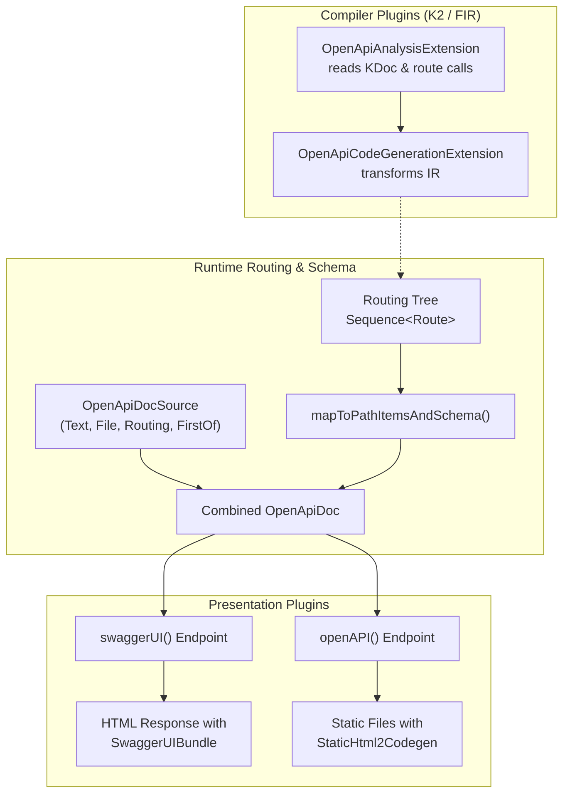
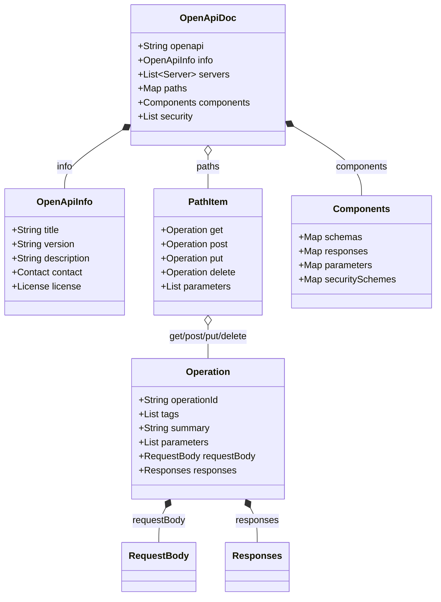
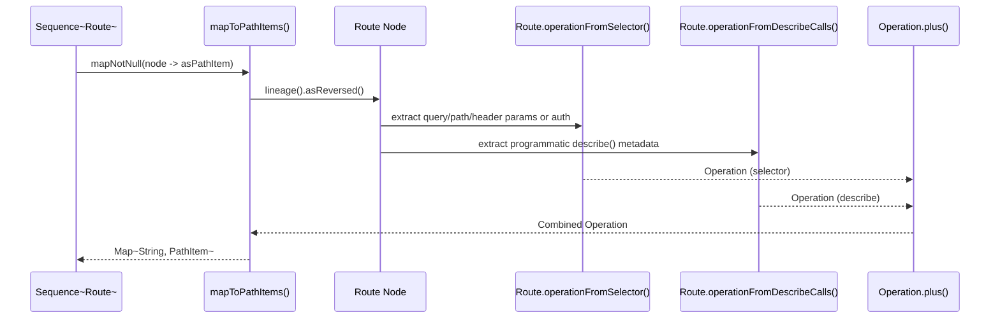

# OpenAPI and Swagger

<details>
<summary>Relevant source files</summary>

The following files were used as context for generating this wiki page:

- [ktor-server/ktor-server-plugins/ktor-server-swagger/jvm/src/io/ktor/server/plugins/swagger/Swagger.kt](https://github.com/ktorio/ktor/blob/main/ktor-server/ktor-server-plugins/ktor-server-swagger/jvm/src/io/ktor/server/plugins/swagger/Swagger.kt)
- [ktor-server/ktor-server-plugins/ktor-server-routing-openapi/common/src/io/ktor/server/routing/openapi/OpenApiRoutes.kt](https://github.com/ktorio/ktor/blob/main/ktor-server/ktor-server-plugins/ktor-server-routing-openapi/common/src/io/ktor/server/routing/openapi/OpenApiRoutes.kt)
- [ktor-compiler-plugin/testData/openapi/RouteFunctions.expected.json](https://github.com/ktorio/ktor/blob/main/ktor-compiler-plugin/testData/openapi/RouteFunctions.expected.json)
- [ktor-server/ktor-server-plugins/ktor-server-routing-openapi/common/src/io/ktor/server/routing/openapi/OpenApiDocSource.kt](https://github.com/ktorio/ktor/blob/main/ktor-server/ktor-server-plugins/ktor-server-routing-openapi/common/src/io/ktor/server/routing/openapi/OpenApiDocSource.kt)
- [ktor-compiler-plugin/src/io/ktor/openapi/fir/OpenApiAnalysisExtension.kt](https://github.com/ktorio/ktor/blob/main/ktor-compiler-plugin/src/io/ktor/openapi/fir/OpenApiAnalysisExtension.kt)
- [ktor-server/ktor-server-plugins/ktor-server-openapi/jvm/src/io/ktor/server/plugins/openapi/OpenAPI.kt](https://github.com/ktorio/ktor/blob/main/ktor-server/ktor-server-plugins/ktor-server-openapi/jvm/src/io/ktor/server/plugins/openapi/OpenAPI.kt)
- [ktor-compiler-plugin/testData/openapi/RouteFunctions.kt](https://github.com/ktorio/ktor/blob/main/ktor-compiler-plugin/testData/openapi/RouteFunctions.kt)
- [ktor-server/ktor-server-plugins/ktor-server-routing-openapi/common/src/io/ktor/server/routing/openapi/OpenApiDocUtils.kt](https://github.com/ktorio/ktor/blob/main/ktor-server/ktor-server-plugins/ktor-server-routing-openapi/common/src/io/ktor/server/routing/openapi/OpenApiDocUtils.kt)
- [ktor-compiler-plugin/testData/openapi/Resources.kt](https://github.com/ktorio/ktor/blob/main/ktor-compiler-plugin/testData/openapi/Resources.kt)
- [ktor-compiler-plugin/src/io/ktor/compiler/KtorCompilerPluginRegistrar.kt](https://github.com/ktorio/ktor/blob/main/ktor-compiler-plugin/src/io/ktor/compiler/KtorCompilerPluginRegistrar.kt)
- [ktor-server/ktor-server-plugins/ktor-server-routing-openapi/common/src/io/ktor/server/routing/openapi/DescribeRoute.kt](https://github.com/ktorio/ktor/blob/main/ktor-server/ktor-server-plugins/ktor-server-routing-openapi/common/src/io/ktor/server/routing/openapi/DescribeRoute.kt)
- [ktor-compiler-plugin/testData/openapi/KDocOptions.kt](https://github.com/ktorio/ktor/blob/main/ktor-compiler-plugin/testData/openapi/KDocOptions.kt)
- [ktor-shared/ktor-openapi-schema/common/src/io/ktor/openapi/OpenApiDoc.kt](https://github.com/ktorio/ktor/blob/main/ktor-shared/ktor-openapi-schema/common/src/io/ktor/openapi/OpenApiDoc.kt)
- [ktor-server/ktor-server-plugins/ktor-server-routing-openapi/jvm/test-resources/expected/openapi.json](https://github.com/ktorio/ktor/blob/main/ktor-server/ktor-server-plugins/ktor-server-routing-openapi/jvm/test-resources/expected/openapi.json)
- [ktor-server/ktor-server-plugins/ktor-server-routing-openapi/jvm/test-resources/expected/openapi.yaml](https://github.com/ktorio/ktor/blob/main/ktor-server/ktor-server-plugins/ktor-server-routing-openapi/jvm/test-resources/expected/openapi.yaml)
- [ktor-compiler-plugin/test-fixtures/io/ktor/compiler/services/OpenApiRegistrarConfigurator.kt](https://github.com/ktorio/ktor/blob/main/ktor-compiler-plugin/test-fixtures/io/ktor/compiler/services/OpenApiRegistrarConfigurator.kt)
- [ktor-compiler-plugin/testData/openapi/Resources.expected.json](https://github.com/ktorio/ktor/blob/main/ktor-compiler-plugin/testData/openapi/Resources.expected.json)
- [ktor-compiler-plugin/testData/openapi/KDocOptions.expected.json](https://github.com/ktorio/ktor/blob/main/ktor-compiler-plugin/testData/openapi/KDocOptions.expected.json)
- [ktor-server/ktor-server-plugins/ktor-server-openapi/jvm/test-resources/openapi/documentation.yaml](https://github.com/ktorio/ktor/blob/main/ktor-server/ktor-server-plugins/ktor-server-openapi/jvm/test-resources/openapi/documentation.yaml)
- [ktor-compiler-plugin/src/io/ktor/openapi/ir/OpenApiCodeGenerationExtension.kt](https://github.com/ktorio/ktor/blob/main/ktor-compiler-plugin/src/io/ktor/openapi/ir/OpenApiCodeGenerationExtension.kt)
- [ktor-shared/ktor-openapi-schema/common/src/io/ktor/openapi/Operation.kt](https://github.com/ktorio/ktor/blob/main/ktor-shared/ktor-openapi-schema/common/src/io/ktor/openapi/Operation.kt)
- [ktor-http/common/src/io/ktor/http/RangesSpecifier.kt](https://github.com/ktorio/ktor/blob/main/ktor-http/common/src/io/ktor/http/RangesSpecifier.kt)
- [ktor-server/ktor-server-core/common/src/io/ktor/server/routing/RoutingBuilder.kt](https://github.com/ktorio/ktor/blob/main/ktor-server/ktor-server-core/common/src/io/ktor/server/routing/RoutingBuilder.kt)
</details>

## Overview

### Overview Introduction

The OpenAPI and Swagger subsystem in Ktor bridges application routing trees, type-safe resources, and industry-standard OpenAPI (3.1.1) documentation specifications. By combining compiler extensions (`OpenApiAnalysisExtension` and `OpenApiCodeGenerationExtension`), runtime routing introspection (`OpenApiRoutes.kt`), schema inference (`JsonSchemaInference`), and presentation plugins (`swaggerUI` and `openAPI`), Ktor enables developers to maintain documentation alongside application code without manual specification writing.

Sources: [ktor-compiler-plugin/src/io/ktor/compiler/KtorCompilerPluginRegistrar.kt:14-37](https://github.com/ktorio/ktor/blob/main/ktor-compiler-plugin/src/io/ktor/compiler/KtorCompilerPluginRegistrar.kt#L14-L37), [ktor-server/ktor-server-plugins/ktor-server-routing-openapi/common/src/io/ktor/server/routing/openapi/OpenApiRoutes.kt:20-61](https://github.com/ktorio/ktor/blob/main/ktor-server/ktor-server-plugins/ktor-server-routing-openapi/common/src/io/ktor/server/routing/openapi/OpenApiRoutes.kt#L20-L61)

This architecture solves the core problem of documentation drift by extracting path structures, HTTP methods, query/path parameters, request bodies, responses, security constraints, and kotlinx.serialization schemas directly from routing definitions and KDoc annotations.

Sources: [ktor-server/ktor-server-plugins/ktor-server-routing-openapi/common/src/io/ktor/server/routing/openapi/OpenApiRoutes.kt:145-218](https://github.com/ktorio/ktor/blob/main/ktor-server/ktor-server-plugins/ktor-server-routing-openapi/common/src/io/ktor/server/routing/openapi/OpenApiRoutes.kt#L145-L218), [ktor-compiler-plugin/src/io/ktor/openapi/fir/OpenApiAnalysisExtension.kt:53-85](https://github.com/ktorio/ktor/blob/main/ktor-compiler-plugin/src/io/ktor/openapi/fir/OpenApiAnalysisExtension.kt#L53-L85)

The system is structured around several modular components: `ktor-openapi-schema` for data modeling, `ktor-server-routing-openapi` for route-to-specification compilation and merging, and UI rendering plugins that integrate Swagger UI bundles or static HTML generators (`StaticHtml2Codegen`) directly into Ktor routing endpoints.

Sources: [ktor-server/ktor-server-plugins/ktor-server-swagger/jvm/src/io/ktor/server/plugins/swagger/Swagger.kt:91-168](https://github.com/ktorio/ktor/blob/main/ktor-server/ktor-server-plugins/ktor-server-swagger/jvm/src/io/ktor/server/plugins/swagger/Swagger.kt#L91-L168), [ktor-server/ktor-server-plugins/ktor-server-openapi/jvm/src/io/ktor/server/plugins/openapi/OpenAPI.kt:56-82](https://github.com/ktorio/ktor/blob/main/ktor-server/ktor-server-plugins/ktor-server-openapi/jvm/src/io/ktor/server/plugins/openapi/OpenAPI.kt#L56-L82)



Sources: [ktor-compiler-plugin/src/io/ktor/compiler/KtorCompilerPluginRegistrar.kt:14-37](https://github.com/ktorio/ktor/blob/main/ktor-compiler-plugin/src/io/ktor/compiler/KtorCompilerPluginRegistrar.kt#L14-L37), [ktor-server/ktor-server-plugins/ktor-server-routing-openapi/common/src/io/ktor/server/routing/openapi/OpenApiRoutes.kt:20-61](https://github.com/ktorio/ktor/blob/main/ktor-server/ktor-server-plugins/ktor-server-routing-openapi/common/src/io/ktor/server/routing/openapi/OpenApiRoutes.kt#L20-L61)

## OpenAPI Schema Models and DSL

The foundation of the specification engine is the `ktor-openapi-schema` module, which defines immutable data classes representing OpenAPI 3.1.1 objects. Rooted at `OpenApiDoc`, the model hierarchy supports extension properties (`x-` vendor extensions) via `ExtensibleMixinSerializer` and provides builder DSLs for constructing documents programmatically.

Sources: [ktor-shared/ktor-openapi-schema/common/src/io/ktor/openapi/OpenApiDoc.kt:103-170](https://github.com/ktorio/ktor/blob/main/ktor-shared/ktor-openapi-schema/common/src/io/ktor/openapi/OpenApiDoc.kt#L103-L170), [ktor-shared/ktor-openapi-schema/common/src/io/ktor/openapi/OpenApiDoc.kt:181-261](https://github.com/ktorio/ktor/blob/main/ktor-shared/ktor-openapi-schema/common/src/io/ktor/openapi/OpenApiDoc.kt#L181-L261)



Sources: [ktor-shared/ktor-openapi-schema/common/src/io/ktor/openapi/OpenApiDoc.kt:106-143](https://github.com/ktorio/ktor/blob/main/ktor-shared/ktor-openapi-schema/common/src/io/ktor/openapi/OpenApiDoc.kt#L106-L143), [ktor-shared/ktor-openapi-schema/common/src/io/ktor/openapi/Operation.kt:38-55](https://github.com/ktorio/ktor/blob/main/ktor-shared/ktor-openapi-schema/common/src/io/ktor/openapi/Operation.kt#L38-L55)

The builders enforce structural constraints. For instance, `Link.Builder` requires either `operationRef` or `operationId`:

```kotlin
require(operationRef != null || operationId != null) {
    "Either operationRef or operationId must be specified"
}
```

Sources: [ktor-shared/ktor-openapi-schema/common/src/io/ktor/openapi/Operation.kt:1054-1057](https://github.com/ktorio/ktor/blob/main/ktor-shared/ktor-openapi-schema/common/src/io/ktor/openapi/Operation.kt#L1054-L1057)

Similarly, document extensions require keys starting with `x-`:

```kotlin
require(name.startsWith("x-")) { "Extension name must start with 'x-'" }
```

Sources: [ktor-shared/ktor-openapi-schema/common/src/io/ktor/openapi/OpenApiDoc.kt:235-238](https://github.com/ktorio/ktor/blob/main/ktor-shared/ktor-openapi-schema/common/src/io/ktor/openapi/OpenApiDoc.kt#L235-L238)

Design choices embedded in the schema module balance flexibility with strict validation:

| Design Choice | Benefit | Cost |
| :--- | :--- | :--- |
| `ExtensibleMixinSerializer` delegation | Transparent JSON/YAML serialization of `x-` vendor extension maps | Requires custom mixin serializers for data classes |
| `ReferenceOr<T>` wrapper type | Supports both inline object values and `$ref` component pointers | Additional pattern-matching overhead during tree traversal |
| `KtorDsl` annotated builders | Prevents illegal nesting and provides clean Kotlin DSL syntax | Restricts block scoping to explicit receiver contexts |

Sources: [ktor-shared/ktor-openapi-schema/common/src/io/ktor/openapi/OpenApiDoc.kt:103-170](https://github.com/ktorio/ktor/blob/main/ktor-shared/ktor-openapi-schema/common/src/io/ktor/openapi/OpenApiDoc.kt#L103-L170), [ktor-shared/ktor-openapi-schema/common/src/io/ktor/openapi/Operation.kt:82-86](https://github.com/ktorio/ktor/blob/main/ktor-shared/ktor-openapi-schema/common/src/io/ktor/openapi/Operation.kt#L82-L86)

## Document Sources and Resolution (`OpenApiDocSource`)

The `OpenApiDocSource` sealed interface governs how OpenAPI specifications are loaded or generated at runtime. It supports four distinct source implementations: `Text`, `File`, `Routing`, and `FirstOf`.

Sources: [ktor-server/ktor-server-plugins/ktor-server-routing-openapi/common/src/io/ktor/server/routing/openapi/OpenApiDocSource.kt:20-130](https://github.com/ktorio/ktor/blob/main/ktor-server/ktor-server-plugins/ktor-server-routing-openapi/common/src/io/ktor/server/routing/openapi/OpenApiDocSource.kt#L20-L130)

| Source Implementation | Description | Key Properties / Behavior |
| :--- | :--- | :--- |
| `OpenApiDocSource.Text` | Static string content with a specified content type. | `content: String`, `contentType: ContentType` (defaults to JSON) |
| `OpenApiDocSource.File` | Reads document contents from the file system or resource path. | `path: String`, `contentType` inferred via `ContentType.fromFilePath` |
| `OpenApiDocSource.Routing` | Dynamically generates the document from the Ktor routing tree. | `schemaInference`, `securitySchemes`, `serializeModel`, `routes` |
| `OpenApiDocSource.FirstOf` | Evaluates a list of sources in order and returns the first successful read. | `options: List<OpenApiDocSource>` |

Sources: [ktor-server/ktor-server-plugins/ktor-server-routing-openapi/common/src/io/ktor/server/routing/openapi/OpenApiDocSource.kt:32-130](https://github.com/ktorio/ktor/blob/main/ktor-server/ktor-server-plugins/ktor-server-routing-openapi/common/src/io/ktor/server/routing/openapi/OpenApiDocSource.kt#L32-L130)

When `OpenApiDocSource.Routing.read()` is invoked, it puts the schema inference strategy into application attributes, combines default base documents with security schemes and routing descendants, and serializes the result:

```kotlin
override fun read(application: Application, defaults: OpenApiDoc): Text {
    schemaInference?.let {
        application.attributes.put(JsonSchemaAttributeKey, it)
    }
    val combinedDocument = defaults + securitySchemes(application) + routes(application)
    val content = serializeModel(combinedDocument)
    return Text(content, contentType)
}
```

Sources: [ktor-server/ktor-server-plugins/ktor-server-routing-openapi/common/src/io/ktor/server/routing/openapi/OpenApiDocSource.kt:100-108](https://github.com/ktorio/ktor/blob/main/ktor-server/ktor-server-plugins/ktor-server-routing-openapi/common/src/io/ktor/server/routing/openapi/OpenApiDocSource.kt#L100-L108)

> [!NOTE]
> `OpenApiDocSource.Routing` supports both JSON (`Json::encodeToString`) and YAML (`serializeToYaml`) serialization based on the requested content type.

Sources: [ktor-server/ktor-server-plugins/ktor-server-routing-openapi/common/src/io/ktor/server/routing/openapi/OpenApiDocSource.kt:92-97](https://github.com/ktorio/ktor/blob/main/ktor-server/ktor-server-plugins/ktor-server-routing-openapi/common/src/io/ktor/server/routing/openapi/OpenApiDocSource.kt#L92-L97)

## Routing Introspection and Operation Merging

To convert Ktor's hierarchical routing tree into OpenAPI `PathItem` and `Operation` objects, `OpenApiRoutes.kt` inspects each route node and its lineage. 

Sources: [ktor-server/ktor-server-plugins/ktor-server-routing-openapi/common/src/io/ktor/server/routing/openapi/OpenApiRoutes.kt:124-181](https://github.com/ktorio/ktor/blob/main/ktor-server/ktor-server-plugins/ktor-server-routing-openapi/common/src/io/ktor/server/routing/openapi/OpenApiRoutes.kt#L124-L181)



Sources: [ktor-server/ktor-server-plugins/ktor-server-routing-openapi/common/src/io/ktor/server/routing/openapi/OpenApiRoutes.kt:124-181](https://github.com/ktorio/ktor/blob/main/ktor-server/ktor-server-plugins/ktor-server-routing-openapi/common/src/io/ktor/server/routing/openapi/OpenApiRoutes.kt#L124-L181)

The verified call chain for operation resolution follows this exact execution path:
1. `operation()` accesses the reversed route lineage and resolves the schema inference and default content types.
2. `operationFromSelector()` inspects the route selector and builds parameter definitions or delegates to `operationFromAuthSelector()`.
3. `operationFromAuthSelector()` retrieves authentication provider names and resolves them against global security schemes using `AuthenticationStrategy` (`Optional`, `First` vs `Required`).
4. Within `operationFromAuthSelector()`, `firstSuccessful()` iterates over scheme names and calls `requirement()`, which invokes `optional()` if the strategy dictates optional security.

Sources: [ktor-server/ktor-server-plugins/ktor-server-routing-openapi/common/src/io/ktor/server/routing/openapi/OpenApiRoutes.kt:163-260](https://github.com/ktorio/ktor/blob/main/ktor-server/ktor-server-plugins/ktor-server-routing-openapi/common/src/io/ktor/server/routing/openapi/OpenApiRoutes.kt#L163-L260)

> [!WARNING]
> When merging responses with identical HTTP status codes, Ktor combines their content media types and references, but falls back to taking the first response if they cannot be structurally combined.

Sources: [ktor-server/ktor-server-plugins/ktor-server-routing-openapi/common/src/io/ktor/server/routing/openapi/OpenApiRoutes.kt:332-347](https://github.com/ktorio/ktor/blob/main/ktor-server/ktor-server-plugins/ktor-server-routing-openapi/common/src/io/ktor/server/routing/openapi/OpenApiRoutes.kt#L332-L347)

## Schema Collection and Conflict Resolution

When collecting schemas from route models, `mapToPathItemsAndSchema()` tracks component names to prevent collisions when distinct Kotlin types share the same unqualified class name. 

Sources: [ktor-server/ktor-server-plugins/ktor-server-routing-openapi/common/src/io/ktor/server/routing/openapi/OpenApiRoutes.kt:20-61](https://github.com/ktorio/ktor/blob/main/ktor-server/ktor-server-plugins/ktor-server-routing-openapi/common/src/io/ktor/server/routing/openapi/OpenApiRoutes.kt#L20-L61)

The `uniqueName()` function handles naming conflicts:
```kotlin
fun uniqueName(preferred: String, candidate: JsonSchema): String {
    val existing = jsonSchema[preferred]
    if (existing == null || existing == candidate.copy(title = preferred)) return preferred
    var counter = 2
    while (true) {
        val name = "$preferred$counter"
        val existingAlt = jsonSchema[name]
        if (existingAlt == null || existingAlt == candidate.copy(title = name)) return name
        counter++
    }
}
```

Sources: [ktor-server/ktor-server-plugins/ktor-server-routing-openapi/common/src/io/ktor/server/routing/openapi/OpenApiRoutes.kt:29-39](https://github.com/ktorio/ktor/blob/main/ktor-server/ktor-server-plugins/ktor-server-routing-openapi/common/src/io/ktor/server/routing/openapi/OpenApiRoutes.kt#L29-L39)

If an unqualified title (e.g., `User`) is already occupied by a different schema definition, Ktor falls back to the fully qualified class name, appending numeric suffixes (`User2`, `User3`) if further collisions occur. Once all schemas are collected, `rewriteSchemaComponentReferences()` updates all `$ref` pointers and discriminator mappings across schemas, allOf/oneOf/anyOf compositions, properties, and array items.

Sources: [ktor-server/ktor-server-plugins/ktor-server-routing-openapi/common/src/io/ktor/server/routing/openapi/OpenApiRoutes.kt:42-76](https://github.com/ktorio/ktor/blob/main/ktor-server/ktor-server-plugins/ktor-server-routing-openapi/common/src/io/ktor/server/routing/openapi/OpenApiRoutes.kt#L42-L76)

## Compiler Integration (`OpenApiAnalysisExtension`)

The `ktor-compiler-plugin` package integrates with Kotlin K2 via `FirExtensionRegistrar`. `OpenApiAnalysisExtension` registers `OpenApiFirAdditionalChecksExtension`, which utilizes `OpenApiRouteCallReader` to inspect function calls during compilation.

Sources: [ktor-compiler-plugin/src/io/ktor/openapi/fir/OpenApiAnalysisExtension.kt:27-49](https://github.com/ktorio/ktor/blob/main/ktor-compiler-plugin/src/io/ktor/openapi/fir/OpenApiAnalysisExtension.kt#L27-L49), [ktor-compiler-plugin/src/io/ktor/compiler/KtorCompilerPluginRegistrar.kt:14-37](https://github.com/ktorio/ktor/blob/main/ktor-compiler-plugin/src/io/ktor/compiler/KtorCompilerPluginRegistrar.kt#L14-L37)

```kotlin
private fun isRouteFunction(call: FirFunctionCall): Boolean =
    call.calleeReference.symbol?.packageFqName()?.toString().orEmpty().startsWith("io.ktor")
            && call.resolvedType.classId?.asFqNameString() == ROUTE_INTERFACE
```

Sources: [ktor-compiler-plugin/src/io/ktor/openapi/fir/OpenApiAnalysisExtension.kt:87-90](https://github.com/ktorio/ktor/blob/main/ktor-compiler-plugin/src/io/ktor/openapi/fir/OpenApiAnalysisExtension.kt#L87-L90)

The analysis extension scans Kotlin source files for KDoc comments preceding route function calls. If `onlyCommented` is enabled in `OpenApiProcessorConfig`, routes lacking preceding KDoc comments are skipped. Otherwise, captured `RouteCall` objects are cached and passed to `OpenApiCodeGenerationExtension` for IR transformation.

Sources: [ktor-compiler-plugin/src/io/ktor/openapi/fir/OpenApiAnalysisExtension.kt:53-85](https://github.com/ktorio/ktor/blob/main/ktor-compiler-plugin/src/io/ktor/openapi/fir/OpenApiAnalysisExtension.kt#L53-L85), [ktor-compiler-plugin/src/io/ktor/compiler/KtorCompilerPluginRegistrar.kt:14-37](https://github.com/ktorio/ktor/blob/main/ktor-compiler-plugin/src/io/ktor/compiler/KtorCompilerPluginRegistrar.kt#L14-L37)

## Swagger UI and OpenAPI Hosting Plugins

### Hosting Subsystem Overview

Two dedicated server plugins serve documentation to clients: `swaggerUI` and `openAPI`.

Sources: [ktor-server/ktor-server-plugins/ktor-server-swagger/jvm/src/io/ktor/server/plugins/swagger/Swagger.kt:32-168](https://github.com/ktorio/ktor/blob/main/ktor-server/ktor-server-plugins/ktor-server-swagger/jvm/src/io/ktor/server/plugins/swagger/Swagger.kt#L32-L168), [ktor-server/ktor-server-plugins/ktor-server-openapi/jvm/src/io/ktor/server/plugins/openapi/OpenAPI.kt:34-82](https://github.com/ktorio/ktor/blob/main/ktor-server/ktor-server-plugins/ktor-server-openapi/jvm/src/io/ktor/server/plugins/openapi/OpenAPI.kt#L34-L82)

### Swagger UI Plugin (`Swagger.kt`)
The `swaggerUI` plugin mounts a `GET` endpoint for the Swagger UI HTML page and a corresponding JSON/YAML specification endpoint. It uses Ktor HTML Builder (`respondHtml`) to render the Swagger UI bundle and standalone preset:

```kotlin
public fun Route.swaggerUI(
    path: String,
    block: SwaggerConfig.() -> Unit = {}
): Route {
    val config = SwaggerConfig().apply(block)
    val source = config.source
    val apiUrl = config.remotePath
    val openApiDoc = with(application) {
        async(start = CoroutineStart.LAZY) {
            source.read(this@with, config.buildBaseDoc())
                ?: error("Failed to read OpenAPI document from $source")
        }
    }

    @OptIn(ExperimentalKtorApi::class)
    return route(path) {
        get(apiUrl) {
            val doc = openApiDoc.await()
            call.respondText(doc.content, doc.contentType)
        }.hide()

        get {
            val fullPath = call.request.path()
            val docExpansion = runCatching {
                call.request.queryParameters.getOrFail<String>("docExpansion")
            }.getOrNull()?.takeIf {
                it in docExpansionValues
            }

            call.respondHtml {
                // Renders head, stylesheet links, SwaggerUIBundle script, and onload initialization script
            }
        }.hide()
    }
}
```

Sources: [ktor-server/ktor-server-plugins/ktor-server-swagger/jvm/src/io/ktor/server/plugins/swagger/Swagger.kt:91-168](https://github.com/ktorio/ktor/blob/main/ktor-server/ktor-server-plugins/ktor-server-swagger/jvm/src/io/ktor/server/plugins/swagger/Swagger.kt#L91-L168)

### OpenAPI Generator Plugin (`OpenAPI.kt`)
The `openAPI` plugin utilizes Swagger Codegen (`StaticHtml2Codegen`) to generate static HTML documentation files into an output directory before application startup, serving them via Ktor's `staticFiles` handler.

```kotlin
internal val OpenAPI: RouteScopedPlugin<OpenAPIConfig> = createRouteScopedPlugin("OpenAPI", ::OpenAPIConfig) {
    application.generateFilesBeforeStartup(pluginConfig)
}
```

Sources: [ktor-server/ktor-server-plugins/ktor-server-openapi/jvm/src/io/ktor/server/plugins/openapi/OpenAPI.kt:56-82](https://github.com/ktorio/ktor/blob/main/ktor-server/ktor-server-plugins/ktor-server-openapi/jvm/src/io/ktor/server/plugins/openapi/OpenAPI.kt#L56-L82)

## Runnable Usage Example

The following complete example demonstrates how to configure content negotiation, install routing with type-safe resources or standard routes, and expose both `swaggerUI` and `openAPI` documentation endpoints in a Ktor application:

```kotlin
import io.ktor.http.*
import io.ktor.serialization.kotlinx.json.*
import io.ktor.server.application.*
import io.ktor.server.plugins.contentnegotiation.*
import io.ktor.server.plugins.openapi.*
import io.ktor.server.plugins.swagger.*
import io.ktor.server.response.*
import io.ktor.server.routing.*
import io.ktor.server.routing.openapi.*
import kotlinx.serialization.Serializable

@Serializable
data class Task(val id: String, val title: String, val completed: Boolean)

fun Application.module() {
    install(ContentNegotiation) {
        json()
    }

    routing {
        // Expose Swagger UI powered by the routing tree specification
        swaggerUI("/swagger", "openapi.json") {
            source = OpenApiDocSource.Routing(
                contentType = ContentType.Application.Json
            )
        }

        // Expose static OpenAPI generated documentation
        openAPI("/openapi", "documentation.yaml")

        route("/tasks") {
            get {
                call.respond(listOf(Task("1", "Learn Ktor OpenAPI", false)))
            }
            post {
                val task = call.receive<Task>()
                call.respond(HttpStatusCode.Created, task)
            }
        }
    }
}
```

Sources: [ktor-server/ktor-server-plugins/ktor-server-swagger/jvm/src/io/ktor/server/plugins/swagger/Swagger.kt:32-55](https://github.com/ktorio/ktor/blob/main/ktor-server/ktor-server-plugins/ktor-server-swagger/jvm/src/io/ktor/server/plugins/swagger/Swagger.kt#L32-L55), [ktor-server/ktor-server-plugins/ktor-server-openapi/jvm/src/io/ktor/server/plugins/openapi/OpenAPI.kt:34-41](https://github.com/ktorio/ktor/blob/main/ktor-server/ktor-server-plugins/ktor-server-openapi/jvm/src/io/ktor/server/plugins/openapi/OpenAPI.kt#L34-L41), [ktor-server/ktor-server-plugins/ktor-server-routing-openapi/common/src/io/ktor/server/routing/openapi/OpenApiDocSource.kt:82-112](https://github.com/ktorio/ktor/blob/main/ktor-server/ktor-server-plugins/ktor-server-routing-openapi/common/src/io/ktor/server/routing/openapi/OpenApiDocSource.kt#L82-L112)

## Related

- [[Routing]]
- [[Compiler Plugin]]

