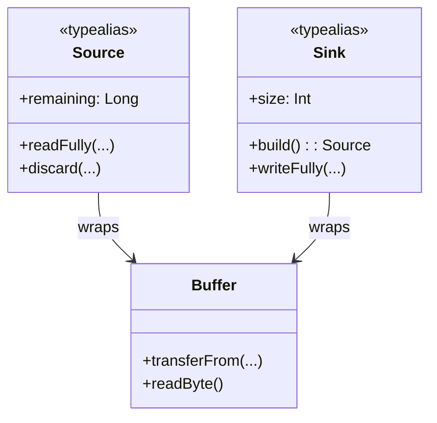
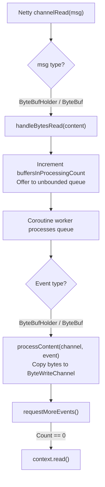

# Packets and Buffers

<details>
<summary>Relevant source files</summary>

The following files were used as context for generating this wiki page:

- [ktor-server/ktor-server-netty/jvm/src/io/ktor/server/netty/cio/RequestBodyHandler.kt](https://github.com/ktorio/ktor/blob/main/ktor-server/ktor-server-netty/jvm/src/io/ktor/server/netty/cio/RequestBodyHandler.kt)
- [ktor-io/common/src/io/ktor/utils/io/core/ByteReadPacket.kt](https://github.com/ktorio/ktor/blob/main/ktor-io/common/src/io/ktor/utils/io/core/ByteReadPacket.kt)
- [ktor-http/ktor-http-cio/jvm/src/io/ktor/http/cio/RequestResponseBuilder.kt](https://github.com/ktorio/ktor/blob/main/ktor-http/ktor-http-cio/jvm/src/io/ktor/http/cio/RequestResponseBuilder.kt)
- [ktor-io/common/src/io/ktor/utils/io/ByteReadChannelOperations.kt](https://github.com/ktorio/ktor/blob/main/ktor-io/common/src/io/ktor/utils/io/ByteReadChannelOperations.kt)
- [ktor-shared/ktor-websockets/jvm/src/io/ktor/websocket/WebSocketReader.kt](https://github.com/ktorio/ktor/blob/main/ktor-shared/ktor-websockets/jvm/src/io/ktor/websocket/WebSocketReader.kt)
- [ktor-shared/ktor-websockets/jvm/src/io/ktor/websocket/SimpleFrameCollector.kt](https://github.com/ktorio/ktor/blob/main/ktor-shared/ktor-websockets/jvm/src/io/ktor/websocket/SimpleFrameCollector.kt)
- [ktor-io/jvm/src/io/ktor/utils/io/jvm/javaio/Reading.kt](https://github.com/ktorio/ktor/blob/main/ktor-io/jvm/src/io/ktor/utils/io/jvm/javaio/Reading.kt)
- [ktor-io/jvm/src/io/ktor/utils/io/ByteReadChannelOperations.jvm.kt](https://github.com/ktorio/ktor/blob/main/ktor-io/jvm/src/io/ktor/utils/io/ByteReadChannelOperations.jvm.kt)
- [ktor-http/ktor-http-cio/common/src/io/ktor/http/cio/internals/CharArrayBuilder.kt](https://github.com/ktorio/ktor/blob/main/ktor-http/ktor-http-cio/common/src/io/ktor/http/cio/internals/CharArrayBuilder.kt)
- [ktor-io/jvm/src/io/ktor/utils/io/core/ByteReadPacketExtensions.jvm.kt](https://github.com/ktorio/ktor/blob/main/ktor-io/jvm/src/io/ktor/utils/io/core/ByteReadPacketExtensions.jvm.kt)
- [ktor-http/ktor-http-cio/nonJvm/src/io/ktor/http/cio/RequestResponseBuilder.nonJvm.kt](https://github.com/ktorio/ktor/blob/main/ktor-http/ktor-http-cio/nonJvm/src/io/ktor/http/cio/RequestResponseBuilder.nonJvm.kt)
- [ktor-io/common/src/io/ktor/utils/io/core/BytePacketBuilder.kt](https://github.com/ktorio/ktor/blob/main/ktor-io/common/src/io/ktor/utils/io/core/BytePacketBuilder.kt)
- [ktor-server/ktor-server-jetty-jakarta/jvm/src/io/ktor/server/jetty/jakarta/internal/EndPointChannels.kt](https://github.com/ktorio/ktor/blob/main/ktor-server/ktor-server-jetty-jakarta/jvm/src/io/ktor/server/jetty/jakarta/internal/EndPointChannels.kt)
- [ktor-network/jvm/src/io/ktor/network/util/Pools.kt](https://github.com/ktorio/ktor/blob/main/ktor-network/jvm/src/io/ktor/network/util/Pools.kt)
- [ktor-server/ktor-server-jetty/jvm/src/io/ktor/server/jetty/internal/EndPointChannels.kt](https://github.com/ktorio/ktor/blob/main/ktor-server/ktor-server-jetty/jvm/src/io/ktor/server/jetty/internal/EndPointChannels.kt)
- [ktor-io/jvm/src/io/ktor/utils/io/pool/ByteBufferPools.kt](https://github.com/ktorio/ktor/blob/main/ktor-io/jvm/src/io/ktor/utils/io/pool/ByteBufferPools.kt)
- [ktor-io/jvm/src/io/ktor/utils/io/core/BytePacketBuilderExtensions.jvm.kt](https://github.com/ktorio/ktor/blob/main/ktor-io/jvm/src/io/ktor/utils/io/core/BytePacketBuilderExtensions.jvm.kt)
- [ktor-utils/jvm/src/io/ktor/util/cio/ByteBufferPool.kt](https://github.com/ktorio/ktor/blob/main/ktor-utils/jvm/src/io/ktor/util/cio/ByteBufferPool.kt)
- [ktor-io/common/src/io/ktor/utils/io/core/internal/ChunkBuffer.kt](https://github.com/ktorio/ktor/blob/main/ktor-io/common/src/io/ktor/utils/io/core/internal/ChunkBuffer.kt)
- [ktor-io/jvm/src/io/ktor/utils/io/core/internal/ChunkBufferJvm.kt](https://github.com/ktorio/ktor/blob/main/ktor-io/jvm/src/io/ktor/utils/io/core/internal/ChunkBufferJvm.kt)
- [ktor-http/ktor-http-cio/common/src/io/ktor/http/cio/internals/CharArrayPool.kt](https://github.com/ktorio/ktor/blob/main/ktor-http/ktor-http-cio/common/src/io/ktor/http/cio/internals/CharArrayPool.kt)
- [ktor-network/posix/src/io/ktor/network/util/Pools.kt](https://github.com/ktorio/ktor/blob/main/ktor-network/posix/src/io/ktor/network/util/Pools.kt)
- [ktor-utils/jvm/src/io/ktor/util/NIO.kt](https://github.com/ktorio/ktor/blob/main/ktor-utils/jvm/src/io/ktor/util/NIO.kt)
- [ktor-client/ktor-client-core/jvm/src/io/ktor/client/utils/CIOJvm.kt](https://github.com/ktorio/ktor/blob/main/ktor-client/ktor-client-core/jvm/src/io/ktor/client/utils/CIOJvm.kt)
- [ktor-utils/jvm/src/io/ktor/util/cio/ReadersJvm.kt](https://github.com/ktorio/ktor/blob/main/ktor-utils/jvm/src/io/ktor/util/cio/ReadersJvm.kt)
- [ktor-io/common/src/io/ktor/utils/io/core/Builder.kt](https://github.com/ktorio/ktor/blob/main/ktor-io/common/src/io/ktor/utils/io/core/Builder.kt)
- [ktor-io/common/src/io/ktor/utils/io/pool/ByteArrayPool.kt](https://github.com/ktorio/ktor/blob/main/ktor-io/common/src/io/ktor/utils/io/pool/ByteArrayPool.kt)
- [ktor-server/ktor-server-netty/jvm/src/io/ktor/server/netty/NettyDirectEncoder.kt](https://github.com/ktorio/ktor/blob/main/ktor-server/ktor-server-netty/jvm/src/io/ktor/server/netty/NettyDirectEncoder.kt)
- [ktor-server/ktor-server-netty/jvm/src/io/ktor/server/netty/http/NettyByteBufWriter.kt](https://github.com/ktorio/ktor/blob/main/ktor-server/ktor-server-netty/jvm/src/io/ktor/server/netty/http/NettyByteBufWriter.kt)
- [ktor-server/ktor-server-netty/jvm/src/io/ktor/server/netty/NettyDirectDecoder.kt](https://github.com/ktorio/ktor/blob/main/ktor-server/ktor-server-netty/jvm/src/io/ktor/server/netty/NettyDirectDecoder.kt)
</details>

## Overview

### Overview Sub-section
The Ktor networking and I/O architecture relies heavily on efficient buffer management, stream processing, and packet construction layers. At its core, the subsystem bridges asynchronous network engines (such as Netty, Jetty, and Ktor Network NIO sockets) with Ktor's coroutine-native `ByteReadChannel` and `ByteWriteChannel` abstractions. By aliasing legacy types onto `kotlinx.io` primitives (`Source`, `Sink`, and `Buffer`), Ktor provides a unified, cross-platform memory and stream handling model.

Managing memory efficiently under high network concurrency presents significant performance challenges, notably garbage collection pressure and buffer allocation overhead. To combat this, Ktor implements robust pooling strategies across multiple layers, including direct and heap `ByteBufferPool` implementations, `ByteArrayPool`, and `CharArrayPool`. These pools recycle chunks of memory to prevent frequent allocations during network read loops, HTTP request/response generation, and WebSocket frame collection.

The packet and buffer infrastructure governs data flow across diverse transport mechanisms. Network frames received by server connectors are funneled through asynchronous coroutine workers, parsed into typed structures, and made available to applications via structured channels. Understanding the interaction between raw NIO/Netty buffers, memory pools, and high-level packet builders is essential for diagnosing performance bottlenecks, customizing engine integrations, and writing efficient protocol handlers.

Sources: [ktor-io/common/src/io/ktor/utils/io/core/ByteReadPacket.kt:12-17](https://github.com/ktorio/ktor/blob/main/ktor-io/common/src/io/ktor/utils/io/core/ByteReadPacket.kt#L12-L17)
Sources: [ktor-io/jvm/src/io/ktor/utils/io/pool/ByteBufferPools.kt:13-29](https://github.com/ktorio/ktor/blob/main/ktor-io/jvm/src/io/ktor/utils/io/pool/ByteBufferPools.kt#L13-L29)
Sources: [ktor-network/jvm/src/io/ktor/network/util/Pools.kt:20-21](https://github.com/ktorio/ktor/blob/main/ktor-network/jvm/src/io/ktor/network/util/Pools.kt#L20-L21)

---

## Buffer Pooling and Memory Management

### Pool Implementations
Ktor implements dedicated memory pooling abstractions to reuse off-heap (`direct`) and heap-allocated `ByteBuffer`, `ByteArray`, and `CharArray` instances. The primary pool implementations extend `DefaultPool<T>`, providing pre-allocated capacities, instance validation, and automatic resetting on recycling.

The buffer management subsystem provides specialized pools tailored to network transport characteristics, datagram sizing, and character array construction.

| Pool Class / Property | Default Capacity | Default Buffer Size | Target Usage / Characteristics |
| :--- | :--- | :--- | :--- |
| `ByteBufferPool` | 2000 | 4096 bytes | General-purpose heap byte buffers |
| `DirectByteBufferPool` | 2000 | 4096 bytes | Off-heap direct byte buffers for zero-copy I/O |
| `DefaultByteBufferPool` | 4096 | 4096 bytes | General-purpose networking byte buffer pool |
| `DefaultDatagramByteBufferPool` | 2048 | `MAX_DATAGRAM_SIZE` | UDP datagram buffering |
| `KtorDefaultPool` | 2048 | 4098 bytes | Client/server engine default heap pool |
| `KtorDefaultDirectPool` | 2048 | 4098 bytes | Client/server engine default direct pool |
| `ByteArrayPool` | 128 | 4096 bytes | General-purpose byte array pool |
| `CharArrayPool` | 4096 | 2048 chars | Character array pool (`CHAR_BUFFER_ARRAY_LENGTH`) |

Sources: [ktor-io/jvm/src/io/ktor/utils/io/pool/ByteBufferPools.kt:13-47](https://github.com/ktorio/ktor/blob/main/ktor-io/jvm/src/io/ktor/utils/io/pool/ByteBufferPools.kt#L13-L47)
Sources: [ktor-network/jvm/src/io/ktor/network/util/Pools.kt:20-29](https://github.com/ktorio/ktor/blob/main/ktor-network/jvm/src/io/ktor/network/util/Pools.kt#L20-L29)
Sources: [ktor-utils/jvm/src/io/ktor/util/cio/ByteBufferPool.kt:10-26](https://github.com/ktorio/ktor/blob/main/ktor-utils/jvm/src/io/ktor/util/cio/ByteBufferPool.kt#L10-L26)
Sources: [ktor-io/common/src/io/ktor/utils/io/pool/ByteArrayPool.kt:7-12](https://github.com/ktorio/ktor/blob/main/ktor-io/common/src/io/ktor/utils/io/pool/ByteArrayPool.kt#L7-L12)
Sources: [ktor-http/ktor-http-cio/common/src/io/ktor/http/cio/internals/CharArrayPool.kt:11-28](https://github.com/ktorio/ktor/blob/main/ktor-http/ktor-http-cio/common/src/io/ktor/http/cio/internals/CharArrayPool.kt#L11-L28)

### Instance Validation and Lifecycle
When borrowing instances from `ByteBufferPool` or `DirectByteBufferPool`, the pool executes `clearInstance` to reset the buffer position and restore `ByteOrder.BIG_ENDIAN`. During recycling, `validateInstance` verifies that buffer capacities match the expected pool configuration and confirms heap versus direct allocation constraints:

```kotlin
public class ByteBufferPool(
    capacity: Int = DEFAULT_POOL_CAPACITY,
    public val bufferSize: Int = DEFAULT_BUFFER_SIZE
) : DefaultPool<ByteBuffer>(capacity) {

    override fun produceInstance(): ByteBuffer = ByteBuffer.allocate(bufferSize)!!

    override fun clearInstance(instance: ByteBuffer): ByteBuffer = instance.apply {
        clear()
        order(ByteOrder.BIG_ENDIAN)
    }

    override fun validateInstance(instance: ByteBuffer) {
        check(instance.capacity() == bufferSize)
        check(!instance.isDirect)
    }
}
```

> [!NOTE]
> `DirectByteBufferPool` enforces `instance.isDirect == true`, ensuring that buffers passed to native or NIO channel operations avoid intermediate heap copying.

Sources: [ktor-io/jvm/src/io/ktor/utils/io/pool/ByteBufferPools.kt:13-47](https://github.com/ktorio/ktor/blob/main/ktor-io/jvm/src/io/ktor/utils/io/pool/ByteBufferPools.kt#L13-L47)

---

## Packets and Builders (`kotlinx.io` Integration)

### Core Types and Architecture
Ktor re-exports and aliases core packet and sink types onto `kotlinx.io`. `ByteReadPacket` is type-aliased to `Source`, and `BytePacketBuilder` is type-aliased to `Sink`, backed by `kotlinx.io.Buffer`.



Sources: [ktor-io/common/src/io/ktor/utils/io/core/ByteReadPacket.kt:12-17](https://github.com/ktorio/ktor/blob/main/ktor-io/common/src/io/ktor/utils/io/core/ByteReadPacket.kt#L12-L17)
Sources: [ktor-io/common/src/io/ktor/utils/io/core/BytePacketBuilder.kt:12-17](https://github.com/ktorio/ktor/blob/main/ktor-io/common/src/io/ktor/utils/io/core/BytePacketBuilder.kt#L12-L17)

### Packet Building and Manipulation
Packets allow structured writing and reading of binary and textual data. The `buildPacket` builder DSL creates a temporary `Sink`, executes the provided population block, and returns the resulting `Source`:

```kotlin
public inline fun buildPacket(block: Sink.() -> Unit): Source {
    contract {
        callsInPlace(block, InvocationKind.EXACTLY_ONCE)
    }

    val builder = kotlinx.io.Buffer()
    block(builder)
    return builder
}
```

HTTP request and response construction is managed by `RequestResponseBuilder`, which wraps a `BytePacketBuilder` (`Sink`) to append status lines, request lines, header fields, and raw byte content before emitting a compiled `Source`:

```kotlin
public actual class RequestResponseBuilder actual constructor() {
    private val packet = BytePacketBuilder()

    public actual fun responseLine(version: CharSequence, status: Int, statusText: CharSequence) {
        packet.writeText(version)
        packet.writeByte(SP)
        packet.writeText(status.toString())
        packet.writeByte(SP)
        packet.writeText(statusText)
        packet.writeByte(CR)
        packet.writeByte(LF)
    }

    public actual fun build(): Source = packet.build()
    public actual fun release() {
        packet.close()
    }
}
```

Sources: [ktor-io/common/src/io/ktor/utils/io/core/BytePacketBuilder.kt:12-38](https://github.com/ktorio/ktor/blob/main/ktor-io/common/src/io/ktor/utils/io/core/BytePacketBuilder.kt#L12-L38)
Sources: [ktor-http/ktor-http-cio/jvm/src/io/ktor/http/cio/RequestResponseBuilder.kt:18-117](https://github.com/ktorio/ktor/blob/main/ktor-http/ktor-http-cio/jvm/src/io/ktor/http/cio/RequestResponseBuilder.kt#L18-L117)
Sources: [ktor-io/common/src/io/ktor/utils/io/core/Builder.kt:16-24](https://github.com/ktorio/ktor/blob/main/ktor-io/common/src/io/ktor/utils/io/core/Builder.kt#L16-L24)

---

## Channel Read and Write Operations

### Execution Walkthrough: Reading Lines (`readLineStrictTo`)
Ktor channels (`ByteReadChannel` and `ByteWriteChannel`) provide asynchronous stream processing primitives. Operations on channels include primitive reading, line parsing, and buffer transferring.

Reading lines strictly with length limits and configurable line endings (`LineEnding.Default` vs `LineEnding.Lenient`) executes a precise stateful scan across internal buffer chunks:

1. **Buffer Retrieval:** `internalReadLineTo` retrieves the underlying `readBuffer` once per line invocation.
2. **Content Availability Check:** If `readBuffer.exhausted()` is true, it suspends via `awaitContent()`. If closed, it returns `-1`.
3. **Delimiter Scanning:** It scans for line feed (`LF`, `\n`) up to the remaining character limit using `readBuffer.indexOf(LF, endIndex = limitLeft)`.
4. **Sole Carriage Return Check:** In lenient mode (`LineEnding.Lenient`), `scanForSoleCr` inspects for lone carriage returns (`CR`, `\r`).
5. **String Transfer & Discard:** It transfers non-delimiter characters to the destination `Appendable` via `transferString`, discards the delimiter bytes (`1` byte for LF, `2` bytes for CRLF), and returns the consumed count.

> [!CAUTION]
> `readLineStrictTo` consumes bytes from the channel and appends them to the output buffer even if it fails to complete or throws `TooLongLineException`.

Sources: [ktor-io/common/src/io/ktor/utils/io/ByteReadChannelOperations.kt:682-798](https://github.com/ktorio/ktor/blob/main/ktor-io/common/src/io/ktor/utils/io/ByteReadChannelOperations.kt#L682-L798)
Sources: [ktor-io/common/src/io/ktor/utils/io/ByteReadChannelOperations.kt:666-680](https://github.com/ktorio/ktor/blob/main/ktor-io/common/src/io/ktor/utils/io/ByteReadChannelOperations.kt#L666-L680)
Sources: [ktor-io/common/src/io/ktor/utils/io/ByteReadChannelOperations.kt:43-49](https://github.com/ktorio/ktor/blob/main/ktor-io/common/src/io/ktor/utils/io/ByteReadChannelOperations.kt#L43-L49)
Sources: [ktor-io/common/src/io/ktor/utils/io/ByteReadChannelOperations.kt:33-36](https://github.com/ktorio/ktor/blob/main/ktor-io/common/src/io/ktor/utils/io/ByteReadChannelOperations.kt#L33-L36)

---

## Server Engine Integrations: Netty Pipeline

### RequestBodyHandler Control Flow
The Netty server engine integrates NIO buffers with Ktor channels via `RequestBodyHandler`, `NettyDirectDecoder`, and `NettyDirectEncoder`.

`RequestBodyHandler` is a Netty `ChannelInboundHandlerAdapter` that bridges Netty's event-driven inbound buffer callbacks into Ktor's coroutine-based `ByteWriteChannel` queue.



Sources: [ktor-server/ktor-server-netty/jvm/src/io/ktor/server/netty/cio/RequestBodyHandler.kt:18-214](https://github.com/ktorio/ktor/blob/main/ktor-server/ktor-server-netty/jvm/src/io/ktor/server/netty/cio/RequestBodyHandler.kt#L18-L214)
Sources: [ktor-server/ktor-server-netty/jvm/src/io/ktor/server/netty/NettyDirectEncoder.kt:12-26](https://github.com/ktorio/ktor/blob/main/ktor-server/ktor-server-netty/jvm/src/io/ktor/server/netty/NettyDirectEncoder.kt#L12-L26)
Sources: [ktor-server/ktor-server-netty/jvm/src/io/ktor/server/netty/NettyDirectDecoder.kt:11-16](https://github.com/ktorio/ktor/blob/main/ktor-server/ktor-server-netty/jvm/src/io/ktor/server/netty/NettyDirectDecoder.kt#L11-L16)

### Backpressure and Flow Control Guard
Flow control is maintained by tracking active buffers in processing. When Netty delivers a `ByteBuf`, `handleBytesRead` increments `buffersInProcessingCount` and offers the buffer to the queue:

```kotlin
private fun handleBytesRead(content: ReferenceCounted) {
    buffersInProcessingCount.incrementAndGet()
    if (!queue.trySend(content).isSuccess) {
        content.release()
        throw IllegalStateException("Unable to process received buffer: queue offer failed")
    }
}
```

As the coroutine worker finishes processing content chunks, `requestMoreEvents()` decrements the counter. When the count reaches zero, it invokes `context.read()` to signal Netty to read more network data:

```kotlin
private fun requestMoreEvents() {
    if (buffersInProcessingCount.decrementAndGet() == 0) {
        context.read()
    }
}
```

Sources: [ktor-server/ktor-server-netty/jvm/src/io/ktor/server/netty/cio/RequestBodyHandler.kt:148-152](https://github.com/ktorio/ktor/blob/main/ktor-server/ktor-server-netty/jvm/src/io/ktor/server/netty/cio/RequestBodyHandler.kt#L148-L152)
Sources: [ktor-server/ktor-server-netty/jvm/src/io/ktor/server/netty/cio/RequestBodyHandler.kt:182-188](https://github.com/ktorio/ktor/blob/main/ktor-server/ktor-server-netty/jvm/src/io/ktor/server/netty/cio/RequestBodyHandler.kt#L182-L188)

---

## Server Engine Integrations: Jetty EndPoint Channels

### EndPointReader State Machine
Jetty server integration uses `EndPointReader` and `endPointWriter` to bridge Jetty's asynchronous `EndPoint` I/O callbacks with Ktor's `ByteWriteChannel` and `ByteReadChannel`.

`EndPointReader` extends Jetty's `AbstractConnection` and implements `Connection.UpgradeTo`. It launches a coroutine worker that alternates between filling buffers from the Jetty endpoint and writing them to Ktor's `ByteWriteChannel`:

```kotlin
private fun runReader(): Job {
    return launch(EndpointReaderCoroutineName + Dispatchers.Unconfined) {
        try {
            while (true) {
                buffer.clear()
                suspendCancellableCoroutine<Unit> { continuation ->
                    currentHandler.compareAndSet(null, continuation)
                    fillInterested()
                }

                channel.writeFully(buffer)
            }
        } catch (cause: ClosedChannelException) {
            channel.flushAndClose()
        } catch (cause: Throwable) {
            channel.close(cause)
        } finally {
            channel.flushAndClose()
            JettyWebSocketPool.recycle(buffer)
        }
    }
}
```

When Jetty invokes `onFillable()`, the connection resumes the suspended coroutine continuation, allowing the worker to write the filled buffer to the Ktor write channel:

```kotlin
override fun onFillable() {
    val handler = currentHandler.getAndSet(null) ?: return
    buffer.flip()
    val count = try {
        endPoint.fill(buffer)
    } catch (cause: Throwable) {
        handler.resumeWithException(ClosedChannelException())
    }

    if (count == -1) {
        handler.resumeWithException(ClosedChannelException())
    } else {
        handler.resume(Unit)
    }
}
```

Sources: [ktor-server/ktor-server-jetty/jvm/src/io/ktor/server/jetty/internal/EndPointChannels.kt:28-61](https://github.com/ktorio/ktor/blob/main/ktor-server/ktor-server-jetty/jvm/src/io/ktor/server/jetty/internal/EndPointChannels.kt#L28-L61)
Sources: [ktor-server/ktor-server-jetty-jakarta/jvm/src/io/ktor/server/jetty/jakarta/internal/EndPointChannels.kt:28-61](https://github.com/ktorio/ktor/blob/main/ktor-server/ktor-server-jetty-jakarta/jvm/src/io/ktor/server/jetty/jakarta/internal/EndPointChannels.kt#L28-L61)

---

## WebSocket Frame Collection and Parsing

### WebSocketReader Parsing Loop
WebSocket communication requires parsing continuous byte streams into discrete `Frame` objects. Ktor accomplishes this via `WebSocketReader` and `SimpleFrameCollector`.

`WebSocketReader` continuously reads from a `ByteReadChannel` into a pooled `ByteBuffer`, driving the `FrameParser` and `SimpleFrameCollector`:

```kotlin
private suspend fun readLoop(buffer: ByteBuffer) {
    buffer.clear()

    while (state != State.CLOSED) {
        if (byteChannel.readAvailable(buffer) == -1) {
            state = State.CLOSED
            break
        }

        buffer.flip()
        parseLoop(buffer)
        buffer.compact()
    }
}
```

The `parseLoop` function processes headers and body frames:

```kotlin
private suspend fun parseLoop(buffer: ByteBuffer) {
    while (buffer.hasRemaining()) {
        when (state) {
            State.HEADER -> {
                frameParser.frame(buffer)

                if (frameParser.bodyReady) {
                    state = State.BODY
                    if (frameParser.length > Int.MAX_VALUE || frameParser.length > maxFrameSize) {
                        throw FrameTooBigException(frameParser.length)
                    }

                    collector.start(frameParser.length.toInt(), buffer)
                    handleFrameIfProduced()
                } else {
                    return
                }
            }

            State.BODY -> {
                collector.handle(buffer)
                handleFrameIfProduced()
            }

            State.CLOSED -> return
        }
    }
}
```

Sources: [ktor-shared/ktor-websockets/jvm/src/io/ktor/websocket/WebSocketReader.kt:78-91](https://github.com/ktorio/ktor/blob/main/ktor-shared/ktor-websockets/jvm/src/io/ktor/websocket/WebSocketReader.kt#L78-L91)
Sources: [ktor-shared/ktor-websockets/jvm/src/io/ktor/websocket/SimpleFrameCollector.kt:10-50](https://github.com/ktorio/ktor/blob/main/ktor-shared/ktor-websockets/jvm/src/io/ktor/websocket/SimpleFrameCollector.kt#L10-L50)

### SimpleFrameCollector Masking and Extraction
`SimpleFrameCollector` accumulates frame payloads across multiple buffer chunks. Once complete, `take()` applies XOR masking keys if present (using `maskBuffer`), slices the buffer view, and produces a read-only buffer:

```kotlin
public fun take(maskKey: Int?): ByteBuffer = buffer!!.run {
    flip()

    val view = slice()

    if (maskKey != null) {
        maskBuffer.clear()
        maskBuffer.asIntBuffer().put(maskKey)
        maskBuffer.clear()

        view.xor(maskBuffer)
    }

    buffer = null
    view.asReadOnlyBuffer()
}
```

Sources: [ktor-shared/ktor-websockets/jvm/src/io/ktor/websocket/SimpleFrameCollector.kt:34-49](https://github.com/ktorio/ktor/blob/main/ktor-shared/ktor-websockets/jvm/src/io/ktor/websocket/SimpleFrameCollector.kt#L34-L49)

---

## Design Choices and Trade-Offs

The packet and buffer architecture makes several deliberate design trade-offs to balance memory safety, performance, and cross-platform compatibility.

| Design Choice | Benefit | Cost / Trade-Off |
| :--- | :--- | :--- |
| **Aliasing to `kotlinx.io` (`Source`/`Sink`)** | Unifies Ktor I/O with Kotlin's standard ecosystem libraries | Requires managing deprecation mappings and API shifts across versions |
| **Object Pooling (`ByteBufferPool`, `CharArrayPool`)** | Eliminates allocation churn and GC pressure under high concurrency | Requires rigorous manual recycling (`recycle()`, `close()`) to prevent resource leaks |
| **Unbound Channel Queues in Netty Handler** | Prevent blocking Netty's event loop threads during slow consumer scenarios | Potential unbounded memory growth if consumer coroutines lag significantly behind producers |
| **Unconfined Dispatchers in Jetty/Netty Handlers** | Minimizes coroutine context switching overhead for high-throughput I/O | Requires careful re-entrancy awareness and thread-safety discipline |

Sources: [ktor-io/common/src/io/ktor/utils/io/core/ByteReadPacket.kt:12-17](https://github.com/ktorio/ktor/blob/main/ktor-io/common/src/io/ktor/utils/io/core/ByteReadPacket.kt#L12-L17)
Sources: [ktor-io/jvm/src/io/ktor/utils/io/pool/ByteBufferPools.kt:13-47](https://github.com/ktorio/ktor/blob/main/ktor-io/jvm/src/io/ktor/utils/io/pool/ByteBufferPools.kt#L13-L47)
Sources: [ktor-server/ktor-server-netty/jvm/src/io/ktor/server/netty/cio/RequestBodyHandler.kt:24](https://github.com/ktorio/ktor/blob/main/ktor-server/ktor-server-netty/jvm/src/io/ktor/server/netty/cio/RequestBodyHandler.kt#L24)

## Related

- [[Byte Channels]]

