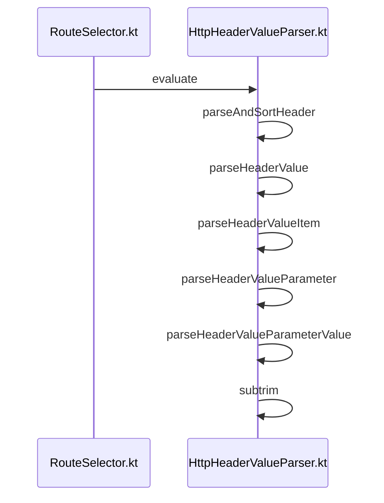
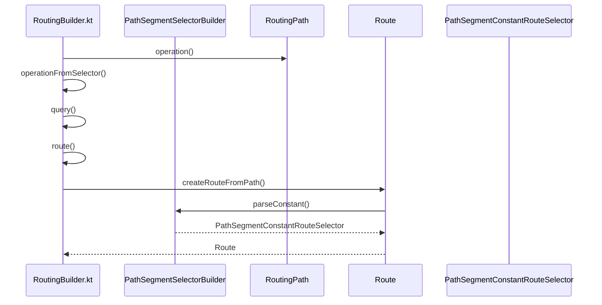

# Routing

<details>
<summary>Relevant source files</summary>

The following files were used as context for generating this wiki page:

- [ktor-server/ktor-server-core/common/src/io/ktor/server/routing/RouteSelector.kt](https://github.com/ktorio/ktor/blob/main/ktor-server/ktor-server-core/common/src/io/ktor/server/routing/RouteSelector.kt)
- [ktor-server/ktor-server-core/common/src/io/ktor/server/routing/RoutingResolveContext.kt](https://github.com/ktorio/ktor/blob/main/ktor-server/ktor-server-core/common/src/io/ktor/server/routing/RoutingResolveContext.kt)
- [ktor-server/ktor-server-core/common/src/io/ktor/server/routing/RoutingBuilder.kt](https://github.com/ktorio/ktor/blob/main/ktor-server/ktor-server-core/common/src/io/ktor/server/routing/RoutingBuilder.kt)
- [ktor-server/ktor-server-core/common/src/io/ktor/server/routing/RoutingNode.kt](https://github.com/ktorio/ktor/blob/main/ktor-server/ktor-server-core/common/src/io/ktor/server/routing/RoutingNode.kt)
- [ktor-server/ktor-server-core/common/src/io/ktor/server/routing/RegexRouting.kt](https://github.com/ktorio/ktor/blob/main/ktor-server/ktor-server-core/common/src/io/ktor/server/routing/RegexRouting.kt)
- [ktor-compiler-plugin/src/io/ktor/openapi/ir/inference/ResourceRouteCallInference.kt](https://github.com/ktorio/ktor/blob/main/ktor-compiler-plugin/src/io/ktor/openapi/ir/inference/ResourceRouteCallInference.kt)
- [ktor-server/ktor-server-core/common/src/io/ktor/server/routing/RoutingRoot.kt](https://github.com/ktorio/ktor/blob/main/ktor-server/ktor-server-core/common/src/io/ktor/server/routing/RoutingRoot.kt)
- [ktor-server/ktor-server-core/jvm/src/io/ktor/server/http/content/StaticContent.kt](https://github.com/ktorio/ktor/blob/main/ktor-server/ktor-server-core/jvm/src/io/ktor/server/http/content/StaticContent.kt)
- [ktor-server/ktor-server-core/common/src/io/ktor/server/routing/HostsRoutingBuilder.kt](https://github.com/ktorio/ktor/blob/main/ktor-server/ktor-server-core/common/src/io/ktor/server/routing/HostsRoutingBuilder.kt)
- [ktor-server/ktor-server-plugins/ktor-server-resources/common/src/io/ktor/server/resources/Routing.kt](https://github.com/ktorio/ktor/blob/main/ktor-server/ktor-server-plugins/ktor-server-resources/common/src/io/ktor/server/resources/Routing.kt)
- [ktor-server/ktor-server-core/common/src/io/ktor/server/routing/RoutingResolveResult.kt](https://github.com/ktorio/ktor/blob/main/ktor-server/ktor-server-core/common/src/io/ktor/server/routing/RoutingResolveResult.kt)
- [ktor-http/common/src/io/ktor/http/HttpHeaderValueParser.kt](https://github.com/ktorio/ktor/blob/main/ktor-http/common/src/io/ktor/http/HttpHeaderValueParser.kt)
- [ktor-server/ktor-server-plugins/ktor-server-routing-openapi/common/src/io/ktor/server/routing/openapi/OpenApiRoutes.kt](https://github.com/ktorio/ktor/blob/main/ktor-server/ktor-server-plugins/ktor-server-routing-openapi/common/src/io/ktor/server/routing/openapi/OpenApiRoutes.kt)
</details>

## Overview

Routing in Ktor provides a tree-structured mechanism for matching incoming HTTP requests against defined application endpoints, extracting path and query parameters, and dispatching execution to appropriate handlers. By organizing routes into a hierarchical tree of nodes, Ktor enables declarative route composition supporting static paths, parameters, wildcards, regular expressions, and virtual host routing. Sources: [ktor-server/ktor-server-core/common/src/io/ktor/server/routing/RoutingNode.kt#L18-L36](https://github.com/ktorio/ktor/blob/main/ktor-server/ktor-server-core/common/src/io/ktor/server/routing/RoutingNode.kt#L18-L36), [ktor-server/ktor-server-core/common/src/io/ktor/server/routing/RoutingRoot.kt#L32-L40](https://github.com/ktorio/ktor/blob/main/ktor-server/ktor-server-core/common/src/io/ktor/server/routing/RoutingRoot.kt#L32-L40)

The routing system solves the challenge of flexible request dispatch by evaluating selectors against request contexts, scoring matches by quality, and handling fallback behaviors or content negotiation. Adjacent components such as type-safe resources and OpenAPI integrations build directly upon this core architecture to offer robust serialization and documentation generation capabilities. Sources: [ktor-server/ktor-server-core/common/src/io/ktor/server/routing/RouteSelector.kt#L246-L254](https://github.com/ktorio/ktor/blob/main/ktor-server/ktor-server-core/common/src/io/ktor/server/routing/RouteSelector.kt#L246-L254), [ktor-server/ktor-server-plugins/ktor-server-routing-openapi/common/src/io/ktor/server/routing/openapi/OpenApiRoutes.kt#L124-L143](https://github.com/ktorio/ktor/blob/main/ktor-server/ktor-server-plugins/ktor-server-routing-openapi/common/src/io/ktor/server/routing/openapi/OpenApiRoutes.kt#L124-L143)

## Routing Tree Structure and Root Nodes

### Overview

The core routing structure in Ktor is built around a hierarchical tree of nodes represented by `RoutingNode` instances, anchored at the root by `RoutingRoot`. `RoutingNode` inherits from `ApplicationCallPipeline` and implements the `Route` interface, serving as both a pipeline container for request processing and a structural node in the routing tree hierarchy. Each node maintains references to its parent, child nodes via a mutable list, installed request handlers, and cached execution pipelines. Sources: [ktor-server/ktor-server-core/common/src/io/ktor/server/routing/RoutingNode.kt#L31-L50](https://github.com/ktorio/ktor/blob/main/ktor-server/ktor-server-core/common/src/io/ktor/server/routing/RoutingNode.kt#L31-L50)

### Hierarchy Management and Node Creation

Hierarchy management is driven by methods on `Route` and `RoutingNode` that allow building and inspecting the tree. The `createChild(selector: RouteSelector)` method checks for an existing child with the matching selector before instantiating and appending a new `RoutingNode`. Sources: [ktor-server/ktor-server-core/common/src/io/ktor/server/routing/RoutingNode.kt#L56-L64](https://github.com/ktorio/ktor/blob/main/ktor-server/ktor-server-core/common/src/io/ktor/server/routing/RoutingNode.kt#L56-L64)

```kotlin
public override fun createChild(selector: RouteSelector): RoutingNode {
    val existingEntry = childList.firstOrNull { it.selector == selector }
    if (existingEntry == null) {
        val entry = RoutingNode(this, selector, developmentMode, environment)
        childList.add(entry)
        return entry
    }
    return existingEntry
}
```
Sources: [ktor-server/ktor-server-core/common/src/io/ktor/server/routing/RoutingNode.kt#L56-L64](https://github.com/ktorio/ktor/blob/main/ktor-server/ktor-server-core/common/src/io/ktor/server/routing/RoutingNode.kt#L56-L64)

The root of this hierarchy is managed by `RoutingRoot`, which extends `RoutingNode` with a `RootRouteSelector` initialized using `application.rootPath`, and provides plugin installation mechanics for the Ktor application pipeline. Sources: [ktor-server/ktor-server-core/common/src/io/ktor/server/routing/RoutingRoot.kt#L31-L40](https://github.com/ktorio/ktor/blob/main/ktor-server/ktor-server-core/common/src/io/ktor/server/routing/RoutingRoot.kt#L31-L40)

```kotlin
public class RoutingRoot(
    public val application: Application
) : RoutingNode(
    parent = null,
    selector = RootRouteSelector(application.rootPath),
    application.developmentMode,
    application.environment
),
    Routing {
```
Sources: [ktor-server/ktor-server-core/common/src/io/ktor/server/routing/RoutingRoot.kt#L31-L40](https://github.com/ktorio/ktor/blob/main/ktor-server/ktor-server-core/common/src/io/ktor/server/routing/RoutingRoot.kt#L31-L40)

### Pipeline Construction and Cache Invalidation

When a request matches a route, Ktor builds or retrieves a cached execution pipeline for that node. The `buildPipeline()` method walks upward from the current node to the root, collects all parent and child pipeline segments, merges them sequentially, and attaches the terminal handlers. Sources: [ktor-server/ktor-server-core/common/src/io/ktor/server/routing/RoutingNode.kt#L104-L132](https://github.com/ktorio/ktor/blob/main/ktor-server/ktor-server-core/common/src/io/ktor/server/routing/RoutingNode.kt#L104-L132)

```kotlin
internal fun buildPipeline(): ApplicationCallPipeline = cachedPipeline ?: run {
    var current: RoutingNode? = this
    val pipeline = ApplicationCallPipeline(developmentMode, application.environment)
    val routePipelines = mutableListOf<ApplicationCallPipeline>()
    while (current != null) {
        routePipelines.add(current)
        current = current.parent
    }

    for (index in routePipelines.lastIndex downTo 0) {
        val routePipeline = routePipelines[index]
        pipeline.merge(routePipeline)
        pipeline.receivePipeline.merge(routePipeline.receivePipeline)
        pipeline.sendPipeline.merge(routePipeline.sendPipeline)
    }

    val handlers = handlers
    for (index in 0..handlers.lastIndex) {
        pipeline.intercept(Call) {
            val call = call as RoutingPipelineCall
            val routingCall = RoutingCall(call)
            val routingContext = RoutingContext(routingCall)
            if (call.isHandled) return@intercept
            handlers[index].invoke(routingContext)
        }
    }
    cachedPipeline = pipeline
    pipeline
}
```
Sources: [ktor-server/ktor-server-core/common/src/io/ktor/server/routing/RoutingNode.kt#L104-L132](https://github.com/ktorio/ktor/blob/main/ktor-server/ktor-server-core/common/src/io/ktor/server/routing/RoutingNode.kt#L104-L132)

> [!NOTE]
> Modifying a route by adding handlers or interceptors invalidates cached pipelines. Adding a handler resets `cachedPipeline` only for the modified entry, whereas adding an interceptor triggers `invalidateCachesRecursively()` to clear cached pipelines for the entry and all its descendants. Sources: [ktor-server/ktor-server-core/common/src/io/ktor/server/routing/RoutingNode.kt#L81-L102](https://github.com/ktorio/ktor/blob/main/ktor-server/ktor-server-core/common/src/io/ktor/server/routing/RoutingNode.kt#L81-L102)

## Route Selectors and Evaluation Logic

### Overview

Routing evaluation relies on `RouteSelector` implementations that inspect a `RoutingResolveContext` and return a `RouteSelectorEvaluation` result indicating success or failure, along with quality metrics, captured parameters, and consumed path segment counts. Ktor provides specialized selectors for path matching, HTTP methods, parameters, and headers. Sources: [ktor-server/ktor-server-core/common/src/io/ktor/server/routing/RouteSelector.kt#L21-L254](https://github.com/ktorio/ktor/blob/main/ktor-server/ktor-server-core/common/src/io/ktor/server/routing/RouteSelector.kt#L21-L254)


Sources: [ktor-server/ktor-server-core/common/src/io/ktor/server/routing/RouteSelector.kt#L682-L689](https://github.com/ktorio/ktor/blob/main/ktor-server/ktor-server-core/common/src/io/ktor/server/routing/RouteSelector.kt#L682-L689), [ktor-http/common/src/io/ktor/http/HttpHeaderValueParser.kt#L57-L120](https://github.com/ktorio/ktor/blob/main/ktor-http/common/src/io/ktor/http/HttpHeaderValueParser.kt#L57-L120)

### Selector Evaluation Quality Constants

Selector evaluations carry predefined quality floating-point numbers that determine sibling route prioritization during request resolution. Sources: [ktor-server/ktor-server-core/common/src/io/ktor/server/routing/RouteSelector.kt#L70-L147](https://github.com/ktorio/ktor/blob/main/ktor-server/ktor-server-core/common/src/io/ktor/server/routing/RouteSelector.kt#L70-L147)

| Constant Name | Value | Description |
| --- | --- | --- |
| `qualityConstant` | `1.0` | Constant value or query parameter matched |
| `qualityQueryParameter` | `1.0` | Query parameter matched |
| `qualityParameterWithPrefixOrSuffix` | `0.9` | Path parameter with prefix or suffix matched |
| `qualityParameter` / `qualityPathParameter` / `qualityMethodParameter` | `0.8` | Generic parameter, path parameter, or method parameter matched |
| `qualityWildcard` | `0.5` | Wildcard matched |
| `qualityMissing` | `0.2` | Optional parameter missing |
| `qualityTailcard` | `0.1` | Tailcard match occurred |
| `qualityTransparent` | `-1.0` | Transparent wrapper node using child quality |
| `qualityFailedMethod` | `0.02` | HTTP method mismatch |
| `qualityFailedParameter` | `0.01` | Parameter, header, or general parameter mismatch |
Sources: [ktor-server/ktor-server-core/common/src/io/ktor/server/routing/RouteSelector.kt#L70-L147](https://github.com/ktorio/ktor/blob/main/ktor-server/ktor-server-core/common/src/io/ktor/server/routing/RouteSelector.kt#L70-L147)

### Header Value Parsing Mechanics

When evaluating HTTP header selectors such as `HttpHeaderRouteSelector`, Ktor parses and sorts multi-value headers respecting quality factors (`q`). The parsing flow proceeds through a series of internal functions that tokenize raw text. Sources: [ktor-server/ktor-server-core/common/src/io/ktor/server/routing/RouteSelector.kt#L682-L689](https://github.com/ktorio/ktor/blob/main/ktor-server/ktor-server-core/common/src/io/ktor/server/routing/RouteSelector.kt#L682-L689), [ktor-http/common/src/io/ktor/http/HttpHeaderValueParser.kt#L57-L120](https://github.com/ktorio/ktor/blob/main/ktor-http/common/src/io/ktor/http/HttpHeaderValueParser.kt#L57-L120)

1. `evaluate` invokes `parseAndSortHeader` to retrieve sorted header values. Sources: [ktor-server/ktor-server-core/common/src/io/ktor/server/routing/RouteSelector.kt#L683-L684](https://github.com/ktorio/ktor/blob/main/ktor-server/ktor-server-core/common/src/io/ktor/server/routing/RouteSelector.kt#L683-L684), [ktor-http/common/src/io/ktor/http/HttpHeaderValueParser.kt#L57-L59](https://github.com/ktorio/ktor/blob/main/ktor-http/common/src/io/ktor/http/HttpHeaderValueParser.kt#L57-L59)
2. `parseAndSortHeader` calls `parseHeaderValue` to split the text input into items. Sources: [ktor-http/common/src/io/ktor/http/HttpHeaderValueParser.kt#L57-L59](https://github.com/ktorio/ktor/blob/main/ktor-http/common/src/io/ktor/http/HttpHeaderValueParser.kt#L57-L59), [ktor-http/common/src/io/ktor/http/HttpHeaderValueParser.kt#L85-L87](https://github.com/ktorio/ktor/blob/main/ktor-http/common/src/io/ktor/http/HttpHeaderValueParser.kt#L85-L87)
3. `parseHeaderValue` iterates over the string and delegates text slices to `parseHeaderValueItem`. Sources: [ktor-http/common/src/io/ktor/http/HttpHeaderValueParser.kt#L95-L107](https://github.com/ktorio/ktor/blob/main/ktor-http/common/src/io/ktor/http/HttpHeaderValueParser.kt#L95-L107)
4. `parseHeaderValueItem` parses individual header parameters using `parseHeaderValueParameter` when encountering semicolons, and resolves uninitialized lazy item lists via `valueOrEmpty`. Sources: [ktor-http/common/src/io/ktor/http/HttpHeaderValueParser.kt#L121-L156](https://github.com/ktorio/ktor/blob/main/ktor-http/common/src/io/ktor/http/HttpHeaderValueParser.kt#L121-L156), [ktor-http/common/src/io/ktor/http/HttpHeaderValueParser.kt#L116-L117](https://github.com/ktorio/ktor/blob/main/ktor-http/common/src/io/ktor/http/HttpHeaderValueParser.kt#L116-L117)
5. `parseHeaderValueParameter` scans for equality signs and delegates parameter values to `parseHeaderValueParameterValue`. Sources: [ktor-http/common/src/io/ktor/http/HttpHeaderValueParser.kt#L157-L188](https://github.com/ktorio/ktor/blob/main/ktor-http/common/src/io/ktor/http/HttpHeaderValueParser.kt#L157-L188), [ktor-http/common/src/io/ktor/http/HttpHeaderValueParser.kt#L189-L206](https://github.com/ktorio/ktor/blob/main/ktor-http/common/src/io/ktor/http/HttpHeaderValueParser.kt#L189-L206)
6. `parseHeaderValueParameterValue` extracts quoted or unquoted values, invoking `subtrim` to clean up whitespace around extracted boundaries. Sources: [ktor-http/common/src/io/ktor/http/HttpHeaderValueParser.kt#L189-L207](https://github.com/ktorio/ktor/blob/main/ktor-http/common/src/io/ktor/http/HttpHeaderValueParser.kt#L189-L207), [ktor-http/common/src/io/ktor/http/HttpHeaderValueParser.kt#L117-L120](https://github.com/ktorio/ktor/blob/main/ktor-http/common/src/io/ktor/http/HttpHeaderValueParser.kt#L117-L120)

> [!NOTE]
> `HeaderValue` computes its quality property by inspecting its parameter list for a parameter named `"q"`, parsing its value as a `Double`, and verifying it falls within the inclusive range `0.0..1.0`. If missing or invalid, it defaults to `1.0`. Sources: [ktor-http/common/src/io/ktor/http/HttpHeaderValueParser.kt#L40-L51](https://github.com/ktorio/ktor/blob/main/ktor-http/common/src/io/ktor/http/HttpHeaderValueParser.kt#L40-L51)

## Request Resolution and Result Processing

### Overview

Request resolution transforms an incoming application request into a matched route handler by traversing the routing tree. The `RoutingResolveContext` class manages path segmentation, tracer execution, and candidate selection. Resolution begins by parsing the request path into decoded segments through `parse()`, handling trailing slashes according to `call.ignoreTrailingSlash`, and executing recursive route traversal. Sources: [ktor-server/ktor-server-core/common/src/io/ktor/server/routing/RoutingResolveContext.kt#L24-L57](https://github.com/ktorio/ktor/blob/main/ktor-server/ktor-server-core/common/src/io/ktor/server/routing/RoutingResolveContext.kt#L24-L57)

### Resolution Call-Chain Walkthrough

The resolution process proceeds through a strict sequence of internal calls coordinated by `resolve()` and recursive evaluation helpers. Sources: [ktor-server/ktor-server-core/common/src/io/ktor/server/routing/RoutingResolveContext.kt#L91-L207](https://github.com/ktorio/ktor/blob/main/ktor-server/ktor-server-core/common/src/io/ktor/server/routing/RoutingResolveContext.kt#L91-L207)

1. `resolve()` initializes the traversal by calling `handleRoute(routing, 0, ArrayList(), MIN_QUALITY)`. Sources: [ktor-server/ktor-server-core/common/src/io/ktor/server/routing/RoutingResolveContext.kt#L91-L92](https://github.com/ktorio/ktor/blob/main/ktor-server/ktor-server-core/common/src/io/ktor/server/routing/RoutingResolveContext.kt#L91-L92)
2. `handleRoute()` invokes `entry.selector.evaluate(this, segmentIndex)` to test the current route node against request segments. Sources: [ktor-server/ktor-server-core/common/src/io/ktor/server/routing/RoutingResolveContext.kt#L101-L107](https://github.com/ktorio/ktor/blob/main/ktor-server/ktor-server-core/common/src/io/ktor/server/routing/RoutingResolveContext.kt#L101-L107)
3. If evaluation succeeds, `handleRoute()` verifies quality thresholds, tracks matched parameters into `trait`, and checks `entry.handlers.isNotEmpty()` at the terminal path segment. Sources: [ktor-server/ktor-server-core/common/src/io/ktor/server/routing/RoutingResolveContext.kt#L121-L162](https://github.com/ktorio/ktor/blob/main/ktor-server/ktor-server-core/common/src/io/ktor/server/routing/RoutingResolveContext.kt#L121-L162)
4. When multiple valid candidates exist at a terminal node, `isBetterResolve()` compares quality scores across segment hierarchies to pick the optimal route. Sources: [ktor-server/ktor-server-core/common/src/io/ktor/server/routing/RoutingResolveContext.kt#L153-L160](https://github.com/ktorio/ktor/blob/main/ktor-server/ktor-server-core/common/src/io/ktor/server/routing/RoutingResolveContext.kt#L153-L160), [ktor-server/ktor-server-core/common/src/io/ktor/server/routing/RoutingResolveContext.kt#L209-L238](https://github.com/ktorio/ktor/blob/main/ktor-server/ktor-server-core/common/src/io/ktor/server/routing/RoutingResolveContext.kt#L209-L238)
5. Finally, `resolve()` invokes `findBestRoute()` to aggregate path parameters and compute the minimum quality score across matched segments, returning a `RoutingResolveResult`. Sources: [ktor-server/ktor-server-core/common/src/io/ktor/server/routing/RoutingResolveContext.kt#L94-L98](https://github.com/ktorio/ktor/blob/main/ktor-server/ktor-server-core/common/src/io/ktor/server/routing/RoutingResolveContext.kt#L94-L98), [ktor-server/ktor-server-core/common/src/io/ktor/server/routing/RoutingResolveContext.kt#L179-L207](https://github.com/ktorio/ktor/blob/main/ktor-server/ktor-server-core/common/src/io/ktor/server/routing/RoutingResolveContext.kt#L179-L207)

> [!NOTE]
> `RoutingResolveContext` uses `MIN_QUALITY` (`-Double.MAX_VALUE`) as an initial baseline for matching quality, ensuring any valid route evaluation surpasses the floor. Sources: [ktor-server/ktor-server-core/common/src/io/ktor/server/routing/RoutingResolveContext.kt#L14-L15](https://github.com/ktorio/ktor/blob/main/ktor-server/ktor-server-core/common/src/io/ktor/server/routing/RoutingResolveContext.kt#L14-L15), [ktor-server/ktor-server-core/common/src/io/ktor/server/routing/RoutingResolveContext.kt#L91-L92](https://github.com/ktorio/ktor/blob/main/ktor-server/ktor-server-core/common/src/io/ktor/server/routing/RoutingResolveContext.kt#L91-L92)

### Resolve Result Objects

The `RoutingResolveResult` sealed class hierarchy represents the outcome of a routing resolution attempt, exposing properties for nodes, parameters, and failure diagnostics. Sources: [ktor-server/ktor-server-core/common/src/io/ktor/server/routing/RoutingResolveResult.kt#L17-L70](https://github.com/ktorio/ktor/blob/main/ktor-server/ktor-server-core/common/src/io/ktor/server/routing/RoutingResolveResult.kt#L17-L70)

| Result Class | Supertype / Property | Description / Behavior |
| :--- | :--- | :--- |
| `RoutingResolveResult` | `sealed class` (`val route: RoutingNode`) | Base class holding the matching routing node or the nearest node for failed resolutions. Sources: [ktor-server/ktor-server-core/common/src/io/ktor/server/routing/RoutingResolveResult.kt#L17-L17](https://github.com/ktorio/ktor/blob/main/ktor-server/ktor-server-core/common/src/io/ktor/server/routing/RoutingResolveResult.kt#L17-L17) |
| `RoutingResolveResult.Success` | `RoutingResolveResult` (`val parameters: Parameters`) | Represents a successful match. Exposes captured path/query parameters and internal quality score (`Double`). Throws an error on deprecated secondary constructors in newer releases. Sources: [ktor-server/ktor-server-core/common/src/io/ktor/server/routing/RoutingResolveResult.kt#L30-L44](https://github.com/ktorio/ktor/blob/main/ktor-server/ktor-server-core/common/src/io/ktor/server/routing/RoutingResolveResult.kt#L30-L44) |
| `RoutingResolveResult.Failure` | `RoutingResolveResult` (`val reason: String`, `val errorStatusCode: HttpStatusCode`) | Represents a failed match. Accessing `parameters` throws an `UnsupportedOperationException`. Carries a failure reason string and HTTP status code (defaulting to `404 Not Found`). Sources: [ktor-server/ktor-server-core/common/src/io/ktor/server/routing/RoutingResolveResult.kt#L53-L69](https://github.com/ktorio/ktor/blob/main/ktor-server/ktor-server-core/common/src/io/ktor/server/routing/RoutingResolveResult.kt#L53-L69) |

> [!WARNING]
> Attempting to access `parameters` on a `RoutingResolveResult.Failure` instance throws an `UnsupportedOperationException` directly. Parameters are strictly guaranteed to be present only when resolution succeeds. Sources: [ktor-server/ktor-server-core/common/src/io/ktor/server/routing/RoutingResolveResult.kt#L65-L67](https://github.com/ktorio/ktor/blob/main/ktor-server/ktor-server-core/common/src/io/ktor/server/routing/RoutingResolveResult.kt#L65-L67)

Sources: [ktor-server/ktor-server-core/common/src/io/ktor/server/routing/RoutingResolveContext.kt#L24-L57](https://github.com/ktorio/ktor/blob/main/ktor-server/ktor-server-core/common/src/io/ktor/server/routing/RoutingResolveContext.kt#L24-L57), [ktor-server/ktor-server-core/common/src/io/ktor/server/routing/RoutingResolveContext.kt#L91-L207](https://github.com/ktorio/ktor/blob/main/ktor-server/ktor-server-core/common/src/io/ktor/server/routing/RoutingResolveContext.kt#L91-L207), [ktor-server/ktor-server-core/common/src/io/ktor/server/routing/RoutingResolveResult.kt#L17-L70](https://github.com/ktorio/ktor/blob/main/ktor-server/ktor-server-core/common/src/io/ktor/server/routing/RoutingResolveResult.kt#L17-L70)

## Routing Builder API and Path Parsing

### Overview

The Ktor routing builder API provides a domain-specific language (DSL) for constructing the route hierarchy, matching paths, handling HTTP methods, parsing query parameters, inspecting headers, evaluating host names, and processing regular expressions. High-level builder functions like `route`, `get`, `post`, `put`, `patch`, `delete`, `options`, `head`, `query`, `host`, and `port` attach route selectors to the current `Route` node and apply builder lambda scopes. Sources: [ktor-server/ktor-server-core/common/src/io/ktor/server/routing/RoutingBuilder.kt#L21-L445](https://github.com/ktorio/ktor/blob/main/ktor-server/ktor-server-core/common/src/io/ktor/server/routing/RoutingBuilder.kt#L21-L445), [ktor-server/ktor-server-core/common/src/io/ktor/server/routing/RegexRouting.kt#L29-L287](https://github.com/ktorio/ktor/blob/main/ktor-server/ktor-server-core/common/src/io/ktor/server/routing/RegexRouting.kt#L29-L287), [ktor-server/ktor-server-core/common/src/io/ktor/server/routing/HostsRoutingBuilder.kt#L24-L112](https://github.com/ktorio/ktor/blob/main/ktor-server/ktor-server-core/common/src/io/ktor/server/routing/HostsRoutingBuilder.kt#L24-L112)

### Path Parsing and Selector Construction

When a route path string is supplied, `createRouteFromPath` parses the path via `RoutingPath.parse(path).parts` and iterates over each segment. Each part's kind is checked: `RoutingPathSegmentKind.Parameter` dispatches to `PathSegmentSelectorBuilder.parseParameter(value)`, whereas `RoutingPathSegmentKind.Constant` invokes `PathSegmentSelectorBuilder.parseConstant(value)`. Sources: [ktor-server/ktor-server-core/common/src/io/ktor/server/routing/RoutingBuilder.kt#L429-L445](https://github.com/ktorio/ktor/blob/main/ktor-server/ktor-server-core/common/src/io/ktor/server/routing/RoutingBuilder.kt#L429-L445)


Sources: [ktor-server/ktor-server-core/common/src/io/ktor/server/routing/RoutingBuilder.kt#L21-L488](https://github.com/ktorio/ktor/blob/main/ktor-server/ktor-server-core/common/src/io/ktor/server/routing/RoutingBuilder.kt#L21-L488), [ktor-server/ktor-server-plugins/ktor-server-routing-openapi/common/src/io/ktor/server/routing/openapi/OpenApiRoutes.kt#L163-L217](https://github.com/ktorio/ktor/blob/main/ktor-server/ktor-server-plugins/ktor-server-routing-openapi/common/src/io/ktor/server/routing/openapi/OpenApiRoutes.kt#L163-L217)

1. `operation` evaluates route lineages and retrieves associated operations by calling `operationFromSelector`, `operationFromDescribeCalls`, and combining them. Sources: [ktor-server/ktor-server-plugins/ktor-server-routing-openapi/common/src/io/ktor/server/routing/openapi/OpenApiRoutes.kt#L163-L180](https://github.com/ktorio/ktor/blob/main/ktor-server/ktor-server-plugins/ktor-server-routing-openapi/common/src/io/ktor/server/routing/openapi/OpenApiRoutes.kt#L163-L180)
2. `operationFromSelector` inspects the node selector for parameters or headers. Sources: [ktor-server/ktor-server-plugins/ktor-server-routing-openapi/common/src/io/ktor/server/routing/openapi/OpenApiRoutes.kt#L189-L217](https://github.com/ktorio/ktor/blob/main/ktor-server/ktor-server-plugins/ktor-server-routing-openapi/common/src/io/ktor/server/routing/openapi/OpenApiRoutes.kt#L189-L217)
3. `query` registers a `QUERY` request handler or parameter specification. Sources: [ktor-server/ktor-server-core/common/src/io/ktor/server/routing/RoutingBuilder.kt#L416-L421](https://github.com/ktorio/ktor/blob/main/ktor-server/ktor-server-core/common/src/io/ktor/server/routing/RoutingBuilder.kt#L416-L421)
4. `route` builds a route matching a specified path or regex. Sources: [ktor-server/ktor-server-core/common/src/io/ktor/server/routing/RoutingBuilder.kt#L30-L33](https://github.com/ktorio/ktor/blob/main/ktor-server/ktor-server-core/common/src/io/ktor/server/routing/RoutingBuilder.kt#L30-L33)
5. `createRouteFromPath` parses path segments and appends child selectors. Sources: [ktor-server/ktor-server-core/common/src/io/ktor/server/routing/RoutingBuilder.kt#L428-L444](https://github.com/ktorio/ktor/blob/main/ktor-server/ktor-server-core/common/src/io/ktor/server/routing/RoutingBuilder.kt#L428-L444)
6. `parseConstant` maps literal strings or wildcards to constant or wildcard route selectors. Sources: [ktor-server/ktor-server-core/common/src/io/ktor/server/routing/RoutingBuilder.kt#L484-L487](https://github.com/ktorio/ktor/blob/main/ktor-server/ktor-server-core/common/src/io/ktor/server/routing/RoutingBuilder.kt#L484-L487)

> [!WARNING]
> `PathSegmentSelectorBuilder.parseParameter` throws an `IllegalArgumentException` if a suffix appears after a tailcard parameter (`...`). Tailcards do not support trailing text within the same segment. Sources: [ktor-server/ktor-server-core/common/src/io/ktor/server/routing/RoutingBuilder.kt#L469-L474](https://github.com/ktorio/ktor/blob/main/ktor-server/ktor-server-core/common/src/io/ktor/server/routing/RoutingBuilder.kt#L469-L474)

### Host Routing and Regular Expression Matchers

Host routing is handled by `HostRouteSelector`, which evaluates the request host and port against exact lists and regex patterns, storing matched details under `HostRouteSelector.HostNameParameter` (`$RequestHost`) and `HostRouteSelector.PortParameter` (`$RequestPort`). Sources: [ktor-server/ktor-server-core/common/src/io/ktor/server/routing/HostsRoutingBuilder.kt#L123-L173](https://github.com/ktorio/ktor/blob/main/ktor-server/ktor-server-core/common/src/io/ktor/server/routing/HostsRoutingBuilder.kt#L123-L173)

| Builder Function | Parameter Signature | Underlying Selector / Behavior |
| :--- | :--- | :--- |
| `route` | `path: String, build: Route.() -> Unit` | `createRouteFromPath(path)` Sources: [ktor-server/ktor-server-core/common/src/io/ktor/server/routing/RoutingBuilder.kt#L21-L22](https://github.com/ktorio/ktor/blob/main/ktor-server/ktor-server-core/common/src/io/ktor/server/routing/RoutingBuilder.kt#L21-L22) |
| `route` | `path: String, method: HttpMethod, build: Route.() -> Unit` | `HttpMethodRouteSelector(method)` on parsed path Sources: [ktor-server/ktor-server-core/common/src/io/ktor/server/routing/RoutingBuilder.kt#L31-L34](https://github.com/ktorio/ktor/blob/main/ktor-server/ktor-server-core/common/src/io/ktor/server/routing/RoutingBuilder.kt#L31-L34) |
| `method` | `method: HttpMethod, body: Route.() -> Unit` | `HttpMethodRouteSelector(method)` Sources: [ktor-server/ktor-server-core/common/src/io/ktor/server/routing/RoutingBuilder.kt#L43-L46](https://github.com/ktorio/ktor/blob/main/ktor-server/ktor-server-core/common/src/io/ktor/server/routing/RoutingBuilder.kt#L43-L46) |
| `param` | `name: String, value: String, build: Route.() -> Unit` | `ConstantParameterRouteSelector(name, value)` Sources: [ktor-server/ktor-server-core/common/src/io/ktor/server/routing/RoutingBuilder.kt#L55-L58](https://github.com/ktorio/ktor/blob/main/ktor-server/ktor-server-core/common/src/io/ktor/server/routing/RoutingBuilder.kt#L55-L58) |
| `param` | `name: String, build: Route.() -> Unit` | `ParameterRouteSelector(name)` Sources: [ktor-server/ktor-server-core/common/src/io/ktor/server/routing/RoutingBuilder.kt#L67-L70](https://github.com/ktorio/ktor/blob/main/ktor-server/ktor-server-core/common/src/io/ktor/server/routing/RoutingBuilder.kt#L67-L70) |
| `optionalParam` | `name: String, build: Route.() -> Unit` | `OptionalParameterRouteSelector(name)` Sources: [ktor-server/ktor-server-core/common/src/io/ktor/server/routing/RoutingBuilder.kt#L79-L82](https://github.com/ktorio/ktor/blob/main/ktor-server/ktor-server-core/common/src/io/ktor/server/routing/RoutingBuilder.kt#L79-L82) |
| `header` | `name: String, value: String, build: Route.() -> Unit` | `HttpHeaderRouteSelector(name, value)` Sources: [ktor-server/ktor-server-core/common/src/io/ktor/server/routing/RoutingBuilder.kt#L91-L94](https://github.com/ktorio/ktor/blob/main/ktor-server/ktor-server-core/common/src/io/ktor/server/routing/RoutingBuilder.kt#L91-L94) |
| `accept` | `vararg contentTypes: ContentType, build: Route.() -> Unit` | `HttpMultiAcceptRouteSelector` Sources: [ktor-server/ktor-server-core/common/src/io/ktor/server/routing/RoutingBuilder.kt#L103-L106](https://github.com/ktorio/ktor/blob/main/ktor-server/ktor-server-core/common/src/io/ktor/server/routing/RoutingBuilder.kt#L103-L106) |
| `contentType` | `contentType: ContentType, build: Route.() -> Unit` | `ContentTypeHeaderRouteSelector` Sources: [ktor-server/ktor-server-core/common/src/io/ktor/server/routing/RoutingBuilder.kt#L115-L118](https://github.com/ktorio/ktor/blob/main/ktor-server/ktor-server-core/common/src/io/ktor/server/routing/RoutingBuilder.kt#L115-L118) |
| `host` | `host: String, port: Int = 0, build: Route.() -> Unit` | `HostRouteSelector` with literal host and port Sources: [ktor-server/ktor-server-core/common/src/io/ktor/server/routing/HostsRoutingBuilder.kt#L24-L26](https://github.com/ktorio/ktor/blob/main/ktor-server/ktor-server-core/common/src/io/ktor/server/routing/HostsRoutingBuilder.kt#L24-L26) |
| `port` | `vararg ports: Int, build: Route.() -> Unit` | `HostRouteSelector` matching specific ports Sources: [ktor-server/ktor-server-core/common/src/io/ktor/server/routing/HostsRoutingBuilder.kt#L107-L112](https://github.com/ktorio/ktor/blob/main/ktor-server/ktor-server-core/common/src/io/ktor/server/routing/HostsRoutingBuilder.kt#L107-L112) |

> [!NOTE]
> `PathSegmentRegexRouteSelector` extracts named capture groups using platform-specific regex matchers (`GROUP_NAME_MATCHER`), supporting JavaScript, Wasm, Native, and JVM runtime environments seamlessly. Sources: [ktor-server/ktor-server-core/common/src/io/ktor/server/routing/RegexRouting.kt#L340-L348](https://github.com/ktorio/ktor/blob/main/ktor-server/ktor-server-core/common/src/io/ktor/server/routing/RegexRouting.kt#L340-L348)

### Design Trade-Offs

| Design Choice | Benefit | Cost |
| :--- | :--- | :--- |
| String path parsing into discrete segment selectors | Enables granular inspection and quality-based scoring per segment | Higher initialization overhead when parsing complex route definitions |
| Explicit `HostRouteSelector` validation requiring at least one constraint | Prevents accidental catch-all host bindings that misroute traffic | Throws `IllegalArgumentException` if initialized with empty host lists and ports |
| Platform-specific group name matchers for regex routing | Ensures compatibility across JVM, JS, Wasm, and Native targets | Increases complexity in regex selector initialization logic |
Sources: [ktor-server/ktor-server-core/common/src/io/ktor/server/routing/RoutingBuilder.kt#L428-L444](https://github.com/ktorio/ktor/blob/main/ktor-server/ktor-server-core/common/src/io/ktor/server/routing/RoutingBuilder.kt#L428-L444), [ktor-server/ktor-server-core/common/src/io/ktor/server/routing/HostsRoutingBuilder.kt#L128-L130](https://github.com/ktorio/ktor/blob/main/ktor-server/ktor-server-core/common/src/io/ktor/server/routing/HostsRoutingBuilder.kt#L128-L130), [ktor-server/ktor-server-core/common/src/io/ktor/server/routing/RegexRouting.kt#L344-L348](https://github.com/ktorio/ktor/blob/main/ktor-server/ktor-server-core/common/src/io/ktor/server/routing/RegexRouting.kt#L344-L348)

## Type-Safe Resources and Call Inference

### Overview

Ktor provides specialized routing mechanisms for type-safe resources annotated with `@io.ktor.resources.Resource`, enabling developers to define routes and handlers using strongly typed Kotlin classes rather than raw string paths. The compiler plugin infrastructure (`ResourceRouteCallInference`) inspects these resource classes and their hierarchical structure at compile time to infer parameters for OpenAPI documentation generation. Sources: [ktor-compiler-plugin/src/io/ktor/openapi/ir/inference/ResourceRouteCallInference.kt#L17-L50](https://github.com/ktorio/ktor/blob/main/ktor-compiler-plugin/src/io/ktor/openapi/ir/inference/ResourceRouteCallInference.kt#L17-L50), [ktor-server/ktor-server-plugins/ktor-server-resources/common/src/io/ktor/server/resources/Routing.kt#L15-L25](https://github.com/ktorio/ktor/blob/main/ktor-server/ktor-server-plugins/ktor-server-resources/common/src/io/ktor/server/resources/Routing.kt#L15-L25)

### Typed Resource Routing and Call Execution

The server-side implementation leverages the `Resources` plugin to decode path patterns and query parameters directly from a given serializer. When a request arrives, route-scoped plugins decode the parameters into the target resource instance and store it in call attributes. Sources: [ktor-server/ktor-server-plugins/ktor-server-resources/common/src/io/ktor/server/resources/Routing.kt#L260-L318](https://github.com/ktorio/ktor/blob/main/ktor-server/ktor-server-plugins/ktor-server-resources/common/src/io/ktor/server/resources/Routing.kt#L260-L318)

Registering a typed `get` route executes the following call-chain order:
`get<T>()` → `resource<T>()` → `Route.resource(serializer, body)` → `createRouteFromPath(path)` → `method(HttpMethod.Get)` → `handle(body)`. Sources: [ktor-server/ktor-server-plugins/ktor-server-resources/common/src/io/ktor/server/resources/Routing.kt#L22-L47](https://github.com/ktorio/ktor/blob/main/ktor-server/ktor-server-plugins/ktor-server-resources/common/src/io/ktor/server/resources/Routing.kt#L22-L47)

> [!NOTE]
> During `ResourceInstancePlugin` execution, any failure during parameter decoding catches the thrown `Throwable` and immediately wraps it in a `BadRequestException` with the message `"Can't transform call to resource"`. Sources: [ktor-server/ktor-server-plugins/ktor-server-resources/common/src/io/ktor/server/resources/Routing.kt#L307-L318](https://github.com/ktorio/ktor/blob/main/ktor-server/ktor-server-plugins/ktor-server-resources/common/src/io/ktor/server/resources/Routing.kt#L307-L318)

### Compiler-Plugin Call Inference

The `ResourceRouteCallInference` component intercepts `IrCall` expressions, identifying resource route functions by verifying that the enclosing package is `"io.ktor.server.resources"`, the function name matches HTTP methods, and type arguments are present. It traverses parent resource hierarchies via the primary constructor's `parent` parameter to construct full paths and extract route parameters. Sources: [ktor-compiler-plugin/src/io/ktor/openapi/ir/inference/ResourceRouteCallInference.kt#L17-L112](https://github.com/ktorio/ktor/blob/main/ktor-compiler-plugin/src/io/ktor/openapi/ir/inference/ResourceRouteCallInference.kt#L17-L112)

| Parameter Extraction Function | Target Parameter Filter | Mapped OpenAPI Location (`ParamIn`) |
| :--- | :--- | :--- |
| `getPathParameters` | `paramName != "parent" && pathParams.contains(paramName)` | `ParamIn.PATH` Sources: [ktor-compiler-plugin/src/io/ktor/openapi/ir/inference/ResourceRouteCallInference.kt#L117-L142](https://github.com/ktorio/ktor/blob/main/ktor-compiler-plugin/src/io/ktor/openapi/ir/inference/ResourceRouteCallInference.kt#L117-L142) |
| `getQueryParameters` | `paramName != "parent" && !pathParams.contains(paramName)` | `ParamIn.QUERY` Sources: [ktor-compiler-plugin/src/io/ktor/openapi/ir/inference/ResourceRouteCallInference.kt#L147-L172](https://github.com/ktorio/ktor/blob/main/ktor-compiler-plugin/src/io/ktor/openapi/ir/inference/ResourceRouteCallInference.kt#L147-L172) |

Sources: [ktor-compiler-plugin/src/io/ktor/openapi/ir/inference/ResourceRouteCallInference.kt#L17-L50](https://github.com/ktorio/ktor/blob/main/ktor-compiler-plugin/src/io/ktor/openapi/ir/inference/ResourceRouteCallInference.kt#L17-L50), [ktor-server/ktor-server-plugins/ktor-server-resources/common/src/io/ktor/server/resources/Routing.kt#L15-L25](https://github.com/ktorio/ktor/blob/main/ktor-server/ktor-server-plugins/ktor-server-resources/common/src/io/ktor/server/resources/Routing.kt#L15-L25), [ktor-server/ktor-server-plugins/ktor-server-resources/common/src/io/ktor/server/resources/Routing.kt#L260-L318](https://github.com/ktorio/ktor/blob/main/ktor-server/ktor-server-plugins/ktor-server-resources/common/src/io/ktor/server/resources/Routing.kt#L260-L318), [ktor-compiler-plugin/src/io/ktor/openapi/ir/inference/ResourceRouteCallInference.kt#L117-L142](https://github.com/ktorio/ktor/blob/main/ktor-compiler-plugin/src/io/ktor/openapi/ir/inference/ResourceRouteCallInference.kt#L117-L142)

## Static Content Serving and OpenAPI Integration

### Overview

Ktor provides specialized routing extensions for serving static content—such as files, resources, zip archives, and custom file systems—while also offering robust OpenAPI route introspection through `OpenApiRoutes.kt` to map routing trees into OpenAPI schema components and path items. Sources: [ktor-server/ktor-server-core/jvm/src/io/ktor/server/http/content/StaticContent.kt#L261-L373](https://github.com/ktorio/ktor/blob/main/ktor-server/ktor-server-core/jvm/src/io/ktor/server/http/content/StaticContent.kt#L261-L373), [ktor-server/ktor-server-plugins/ktor-server-routing-openapi/common/src/io/ktor/server/routing/openapi/OpenApiRoutes.kt#L20-L61](https://github.com/ktorio/ktor/blob/main/ktor-server/ktor-server-plugins/ktor-server-routing-openapi/common/src/io/ktor/server/routing/openapi/OpenApiRoutes.kt#L20-L61)

### Static Content Configurations and Routing

Static files, packages, and zip file systems are configured via `StaticContentConfig`, which permits customizing content types, headers, exclusions, fallback paths, and pre-compressed file type priorities. Sources: [ktor-server/ktor-server-core/jvm/src/io/ktor/server/http/content/StaticContent.kt#L62-L103](https://github.com/ktorio/ktor/blob/main/ktor-server/ktor-server-core/jvm/src/io/ktor/server/http/content/StaticContent.kt#L62-L103)

| Configuration Property | Default Value | Purpose |
| :--- | :--- | :--- |
| `contentType` | `defaultContentType` | Determines MIME types for `File`, `URL`, or `Path` resources. Sources: [ktor-server/ktor-server-core/jvm/src/io/ktor/server/http/content/StaticContent.kt#L64-L76](https://github.com/ktorio/ktor/blob/main/ktor-server/ktor-server-core/jvm/src/io/ktor/server/http/content/StaticContent.kt#L64-L76) |
| `cacheControl` | `{ emptyList() }` | Supplies HTTP caching policies per resource. Sources: [ktor-server/ktor-server-core/jvm/src/io/ktor/server/http/content/StaticContent.kt#L77-L77](https://github.com/ktorio/ktor/blob/main/ktor-server/ktor-server-core/jvm/src/io/ktor/server/http/content/StaticContent.kt#L77-L77) |
| `modifier` | `{ _, _ -> }` | Custom suspend block for injecting headers (e.g. ETag). Sources: [ktor-server/ktor-server-core/jvm/src/io/ktor/server/http/content/StaticContent.kt#L78-L78](https://github.com/ktorio/ktor/blob/main/ktor-server/ktor-server-core/jvm/src/io/ktor/server/http/content/StaticContent.kt#L78-L78) |
| `exclude` | `{ false }` | Conditionally blocks serving specific files with 403 Forbidden. Sources: [ktor-server/ktor-server-core/jvm/src/io/ktor/server/http/content/StaticContent.kt#L79-L79](https://github.com/ktorio/ktor/blob/main/ktor-server/ktor-server-core/jvm/src/io/ktor/server/http/content/StaticContent.kt#L79-L79) |
| `extensions` | `emptyList()` | Extension fallback list checked sequentially if the primary file is missing. Sources: [ktor-server/ktor-server-core/jvm/src/io/ktor/server/http/content/StaticContent.kt#L80-L80](https://github.com/ktorio/ktor/blob/main/ktor-server/ktor-server-core/jvm/src/io/ktor/server/http/content/StaticContent.kt#L80-L80) |
| `preCompressedFileTypes`| `emptyList()` | Enables priority serving of pre-compressed variants (e.g., `.br`). Sources: [ktor-server/ktor-server-core/jvm/src/io/ktor/server/http/content/StaticContent.kt#L83-L83](https://github.com/ktorio/ktor/blob/main/ktor-server/ktor-server-core/jvm/src/io/ktor/server/http/content/StaticContent.kt#L83-L83) |

> [!WARNING]
> When configuring pre-compressed file types, the order specified in `preCompressed(...)` is critical, as it defines the priority order for evaluating file variants on disk. Sources: [ktor-server/ktor-server-core/jvm/src/io/ktor/server/http/content/StaticContent.kt#L96-L98](https://github.com/ktorio/ktor/blob/main/ktor-server/ktor-server-core/jvm/src/io/ktor/server/http/content/StaticContent.kt#L96-L98)

Executing a static files route follows a structured call chain to resolve relative paths safely. Registering a static file route invokes:
`Route.staticFiles()` → `staticContentRoute()` → `TailcardSelector` → `respondStaticFile()`, which verifies directory indexing, checks exclusion predicates, loops through extensions, and dispatches to fallback handlers. Sources: [ktor-server/ktor-server-core/jvm/src/io/ktor/server/http/content/StaticContent.kt#L261-L294](https://github.com/ktorio/ktor/blob/main/ktor-server/ktor-server-core/jvm/src/io/ktor/server/http/content/StaticContent.kt#L261-L294), [ktor-server/ktor-server-core/jvm/src/io/ktor/server/http/content/StaticContent.kt#L716-L778](https://github.com/ktorio/ktor/blob/main/ktor-server/ktor-server-core/jvm/src/io/ktor/server/http/content/StaticContent.kt#L716-L778)

### OpenAPI Route Introspection and Schema Mapping

The `OpenApiRoutes.kt` module translates Ktor routing trees into OpenAPI path items and component schemas via the `Sequence<Route>.mapToPathItemsAndSchema()` extension function. It detects hidden routes, merges parameters across node lineage, and normalizes schema component references. Sources: [ktor-server/ktor-server-plugins/ktor-server-routing-openapi/common/src/io/ktor/server/routing/openapi/OpenApiRoutes.kt#L20-L61](https://github.com/ktorio/ktor/blob/main/ktor-server/ktor-server-plugins/ktor-server-routing-openapi/common/src/io/ktor/server/routing/openapi/OpenApiRoutes.kt#L20-L61)

The complete introspection operation executes the following call-chain sequence:
`Sequence<Route>.mapToPathItemsAndSchema()` → `mapToPathItems()` → `Route.asPathItem()` → `Route.operation()` → `Route.operationFromSelector()` / `operationFromDescribeCalls()`. Sources: [ktor-server/ktor-server-plugins/ktor-server-routing-openapi/common/src/io/ktor/server/routing/openapi/OpenApiRoutes.kt#L20-L181](https://github.com/ktorio/ktor/blob/main/ktor-server/ktor-server-plugins/ktor-server-routing-openapi/common/src/io/ktor/server/routing/openapi/OpenApiRoutes.kt#L20-L181)

> [!NOTE]
> `mapToPathItems` checks node lineages for `OperationHiddenAttributeKey`; any route marked with this attribute is filtered out and excluded from the resulting OpenAPI document. Sources: [ktor-server/ktor-server-plugins/ktor-server-routing-openapi/common/src/io/ktor/server/routing/openapi/OpenApiRoutes.kt#L127-L133](https://github.com/ktorio/ktor/blob/main/ktor-server/ktor-server-plugins/ktor-server-routing-openapi/common/src/io/ktor/server/routing/openapi/OpenApiRoutes.kt#L127-L133)

Sources: [ktor-server/ktor-server-core/jvm/src/io/ktor/server/http/content/StaticContent.kt#L261-L373](https://github.com/ktorio/ktor/blob/main/ktor-server/ktor-server-core/jvm/src/io/ktor/server/http/content/StaticContent.kt#L261-L373), [ktor-server/ktor-server-plugins/ktor-server-routing-openapi/common/src/io/ktor/server/routing/openapi/OpenApiRoutes.kt#L20-L61](https://github.com/ktorio/ktor/blob/main/ktor-server/ktor-server-plugins/ktor-server-routing-openapi/common/src/io/ktor/server/routing/openapi/OpenApiRoutes.kt#L20-L61), [ktor-server/ktor-server-core/jvm/src/io/ktor/server/http/content/StaticContent.kt#L62-L103](https://github.com/ktorio/ktor/blob/main/ktor-server/ktor-server-core/jvm/src/io/ktor/server/http/content/StaticContent.kt#L62-L103), [ktor-server/ktor-server-plugins/ktor-server-routing-openapi/common/src/io/ktor/server/routing/openapi/OpenApiRoutes.kt#L20-L181](https://github.com/ktorio/ktor/blob/main/ktor-server/ktor-server-plugins/ktor-server-routing-openapi/common/src/io/ktor/server/routing/openapi/OpenApiRoutes.kt#L20-L181)

## Related

- [[Application Pipeline]]
- [[Calls and Content]]

