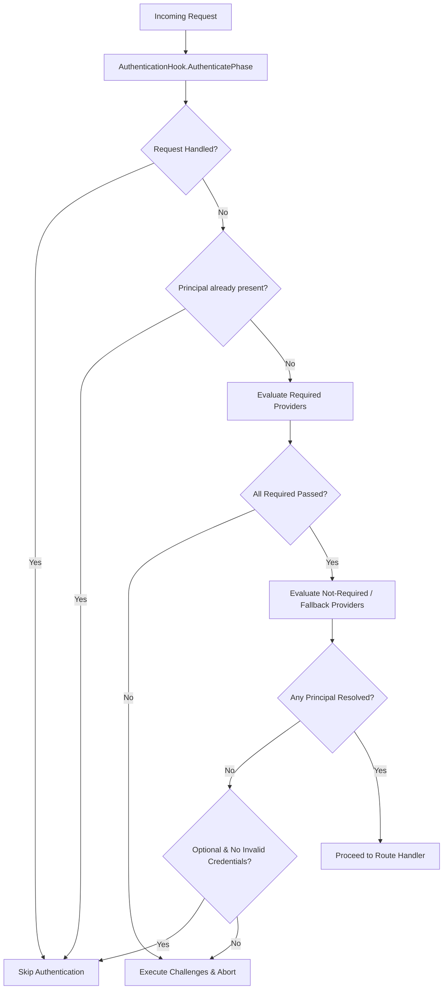
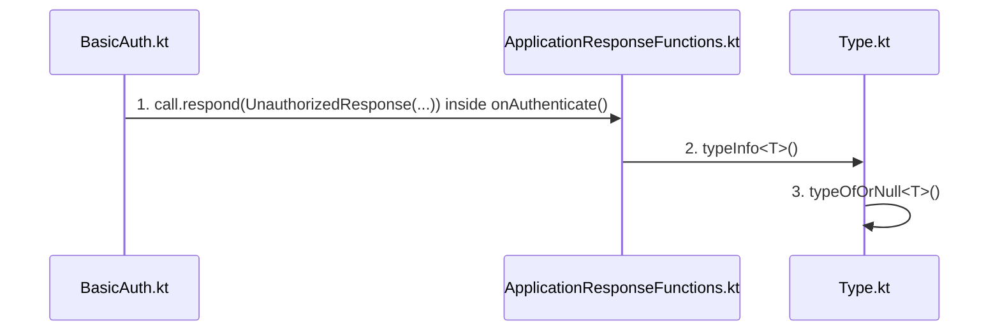

# Server Authentication

<details>
<summary>Relevant source files</summary>

The following files were used as context for generating this wiki page:

- [ktor-server/ktor-server-plugins/ktor-server-auth/jvm/src/io/ktor/server/auth/DigestAuth.kt](https://github.com/ktorio/ktor/blob/main/ktor-server/ktor-server-plugins/ktor-server-auth/jvm/src/io/ktor/server/auth/DigestAuth.kt)
- [ktor-server/ktor-server-plugins/ktor-server-auth-jwt/jvm/src/io/ktor/server/auth/jwt/JWTAuth.kt](https://github.com/ktorio/ktor/blob/main/ktor-server/ktor-server-plugins/ktor-server-auth-jwt/jvm/src/io/ktor/server/auth/jwt/JWTAuth.kt)
- [ktor-server/ktor-server-plugins/ktor-server-auth/common/src/io/ktor/server/auth/BasicAuth.kt](https://github.com/ktorio/ktor/blob/main/ktor-server/ktor-server-plugins/ktor-server-auth/common/src/io/ktor/server/auth/BasicAuth.kt)
- [ktor-server/ktor-server-plugins/ktor-server-auth/common/src/io/ktor/server/auth/AuthenticationInterceptors.kt](https://github.com/ktorio/ktor/blob/main/ktor-server/ktor-server-plugins/ktor-server-auth/common/src/io/ktor/server/auth/AuthenticationInterceptors.kt)
- [ktor-server/ktor-server-plugins/ktor-server-auth/common/src/io/ktor/server/auth/BearerAuth.kt](https://github.com/ktorio/ktor/blob/main/ktor-server/ktor-server-plugins/ktor-server-auth/common/src/io/ktor/server/auth/BearerAuth.kt)
- [ktor-server/ktor-server-plugins/ktor-server-auth/common/src/io/ktor/server/auth/FormAuth.kt](https://github.com/ktorio/ktor/blob/main/ktor-server/ktor-server-plugins/ktor-server-auth/common/src/io/ktor/server/auth/FormAuth.kt)
- [ktor-server/ktor-server-plugins/ktor-server-auth/common/src/io/ktor/server/auth/Authentication.kt](https://github.com/ktorio/ktor/blob/main/ktor-server/ktor-server-plugins/ktor-server-auth/common/src/io/ktor/server/auth/Authentication.kt)
- [ktor-server/ktor-server-plugins/ktor-server-auth/common/src/io/ktor/server/auth/OAuthProcedure.kt](https://github.com/ktorio/ktor/blob/main/ktor-server/ktor-server-plugins/ktor-server-auth/common/src/io/ktor/server/auth/OAuthProcedure.kt)
- [ktor-client/ktor-client-plugins/ktor-client-auth/common/src/io/ktor/client/plugins/auth/providers/DigestAuthProvider.kt](https://github.com/ktorio/ktor/blob/main/ktor-client/ktor-client-plugins/ktor-client-auth/common/src/io/ktor/client/plugins/auth/providers/DigestAuthProvider.kt)
- [ktor-server/ktor-server-plugins/ktor-server-auth/common/src/io/ktor/server/auth/OAuth2.kt](https://github.com/ktorio/ktor/blob/main/ktor-server/ktor-server-plugins/ktor-server-auth/common/src/io/ktor/server/auth/OAuth2.kt)
- [ktor-server/ktor-server-plugins/ktor-server-auth/jvm/src/io/ktor/server/auth/OAuth.kt](https://github.com/ktorio/ktor/blob/main/ktor-server/ktor-server-plugins/ktor-server-auth/jvm/src/io/ktor/server/auth/OAuth.kt)
- [ktor-server/ktor-server-plugins/ktor-server-auth/common/src/io/ktor/server/auth/SessionAuth.kt](https://github.com/ktorio/ktor/blob/main/ktor-server/ktor-server-plugins/ktor-server-auth/common/src/io/ktor/server/auth/SessionAuth.kt)
- [ktor-server/ktor-server-plugins/ktor-server-routing-openapi/jvm/src/io/ktor/server/routing/openapi/SecuritySchemeAnnotation.jvm.kt](https://github.com/ktorio/ktor/blob/main/ktor-server/ktor-server-plugins/ktor-server-routing-openapi/jvm/src/io/ktor/server/routing/openapi/SecuritySchemeAnnotation.jvm.kt)
- [ktor-server/ktor-server-plugins/ktor-server-auth/jvm/src/io/ktor/server/auth/OAuth1a.kt](https://github.com/ktorio/ktor/blob/main/ktor-server/ktor-server-plugins/ktor-server-auth/jvm/src/io/ktor/server/auth/OAuth1a.kt)
- [ktor-server/ktor-server-plugins/ktor-server-auth/common/src/io/ktor/server/auth/SimpleAuth.kt](https://github.com/ktorio/ktor/blob/main/ktor-server/ktor-server-plugins/ktor-server-auth/common/src/io/ktor/server/auth/SimpleAuth.kt)
- [ktor-server/ktor-server-plugins/ktor-server-auth-jwt/jvm/src/io/ktor/server/auth/jwt/JWTUtils.kt](https://github.com/ktorio/ktor/blob/main/ktor-server/ktor-server-plugins/ktor-server-auth-jwt/jvm/src/io/ktor/server/auth/jwt/JWTUtils.kt)
- [ktor-http/common/src/io/ktor/http/auth/AuthScheme.kt](https://github.com/ktorio/ktor/blob/main/ktor-http/common/src/io/ktor/http/auth/AuthScheme.kt)
- [ktor-server/ktor-server-plugins/ktor-server-auth/common/src/io/ktor/server/auth/Principal.kt](https://github.com/ktorio/ktor/blob/main/ktor-server/ktor-server-plugins/ktor-server-auth/common/src/io/ktor/server/auth/Principal.kt)
- [ktor-server/ktor-server-plugins/ktor-server-auth/common/src/io/ktor/server/auth/AuthenticationProvider.kt](https://github.com/ktorio/ktor/blob/main/ktor-server/ktor-server-plugins/ktor-server-auth/common/src/io/ktor/server/auth/AuthenticationProvider.kt)
- [ktor-server/ktor-server-plugins/ktor-server-auth/common/src/io/ktor/server/auth/AuthenticationContext.kt](https://github.com/ktorio/ktor/blob/main/ktor-server/ktor-server-plugins/ktor-server-auth/common/src/io/ktor/server/auth/AuthenticationContext.kt)
- [ktor-server/ktor-server-core/common/src/io/ktor/server/response/ApplicationResponseFunctions.kt](https://github.com/ktorio/ktor/blob/main/ktor-server/ktor-server-core/common/src/io/ktor/server/response/ApplicationResponseFunctions.kt)
- [ktor-server/ktor-server-plugins/ktor-server-di/common/src/io/ktor/server/plugins/di/DependencyRegistry.kt](https://github.com/ktorio/ktor/blob/main/ktor-server/ktor-server-plugins/ktor-server-di/common/src/io/ktor/server/plugins/di/DependencyRegistry.kt)
- [ktor-utils/common/src/io/ktor/util/reflect/Type.kt](https://github.com/ktorio/ktor/blob/main/ktor-utils/common/src/io/ktor/util/reflect/Type.kt)
</details>

## Overview

Server Authentication in Ktor provides a flexible, modular, and extensible mechanism for identifying and authorizing clients across HTTP pipelines and routing scopes. At its core, the subsystem decouples credential acquisition and verification from application route handlers, allowing developers to configure multiple distinct authentication providers—such as HTTP Basic, Digest, Bearer/JWT, OAuth (1.0a and 2.0), and Session-based mechanisms—under a single unified architecture.

Sources: [ktor-server/ktor-server-plugins/ktor-server-auth/common/src/io/ktor/server/auth/Authentication.kt:70-106](https://github.com/ktorio/ktor/blob/main/ktor-server/ktor-server-plugins/ktor-server-auth/common/src/io/ktor/server/auth/Authentication.kt#L70-L106)

The subsystem revolves around the `Authentication` application plugin, route-scoped authentication interceptors, and provider implementations that intercept requests, extract protocol-specific headers or form parameters, and resolve them into type-safe principal objects. By integrating directly into Ktor's pipeline and routing infrastructure via custom hooks (`AuthenticationHook` and `AuthenticationChecked`), the authentication layer ensures that protected endpoints enforce security strategies (`Required`, `Optional`, or `FirstSuccessful`) without cluttering business logic handlers.

Sources: [ktor-server/ktor-server-plugins/ktor-server-auth/common/src/io/ktor/server/auth/AuthenticationInterceptors.kt:21-51](https://github.com/ktorio/ktor/blob/main/ktor-server/ktor-server-plugins/ktor-server-auth/common/src/io/ktor/server/auth/AuthenticationInterceptors.kt#L21-L51), [ktor-server/ktor-server-plugins/ktor-server-auth/common/src/io/ktor/server/auth/AuthenticationInterceptors.kt:58-158](https://github.com/ktorio/ktor/blob/main/ktor-server/ktor-server-plugins/ktor-server-auth/common/src/io/ktor/server/auth/AuthenticationInterceptors.kt#L58-L158)

Design decisions within Ktor server authentication prioritize type safety, extensibility, and fine-grained fallback handling. Providers interact through a shared `AuthenticationContext` that accumulates verified principals and records authentication failure causes (`NoCredentials`, `InvalidCredentials`, or custom errors) to trigger protocol-compliant challenges (such as `WWW-Authenticate` response headers or OAuth redirect flows). This architecture enables complex multi-provider routing hierarchies while maintaining clear separation between credential transport protocols and application authorization logic.

Sources: [ktor-server/ktor-server-plugins/ktor-server-auth/common/src/io/ktor/server/auth/AuthenticationContext.kt:18-137](https://github.com/ktorio/ktor/blob/main/ktor-server/ktor-server-plugins/ktor-server-auth/common/src/io/ktor/server/auth/AuthenticationContext.kt#L18-L137)

## Core Architecture and Execution Pipeline

The server authentication subsystem executes via pipeline interceptors registered within route scopes. When a client request hits a route wrapped in the `authenticate` DSL function, the `AuthenticationInterceptors` plugin evaluates the registered providers based on the configured `AuthenticationStrategy`.



Sources: [ktor-server/ktor-server-plugins/ktor-server-auth/common/src/io/ktor/server/auth/AuthenticationInterceptors.kt:101-158](https://github.com/ktorio/ktor/blob/main/ktor-server/ktor-server-plugins/ktor-server-auth/common/src/io/ktor/server/auth/AuthenticationInterceptors.kt#L101-L158)

When an unauthenticated call is processed by an authentication provider such as `BasicAuthenticationProvider`, the authentication attempt follows a reified response path: `onAuthenticate()` → `respond()` → `typeInfo()` → `typeOfOrNull()`:

1. `onAuthenticate()` in `BasicAuthenticationProvider` ([BasicAuth.kt:32-53](https://github.com/ktorio/ktor/blob/main/ktor-server/ktor-server-plugins/ktor-server-auth/common/src/io/ktor/server/auth/BasicAuth.kt#L32-L53)) parses basic credentials. If credentials are missing or invalid, it registers a challenge lambda containing `call.respond(UnauthorizedResponse(...))` on the `AuthenticationContext`.
2. `respond()` in `ApplicationResponseFunctions.kt` ([ApplicationResponseFunctions.kt:24-26](https://github.com/ktorio/ktor/blob/main/ktor-server/ktor-server-core/common/src/io/ktor/server/response/ApplicationResponseFunctions.kt#L24-L26)) accepts the `UnauthorizedResponse` instance and delegates to `respond(message, typeInfo<T>())` to handle response serialization.
3. `typeInfo()` in `Type.kt` ([Type.kt:69](https://github.com/ktorio/ktor/blob/main/ktor-utils/common/src/io/ktor/util/reflect/Type.kt#L69)) constructs a `TypeInfo` container holding the target `KClass` and delegates generic type evaluation to `typeOfOrNull<T>()`.
4. `typeOfOrNull()` in `Type.kt` ([Type.kt:84-91](https://github.com/ktorio/ktor/blob/main/ktor-utils/common/src/io/ktor/util/reflect/Type.kt#L84-L91)) executes `typeOf<T>()` inside a `try-catch` block to guard against runtime reflection stripping or obfuscation bugs (such as R8/ProGuard in full mode) and returns `null` if generic reflection fails.

Sources: [ktor-server/ktor-server-plugins/ktor-server-auth/common/src/io/ktor/server/auth/BasicAuth.kt:32-53](https://github.com/ktorio/ktor/blob/main/ktor-server/ktor-server-plugins/ktor-server-auth/common/src/io/ktor/server/auth/BasicAuth.kt#L32-L53), [ktor-server/ktor-server-core/common/src/io/ktor/server/response/ApplicationResponseFunctions.kt:24-26](https://github.com/ktorio/ktor/blob/main/ktor-server/ktor-server-core/common/src/io/ktor/server/response/ApplicationResponseFunctions.kt#L24-L26), [ktor-utils/common/src/io/ktor/util/reflect/Type.kt:69](https://github.com/ktorio/ktor/blob/main/ktor-utils/common/src/io/ktor/util/reflect/Type.kt#L69), [ktor-utils/common/src/io/ktor/util/reflect/Type.kt:84-91](https://github.com/ktorio/ktor/blob/main/ktor-utils/common/src/io/ktor/util/reflect/Type.kt#L84-L91)

The following sequence diagram illustrates this exact call chain:



Sources: [ktor-server/ktor-server-plugins/ktor-server-auth/common/src/io/ktor/server/auth/BasicAuth.kt:45-49](https://github.com/ktorio/ktor/blob/main/ktor-server/ktor-server-plugins/ktor-server-auth/common/src/io/ktor/server/auth/BasicAuth.kt#L45-L49), [ktor-server/ktor-server-core/common/src/io/ktor/server/response/ApplicationResponseFunctions.kt:24-26](https://github.com/ktorio/ktor/blob/main/ktor-server/ktor-server-core/common/src/io/ktor/server/response/ApplicationResponseFunctions.kt#L24-L26), [ktor-utils/common/src/io/ktor/util/reflect/Type.kt:69](https://github.com/ktorio/ktor/blob/main/ktor-utils/common/src/io/ktor/util/reflect/Type.kt#L69), [ktor-utils/common/src/io/ktor/util/reflect/Type.kt:84-91](https://github.com/ktorio/ktor/blob/main/ktor-utils/common/src/io/ktor/util/reflect/Type.kt#L84-L91)

## Authentication Strategy and Routing Resolution

Route protection is managed by calling `Route.authenticate`, which creates a child route with an `AuthenticationRouteSelector` node and attaches `AuthenticateProvidersRegistration` metadata to the route's attributes.

Sources: [ktor-server/ktor-server-plugins/ktor-server-auth/common/src/io/ktor/server/auth/AuthenticationInterceptors.kt:296-320](https://github.com/ktorio/ktor/blob/main/ktor-server/ktor-server-plugins/ktor-server-auth/common/src/io/ktor/server/auth/AuthenticationInterceptors.kt#L296-L320)

When resolving providers for a given route, `AuthenticationConfig.findProviders` maps provider names to installed `AuthenticationProvider` instances:

```kotlin
private fun AuthenticationConfig.findProvider(configurationName: String?): AuthenticationProvider {
    return providers[configurationName] ?: throw IllegalArgumentException(
        if (configurationName == null) {
            "Default authentication configuration was not found. "
        } else {
            "Authentication configuration with the name $configurationName was not found. "
        } + "Make sure that you install Authentication plugin before you use it in Routing"
    )
}
```

Sources: [ktor-server/ktor-server-plugins/ktor-server-auth/common/src/io/ktor/server/auth/AuthenticationInterceptors.kt:227-235](https://github.com/ktorio/ktor/blob/main/ktor-server/ktor-server-plugins/ktor-server-auth/common/src/io/ktor/server/auth/AuthenticationInterceptors.kt#L227-L235)

To resolve tie-breaks and execute multi-provider rules, `AuthenticationInterceptors` categorizes providers into sets based on `AuthenticationStrategy`:

1. `requiredProviders`: Providers registered with `AuthenticationStrategy.Required`. Every required provider must succeed.
2. `firstSuccessfulProviders`: Providers registered with `AuthenticationStrategy.FirstSuccessful`. The interceptor stops as soon as one provider attaches a principal.
3. `optionalProviders`: Providers registered with `AuthenticationStrategy.Optional`. If no credentials are provided, execution continues without error.

Sources: [ktor-server/ktor-server-plugins/ktor-server-auth/common/src/io/ktor/server/auth/AuthenticationInterceptors.kt:66-74](https://github.com/ktorio/ktor/blob/main/ktor-server/ktor-server-plugins/ktor-server-auth/common/src/io/ktor/server/auth/AuthenticationInterceptors.kt#L66-L74)

The load-bearing re-entrancy and failure guard in `AuthenticationInterceptors` checks whether required providers appended a principal:

```kotlin
if (authenticationContext._principal.principals.size < count) {
    LOGGER.trace("Authentication failed for ${call.request.uri} with provider $provider")
    authenticationContext.executeChallenges(call)
    return@on
}
```

This line guarantees that if a required provider fails to append a principal to `_principal.principals`, the interceptor instantly aborts pipeline execution and dispatches challenges.

Sources: [ktor-server/ktor-server-plugins/ktor-server-auth/common/src/io/ktor/server/auth/AuthenticationInterceptors.kt:117-121](https://github.com/ktorio/ktor/blob/main/ktor-server/ktor-server-plugins/ktor-server-auth/common/src/io/ktor/server/auth/AuthenticationInterceptors.kt#L117-L121)

## Provider Implementations and Protocol Specifications

Ktor ships with several built-in authentication providers, each extending `AuthenticationProvider` and exposing a configuration builder DSL.

| Provider Name | Credential Type | Primary Scheme / Identifier | Key Configuration Options |
| --- | --- | --- | --- |
| **Basic** | `UserPasswordCredential` | `Basic` (RFC 7617) | `realm`, `charset` (`UTF_8` or `null` for ISO-8859-1), `validate` |
| **Digest** | `DigestCredential` | `Digest` (RFC 7616 / 2617) | `realm`, `algorithms`, `supportedQop`, `charset`, `nonceManager`, `digestProvider`, `userHashResolver` |
| **JWT** | `JWTCredential` | `Bearer` / Custom Schemes | `realm`, `authHeader`, `authSchemes`, `verifier`, `validate`, `challenge` |
| **Bearer** | `BearerTokenCredential` | `Bearer` (RFC 6750) | `realm`, `defaultScheme`, `additionalSchemes`, `authHeader`, `authenticate` |
| **Form** | `UserPasswordCredential` | HTTP Form POST Parameters | `userParamName`, `passwordParamName`, `validate`, `challenge` |
| **OAuth** | `OAuthAccessTokenResponse` | OAuth 1.0a / 2.0 Flows | `client`, `settings`, `providerLookup`, `urlProvider`, `fallback` |
| **Session** | Generic Type `T` | Application Session Storage | `type`, `validate`, `challenge` |

Sources: [ktor-server/ktor-server-plugins/ktor-server-auth/common/src/io/ktor/server/auth/BasicAuth.kt:23-103](https://github.com/ktorio/ktor/blob/main/ktor-server/ktor-server-plugins/ktor-server-auth/common/src/io/ktor/server/auth/BasicAuth.kt#L23-L103), [ktor-server/ktor-server-plugins/ktor-server-auth/jvm/src/io/ktor/server/auth/DigestAuth.kt:34-344](https://github.com/ktorio/ktor/blob/main/ktor-server/ktor-server-plugins/ktor-server-auth/jvm/src/io/ktor/server/auth/DigestAuth.kt#L34-L344), [ktor-server/ktor-server-plugins/ktor-server-auth-jwt/jvm/src/io/ktor/server/auth/jwt/JWTAuth.kt:178-403](https://github.com/ktorio/ktor/blob/main/ktor-server/ktor-server-plugins/ktor-server-auth-jwt/jvm/src/io/ktor/server/auth/jwt/JWTAuth.kt#L178-403), [ktor-server/ktor-server-plugins/ktor-server-auth/common/src/io/ktor/server/auth/BearerAuth.kt:19-111](https://github.com/ktorio/ktor/blob/main/ktor-server/ktor-server-plugins/ktor-server-auth/common/src/io/ktor/server/auth/BearerAuth.kt#L19-L111), [ktor-server/ktor-server-plugins/ktor-server-auth/common/src/io/ktor/server/auth/FormAuth.kt:21-131](https://github.com/ktorio/ktor/blob/main/ktor-server/ktor-server-plugins/ktor-server-auth/common/src/io/ktor/server/auth/FormAuth.kt#L21-L131), [ktor-server/ktor-server-plugins/ktor-server-auth/common/src/io/ktor/server/auth/OAuthProcedure.kt:31-104](https://github.com/ktorio/ktor/blob/main/ktor-server/ktor-server-plugins/ktor-server-auth/common/src/io/ktor/server/auth/OAuthProcedure.kt#L31-104), [ktor-server/ktor-server-plugins/ktor-server-auth/common/src/io/ktor/server/auth/SessionAuth.kt:25-57](https://github.com/ktorio/ktor/blob/main/ktor-server/ktor-server-plugins/ktor-server-auth/common/src/io/ktor/server/auth/SessionAuth.kt#L25-57)

Enumerated HTTP Auth Schemes supported in standard header parsing:
- `AuthScheme.Basic`: `"Basic"`
- `AuthScheme.Digest`: `"Digest"`
- `AuthScheme.Negotiate`: `"Negotiate"`
- `AuthScheme.OAuth`: `"OAuth"`
- `AuthScheme.Bearer`: `"Bearer"`

Sources: [ktor-http/common/src/io/ktor/http/auth/AuthScheme.kt:12-68](https://github.com/ktorio/ktor/blob/main/ktor-http/common/src/io/ktor/http/auth/AuthScheme.kt#L12-L68)

## Digest Authentication and Content Integrity

`DigestAuthenticationProvider` implements RFC 7616 and RFC 2617 HTTP Digest authentication. Supported message digest algorithms include:
- `DigestAlgorithm.MD5`
- `DigestAlgorithm.MD5_SESS`
- `DigestAlgorithm.SHA_256`
- `DigestAlgorithm.SHA_256_SESS`
- `DigestAlgorithm.SHA_512_256`
- `DigestAlgorithm.SHA_512_256_SESS`

Sources: [ktor-server/ktor-server-plugins/ktor-server-auth/jvm/src/io/ktor/server/auth/DigestAuth.kt:207-213](https://github.com/ktorio/ktor/blob/main/ktor-server/ktor-server-plugins/ktor-server-auth/jvm/src/io/ktor/server/auth/DigestAuth.kt#L207-L213)

When Quality of Protection (`qop`) is set to `auth-int`, Ktor calculates a hash over the request body using `computeBodyHash`:

```kotlin
private suspend fun ApplicationCall.computeBodyHash(digester: MessageDigest): ByteArray {
    val bodyBytes = runCatching { receive<ByteArray>() }.getOrNull()
        ?: ByteArray(0)
    digester.reset()
    return digester.digest(bodyBytes)
}
```

Sources: [ktor-server/ktor-server-plugins/ktor-server-auth/jvm/src/io/ktor/server/auth/DigestAuth.kt:161-167](https://github.com/ktorio/ktor/blob/main/ktor-server/ktor-server-plugins/ktor-server-auth/jvm/src/io/ktor/server/auth/DigestAuth.kt#L161-L167)

If client authentication succeeds and `credentials.qop != null`, Ktor constructs and attaches an `Authentication-Info` header to the response:

```kotlin
if (credentials.qop != null) {
    val authInfo = credentials.buildAuthenticationInfoHeader(
        ha1 = verifiedHa1!!,
        nextNonce = nonceManager.newNonce(),
        responseBodyHash = verifiedBodyHash
    )
    call.response.header(HttpHeaders.AuthenticationInfo, authInfo)
}
```

Sources: [ktor-server/ktor-server-plugins/ktor-server-auth/jvm/src/io/ktor/server/auth/DigestAuth.kt:133-140](https://github.com/ktorio/ktor/blob/main/ktor-server/ktor-server-plugins/ktor-server-auth/jvm/src/io/ktor/server/auth/DigestAuth.kt#L133-L140)

To support username privacy via `userhash=true`, `resolveUserHash` invokes a configured `userHashResolver`:

```kotlin
suspend fun DigestCredential.resolveUserHash(): DigestCredential? {
    if (!userHash) return this
    val userName = userHashResolver?.invoke(userName, realm, digestAlgorithm) ?: return null
    return copy(userName = userName, userHash = false)
}
```

Sources: [ktor-server/ktor-server-plugins/ktor-server-auth/jvm/src/io/ktor/server/auth/DigestAuth.kt:86-90](https://github.com/ktorio/ktor/blob/main/ktor-server/ktor-server-plugins/ktor-server-auth/jvm/src/io/ktor/server/auth/DigestAuth.kt#L86-L90)

## OAuth 1.0a and OAuth 2.0 Flow Mechanisms

Ktor supports both OAuth 1.0a and OAuth 2.0 authentication procedures. On JVM targets, `OAuthAuthenticationProvider.onAuthenticate` attempts OAuth 1.0a handling before executing OAuth 2.0 handling.

Sources: [ktor-server/ktor-server-plugins/ktor-server-auth/common/src/io/ktor/server/auth/OAuthProcedure.kt:40-43](https://github.com/ktorio/ktor/blob/main/ktor-server/ktor-server-plugins/ktor-server-auth/common/src/io/ktor/server/auth/OAuthProcedure.kt#L40-L43)

During the OAuth 2.0 callback, `oauth2HandleCallback` parses authorization codes or errors from request parameters or form bodies. If an error or missing grant occurs, `oauth2RequestAccessToken` throws an exception that maps to `AuthenticationFailedCause.Error`:

```kotlin
if (!nonceManager.verifyNonce(state.orEmpty())) {
    throw OAuth2Exception.InvalidNonce()
}
```

This guard ensures that any state parameter sent in the OAuth redirect match a valid nonce generated by `nonceManager`; otherwise, an `OAuth2Exception.InvalidNonce` is immediately thrown to prevent CSRF attacks.

Sources: [ktor-server/ktor-server-plugins/ktor-server-auth/common/src/io/ktor/server/auth/OAuth2.kt:142-144](https://github.com/ktorio/ktor/blob/main/ktor-server/ktor-server-plugins/ktor-server-auth/common/src/io/ktor/server/auth/OAuth2.kt#L142-L144)

When handling `invalid_grant` errors from the token endpoint, `oauth2` delegates to the provider's fallback handler:

```kotlin
if (cause is OAuth2InvalidGrantError) {
    this@oauth2.fallback.invoke(call, cause)
    if (call.isHandled) {
        context.error(OAuthKey, cause)
        return
    }
}
```

If the fallback handler handles the call (for instance, by responding with a custom error page), Ktor completes the flow without issuing an automatic redirect challenge.

Sources: [ktor-server/ktor-server-plugins/ktor-server-auth/common/src/io/ktor/server/auth/OAuthProcedure.kt:183-193](https://github.com/ktorio/ktor/blob/main/ktor-server/ktor-server-plugins/ktor-server-auth/common/src/io/ktor/server/auth/OAuthProcedure.kt#L183-L193)

## Configuration and Usage Models

| Design Choice | Benefit | Cost |
| --- | --- | --- |
| **Pipeline-based interceptors** (`AuthenticationInterceptors`) | Seamless integration with Ktor routing and flexible scoping via `authenticate {}`. | Requires careful ordering of interceptor phases relative to content reception and routing resolution. |
| **Combined Principal Storage** (`CombinedPrincipal`) | Supports multi-provider routing and simultaneous resolution of multiple principals per call. | Requires type-safe lookup methods and provider name scoping to disambiguate overlapping principal types. |
| **Body Consumption in Digest `auth-int`** (`computeBodyHash`) | Enables cryptographic integrity verification of incoming request bodies. | Consumes the request stream; necessitates the installation of the `DoubleReceive` plugin for subsequent route handling. |
| **Flexible Challenge Registration** | Allows providers to customize response headers (`WWW-Authenticate`) or execute redirects (OAuth). | Failure handling requires coordinating response completion status across multiple cascading challenges. |

Sources: [ktor-server/ktor-server-plugins/ktor-server-auth/common/src/io/ktor/server/auth/AuthenticationInterceptors.kt:21-158](https://github.com/ktorio/ktor/blob/main/ktor-server/ktor-server-plugins/ktor-server-auth/common/src/io/ktor/server/auth/AuthenticationInterceptors.kt#L21-L158), [ktor-server/ktor-server-plugins/ktor-server-auth/common/src/io/ktor/server/auth/Principal.kt:27-49](https://github.com/ktorio/ktor/blob/main/ktor-server/ktor-server-plugins/ktor-server-auth/common/src/io/ktor/server/auth/Principal.kt#L27-49), [ktor-server/ktor-server-plugins/ktor-server-auth/jvm/src/io/ktor/server/auth/DigestAuth.kt:77-80](https://github.com/ktorio/ktor/blob/main/ktor-server/ktor-server-plugins/ktor-server-auth/jvm/src/io/ktor/server/auth/DigestAuth.kt#L77-L80)

> [!NOTE]
> If a request provides credentials that fail validation (`AuthenticationFailedCause.InvalidCredentials`), authentication providers typically issue an `UnauthorizedResponse` with appropriate challenge headers while preventing fallback to optional provider bypasses.

Sources: [ktor-server/ktor-server-plugins/ktor-server-auth/common/src/io/ktor/server/auth/AuthenticationInterceptors.kt:149-154](https://github.com/ktorio/ktor/blob/main/ktor-server/ktor-server-plugins/ktor-server-auth/common/src/io/ktor/server/auth/AuthenticationInterceptors.kt#L149-L154)

> [!WARNING]
> When configuring Digest Authentication with `DigestQop.AUTH_INT`, the incoming request body is consumed during hash computation. Always install the `DoubleReceive` plugin if route handlers need to read the request body subsequently.

Sources: [ktor-server/ktor-server-plugins/ktor-server-auth/jvm/src/io/ktor/server/auth/DigestAuth.kt:161-167](https://github.com/ktorio/ktor/blob/main/ktor-server/ktor-server-plugins/ktor-server-auth/jvm/src/io/ktor/server/auth/DigestAuth.kt#L161-L167)

The following complete example demonstrates how to install the `Authentication` plugin with both a Basic authentication provider and a JWT authentication provider, and how to protect routing blocks using `authenticate`.

```kotlin
fun Application.configureSecurity() {
    install(Authentication) {
        basic("auth-basic") {
            realm = "Ktor Server"
            validate { credentials ->
                if (credentials.name == "admin" && credentials.password == "secret") {
                    UserIdPrincipal(credentials.name)
                } else {
                    null
                }
            }
        }
        
        jwt("auth-jwt") {
            realm = "Ktor Server"
            verifier(
                JWT.require(Algorithm.HMAC256("secret-key"))
                    .withIssuer("https://jwt-provider-domain/")
                    .build()
            )
            validate { credential ->
                if (credential.payload.getClaim("role").asString() == "user") {
                    JWTPrincipal(credential.payload)
                } else {
                    null
                }
            }
        }
    }

    routing {
        authenticate("auth-basic") {
            get("/protected/basic") {
                val principal = call.principal<UserIdPrincipal>()
                call.respondText("Hello, ${principal?.name} via Basic Auth!")
            }
        }

        authenticate("auth-jwt") {
            get("/protected/jwt") {
                val principal = call.principal<JWTPrincipal>()
                val username = principal?.subject ?: "Unknown"
                call.respondText("Hello, $username via JWT!")
            }
        }
    }
}
```

Sources: [ktor-server/ktor-server-plugins/ktor-server-auth/common/src/io/ktor/server/auth/Authentication.kt:82-99](https://github.com/ktorio/ktor/blob/main/ktor-server/ktor-server-plugins/ktor-server-auth/common/src/io/ktor/server/auth/Authentication.kt#L82-L99), [ktor-server/ktor-server-plugins/ktor-server-auth/common/src/io/ktor/server/auth/BasicAuth.kt:94-101](https://github.com/ktorio/ktor/blob/main/ktor-server/ktor-server-plugins/ktor-server-auth/common/src/io/ktor/server/auth/BasicAuth.kt#L94-L101), [ktor-server/ktor-server-plugins/ktor-server-auth-jwt/jvm/src/io/ktor/server/auth/jwt/JWTAuth.kt:349-362](https://github.com/ktorio/ktor/blob/main/ktor-server/ktor-server-plugins/ktor-server-auth-jwt/jvm/src/io/ktor/server/auth/jwt/JWTAuth.kt#L349-L362), [ktor-server/ktor-server-plugins/ktor-server-auth-jwt/jvm/src/io/ktor/server/auth/jwt/JWTAuth.kt:388-390](https://github.com/ktorio/ktor/blob/main/ktor-server/ktor-server-plugins/ktor-server-auth-jwt/jvm/src/io/ktor/server/auth/jwt/JWTAuth.kt#L388-L390)

## Related

- [[Application Pipeline]]
- [[Routing]]

