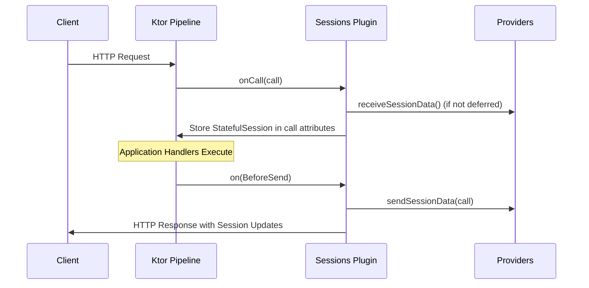

# Server Sessions

<details>
<summary>Relevant source files</summary>

The following files were used as context for generating this wiki page:

- [ktor-server/ktor-server-plugins/ktor-server-sessions/common/src/io/ktor/server/sessions/SessionsBuilder.kt](https://github.com/ktorio/ktor/blob/main/ktor-server/ktor-server-plugins/ktor-server-sessions/common/src/io/ktor/server/sessions/SessionsBuilder.kt)
- [ktor-server/ktor-server-plugins/ktor-server-sessions/common/src/io/ktor/server/sessions/SessionData.kt](https://github.com/ktorio/ktor/blob/main/ktor-server/ktor-server-plugins/ktor-server-sessions/common/src/io/ktor/server/sessions/SessionData.kt)
- [ktor-server/ktor-server-plugins/ktor-server-sessions/jvm/src/io/ktor/server/sessions/SessionSerializerReflection.kt](https://github.com/ktorio/ktor/blob/main/ktor-server/ktor-server-plugins/ktor-server-sessions/jvm/src/io/ktor/server/sessions/SessionSerializerReflection.kt)
- [ktor-server/ktor-server-plugins/ktor-server-sessions/jvm/src/io/ktor/server/sessions/SessionTransportTransformerEncrypt.kt](https://github.com/ktorio/ktor/blob/main/ktor-server/ktor-server-plugins/ktor-server-sessions/jvm/src/io/ktor/server/sessions/SessionTransportTransformerEncrypt.kt)
- [ktor-server/ktor-server-plugins/ktor-server-sessions/common/src/io/ktor/server/sessions/SessionTrackerById.kt](https://github.com/ktorio/ktor/blob/main/ktor-server/ktor-server-plugins/ktor-server-sessions/common/src/io/ktor/server/sessions/SessionTrackerById.kt)
- [ktor-server/ktor-server-plugins/ktor-server-sessions/common/src/io/ktor/server/sessions/SessionTransportCookie.kt](https://github.com/ktorio/ktor/blob/main/ktor-server/ktor-server-plugins/ktor-server-sessions/common/src/io/ktor/server/sessions/SessionTransportCookie.kt)
- [ktor-server/ktor-server-plugins/ktor-server-sessions/common/src/io/ktor/server/sessions/Sessions.kt](https://github.com/ktorio/ktor/blob/main/ktor-server/ktor-server-plugins/ktor-server-sessions/common/src/io/ktor/server/sessions/Sessions.kt)
- [ktor-server/ktor-server-plugins/ktor-server-sessions/jvmAndPosix/src/io/ktor/server/sessions/BlockingDeferredSessionData.kt](https://github.com/ktorio/ktor/blob/main/ktor-server/ktor-server-plugins/ktor-server-sessions/jvmAndPosix/src/io/ktor/server/sessions/BlockingDeferredSessionData.kt)
- [ktor-server/ktor-server-plugins/ktor-server-sessions/common/src/io/ktor/server/sessions/SessionSerializer.kt](https://github.com/ktorio/ktor/blob/main/ktor-server/ktor-server-plugins/ktor-server-sessions/common/src/io/ktor/server/sessions/SessionSerializer.kt)
- [ktor-server/ktor-server-plugins/ktor-server-sessions/common/src/io/ktor/server/sessions/serialization/KotlinxSessionSerializer.kt](https://github.com/ktorio/ktor/blob/main/ktor-server/ktor-server-plugins/ktor-server-sessions/common/src/io/ktor/server/sessions/serialization/KotlinxSessionSerializer.kt)
- [ktor-server/ktor-server-plugins/ktor-server-sessions/common/src/io/ktor/server/sessions/SessionTrackerByValue.kt](https://github.com/ktorio/ktor/blob/main/ktor-server/ktor-server-plugins/ktor-server-sessions/common/src/io/ktor/server/sessions/SessionTrackerByValue.kt)
- [ktor-server/ktor-server-plugins/ktor-server-sessions/jvmAndPosix/src/io/ktor/server/sessions/SessionDeferral.jvmAndPosix.kt](https://github.com/ktorio/ktor/blob/main/ktor-server/ktor-server-plugins/ktor-server-sessions/jvmAndPosix/src/io/ktor/server/sessions/SessionDeferral.jvmAndPosix.kt)
- [ktor-server/ktor-server-plugins/ktor-server-sessions/common/src/io/ktor/server/sessions/SessionTransport.kt](https://github.com/ktorio/ktor/blob/main/ktor-server/ktor-server-plugins/ktor-server-sessions/common/src/io/ktor/server/sessions/SessionTransport.kt)
- [ktor-server/ktor-server-plugins/ktor-server-sessions/common/src/io/ktor/server/sessions/SessionTransportHeader.kt](https://github.com/ktorio/ktor/blob/main/ktor-server/ktor-server-plugins/ktor-server-sessions/common/src/io/ktor/server/sessions/SessionTransportHeader.kt)
- [ktor-server/ktor-server-plugins/ktor-server-sessions/common/src/io/ktor/server/sessions/SessionTransportTransformer.kt](https://github.com/ktorio/ktor/blob/main/ktor-server/ktor-server-plugins/ktor-server-sessions/common/src/io/ktor/server/sessions/SessionTransportTransformer.kt)
- [ktor-server/ktor-server-plugins/ktor-server-sessions/common/src/io/ktor/server/sessions/SessionStorageMemory.kt](https://github.com/ktorio/ktor/blob/main/ktor-server/ktor-server-plugins/ktor-server-sessions/common/src/io/ktor/server/sessions/SessionStorageMemory.kt)
- [ktor-server/ktor-server-plugins/ktor-server-sessions/common/src/io/ktor/server/sessions/SessionTracker.kt](https://github.com/ktorio/ktor/blob/main/ktor-server/ktor-server-plugins/ktor-server-sessions/common/src/io/ktor/server/sessions/SessionTracker.kt)
- [ktor-server/ktor-server-plugins/ktor-server-sessions/common/src/io/ktor/server/sessions/SessionDeferral.kt](https://github.com/ktorio/ktor/blob/main/ktor-server/ktor-server-sessions/common/src/io/ktor/server/sessions/SessionDeferral.kt)
- [ktor-server/ktor-server-plugins/ktor-server-sessions/common/src/io/ktor/server/sessions/SessionStorage.kt](https://github.com/ktorio/ktor/blob/main/ktor-server/ktor-server-plugins/ktor-server-sessions/common/src/io/ktor/server/sessions/SessionStorage.kt)
- [ktor-server/ktor-server-plugins/ktor-server-sessions/web/src/io/ktor/server/sessions/SessionDeferral.web.kt](https://github.com/ktorio/ktor/blob/main/ktor-server/ktor-server-plugins/ktor-server-sessions/web/src/io/ktor/server/sessions/SessionDeferral.web.kt)
- [ktor-server/ktor-server-plugins/ktor-server-sessions/common/src/io/ktor/server/sessions/serialization/MapDecoder.kt](https://github.com/ktorio/ktor/blob/main/ktor-server/ktor-server-plugins/ktor-server-sessions/common/src/io/ktor/server/sessions/serialization/MapDecoder.kt)
</details>

## Overview

The Server Sessions plugin in Ktor provides a robust mechanism to persist data across distinct HTTP requests, enabling stateful applications to store logged-in user identifiers, shopping carts, or client preferences. It handles session data through configurable transport channels such as cookies or HTTP headers, and supports flexible storage architectures ranging from client-side state passing to server-side backends. To safeguard sensitive information, the system incorporates transport transformers for cryptographic signing and encryption.

Sources: [ktor-server/ktor-server-plugins/ktor-server-sessions/common/src/io/ktor/server/sessions/Sessions.kt:18-25](https://github.com/ktorio/ktor/blob/main/ktor-server/ktor-server-plugins/ktor-server-sessions/common/src/io/ktor/server/sessions/Sessions.kt#L18-L25)

## Plugin Infrastructure and Call Pipeline

### Overview

The `Sessions` plugin acts as a route-scoped plugin in Ktor, defined via `createRouteScopedPlugin("Sessions", ::SessionsConfig)` to intercept inbound requests and outbound responses. During installation, the plugin retrieves configured session providers, registers `SessionProvidersKey` in application attributes, and sets up call interception hooks.

Sources: [ktor-server/ktor-server-plugins/ktor-server-sessions/common/src/io/ktor/server/sessions/Sessions.kt:33-43](https://github.com/ktorio/ktor/blob/main/ktor-server/ktor-server-plugins/ktor-server-sessions/common/src/io/ktor/server/sessions/Sessions.kt#L33-L43)

### Call Interception Lifecycle

The plugin manages the call pipeline using two primary interception phases:

1. **`onCall` Hook:** Evaluates whether session providers are empty, logs tracing information for the request URI, and injects a `StatefulSession` instance into `call.attributes` under `SessionDataKey`. Depending on whether deferred sessions are enabled, the supplier selects either `createDeferredSession` or `createSession`.
2. **`(BeforeSend)` Hook:** Intercepts the response lifecycle before it is sent. It retrieves `SessionDataKey` from call attributes—safely ignoring calls where the plugin did not deserialize data, such as short-circuited 403 Forbidden responses generated by the CORS plugin—and invokes `sessionData.sendSessionData(call)` to update or clear session data across all registered providers.



Sources: [ktor-server/ktor-server-plugins/ktor-server-sessions/common/src/io/ktor/server/sessions/Sessions.kt:44-68](https://github.com/ktorio/ktor/blob/main/ktor-server/ktor-server-plugins/ktor-server-sessions/common/src/io/ktor/server/sessions/Sessions.kt#L44-L68), [ktor-server/ktor-server-plugins/ktor-server-sessions/common/src/io/ktor/server/sessions/Sessions.kt:71-79](https://github.com/ktorio/ktor/blob/main/ktor-server/ktor-server-plugins/ktor-server-sessions/common/src/io/ktor/server/sessions/Sessions.kt#L71-L79)

> [!NOTE]
> If a response is triggered before the `Sessions` plugin executes its deserialization logic (for example, when the CORS plugin aborts a request with `403 Forbidden`), `SessionDataKey` will be absent, and the `BeforeSend` handler safely returns early without attempting to dispatch session changes.

Sources: [ktor-server/ktor-server-plugins/ktor-server-sessions/common/src/io/ktor/server/sessions/Sessions.kt:57-64](https://github.com/ktorio/ktor/blob/main/ktor-server/ktor-server-plugins/ktor-server-sessions/common/src/io/ktor/server/sessions/Sessions.kt#L57-L64)

### Configuration Builders and DSL

Session providers are registered via extension functions on `SessionsConfig`. The configuration builders manage transport layers, trackers, and serializers for both cookies and custom headers.

| Builder Class | Target Transport | Tracker Type | Description |
| :--- | :--- | :--- | :--- |
| `CookieSessionBuilder` | `SessionTransportCookie` | `SessionTrackerByValue` | Stores serialized session data directly inside a cookie value. |
| `CookieIdSessionBuilder` | `SessionTransportCookie` | `SessionTrackerById` | Stores a session ID in a cookie and data in server `SessionStorage`. |
| `HeaderSessionBuilder` | `SessionTransportHeader` | `SessionTrackerByValue` | Passes serialized session data via a custom HTTP header. |
| `HeaderIdSessionBuilder` | `SessionTransportHeader` | `SessionTrackerById` (or `ByValue` if storage is null) | Passes a session ID via header with optional server storage. |

Sources: [ktor-server/ktor-server-plugins/ktor-server-sessions/common/src/io/ktor/server/sessions/SessionsBuilder.kt:38-48](https://github.com/ktorio/ktor/blob/main/ktor-server/ktor-server-plugins/ktor-server-sessions/common/src/io/ktor/server/sessions/SessionsBuilder.kt#L38-L48), [ktor-server/ktor-server-plugins/ktor-server-sessions/common/src/io/ktor/server/sessions/SessionsBuilder.kt:147-166](https://github.com/ktorio/ktor/blob/main/ktor-server/ktor-server-plugins/ktor-server-sessions/common/src/io/ktor/server/sessions/SessionsBuilder.kt#L147-L166), [ktor-server/ktor-server-plugins/ktor-server-sessions/common/src/io/ktor/server/sessions/SessionsBuilder.kt:246-256](https://github.com/ktorio/ktor/blob/main/ktor-server/ktor-server-plugins/ktor-server-sessions/common/src/io/ktor/server/sessions/SessionsBuilder.kt#L246-L256), [ktor-server/ktor-server-plugins/ktor-server-sessions/common/src/io/ktor/server/sessions/SessionsBuilder.kt:311-321](https://github.com/ktorio/ktor/blob/main/ktor-server/ktor-server-plugins/ktor-server-sessions/common/src/io/ktor/server/sessions/SessionsBuilder.kt#L311-L321)

## Session State and Deferred Resolution

### Overview

Session state management in Ktor revolves around the `StatefulSession` interface and its two concrete implementations: `SessionData` for eager retrieval and `BlockingDeferredSessionData` for lazy deferred resolution on JVM and POSIX targets. These containers track active session mutations across request lifecycles, maintaining separate references for incoming (`oldValue`) and mutated (`newValue`) states.

Sources: [ktor-server/ktor-server-plugins/ktor-server-sessions/common/src/io/ktor/server/sessions/SessionData.kt:82-90](https://github.com/ktorio/ktor/blob/main/ktor-server/ktor-server-plugins/ktor-server-sessions/common/src/io/ktor/server/sessions/SessionData.kt#L82-L90), [ktor-server/ktor-server-plugins/ktor-server-sessions/common/src/io/ktor/server/sessions/SessionData.kt:193-195](https://github.com/ktorio/ktor/blob/main/ktor-server/ktor-server-plugins/ktor-server-sessions/common/src/io/ktor/server/sessions/SessionData.kt#L193-L195), [ktor-server/ktor-server-plugins/ktor-server-sessions/jvmAndPosix/src/io/ktor/server/sessions/BlockingDeferredSessionData.kt:19-22](https://github.com/ktorio/ktor/blob/main/ktor-server/ktor-server-plugins/ktor-server-sessions/jvmAndPosix/src/io/ktor/server/sessions/BlockingDeferredSessionData.kt#L19-L22)

### Session Operations Walkthrough

When an application handler interacts with sessions via `call.sessions`, operations pass through the active `StatefulSession` container. 

1. **Retrieval (`get`)**: `CurrentSession.get(name)` or `get(klass)` looks up the corresponding `SessionProviderData` by name, returning `newValue` if set, or falling back to `oldValue`.
2. **Mutation (`set`)**: `CurrentSession.set(name, value)` checks if the session data has already been `committed`. If committed, it throws a `TooLateSessionSetException`. Otherwise, it validates the incoming value through the provider's tracker and updates `newValue`.
3. **Clearing (`clear`)**: `CurrentSession.clear(name)` locates the provider data and sets both `oldValue` and `newValue` to `null`.
4. **Disposal (`sendSessionData`)**: During the `BeforeSend` interception phase, `sendSessionData(call)` iterates through registered provider data. If a `newValue` is present, it stores and transmits the session; if `incoming` is true and `oldValue` is `null`, it clears transport and storage channels.

Sources: [ktor-server/ktor-server-plugins/ktor-server-sessions/common/src/io/ktor/server/sessions/SessionData.kt:199-277](https://github.com/ktorio/ktor/blob/main/ktor-server/ktor-server-plugins/ktor-server-sessions/common/src/io/ktor/server/sessions/SessionData.kt#L199-L277), [ktor-server/ktor-server-plugins/ktor-server-sessions/jvmAndPosix/src/io/ktor/server/sessions/BlockingDeferredSessionData.kt:27-87](https://github.com/ktorio/ktor/blob/main/ktor-server/ktor-server-plugins/ktor-server-sessions/jvmAndPosix/src/io/ktor/server/sessions/BlockingDeferredSessionData.kt#L27-L87)

> [!WARNING]
> Attempting to call `set` or `clear` after the HTTP response headers and body have begun transmitting throws a `TooLateSessionSetException`. This protects against headers being committed too late for cookie or header transport mutations.

Sources: [ktor-server/ktor-server-plugins/ktor-server-sessions/common/src/io/ktor/server/sessions/SessionData.kt:213-216](https://github.com/ktorio/ktor/blob/main/ktor-server/ktor-server-plugins/ktor-server-sessions/common/src/io/ktor/server/sessions/SessionData.kt#L213-L216), [ktor-server/ktor-server-plugins/ktor-server-sessions/common/src/io/ktor/server/sessions/SessionData.kt:298-300](https://github.com/ktorio/ktor/blob/main/ktor-server/ktor-server-plugins/ktor-server-sessions/common/src/io/ktor/server/sessions/SessionData.kt#L298-L300)

### Lazy Deferred Resolution

When deferred sessions are enabled via the system property flag `io.ktor.server.sessions.deferred`, `createDeferredSession` initializes providers using lazy coroutines (`CoroutineStart.LAZY`) managed by `BlockingDeferredSessionData`.

| Class / Property | Type | Description |
| :--- | :--- | :--- |
| `SESSIONS_DEFERRED_FLAG` | `String` (`"io.ktor.server.sessions.deferred"`) | System property flag controlling whether session retrieval is deferred to point-of-access. |
| `BlockingDeferredSessionData` | `StatefulSession` implementation | Lazy container holding a map of `Deferred<SessionProviderData<*>>` objects. |
| `BlockingDeferredSessionData.sendSessionData` | `suspend fun` | Iterates over provider data, skipping non-completed (unaccessed and unmodified) providers to avoid unnecessary storage calls. |

Sources: [ktor-server/ktor-server-plugins/ktor-server-sessions/common/src/io/ktor/server/sessions/SessionDeferral.kt:13-20](https://github.com/ktorio/ktor/blob/main/ktor-server/ktor-server-plugins/ktor-server-sessions/common/src/io/ktor/server/sessions/SessionDeferral.kt#L13-L20), [ktor-server/ktor-server-plugins/ktor-server-sessions/jvmAndPosix/src/io/ktor/server/sessions/BlockingDeferredSessionData.kt:19-36](https://github.com/ktorio/ktor/blob/main/ktor-server/ktor-server-plugins/ktor-server-sessions/jvmAndPosix/src/io/ktor/server/sessions/BlockingDeferredSessionData.kt#L19-L36), [ktor-server/ktor-server-plugins/ktor-server-sessions/jvmAndPosix/src/io/ktor/server/sessions/SessionDeferral.jvmAndPosix.kt:12-20](https://github.com/ktorio/ktor/blob/main/ktor-server/ktor-server-plugins/ktor-server-sessions/jvmAndPosix/src/io/ktor/server/sessions/SessionDeferral.jvmAndPosix.kt#L12-L20)

> [!TIP]
> Deferred session retrieval avoids calling session storage or decryption mechanisms entirely if an endpoint never reads or writes session data during its execution. Uncompleted deferred providers are automatically skipped during `sendSessionData`.

Sources: [ktor-server/ktor-server-plugins/ktor-server-sessions/jvmAndPosix/src/io/ktor/server/sessions/BlockingDeferredSessionData.kt:15-18](https://github.com/ktorio/ktor/blob/main/ktor-server/ktor-server-plugins/ktor-server-sessions/jvmAndPosix/src/io/ktor/server/sessions/BlockingDeferredSessionData.kt#L15-L18), [ktor-server/ktor-server-plugins/ktor-server-sessions/jvmAndPosix/src/io/ktor/server/sessions/BlockingDeferredSessionData.kt:27-34](https://github.com/ktorio/ktor/blob/main/ktor-server/ktor-server-plugins/ktor-server-sessions/jvmAndPosix/src/io/ktor/server/sessions/BlockingDeferredSessionData.kt#L27-L34)

### State Tracking and Exceptions

Session containers maintain internal tracking structures through `SessionProviderData`, pairing old and new values with their respective provider configurations and incoming status flags.

| Exception Class | Base Class | Trigger Condition |
| :--- | :--- | :--- |
| `TooLateSessionSetException` | `IllegalStateException` | Raised when setting or clearing a session after response transmission has started. |
| `SessionNotYetConfiguredException` | `IllegalStateException` | Raised when `call.sessions` is accessed before the `Sessions` plugin execution phase. |

Sources: [ktor-server/ktor-server-plugins/ktor-server-sessions/common/src/io/ktor/server/sessions/SessionData.kt:279-310](https://github.com/ktorio/ktor/blob/main/ktor-server/ktor-server-plugins/ktor-server-sessions/common/src/io/ktor/server/sessions/SessionData.kt#L279-L310)

## Session Serialization and Decoding

### Overview

The `SessionSerializer<T>` interface defines the abstraction for converting session objects to and from textual `String` representations suitable for storage in HTTP cookies or headers. Ktor provides built-in mechanisms including kotlinx.serialization integration, a reflection-based serializer for backward compatibility, and specialized decoders.

Sources: [ktor-server/ktor-server-plugins/ktor-server-sessions/common/src/io/ktor/server/sessions/SessionSerializer.kt:12-34](https://github.com/ktorio/ktor/blob/main/ktor-server/ktor-server-plugins/ktor-server-sessions/common/src/io/ktor/server/sessions/SessionSerializer.kt#L12-L34), [ktor-server/ktor-server-plugins/ktor-server-sessions/jvm/src/io/ktor/server/sessions/SessionSerializerReflection.kt:23-25](https://github.com/ktorio/ktor/blob/main/ktor-server/ktor-server-plugins/ktor-server-sessions/jvm/src/io/ktor/server/sessions/SessionSerializerReflection.kt#L23-L25)

### Session Serialization Interface and kotlinx.serialization

The `SessionSerializer` interface declares two core methods: `serialize(session: T): String` and `deserialize(text: String): T`. By default, `defaultSessionSerializer(typeInfo: KType)` constructs a `KotlinxSessionSerializer` combining a kotlinx.serialization `KSerializer<T>` with a `Json` format instance.

```kotlin
public interface SessionSerializer<T> {
    public fun serialize(session: T): String
    public fun deserialize(text: String): T
}
```

For applications requiring compatibility with legacy session string formats, `KotlinxBackwardCompatibleSessionSerializer` wraps a backward-compatible format (`SessionsBackwardCompatibleFormat`) utilizing custom encoders and decoders.

| Serializer Factory / Class | Description |
| :--- | :--- |
| `defaultSessionSerializer()` | Creates a default `SessionSerializer<T>` using kotlinx.serialization `Json` format. |
| `KotlinxSessionSerializer(format)` | Returns a serializer using kotlinx.serialization with a custom `StringFormat`. |
| `KotlinxBackwardCompatibleSessionSerializer(serializersModule)` | Returns a kotlinx.serialization-based serializer compatible with previous default formats. |

Sources: [ktor-server/ktor-server-plugins/ktor-server-sessions/common/src/io/ktor/server/sessions/SessionSerializer.kt:20-51](https://github.com/ktorio/ktor/blob/main/ktor-server/ktor-server-plugins/ktor-server-sessions/common/src/io/ktor/server/sessions/SessionSerializer.kt#L20-L51), [ktor-server/ktor-server-plugins/ktor-server-sessions/common/src/io/ktor/server/sessions/serialization/KotlinxSessionSerializer.kt:11-65](https://github.com/ktorio/ktor/blob/main/ktor-server/ktor-server-plugins/ktor-server-sessions/common/src/io/ktor/server/sessions/serialization/KotlinxSessionSerializer.kt#L11-L65)

### Reflection-Based Serialization

`SessionSerializerReflection` implements size-optimized textual session serialization via Kotlin reflection, maintaining compatibility with older protocol versions. During serialization, `serialize(session)` inspects class member properties, serializes primitive or nested values with type prefixes, and handles sealed class hierarchies by appending a `$type` token parameter name.

```kotlin
internal class SessionSerializerReflection<T : Any>(
    typeInfo: KType
) : SessionSerializer<T> {
    override fun deserialize(text: String): T {
        val values = parseQueryString(text)
        if (type == Parameters::class) return values as T
        return deserializeObject(type, text)
    }
    override fun serialize(session: T): String {
        if (type == Parameters::class) return (session as Parameters).formUrlEncode()
        val typed = session.cast(type)
        return serializeClassInstance(typed)
    }
}
```

Sources: [ktor-server/ktor-server-plugins/ktor-server-sessions/jvm/src/io/ktor/server/sessions/SessionSerializerReflection.kt:23-77](https://github.com/ktorio/ktor/blob/main/ktor-server/ktor-server-plugins/ktor-server-sessions/jvm/src/io/ktor/server/sessions/SessionSerializerReflection.kt#L23-L77), [ktor-server/ktor-server-plugins/ktor-server-sessions/jvm/src/io/ktor/server/sessions/SessionSerializerReflection.kt:435-445](https://github.com/ktorio/ktor/blob/main/ktor-server/ktor-server-plugins/ktor-server-sessions/jvm/src/io/ktor/server/sessions/SessionSerializerReflection.kt#L435-L445)

> [!WARNING]
> Abstract types are unsupported by `SessionSerializerReflection` and trigger an immediate error during instantiation and type resolution checks in `findParticularType`.

Sources: [ktor-server/ktor-server-plugins/ktor-server-sessions/jvm/src/io/ktor/server/sessions/SessionSerializerReflection.kt:110-112](https://github.com/ktorio/ktor/blob/main/ktor-server/ktor-server-plugins/ktor-server-sessions/jvm/src/io/ktor/server/sessions/SessionSerializerReflection.kt#L110-L112)

### Map Decoding and Type Prefixes

`MapDecoder` extends `NamedValueDecoder` to decode query-string-encoded session maps in the backward-compatible format. It processes parameters by parsing query strings and decoding prefixed primitive tags. 

| Type Prefix | Deserialized Value / Representation |
| :--- | :--- |
| `#n` or `null` | `null` or `Optional.empty()` |
| `#i` | `Int` value via `.toInt()` |
| `#l` | `Long` value via `.toLong()` |
| `#f` | `Double` or `Float` value |
| `#bo` | Boolean (`#bot` for `true`, `#bof` for `false`), `BigDecimal` (`#bod`), or `BigInteger` (`#boi`) |
| `#s` | `String`, `Enum` name, or `UUID` |
| `#c` | Collection (`#cl` for list, `#cs` for set, `#ch` for char) |
| `#m` | Nested map structure |

Sources: [ktor-server/ktor-server-plugins/ktor-server-sessions/common/src/io/ktor/server/sessions/serialization/MapDecoder.kt:15-96](https://github.com/ktorio/ktor/blob/main/ktor-server/ktor-server-plugins/ktor-server-sessions/common/src/io/ktor/server/sessions/serialization/MapDecoder.kt#L15-L96), [ktor-server/ktor-server-plugins/ktor-server-sessions/jvm/src/io/ktor/server/sessions/SessionSerializerReflection.kt:342-390](https://github.com/ktorio/ktor/blob/main/ktor-server/ktor-server-plugins/ktor-server-sessions/jvm/src/io/ktor/server/sessions/SessionSerializerReflection.kt#L342-L390)

## Session Tracking and Server Storage

### Overview

Session tracking in Ktor determines how session data is associated with client requests, dividing responsibilities between `SessionTracker` implementations, identifiers, and backends. The `SessionTracker<S>` interface defines core operations for loading, storing, clearing, and validating session instances across transport layers.

```kotlin
public interface SessionTracker<S : Any> {
    public suspend fun load(call: ApplicationCall, transport: String?): S?
    public suspend fun store(call: ApplicationCall, value: S): String
    public suspend fun clear(call: ApplicationCall)
    public fun validate(value: S)
}
```

Sources: [ktor-server/ktor-server-plugins/ktor-server-sessions/common/src/io/ktor/server/sessions/SessionTracker.kt:14-48](https://github.com/ktorio/ktor/blob/main/ktor-server/ktor-server-plugins/ktor-server-sessions/common/src/io/ktor/server/sessions/SessionTracker.kt#L14-L48)

### Tracking Strategies by Value vs ID

Ktor provides two built-in tracking strategies: `SessionTrackerByValue` and `SessionTrackerById`. `SessionTrackerByValue` embeds the entire session payload directly into the transport channel (such as an HTTP cookie or header). It is stateless, meaning its `clear` implementation performs no action.

```kotlin
public class SessionTrackerByValue<S : Any>(
    public val type: KClass<S>,
    public val serializer: SessionSerializer<S>
) : SessionTracker<S> {
    override suspend fun load(call: ApplicationCall, transport: String?): S? {
        return transport?.let { serialized ->
            try {
                serializer.deserialize(serialized)
            } catch (t: Throwable) {
                call.application.log.debug("Failed to deserialize session: $serialized", t)
                null
            }
        }
    }
    override suspend fun store(call: ApplicationCall, value: S): String {
        return serializer.serialize(value)
    }
    override fun clear(call: ApplicationCall) {}
}
```

Sources: [ktor-server/ktor-server-plugins/ktor-server-sessions/common/src/io/ktor/server/sessions/SessionTrackerByValue.kt:20-47](https://github.com/ktorio/ktor/blob/main/ktor-server/ktor-server-plugins/ktor-server-sessions/common/src/io/ktor/server/sessions/SessionTrackerByValue.kt#L20-L47)

In contrast, `SessionTrackerById` delegates actual data persistence to a `SessionStorage` backend while transmitting only a unique session identifier through the transport channel. 

| Tracker Strategy | Transport Content | State Location | Invalidation Action |
| :--- | :--- | :--- | :--- |
| `SessionTrackerByValue` | Serialized session object data | Client (Cookie / Header) | Stateless (No-op) |
| `SessionTrackerById` | Opaque session identifier string | Server-side `SessionStorage` | Calls `storage.invalidate(sessionId)` |

Sources: [ktor-server/ktor-server-plugins/ktor-server-sessions/common/src/io/ktor/server/sessions/SessionTrackerById.kt:76-165](https://github.com/ktorio/ktor/blob/main/ktor-server/ktor-server-plugins/ktor-server-sessions/common/src/io/ktor/server/sessions/SessionTrackerById.kt#L76-L165), [ktor-server/ktor-server-plugins/ktor-server-sessions/common/src/io/ktor/server/sessions/SessionTrackerByValue.kt:20-47](https://github.com/ktorio/ktor/blob/main/ktor-server/ktor-server-plugins/ktor-server-sessions/common/src/io/ktor/server/sessions/SessionTrackerByValue.kt#L20-L47)

### Server-Side Storage Implementations

The `SessionStorage` interface defines contracts for interacting with persistent backends, providing methods to write, read, and invalidate session records by their unique identifier.

```kotlin
public interface SessionStorage {
    public suspend fun write(id: String, value: String)
    public suspend fun invalidate(id: String)
    public suspend fun read(id: String): String
}
```

Sources: [ktor-server/ktor-server-plugins/ktor-server-sessions/common/src/io/ktor/server/sessions/SessionStorage.kt:15-43](https://github.com/ktorio/ktor/blob/main/ktor-server/ktor-server-plugins/ktor-server-sessions/common/src/io/ktor/server/sessions/SessionStorage.kt#L15-L43)

`SessionStorageMemory` implements this interface using a concurrent thread-safe map designed specifically for development and testing environments.

```kotlin
public class SessionStorageMemory : SessionStorage {
    private val sessions = ConcurrentMap<String, String>()

    override suspend fun write(id: String, value: String) {
        sessions[id] = value
    }

    override suspend fun read(id: String): String =
        sessions[id] ?: throw NoSuchElementException("Session $id not found")

    override suspend fun invalidate(id: String) {
        sessions.remove(id)
    }
}
```

Sources: [ktor-server/ktor-server-plugins/ktor-server-sessions/common/src/io/ktor/server/sessions/SessionStorageMemory.kt:19-32](https://github.com/ktorio/ktor/blob/main/ktor-server/ktor-server-plugins/ktor-server-sessions/common/src/io/ktor/server/sessions/SessionStorageMemory.kt#L19-L32)

> [!WARNING]
> `SessionStorageMemory` stores all session entries unencrypted in JVM heap memory and lacks persistence across application restarts, making it unsuitable for production deployments.

Sources: [ktor-server/ktor-server-plugins/ktor-server-sessions/common/src/io/ktor/server/sessions/SessionStorageMemory.kt:10-13](https://github.com/ktorio/ktor/blob/main/ktor-server/ktor-server-plugins/ktor-server-sessions/common/src/io/ktor/server/sessions/SessionStorageMemory.kt#L10-L13)

## Transport Mechanisms and Security Transformers

### Transport Channels and Transformers

Session transport mechanisms bridge session data between server applications and HTTP clients via `SessionTransport` implementations. Ktor provides two built-in transport channels: `SessionTransportCookie` for cookie-based storage using `Set-Cookie` and `Cookie` headers, and `SessionTransportHeader` for custom header-based transmission.

```kotlin
public interface SessionTransport {
    public fun receive(call: ApplicationCall): String?
    public fun send(call: ApplicationCall, value: String)
    public fun clear(call: ApplicationCall)
}
```

Sources: [ktor-server/ktor-server-plugins/ktor-server-sessions/common/src/io/ktor/server/sessions/SessionTransport.kt:14-35](https://github.com/ktorio/ktor/blob/main/ktor-server/ktor-server-plugins/ktor-server-sessions/common/src/io/ktor/server/sessions/SessionTransport.kt#L14-L35)

`SessionTransportCookie` reads from and writes to cookies using a configurable `CookieConfiguration` instance, appending expiration dates calculated from `maxAgeInSeconds` relative to `GMTDate()`.

```kotlin
public class SessionTransportCookie(
    public val name: String,
    public val configuration: CookieConfiguration,
    public val transformers: List<SessionTransportTransformer>
) : SessionTransport {
    override fun receive(call: ApplicationCall): String? {
        return transformers.transformRead(call.request.cookies[name, configuration.encoding])
    }
    override fun send(call: ApplicationCall, value: String) {
        // ...
        call.response.cookies.append(cookie)
    }
    override fun clear(call: ApplicationCall) {
        call.response.cookies.append(clearCookie())
    }
}
```

Sources: [ktor-server/ktor-server-plugins/ktor-server-sessions/common/src/io/ktor/server/sessions/SessionTransportCookie.kt:25-61](https://github.com/ktorio/ktor/blob/main/ktor-server/ktor-server-plugins/ktor-server-sessions/common/src/io/ktor/server/sessions/SessionTransportCookie.kt#L25-L61)

`SessionTransportHeader` validates header names using `HttpHeaders.checkHeaderName(name)` and reads or writes directly to application request and response headers.

```kotlin
public class SessionTransportHeader(
    public val name: String,
    public val transformers: List<SessionTransportTransformer>
) : SessionTransport {
    init { HttpHeaders.checkHeaderName(name) }
    override fun receive(call: ApplicationCall): String? = transformers.transformRead(call.request.headers[name])
    override fun send(call: ApplicationCall, value: String) { call.response.header(name, transformers.transformWrite(value)) }
    override fun clear(call: ApplicationCall) {}
}
```

Sources: [ktor-server/ktor-server-plugins/ktor-server-sessions/common/src/io/ktor/server/sessions/SessionTransportHeader.kt:21-37](https://github.com/ktorio/ktor/blob/main/ktor-server/ktor-server-plugins/ktor-server-sessions/common/src/io/ktor/server/sessions/SessionTransportHeader.kt#L21-L37)

### Security Transformers

Session transformers implement `SessionTransportTransformer` to sign, encrypt, or decrypt session payloads during write and read phases. Lists of transformers execute in reverse order during reading (`transformRead`) and forward order during writing (`transformWrite`).

```kotlin
public interface SessionTransportTransformer {
    public fun transformRead(transportValue: String): String?
    public fun transformWrite(transportValue: String): String
}

public fun List<SessionTransportTransformer>.transformRead(cookieValue: String?): String? {
    val value = cookieValue ?: return null
    return this.asReversed().fold(value) { v, t -> t.transformRead(v) ?: return null }
}

public fun List<SessionTransportTransformer>.transformWrite(value: String): String {
    return fold(value) { it, transformer -> transformer.transformWrite(it) }
}
```

Sources: [ktor-server/ktor-server-plugins/ktor-server-sessions/common/src/io/ktor/server/sessions/SessionTransportTransformer.kt:12-58](https://github.com/ktorio/ktor/blob/main/ktor-server/ktor-server-plugins/ktor-server-sessions/common/src/io/ktor/server/sessions/SessionTransportTransformer.kt#L12-L58)

`SessionTransportTransformerEncrypt` provides cryptographic protection using an encryption key specification (`encryptionKeySpec`), a signing key specification (`signKeySpec`), and an initialization vector generator (`ivGenerator`).

```kotlin
public class SessionTransportTransformerEncrypt(
    public val encryptionKeySpec: SecretKeySpec,
    public val signKeySpec: SecretKeySpec,
    public val ivGenerator: (size: Int) -> ByteArray = { size -> ByteArray(size).apply { SecureRandom().nextBytes(this) } },
    public val encryptAlgorithm: String = encryptionKeySpec.algorithm,
    public val signAlgorithm: String = signKeySpec.algorithm,
    private val backwardCompatibleRead: Boolean = false,
) : SessionTransportTransformer {
    // ...
    override fun transformRead(transportValue: String): String? {
        try {
            val encryptedAndMac = transportValue.substringAfterLast('/', "")
            val macHex = encryptedAndMac.substringAfterLast(':', "")
            val encrypted = encryptedAndMac.substringBeforeLast(':').hexToByteArray()
            val macCheck = mac(encrypted).toHexString() == macHex
            if (!macCheck && !backwardCompatibleRead) return null

            val iv = transportValue.substringBeforeLast('/').hexToByteArray()
            val decrypted = decrypt(iv, encrypted)

            if (!macCheck && mac(decrypted).toHexString() != macHex) return null
            return decrypted.toString(charset)
        } catch (e: Throwable) {
            return null
        }
    }

    override fun transformWrite(transportValue: String): String {
        val iv = ivGenerator(ivSize)
        val decrypted = transportValue.toByteArray(charset)
        val encrypted = encrypt(iv, decrypted)
        val mac = mac(encrypted)
        return "${iv.toHexString()}/${encrypted.toHexString()}:${mac.toHexString()}"
    }
}
```

Sources: [ktor-server/ktor-server-plugins/ktor-server-sessions/jvm/src/io/ktor/server/sessions/SessionTransportTransformerEncrypt.kt:37-120](https://github.com/ktorio/ktor/blob/main/ktor-server/ktor-server-plugins/ktor-server-sessions/jvm/src/io/ktor/server/sessions/SessionTransportTransformerEncrypt.kt#L37-L120)

> [!WARNING]
> AES CBC IV length always equals the cipher block size (16 bytes for AES), regardless of key length. Using encryption key size directly can break AES-256 initialization vector parameters.

Sources: [ktor-server/ktor-server-plugins/ktor-server-sessions/jvm/src/io/ktor/server/sessions/SessionTransportTransformerEncrypt.kt:59-64](https://github.com/ktorio/ktor/blob/main/ktor-server/ktor-server-plugins/ktor-server-sessions/jvm/src/io/ktor/server/sessions/SessionTransportTransformerEncrypt.kt#L59-L64)

## Related

- [[Calls and Content]]

