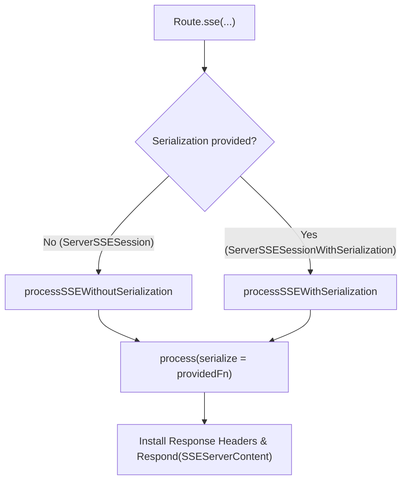
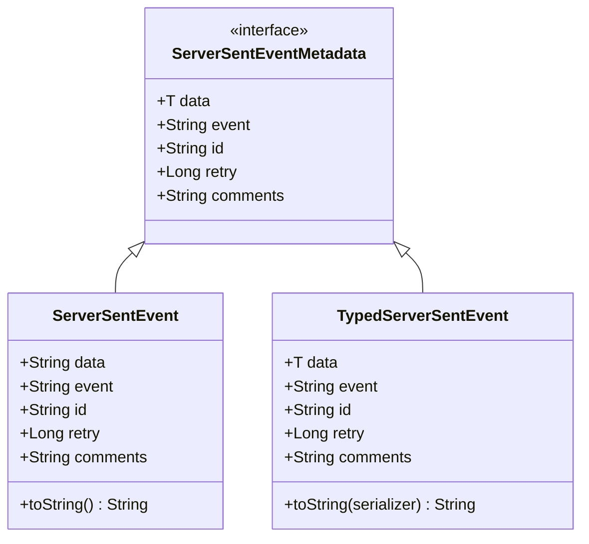
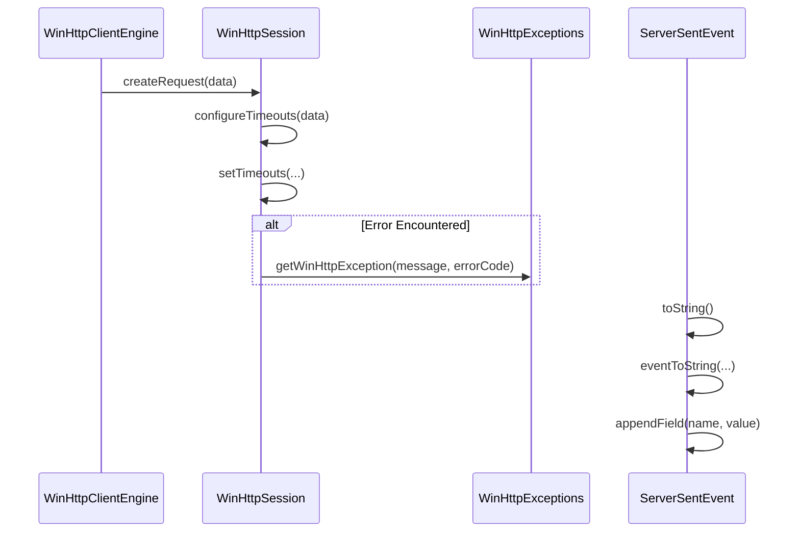

# Server SSE

<details>
<summary>Relevant source files</summary>

The following files were used as context for generating this wiki page:

- [ktor-client/ktor-client-core/common/src/io/ktor/client/plugins/sse/builders.kt](https://github.com/ktorio/ktor/blob/main/ktor-client/ktor-client-core/common/src/io/ktor/client/plugins/sse/builders.kt)
- [ktor-server/ktor-server-plugins/ktor-server-sse/common/src/io/ktor/server/sse/Routing.kt](https://github.com/ktorio/ktor/blob/main/ktor-server/ktor-server-plugins/ktor-server-sse/common/src/io/ktor/server/sse/Routing.kt)
- [ktor-client/ktor-client-core/common/src/io/ktor/client/plugins/sse/DefaultClientSSESession.kt](https://github.com/ktorio/ktor/blob/main/ktor-client/ktor-client-core/common/src/io/ktor/client/plugins/sse/DefaultClientSSESession.kt)
- [ktor-client/ktor-client-core/common/src/io/ktor/client/plugins/sse/SSE.kt](https://github.com/ktorio/ktor/blob/main/ktor-client/ktor-client-core/common/src/io/ktor/client/plugins/sse/SSE.kt)
- [ktor-server/ktor-server-plugins/ktor-server-sse/common/src/io/ktor/server/sse/ServerSSESession.kt](https://github.com/ktorio/ktor/blob/main/ktor-server/ktor-server-plugins/ktor-server-sse/common/src/io/ktor/server/sse/ServerSSESession.kt)
- [ktor-client/ktor-client-core/common/src/io/ktor/client/plugins/sse/ClientSSESession.kt](https://github.com/ktorio/ktor/blob/main/ktor-client/ktor-client-core/common/src/io/ktor/client/plugins/sse/ClientSSESession.kt)
- [ktor-server/ktor-server-plugins/ktor-server-sse/common/src/io/ktor/server/sse/DefaultServerSSESession.kt](https://github.com/ktorio/ktor/blob/main/ktor-server/ktor-server-plugins/ktor-server-sse/common/src/io/ktor/server/sse/DefaultServerSSESession.kt)
- [ktor-server/ktor-server-plugins/ktor-server-sse/common/src/io/ktor/server/sse/SSEServerContent.kt](https://github.com/ktorio/ktor/blob/main/ktor-server/ktor-server-plugins/ktor-server-sse/common/src/io/ktor/server/sse/SSEServerContent.kt)
- [ktor-shared/ktor-sse/common/src/io/ktor/sse/ServerSentEvent.kt](https://github.com/ktorio/ktor/blob/main/ktor-shared/ktor-sse/common/src/io/ktor/sse/ServerSentEvent.kt)
- [ktor-client/ktor-client-core/common/src/io/ktor/client/plugins/sse/SSEClientContent.kt](https://github.com/ktorio/ktor/blob/main/ktor-client/ktor-client-core/common/src/io/ktor/client/plugins/sse/SSEClientContent.kt)
- [ktor-server/ktor-server-plugins/ktor-server-sse/common/src/io/ktor/server/sse/SSE.kt](https://github.com/ktorio/ktor/blob/main/ktor-server/ktor-server-plugins/ktor-server-sse/common/src/io/ktor/server/sse/SSE.kt)
- [ktor-client/ktor-client-core/common/src/io/ktor/client/plugins/sse/SSEBufferPolicy.kt](https://github.com/ktorio/ktor/blob/main/ktor-client/ktor-client-core/common/src/io/ktor/client/plugins/sse/SSEBufferPolicy.kt)
- [ktor-client/ktor-client-winhttp/windows/src/io/ktor/client/engine/winhttp/internal/WinHttpExceptions.kt](https://github.com/ktorio/ktor/blob/main/ktor-client/ktor-client-winhttp/windows/src/io/ktor/client/engine/winhttp/internal/WinHttpExceptions.kt)
- [ktor-client/ktor-client-winhttp/windows/src/io/ktor/client/engine/winhttp/internal/WinHttpSession.kt](https://github.com/ktorio/ktor/blob/main/ktor-client/ktor-client-winhttp/windows/src/io/ktor/client/engine/winhttp/internal/WinHttpSession.kt)
- [ktor-client/ktor-client-winhttp/windows/src/io/ktor/client/engine/winhttp/WinHttpClientEngine.kt](https://github.com/ktorio/ktor/blob/main/ktor-client/ktor-client-winhttp/windows/src/io/ktor/client/engine/winhttp/WinHttpClientEngine.kt)
</details>

## Overview

### Overview Introduction

Server-Sent Events (SSE) in Ktor provide a lightweight, uni-directional, real-time communication channel from a server to clients over standard HTTP. Unlike WebSockets which establish a bi-directional TCP socket upgrade, SSE operates over a long-lived HTTP GET request where the server responds with a continuous stream of text chunks formatted according to the SSE specification (`text/event-stream`).

Sources: [ktor-server/ktor-server-plugins/ktor-server-sse/common/src/io/ktor/server/sse/Routing.kt:1-15](https://github.com/ktorio/ktor/blob/main/ktor-server/ktor-server-plugins/ktor-server-sse/common/src/io/ktor/server/sse/Routing.kt#L1-L15)

The Ktor server-side SSE architecture bridges Ktor's application routing pipeline with coroutine-based session handlers. When a client requests an SSE endpoint, the server intercepts the routing call, injects mandatory protocol headers (`Content-Type: text/event-stream`, `Cache-Control: no-store`, `Connection: keep-alive` for HTTP/1.x, and `X-Accel-Buffering: no`), and delegates output streaming to an `SSEServerContent` instance.

Sources: [ktor-server/ktor-server-plugins/ktor-server-sse/common/src/io/ktor/server/sse/Routing.kt:170-184](https://github.com/ktorio/ktor/blob/main/ktor-server/ktor-server-plugins/ktor-server-sse/common/src/io/ktor/server/sse/Routing.kt#L170-L184)

This object manages a `DefaultServerSSESession` lifecycle backed by a coroutine scope and a synchronized write channel. By encapsulating low-level framing rules, line-ending normalization (`\r\n`), serialization support, and periodic heartbeat mechanisms, Ktor allows developers to focus on publishing domain-specific events (`ServerSentEvent` or `TypedServerSentEvent`) directly from structured routing blocks.

Sources: [ktor-server/ktor-server-plugins/ktor-server-sse/common/src/io/ktor/server/sse/DefaultServerSSESession.kt:13-36](https://github.com/ktorio/ktor/blob/main/ktor-server/ktor-server-plugins/ktor-server-sse/common/src/io/ktor/server/sse/DefaultServerSSESession.kt#L13-L36), [ktor-server/ktor-server-plugins/ktor-server-sse/common/src/io/ktor/server/sse/SSEServerContent.kt:30-66](https://github.com/ktorio/ktor/blob/main/ktor-server/ktor-server-plugins/ktor-server-sse/common/src/io/ktor/server/sse/SSEServerContent.kt#L30-L66)

## Server Routing and Endpoint Extension Functions

### Routing Architecture and Builders

The server-side SSE plugin introduces routing extension functions on Ktor's `Route` class that automatically configure HTTP GET endpoints for event streaming. These builders eliminate boilerplate header configuration and route incoming connections directly into a suspending lambda receiver.

Sources: [ktor-server/ktor-server-plugins/ktor-server-sse/common/src/io/ktor/server/sse/Routing.kt:42-152](https://github.com/ktorio/ktor/blob/main/ktor-server/ktor-server-plugins/ktor-server-sse/common/src/io/ktor/server/sse/Routing.kt#L42-L152)

Ktor provides overloaded routing builders supporting both plain string-based events and typed serialization. When a client hits an SSE route, `processSSE` intercepts the call, sets required headers, and responds with an `SSEServerContent` object:

```kotlin
public fun Route.sse(
    path: String,
    serialize: (TypeInfo, Any) -> String,
    handler: suspend ServerSSESessionWithSerialization.() -> Unit
): Route = route(path, HttpMethod.Get) {
    sse(serialize, handler)
}
```

Sources: [ktor-server/ktor-server-plugins/ktor-server-sse/common/src/io/ktor/server/sse/Routing.kt:109-115](https://github.com/ktorio/ktor/blob/main/ktor-server/ktor-server-plugins/ktor-server-sse/common/src/io/ktor/server/sse/Routing.kt#L109-L115)



Sources: [ktor-server/ktor-server-plugins/ktor-server-sse/common/src/io/ktor/server/sse/Routing.kt:40-152](https://github.com/ktorio/ktor/blob/main/ktor-server/ktor-server-plugins/ktor-server-sse/common/src/io/ktor/server/sse/Routing.kt#L40-L152)

## Session Interfaces and Lifecycle Management

### Session Properties and Methods

The `ServerSSESession` interface extends `CoroutineScope` and governs the server-side interaction lifecycle with a connected client. 

Sources: [ktor-server/ktor-server-plugins/ktor-server-sse/common/src/io/ktor/server/sse/ServerSSESession.kt:40-89](https://github.com/ktorio/ktor/blob/main/ktor-server/ktor-server-plugins/ktor-server-sse/common/src/io/ktor/server/sse/ServerSSESession.kt#L40-L89)

| Method / Property | Signature | Description |
| :--- | :--- | :--- |
| `call` | `ApplicationCall` | The HTTP call that originated the SSE session. |
| `send` | `suspend (ServerSentEvent) -> Unit` | Serializes and writes a raw `ServerSentEvent` to the client output channel. |
| `send` | `suspend (data, event, id, retry, comments) -> Unit` | Convenience builder that constructs and sends an event in one call. |
| `close` | `suspend () -> Unit` | Flushes and closes the underlying output channel, terminating the session. |

Sources: [ktor-server/ktor-server-plugins/ktor-server-sse/common/src/io/ktor/server/sse/ServerSSESession.kt:40-89](https://github.com/ktorio/ktor/blob/main/ktor-server/ktor-server-plugins/ktor-server-sse/common/src/io/ktor/server/sse/ServerSSESession.kt#L40-L89)

`ServerSSESessionWithSerialization` extends `ServerSSESession` by incorporating a serializer function (`(TypeInfo, Any) -> String`), enabling direct publishing of domain objects without manual string formatting.

```kotlin
public interface ServerSSESessionWithSerialization : ServerSSESession {
    public val serializer: (TypeInfo, Any) -> String
}
```

Sources: [ktor-server/ktor-server-plugins/ktor-server-sse/common/src/io/ktor/server/sse/ServerSSESession.kt:117-124](https://github.com/ktorio/ktor/blob/main/ktor-server/ktor-server-plugins/ktor-server-sse/common/src/io/ktor/server/sse/ServerSSESession.kt#L117-L124)

> [!NOTE]
> Closing the session using `close()` does not transmit a terminal event to the client; it merely shuts down the underlying socket channel. To signal a clean stream termination to clients, send a custom final event prior to returning from the handler block.

Sources: [ktor-server/ktor-server-plugins/ktor-server-sse/common/src/io/ktor/server/sse/ServerSSESession.kt:77-88](https://github.com/ktorio/ktor/blob/main/ktor-server/ktor-server-plugins/ktor-server-sse/common/src/io/ktor/server/sse/ServerSSESession.kt#L77-L88)

## Event Framing and Formatting

### Serialization and Line Formatting

Server-sent events are transmitted as text streams formatted according to the WHATWG SSE specification. The `ServerSentEvent` and `TypedServerSentEvent` data classes manage the fields that make up each message frame: `data`, `event`, `id`, `retry`, and `comments`.

Sources: [ktor-shared/ktor-sse/common/src/io/ktor/sse/ServerSentEvent.kt:24-80](https://github.com/ktorio/ktor/blob/main/ktor-shared/ktor-sse/common/src/io/ktor/sse/ServerSentEvent.kt#L24-L80)



Sources: [ktor-shared/ktor-sse/common/src/io/ktor/sse/ServerSentEvent.kt:24-80](https://github.com/ktorio/ktor/blob/main/ktor-shared/ktor-sse/common/src/io/ktor/sse/ServerSentEvent.kt#L24-L80)

When serialized via `eventToString`, fields are rendered with their respective prefixes, separated by colons and terminated with `\r\n`. Multi-line values in fields are automatically split across lines, ensuring protocol compliance.

```kotlin
private fun eventToString(data: String?, event: String?, id: String?, retry: Long?, comments: String?): String {
    return buildString {
        appendField("event", event)
        appendField("data", data)
        appendField("id", id)
        appendField("retry", retry)
        appendField("", comments)
    }
}
```

Sources: [ktor-shared/ktor-sse/common/src/io/ktor/sse/ServerSentEvent.kt:85-94](https://github.com/ktorio/ktor/blob/main/ktor-shared/ktor-sse/common/src/io/ktor/sse/ServerSentEvent.kt#L85-L94)

## Output Streaming and Concurrency Control

### Synchronized Byte Channel Writing

The underlying implementation of `ServerSSESession` is `DefaultServerSSESession`, which writes events to a `ByteWriteChannel`. Because multiple coroutines might attempt to publish events concurrently (such as background workers combined with user handlers), thread safety is enforced via a coroutine-safe `Mutex`.

Sources: [ktor-server/ktor-server-plugins/ktor-server-sse/common/src/io/ktor/server/sse/DefaultServerSSESession.kt:13-37](https://github.com/ktorio/ktor/blob/main/ktor-server/ktor-server-plugins/ktor-server-sse/common/src/io/ktor/server/sse/DefaultServerSSESession.kt#L13-L37)

```kotlin
internal class DefaultServerSSESession(
    private val output: ByteWriteChannel,
    override val call: ApplicationCall,
    override val coroutineContext: CoroutineContext
) : ServerSSESession {
    private val mutex = Mutex()

    override suspend fun send(event: ServerSentEvent) {
        mutex.withLock {
            output.writeSSE(event)
        }
    }

    override suspend fun close() {
        mutex.withLock {
            output.flushAndClose()
        }
    }

    private suspend fun ByteWriteChannel.writeSSE(event: ServerSentEvent) {
        writeStringUtf8(event.toString() + END_OF_LINE)
        flush()
    }
}
```

Sources: [ktor-server/ktor-server-plugins/ktor-server-sse/common/src/io/ktor/server/sse/DefaultServerSSESession.kt:13-36](https://github.com/ktorio/ktor/blob/main/ktor-server/ktor-server-plugins/ktor-server-sse/common/src/io/ktor/server/sse/DefaultServerSSESession.kt#L13-L36)

> [!WARNING]
> Unsynchronized concurrent calls to `send()` without the mutex lock would result in interleaved event frames on the underlying byte channel, corrupting the SSE stream syntax.

Sources: [ktor-server/ktor-server-plugins/ktor-server-sse/common/src/io/ktor/server/sse/DefaultServerSSESession.kt:18-24](https://github.com/ktorio/ktor/blob/main/ktor-server/ktor-server-plugins/ktor-server-sse/common/src/io/ktor/server/sse/DefaultServerSSESession.kt#L18-L24)

## Heartbeats and Keep-Alive Mechanisms

### Keep-Alive Scheduling

Long-lived HTTP connections are susceptible to intermediary timeouts or silent disconnections. Ktor provides a built-in `heartbeat` extension on `ServerSSESession` to periodically push keep-alive frames.

Sources: [ktor-server/ktor-server-plugins/ktor-server-sse/common/src/io/ktor/server/sse/ServerSSESession.kt:155-176](https://github.com/ktorio/ktor/blob/main/ktor-server/ktor-server-plugins/ktor-server-sse/common/src/io/ktor/server/sse/ServerSSESession.kt#L155-L176)

```kotlin
public fun ServerSSESession.heartbeat(heartbeatConfig: Heartbeat.() -> Unit = {}) {
    val heartbeat = Heartbeat().apply(heartbeatConfig)
    val heartbeatJob = Job(call.coroutineContext[Job])
    launch(heartbeatJob + CoroutineName("sse-heartbeat")) {
        while (true) {
            val event = heartbeat.eventProvider?.invoke() ?: heartbeat.event
            send(event)
            delay(heartbeat.period)
        }
    }
    call.attributes.put(heartbeatJobKey, heartbeatJob)
}
```

Sources: [ktor-server/ktor-server-plugins/ktor-server-sse/common/src/io/ktor/server/sse/ServerSSESession.kt:165-176](https://github.com/ktorio/ktor/blob/main/ktor-server/ktor-server-plugins/ktor-server-sse/common/src/io/ktor/server/sse/ServerSSESession.kt#L165-L176)

| Property | Default Value | Description |
| :--- | :--- | :--- |
| `period` | `30.seconds` | Duration between scheduled heartbeat event dispatches. |
| `event` | `ServerSentEvent(comments = "heartbeat")` | Default comment event sent on each tick. |
| `eventProvider` | `null` | Suspending lambda invoked on each tick to generate dynamic events (e.g., timestamps). Takes precedence over `event`. |

Sources: [ktor-server/ktor-server-plugins/ktor-server-sse/common/src/io/ktor/server/sse/ServerSSESession.kt:190-194](https://github.com/ktorio/ktor/blob/main/ktor-server/ktor-server-plugins/ktor-server-sse/common/src/io/ktor/server/sse/ServerSSESession.kt#L190-L194)

When the session terminates, `SSEServerContent`'s `finally` block automatically cancels the associated `heartbeatJob` to prevent resource leaks.

Sources: [ktor-server/ktor-server-plugins/ktor-server-sse/common/src/io/ktor/server/sse/SSEServerContent.kt:58-62](https://github.com/ktorio/ktor/blob/main/ktor-server/ktor-server-plugins/ktor-server-sse/common/src/io/ktor/server/sse/SSEServerContent.kt#L58-L62)

## Request Execution and Engine Call-Chain Walkthrough

### Call-Chain Trace: Execute to AppendField

When an SSE request executes through native client engines (such as WinHttp), or when server components construct and serialize event frames, operations follow a precise call chain. The verified execution path from engine execution through exception mapping and event string formatting resolves as follows:

1. `execute` (`WinHttpClientEngine.kt`): Initiates HTTP request processing.
2. `createRequest` (`WinHttpSession.kt`): Instantiates the request handle.
3. `configureTimeouts` (`WinHttpSession.kt`): Applies timeout configuration from capabilities.
4. `setTimeouts` (`WinHttpSession.kt`): Sets socket and connection timeouts on the WinHttp session.
5. `getWinHttpException` (`WinHttpExceptions.kt`): Maps Win32 error codes to Ktor socket exceptions.
6. `toString` (`ServerSentEvent.kt`): Converts the event into string payload format.
7. `eventToString` (`ServerSentEvent.kt`): Builds the complete multi-field event text block.
8. `appendField` (`ServerSentEvent.kt`): Appends individual fields (`event`, `data`, `id`, `retry`, `comments`) separated by colons and normalized line endings.

Sources: [ktor-client/ktor-client-winhttp/windows/src/io/ktor/client/engine/winhttp/WinHttpClientEngine.kt:32-60](https://github.com/ktorio/ktor/blob/main/ktor-client/ktor-client-winhttp/windows/src/io/ktor/client/engine/winhttp/WinHttpClientEngine.kt#L32-L60), [ktor-client/ktor-client-winhttp/windows/src/io/ktor/client/engine/winhttp/internal/WinHttpSession.kt:38-78](https://github.com/ktorio/ktor/blob/main/ktor-client/ktor-client-winhttp/windows/src/io/ktor/client/engine/winhttp/internal/WinHttpSession.kt#L38-L78), [ktor-client/ktor-client-winhttp/windows/src/io/ktor/client/engine/winhttp/internal/WinHttpExceptions.kt:33-44](https://github.com/ktorio/ktor/blob/main/ktor-client/ktor-client-winhttp/windows/src/io/ktor/client/engine/winhttp/internal/WinHttpExceptions.kt#L33-L44), [ktor-shared/ktor-sse/common/src/io/ktor/sse/ServerSentEvent.kt:76-104](https://github.com/ktorio/ktor/blob/main/ktor-shared/ktor-sse/common/src/io/ktor/sse/ServerSentEvent.kt#L76-L104)



Sources: [ktor-client/ktor-client-winhttp/windows/src/io/ktor/client/engine/winhttp/WinHttpClientEngine.kt:32-60](https://github.com/ktorio/ktor/blob/main/ktor-client/ktor-client-winhttp/windows/src/io/ktor/client/engine/winhttp/WinHttpClientEngine.kt#L32-L60), [ktor-client/ktor-client-winhttp/windows/src/io/ktor/client/engine/winhttp/internal/WinHttpSession.kt:38-78](https://github.com/ktorio/ktor/blob/main/ktor-client/ktor-client-winhttp/windows/src/io/ktor/client/engine/winhttp/internal/WinHttpSession.kt#L38-L78), [ktor-client/ktor-client-winhttp/windows/src/io/ktor/client/engine/winhttp/internal/WinHttpExceptions.kt:33-44](https://github.com/ktorio/ktor/blob/main/ktor-client/ktor-client-winhttp/windows/src/io/ktor/client/engine/winhttp/internal/WinHttpExceptions.kt#L33-L44), [ktor-shared/ktor-sse/common/src/io/ktor/sse/ServerSentEvent.kt:76-104](https://github.com/ktorio/ktor/blob/main/ktor-shared/ktor-sse/common/src/io/ktor/sse/ServerSentEvent.kt#L76-L104)

## Full Runnable Example

### Complete Server Implementation

The following complete example demonstrates installing the server SSE plugin, configuring a heartbeat, sending periodic string events, and publishing serialized domain objects over an SSE route.

Sources: [ktor-server/ktor-server-plugins/ktor-server-sse/common/src/io/ktor/server/sse/Routing.kt:25-35](https://github.com/ktorio/ktor/blob/main/ktor-server/ktor-server-plugins/ktor-server-sse/common/src/io/ktor/server/sse/Routing.kt#L25-L35), [ktor-server/ktor-server-plugins/ktor-server-sse/common/src/io/ktor/server/sse/ServerSSESession.kt:165-176](https://github.com/ktorio/ktor/blob/main/ktor-server/ktor-server-plugins/ktor-server-sse/common/src/io/ktor/server/sse/ServerSSESession.kt#L165-L176)

```kotlin
import io.ktor.serialization.kotlinx.json.*
import io.ktor.server.application.*
import io.ktor.server.engine.*
import io.ktor.server.netty.*
import io.ktor.server.plugins.contentnegotiation.*
import io.ktor.server.routing.*
import io.ktor.server.sse.*
import io.ktor.sse.*
import kotlinx.serialization.Serializable
import kotlinx.serialization.json.Json
import kotlin.time.Duration.Companion.seconds

@Serializable
data class Notification(val id: Int, val message: String)

fun main() {
    embeddedServer(Netty, port = 8080) {
        install(ContentNegotiation) {
            json()
        }
        install(SSE)

        routing {
            sse("/events") {
                // Start a background keep-alive heartbeat every 10 seconds
                heartbeat {
                    period = 10.seconds
                }

                // Send regular string events
                repeat(5) { index ->
                    send(ServerSentEvent(data = "Update number $index", id = index.toString()))
                }
            }
        }
    }.start(wait = true)
}
```

Sources: [ktor-server/ktor-server-plugins/ktor-server-sse/common/src/io/ktor/server/sse/Routing.kt:25-35](https://github.com/ktorio/ktor/blob/main/ktor-server/ktor-server-plugins/ktor-server-sse/common/src/io/ktor/server/sse/Routing.kt#L25-L35), [ktor-server/ktor-server-plugins/ktor-server-sse/common/src/io/ktor/server/sse/ServerSSESession.kt:165-176](https://github.com/ktorio/ktor/blob/main/ktor-server/ktor-server-plugins/ktor-server-sse/common/src/io/ktor/server/sse/ServerSSESession.kt#L165-L176)

## Related

- [[Client WebSockets and SSE]]

