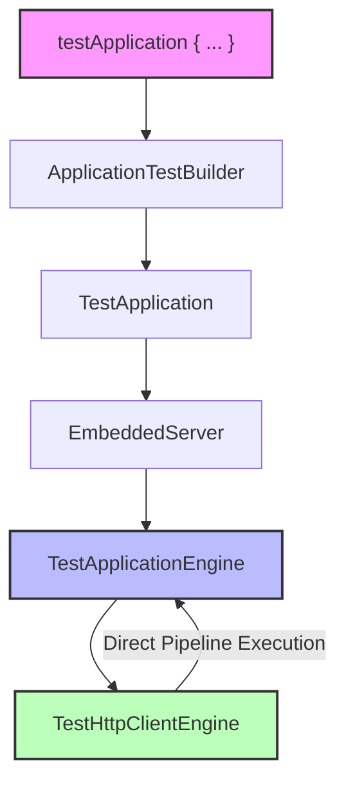
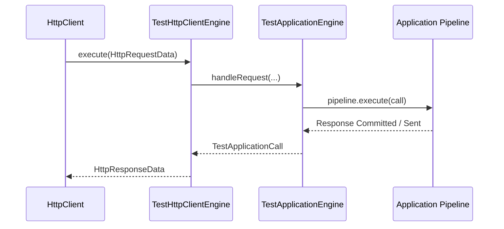

# Server Testing

<details>
<summary>Relevant source files</summary>

The following files were used as context for generating this wiki page:

- [ktor-server/ktor-server-test-host/common/src/io/ktor/server/testing/TestApplication.kt](https://github.com/ktorio/ktor/blob/main/ktor-server/ktor-server-test-host/common/src/io/ktor/server/testing/TestApplication.kt)
- [ktor-server/ktor-server-test-host/common/src/io/ktor/server/testing/TestApplicationEngine.kt](https://github.com/ktorio/ktor/blob/main/ktor-server/ktor-server-test-host/common/src/io/ktor/server/testing/TestApplicationEngine.kt)
- [ktor-server/ktor-server-test-host/common/src/io/ktor/server/testing/client/TestHttpClientEngine.kt](https://github.com/ktorio/ktor/blob/main/ktor-server/ktor-server-test-host/common/src/io/ktor/server/testing/client/TestHttpClientEngine.kt)
- [ktor-network/web/src/io/ktor/network/sockets/SocketEngine.tcp.web.kt](https://github.com/ktorio/ktor/blob/main/ktor-network/web/src/io/ktor/network/sockets/SocketEngine.tcp.web.kt)
- [ktor-server/ktor-server-tomcat/jvm/src/io/ktor/server/tomcat/TomcatApplicationEngine.kt](https://github.com/ktorio/ktor/blob/main/ktor-server/ktor-server-tomcat/jvm/src/io/ktor/server/tomcat/TomcatApplicationEngine.kt)
- [ktor-server/ktor-server-test-host/common/src/io/ktor/server/testing/TestEngine.kt](https://github.com/ktorio/ktor/blob/main/ktor-server/ktor-server-test-host/common/src/io/ktor/server/testing/TestEngine.kt)
- [ktor-server/ktor-server-test-host/common/src/io/ktor/server/testing/client/DelegatingTestClientEngine.kt](https://github.com/ktorio/ktor/blob/main/ktor-server/ktor-server-test-host/common/src/io/ktor/server/testing/client/DelegatingTestClientEngine.kt)
- [ktor-server/ktor-server-test-suites/jvm/src/io/ktor/server/testing/suites/ConnectionTestSuite.kt](https://github.com/ktorio/ktor/blob/main/ktor-server/ktor-server-test-suites/jvm/src/io/ktor/server/testing/suites/ConnectionTestSuite.kt)
- [ktor-server/ktor-server-test-suites/jvm/src/io/ktor/server/testing/suites/ServerPluginsTestSuite.kt](https://github.com/ktorio/ktor/blob/main/ktor-server/ktor-server-test-suites/jvm/src/io/ktor/server/testing/suites/ServerPluginsTestSuite.kt)
- [ktor-server/ktor-server-test-host/jvm/src/io/ktor/server/testing/TestApplicationEngineJvm.kt](https://github.com/ktorio/ktor/blob/main/ktor-server/ktor-server-test-host/jvm/src/io/ktor/server/testing/TestApplicationEngineJvm.kt)
- [ktor-server/ktor-server-test-suites/jvm/src/io/ktor/server/testing/suites/SustainabilityTestSuite.kt](https://github.com/ktorio/ktor/blob/main/ktor-server/ktor-server-test-suites/jvm/src/io/ktor/server/testing/suites/SustainabilityTestSuite.kt)
- [ktor-server/ktor-server-test-host/common/src/io/ktor/server/testing/TestApplicationRequest.kt](https://github.com/ktorio/ktor/blob/main/ktor-server/ktor-server-test-host/common/src/io/ktor/server/testing/TestApplicationRequest.kt)
- [ktor-server/ktor-server-test-suites/common/src/io/ktor/server/testing/suites/HttpServerCommonTestSuite.kt](https://github.com/ktorio/ktor/blob/main/ktor-server/ktor-server-test-suites/common/src/io/ktor/server/testing/suites/HttpServerCommonTestSuite.kt)
- [ktor-server/ktor-server-test-host/common/src/io/ktor/server/testing/TestApplicationCall.kt](https://github.com/ktorio/ktor/blob/main/ktor-server/ktor-server-test-host/common/src/io/ktor/server/testing/TestApplicationCall.kt)
- [ktor-server/ktor-server-test-suites/jvm/src/io/ktor/server/testing/suites/HttpServerJvmTestSuite.kt](https://github.com/ktorio/ktor/blob/main/ktor-server/ktor-server-test-suites/jvm/src/io/ktor/server/testing/suites/HttpServerJvmTestSuite.kt)
- [ktor-server/ktor-server-test-host/jvm/src/io/ktor/server/testing/client/TestHttpClientEngineBridgeJvm.kt](https://github.com/ktorio/ktor/blob/main/ktor-server/ktor-server-test-host/jvm/src/io/ktor/server/testing/client/TestHttpClientEngineBridgeJvm.kt)
- [ktor-server/ktor-server-test-suites/jvm/src/io/ktor/server/testing/suites/EngineStressSuite.kt](https://github.com/ktorio/ktor/blob/main/ktor-server/ktor-server-test-suites/jvm/src/io/ktor/server/testing/suites/EngineStressSuite.kt)
- [ktor-server/ktor-server-test-suites/jvm/src/io/ktor/server/testing/suites/HttpRequestLifecycleTest.kt](https://github.com/ktorio/ktor/blob/main/ktor-server/ktor-server-test-suites/jvm/src/io/ktor/server/testing/suites/HttpRequestLifecycleTest.kt)
</details>

## Overview

### Overview Context

Server testing in Ktor provides a dedicated test infrastructure designed to validate HTTP server applications, routing logic, plugins, and lifecycle handlers without requiring external network socket binding. The core design centers around an in-memory execution pipeline driven by `TestApplication` and `TestApplicationEngine`, paired with an embedded Ktor HTTP client (`TestHttpClientEngine`) that dispatches test requests directly into the server application. This architecture eliminates port allocation conflicts, accelerates test execution, and ensures deterministic behavior across asynchronous coroutine pipelines.

Sources: [ktor-server/ktor-server-test-host/common/src/io/ktor/server/testing/TestApplication.kt:68-125](https://github.com/ktorio/ktor/blob/main/ktor-server/ktor-server-test-host/common/src/io/ktor/server/testing/TestApplication.kt#L68-L125), [ktor-server/ktor-server-test-host/common/src/io/ktor/server/testing/TestApplicationEngine.kt:37-43](https://github.com/ktorio/ktor/blob/main/ktor-server/ktor-server-test-host/common/src/io/ktor/server/testing/TestApplicationEngine.kt#L37-L43)

Beyond local in-memory testing, the Ktor test ecosystem includes robust test suites (`HttpServerCommonTestSuite`, `ConnectionTestSuite`, `SustainabilityTestSuite`, and `EngineStressSuite`) that execute against real engine backends such as Tomcat and CIO. These suites validate low-level networking invariants, keep-alive handling, pipelining resilience, chunked transfer decoding, error propagation through interception pipelines, and request lifecycle cancellation under network stress.

Sources: [ktor-server/ktor-server-test-suites/jvm/src/io/ktor/server/testing/suites/ConnectionTestSuite.kt:24-156](https://github.com/ktorio/ktor/blob/main/ktor-server/ktor-server-test-suites/jvm/src/io/ktor/server/testing/suites/ConnectionTestSuite.kt#L24-L156), [ktor-server/ktor-server-test-suites/jvm/src/io/ktor/server/testing/suites/SustainabilityTestSuite.kt:46-48](https://github.com/ktorio/ktor/blob/main/ktor-server/ktor-server-test-suites/jvm/src/io/ktor/server/testing/suites/SustainabilityTestSuite.kt#L46-L48)



Sources: [ktor-server/ktor-server-test-host/common/src/io/ktor/server/testing/TestApplication.kt:135-139](https://github.com/ktorio/ktor/blob/main/ktor-server/ktor-server-test-host/common/src/io/ktor/server/testing/TestApplication.kt#L135-L139), [ktor-server/ktor-server-test-host/common/src/io/ktor/server/testing/TestApplicationEngine.kt:37-43](https://github.com/ktorio/ktor/blob/main/ktor-server/ktor-server-test-host/common/src/io/ktor/server/testing/TestApplicationEngine.kt#L37-L43), [ktor-server/ktor-server-test-host/common/src/io/ktor/server/testing/client/TestHttpClientEngine.kt:31-33](https://github.com/ktorio/ktor/blob/main/ktor-server/ktor-server-test-host/common/src/io/ktor/server/testing/client/TestHttpClientEngine.kt#L31-L33)

## Test Application and Builder API

The primary entry point for testing Ktor server applications is the `testApplication` coroutine builder. This utility instantiates an `ApplicationTestBuilder`, evaluates the configuration block, wraps the resulting application in a `TestApplication` host, starts the engine, and automatically manages resource cleanup upon completion.

Sources: [ktor-server/ktor-server-test-host/common/src/io/ktor/server/testing/TestApplication.kt:135-139](https://github.com/ktorio/ktor/blob/main/ktor-server/ktor-server-test-host/common/src/io/ktor/server/testing/TestApplication.kt#L135-L139), [ktor-server/ktor-server-test-host/common/src/io/ktor/server/testing/TestApplication.kt:460-462](https://github.com/ktorio/ktor/blob/main/ktor-server/ktor-server-test-host/common/src/io/ktor/server/testing/TestApplication.kt#L460-L462)

The `TestApplicationBuilder` exposes modular configuration methods that allow developers to inject application modules, configure environment settings, load external configuration files (such as HOCON files via `configure()`), install server plugins, and define routing hierarchies prior to application initialization.

Sources: [ktor-server/ktor-server-test-host/common/src/io/ktor/server/testing/TestApplication.kt:182-359](https://github.com/ktorio/ktor/blob/main/ktor-server/ktor-server-test-host/common/src/io/ktor/server/testing/TestApplication.kt#L182-L359)

```kotlin
@Test
fun testRoot() = testApplication {
    configure("application.conf")
    application {
        routing {
            get("/") {
                call.respondText("Hello, world!")
            }
        }
    }
    val response = client.get("/")
    assertEquals(HttpStatusCode.OK, response.status)
    assertEquals("Hello, world!", response.bodyAsText())
}
```

Sources: [ktor-server/ktor-server-test-host/common/src/io/ktor/server/testing/TestApplication.kt:448-455](https://github.com/ktorio/ktor/blob/main/ktor-server/ktor-server-test-host/common/src/io/ktor/server/testing/TestApplication.kt#L448-L455)

The builder enforces strict immutability checks once the underlying application has been built. Calling any configuration modifier after the test application properties have been evaluated triggers an immediate check failure.

Sources: [ktor-server/ktor-server-test-host/common/src/io/ktor/server/testing/TestApplication.kt:193-209](https://github.com/ktorio/ktor/blob/main/ktor-server/ktor-server-test-host/common/src/io/ktor/server/testing/TestApplication.kt#L193-L209), [ktor-server/ktor-server-test-host/common/src/io/ktor/server/testing/TestApplication.kt:361-366](https://github.com/ktorio/ktor/blob/main/ktor-server/ktor-server-test-host/common/src/io/ktor/server/testing/TestApplication.kt#L361-L366)

> [!CAUTION]
> Attempting to modify environment parameters, engines, or server configuration blocks after accessing the `client` property for the first time will trigger a `IllegalStateException` because `built` is set to `true` on property evaluation.

Sources: [ktor-server/ktor-server-test-host/common/src/io/ktor/server/testing/TestApplication.kt:193-195](https://github.com/ktorio/ktor/blob/main/ktor-server/ktor-server-test-host/common/src/io/ktor/server/testing/TestApplication.kt#L193-L195), [ktor-server/ktor-server-test-host/common/src/io/ktor/server/testing/TestApplication.kt:361-366](https://github.com/ktorio/ktor/blob/main/ktor-server/ktor-server-test-host/common/src/io/ktor/server/testing/TestApplication.kt#L361-L366)

```kotlin
private void checkNotBuilt() {
    check(!built) {
        "The test application has already been built. Make sure you configure the application " +
            "before accessing the client for the first time."
    }
}
```

Sources: [ktor-server/ktor-server-test-host/common/src/io/ktor/server/testing/TestApplication.kt:361-366](https://github.com/ktorio/ktor/blob/main/ktor-server/ktor-server-test-host/common/src/io/ktor/server/testing/TestApplication.kt#L361-L366)

## Test Application Engine Mechanics

`TestApplicationEngine` extends `BaseApplicationEngine` and functions as an in-memory application host. It does not bind to TCP server sockets or initialize native networking drivers during standard tests. Instead, it exposes a direct coroutine scope and executes calls injected via `handleRequest`.

Sources: [ktor-server/ktor-server-test-host/common/src/io/ktor/server/testing/TestApplicationEngine.kt:37-50](https://github.com/ktorio/ktor/blob/main/ktor-server/ktor-server-test-host/common/src/io/ktor/server/testing/TestApplicationEngine.kt#L37-L50), [ktor-server/ktor-server-test-host/common/src/io/ktor/server/testing/TestApplicationEngine.kt:189-214](https://github.com/ktorio/ktor/blob/main/ktor-server/ktor-server-test-host/common/src/io/ktor/server/testing/TestApplicationEngine.kt#L189-214)



Sources: [ktor-server/ktor-server-test-host/common/src/io/ktor/server/testing/TestApplicationEngine.kt:37-43](https://github.com/ktorio/ktor/blob/main/ktor-server/ktor-server-test-host/common/src/io/ktor/server/testing/TestApplicationEngine.kt#L37-L43), [ktor-server/ktor-server-test-host/common/src/io/ktor/server/testing/TestApplicationEngine.kt:189-214](https://github.com/ktorio/ktor/blob/main/ktor-server/ktor-server-test-host/common/src/io/ktor/server/testing/TestApplicationEngine.kt#L189-214), [ktor-server/ktor-server-test-host/common/src/io/ktor/server/testing/client/TestHttpClientEngine.kt:43-78](https://github.com/ktorio/ktor/blob/main/ktor-server/ktor-server-test-host/common/src/io/ktor/server/testing/client/TestHttpClientEngine.kt#L43-L78)

During engine initialization, the call interceptor is registered into the `EnginePipeline.Call` phase. If an unhandled exception occurs during pipeline execution, the engine inspects the call attributes for routing context and delegates to `handleTestFailure`.

Sources: [ktor-server/ktor-server-test-host/common/src/io/ktor/server/testing/TestApplicationEngine.kt:104-121](https://github.com/ktorio/ktor/blob/main/ktor-server/ktor-server-test-host/common/src/io/ktor/server/testing/TestApplicationEngine.kt#L104-L121)

```kotlin
pipeline.intercept(EnginePipeline.Call) { callInterceptor(Unit) }
_client.value = HttpClient(engine)

_callInterceptor.value = {
    try {
        call.application.execute(call)
    } catch (cause: Throwable) {
        @Suppress("INVISIBLE_REFERENCE")
        val routeCall = call.attributes.getOrNull(io.ktor.server.routing.routingCallKey)
        if (routeCall != null) {
            handleTestFailure(routeCall, cause)
        } else {
            handleTestFailure(call, cause)
        }
    }
}
```

Sources: [ktor-server/ktor-server-test-host/common/src/io/ktor/server/testing/TestApplicationEngine.kt:104-121](https://github.com/ktorio/ktor/blob/main/ktor-server/ktor-server-test-host/common/src/io/ktor/server/testing/TestApplicationEngine.kt#L104-L121)

> [!NOTE]
> The error handling guard checks whether `ktor.test.throwOnException` is enabled in application configuration. If set to `false`, exceptions result in standard `InternalServerError` responses rather than propagating outward, allowing status page verification tests to execute safely.

Sources: [ktor-server/ktor-server-test-host/common/src/io/ktor/server/testing/TestApplicationEngine.kt:27-30](https://github.com/ktorio/ktor/blob/main/ktor-server/ktor-server-test-host/common/src/io/ktor/server/testing/TestApplicationEngine.kt#L27-30), [ktor-server/ktor-server-test-host/common/src/io/ktor/server/testing/TestApplicationEngine.kt:123-134](https://github.com/ktorio/ktor/blob/main/ktor-server/ktor-server-test-host/common/src/io/ktor/server/testing/TestApplicationEngine.kt#L123-L134)

## Test HTTP Client Integration

The Ktor test host bridges standard client requests made via `client.get(...)`, `client.post(...)`, and related methods directly to the test application engine using `TestHttpClientEngine`. This engine implements `HttpClientEngineBase` and supports capabilities including `WebSocketCapability`, `HttpTimeoutCapability`, and `SSECapability`.

Sources: [ktor-server/ktor-server-test-host/common/src/io/ktor/server/testing/client/TestHttpClientEngine.kt:31-37](https://github.com/ktorio/ktor/blob/main/ktor-server/ktor-server-test-host/common/src/io/ktor/server/testing/client/TestHttpClientEngine.kt#L31-L37)

When `execute(data: HttpRequestData)` is invoked:
1. The request URI, method, headers, and body content are mapped into a `TestApplicationRequest`.
2. For standard requests, `app.handleRequest` is called to execute the engine pipeline synchronously within coroutine contexts.
3. For upgrade requests (such as WebSockets), `bridge.runWebSocketRequest` initiates a WebSocket session bridge between the client test session and the server test call.
4. Response headers, status codes, and body channels are collected and transformed back into `HttpResponseData` for the Ktor client pipeline.

Sources: [ktor-server/ktor-server-test-host/common/src/io/ktor/server/testing/client/TestHttpClientEngine.kt:43-78](https://github.com/ktorio/ktor/blob/main/ktor-server/ktor-server-test-host/common/src/io/ktor/server/testing/client/TestHttpClientEngine.kt#L43-L78), [ktor-server/ktor-server-test-host/common/src/io/ktor/server/testing/client/TestHttpClientEngine.kt:80-99](https://github.com/ktorio/ktor/blob/main/ktor-server/ktor-server-test-host/common/src/io/ktor/server/testing/client/TestHttpClientEngine.kt#L80-L99)

```kotlin
override suspend fun execute(data: HttpRequestData): HttpResponseData {
    val callContext = callContext()
    try {
        if (data.isUpgradeRequest()) {
            val (testServerCall, session) = with(data) {
                bridge.runWebSocketRequest(url.fullPath, headers, body, callContext)
            }
            return with(testServerCall.response) {
                httpResponseData(session)
            }
        }

        val testServerCall = with(data) {
            runRequest(method, url, headers, body, url.protocol, data.getCapabilityOrNull(HttpTimeoutCapability))
        }
        val response = testServerCall.response
        val status = response.statusOrNotFound()
        val headers = response.headers.allValues().takeUnless { it.isEmpty() } ?: Headers
            .build { append(HttpHeaders.ContentLength, "0") }
        val body = response.writeContentChannel.value ?: ByteReadChannel(response.byteContent ?: byteArrayOf())
        val responseBody: Any = data.attributes.getOrNull(ResponseAdapterAttributeKey)
            ?.adapt(data, status, headers, body, data.body, callContext)
            ?: body

        return HttpResponseData(
            status,
            GMTDate(),
            headers,
            HttpProtocolVersion.HTTP_1_1,
            responseBody,
            callContext
        )
    } catch (cause: Throwable) {
        throw cause.mapToKtor(data)
    }
}
```

Sources: [ktor-server/ktor-server-test-host/common/src/io/ktor/server/testing/client/TestHttpClientEngine.kt:43-78](https://github.com/ktorio/ktor/blob/main/ktor-server/ktor-server-test-host/common/src/io/ktor/server/testing/client/TestHttpClientEngine.kt#L43-L78)

## External Services Mocking

In distributed application architectures, services frequently depend on external HTTP APIs. `ExternalServicesBuilder` allows test authors to spin up secondary isolated `TestApplication` instances bound to specific host authorities or URLs.

Sources: [ktor-server/ktor-server-test-host/common/src/io/ktor/server/testing/TestApplication.kt:143-153](https://github.com/ktorio/ktor/blob/main/ktor-server/ktor-server-test-host/common/src/io/ktor/server/testing/TestApplication.kt#L143-L153), [ktor-server/ktor-server-test-host/common/src/io/ktor/server/testing/TestApplication.kt:161-173](https://github.com/ktorio/ktor/blob/main/ktor-server/ktor-server-test-host/common/src/io/ktor/server/testing/TestApplication.kt#L161-L173)

```kotlin
testApplication {
    externalServices {
        hosts("https://api.example.com") {
            routing {
                get("/data") {
                    call.respondText("mocked external response")
                }
            }
        }
    }
    application {
        routing {
            get("/consume") {
                val client = createClient { }
                val res = client.get("https://api.example.com/data")
                call.respondText(res.bodyAsText())
            }
        }
    }
}
```

Sources: [ktor-server/ktor-server-test-host/common/src/io/ktor/server/testing/TestApplication.kt:161-173](https://github.com/ktorio/ktor/blob/main/ktor-server/ktor-server-test-host/common/src/io/ktor/server/testing/TestApplication.kt#L161-L173), [ktor-server/ktor-server-test-host/common/src/io/ktor/server/testing/TestApplication.kt:460-462](https://github.com/ktorio/ktor/blob/main/ktor-server/ktor-server-test-host/common/src/io/ktor/server/testing/TestApplication.kt#L460-L462)

When `DelegatingTestClientEngine` intercepts an outbound request, it evaluates whether the request authority matches an external service mock or the main application connector list. If a match is found, execution is routed directly to the appropriate `TestHttpClientEngine`; otherwise, an `InvalidTestRequestException` is thrown.

Sources: [ktor-server/ktor-server-test-host/common/src/io/ktor/server/testing/client/DelegatingTestClientEngine.kt:25-64](https://github.com/ktorio/ktor/blob/main/ktor-server/ktor-server-test-host/common/src/io/ktor/server/testing/client/DelegatingTestClientEngine.kt#L25-L64)

```kotlin
override suspend fun execute(data: HttpRequestData): HttpResponseData {
    config.testApplicationProvder().start()
    val mainEngineHostWithPorts = mainEngineHostWithPortsDeferred.await()
    val authority = data.url.protocolWithAuthority
    val hostWithPort = data.url.hostWithPort
    return when {
        externalEngines.containsKey(authority) -> {
            externalEngines[authority]!!.execute(data)
        }

        hostWithPort in mainEngineHostWithPorts -> {
            mainEngine.execute(data)
        }

        else -> {
            throw InvalidTestRequestException(authority, externalEngines.keys, mainEngineHostWithPorts)
        }
    }
}
```

Sources: [ktor-server/ktor-server-test-host/common/src/io/ktor/server/testing/client/DelegatingTestClientEngine.kt:46-65](https://github.com/ktorio/ktor/blob/main/ktor-server/ktor-server-test-host/common/src/io/ktor/server/testing/client/DelegatingTestClientEngine.kt#L46-L65)

## Engine and Integration Test Suites

### Test Suites Architecture

Ktor provides comprehensive abstract test suites (`HttpServerCommonTestSuite`, `HttpServerJvmTestSuite`, `ConnectionTestSuite`, `SustainabilityTestSuite`, and `EngineStressSuite`) to ensure that concrete server engines (such as Netty, CIO, and Tomcat) conform to protocol specifications, pipeline semantics, and concurrency standards.

Sources: [ktor-server/ktor-server-test-suites/jvm/src/io/ktor/server/testing/suites/ConnectionTestSuite.kt:24-24](https://github.com/ktorio/ktor/blob/main/ktor-server/ktor-server-test-suites/jvm/src/io/ktor/server/testing/suites/ConnectionTestSuite.kt#L24-L24), [ktor-server/ktor-server-test-suites/jvm/src/io/ktor/server/testing/suites/ServerPluginsTestSuite.kt:17-19](https://github.com/ktorio/ktor/blob/main/ktor-server/ktor-server-test-suites/jvm/src/io/ktor/server/testing/suites/ServerPluginsTestSuite.kt#L17-L19), [ktor-server/ktor-server-test-suites/jvm/src/io/ktor/server/testing/suites/SustainabilityTestSuite.kt:46-48](https://github.com/ktorio/ktor/blob/main/ktor-server/ktor-server-test-suites/jvm/src/io/ktor/server/testing/suites/SustainabilityTestSuite.kt#L46-L48), [ktor-server/ktor-server-test-suites/common/src/io/ktor/server/testing/suites/HttpServerCommonTestSuite.kt:41-43](https://github.com/ktorio/ktor/blob/main/ktor-server/ktor-server-test-suites/common/src/io/ktor/server/testing/suites/HttpServerCommonTestSuite.kt#L41-L43), [ktor-server/ktor-server-test-suites/jvm/src/io/ktor/server/testing/suites/HttpServerJvmTestSuite.kt:34-36](https://github.com/ktorio/ktor/blob/main/ktor-server/ktor-server-test-suites/jvm/src/io/ktor/server/testing/suites/HttpServerJvmTestSuite.kt#L34-L36), [ktor-server/ktor-server-test-suites/jvm/src/io/ktor/server/testing/suites/EngineStressSuite.kt:30-32](https://github.com/ktorio/ktor/blob/main/ktor-server/ktor-server-test-suites/jvm/src/io/ktor/server/testing/suites/EngineStressSuite.kt#L30-32)

### Test Suites Reference Table

| Suite Name | Base Class | Core Responsibilities |
| :--- | :--- | :--- |
| **HttpServerCommonTestSuite** | `EngineTestBase` | Redirects, custom headers, content negotiation, status pages, chunked encoding validation, query parameters, proxy headers (`X-Forwarded-*`). |
| **HttpServerJvmTestSuite** | `EngineTestBase` | TCP pipelining, request flushing, keep-alive persistence, socket disconnections, TCP reset handling (`SO_LINGER`), protocol upgrades. |
| **ConnectionTestSuite** | `ApplicationEngineFactory` | Network address resolution, shutdown grace periods, server ready event publication, IPv6 binding. |
| **SustainabilityTestSuite** | `EngineTestBase` | Error logging, post-content ignoring, big file transfers (`LocalFileContent`), concurrent blocking calls, request lifecycle cancellations. |
| **EngineStressSuite** | `EngineTestBase` | High-pressure load testing, single/multiple connection stress, long responses, high-load HTTP generation. |

Sources: [ktor-server/ktor-server-test-suites/jvm/src/io/ktor/server/testing/suites/ConnectionTestSuite.kt:24-156](https://github.com/ktorio/ktor/blob/main/ktor-server/ktor-server-test-suites/jvm/src/io/ktor/server/testing/suites/ConnectionTestSuite.kt#L24-L156), [ktor-server/ktor-server-test-suites/jvm/src/io/ktor/server/testing/suites/ServerPluginsTestSuite.kt:17-95](https://github.com/ktorio/ktor/blob/main/ktor-server/ktor-server-test-suites/jvm/src/io/ktor/server/testing/suites/ServerPluginsTestSuite.kt#L17-L95), [ktor-server/ktor-server-test-suites/jvm/src/io/ktor/server/testing/suites/SustainabilityTestSuite.kt:46-1018](https://github.com/ktorio/ktor/blob/main/ktor-server/ktor-server-test-suites/jvm/src/io/ktor/server/testing/suites/SustainabilityTestSuite.kt#L46-L1018), [ktor-server/ktor-server-test-suites/common/src/io/ktor/server/testing/suites/HttpServerCommonTestSuite.kt:41-918](https://github.com/ktorio/ktor/blob/main/ktor-server/ktor-server-test-suites/common/src/io/ktor/server/testing/suites/HttpServerCommonTestSuite.kt#L41-918), [ktor-server/ktor-server-test-suites/jvm/src/io/ktor/server/testing/suites/HttpServerJvmTestSuite.kt:34-462](https://github.com/ktorio/ktor/blob/main/ktor-server/ktor-server-test-suites/jvm/src/io/ktor/server/testing/suites/HttpServerJvmTestSuite.kt#L34-462), [ktor-server/ktor-server-test-suites/jvm/src/io/ktor/server/testing/suites/EngineStressSuite.kt:30-339](https://github.com/ktorio/ktor/blob/main/ktor-server/ktor-server-test-suites/jvm/src/io/ktor/server/testing/suites/EngineStressSuite.kt#L30-339)

### Request Lifecycle and Cancellation Testing

The `HttpRequestLifecycleTest` suite verifies that client disconnections correctly propagate cancellation signals down the server coroutine hierarchy. When `cancelCallOnClose = true` is configured on `HttpRequestLifecycle`, abrupt socket closures (such as setting `SO_LINGER` to `0` and closing the raw socket) trigger a `ConnectionClosedException` root cause inside the active call coroutine context.

Sources: [ktor-server/ktor-server-test-suites/jvm/src/io/ktor/server/testing/suites/HttpRequestLifecycleTest.kt:33-44](https://github.com/ktorio/ktor/blob/main/ktor-server/ktor-server-test-suites/jvm/src/io/ktor/server/testing/suites/HttpRequestLifecycleTest.kt#L33-L44), [ktor-server/ktor-server-test-suites/jvm/src/io/ktor/server/testing/suites/HttpRequestLifecycleTest.kt:58-69](https://github.com/ktorio/ktor/blob/main/ktor-server/ktor-server-test-suites/jvm/src/io/ktor/server/testing/suites/HttpRequestLifecycleTest.kt#L58-L69)

```kotlin
@Test
@OptIn(ExperimentalAtomicApi::class)
open fun testPipelinedRequestsCancelledOnDisconnect() = runTest {
    val pipelinedCount = 10
    val allStarted = Channel<Unit>(pipelinedCount)
    val cancelledCount = AtomicInt(0)
    val allCancelled = CompletableDeferred<Unit>()

    val server = createServer {
        install(HttpRequestLifecycle) {
            cancelCallOnClose = true
        }
        routing {
            get("/slow") {
                allStarted.send(Unit)
                try {
                    repeat(100) {
                        delay(200.milliseconds)
                    }
                    call.respondText("Done")
                } catch (e: CancellationException) {
                    val count = cancelledCount.incrementAndFetch()
                    if (count == pipelinedCount) {
                        allCancelled.complete(Unit)
                    }
                    throw e
                }
            }
        }
    }
    startServer(server)

    val socket = Socket()
    socket.tcpNoDelay = true
    socket.connect(InetSocketAddress("127.0.0.1", port))

    try {
        val writer = OutputStreamWriter(socket.getOutputStream(), Charsets.US_ASCII)
        repeat(pipelinedCount) {
            writer.write("GET /slow HTTP/1.1\r\n")
            writer.write("Host: localhost:$port\r\n")
            writer.write("Connection: keep-alive\r\n")
            writer.write("\r\n")
        }
        writer.flush()

        withTimeout(10.seconds) {
            repeat(pipelinedCount) {
                allStarted.receive()
            }
        }
    } finally {
        socket.setSoLinger(true, 0)
        socket.close()
    }

    withTimeout(10.seconds) {
        allCancelled.await()
    }
    assertEquals(pipelinedCount, cancelledCount.load())
}
```

Sources: [ktor-server/ktor-server-test-suites/jvm/src/io/ktor/server/testing/suites/HttpRequestLifecycleTest.kt:215-277](https://github.com/ktorio/ktor/blob/main/ktor-server/ktor-server-test-suites/jvm/src/io/ktor/server/testing/suites/HttpRequestLifecycleTest.kt#L215-L277)

## Design Trade-Offs

### Trade-Offs Summary

| Design Choice | Benefit | Cost |
| :--- | :--- | :--- |
| **In-Memory Pipeline Execution (`TestApplicationEngine`)** | Extremely fast test execution, deterministic coroutine scheduling, and zero port contention. | Does not validate lower-level TCP packet framing or OS-specific socket buffer behaviors. |
| **Delegating Test Client (`DelegatingTestClientEngine`)** | Enables standard `HttpClient` calls against in-memory application engines without network serialization overhead. | Requires request-to-engine authority mapping and specialized proxy handling for external mock services. |
| **Shared Engine Test Suites (`EngineTestBase`)** | Guarantees absolute behavioral parity across different underlying server backends (CIO, Netty, Tomcat). | High maintenance overhead and potential flakiness under high-concurrency stress conditions. |
| **Coroutine Context Propagation in Calls** | Preserves MDC logging, request attributes, and cancellation hierarchies from parent application contexts. | Potential context leakage if coroutine scopes are improperly managed across asynchronous boundaries. |

Sources: [ktor-server/ktor-server-test-host/common/src/io/ktor/server/testing/TestApplication.kt:419-427](https://github.com/ktorio/ktor/blob/main/ktor-server/ktor-server-test-host/common/src/io/ktor/server/testing/TestApplication.kt#L419-L427), [ktor-server/ktor-server-test-host/common/src/io/ktor/server/testing/TestApplicationEngine.kt:37-43](https://github.com/ktorio/ktor/blob/main/ktor-server/ktor-server-test-host/common/src/io/ktor/server/testing/TestApplicationEngine.kt#L37-L43), [ktor-server/ktor-server-test-host/common/src/io/ktor/server/testing/client/DelegatingTestClientEngine.kt:46-65](https://github.com/ktorio/ktor/blob/main/ktor-server/ktor-server-test-host/common/src/io/ktor/server/testing/client/DelegatingTestClientEngine.kt#L46-L65), [ktor-server/ktor-server-test-suites/jvm/src/io/ktor/server/testing/suites/SustainabilityTestSuite.kt:929-972](https://github.com/ktorio/ktor/blob/main/ktor-server/ktor-server-test-suites/jvm/src/io/ktor/server/testing/suites/SustainabilityTestSuite.kt#L929-L972)

## Related

- [[Application Engine]]
- [[Engine Test Suites]]

