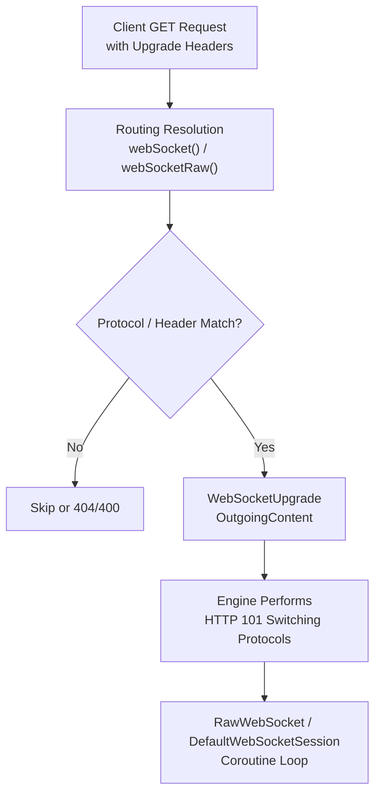
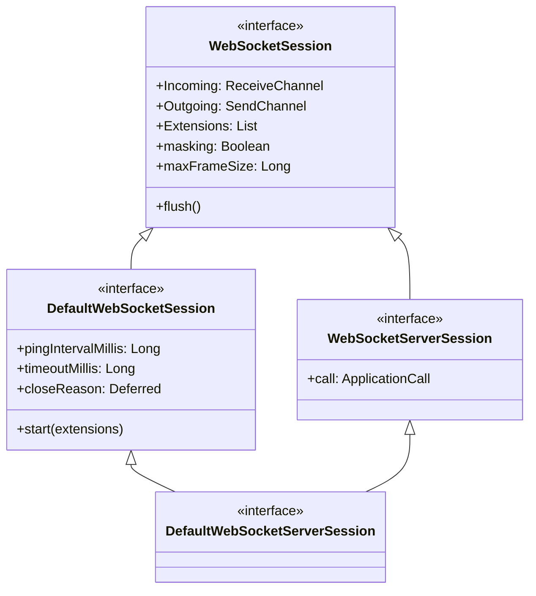
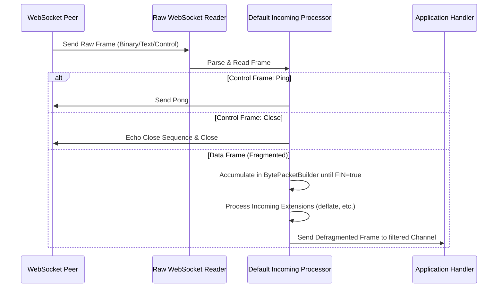

# Server WebSockets

<details>
<summary>Relevant source files</summary>

The following files were used as context for generating this wiki page:

- [ktor-shared/ktor-websockets/jvm/src/io/ktor/websocket/WebSocketDeflateExtension.kt](https://github.com/ktorio/ktor/blob/main/ktor-shared/ktor-websockets/jvm/src/io/ktor/websocket/WebSocketDeflateExtension.kt)
- [ktor-client/ktor-client-core/common/src/io/ktor/client/plugins/websocket/WebSockets.kt](https://github.com/ktorio/ktor/blob/main/ktor-client/ktor-client-core/common/src/io/ktor/client/plugins/websocket/WebSockets.kt)
- [ktor-shared/ktor-websockets/common/src/io/ktor/websocket/DefaultWebSocketSession.kt](https://github.com/ktorio/ktor/blob/main/ktor-shared/ktor-websockets/common/src/io/ktor/websocket/DefaultWebSocketSession.kt)
- [ktor-server/ktor-server-plugins/ktor-server-websockets/common/src/io/ktor/server/websocket/WebSocketUpgrade.kt](https://github.com/ktorio/ktor/blob/main/ktor-server/ktor-server-plugins/ktor-server-websockets/common/src/io/ktor/server/websocket/WebSocketUpgrade.kt)
- [ktor-client/ktor-client-okhttp/jvm/src/io/ktor/client/engine/okhttp/OkHttpWebsocketSession.kt](https://github.com/ktorio/ktor/blob/main/ktor-client/ktor-client-okhttp/jvm/src/io/ktor/client/engine/okhttp/OkHttpWebsocketSession.kt)
- [ktor-server/ktor-server-jetty-jakarta/jvm/src/io/ktor/server/jetty/jakarta/internal/JettyUpgradeImpl.kt](https://github.com/ktorio/ktor/blob/main/ktor-server/ktor-server-jetty-jakarta/jvm/src/io/ktor/server/jetty/jakarta/internal/JettyUpgradeImpl.kt)
- [ktor-server/ktor-server-plugins/ktor-server-websockets/common/src/io/ktor/server/websocket/Routing.kt](https://github.com/ktorio/ktor/blob/main/ktor-server/ktor-server-plugins/ktor-server-websockets/common/src/io/ktor/server/websocket/Routing.kt)
- [ktor-server/ktor-server-servlet-jakarta/jvm/src/io/ktor/server/servlet/jakarta/ServletUpgrade.kt](https://github.com/ktorio/ktor/blob/main/ktor-server/ktor-server-servlet-jakarta/jvm/src/io/ktor/server/servlet/jakarta/ServletUpgrade.kt)
- [ktor-client/ktor-client-winhttp/windows/src/io/ktor/client/engine/winhttp/internal/WinHttpWebSocket.kt](https://github.com/ktorio/ktor/blob/main/ktor-client/ktor-client-winhttp/windows/src/io/ktor/client/engine/winhttp/internal/WinHttpWebSocket.kt)
- [ktor-shared/ktor-websockets/jvm/src/io/ktor/websocket/RawWebSocketJvm.kt](https://github.com/ktorio/ktor/blob/main/ktor-shared/ktor-websockets/jvm/src/io/ktor/websocket/RawWebSocketJvm.kt)
- [ktor-server/ktor-server-jetty-jakarta/jvm/src/io/ktor/server/jetty/jakarta/JettyWebsocketConnection.kt](https://github.com/ktorio/ktor/blob/main/ktor-server/ktor-server-jetty-jakarta/jvm/src/io/ktor/server/jetty/jakarta/JettyWebsocketConnection.kt)
- [ktor-shared/ktor-websockets/common/src/io/ktor/websocket/RawWebSocketCommon.kt](https://github.com/ktorio/ktor/blob/main/ktor-shared/ktor-websockets/common/src/io/ktor/websocket/RawWebSocketCommon.kt)
- [ktor-client/ktor-client-java/jvm/src/io/ktor/client/engine/java/JavaHttpWebSocket.kt](https://github.com/ktorio/ktor/blob/main/ktor-client/ktor-client-java/jvm/src/io/ktor/client/engine/java/JavaHttpWebSocket.kt)
- [ktor-server/ktor-server-servlet/jvm/src/io/ktor/server/servlet/ServletUpgrade.kt](https://github.com/ktorio/ktor/blob/main/ktor-server/ktor-server-servlet/jvm/src/io/ktor/server/servlet/ServletUpgrade.kt)
- [ktor-server/ktor-server-plugins/ktor-server-websockets/common/src/io/ktor/server/websocket/WebSocketServerSession.kt](https://github.com/ktorio/ktor/blob/main/ktor-server/ktor-server-plugins/ktor-server-websockets/common/src/io/ktor/server/websocket/Routing.kt)
- [ktor-server/ktor-server-jetty/jvm/src/io/ktor/server/jetty/internal/JettyUpgradeImpl.kt](https://github.com/ktorio/ktor/blob/main/ktor-server/ktor-server-jetty/internal/JettyUpgradeImpl.kt)
- [ktor-shared/ktor-websockets/common/src/io/ktor/websocket/WebSocketExtension.kt](https://github.com/ktorio/ktor/blob/main/ktor-shared/ktor-websockets/common/src/io/ktor/websocket/WebSocketExtension.kt)
- [ktor-server/ktor-server-plugins/ktor-server-websockets/common/src/io/ktor/server/websocket/WebSockets.kt](https://github.com/ktorio/ktor/blob/main/ktor-server/ktor-server-plugins/ktor-server-websockets/common/src/io/ktor/server/websocket/WebSockets.kt)
- [ktor-client/ktor-client-core/wasmJs/src/io/ktor/client/plugins/websocket/JsWebSocketSession.kt](https://github.com/ktorio/ktor/blob/main/ktor-client/ktor-client-core/wasmJs/src/io/ktor/client/plugins/websocket/JsWebSocketSession.kt)
- [ktor-client/ktor-client-core/js/src/io/ktor/client/plugins/websocket/JsWebSocketSession.kt](https://github.com/ktorio/ktor/blob/main/ktor-client/ktor-client-core/js/src/io/ktor/client/plugins/websocket/JsWebSocketSession.kt)
- [ktor-client/ktor-client-curl/desktop/src/io/ktor/client/engine/curl/internal/CurlWebSocketSession.kt](https://github.com/ktorio/ktor/blob/main/ktor-client/ktor-client-curl/desktop/src/io/ktor/client/engine/curl/internal/CurlWebSocketSession.kt)
- [ktor-shared/ktor-websockets/jvm/src/io/ktor/websocket/WebSocketWriter.kt](https://github.com/ktorio/ktor/blob/main/ktor-shared/ktor-websockets/jvm/src/io/ktor/websocket/WebSocketWriter.kt)
</details>

## Overview

Server WebSockets in Ktor provide full-duplex, persistent communication channels over a single TCP connection, integrating directly with Ktor's application pipeline, routing system, and coroutine-based execution model. The subsystem bridges HTTP server infrastructure with asynchronous frame processing by upgrading standard HTTP GET requests into persistent WebSocket sessions via standard protocol handshake mechanisms.

Sources: [ktor-server/ktor-server-plugins/ktor-server-websockets/common/src/io/ktor/server/websocket/WebSockets.kt:20-41](https://github.com/ktorio/ktor/blob/main/ktor-server/ktor-server-plugins/ktor-server-websockets/common/src/io/ktor/server/websocket/WebSockets.kt#L20-L41)

The architecture separates concerns across three main layers: the server application plugin (`WebSockets`), routing integration builders (`webSocket` and `webSocketRaw`), and protocol upgrade handlers (`WebSocketUpgrade` and engine-specific adapters like Jetty or Servlet). By combining Kotlin coroutines with kotlinx.coroutines channels (`incoming` and `outgoing`), Ktor exposes non-blocking read and write streams for text and binary frames, while managing connection lifecycle, heartbeat pings, message fragmentation, and extension negotiation.

Sources: [ktor-server/ktor-server-plugins/ktor-server-websockets/common/src/io/ktor/server/websocket/Routing.kt:21-34](https://github.com/ktorio/ktor/blob/main/ktor-server/ktor-server-plugins/ktor-server-websockets/common/src/io/ktor/server/websocket/Routing.kt#L21-L34)

Crucially, Ktor differentiates between *Raw* WebSockets (`WebSocketSession`), which expose low-level control frames and fragmentation state directly to the developer, and *Default* WebSockets (`DefaultWebSocketSession`), which abstract away protocol mechanics such as automatic ping-pong handling, timeout detection, close sequences, and frame reassembly. This design decision ensures that applications can either implement custom wire-level protocols safely or rely on robust defaults for standard bidirectional messaging.

Sources: [ktor-server/ktor-server-plugins/ktor-server-websockets/common/src/io/ktor/server/websocket/WebSocketUpgrade.kt:17-40](https://github.com/ktorio/ktor/blob/main/ktor-server/ktor-server-plugins/ktor-server-websockets/common/src/io/ktor/server/websocket/WebSocketUpgrade.kt#L17-L40), [ktor-shared/ktor-websockets/common/src/io/ktor/websocket/WebSocketSession.kt:1-50](https://github.com/ktorio/ktor/blob/main/ktor-shared/ktor-websockets/common/src/io/ktor/websocket/WebSocketSession.kt#L1-L50)

---

## Plugin Architecture and Configuration

The `WebSockets` server plugin serves as the global configuration entry point for WebSocket capabilities within an application. Installed via `install(WebSockets)`, it registers a lifecycle monitor hook to handle graceful shutdown during application termination and validates configuration parameters before any routing endpoint is evaluated.

Sources: [ktor-server/ktor-server-plugins/ktor-server-websockets/common/src/io/ktor/server/websocket/WebSockets.kt:42-72](https://github.com/ktorio/ktor/blob/main/ktor-server/ktor-server-plugins/ktor-server-websockets/common/src/io/ktor/server/websocket/WebSockets.kt#L42-L72)

```kotlin
install(WebSockets) {
    pingPeriodMillis = 15_000L
    timeoutMillis = 15_000L
    maxFrameSize = Long.MAX_VALUE
    masking = false
}
```

Sources: [ktor-server/ktor-server-plugins/ktor-server-websockets/common/src/io/ktor/server/websocket/WebSockets.kt:85-112](https://github.com/ktorio/ktor/blob/main/ktor-server/ktor-server-plugins/ktor-server-websockets/common/src/io/ktor/server/websocket/WebSockets.kt#L85-L112)

The configuration block (`WebSocketOptions`) exposes tunable properties governing keep-alive intervals, size thresholds, and extension registries.

Sources: [ktor-server/ktor-server-plugins/ktor-server-websockets/common/src/io/ktor/server/websocket/WebSockets.kt:73-148](https://github.com/ktorio/ktor/blob/main/ktor-server/ktor-server-plugins/ktor-server-websockets/common/src/io/ktor/server/websocket/WebSockets.kt#L73-L148)

| Option | Type | Default | Description |
| :--- | :--- | :--- | :--- |
| `pingPeriodMillis` | `Long` | `0` (`PINGER_DISABLED`) | Interval between automated ping frames. |
| `timeoutMillis` | `Long` | `15000` | Write/ping timeout before connection termination. |
| `maxFrameSize` | `Long` | `Long.MAX_VALUE` | Maximum permitted incoming or outgoing frame payload size. |
| `masking` | `Boolean` | `false` | Whether frame masking is enabled on outgoing frames. |
| `contentConverter` | `WebsocketContentConverter?` | `null` | Serialization converter for typed payload exchange. |

Sources: [ktor-server/ktor-server-plugins/ktor-server-websockets/common/src/io/ktor/server/websocket/WebSockets.kt:85-119](https://github.com/ktorio/ktor/blob/main/ktor-server/ktor-server-plugins/ktor-server-websockets/common/src/io/ktor/server/websocket/WebSockets.kt#L85-L119)

---

## Routing Integration and Upgrade Flow

WebSocket endpoints are defined inside routing blocks using `webSocket()` or `webSocketRaw()`. These routing extensions inspect incoming HTTP requests for valid upgrade headers (`Connection: Upgrade`, `Upgrade: websocket`) and optional subprotocols before committing to an HTTP protocol switch.

Sources: [ktor-server/ktor-server-plugins/ktor-server-websockets/common/src/io/ktor/server/websocket/Routing.kt:35-173](https://github.com/ktorio/ktor/blob/main/ktor-server/ktor-server-plugins/ktor-server-websockets/common/src/io/ktor/server/websocket/Routing.kt#L35-L173)



Sources: [ktor-server/ktor-server-plugins/ktor-server-websockets/common/src/io/ktor/server/websocket/Routing.kt:115-126](https://github.com/ktorio/ktor/blob/main/ktor-server/ktor-server-plugins/ktor-server-websockets/common/src/io/ktor/server/websocket/Routing.kt#L115-L126), [ktor-server/ktor-server-plugins/ktor-server-websockets/common/src/io/ktor/server/websocket/WebSocketUpgrade.kt:87-114](https://github.com/ktorio/ktor/blob/main/ktor-server/ktor-server-plugins/ktor-server-websockets/common/src/io/ktor/server/websocket/WebSocketUpgrade.kt#L87-L114)

The upgrade mechanism proceeds through a strict sequence of operations managed by `WebSocketUpgrade` and engine-specific upgrade implementations (such as Jetty or Servlet).

Sources: [ktor-server/ktor-server-plugins/ktor-server-websockets/common/src/io/ktor/server/websocket/WebSocketUpgrade.kt:66-85](https://github.com/ktorio/ktor/blob/main/ktor-server/ktor-server-plugins/ktor-server-websockets/common/src/io/ktor/server/websocket/WebSocketUpgrade.kt#L66-L85)

1. The client sends a GET request with `Upgrade: websocket`, `Connection: Upgrade`, `Sec-WebSocket-Key`, and optional `Sec-WebSocket-Protocol` headers.
2. Routing selectors evaluate headers via `WebSocketProtocolsSelector` to verify subprotocol support.
3. The server responds with `HttpStatusCode.SwitchingProtocols` (101) alongside `Sec-WebSocket-Accept` and negotiated extension headers computed via `websocketServerAccept(key)`.
4. `WebSocketUpgrade.upgrade(...)` constructs a `RawWebSocket` instance over the engine's `ByteReadChannel` and `ByteWriteChannel`.
5. The session handler coroutine is launched, and upon its completion, the socket channels are flushed and cancelled.

Sources: [ktor-server/ktor-server-plugins/ktor-server-websockets/common/src/io/ktor/server/websocket/Routing.kt:236-256](https://github.com/ktorio/ktor/blob/main/ktor-server/ktor-server-plugins/ktor-server-websockets/common/src/io/ktor/server/websocket/Routing.kt#L236-L256), [ktor-server/ktor-server-plugins/ktor-server-websockets/common/src/io/ktor/server/websocket/WebSocketUpgrade.kt:87-114](https://github.com/ktorio/ktor/blob/main/ktor-server/ktor-server-plugins/ktor-server-websockets/common/src/io/ktor/server/websocket/WebSocketUpgrade.kt#L87-L114)

> [!NOTE]
> When using `webSocket()`, Ktor automatically wraps the raw session in a `DefaultWebSocketSession`, starting the incoming and outgoing processors for frame reassembly, ping-pong handling, and timeout supervision.

Sources: [ktor-server/ktor-server-plugins/ktor-server-websockets/common/src/io/ktor/server/websocket/Routing.kt:194-210](https://github.com/ktorio/ktor/blob/main/ktor-server/ktor-server-plugins/ktor-server-websockets/common/src/io/ktor/server/websocket/Routing.kt#L194-L210)

---

## Session Abstractions: Raw vs Default Sessions

Ktor defines a clear hierarchy of session interfaces, distinguishing between low-level frame management and high-level feature-rich sessions.

Sources: [ktor-shared/ktor-websockets/common/src/io/ktor/websocket/WebSocketSession.kt](https://github.com/ktorio/ktor/blob/main/ktor-shared/ktor-websockets/common/src/io/ktor/websocket/WebSocketSession.kt#L1-L50)



Sources: [ktor-shared/ktor-websockets/common/src/io/ktor/websocket/DefaultWebSocketSession.kt:37-73](https://github.com/ktorio/ktor/blob/main/ktor-shared/ktor-websockets/common/src/io/ktor/websocket/DefaultWebSocketSession.kt#L37-L73), [ktor-server/ktor-server-plugins/ktor-server-websockets/common/src/io/ktor/server/websocket/WebSocketServerSession.kt:19-37](https://github.com/ktorio/ktor/blob/main/ktor-server/ktor-server-plugins/ktor-server-websockets/common/src/io/ktor/server/websocket/WebSocketServerSession.kt#L19-37)

- **`WebSocketSession`**: The foundational interface. Exposes raw `incoming` and `outgoing` channels. Developers using `webSocketRaw` must handle control frames (Ping, Pong, Close) and message fragmentation manually.
- **`DefaultWebSocketSession`**: Implemented by `DefaultWebSocketSessionImpl`. Automatically responds to pings with pongs, enforces timeout limits, manages close handshakes, and defragments split frames transparently before publishing them to the user-facing `incoming` channel.
- **`WebSocketServerSession`**: Extends `WebSocketSession` to provide direct access to the initiating `ApplicationCall`.
- **`DefaultWebSocketServerSession`**: Combines `DefaultWebSocketSession` and `WebSocketServerSession`, enabling high-level methods like `sendSerialized()` and `receiveDeserialized()`.

Sources: [ktor-shared/ktor-websockets/common/src/io/ktor/websocket/DefaultWebSocketSession.kt:139-168](https://github.com/ktorio/ktor/blob/main/ktor-shared/ktor-websockets/common/src/io/ktor/websocket/DefaultWebSocketSession.kt#L139-L168), [ktor-server/ktor-server-plugins/ktor-server-websockets/common/src/io/ktor/server/websocket/WebSocketServerSession.kt:19-37](https://github.com/ktorio/ktor/blob/main/ktor-server/ktor-server-plugins/ktor-server-websockets/common/src/io/ktor/server/websocket/WebSocketServerSession.kt#L19-37)

---

## Protocol Processing and Lifecycle

The `DefaultWebSocketSessionImpl` manages background coroutine loops responsible for incoming frame parsing, extension transformation, ping supervision, and outgoing serialization.

Sources: [ktor-shared/ktor-websockets/common/src/io/ktor/websocket/DefaultWebSocketSession.kt:209-352](https://github.com/ktorio/ktor/blob/main/ktor-shared/ktor-websockets/common/src/io/ktor/websocket/DefaultWebSocketSession.kt#L209-L352)



Sources: [ktor-server/ktor-server-plugins/ktor-server-websockets/common/src/io/ktor/server/websocket/Routing.kt:194-210](https://github.com/ktorio/ktor/blob/main/ktor-server/ktor-server-plugins/ktor-server-websockets/common/src/io/ktor/server/websocket/Routing.kt#L194-L210), [ktor-shared/ktor-websockets/common/src/io/ktor/websocket/DefaultWebSocketSession.kt:240-298](https://github.com/ktorio/ktor/blob/main/ktor-shared/ktor-websockets/common/src/io/ktor/websocket/DefaultWebSocketSession.kt#L240-L298)

The execution trace for outgoing frame processing follows the verified call chain: `webSocket` invokes `proceedWebSocket`, which constructs and starts `DefaultWebSocketSession`, triggering `runOutgoingProcessor()` to launch `outgoingProcessorLoop()`, which delegates serialization and transformation to `processOutgoingExtensions()`.

Sources: [ktor-server/ktor-server-plugins/ktor-server-websockets/common/src/io/ktor/server/websocket/Routing.kt:164-209](https://github.com/ktorio/ktor/blob/main/ktor-server/ktor-server-plugins/ktor-server-websockets/common/src/io/ktor/server/websocket/Routing.kt#L164-L209), [ktor-shared/ktor-websockets/common/src/io/ktor/websocket/DefaultWebSocketSession.kt:196-215](https://github.com/ktorio/ktor/blob/main/ktor-shared/ktor-websockets/common/src/io/ktor/websocket/DefaultWebSocketSession.kt#L196-L215), [ktor-shared/ktor-websockets/common/src/io/ktor/websocket/DefaultWebSocketSession.kt:314-352](https://github.com/ktorio/ktor/blob/main/ktor-shared/ktor-websockets/common/src/io/ktor/websocket/DefaultWebSocketSession.kt#L314-L352), [ktor-shared/ktor-websockets/common/src/io/ktor/websocket/DefaultWebSocketSession.kt:420-423](https://github.com/ktorio/ktor/blob/main/ktor-shared/ktor-websockets/common/src/io/ktor/websocket/DefaultWebSocketSession.kt#L420-L423)

The incoming processor loop evaluates each frame received from the raw session:
- If a `Frame.Close` is received and the outgoing channel is open, an echo close frame is scheduled, and `closeFramePresented` is set to `true`.
- If a `Frame.Ping` is received, it is automatically forwarded to the `ponger` channel for immediate reply.
- If a `Frame.Pong` is received, it resets the pinger timeout countdown.
- For fragmented data frames (`fin == false`), payloads are accumulated into a `BytePacketBuilder`. When `fin == true`, the accumulated payload is defragmented, passed through installed extensions via `processIncomingExtensions()`, and sent to the application-facing `incoming` channel.

Sources: [ktor-shared/ktor-websockets/common/src/io/ktor/websocket/DefaultWebSocketSession.kt:240-313](https://github.com/ktorio/ktor/blob/main/ktor-shared/ktor-websockets/common/src/io/ktor/websocket/DefaultWebSocketSession.kt#L240-L313)

> [!CAUTION]
> If a connection terminates without receiving a valid close frame, `DefaultWebSocketSessionImpl` catches the closure in its `finally` block and records a `CLOSED_ABNORMALLY` close reason.

Sources: [ktor-shared/ktor-websockets/common/src/io/ktor/websocket/DefaultWebSocketSession.kt:304-312](https://github.com/ktorio/ktor/blob/main/ktor-shared/ktor-websockets/common/src/io/ktor/websocket/DefaultWebSocketSession.kt#L304-L312)

---

## WebSocket Extensions and Per-Message Deflate

Ktor supports WebSocket extensions defined by `WebSocketExtension` and negotiated via `Sec-WebSocket-Extensions` headers. The primary built-in extension is `WebSocketDeflateExtension`, implementing [RFC-7692](https://tools.ietf.org/html/rfc7692) (`permessage-deflate`).

Sources: [ktor-shared/ktor-websockets/jvm/src/io/ktor/websocket/WebSocketDeflateExtension.kt:22-45](https://github.com/ktorio/ktor/blob/main/ktor-shared/ktor-websockets/jvm/src/io/ktor/websocket/WebSocketDeflateExtension.kt#L22-L45), [ktor-shared/ktor-websockets/common/src/io/ktor/websocket/WebSocketExtension.kt:71-87](https://github.com/ktorio/ktor/blob/main/ktor-shared/ktor-websockets/common/src/io/ktor/websocket/WebSocketExtension.kt#L71-L87)

```kotlin
install(WebSockets) {
    extensions {
        install(WebSocketDeflateExtension) {
            compressionLevel = Deflater.DEFAULT_COMPRESSION
            compressIfBiggerThan(1024)
        }
    }
}
```

Sources: [ktor-shared/ktor-websockets/jvm/src/io/ktor/websocket/WebSocketDeflateExtension.kt:25-32](https://github.com/ktorio/ktor/blob/main/ktor-shared/ktor-websockets/jvm/src/io/ktor/websocket/WebSocketDeflateExtension.kt#L25-L32), [ktor-shared/ktor-websockets/jvm/src/io/ktor/websocket/WebSocketDeflateExtension.kt:186-231](https://github.com/ktorio/ktor/blob/main/ktor-shared/ktor-websockets/jvm/src/io/ktor/websocket/WebSocketDeflateExtension.kt#L186-L231)

During handshake negotiation (`serverNegotiation`), the extension inspects requested client parameters such as `server_max_window_bits`, `client_max_window_bits`, `server_no_context_takeover`, and `client_no_context_takeover`. It configures Java `Deflater` and `Inflater` instances with window bit size 15 and manages state resetting (`no_context_takeover`) per frame. 

Sources: [ktor-shared/ktor-websockets/jvm/src/io/ktor/websocket/WebSocketDeflateExtension.kt:46-130](https://github.com/ktorio/ktor/blob/main/ktor-shared/ktor-websockets/jvm/src/io/ktor/websocket/WebSocketDeflateExtension.kt#L46-L130)

Extension conflicts are prevented at installation time through `WebSocketExtensionsConfig.checkConflicts()`, which inspects extension reservation flags (`rsv1`, `rsv2`, `rsv3`) to ensure no two installed extensions claim the same reserved bits.

Sources: [ktor-shared/ktor-websockets/common/src/io/ktor/websocket/WebSocketExtension.kt:147-165](https://github.com/ktorio/ktor/blob/main/ktor-shared/ktor-websockets/common/src/io/ktor/websocket/WebSocketExtension.kt#L147-L165)

---

## Serialization and Content Negotiation

For applications exchanging typed domain objects rather than raw `Frame` instances, `DefaultWebSocketServerSession` integrates with Ktor's content converter system.

Sources: [ktor-server/ktor-server-plugins/ktor-server-websockets/common/src/io/ktor/server/websocket/WebSocketServerSession.kt:28-37](https://github.com/ktorio/ktor/blob/main/ktor-server/ktor-server-plugins/ktor-server-websockets/common/src/io/ktor/server/websocket/WebSocketServerSession.kt#L28-L37)

```kotlin
webSocket("/chat") {
    // Receive a deserialized data object
    val message = receiveDeserialized<ChatMessage>()
    
    // Send a serialized data object
    sendSerialized(ChatMessage("Server", "Hello, ${message.user}!"))
}
```

Sources: [ktor-server/ktor-server-plugins/ktor-server-websockets/common/src/io/ktor/server/websocket/WebSocketServerSession.kt:67-117](https://github.com/ktorio/ktor/blob/main/ktor-server/ktor-server-plugins/ktor-server-websockets/common/src/io/ktor/server/websocket/WebSocketServerSession.kt#L67-L117)

The helper extension functions `sendSerialized()` and `receiveDeserialized()` locate the content converter registered in the `WebSockets` plugin via the `converter` property, applying charset negotiation derived from the request headers and converting frame payloads automatically.

Sources: [ktor-server/ktor-server-plugins/ktor-server-websockets/common/src/io/ktor/server/websocket/WebSocketServerSession.kt:50-116](https://github.com/ktorio/ktor/blob/main/ktor-server/ktor-server-plugins/ktor-server-websockets/common/src/io/ktor/server/websocket/WebSocketServerSession.kt#L50-L116)

---

## Engine Upgrade Adapters and Servlets

Because different backend engines handle protocol upgrades differently, Ktor provides engine-specific upgrade implementations. For instance, `JettyUpgradeImpl` (supporting both Jakarta and legacy Servlet engines) extracts the underlying Jetty `EndPoint`, adjusts the idle timeout to 60 minutes for persistent connections, initializes input and output bytecode reader/writer loops, and delegates the HTTP upgrade to Ktor's `OutgoingContent.ProtocolUpgrade`.

Sources: [ktor-server/ktor-server-jetty-jakarta/jvm/src/io/ktor/server/jetty/jakarta/internal/JettyUpgradeImpl.kt:22-68](https://github.com/ktorio/ktor/blob/main/ktor-server/ktor-server-jetty-jakarta/jvm/src/io/ktor/server/jetty/jakarta/internal/JettyUpgradeImpl.kt#L22-L68)

```kotlin
internal object JettyUpgradeImpl : ServletUpgrade {
    override suspend fun performUpgrade(
        upgrade: OutgoingContent.ProtocolUpgrade,
        servletRequest: HttpServletRequest,
        servletResponse: HttpServletResponse,
        engineContext: CoroutineContext,
        userContext: CoroutineContext
    ) {
        val request = servletRequest as ServletApiRequest
        val connection = request.request.connectionMetaData.connection
        val endPoint = connection.endPoint
        endPoint.idleTimeout = TimeUnit.MINUTES.toMillis(60L)
        // ...
    }
}
```

Sources: [ktor-server/ktor-server-jetty-jakarta/jvm/src/io/ktor/server/jetty/jakarta/internal/JettyUpgradeImpl.kt:22-41](https://github.com/ktorio/ktor/blob/main/ktor-server/ktor-server-jetty-jakarta/jvm/src/io/ktor/server/jetty/jakarta/internal/JettyUpgradeImpl.kt#L22-L41)

Similarly, Servlet-based engines use `DefaultServletUpgrade` and `ServletUpgradeHandler` to manage `WebConnection` input and output streams through blocking-to-non-blocking bridges.

Sources: [ktor-server/ktor-server-servlet-jakarta/jvm/src/io/ktor/server/servlet/jakarta/ServletUpgrade.kt:42-59](https://github.com/ktorio/ktor/blob/main/ktor-server/ktor-server-servlet-jakarta/jvm/src/io/ktor/server/servlet/jakarta/ServletUpgrade.kt#L42-L59), [ktor-server/ktor-server-servlet-jakarta/jvm/src/io/ktor/server/servlet/jakarta/ServletUpgrade.kt:77-124](https://github.com/ktorio/ktor/blob/main/ktor-server/ktor-server-servlet-jakarta/jvm/src/io/ktor/server/servlet/jakarta/ServletUpgrade.kt#L77-L124)

---

## Design Trade-Offs

| Design Choice | Benefit | Cost |
| :--- | :--- | :--- |
| **Coroutine Channel Queueing** | Non-blocking backpressure management and seamless integration with Kotlin structured concurrency. | Potential memory overhead under extreme backpressure if unlimited channels are used. |
| **Separation of Raw and Default Sessions** | Allows high-performance custom wire protocols (`webSocketRaw`) alongside safe, feature-rich defaults (`webSocket`). | Increased API surface area requiring careful selection by developers. |
| **Eager Extension Conflict Checking (`rsv1-3`)** | Prevents subtle protocol violations by rejecting conflicting extension bitmasks at startup. | Restricts simultaneous use of extensions that compete for the same reserved header bits. |
| **Engine-Specific Upgrade Handlers** | Enables native performance optimizations across diverse runtimes (Jetty, Netty, Servlet containers). | Requires dedicated maintenance for each server engine integration. |

Sources: [ktor-server/ktor-server-plugins/ktor-server-websockets/common/src/io/ktor/server/websocket/WebSockets.kt:42-50](https://github.com/ktorio/ktor/blob/main/ktor-server/ktor-server-plugins/ktor-server-websockets/common/src/io/ktor/server/websocket/WebSockets.kt#L42-L50), [ktor-server/ktor-server-plugins/ktor-server-websockets/common/src/io/ktor/server/websocket/Routing.kt:25-34](https://github.com/ktorio/ktor/blob/main/ktor-server/ktor-server-plugins/ktor-server-websockets/common/src/io/ktor/server/websocket/Routing.kt#L25-L34), [ktor-shared/ktor-websockets/common/src/io/ktor/websocket/WebSocketExtension.kt:147-165](https://github.com/ktorio/ktor/blob/main/ktor-shared/ktor-websockets/common/src/io/ktor/websocket/WebSocketExtension.kt#L147-L165), [ktor-server/ktor-server-jetty-jakarta/jvm/src/io/ktor/server/jetty/jakarta/internal/JettyUpgradeImpl.kt:22-68](https://github.com/ktorio/ktor/blob/main/ktor-server/ktor-server-jetty-jakarta/jvm/src/io/ktor/server/jetty/jakarta/internal/JettyUpgradeImpl.kt#L22-L68)

## Related

- [[Client WebSockets and SSE]]

