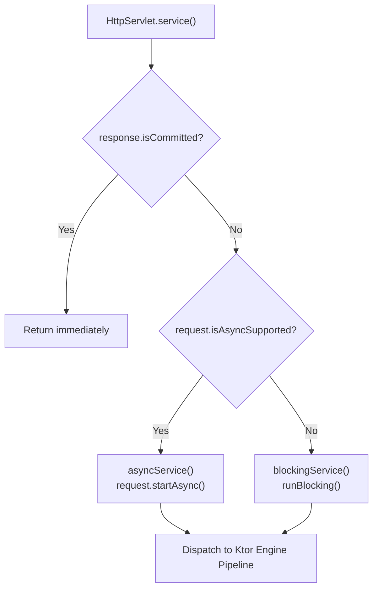
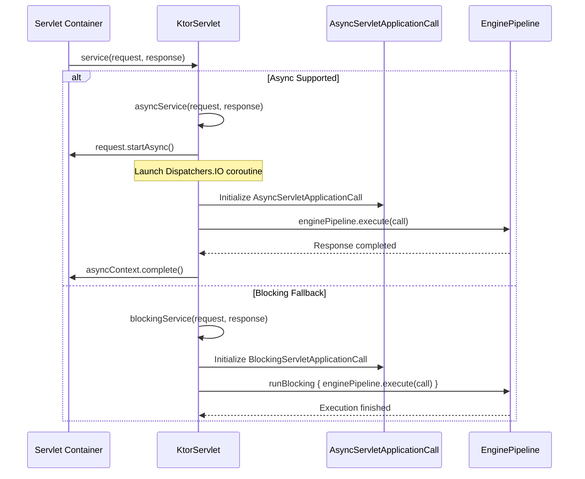
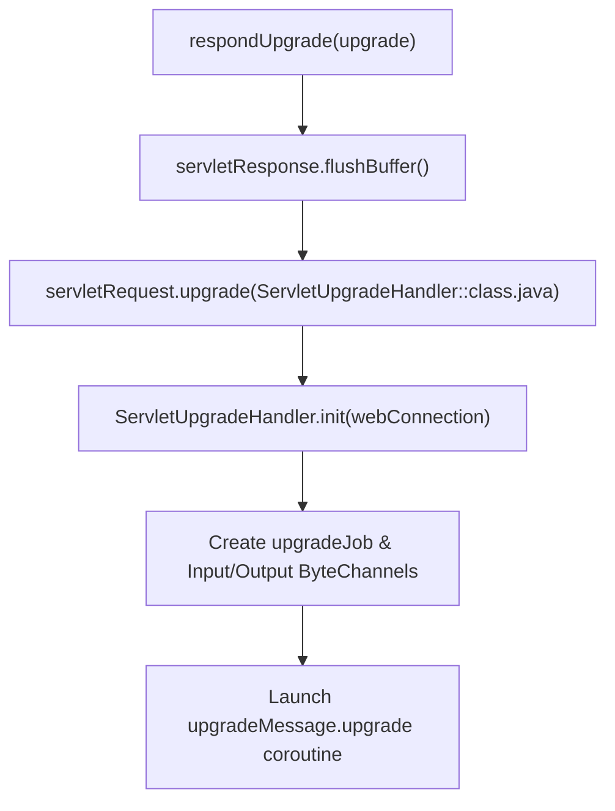

# Servlet Containers

<details>
<summary>Relevant source files</summary>

The following files were used as context for generating this wiki page:

- [ktor-server/ktor-server-tomcat-jakarta/jvm/src/io/ktor/server/tomcat/jakarta/TomcatApplicationEngine.kt](https://github.com/ktorio/ktor/blob/main/ktor-server/ktor-server-tomcat-jakarta/jvm/src/io/ktor/server/tomcat/jakarta/TomcatApplicationEngine.kt)
- [ktor-server/ktor-server-servlet-jakarta/jvm/src/io/ktor/server/servlet/jakarta/KtorServlet.kt](https://github.com/ktorio/ktor/blob/main/ktor-server/ktor-server-servlet-jakarta/jvm/src/io/ktor/server/servlet/jakarta/KtorServlet.kt)
- [ktor-server/ktor-server-servlet-jakarta/jvm/src/io/ktor/server/servlet/jakarta/KtorServletContainerInitializer.kt](https://github.com/ktorio/ktor/blob/main/ktor-server/ktor-server-servlet-jakarta/jvm/src/io/ktor/server/servlet/jakarta/KtorServletContainerInitializer.kt)
- [ktor-server/ktor-server-servlet/jvm/src/io/ktor/server/servlet/KtorServletContainerInitializer.kt](https://github.com/ktorio/ktor/blob/main/ktor-server/ktor-server-servlet/jvm/src/io/ktor/server/servlet/KtorServletContainerInitializer.kt)
- [ktor-server/ktor-server-servlet/jvm/src/io/ktor/server/servlet/KtorServlet.kt](https://github.com/ktorio/ktor/blob/main/ktor-server/ktor-server-servlet/jvm/src/io/ktor/server/servlet/KtorServlet.kt)
- [ktor-server/ktor-server-servlet-jakarta/jvm/src/io/ktor/server/servlet/jakarta/ServletApplicationEngine.kt](https://github.com/ktorio/ktor/blob/main/ktor-server/ktor-server-servlet-jakarta/jvm/src/io/ktor/server/servlet/jakarta/ServletApplicationEngine.kt)
- [ktor-server/ktor-server-servlet-jakarta/jvm/src/io/ktor/server/servlet/jakarta/AsyncServlet.kt](https://github.com/ktorio/ktor/blob/main/ktor-server/ktor-server-servlet-jakarta/jvm/src/io/ktor/server/servlet/jakarta/AsyncServlet.kt)
- [ktor-server/ktor-server-servlet/jvm/src/io/ktor/server/servlet/AsyncServlet.kt](https://github.com/ktorio/ktor/blob/main/ktor-server/ktor-server-servlet/jvm/src/io/ktor/server/servlet/AsyncServlet.kt)
- [README.md](https://github.com/ktorio/ktor/blob/main/README.md)
- [ktor-server/ktor-server-servlet-jakarta/jvm/src/io/ktor/server/servlet/jakarta/ServletUpgrade.kt](https://github.com/ktorio/ktor/blob/main/ktor-server/ktor-server-servlet-jakarta/jvm/src/io/ktor/server/servlet/jakarta/ServletUpgrade.kt)
- [ktor-server/ktor-server-servlet/jvm/src/io/ktor/server/servlet/ServletUpgrade.kt](https://github.com/ktorio/ktor/blob/main/ktor-server/ktor-server-servlet/jvm/src/io/ktor/server/servlet/ServletUpgrade.kt)
- [ktor-server/ktor-server-servlet/jvm/src/io/ktor/server/servlet/ServletApplicationEngine.kt](https://github.com/ktorio/ktor/blob/main/ktor-server/ktor-server-servlet/jvm/src/io/ktor/server/servlet/ServletApplicationEngine.kt)
- [ktor-server/ktor-server-servlet-jakarta/jvm/src/io/ktor/server/servlet/jakarta/BlockingServlet.kt](https://github.com/ktorio/ktor/blob/main/ktor-server/ktor-server-servlet-jakarta/jvm/src/io/ktor/server/servlet/jakarta/BlockingServlet.kt)
</details>

## Overview

Ktor provides a robust integration layer for running applications inside standard Servlet containers (such as Apache Tomcat and Eclipse Jetty) supporting Servlet 3.0+ APIs across both `javax.servlet` and `jakarta.servlet` packages. This architecture enables developers to deploy Ktor microservices and web applications either as self-contained embedded servers (via engines like `TomcatApplicationEngine`) or as standard WAR/servlet packages inside external web containers (via `ServletApplicationEngine` and `KtorServlet`).

Sources: [README.md:77-88](https://github.com/ktorio/ktor/blob/main/README.md#L77-L88)

The integration bridges traditional multi-threaded, blocking servlet container request models with Ktor's asynchronous, coroutine-driven pipeline architecture. By translating `HttpServletRequest` and `HttpServletResponse` objects into Ktor's `BaseApplicationCall`, requests can be processed either asynchronously using `AsyncContext` or synchronously via blocking execution paths.

Sources: [ktor-server/ktor-server-servlet-jakarta/jvm/src/io/ktor/server/servlet/jakarta/KtorServlet.kt:24-66](https://github.com/ktorio/ktor/blob/main/ktor-server/ktor-server-servlet-jakarta/jvm/src/io/ktor/server/servlet/jakarta/KtorServlet.kt#L24-L66)

Furthermore, lifecycle management components like `KtorServletContainerInitializer` and `KtorServletContextListener` ensure that Ktor applications start and terminate synchronously with the host servlet container context, eliminating resource leaks during deployment and undeployment cycles.

Sources: [ktor-server/ktor-server-servlet-jakarta/jvm/src/io/ktor/server/servlet/jakarta/KtorServletContainerInitializer.kt:30-87](https://github.com/ktorio/ktor/blob/main/ktor-server/ktor-server-servlet-jakarta/jvm/src/io/ktor/server/servlet/jakarta/KtorServletContainerInitializer.kt#L30-L87)

## Core Servlet Engine Architecture and Lifecycle

The servlet integration revolves around `KtorServlet`, an abstract subclass of `HttpServlet` that implements `CoroutineScope`. When a servlet container receives an HTTP request, it invokes the servlet's `service` method. `KtorServlet` first checks if the response is already committed via `response.isCommitted`. If uncommitted, it inspects whether the request supports asynchronous processing (`request.isAsyncSupported`), dispatching execution to either `asyncService` or `blockingService`.

Sources: [ktor-server/ktor-server-servlet-jakarta/jvm/src/io/ktor/server/servlet/jakarta/KtorServlet.kt:24-101](https://github.com/ktorio/ktor/blob/main/ktor-server/ktor-server-servlet-jakarta/jvm/src/io/ktor/server/servlet/jakarta/KtorServlet.kt#L24-L101)

During initialization (`init`), the servlet associates the active `ServletContext` with the application's attribute map using `ServletContextAttribute`. Conversely, container destruction triggers `destroy()`, which cancels the servlet's root coroutine context.

Sources: [ktor-server/ktor-server-servlet-jakarta/jvm/src/io/ktor/server/servlet/jakarta/KtorServlet.kt:59-75](https://github.com/ktorio/ktor/blob/main/ktor-server/ktor-server-servlet-jakarta/jvm/src/io/ktor/server/servlet/jakarta/KtorServlet.kt#L59-L75)

In WAR deployments, lifecycle management is augmented by `KtorServletContainerInitializer` via `META-INF/services/jakarta.servlet.ServletContainerInitializer` (or `javax.servlet`), which registers `KtorServletContextListener`. This listener intercepts context initialization (`contextInitialized`) and destruction (`contextDestroyed`), booting up the Ktor embedded server at deployment time rather than lazily on the first incoming request.

Sources: [ktor-server/ktor-server-servlet-jakarta/jvm/src/io/ktor/server/servlet/jakarta/KtorServletContainerInitializer.kt:30-97](https://github.com/ktorio/ktor/blob/main/ktor-server/ktor-server-servlet-jakarta/jvm/src/io/ktor/server/servlet/jakarta/KtorServletContainerInitializer.kt#L30-L97)



Sources: [ktor-server/ktor-server-servlet-jakarta/jvm/src/io/ktor/server/servlet/jakarta/KtorServlet.kt:82-101](https://github.com/ktorio/ktor/blob/main/ktor-server/ktor-server-servlet-jakarta/jvm/src/io/ktor/server/servlet/jakarta/KtorServlet.kt#L82-L101)

## Embedded vs. External Deployment Modes

Ktor servlet engines operate in multiple distinct deployment modes depending on how the application is initialized and who owns the server lifecycle.

Sources: [ktor-server/ktor-server-servlet-jakarta/jvm/src/io/ktor/server/servlet/jakarta/ServletApplicationEngine.kt:25-50](https://github.com/ktorio/ktor/blob/main/ktor-server/ktor-server-servlet-jakarta/jvm/src/io/ktor/server/servlet/jakarta/ServletApplicationEngine.kt#L25-L50)

1. **Embedded Engine Mode:** Engines such as `TomcatApplicationEngine` instantiate and manage an embedded container instance directly within application code. Here, the embedded engine owns the server lifecycle, and container initializers detect the presence of `ApplicationAttributeKey` to bypass duplicate listener registration.
2. **Managed Mode (WAR Deployment):** When deployed to an external container, `KtorServletContainerInitializer` discovers `ServletApplicationEngine` registrations via servlet metadata, extracts `io.ktor.` prefixed init parameters from both servlet and context configurations, bootstraps an `EmbeddedServer` using `EmptyEngineFactory`, and registers it under `ManagedServerKey`.
3. **Fallback Mode:** If no container initializer executes, `ServletApplicationEngine` performs lazy self-bootstrap during its servlet `init()` lifecycle method using init parameters collected from `servletConfig` and `servletContext`.

Sources: [ktor-server/ktor-server-tomcat-jakarta/jvm/src/io/ktor/server/tomcat/jakarta/TomcatApplicationEngine.kt:34-163](https://github.com/ktorio/ktor/blob/main/ktor-server/ktor-server-tomcat-jakarta/jvm/src/io/ktor/server/tomcat/jakarta/TomcatApplicationEngine.kt#L34-L163), [ktor-server/ktor-server-servlet-jakarta/jvm/src/io/ktor/server/servlet/jakarta/KtorServletContainerInitializer.kt:53-87](https://github.com/ktorio/ktor/blob/main/ktor-server/ktor-server-servlet-jakarta/jvm/src/io/ktor/server/servlet/jakarta/KtorServletContainerInitializer.kt#L53-L87)

| Deployment Mode | Lifecycle Owner | Bootstrap Mechanism | Primary Attribute Keys |
| :--- | :--- | :--- | :--- |
| **Embedded Engine** | `TomcatApplicationEngine` / Code | Direct programmatic configuration | `_ktor_application_instance` |
| **Managed WAR** | `KtorServletContextListener` | `ServletContainerInitializer` & `web.xml` | `_ktor_managed_embedded_server` |
| **Fallback Self-Boot** | `ServletApplicationEngine.init()` | Lazy servlet init parameters | `_ktor_environment_instance` |

Sources: [ktor-server/ktor-server-servlet-jakarta/jvm/src/io/ktor/server/servlet/jakarta/ServletApplicationEngine.kt:35-50](https://github.com/ktorio/ktor/blob/main/ktor-server/ktor-server-servlet-jakarta/jvm/src/io/ktor/server/servlet/jakarta/ServletApplicationEngine.kt#L35-L50), [ktor-server/ktor-server-servlet-jakarta/jvm/src/io/ktor/server/servlet/jakarta/ServletApplicationEngine.kt:120-136](https://github.com/ktorio/ktor/blob/main/ktor-server/ktor-server-servlet-jakarta/jvm/src/io/ktor/server/servlet/jakarta/ServletApplicationEngine.kt#L120-L136)

> [!IMPORTANT]
> Context-managed lifecycle assumes a single `ServletApplicationEngine` per web application context. If multiple servlet registrations are found, context-managed application lifecycle is disabled, and each servlet falls back to bootstrapping its own isolated application instance on `init()`.

Sources: [ktor-server/ktor-server-servlet-jakarta/jvm/src/io/ktor/server/servlet/jakarta/KtorServletContainerInitializer.kt:67-78](https://github.com/ktorio/ktor/blob/main/ktor-server/ktor-server-servlet-jakarta/jvm/src/io/ktor/server/servlet/jakarta/KtorServletContainerInitializer.kt#L67-L78)

## Asynchronous vs. Blocking Request Processing

Request handling branches explicitly based on whether the container supports asynchronous operations. 

Sources: [ktor-server/ktor-server-servlet-jakarta/jvm/src/io/ktor/server/servlet/jakarta/KtorServlet.kt:82-90](https://github.com/ktorio/ktor/blob/main/ktor-server/ktor-server-servlet-jakarta/jvm/src/io/ktor/server/servlet/jakarta/KtorServlet.kt#L82-L90)

When `request.isAsyncSupported` is true, `asyncService()` calls `request.startAsync()`, setting the timeout to `0L` (infinite). It launches a coroutine on `Dispatchers.IO` creating an `AsyncServletApplicationCall`. The engine pipeline executes the call asynchronously, and the `AsyncContext` is completed in a `finally` block. If an `IllegalStateException` occurs because the context was already completed due to a prior I/O error, it is caught and logged at the debug level.

Sources: [ktor-server/ktor-server-servlet-jakarta/jvm/src/io/ktor/server/servlet/jakarta/KtorServlet.kt:114-147](https://github.com/ktorio/ktor/blob/main/ktor-server/ktor-server-servlet-jakarta/jvm/src/io/ktor/server/servlet/jakarta/KtorServlet.kt#L114-L147)

When asynchronous processing is unavailable, `blockingService()` executes synchronously using `runBlocking(coroutineContext)` with a `BlockingServletApplicationCall`. Input streams are read via `toByteReadChannel` over an `UnsafeBlockingTrampoline` dispatcher, while output writing is managed by a `writeLoop` copying buffers into the `ServletOutputStream`.

Sources: [ktor-server/ktor-server-servlet-jakarta/jvm/src/io/ktor/server/servlet/jakarta/KtorServlet.kt:149-160](https://github.com/ktorio/ktor/blob/main/ktor-server/ktor-server-servlet-jakarta/jvm/src/io/ktor/server/servlet/jakarta/KtorServlet.kt#L149-L160), [ktor-server/ktor-server-servlet-jakarta/jvm/src/io/ktor/server/servlet/jakarta/BlockingServlet.kt:35-76](https://github.com/ktorio/ktor/blob/main/ktor-server/ktor-server-servlet-jakarta/jvm/src/io/ktor/server/servlet/jakarta/BlockingServlet.kt#L35-76)



Sources: [ktor-server/ktor-server-servlet-jakarta/jvm/src/io/ktor/server/servlet/jakarta/KtorServlet.kt:114-160](https://github.com/ktorio/ktor/blob/main/ktor-server/ktor-server-servlet-jakarta/jvm/src/io/ktor/server/servlet/jakarta/KtorServlet.kt#L114-L160)

> [!WARNING]
> Synchronous (blocking) servlets do not support protocol upgrades. Attempting to invoke an upgrade via `BlockingServletApplicationResponse.respondUpgrade` immediately sends a `501 Not Implemented` error status code.

Sources: [ktor-server/ktor-server-servlet-jakarta/jvm/src/io/ktor/server/servlet/jakarta/BlockingServlet.kt:78-82](https://github.com/ktorio/ktor/blob/main/ktor-server/ktor-server-servlet-jakarta/jvm/src/io/ktor/server/servlet/jakarta/BlockingServlet.kt#L78-82)

## Tomcat Embedded Application Engine

`TomcatApplicationEngine` configures and runs an embedded Apache Tomcat instance programmatically. During construction, it processes an `EngineConnectorConfig` list, setting up HTTP or HTTPS connectors. For SSL connectors, it validates that `keyStorePath` is supplied and configures an `SSLHostConfig` along with an `SSLHostConfigCertificate`. 

Sources: [ktor-server/ktor-server-tomcat-jakarta/jvm/src/io/ktor/server/tomcat/jakarta/TomcatApplicationEngine.kt:34-149](https://github.com/ktorio/ktor/blob/main/ktor-server/ktor-server-tomcat-jakarta/jvm/src/io/ktor/server/tomcat/jakarta/TomcatApplicationEngine.kt#L34-L149)

Tomcat TLS configuration automatically selects an SSL implementation via `chooseSSLImplementation()`, checking native library availability (`netty-tcnative-windows-x86_64`) to initialize OpenSSL (`OpenSSLImplementation`) and enable HTTP/2 protocol upgrades, falling back to Java Secure Socket Extension (`JSSEImplementation`) if native loading fails.

Sources: [ktor-server/ktor-server-tomcat-jakarta/jvm/src/io/ktor/server/tomcat/jakarta/TomcatApplicationEngine.kt:208-230](https://github.com/ktorio/ktor/blob/main/ktor-server/ktor-server-tomcat-jakarta/jvm/src/io/ktor/server/tomcat/jakarta/TomcatApplicationEngine.kt#L208-L230)

```kotlin
val engine = embeddedServer(Tomcat, port = 8080) {
    routing {
        get("/") {
            call.respondText("Hello from Tomcat Servlet Engine!")
        }
    }
}
engine.start(wait = true)
```

Sources: [ktor-server/ktor-server-tomcat-jakarta/jvm/src/io/ktor/server/tomcat/jakarta/TomcatApplicationEngine.kt:167-185](https://github.com/ktorio/ktor/blob/main/ktor-server/ktor-server-tomcat-jakarta/jvm/src/io/ktor/server/tomcat/jakarta/TomcatApplicationEngine.kt#L167-L185)

## Protocol Upgrades and Servlet Upgrade Handlers

HTTP protocol upgrades (such as WebSockets) are handled via the `ServletUpgrade` interface, implemented by `DefaultServletUpgrade`. When an upgrade is requested, `performUpgrade` invokes `servletRequest.upgrade(ServletUpgradeHandler::class.java)`. 

Sources: [ktor-server/ktor-server-servlet-jakarta/jvm/src/io/ktor/server/servlet/jakarta/ServletUpgrade.kt:21-58](https://github.com/ktorio/ktor/blob/main/ktor-server/ktor-server-servlet-jakarta/jvm/src/io/ktor/server/servlet/jakarta/ServletUpgrade.kt#L21-L58)

The container instantiates `ServletUpgradeHandler` (implementing `HttpUpgradeHandler` and `CoroutineScope`), which receives an `UpgradeRequest` payload via reflection. Its `init(webConnection: WebConnection?)` method sets up an `upgradeJob` linked to the engine context, configures input and output byte channels over the `WebConnection` streams, and launches an undispatched coroutine executing `upgradeMessage.upgrade(...)`.

Sources: [ktor-server/ktor-server-servlet-jakarta/jvm/src/io/ktor/server/servlet/jakarta/ServletUpgrade.kt:77-124](https://github.com/ktorio/ktor/blob/main/ktor-server/ktor-server-servlet-jakarta/jvm/src/io/ktor/server/servlet/jakarta/ServletUpgrade.kt#L77-L124)



Sources: [ktor-server/ktor-server-servlet-jakarta/jvm/src/io/ktor/server/servlet/jakarta/AsyncServlet.kt:118-131](https://github.com/ktorio/ktor/blob/main/ktor-server/ktor-server-servlet-jakarta/jvm/src/io/ktor/server/servlet/jakarta/AsyncServlet.kt#L118-L131)

| Class / Interface | Role | Key Responsibility |
| :--- | :--- | :--- |
| `ServletUpgrade` | Interface | Abstraction for performing HTTP protocol upgrades |
| `DefaultServletUpgrade` | Object | Triggers container upgrade and provisions `ServletUpgradeHandler` |
| `UpgradeTransfer` data holder | `UpgradeRequest` | Passes response, upgrade message, and contexts to handler |
| `ServletUpgradeHandler` | Container target | Manages lifecycle, web connection closing, and channel mapping |

Sources: [ktor-server/ktor-server-servlet-jakarta/jvm/src/io/ktor/server/servlet/jakarta/ServletUpgrade.kt:21-132](https://github.com/ktorio/ktor/blob/main/ktor-server/ktor-server-servlet-jakarta/jvm/src/io/ktor/server/servlet/jakarta/ServletUpgrade.kt#L21-L132)

## Related

- [[Jetty and Tomcat]]

