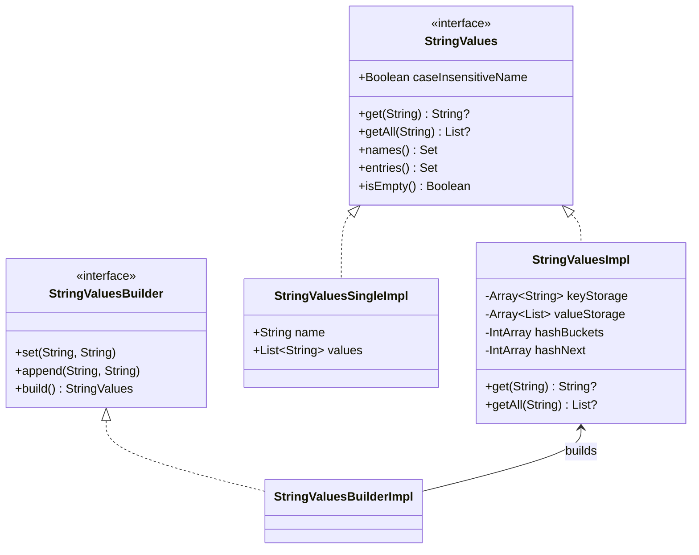
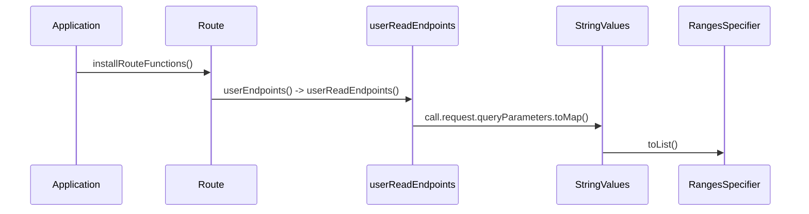
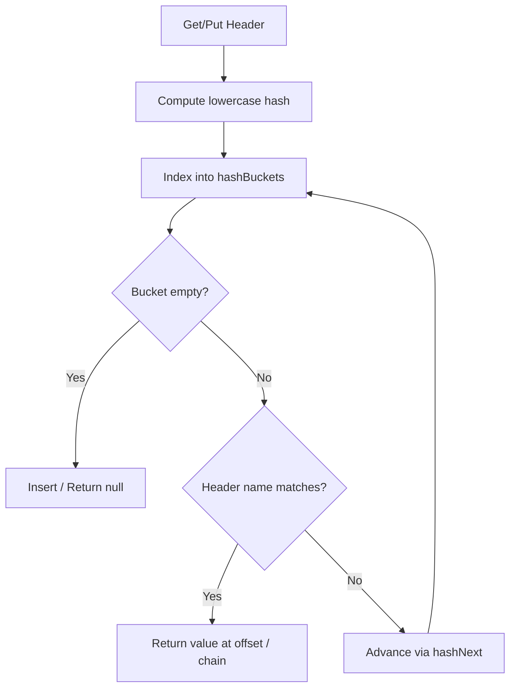
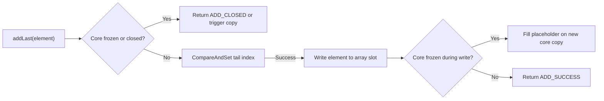

# Shared Utilities

<details>
<summary>Relevant source files</summary>

The following files were used as context for generating this wiki page:

- [ktor-utils/common/src/io/ktor/util/StringValues.kt](https://github.com/ktorio/ktor/blob/main/ktor-utils/common/src/io/ktor/util/StringValues.kt)
- [ktor-http/ktor-http-cio/common/src/io/ktor/http/cio/HttpHeadersMap.kt](https://github.com/ktorio/ktor/blob/main/ktor-http/ktor-http-cio/common/src/io/ktor/http/cio/HttpHeadersMap.kt)
- [ktor-utils/posix/src/io/ktor/util/collections/LockFreeMPSCQueueNative.kt](https://github.com/ktorio/ktor/blob/main/ktor-utils/posix/src/io/ktor/util/collections/LockFreeMPSCQueueNative.kt)
- [ktor-client/ktor-client-curl/desktop/src/io/ktor/client/engine/curl/internal/CurlMultiApiHandler.kt](https://github.com/ktorio/ktor/blob/main/ktor-client/ktor-client-curl/desktop/src/io/ktor/client/engine/curl/internal/CurlMultiApiHandler.kt)
- [ktor-network/jvm/src/io/ktor/network/selector/LockFreeMPSCQueue.kt](https://github.com/ktorio/ktor/blob/main/ktor-network/jvm/src/io/ktor/network/selector/LockFreeMPSCQueue.kt)
- [ktor-utils/common/src/io/ktor/util/collections/CopyOnWriteHashMap.kt](https://github.com/ktorio/ktor/blob/main/ktor-utils/common/src/io/ktor/util/collections/CopyOnWriteHashMap.kt)
- [ktor-utils/common/src/io/ktor/util/collections/CollectionUtils.kt](https://github.com/ktorio/ktor/blob/main/ktor-utils/common/src/io/ktor/util/collections/CollectionUtils.kt)
- [ktor-utils/posix/src/io/ktor/util/collections/ConcurrentMapNative.kt](https://github.com/ktorio/ktor/blob/main/ktor-utils/posix/src/io/ktor/util/collections/ConcurrentMapNative.kt)
- [ktor-utils/posix/src/io/ktor/util/AttributesNative.kt](https://github.com/ktorio/ktor/blob/main/ktor-utils/posix/src/io/ktor/util/AttributesNative.kt)
- [ktor-utils/common/src/io/ktor/util/Attributes.kt](https://github.com/ktorio/ktor/blob/main/ktor-utils/common/src/io/ktor/util/Attributes.kt)
- [ktor-utils/web/src/io/ktor/util/collections/ConcurrentMap.web.kt](https://github.com/ktorio/ktor/blob/main/ktor-utils/web/src/io/ktor/util/collections/ConcurrentMap.web.kt)
- [ktor-server/ktor-server-netty/jvm/src/io/ktor/server/netty/http/HttpMultiplexedResponseHeaders.kt](https://github.com/ktorio/ktor/blob/main/ktor-server/ktor-server-netty/jvm/src/io/ktor/server/netty/http/HttpMultiplexedResponseHeaders.kt)
- [ktor-server/ktor-server-plugins/ktor-server-sessions/jvm/src/io/ktor/server/sessions/CacheJvm.kt](https://github.com/ktorio/ktor/blob/main/ktor-server/ktor-server-plugins/ktor-server-sessions/jvm/src/io/ktor/server/sessions/CacheJvm.kt)
- [ktor-utils/jvm/src/io/ktor/util/AttributesJvm.kt](https://github.com/ktorio/ktor/blob/main/ktor-utils/jvm/src/io/ktor/util/AttributesJvm.kt)
- [ktor-client/ktor-client-curl/desktop/src/io/ktor/client/engine/curl/internal/CurlAdapters.kt](https://github.com/ktorio/ktor/blob/main/ktor-client/ktor-client-curl/desktop/src/io/ktor/client/engine/curl/internal/CurlAdapters.kt)
- [ktor-utils/common/src/io/ktor/util/collections/ConcurrentMap.kt](https://github.com/ktorio/ktor/blob/main/ktor-utils/common/src/io/ktor/util/collections/ConcurrentMap.kt)
- [ktor-utils/common/src/io/ktor/util/collections/MapDelegates.kt](https://github.com/ktorio/ktor/blob/main/ktor-utils/common/src/io/ktor/util/collections/MapDelegates.kt)
- [ktor-utils/posix/src/io/ktor/util/converters/ConversionServiceNative.kt](https://github.com/ktorio/ktor/blob/main/ktor-utils/posix/src/io/ktor/util/converters/ConversionServiceNative.kt)
- [ktor-server/ktor-server-core/common/src/io/ktor/server/util/CopyOnWriteHashMap.kt](https://github.com/ktorio/ktor/blob/main/ktor-server/ktor-server-core/common/src/io/ktor/server/util/CopyOnWriteHashMap.kt)
- [ktor-server/ktor-server-plugins/ktor-server-di/common/src/io/ktor/server/plugins/di/DeferredDependencyMap.kt](https://github.com/ktorio/ktor/blob/main/ktor-server/ktor-server-plugins/ktor-server-di/common/src/io/ktor/server/plugins/di/DeferredDependencyMap.kt)
- [ktor-utils/common/src/io/ktor/util/collections/ConcurrentSet.kt](https://github.com/ktorio/ktor/blob/main/ktor-utils/common/src/io/ktor/util/collections/ConcurrentSet.kt)
- [ktor-compiler-plugin/testData/openapi/RouteFunctions.kt](https://github.com/ktorio/ktor/blob/main/ktor-compiler-plugin/testData/openapi/RouteFunctions.kt)
- [ktor-http/common/src/io/ktor/http/content/Versions.kt](https://github.com/ktorio/ktor/blob/main/ktor-http/common/src/io/ktor/http/content/Versions.kt)
- [ktor-http/common/src/io/ktor/http/RangesSpecifier.kt](https://github.com/ktorio/ktor/blob/main/ktor-http/common/src/io/ktor/http/RangesSpecifier.kt)
- [ktor-server/ktor-server-core/common/src/io/ktor/server/util/Paths.kt](https://github.com/ktorio/ktor/blob/main/ktor-server/ktor-server-core/common/src/io/ktor/server/util/Paths.kt)
- [ktor-server/ktor-server-core/jvm/src/io/ktor/server/http/content/StaticContentResolution.kt](https://github.com/ktorio/ktor/blob/main/ktor-server/ktor-server-core/jvm/src/io/ktor/server/http/content/StaticContentResolution.kt)
- [ktor-utils/common/src/io/ktor/util/Collections.kt](https://github.com/ktorio/ktor/blob/main/ktor-utils/common/src/io/ktor/util/Collections.kt)
</details>

## Overview

The Shared Utilities subsystem (`ktor-utils`, `ktor-http-cio`, and associated helper modules) provides foundational data structures, concurrent collections, attribute containers, HTTP header mappings, and path-processing primitives utilized across Ktor client, server, and networking layers. These utilities bridge cross-platform Multiplatform constraints (such as differing concurrency primitives on JVM, Web, and Native/POSIX targets) while delivering zero-allocation or memory-efficient abstractions for high-throughput network operations.

Sources: [ktor-utils/common/src/io/ktor/util/StringValues.kt:1-35](https://github.com/ktorio/ktor/blob/main/ktor-utils/common/src/io/ktor/util/StringValues.kt#L1-L35)

A central design decision across Ktor's utility layer is the elimination of unnecessary iterator and boxing allocations during hot paths. For instance, `StringValuesImpl` stores keys and values in parallel arrays backed by open-addressing hash buckets rather than standard boxed collection wrappers, while `HttpHeadersMap` uses pooled integer arrays (`HeadersData`) and raw character offsets against a shared `CharArrayBuilder`.

Sources: [ktor-utils/common/src/io/ktor/util/StringValues.kt:183-195](https://github.com/ktorio/ktor/blob/main/ktor-utils/common/src/io/ktor/util/StringValues.kt#L183-L195), [ktor-http/ktor-http-cio/common/src/io/ktor/http/cio/HttpHeadersMap.kt:40-46](https://github.com/ktorio/ktor/blob/main/ktor-http/ktor-http-cio/common/src/io/ktor/http/cio/HttpHeadersMap.kt#L40-L46)

Concurrency across different target platforms is unified via expected/actual declarations for map and queue structures, such as lock-free MPSC queues and thread-safe attribute maps. By standardizing these core building blocks, Ktor maintains consistent behavior for case-insensitive header management, concurrent request/response processing, static resource resolution, and partial content range parsing across diverse operating systems and asynchronous runtimes.

Sources: [ktor-utils/posix/src/io/ktor/util/collections/LockFreeMPSCQueueNative.kt:25-33](https://github.com/ktorio/ktor/blob/main/ktor-utils/posix/src/io/ktor/util/collections/LockFreeMPSCQueueNative.kt#L25-L33), [ktor-utils/posix/src/io/ktor/util/AttributesNative.kt:16-19](https://github.com/ktorio/ktor/blob/main/ktor-utils/posix/src/io/ktor/util/AttributesNative.kt#L16-L19)

---

## String Values and Multi-Value Maps

The `StringValues` interface and its implementations (`StringValuesImpl`, `StringValuesSingleImpl`, and `StringValuesBuilderImpl`) manage mappings between string keys and lists of string values. This abstraction underpins HTTP headers, query parameters, and form parameters where a single key may be associated with multiple values.

Sources: [ktor-utils/common/src/io/ktor/util/StringValues.kt:14-34](https://github.com/ktorio/ktor/blob/main/ktor-utils/common/src/io/ktor/util/StringValues.kt#L14-L34)

`StringValuesImpl` optimizes memory overhead by storing keys and values in parallel arrays (`keyStorage` and `valueStorage`) alongside an integer hash table (`hashBuckets` and collision chains via `hashNext`). When initialized, table sizes are calculated as powers of two via `tableSizeFor`.

Sources: [ktor-utils/common/src/io/ktor/util/StringValues.kt:183-191](https://github.com/ktorio/ktor/blob/main/ktor-utils/common/src/io/ktor/util/StringValues.kt#L183-L191)



Sources: [ktor-utils/common/src/io/ktor/util/StringValues.kt:14-127](https://github.com/ktorio/ktor/blob/main/ktor-utils/common/src/io/ktor/util/StringValues.kt#L14-L127)

Iterating over `StringValuesImpl` avoids allocating iterators entirely by executing a direct index loop over `entryCount`. Case-insensitive configurations delegate hashing to `caseInsensitiveHashCode()`, which normalizes characters via `lowercaseChar()`.

Sources: [ktor-utils/common/src/io/ktor/util/StringValues.kt:300-305](https://github.com/ktorio/ktor/blob/main/ktor-utils/common/src/io/ktor/util/StringValues.kt#L300-L305), [ktor-utils/common/src/io/ktor/util/StringValues.kt:361-367](https://github.com/ktorio/ktor/blob/main/ktor-utils/common/src/io/ktor/util/StringValues.kt#L361-L367)

To trace how query parameter maps flow through routing and conversion layers, the verified call-chain execution walkthrough (`installRouteFunctions` → `userEndpoints` → `userReadEndpoints` → `toMap` → `toList`) demonstrates how routing configurations extract query parameters into maps before obtaining list projections: `installRouteFunctions()` invokes `userEndpoints()`, which descends into `userReadEndpoints()`, calling `toMap()` on query parameter values, which subsequently executes `toList()` to convert internal structures into range specifier lists.

Sources: [ktor-compiler-plugin/testData/openapi/RouteFunctions.kt:16-41](https://github.com/ktorio/ktor/blob/main/ktor-compiler-plugin/testData/openapi/RouteFunctions.kt#L16-L41), [ktor-compiler-plugin/testData/openapi/RouteFunctions.kt:71-82](https://github.com/ktorio/ktor/blob/main/ktor-compiler-plugin/testData/openapi/RouteFunctions.kt#L71-L82), [ktor-utils/common/src/io/ktor/util/StringValues.kt:520-522](https://github.com/ktorio/ktor/blob/main/ktor-utils/common/src/io/ktor/util/StringValues.kt#L520-L522), [ktor-http/common/src/io/ktor/http/RangesSpecifier.kt:83-85](https://github.com/ktorio/ktor/blob/main/ktor-http/common/src/io/ktor/http/RangesSpecifier.kt#L83-L85)



Sources: [ktor-compiler-plugin/testData/openapi/RouteFunctions.kt:16-41](https://github.com/ktorio/ktor/blob/main/ktor-compiler-plugin/testData/openapi/RouteFunctions.kt#L16-L41), [ktor-compiler-plugin/testData/openapi/RouteFunctions.kt:71-82](https://github.com/ktorio/ktor/blob/main/ktor-compiler-plugin/testData/openapi/RouteFunctions.kt#L71-L82), [ktor-utils/common/src/io/ktor/util/StringValues.kt:520-522](https://github.com/ktorio/ktor/blob/main/ktor-utils/common/src/io/ktor/util/StringValues.kt#L520-L522), [ktor-http/common/src/io/ktor/http/RangesSpecifier.kt:83-85](https://github.com/ktorio/ktor/blob/main/ktor-http/common/src/io/ktor/http/RangesSpecifier.kt#L83-L85)

---

## CIO HTTP Headers Map

`HttpHeadersMap` is a specialized, zero-allocation-friendly headers container used in Ktor's CIO (Coroutine-based I/O) engine. It wraps a `CharArrayBuilder` and references index ranges inside pooled integer arrays.

Sources: [ktor-http/ktor-http-cio/common/src/io/ktor/http/cio/HttpHeadersMap.kt:35-45](https://github.com/ktorio/ktor/blob/main/ktor-http/ktor-http-cio/common/src/io/ktor/http/cio/HttpHeadersMap.kt#L35-L45)

Each header entry occupies 6 integers within `HeadersData`:
1. `OFFSET_NAME_HASH` (0): Name hash for O(1) bucket lookups.
2. `OFFSET_HEADER_NAME_START` (1): Start index in the character builder.
3. `OFFSET_HEADER_NAME_END` (2): Exclusive end index of the name.
4. `OFFSET_HEADER_VALUE_START` (3): Start index of the value.
5. `OFFSET_HEADER_VALUE_END` (4): Exclusive end index of the value.
6. `OFFSET_NEXT_HEADER` (5): Index of the next header with the same hash bucket collision chain.

Sources: [ktor-http/ktor-http-cio/common/src/io/ktor/http/cio/HttpHeadersMap.kt:14-34](https://github.com/ktorio/ktor/blob/main/ktor-http/ktor-http-cio/common/src/io/ktor/http/cio/HttpHeadersMap.kt#L14-L34)



Sources: [ktor-http/ktor-http-cio/common/src/io/ktor/http/cio/HttpHeadersMap.kt:66-80](https://github.com/ktorio/ktor/blob/main/ktor-http/ktor-http-cio/common/src/io/ktor/http/cio/HttpHeadersMap.kt#L66-L80)

When the map size reaches `RESIZE_THRESHOLD` (0.75) of `headerCapacity`, `resize()` doubles the capacity, re-borrows a larger `HeadersData` instance from `HeadersDataPool`, and re-inserts all existing entries.

Sources: [ktor-http/ktor-http-cio/common/src/io/ktor/http/cio/HttpHeadersMap.kt:47-48](https://github.com/ktorio/ktor/blob/main/ktor-http/ktor-http-cio/common/src/io/ktor/http/cio/HttpHeadersMap.kt#L47-L48), [ktor-http/ktor-http-cio/common/src/io/ktor/http/cio/HttpHeadersMap.kt:171-190](https://github.com/ktorio/ktor/blob/main/ktor-http/ktor-http-cio/common/src/io/ktor/http/cio/HttpHeadersMap.kt#L171-L190)

> [!WARNING]
> `HttpHeadersMap` relies on external backing arrays pooled via `IntArrayPool` (capacity 1000). Always ensure buffers and header maps are properly released to avoid memory leaks in high-load scenarios.

Sources: [ktor-http/ktor-http-cio/common/src/io/ktor/http/cio/HttpHeadersMap.kt:23-24](https://github.com/ktorio/ktor/blob/main/ktor-http/ktor-http-cio/common/src/io/ktor/http/cio/HttpHeadersMap.kt#L23-L24), [ktor-http/ktor-http-cio/common/src/io/ktor/http/cio/HttpHeadersMap.kt:210-215](https://github.com/ktorio/ktor/blob/main/ktor-http/ktor-http-cio/common/src/io/ktor/http/cio/HttpHeadersMap.kt#L210-L215)

---

## Lock-Free MPSC Queues

`LockFreeMPSCQueue` (implemented for JVM and POSIX targets) is a lock-free, Multi-Producer Single-Consumer queue providing quiescent consistency. It uses a ring-buffer core (`LockFreeMPSCQueueCore`) with an atomic `stateRef` combining head, tail, frozen, and closed flags packed into a 64-bit integer.

Sources: [ktor-utils/posix/src/io/ktor/util/collections/LockFreeMPSCQueueNative.kt:25-31](https://github.com/ktorio/ktor/blob/main/ktor-utils/posix/src/io/ktor/util/collections/LockFreeMPSCQueueNative.kt#L25-L31), [ktor-utils/posix/src/io/ktor/util/collections/LockFreeMPSCQueueNative.kt:71-75](https://github.com/ktorio/ktor/blob/main/ktor-utils/posix/src/io/ktor/util/collections/LockFreeMPSCQueueNative.kt#L71-L75)

| State Flag / Mask | Bit Shift / Value | Purpose |
| :--- | :--- | :--- |
| `HEAD_MASK` | Bits 0–29 | Consumer head index tracking removal position. |
| `TAIL_MASK` | Bits 30–59 | Producer tail index tracking insertion position. |
| `FROZEN_MASK` | Bit 60 | Indicates the core array is full/freezing and must be resized/copied. |
| `CLOSED_MASK` | Bit 61 | Indicates the queue is closed for further additions. |

Sources: [ktor-utils/posix/src/io/ktor/util/collections/LockFreeMPSCQueueNative.kt:224-235](https://github.com/ktorio/ktor/blob/main/ktor-utils/posix/src/io/ktor/util/collections/LockFreeMPSCQueueNative.kt#L224-L235)

When a producer attempts `addLast()` on a full queue, `stateRef` detects that the buffer requires expansion (`ADD_FROZEN`), triggers `next()`, and allocates a new core with double the capacity (`allocateNextCopy()`). If a copy occurs concurrently while a producer has reserved a tail slot but not yet written its value, a `Placeholder` object referencing the absolute index is placed in the array slot to prevent data corruption.

Sources: [ktor-utils/posix/src/io/ktor/util/collections/LockFreeMPSCQueueNative.kt:99-120](https://github.com/ktorio/ktor/blob/main/ktor-utils/posix/src/io/ktor/util/collections/LockFreeMPSCQueueNative.kt#L99-L120), [ktor-utils/posix/src/io/ktor/util/collections/LockFreeMPSCQueueNative.kt:200-213](https://github.com/ktorio/ktor/blob/main/ktor-utils/posix/src/io/ktor/util/collections/LockFreeMPSCQueueNative.kt#L200-L213)



Sources: [ktor-utils/posix/src/io/ktor/util/collections/LockFreeMPSCQueueNative.kt:99-120](https://github.com/ktorio/ktor/blob/main/ktor-utils/posix/src/io/ktor/util/collections/LockFreeMPSCQueueNative.kt#L99-L120)

> [!NOTE]
> This queue is **not linearizable**. Concurrent `addLast` and `removeFirstOrNull` operations across threads permit non-linearizable execution traces (e.g., `removeFirstOrNull()` returning `null` immediately after a concurrent `addLast()` succeeds).

Sources: [ktor-utils/posix/src/io/ktor/util/collections/LockFreeMPSCQueueNative.kt:14-22](https://github.com/ktorio/ktor/blob/main/ktor-utils/posix/src/io/ktor/util/collections/LockFreeMPSCQueueNative.kt#L14-L22)

---

## Concurrent Collections and Copy-On-Write Maps

Ktor provides cross-platform concurrent map and set implementations tailored to target constraints:

Sources: [ktor-utils/common/src/io/ktor/util/collections/ConcurrentMap.kt:14-24](https://github.com/ktorio/ktor/blob/main/ktor-utils/common/src/io/ktor/util/collections/ConcurrentMap.kt#L14-L24), [ktor-utils/common/src/io/ktor/util/collections/ConcurrentSet.kt:13-20](https://github.com/ktorio/ktor/blob/main/ktor-utils/common/src/io/ktor/util/collections/ConcurrentSet.kt#L13-L20)

- **`ConcurrentMap`**: Expect/actual implementation. On JVM-like runtimes or Web targets, it delegates to synchronized or standard maps with `computeIfAbsent` support. On POSIX targets (`ConcurrentMapNative.kt`), it wraps a `LinkedHashMap` guarded by a `SynchronizedObject` lock, ensuring thread-safe map operations.

Sources: [ktor-utils/posix/src/io/ktor/util/collections/ConcurrentMapNative.kt:16-32](https://github.com/ktorio/ktor/blob/main/ktor-utils/posix/src/io/ktor/util/collections/ConcurrentMapNative.kt#L16-L32)

- **`ConcurrentSet`**: Implemented on top of `ConcurrentMap<Key, Unit>`, providing thread-safe set semantics, atomic insertions via `computeIfAbsent`, and safe iterator removal checks.

Sources: [ktor-utils/common/src/io/ktor/util/collections/ConcurrentSet.kt:13-42](https://github.com/ktorio/ktor/blob/main/ktor-utils/common/src/io/ktor/util/collections/ConcurrentSet.kt#L13-L42)

- **`CopyOnWriteHashMap`**: An internal concurrent map implementation where modification methods (`put`, `remove`, `computeIfAbsent`) operate within a lock-free retry loop (`atomic` reference swapping using `compareAndSet` on a new `HashMap(old)` copy).

Sources: [ktor-utils/common/src/io/ktor/util/collections/CopyOnWriteHashMap.kt:17-36](https://github.com/ktorio/ktor/blob/main/ktor-utils/common/src/io/ktor/util/collections/CopyOnWriteHashMap.kt#L17-L36)

| Collection Class | Concurrency Mechanism | Target Platform | Primary Use Case |
| :--- | :--- | :--- | :--- |
| `ConcurrentMap` | Mutex lock (`SynchronizedObject`) | POSIX / Native | Thread-safe key-value storage without JVM java.util.concurrent |
| `ConcurrentMap` | Target native map / delegate | JVM / Web | Platform-native concurrent structures |
| `ConcurrentSet` | Backed by `ConcurrentMap` | Common / All | Thread-safe unique element sets |
| `CopyOnWriteHashMap` | Atomic reference CAS + copy | Common / All | Low-frequency mutation, high-frequency read caches |

Sources: [ktor-utils/posix/src/io/ktor/util/collections/ConcurrentMapNative.kt:16-20](https://github.com/ktorio/ktor/blob/main/ktor-utils/posix/src/io/ktor/util/collections/ConcurrentMapNative.kt#L16-L20), [ktor-utils/common/src/io/ktor/util/collections/ConcurrentSet.kt:13-15](https://github.com/ktorio/ktor/blob/main/ktor-utils/common/src/io/ktor/util/collections/ConcurrentSet.kt#L13-L15), [ktor-utils/common/src/io/ktor/util/collections/CopyOnWriteHashMap.kt:17-20](https://github.com/ktorio/ktor/blob/main/ktor-utils/common/src/io/ktor/util/collections/CopyOnWriteHashMap.kt#L17-L20)

---

## Type-Safe Attributes (`Attributes`)

The `Attributes` interface provides a typed, key-value storage container indexed by `AttributeKey<T>`.

Sources: [ktor-utils/common/src/io/ktor/util/Attributes.kt:70-76](https://github.com/ktorio/ktor/blob/main/ktor-utils/common/src/io/ktor/util/Attributes.kt#L70-L76)

`AttributeKey<T>` encapsulates a diagnostic `name` and a Kotlin `TypeInfo` object. Keys are validated to ensure their name is not blank (`require(name.isNotBlank())`).

Sources: [ktor-utils/common/src/io/ktor/util/Attributes.kt:32-38](https://github.com/ktorio/ktor/blob/main/ktor-utils/common/src/io/ktor/util/Attributes.kt#L32-L38)

Platform-specific factories (`Attributes(concurrent: Boolean)`) instantiate:
- **JVM (`AttributesJvm.kt`)**: `ConcurrentSafeAttributes` (backed by `ConcurrentHashMap`) when `concurrent = true`, or `HashMapAttributes` (backed by standard `HashMap`) when `concurrent = false`.

Sources: [ktor-utils/jvm/src/io/ktor/util/AttributesJvm.kt:14-15](https://github.com/ktorio/ktor/blob/main/ktor-utils/jvm/src/io/ktor/util/AttributesJvm.kt#L14-L15), [ktor-utils/jvm/src/io/ktor/util/AttributesJvm.kt:37-38](https://github.com/ktorio/ktor/blob/main/ktor-utils/jvm/src/io/ktor/util/AttributesJvm.kt#L37-L38), [ktor-utils/jvm/src/io/ktor/util/AttributesJvm.kt:54-55](https://github.com/ktorio/ktor/blob/main/ktor-utils/jvm/src/io/ktor/util/AttributesJvm.kt#L54-L55)

- **POSIX (`AttributesNative.kt`)**: `AttributesNative` backed by a `ConcurrentMap`.

Sources: [ktor-utils/posix/src/io/ktor/util/AttributesNative.kt:16-19](https://github.com/ktorio/ktor/blob/main/ktor-utils/posix/src/io/ktor/util/AttributesNative.kt#L16-L19)

Key extension operations include `take(key)` (which retrieves and immediately removes an attribute) and `takeOrNull(key)`.

Sources: [ktor-utils/common/src/io/ktor/util/Attributes.kt:121-128](https://github.com/ktorio/ktor/blob/main/ktor-utils/common/src/io/ktor/util/Attributes.kt#L121-L128)

```kotlin
// Example: Creating an attribute key and storing a value in a concurrent Attributes instance
val MyPluginKey = AttributeKey<String>("MyPluginSession")
val attributes = Attributes(concurrent = true)

// Store and retrieve
attributes.put(MyPluginKey, "ActiveSessionValue")
val session = attributes[MyPluginKey]
```

Sources: [ktor-utils/common/src/io/ktor/util/Attributes.kt:20-22](https://github.com/ktorio/ktor/blob/main/ktor-utils/common/src/io/ktor/util/Attributes.kt#L20-L22), [ktor-utils/jvm/src/io/ktor/util/AttributesJvm.kt:14-15](https://github.com/ktorio/ktor/blob/main/ktor-utils/jvm/src/io/ktor/util/AttributesJvm.kt#L14-L15)

---

## HTTP Content Versions and Conditional Headers

The `Versions.kt` module implements HTTP conditional request validation via the `Version` interface, supporting `LastModifiedVersion` and `EntityTagVersion` (ETag).

Sources: [ktor-http/common/src/io/ktor/http/content/Versions.kt:34-48](https://github.com/ktorio/ktor/blob/main/ktor-http/common/src/io/ktor/http/content/Versions.kt#L34-L48)

`EntityTagVersion` parses and validates etag specs, ensuring weak tags are not applied to wildcard `*` tags and rejecting control characters. When `check(requestHeaders)` runs:
1. `If-None-Match` headers are parsed and evaluated via `noneMatch()`. If any given etag matches, it returns `VersionCheckResult.NOT_MODIFIED`.
2. `If-Match` headers are evaluated via `match()`. If none match, it returns `VersionCheckResult.PRECONDITION_FAILED`.
3. Otherwise, it returns `VersionCheckResult.OK`.

Sources: [ktor-http/common/src/io/ktor/http/content/Versions.kt:176-210](https://github.com/ktorio/ktor/blob/main/ktor-http/common/src/io/ktor/http/content/Versions.kt#L176-L210)

`LastModifiedVersion` truncates dates to seconds (`truncateToSeconds()`) and evaluates `If-Modified-Since` (returning `NOT_MODIFIED` if modification time is not after requested dates) and `If-Unmodified-Since` (returning `PRECONDITION_FAILED` if modification time is after requested dates).

Sources: [ktor-http/common/src/io/ktor/http/content/Versions.kt:92-115](https://github.com/ktorio/ktor/blob/main/ktor-http/common/src/io/ktor/http/content/Versions.kt#L92-L115)

---

## Path Normalization and Static Resource Resolution

Server utilities include path traversal protection and static resource resolution:
- **`normalizePathComponents()`**: Processes path segment lists (`Paths.kt`), stripping redundant components (`.`, `~`, empty strings), handling parent directory traversal (`..` by removing the last accumulated segment), discarding Windows reserved device words (`CON`, `PRN`, `AUX`, `NUL`, `COM1`-`COM9`, `LPT1`-`LPT9`), and filtering out control or reserved characters (`\`, `/`, `:`, `*`, `?`, `"`, `<`, `>`, `|`).

Sources: [ktor-server/ktor-server-core/common/src/io/ktor/server/util/Paths.kt:15-64](https://github.com/ktorio/ktor/blob/main/ktor-server/ktor-server-core/common/src/io/ktor/server/util/Paths.kt#L15-L64)

- **`resolveResource()`**: Resolves classpath resources (`StaticContentResolution.kt`) across ClassLoaders, caching resolved URLs in a `resourceCache` map. `resourceClasspathResource()` inspects URL protocols (`file`, `jar`, `jrt`, `resource`) to return appropriate `LocalFileContent`, `JarFileContent`, or `URIFileContent` wrappers while rejecting directory paths ending in `/` or `\`.

Sources: [ktor-server/ktor-server-core/jvm/src/io/ktor/server/http/content/StaticContentResolution.kt:28-110](https://github.com/ktorio/ktor/blob/main/ktor-server/ktor-server-core/jvm/src/io/ktor/server/http/content/StaticContentResolution.kt#L28-L110)

---

## Design Trade-Offs

| Design Choice | Benefit | Cost |
| :--- | :--- | :--- |
| **Parallel arrays in `StringValuesImpl`** | Zero iterator allocations and minimal memory overhead during iteration. | More complex insertion and resizing logic compared to standard boxed `Map` wrappers. |
| **Packed 64-bit state in `LockFreeMPSCQueue`** | Atomic updates of head, tail, and flags in a single CAS operation without locking. | Limited capacity range (30 bits per index, max capacity mask bounds). |
| **Pooled `HeadersData` in `HttpHeadersMap`** | Avoids frequent GC pressure by reusing preallocated integer arrays. | Requires manual lifecycle management (`release()`, borrowing/recycling pools). |
| **`CopyOnWriteHashMap` reference swapping** | Lock-free, thread-safe reads with zero contention. | High allocation overhead on writes due to full `HashMap` duplication on every mutation. |

Sources: [ktor-utils/common/src/io/ktor/util/StringValues.kt:183-191](https://github.com/ktorio/ktor/blob/main/ktor-utils/common/src/io/ktor/util/StringValues.kt#L183-L191), [ktor-utils/posix/src/io/ktor/util/collections/LockFreeMPSCQueueNative.kt:71-75](https://github.com/ktorio/ktor/blob/main/ktor-utils/posix/src/io/ktor/util/collections/LockFreeMPSCQueueNative.kt#L71-L75), [ktor-http/ktor-http-cio/common/src/io/ktor/http/cio/HttpHeadersMap.kt:40-46](https://github.com/ktorio/ktor/blob/main/ktor-http/ktor-http-cio/common/src/io/ktor/http/cio/HttpHeadersMap.kt#L40-L46), [ktor-utils/common/src/io/ktor/util/collections/CopyOnWriteHashMap.kt:17-36](https://github.com/ktorio/ktor/blob/main/ktor-utils/common/src/io/ktor/util/collections/CopyOnWriteHashMap.kt#L17-L36)

## Related

- [[Byte Channels]]

